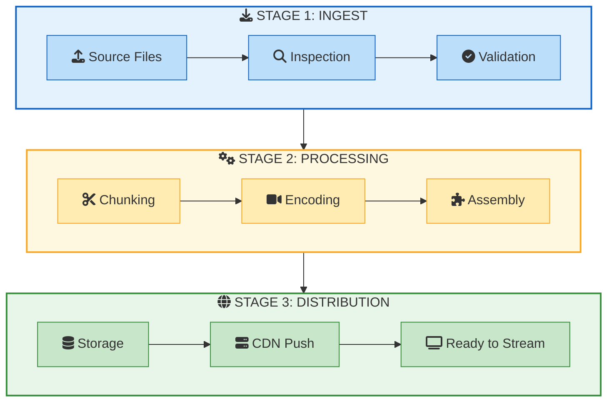
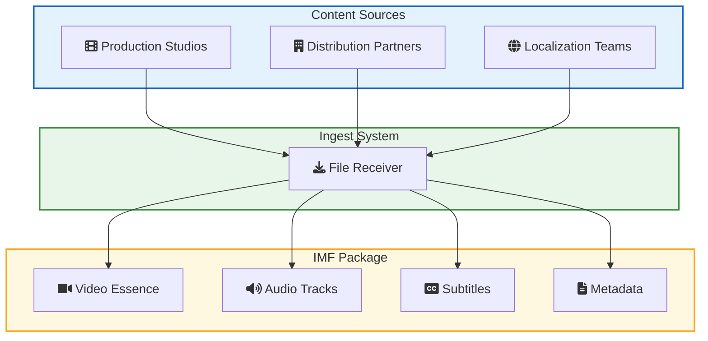
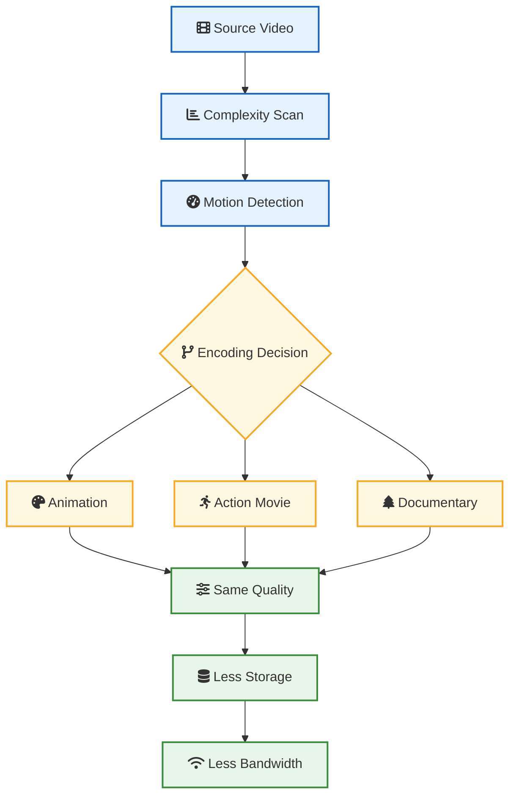
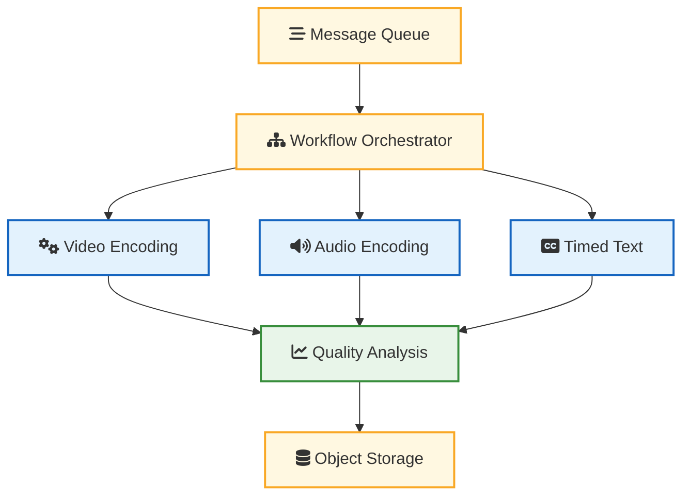
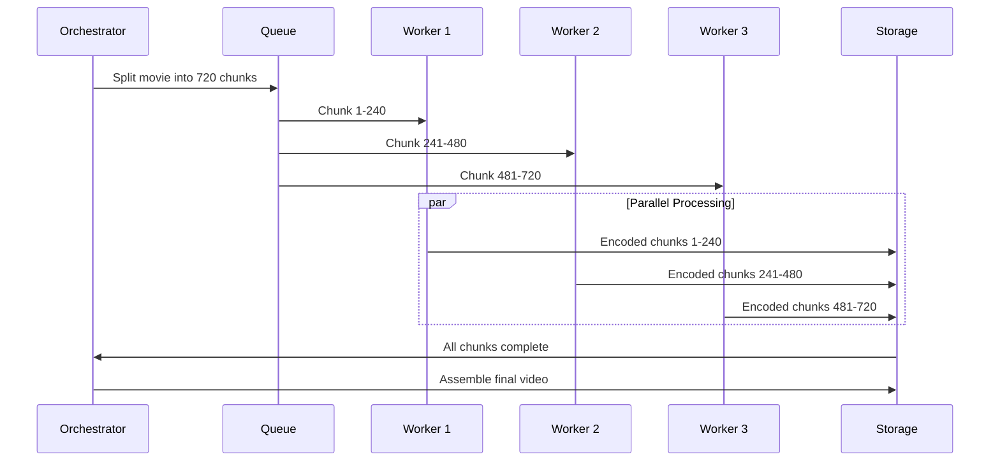
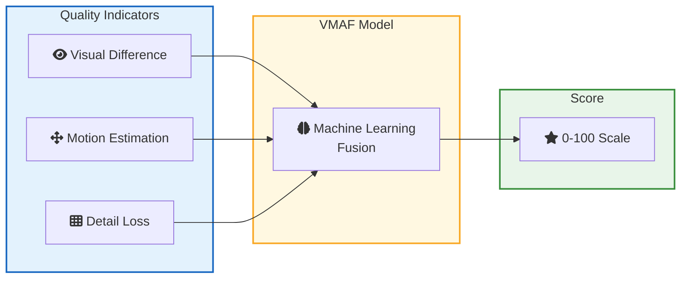
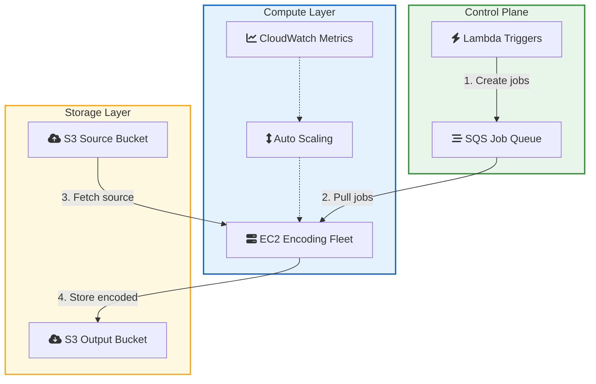
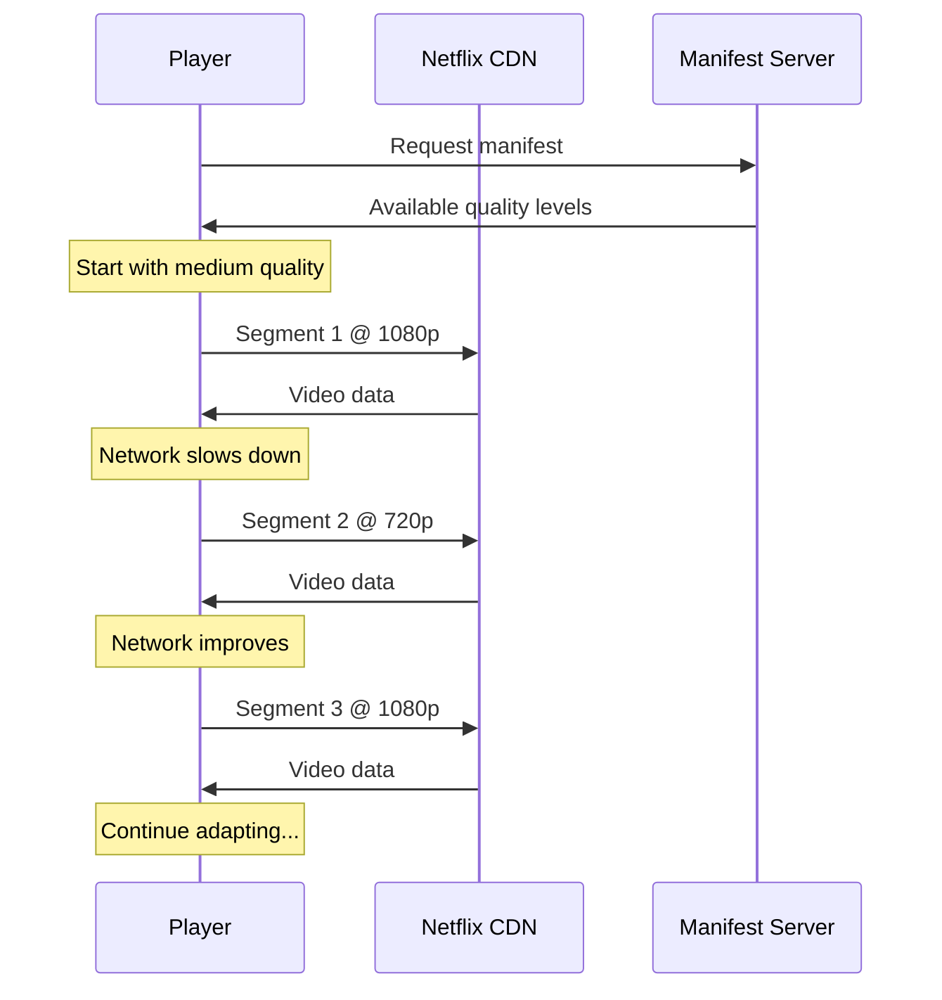
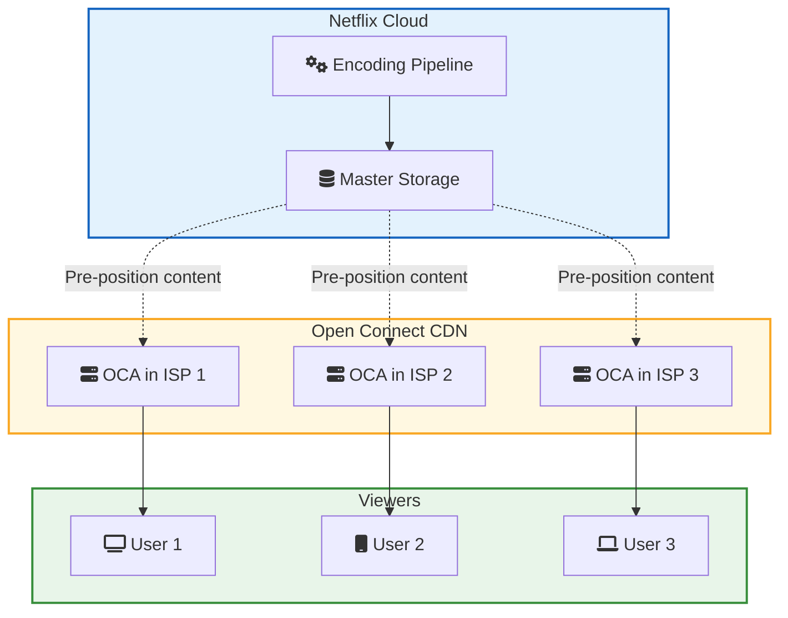

Netflix streams to 280 million subscribers across 190 countries. Every movie and TV show you watch has been processed by their video pipeline before it reaches your screen.

This is not a simple upload. Each title gets encoded into dozens of different quality levels. A single movie might produce over 1,200 video files. All optimized for different devices, screen sizes, and network conditions.

The engineering behind this is impressive. Netflix rebuilt their entire video processing system from a monolithic application into microservices. They open-sourced VMAF, which is now the industry standard for measuring video quality. And they do it all at massive scale on AWS.

This post breaks down how their pipeline works and what software developers can learn from it.

---

## The Scale of Netflix Video Processing

Before diving into architecture, let me put some numbers on what Netflix handles:

| Metric | Value |
|--------|-------|
| Subscribers | 280+ million |
| Countries | 190 |
| Titles in catalog | 17,000+ |
| New content hours per year | Thousands |
| Encodes per title | 100+ variants |
| Quality metric | VMAF (open-source) |

Every piece of content needs processing before it can stream. Original productions, licensed content, and localized versions all go through the same pipeline.

The challenge is not just encoding videos. It is doing it reliably, quickly, and at consistent quality across thousands of titles.

---

## The Three Stage Pipeline

Netflix's video processing follows three main stages. Each stage is a separate system that can scale independently.



Let me explain what happens at each stage.

---

## Stage 1: Content Ingest and Inspection

### How Content Arrives

Content comes from multiple sources. Netflix Originals come from production studios. Licensed content comes from distribution partners. Each source delivers files in different formats.

Netflix uses the Interoperable Master Format (IMF) for content delivery. IMF is an industry standard that separates video, audio, and metadata into distinct files. This makes it easier to handle multiple languages and versions.



### Automated Inspection

Before processing begins, every file goes through automated inspection. The system checks:

| Check | Purpose |
|-------|---------|
| Format validation | Ensure files meet technical specifications |
| Audio sync | Verify audio and video are aligned |
| Corruption detection | Find damaged frames or audio dropouts |
| Color space | Confirm correct HDR/SDR metadata |
| Frame rate | Validate consistent timing |

Problems caught here save hours of wasted encoding time. A corrupted source file would produce corrupted outputs at every quality level.

**Developer lesson:** Validate inputs before expensive processing. The earlier you catch problems, the cheaper they are to fix. This applies to any data pipeline, not just video. See [Role of Queues in System Design](/role-of-queues-in-system-design/) for patterns on building robust processing pipelines.

---

## Stage 2: Video Encoding

This is where the heavy lifting happens. Netflix needs to create multiple versions of each video optimized for different viewing conditions.

### The Encoding Challenge

A viewer watching on a 4K TV with gigabit internet needs different video than someone watching on a phone over cellular data. Netflix creates an encoding ladder: a set of quality levels that cover all scenarios.

| Resolution | Typical Bitrate | Target Device |
|------------|-----------------|---------------|
| 4K HDR | 15+ Mbps | Smart TVs, high-end displays |
| 1080p | 5-8 Mbps | Laptops, tablets |
| 720p | 3-5 Mbps | Phones, slower connections |
| 480p | 1-2 Mbps | Very slow connections |
| 240p | 0.3-0.5 Mbps | Emergency fallback |

But here is the insight that changed everything: not all content needs the same bitrate to look good.

### Per-Title Encoding

An animated movie like "Spider-Man: Into the Spider-Verse" has flat colors and sharp edges. A nature documentary like "Our Planet" has complex textures and constant motion. They have completely different encoding requirements.

Netflix pioneered per-title encoding. Instead of using a fixed encoding ladder for everything, they analyze each title and create a custom ladder.



The result: animated content might achieve excellent quality at 2 Mbps while an action movie needs 5 Mbps for the same perceived quality. Multiply this across thousands of titles and millions of viewers. The bandwidth savings are enormous.

**Developer lesson:** One-size-fits-all rarely works at scale. Analyze your workloads and optimize for their specific characteristics. This principle applies to database queries, API rate limits, and caching strategies too. See [Caching Strategies Explained](/caching-strategies-explained/) for examples.

---

## The Cosmos Platform

Netflix rebuilt their video pipeline on a platform called Cosmos. It is their internal framework for building media processing microservices.

### Why Microservices for Video?

The old monolithic system was becoming a bottleneck. Adding new codecs meant changing one massive codebase. Scaling up for a big release affected the entire system. And failures in one part could cascade everywhere.

Cosmos breaks video processing into independent services:



### Video Encoding Service (VES)

VES is the core encoding microservice. It receives chunks of video and encodes them according to specified parameters. Here is what makes it scalable:

| Feature | Benefit |
|---------|---------|
| Stateless processing | Any worker can handle any chunk |
| Containerized | Consistent environment across machines |
| Auto-scaling | Spin up more instances for big jobs |
| Failure isolation | One failed chunk does not kill the job |

The key insight is chunking. A 2-hour movie is not encoded as one giant job. It is split into small segments, maybe 10 seconds each. Each segment can be encoded independently on different machines.



A 2-hour movie with 10-second chunks means 720 encoding jobs. If each job takes 2 minutes on a single machine, sequential processing would take 24 hours. With 100 parallel workers, it takes about 15 minutes.

**Developer lesson:** Break big jobs into small, independent units. This pattern works for any batch processing: image resizing, data transformation, report generation. The key is making each unit stateless so any worker can process it. For a deeper look at distributed work patterns, see [How Kafka Works](/distributed-systems/how-kafka-works/).

---

## VMAF: Measuring What Humans See

Traditional video quality metrics like PSNR (Peak Signal-to-Noise Ratio) measure mathematical differences between frames. But humans do not perceive quality mathematically.

Netflix developed VMAF (Video Multimethod Assessment Fusion) to predict how humans actually perceive video quality. They trained it on thousands of hours of subjective quality ratings from real viewers.

### How VMAF Works

VMAF combines multiple quality indicators:



A VMAF score of 93+ is considered excellent quality. Netflix uses VMAF at multiple points:

| Use Case | How VMAF Helps |
|----------|----------------|
| Encoding decisions | Choose optimal bitrate for target quality |
| Codec comparison | Evaluate new codecs objectively |
| Quality monitoring | Detect problems in the pipeline |
| A/B testing | Measure impact of changes |

The model is open-source. Any developer can use VMAF to measure video quality in their own applications.

**Developer lesson:** Measure what actually matters to users, not just what is easy to measure. For APIs, that might be perceived latency instead of server response time. For search, that might be result relevance instead of query speed. See [SLI, SLO, SLA Explained](/explainer/sli-slo-sla-explained/) for how to define meaningful quality metrics.

---

## Cloud Architecture on AWS

Netflix runs their video pipeline entirely on AWS. This gives them elasticity that would be impossible with fixed infrastructure.

### Why Cloud for Video Processing

Video processing is bursty. When a new season drops, thousands of hours need encoding quickly. Between releases, demand drops significantly.



**How it works:**

1. **New content triggers Lambda** which creates encoding jobs
2. **Workers pull jobs from SQS** queue
3. **Workers fetch source video** from S3 input bucket
4. **Encoded chunks stored** in S3 output bucket
5. **CloudWatch monitors queue depth** and triggers Auto Scaling to add or remove workers

| AWS Service | Purpose |
|-------------|---------|
| EC2 | Compute for encoding workers |
| S3 | Storage for source files and outputs |
| SQS | Job queues for work distribution |
| Auto Scaling | Adjust capacity based on queue depth |

Netflix does not need special hardware for most encoding. Standard EC2 instances handle the workload. They choose instance types based on the specific encoding needs: CPU-heavy for software encoding, GPU instances when hardware acceleration helps.

**Developer lesson:** Design for variable load from the start. If your workload is predictable, you can use reserved capacity. If it varies, embrace elasticity. See [How Amazon S3 Works](/how-amazon-s3-works/) for how Netflix's storage layer handles this scale.

---

## Adaptive Bitrate Streaming

After encoding, Netflix needs to deliver video that adapts to changing network conditions. This is called adaptive bitrate (ABR) streaming.

### How ABR Works

Instead of one video file, Netflix creates many versions at different quality levels. The player downloads small segments (typically 2-4 seconds) and can switch quality between segments based on network speed.



Netflix supports both HLS (HTTP Live Streaming) and DASH (Dynamic Adaptive Streaming over HTTP) formats. The encoding pipeline produces segments in both formats to support all device types.

---

## Open Connect: The Delivery Network

Encoding is only half the story. Getting video from Netflix's servers to your screen efficiently requires their own CDN called Open Connect.

### How Open Connect Works

Netflix places servers called Open Connect Appliances (OCAs) inside ISP networks around the world. Content is pre-positioned on these servers before you request it.



When you hit play, Netflix's control plane figures out which OCA has the content and is closest to you. The video comes from a server that might be in your ISP's data center, not from a Netflix facility thousands of miles away.

| Benefit | Explanation |
|---------|-------------|
| Lower latency | Server is physically closer |
| Better throughput | Less network congestion |
| Reduced costs | ISPs pay less for bandwidth |
| Higher reliability | Multiple OCAs provide redundancy |

**Developer lesson:** Move data closer to users. CDNs are not just for static files. Any data that is read more than written benefits from edge caching. See [How Cloudflare Supports 55 Million Requests Per Second](/how-cloudflare-supports-55-million-requests-per-second/) for another example of edge infrastructure.

---

## Lessons for Software Developers

Netflix's video pipeline offers patterns that apply far beyond video processing.

### <i class="fas fa-cut"></i> Lesson 1: Chunk Large Work

Do not process big jobs as monolithic tasks. Split them into independent chunks that can run in parallel.

```python
# Bad: Process entire video as one job
def encode_video(video_path):
    # Takes 24 hours, can't parallelize
    result = encode_full_video(video_path)
    return result

# Good: Chunk and parallelize
def encode_video_parallel(video_path, num_workers=100):
    chunks = split_into_segments(video_path, segment_duration=10)
    
    # Each chunk processes independently
    with ProcessPoolExecutor(max_workers=num_workers) as executor:
        encoded_chunks = list(executor.map(encode_chunk, chunks))
    
    return assemble_chunks(encoded_chunks)
```

This pattern works for any CPU-intensive batch job. Image processing, data transformation, report generation.

### <i class="fas fa-server"></i> Lesson 2: Make Workers Stateless

Any worker should be able to handle any unit of work. Do not store state on the worker itself.

| Stateful (Bad) | Stateless (Good) |
|----------------|------------------|
| Worker keeps partial results in memory | All state in external storage |
| Failure loses progress | Failure just retries the chunk |
| Can not scale dynamically | Add or remove workers anytime |
| Specific worker for specific job | Any worker handles any job |

This is why Netflix can scale their encoding fleet up and down without coordination. Workers are interchangeable.

### <i class="fas fa-tachometer-alt"></i> Lesson 3: Measure Quality Continuously

Do not just check quality at the end. Measure it at every step.

Netflix checks VMAF scores after each encoding stage. If quality degrades, they catch it immediately instead of discovering it after hours of downstream processing.

```python
def encode_with_quality_gates(chunk, target_vmaf=93):
    encoded = encode_chunk(chunk)
    vmaf_score = measure_vmaf(chunk.original, encoded)
    
    if vmaf_score < target_vmaf:
        # Re-encode with higher bitrate
        return encode_chunk(chunk, increase_bitrate=True)
    
    return encoded
```

Apply this to your own systems. Validate data after each transformation. Check results match expectations before continuing. See [How Stripe Prevents Double Payment](/how-stripe-prevents-double-payment/) for examples of quality gates in payment processing.

### <i class="fas fa-expand-arrows-alt"></i> Lesson 4: Design for Variable Load

Build systems that handle both 10x traffic and 0.1x traffic gracefully.

Netflix's pipeline sees massive spikes when new content arrives and quiet periods between releases. Their cloud architecture handles both by scaling compute resources up and down.

Key patterns:
- Use queues to absorb spikes
- Auto-scale based on queue depth
- Design for failure (some workers will crash)
- Make scaling fast (seconds, not minutes)

For queue patterns, see [Role of Queues in System Design](/role-of-queues-in-system-design/).

### <i class="fas fa-cubes"></i> Lesson 5: Embrace Microservices for Complex Domains

Video processing has many distinct concerns: decoding, encoding, quality analysis, format conversion. Each is complex enough to be its own service.

Benefits Netflix sees from microservices:

| Benefit | How It Helps |
|---------|--------------|
| Independent scaling | Scale encoding without scaling analysis |
| Isolated failures | Encoding crash does not kill ingestion |
| Easier updates | Deploy new codec without touching other services |
| Team autonomy | Different teams own different services |

But microservices add complexity. Do not adopt them just because Netflix does. Adopt them when your domain complexity justifies the operational overhead. See [Modular Monolith Architecture](/modular-monolith-architecture/) for an alternative that works well for smaller teams.

---

## Key Takeaways

1. **Chunking enables parallelism.** Netflix splits videos into segments so hundreds of machines can encode simultaneously. This reduces processing time from days to hours.

2. **Per-content optimization beats one-size-fits-all.** Each title gets a custom encoding ladder based on its complexity. Animated content uses less bandwidth than action movies at the same perceived quality.

3. **VMAF measures what humans perceive.** Netflix open-sourced their quality metric because traditional metrics did not predict user satisfaction. Measure what matters to users, not what is easy to measure.

4. **Cloud enables elastic scaling.** Fixed infrastructure cannot handle Netflix's variable workload. Cloud lets them scale up for releases and scale down when idle.

5. **Microservices isolate complexity.** Video processing has many distinct concerns. Separating them into services makes each easier to develop, deploy, and scale.

6. **Pre-positioning content reduces latency.** Open Connect places videos in ISP networks before users request them. The best optimization is avoiding network round trips entirely.

7. **Quality gates catch problems early.** Checking quality after each step prevents wasted work. A corrupted source caught at ingestion saves hours of failed encoding.

---

**Further Reading:**

- [Netflix Tech Blog: Video Processing Pipeline](https://netflixtechblog.com/rebuilding-netflix-video-processing-pipeline-with-microservices-4e5e6310e359) - Official deep dive from Netflix engineering
- [How WhatsApp Scaled to Billions of Users](/whatsapp-scaling-secrets/) - Another case study in building scalable systems
- [Role of Queues in System Design](/role-of-queues-in-system-design/) - Patterns for handling variable load
- [How Kafka Works](/distributed-systems/how-kafka-works/) - Distributed streaming platform used in media pipelines
- [Caching Strategies Explained](/caching-strategies-explained/) - Reduce processing by caching results
- [System Design Cheat Sheet](/system-design-cheat-sheet/) - Quick reference for scaling patterns

---

*References: [Netflix Tech Blog - Rebuilding Video Pipeline](https://netflixtechblog.com/rebuilding-netflix-video-processing-pipeline-with-microservices-4e5e6310e359), [Netflix Tech Blog - High Quality Encoding](https://netflixtechblog.com/high-quality-video-encoding-at-scale-d159db052746), [Netflix Tech Blog - VES Microservice](https://netflixtechblog.com/the-making-of-ves-the-cosmos-microservice-for-netflix-video-encoding-946b9b3cd300), [Netflix Tech Blog - VMAF at Scale](https://netflixtechblog.com/netflix-video-quality-at-scale-with-cosmos-microservices-552be631c113)*
