You have a cluster of 200 servers. One of them just got a new configuration update. How do you tell the rest?

The obvious answer: have a central server that broadcasts the update to all 199 others. But what happens when that central server goes down? Or what if your network can't handle 199 simultaneous messages? Or what if 50 of those servers are temporarily unreachable?

This is where gossip dissemination comes in. Instead of one server telling everyone, each server tells a few random neighbors. Those neighbors tell their random neighbors. And within seconds, all 200 servers know the update. No central authority needed. No single point of failure.

This is the same way rumors spread through an office. You tell two colleagues at the coffee machine. They each tell two more. By lunch, everyone knows. That's gossip dissemination, and it's one of the most important patterns in distributed systems.

## The Problem: Broadcasting Is Expensive

Let's say you have a cluster of 10 servers. One server discovers that Server 7 just crashed. How does it tell the rest?

### Approach 1: Central Broadcasting

One dedicated monitor broadcasts to all servers.

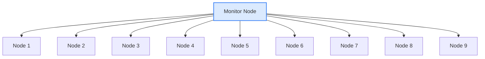

**Problems:**
- <i class="fas fa-times-circle text-danger"></i> Monitor is a single point of failure
- <i class="fas fa-times-circle text-danger"></i> Monitor must know about every node
- <i class="fas fa-times-circle text-danger"></i> With 1000 nodes, the monitor sends 999 messages every cycle
- <i class="fas fa-times-circle text-danger"></i> Network bandwidth at the monitor becomes a bottleneck

### Approach 2: All-to-All Communication

Every server talks to every other server. This is called eager reliable broadcast.

With N nodes, you get N x (N-1) messages per cycle. For 1000 nodes, that's 999,000 messages. Per cycle.

This doesn't scale.

### Approach 3: Gossip Dissemination

Each server picks 2 or 3 random servers and shares what it knows. Those servers do the same. Information spreads exponentially, reaching every node in O(log N) rounds.

For 1000 nodes? About 10 rounds. At 1 round per second, everyone knows within 10 seconds. Total messages per round? About 2,000 to 3,000 (each node contacts 2 to 3 peers). That's way better than 999,000.

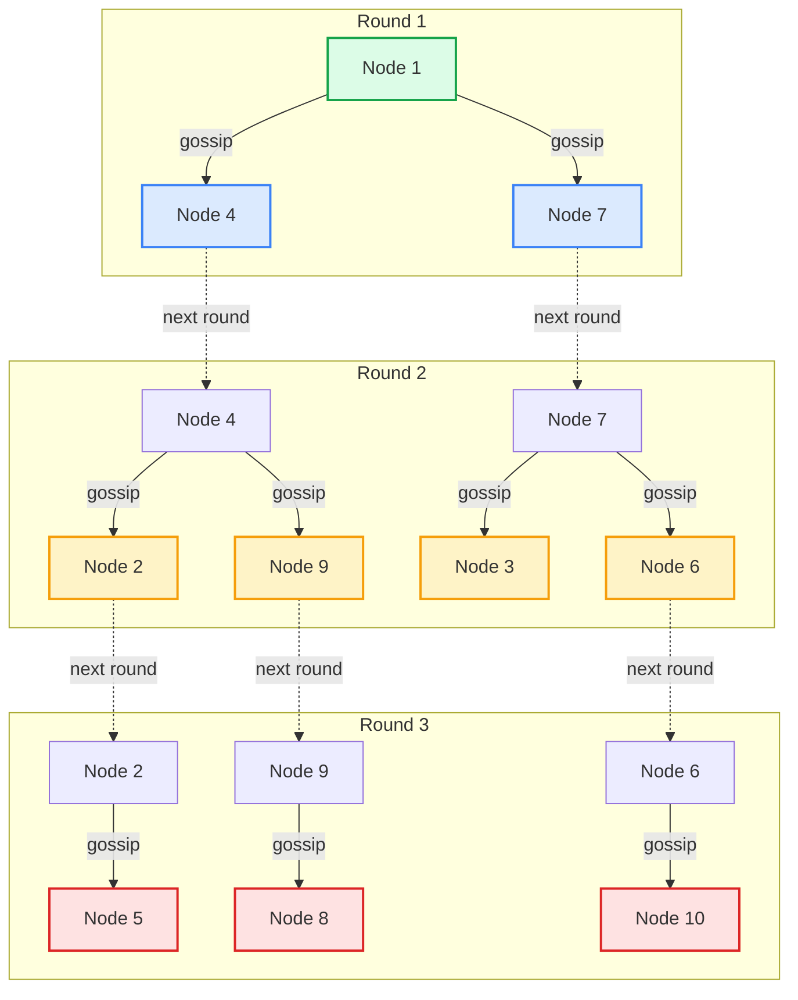

**1 node tells 2. Those 2 tell 4. Those 4 tell 8. In 3 rounds, 10 nodes know the update.**

## How Gossip Dissemination Works

The core algorithm is simple. Every node does this on a loop:

1. Wait for the gossip interval (typically 1 second)
2. Pick a random subset of known nodes (the **fanout**, usually 2 or 3)
3. Send your current state to those nodes
4. Receive their state
5. Merge the incoming state with yours, keeping the newest version of each entry
6. Repeat

That's it. The beauty of this pattern is its simplicity.

### The State Table

Each node maintains a table that looks something like this:

| Node | Status | Heartbeat Counter | Last Updated |
|------|--------|-------------------|--------------|
| Node 1 | alive | 142 | 10:15:03 |
| Node 2 | alive | 138 | 10:15:02 |
| Node 3 | alive | 140 | 10:15:01 |
| Node 4 | suspected | 95 | 10:14:45 |
| Node 5 | dead | 50 | 10:13:20 |

Each node increments its own heartbeat counter every interval. When two nodes gossip, they compare tables and keep the higher heartbeat counter for each entry. If a node's counter hasn't increased in a while, it's marked as suspected, then dead.

### The Merge Logic

When Node A gossips with Node B, the merge is straightforward:

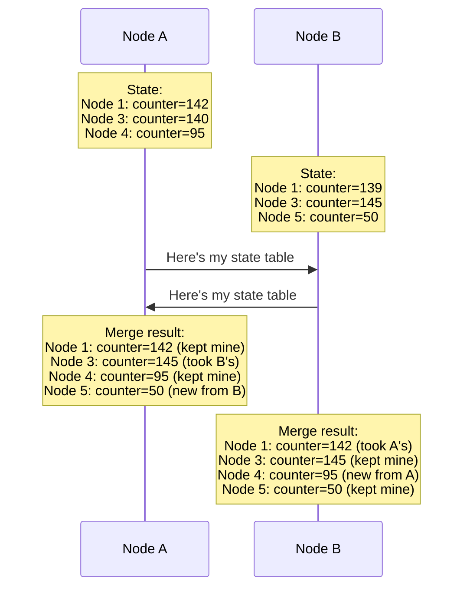

After this exchange, both nodes have a more complete and up-to-date picture of the cluster. This is why gossip converges so fast. Every exchange brings two nodes closer to the truth, and those nodes then spread that truth to others.

## Three Variants of Gossip

Not all gossip works the same way. There are three main approaches:

### 1. Push Gossip

The sender picks random peers and sends its state to them. The receiver just accepts.

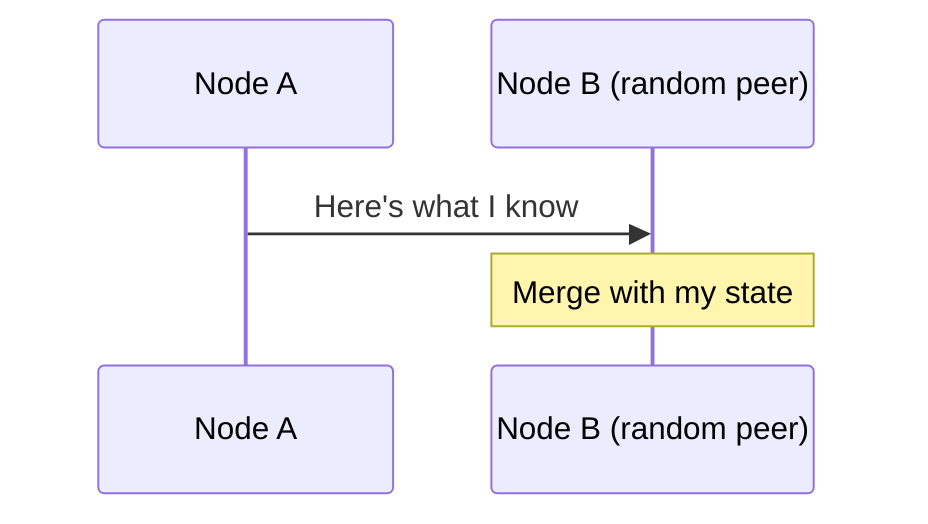

**Good for:** Spreading new information quickly. When a node has something new, it actively pushes it out.

**Problem:** Becomes wasteful once most nodes already have the information. Node A keeps pushing data that Node B already has.

### 2. Pull Gossip

The initiator asks a random peer for its state.

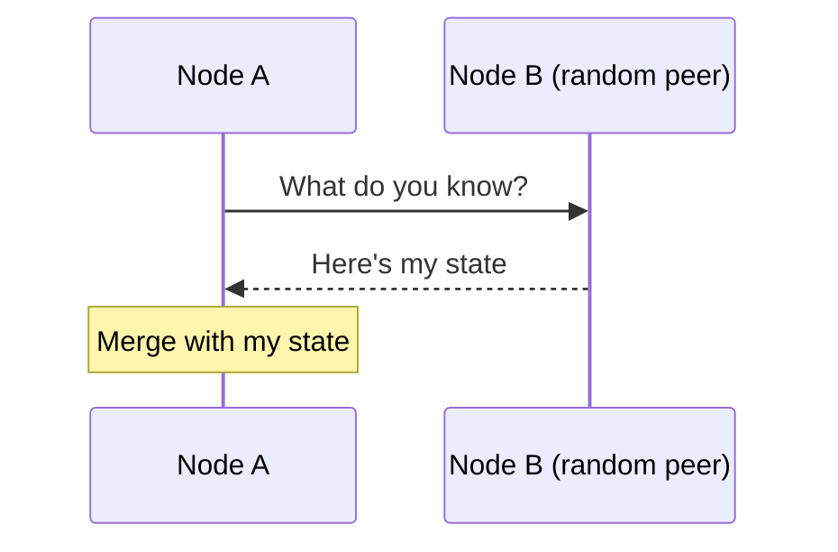

**Good for:** Catching up. Nodes that are behind (maybe they just restarted) can quickly pull the latest state from others.

**Problem:** Slow to spread brand-new information. A node with new data has to wait for someone to ask.

### 3. Push-Pull Gossip (Most Common)

Both nodes exchange state in a single interaction.

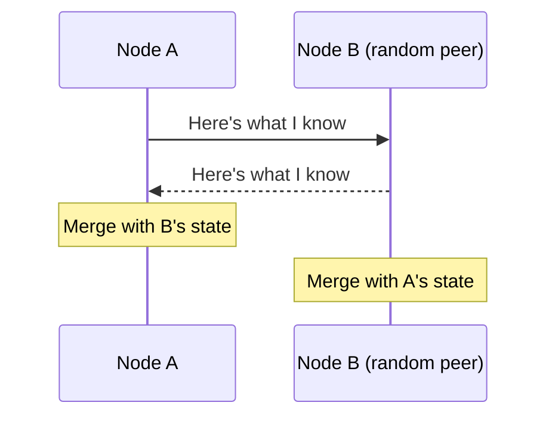

**Good for:** Everything. It spreads new information (push) and catches up stale nodes (pull) in one round trip.

This is what most production systems use. Cassandra, Consul, and Redis Cluster all use push-pull gossip.

## The Math: Why Gossip Converges Fast

Let's work through the numbers.

Assume a cluster of N nodes and a fanout of f (each node contacts f random peers per round).

**Round 1:** 1 node has the information. It tells f nodes. Now f+1 nodes know.

**Round 2:** Each of those f+1 nodes tells f random peers. Even with some overlap, roughly f*(f+1) new nodes learn about it.

**Round k:** Approximately N * (1 - e^(-fk/N)) nodes have the information.

The key insight: **information reaches all N nodes in O(log N) rounds**.

Here's what that looks like in practice:

| Cluster Size | Rounds to Converge (fanout=2) | Time at 1s intervals |
|-------------|-------------------------------|---------------------|
| 10 nodes | ~4 rounds | ~4 seconds |
| 100 nodes | ~7 rounds | ~7 seconds |
| 1,000 nodes | ~10 rounds | ~10 seconds |
| 10,000 nodes | ~14 rounds | ~14 seconds |
| 100,000 nodes | ~17 rounds | ~17 seconds |

Going from 1,000 to 100,000 nodes (100x bigger cluster) only adds 7 more seconds. That's the power of logarithmic growth.

## Real-World Example: How Cassandra Uses Gossip

Apache Cassandra is probably the most well-known user of gossip dissemination. Every Cassandra node gossips with 1 to 3 random peers every second.

### What Cassandra Gossips About

Each Cassandra node shares:
- Its own status (alive, bootstrapping, leaving, dead)
- Token ranges it owns (which data lives on which node)
- Schema version (so all nodes agree on table structures)
- Data center and rack location
- Load information (how much data the node is storing)
- Severity score (how healthy the node is)

### The Gossip Cycle in Cassandra

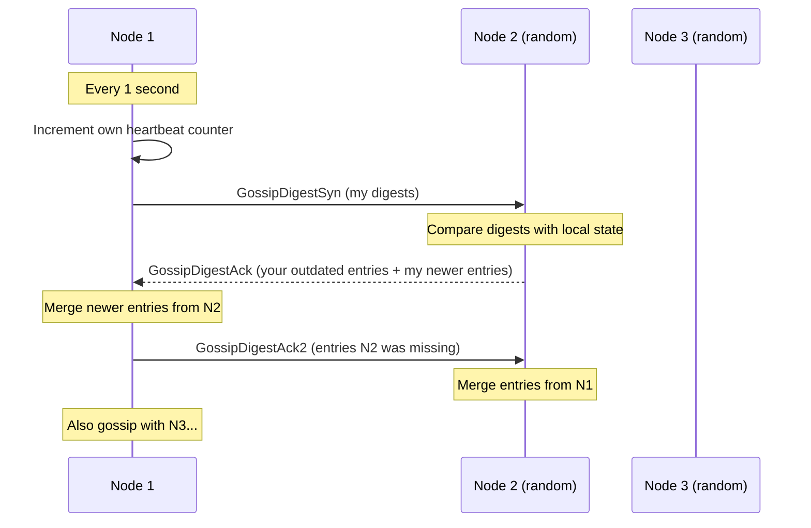

Cassandra uses a three-phase handshake. This is more efficient than sending full state tables every time:

1. **SYN**: Node 1 sends digests (node ID + heartbeat generation + heartbeat version) to a random peer
2. **ACK**: The peer responds with any entries that are newer than what Node 1 sent, and asks for entries it's missing
3. **ACK2**: Node 1 sends the entries the peer was missing

This way, only the differences are exchanged. In a stable cluster, the messages are tiny.

### How New Nodes Join

When a new node starts, it needs to learn about the rest of the cluster. Here's what happens:

1. The new node is configured with a **seed node** (a well-known address)
2. It gossips with the seed node and receives the full state table
3. On the next round, it gossips with other nodes it learned about
4. Within a few rounds, it knows the entire cluster, and the entire cluster knows about it

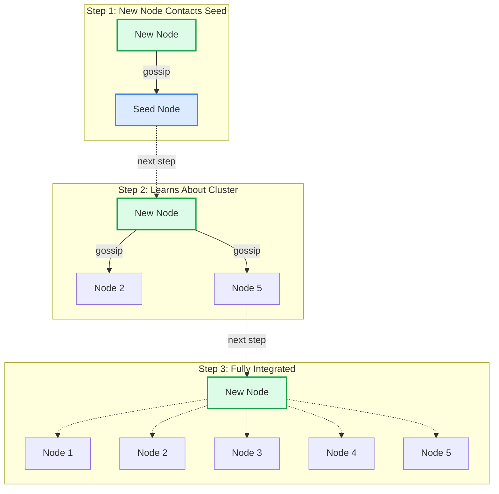

No configuration changes needed on existing nodes. No restart. The gossip protocol handles it all.

## Failure Detection with Gossip

One of the most practical uses of gossip dissemination is failure detection. Instead of having a dedicated monitor pinging every node (which creates a [single point of failure](/distributed-systems/heartbeat/)), nodes detect failures through gossip.

### How It Works

Each node tracks the heartbeat counter of every other node. If a node's counter hasn't increased after a certain number of gossip rounds, it's suspected to be down.

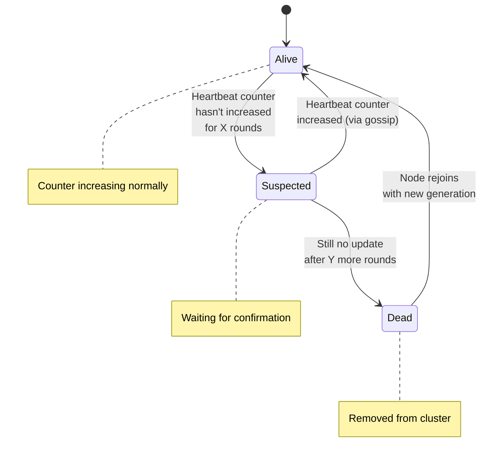

**The timeline:**
- **Seconds 0 to 10**: Node 5 stops responding. Its heartbeat counter stops increasing.
- **Seconds 10 to 20**: Nodes that gossip with each other notice Node 5's counter is stale. They mark it as "suspected."
- **Seconds 20 to 30**: The suspicion spreads through gossip. More nodes agree that Node 5 is down.
- **After 30 seconds**: A [majority of nodes](/distributed-systems/majority-quorum/) agree. Node 5 is declared dead.

The advantage over a centralized [heartbeat](/distributed-systems/heartbeat/) monitor: if the monitor goes down, failure detection stops entirely. With gossip, every node participates in detection. There's no single point of failure.

### Phi Accrual Failure Detector

Cassandra doesn't use a simple timeout for failure detection. It uses the **Phi Accrual Failure Detector**, which assigns a suspicion score (phi) based on historical gossip patterns.

Instead of "dead after 10 seconds," it calculates: "Given that heartbeats from this node normally arrive every 1.1 seconds with a standard deviation of 0.2 seconds, how suspicious is a 5 second delay?"

A phi value of 8 or higher means the probability of the node being alive is extremely low (less than 0.00000001). Cassandra uses this as the default threshold.

This approach has fewer false positives than fixed timeouts because it adapts to actual network conditions. A node on a flaky network with irregular heartbeats gets more slack than one that normally responds like clockwork.

## The SWIM Protocol: Gossip on Steroids

SWIM (Scalable Weakly-consistent Infection-style Process Group Membership) is a protocol that combines gossip dissemination with efficient failure detection. HashiCorp's [Consul](https://developer.hashicorp.com/consul/docs/concept/gossip) and [Serf](https://www.serf.io/) use a modified version of SWIM.

### What Makes SWIM Different

Traditional gossip sends heartbeats AND membership updates as separate concerns. SWIM combines them:

1. **Failure detection**: Instead of broadcasting heartbeats, each node probes a random peer directly
2. **If the probe fails**: Ask other nodes to probe the suspected node (indirect probing)
3. **Membership updates**: Piggyback on the probes. Attach membership changes to every message

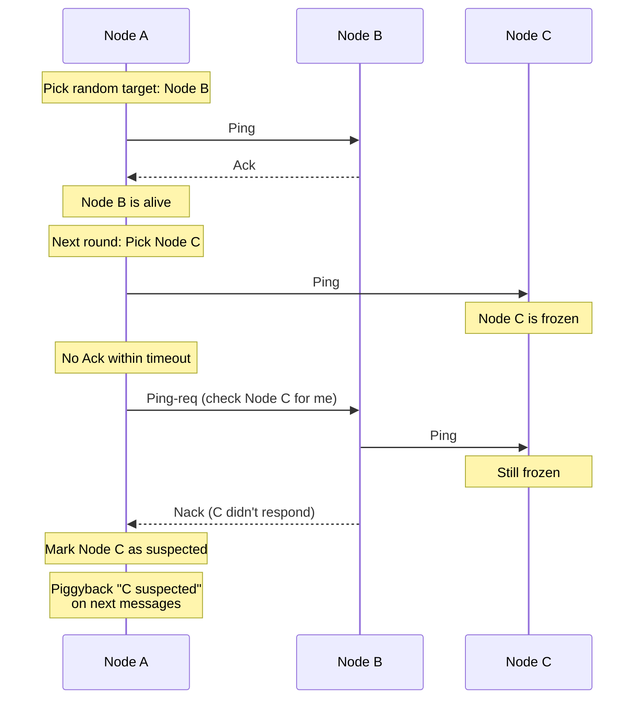

The piggyback approach is what makes SWIM so efficient. You don't need separate gossip messages for membership updates. They ride along with the failure detection probes that are already being sent. This dramatically reduces network overhead.

### Consul's LAN and WAN Gossip Pools

Consul takes SWIM further with two separate gossip pools:

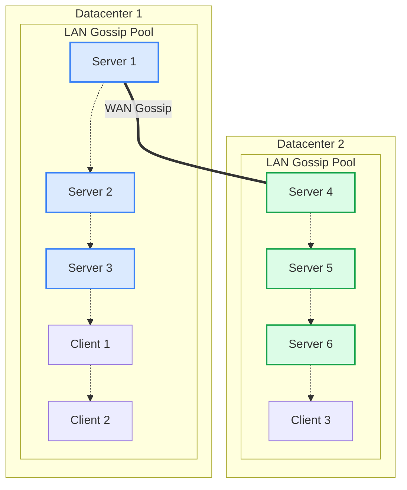

- **LAN pool**: All nodes within a datacenter gossip with each other. Fast, frequent (every 200ms). Used for local failure detection and service discovery.
- **WAN pool**: Only server nodes participate. Slower, less frequent. Used to detect cross-datacenter connectivity issues.

This separation makes sense because network conditions within a datacenter are very different from cross-datacenter links.

## Other Real-World Implementations

### Redis Cluster

Redis Cluster uses gossip for node discovery and failure detection. Each Redis node gossips with a few random nodes every second, sharing:
- Node IDs and addresses
- Which hash slots each node owns
- Failure flags (which nodes are suspected or confirmed down)

When a master node fails, the gossip protocol propagates the failure flag. Once a [majority of master nodes](/distributed-systems/majority-quorum/) agree the node is down, a replica is promoted automatically.

### Amazon DynamoDB

DynamoDB's underlying architecture (based on the original Dynamo paper) uses gossip for membership and failure detection. Each storage node periodically gossips with random peers to share a consistent view of which nodes are responsible for which data.

### Blockchain Networks

Bitcoin and Ethereum use gossip to propagate transactions and blocks. When a node receives a new transaction, it gossips it to 8 random peers. Those peers gossip to their peers. Within seconds, the entire network (thousands of nodes) has the transaction.

This is how blockchain achieves decentralized consensus without a central transaction server.

## Tuning Gossip Parameters

Getting gossip right in production requires tuning these parameters:

### Fanout

The number of peers each node contacts per round.

| Fanout | Convergence Speed | Network Load | Use Case |
|--------|------------------|--------------|----------|
| 1 | Slow | Minimal | Very large clusters (10,000+) |
| 2 | Moderate | Low | Standard production (100-1,000 nodes) |
| 3 | Fast | Medium | When fast convergence matters |
| 5+ | Very fast | High | Small clusters where speed is critical |

**Rule of thumb**: fanout of 2 or 3 works for most systems.

### Gossip Interval

How often each node initiates a gossip round.

- **200ms** (Consul LAN): Fast failure detection within a datacenter
- **1 second** (Cassandra): Good balance for most database clusters
- **5 seconds**: Minimizes bandwidth for very large or geographically distributed clusters

### Failure Detection Thresholds

How many missed gossip rounds before declaring a node dead.

Too aggressive (mark dead after 3 missed rounds): you'll get false positives from network blips or GC pauses.

Too conservative (mark dead after 30 missed rounds): real failures take forever to detect.

Most systems use 8 to 15 missed rounds as the threshold, combined with indirect probing (ask other nodes to check) before making the final call.

## Anti-Entropy: Fixing What Gossip Misses

Gossip dissemination is probabilistic. There's always a small chance that some update doesn't reach a node, especially during network partitions. Anti-entropy mechanisms fix this.

### How Anti-Entropy Works

Periodically, two nodes compare their full state and fix any differences:

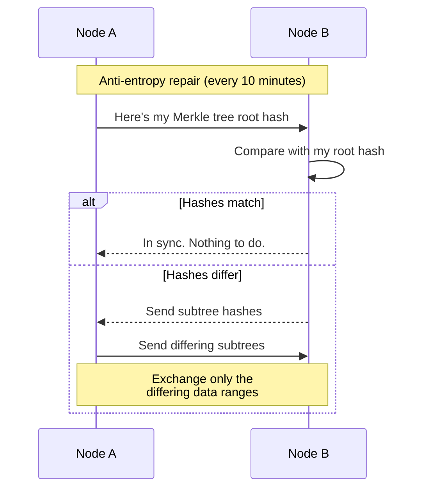

Cassandra uses [Merkle trees](https://en.wikipedia.org/wiki/Merkle_tree) for anti-entropy repair. The idea: both nodes build a hash tree of their data. They compare root hashes. If they match, everything is in sync. If not, they drill down the tree to find exactly which data ranges differ, and only exchange those.

This is how Cassandra's `nodetool repair` works under the hood. It's recommended to run anti-entropy repair periodically (once every few days) to catch any inconsistencies that gossip missed.

### Gossip vs Anti-Entropy

| Property | Gossip | Anti-Entropy |
|----------|--------|--------------|
| Frequency | Every second | Every few minutes or hours |
| Data exchanged | Metadata (small) | Actual data (can be large) |
| Purpose | Spread updates quickly | Fix missed updates |
| Network cost | Low per round | High per round |
| Consistency guarantee | Probabilistic | Deterministic |

Think of gossip as your daily sync, and anti-entropy as a weekly deep clean.

## Common Pitfalls

### 1. Seed Node Dependency

Most gossip implementations need seed nodes for bootstrapping. If all your seed nodes go down simultaneously and a new node tries to join, it can't discover the cluster.

**Fix**: Spread seed nodes across different racks and availability zones. Always have at least 2 to 3 seed nodes per datacenter.

### 2. Network Partitions

During a network partition, gossip can only spread within each partition. Nodes on one side won't know about updates on the other side.

**Fix**: This is expected behavior. When the partition heals, anti-entropy repair will reconcile the differences. Design your application to handle [eventual consistency](/distributed-systems/majority-quorum/).

### 3. Zombie Nodes

A node that's technically alive but functionally broken (out of disk space, stuck in GC, overloaded) might keep gossiping but never actually process requests.

**Fix**: Include application-level health status in gossip metadata. Don't just check "is the process running." Check "can it serve requests."

### 4. Message Size Growth

As clusters grow, the full state table gets bigger. Sending the entire table every second becomes expensive.

**Fix**: Use digest-based gossip (like Cassandra's SYN-ACK-ACK2 pattern) to only exchange differences, not the full state.

### 5. Clock Skew

Gossip relies on comparing timestamps or version numbers. If node clocks are out of sync, merge logic can make wrong decisions.

**Fix**: Use logical clocks (version vectors or Lamport timestamps) instead of wall-clock time. Or run NTP to keep clocks synchronized.

## When to Use Gossip Dissemination

**Use gossip when:**
- <i class="fas fa-check-circle text-success"></i> You have a large cluster (tens to thousands of nodes)
- <i class="fas fa-check-circle text-success"></i> You need decentralized communication with no single point of failure
- <i class="fas fa-check-circle text-success"></i> Eventual consistency is acceptable (updates can take seconds to propagate)
- <i class="fas fa-check-circle text-success"></i> You need failure detection without a central monitor
- <i class="fas fa-check-circle text-success"></i> Nodes join and leave the cluster frequently

**Don't use gossip when:**
- <i class="fas fa-times-circle text-danger"></i> You need strong consistency (use [consensus algorithms like Paxos](/distributed-systems/paxos/) or Raft instead)
- <i class="fas fa-times-circle text-danger"></i> You have a small cluster (under 5 nodes, just use direct communication)
- <i class="fas fa-times-circle text-danger"></i> You need guaranteed delivery order (use a [message queue like Kafka](/distributed-systems/how-kafka-works/))
- <i class="fas fa-times-circle text-danger"></i> Update latency must be sub-second (gossip takes multiple rounds to converge)

## Gossip vs Other Communication Patterns

| Pattern | Messages per Update | Failure Tolerance | Latency | Complexity |
|---------|-------------------|-------------------|---------|------------|
| Central broadcast | O(N) | Low (SPOF) | Fast | Low |
| All-to-all | O(N^2) | High | Fast | Low |
| Gossip | O(N log N) | High | Moderate | Medium |
| Tree-based | O(N) | Medium | Fast | High |
| [Consensus (Paxos)](/distributed-systems/paxos/) | O(N) | High | Slow | Very High |

Gossip sits in the sweet spot: good failure tolerance, moderate latency, and it doesn't flood the network. It's not the fastest, but it's the most resilient.

## Wrapping Up

Gossip dissemination is one of those patterns that seems almost too simple to work. Pick random peers. Share what you know. Repeat. Yet it powers some of the most reliable distributed systems on the planet.

The key takeaways:

1. **Gossip spreads information in O(log N) rounds**: A 1000 node cluster converges in about 10 seconds
2. **Push-pull is the most practical variant**: It handles both new updates and stale nodes in one exchange
3. **Piggybacking saves bandwidth**: SWIM combines failure detection with membership updates on the same messages
4. **Anti-entropy catches what gossip misses**: Run periodic full repairs to guarantee consistency
5. **Tune fanout and interval for your use case**: Fanout of 2 to 3 with 1 second intervals works for most systems
6. **No single point of failure**: Every node participates equally. No central coordinator needed.

The next time you wonder how Cassandra knows which nodes are alive, or how Consul discovers new services, or how blockchain transactions reach every node in the network, the answer is gossip. Simple, scalable, and proven at massive scale.

---

*For more on distributed systems patterns, check out [Heartbeat: Detecting Failures](/distributed-systems/heartbeat/), [Majority Quorum](/distributed-systems/majority-quorum/), [Two-Phase Commit](/distributed-systems/two-phase-commit/), [Write-Ahead Log](/distributed-systems/write-ahead-log/), and [Paxos Consensus](/distributed-systems/paxos/).*

*Building reliable distributed architectures? See [How Kafka Works](/distributed-systems/how-kafka-works/) for message queuing patterns and [How Bloom Filters Work](/data-structures/bloom-filter/) for the data structure Cassandra uses alongside gossip.*

*References: [Martin Fowler's Gossip Dissemination](https://martinfowler.com/articles/patterns-of-distributed-systems/gossip-dissemination.html), [HashiCorp Consul Gossip Protocol](https://developer.hashicorp.com/consul/docs/concept/gossip), [SWIM Protocol Paper](https://www.cs.cornell.edu/projects/Quicksilver/public_pdfs/SWIM.pdf), [Apache Cassandra Architecture Documentation](https://cassandra.apache.org/doc/latest/cassandra/architecture/dynamo.html)*
