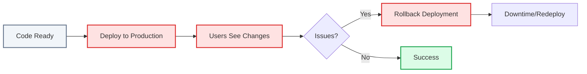
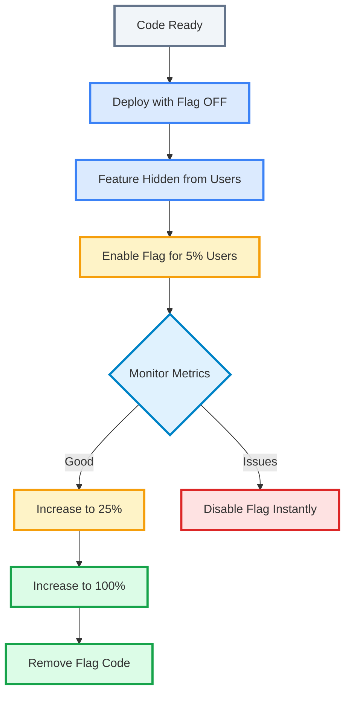
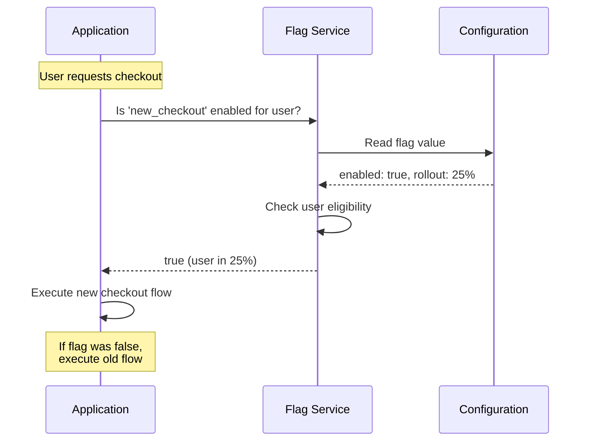
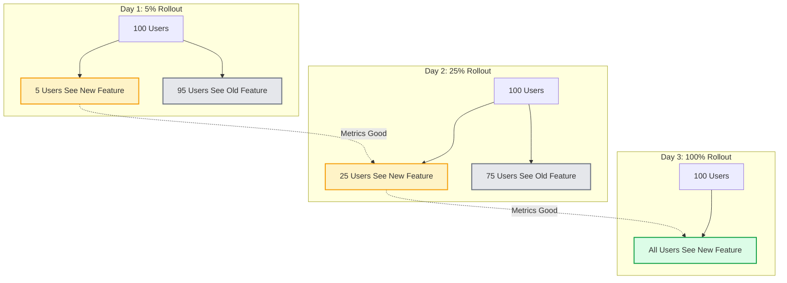
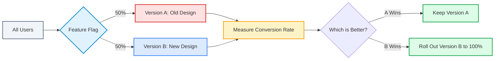
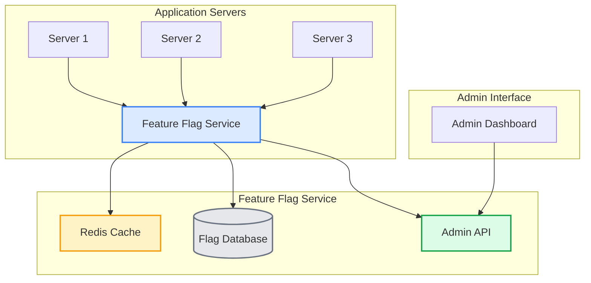
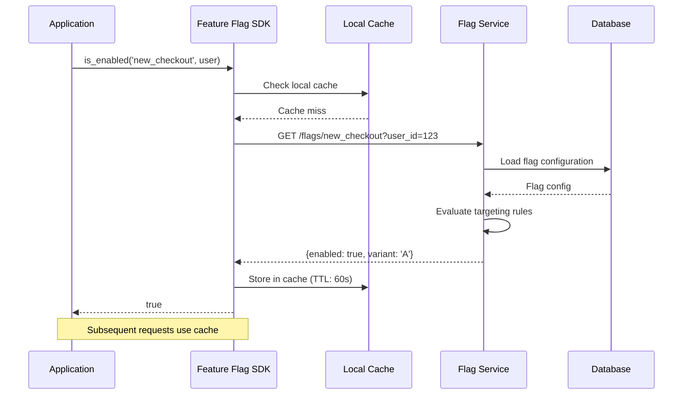
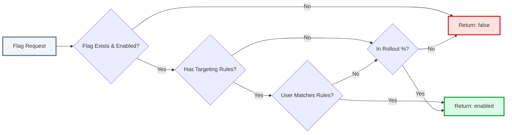
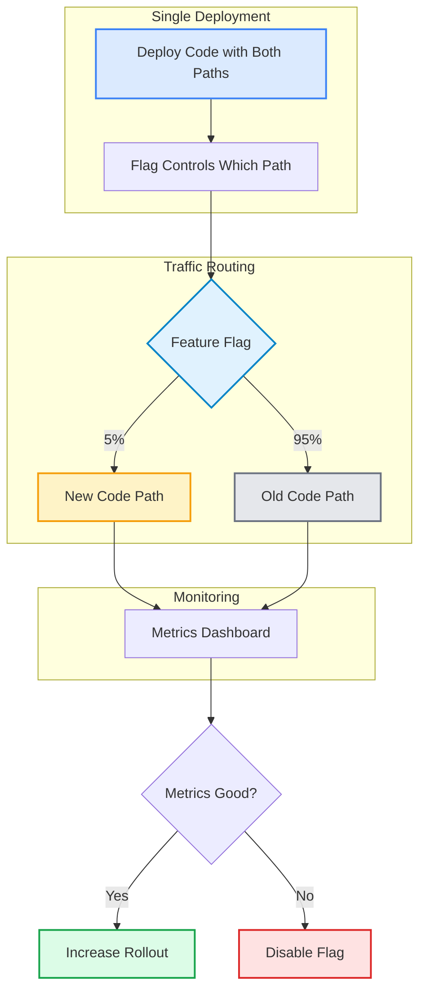
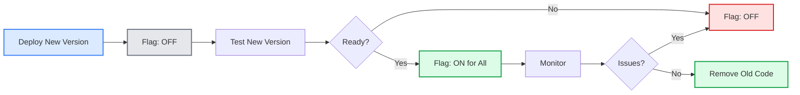

In 2010, Flickr was deploying code to production 10 times a day. Not 10 times a month. Ten times a day. They had dozens of developers pushing changes into a single monolithic PHP application serving millions of users.

How did they do it without breaking everything? They wrapped every new feature in a simple if-else check. If the flag was on, users saw the new code. If it was off, they saw the old code. Developers could deploy whenever they wanted, and product managers could decide when to actually release. A bad feature? Flip the flag off. Done. No rollback, no redeployment, no 2 AM incident.

Flickr called them "feature flippers." Today we call them feature flags (or feature toggles, depending on who you ask). And they are one of the most practical patterns in software engineering.

If you've ever been afraid to deploy on a Friday, or waited weeks to coordinate a big release, or scrambled to roll back a bad deployment, feature flags are the answer.

## The Problem: Deployment and Release Are Not the Same Thing

Most teams treat deployment and release as a single step. You deploy code, and users immediately see the changes. This creates a dangerous coupling.

**Deployment** is a technical act: moving code from your repository to production servers.

**Release** is a business decision: making a feature visible to users.

These should be separate. Feature flags (feature toggles) make that separation possible.

### The Old Way: Deploy and Pray



**Problems:**
- <i class="fas fa-times-circle text-danger"></i> Can't test in production before full release
- <i class="fas fa-times-circle text-danger"></i> Rollback requires redeployment
- <i class="fas fa-times-circle text-danger"></i> All users affected immediately
- <i class="fas fa-times-circle text-danger"></i> Must coordinate deployments with releases
- <i class="fas fa-times-circle text-danger"></i> No way to gradually test with real users

### The Feature Flag Way: Deploy Safely, Release When Ready



**Benefits:**
- <i class="fas fa-check-circle text-success"></i> Deploy anytime, release when ready
- <i class="fas fa-check-circle text-success"></i> Test in production with real users
- <i class="fas fa-check-circle text-success"></i> Instant rollback without redeployment
- <i class="fas fa-check-circle text-success"></i> Gradual rollout limits blast radius
- <i class="fas fa-check-circle text-success"></i> A/B test different versions

## What Are Feature Flags (Feature Toggles)?

A feature flag, also called a feature toggle, is a simple if-else statement that reads from configuration instead of being hardcoded. The terms feature flag, feature toggle, and feature switch all refer to the same concept. Martin Fowler uses "feature toggle" in his writing. LaunchDarkly popularized "feature flag." In practice, they mean the same thing: toggling a code path on or off without redeploying.

### The Simplest Example

```python
# Without feature flags
def checkout(user, items):
    return process_payment(user, items)  # Always uses new flow

# With feature flags
def checkout(user, items):
    if feature_flags.is_enabled('new_checkout', user):
        return process_payment_new(user, items)
    else:
        return process_payment_old(user, items)
```

The flag value comes from somewhere external: a config file, a database, or a feature flag service. You change the value, not the code.

### How Feature Flags Work



The application checks the flag at runtime. The flag service determines whether the feature should be enabled based on:
- Global on/off state
- Rollout percentage (5%, 25%, 50%, 100%)
- User targeting (specific users, user segments, countries)
- Time-based rules (enable at specific times)
- A/B test assignments

## Why Use Feature Flags?

### 1. Decouple Deployment from Release

This is the biggest win. You can deploy code to production multiple times per day without coordinating releases. The code sits there, ready, but hidden behind a flag.

**Real example:** A team deploys a new search algorithm on Monday. They enable it for internal testing on Tuesday. On Wednesday, they turn it on for 10% of users. By Friday, it's at 100% and performing well. All without a single coordinated release meeting.

### 2. Test in Production with Real Users

Staging environments are never the same as production. The data volumes are different, user behavior is different, and network conditions are different. Feature flags let you test with real production traffic while limiting risk.

You enable the feature for 1% of users. Monitor error rates, response times, and business metrics. If everything looks good, increase to 5%, then 25%, then 100%.

### 3. Instant Rollback Without Redeployment

A bug appears in production. With traditional deployments, you need to:
1. Revert the code
2. Run tests
3. Deploy the old version
4. Wait for deployment to complete

With feature flags, you:
1. Disable the flag
2. Done

The old code path is still there. You just switch back to it.

### 4. Gradual Rollouts and Canary Deployments

Instead of exposing all users to a new feature at once, you gradually increase exposure. This is called a [canary deployment](/explainer/blue-green-vs-canary-deployment/) (named after the canary birds that miners used to detect toxic gas).



If issues appear at 5%, you've only affected 5% of users. Much better than 100%.

### 5. A/B Testing

Feature flags make A/B testing simple. Show version A to 50% of users and version B to the other 50%. Measure which one performs better.



### 6. Kill Switches for Operations

Sometimes you need to disable a feature for operational reasons: high load, database issues, or a third-party service outage. Feature flags let you do this instantly without touching code.

This is exactly what happened during the [December 2025 Cloudflare outage](/cloudflare-outage-december-2025/). They used a killswitch to disable a feature, but the killswitch itself had a dormant bug. The lesson: test your killswitches just as thoroughly as the features they control.

## Types of Feature Flags

Not all feature toggles are the same. Martin Fowler's [definitive article on feature toggles](https://martinfowler.com/articles/feature-toggles.html) categorizes them into four types based on their lifecycle and purpose. Understanding the type of toggle you are working with matters because it determines how long it should live in your codebase and how it should be managed.

### 1. Release Toggles

**Purpose:** Control when a new feature becomes visible to users.

**Lifecycle:** Short-lived. Remove once the feature is fully rolled out.

**Example:**
```python
if feature_flags.is_enabled('new_dashboard'):
    return render_new_dashboard()
else:
    return render_old_dashboard()
```

**When to use:** You've built a feature but want to deploy it early and enable it later. Or you want to gradually roll it out.

### 2. Experiment Toggles

**Purpose:** Run A/B tests or multivariate tests.

**Lifecycle:** Medium-lived. Active during the experiment, removed after.

**Example:**
```python
variant = feature_flags.get_variant('checkout_button_test', user)
if variant == 'red_button':
    return render_checkout_button(color='red')
elif variant == 'blue_button':
    return render_checkout_button(color='blue')
else:
    return render_checkout_button(color='green')  # control
```

**When to use:** You want to test which version of a feature performs better with real users.

### 3. Ops Toggles

**Purpose:** Control operational behavior without code changes.

**Lifecycle:** Long-lived. May stay in the codebase permanently.

**Example:**
```python
if feature_flags.is_enabled('use_cdn_for_images'):
    return get_image_url_from_cdn(image_id)
else:
    return get_image_url_from_database(image_id)
```

**When to use:** You need to quickly switch between different implementations for performance, cost, or reliability reasons. Think circuit breakers, [caching strategies](/caching-strategies-explained/), or database read replicas.

### 4. Permission Toggles

**Purpose:** Control feature access by user type, role, or other attributes.

**Lifecycle:** Long-lived. Part of the access control system.

**Example:**
```python
if feature_flags.is_enabled('premium_features', user):
    return render_premium_dashboard()
else:
    return render_basic_dashboard()
```

**When to use:** You have features that should only be visible to certain users like beta testers, premium subscribers, employees, or users in specific countries.

## Implementation Approaches

How you implement feature toggling depends on your needs. Start simple, add complexity only when needed.

### Level 1: Configuration Files

The simplest approach: store flags in a config file.

```yaml
# config/feature_flags.yml
features:
  new_checkout: true
  new_dashboard: false
  premium_features: true
```

```python
# app/feature_flags.py
import yaml

with open('config/feature_flags.yml') as f:
    flags = yaml.safe_load(f)

def is_enabled(flag_name):
    return flags['features'].get(flag_name, False)
```

**Pros:**
- Simple to implement
- No external dependencies
- Works for small teams

**Cons:**
- Requires redeployment to change flags
- No gradual rollouts
- No user targeting
- Hard to manage at scale

**When to use:** Small applications, simple on/off feature toggling, teams just getting started with feature flags.

### Level 2: Environment Variables

Similar to config files, but using environment variables. Common in containerized deployments where you can update environment variables without changing application code.

```python
import os

def is_enabled(flag_name):
    return os.getenv(f'FEATURE_{flag_name.upper()}') == 'true'
```

**Pros:**
- Easy to change per environment
- Works well with CI/CD pipelines
- No code changes needed to toggle a flag

**Cons:**
- Still requires a restart or redeployment to pick up new values
- Limited functionality
- Hard to manage many flags

**When to use:** Docker/[Kubernetes](/kubernetes-architecture-explained/) deployments, toggling features per environment, simple on/off toggles.

### Level 3: Application Database

Store flags in your application database. Update them through an admin interface.

```python
# models.py
class FeatureFlag(models.Model):
    name = models.CharField(max_length=100, unique=True)
    enabled = models.BooleanField(default=False)
    rollout_percentage = models.IntegerField(default=0)
    
# feature_flags.py
def is_enabled(flag_name, user=None):
    flag = FeatureFlag.objects.get(name=flag_name)
    if not flag.enabled:
        return False
    if flag.rollout_percentage == 100:
        return True
    if user:
        # Consistent hashing ensures same user always gets same result
        user_hash = hash(f"{flag_name}:{user.id}") % 100
        return user_hash < flag.rollout_percentage
    return False
```

**Pros:**
- Can change flags without redeployment
- Supports gradual rollouts
- Can build admin UI
- No external service needed

**Cons:**
- Adds database load
- Need to handle caching
- More complex to implement
- Hard to do advanced targeting

**When to use:** Medium-sized applications, need gradual rollouts, want toggle control without external services.

### Level 4: Distributed Feature Flag Service

Use a dedicated service like LaunchDarkly, Flagsmith, or Harness. Or build your own.



**Pros:**
- Advanced targeting (user segments, countries, custom attributes)
- Real-time flag updates
- Analytics and experiment tracking
- Team collaboration features
- SDKs for multiple languages
- Handles caching and performance

**Cons:**
- External dependency
- Cost (if using a service)
- More complex setup
- Potential latency

**When to use:** Large applications, need advanced toggling features, multiple teams, complex rollout strategies.

Companies like Meta and eBay built their own feature flag services. Flickr has been using them since 2009. For most teams, a third-party service is the right choice unless you have very specific requirements that justify the effort of building one in-house.

## Architecture: How Feature Toggle Services Work

Let's look at how a distributed feature flag service operates under the hood.

### Request Flow



The SDK caches flag values locally to avoid hitting the service on every request. This is critical for performance.

### Flag Evaluation

The service evaluates flags based on multiple factors:



### Consistent Hashing for Rollouts

When you enable a feature for 25% of users, you want the same users to always see it (or not see it). Consistent hashing ensures this.

```python
def is_user_in_rollout(flag_name, user_id, percentage):
    # Hash the combination of flag name and user ID
    hash_value = hash(f"{flag_name}:{user_id}")
    # Convert to 0-99 range
    bucket = abs(hash_value) % 100
    # Check if bucket is below percentage
    return bucket < percentage
```

This means:
- User 123 always gets the same result for the flag `new_checkout`
- Increasing the percentage from 25% to 50% adds new users to the rollout without reshuffling existing ones
- The same user sees a consistent experience across sessions

## Best Practices

### 1. Start Small

Don't try to feature-flag everything from day one. Start with one critical feature. Learn the patterns. Then expand.

**Good first candidates:**
- New user-facing features
- Risky changes (database migrations, third-party integrations)
- Features that need gradual rollout

**Avoid flagging:**
- Bug fixes (just deploy them)
- Internal refactoring (if it doesn't change behavior)
- Trivial changes

### 2. Use Clear Naming Conventions

Flag names should be self-documenting.

**Good names:**
- `new_checkout_flow`
- `enable_cdn_for_images`
- `premium_dashboard_v2`

**Bad names:**
- `flag1`
- `test_feature`
- `new_thing`

Establish a naming convention:
- Prefix with feature area: `checkout_new_flow`, `dashboard_premium`
- Include version if relevant: `search_algorithm_v2`
- Use descriptive verbs: `enable_`, `use_`, `show_`

### 3. Remove Dead Flags

Feature toggles add complexity. Every if-else is a branch to maintain. Once a feature is fully rolled out and stable, remove the toggle and the old code path.

**Process:**
1. Feature reaches 100% rollout
2. Monitor for a week or two
3. Remove the flag check
4. Delete the old code path
5. Clean up flag configuration

**Technical debt warning:** Unused flags accumulate fast. Set a policy: any flag that has been at 100% for more than 90 days gets automatically flagged for removal.

### 4. Default to Disabled

When in doubt, the flag should be off. This is fail-safe behavior.

```python
# Good: defaults to False
def is_enabled(flag_name):
    return flags.get(flag_name, False)

# Bad: defaults to True
def is_enabled(flag_name):
    return flags.get(flag_name, True)  # Dangerous!
```

If a flag doesn't exist or can't be loaded, assume the feature is off. This prevents accidental releases.

### 5. Test Flag States

Test both enabled and disabled states. This is easy to forget.

```python
def test_checkout_with_flag_enabled():
    with flag_override('new_checkout', True):
        result = checkout(user, items)
        assert result.uses_new_flow()

def test_checkout_with_flag_disabled():
    with flag_override('new_checkout', False):
        result = checkout(user, items)
        assert result.uses_old_flow()
```

### 6. Monitor Flag Usage

Track which flags are active, how many users see them, and their impact on metrics.

**Key metrics:**
- Flag evaluation count (how often is it checked?)
- User exposure (how many users see enabled flags?)
- Error rates (do flagged features have higher errors?)
- Business metrics (conversion rates, revenue, engagement)

### 7. Use Feature Flags for Operations, Not Just Features

Feature flags aren't just for new features. Use them for:
- **Circuit breakers:** Disable features when dependencies are down
- **Performance toggles:** Switch between algorithms or data sources
- **Maintenance mode:** Disable non-critical features during incidents
- **Regional rollouts:** Enable features in specific countries first

### 8. Document Flag Purpose and Lifecycle

Every flag should have:
- **Purpose:** Why does this flag exist?
- **Owner:** Who is responsible for it?
- **Target removal date:** When will it be removed?
- **Rollout plan:** What's the rollout strategy?

```yaml
flags:
  new_checkout:
    enabled: true
    rollout_percentage: 50
    purpose: "New checkout flow with improved UX"
    owner: "checkout-team@company.com"
    target_removal: "2026-03-15"
    rollout_plan: "5% -> 25% -> 50% -> 100% over 2 weeks"
```

## Common Pitfalls

### 1. Toggle Explosion

Too many feature toggles make code hard to understand and maintain.

```python
# Bad: Too many nested flags
if flag1 and flag2 and (flag3 or flag4):
    if flag5:
        # What does this code do?
```

**Fix:** Consolidate related flags. Use a single flag with variants instead of multiple boolean flags.

```python
# Better: Single flag with variants
variant = get_variant('checkout_flow')
if variant == 'new':
    # new flow
elif variant == 'experimental':
    # experimental flow
else:
    # old flow
```

### 2. Forgetting to Remove Toggles

Stale feature toggles accumulate over time. Old toggles reference removed code. This creates confusion and bugs.

**Fix:** Set up automated cleanup. Flag the ones that are:
- At 100% rollout for 30+ days
- Not evaluated in the last 7 days
- Past their target removal date

### 3. Inconsistent Flag Evaluation

If different parts of your application evaluate the same flag independently, users can get inconsistent experiences. The frontend might show the new dashboard, but the backend API might return data formatted for the old one.

```python
# Frontend
if feature_flags.is_enabled('new_dashboard', user):
    show_new_dashboard()

# Backend API
if feature_flags.is_enabled('new_dashboard', user):  # Might evaluate differently!
    return new_dashboard_data()
```

**Fix:** Use the same flag service and evaluation logic everywhere. Or better yet, evaluate the flag once on the backend and pass the result to the frontend.

### 4. Toggles That Affect Each Other

Feature toggles can have hidden dependencies. Enabling one toggle might break another feature that depends on it being off.

```python
# Flag A enables new authentication
if flag_a:
    use_new_auth()

# Flag B assumes old authentication
if flag_b:
    old_auth_feature()  # Breaks if flag_a is also enabled!
```

**Fix:** Document toggle dependencies. Use toggle combinations or a single toggle with multiple variants.

### 5. Performance Impact

Checking flags on every request adds latency. If you are not careful, this can noticeably slow down your application.

**Fix:**
- Cache flag values locally (SDKs do this)
- Use async flag evaluation where possible
- Batch flag checks
- Set appropriate cache TTLs

### 6. Testing Toggle Combinations

With many feature toggles, the number of possible combinations grows exponentially. Testing every combination is not realistic.

**Fix:** Focus testing on:
- All flags disabled (baseline)
- Each flag enabled individually
- Known flag combinations that will be active together
- Use feature flag testing tools that let you override flags in tests

## Real-World Examples

### Example 1: Gradual Rollout

You've built a new recommendation algorithm. You want to test it safely.

**Week 1:**
```python
# Deploy code with flag disabled
feature_flags.set('new_recommendations', enabled=False)
```

**Week 2:**
```python
# Enable for 5% of users
feature_flags.set('new_recommendations', enabled=True, rollout=5)
# Monitor: error rates, response times, click-through rates
```

**Week 3:**
```python
# Increase to 25%
feature_flags.set('new_recommendations', rollout=25)
# Metrics still good
```

**Week 4:**
```python
# Increase to 100%
feature_flags.set('new_recommendations', rollout=100)
```

**Week 5:**
```python
# Remove flag, make new algorithm the default
# Delete old code path
```

### Example 2: A/B Testing

You want to test two different checkout button colors.

```python
variant = feature_flags.get_variant('checkout_button_test', user)

if variant == 'red':
    button_color = 'red'
elif variant == 'blue':
    button_color = 'blue'
else:
    button_color = 'green'  # control

# After 2 weeks of testing:
# Red: 12% conversion
# Blue: 15% conversion  
# Green: 10% conversion

# Blue wins! Roll out to 100%
feature_flags.set('checkout_button_test', variant='blue', rollout=100)
```

### Example 3: Kill Switch

Your payment processor is having issues. You need to disable checkout instantly.

```python
# Normal operation
if feature_flags.is_enabled('checkout_enabled'):
    process_payment()
else:
    return error("Checkout temporarily unavailable")

# During incident
feature_flags.set('checkout_enabled', enabled=False)
# All users see "temporarily unavailable" message

# After fix
feature_flags.set('checkout_enabled', enabled=True)
# Checkout works again
```

This is much faster than deploying code changes.

### Example 4: Regional Rollout

You want to launch a feature in the US first, then expand.

```python
def is_enabled_for_user(flag_name, user):
    flag = get_flag(flag_name)
    
    # Check if user's country is in allowed list
    if user.country in flag.allowed_countries:
        return True
    
    return False

# Start with US only
feature_flags.set('new_feature', allowed_countries=['US'])

# After success, add more countries
feature_flags.set('new_feature', allowed_countries=['US', 'CA', 'UK'])

# Finally, global
feature_flags.set('new_feature', allowed_countries=None)  # All countries
```

## Feature Toggles and Deployment Strategies

Feature toggles work hand-in-hand with deployment strategies like [blue-green and canary deployments](/explainer/blue-green-vs-canary-deployment/).

### Canary Deployment with Feature Flags

Traditional canary deployment runs two versions of your application and routes traffic between them. Feature toggling lets you do canary deployment with a single codebase.



This is simpler than running two separate deployments. You deploy once, control rollout with flags.

### Blue-Green with Feature Flags

You can also use feature flags to implement blue-green deployment patterns:



The difference from traditional blue-green: you don't need duplicate infrastructure. The old and new code paths run in the same process.

## When Not to Use Feature Flags

Feature toggles are not always the right tool. Overusing them creates its own problems.

**Don't use feature flags for:**
- **Bug fixes:** Just deploy the fix directly.
- **Simple configuration:** Use regular config files for things like API endpoints or timeout values.
- **Security patches:** Deploy immediately. Never gate a security fix behind a flag.
- **Trivial changes:** If the change is low risk, just ship it.

**Use feature flags for:**
- New user-facing features
- Risky changes (database migrations, algorithm changes)
- Features that need gradual rollout
- A/B tests
- Operational controls (kill switches, performance toggles)

## Building vs Buying a Feature Toggle System

Should you build your own feature toggle system or use a service?

### Build Your Own If:
- You have very specific requirements
- You need tight integration with internal systems
- You have the engineering resources
- You want full control

Companies like Meta and eBay built their own systems because they had unique needs and the resources to maintain them.

### Use a Service If:
- You want to focus on your product, not infrastructure
- You need features like advanced targeting, analytics, A/B testing
- You want SDKs for multiple languages
- You want a team collaboration interface

Popular services include LaunchDarkly, Flagsmith, Harness, and Split.io. Many offer free tiers for small teams.

**My recommendation:** Start with a service. You can always build your own later if you outgrow it. Most teams never need to.

## Wrapping Up

Feature flags (feature toggles) are a simple idea with a big impact. They let you:
- Deploy code without releasing features
- Test in production safely
- Roll back instantly without redeploying
- Gradually roll out changes to limit risk
- Run A/B tests with real users

The key insight: **deployment and release are separate decisions**. Feature toggling gives you control over when users see changes, independent of when you deploy code.

Start simple. A config file or an environment variable is enough to get going. As your needs grow, move to a database or a dedicated service. But don't wait for the perfect setup. Even a basic feature flag on your next risky feature will save you from a bad deployment.

The companies using feature flags today, Meta, eBay, Flickr, Netflix, and thousands of others, all started with something simple. They added complexity only when they needed it.

Your next feature? Deploy it behind a flag. Enable it gradually. Monitor closely. Roll back instantly if something breaks. That is how modern software teams ship with confidence.

---

*For more on deployment strategies, see [Blue-Green vs Canary Deployment](/explainer/blue-green-vs-canary-deployment/). For understanding how distributed systems handle failures, check out [Heartbeat: How Distributed Systems Know You're Still Alive](/distributed-systems/heartbeat/) and [Gossip Protocol in Distributed Systems](/distributed-systems/gossip-dissemination/).*

*For CI/CD automation, see [GitHub Actions Basics: CI/CD Automation](/github-actions-basics-cicd-automation/). For system design patterns, check out the [System Design Cheat Sheet](/system-design-cheat-sheet/).*

*References: [Martin Fowler's Feature Toggles](https://martinfowler.com/articles/feature-toggles.html), [LaunchDarkly Feature Flags Guide](https://launchdarkly.com/blog/what-are-feature-flags/), [Flagsmith Feature Flags Best Practices](https://flagsmith.com/blog/feature-flags-best-practices)*
