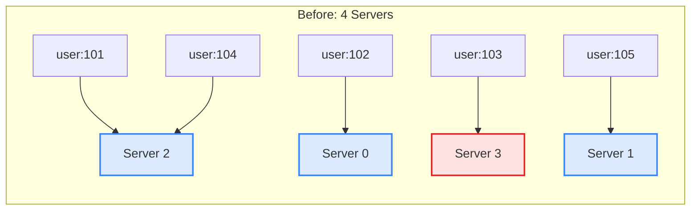
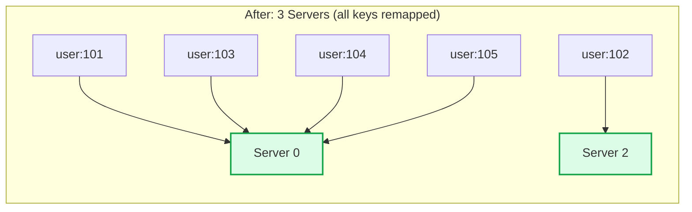
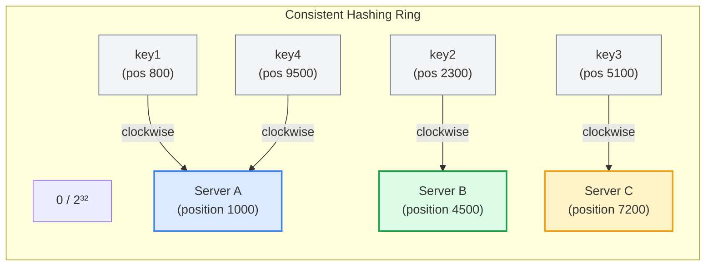
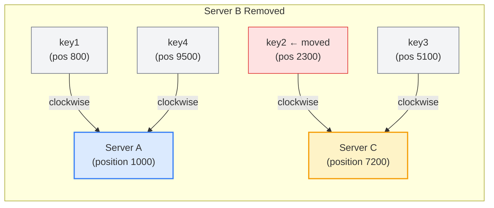
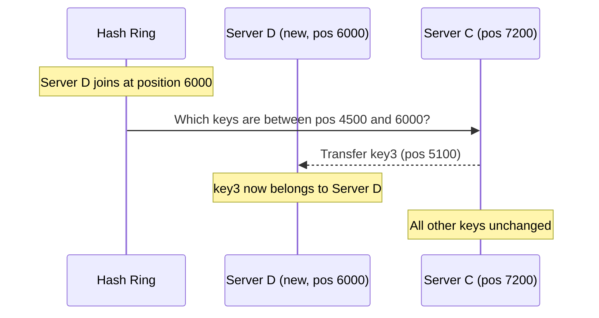
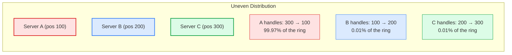
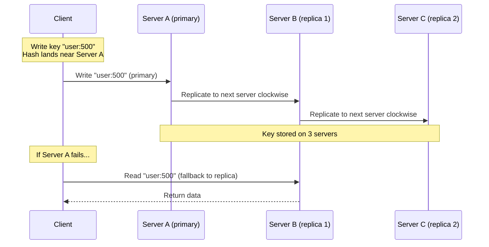

You have 5 cache servers. They are handling 10 million keys nicely. Then one server crashes.

With traditional hashing, almost every key now maps to a different server. Your cache hit rate drops to near zero. All 10 million keys effectively need to be re-fetched from the database. Your database gets slammed.

This is the problem consistent hashing solves. When that server crashes, only about 2 million keys (the ones that belonged to that server) need to be redistributed. The other 8 million keys stay exactly where they are. No cache stampede. No database meltdown.

Consistent hashing is one of those techniques that shows up everywhere in distributed systems. DynamoDB, Cassandra, Memcached, CDNs, load balancers. Once you understand how it works, you will see it in almost every system design discussion.

## The Problem: Traditional Hashing Breaks When Servers Change

Let's say you have 4 cache servers and you want to distribute keys across them. The simple approach is:

```
server = hash(key) % number_of_servers
```

With 4 servers:

| Key | hash(key) | hash(key) % 4 | Server |
|-----|-----------|----------------|--------|
| user:101 | 78234 | 2 | Server 2 |
| user:102 | 91456 | 0 | Server 0 |
| user:103 | 33219 | 3 | Server 3 |
| user:104 | 45678 | 2 | Server 2 |
| user:105 | 12345 | 1 | Server 1 |

This works fine. Until it doesn't.

### What Happens When a Server Goes Down

Server 3 crashes. Now you have 3 servers. The formula changes to `hash(key) % 3`:

| Key | hash(key) | hash(key) % 3 | New Server | Moved? |
|-----|-----------|----------------|------------|--------|
| user:101 | 78234 | 0 | Server 0 | <i class="fas fa-times-circle text-danger"></i> Yes |
| user:102 | 91456 | 2 | Server 2 | <i class="fas fa-times-circle text-danger"></i> Yes |
| user:103 | 33219 | 0 | Server 0 | <i class="fas fa-times-circle text-danger"></i> Yes |
| user:104 | 45678 | 0 | Server 0 | <i class="fas fa-times-circle text-danger"></i> Yes |
| user:105 | 12345 | 0 | Server 0 | <i class="fas fa-times-circle text-danger"></i> Yes |

Every single key now maps to a different server. Your cache hit rate drops from ~100% to close to 0%.





This is unacceptable for production systems. Losing one server should not mean losing your entire cache.

### What Happens When You Add a Server

Same problem in reverse. You add a 5th server to handle more load. The formula changes to `hash(key) % 5`. Again, almost every key maps to a different server. Your cache just got wiped out during the exact moment you needed more capacity.

The root cause is simple: the modulo operation depends on the number of servers. Change the number, and everything shifts.

## How Consistent Hashing Solves This

Consistent hashing gets rid of the modulo operation entirely. Instead of `hash(key) % N`, it places both servers and keys on a circular ring.

### The Hash Ring

Imagine a circle (ring) with positions from 0 to 2^32 - 1 (about 4.3 billion positions). This is the hash ring.

1. **Hash each server** to get its position on the ring
2. **Hash each key** to get its position on the ring
3. **Walk clockwise** from the key's position until you hit a server. That server owns the key.



In this setup:
- **key1** (position 800) walks clockwise and hits **Server A** (position 1000)
- **key2** (position 2300) walks clockwise and hits **Server B** (position 4500)
- **key3** (position 5100) walks clockwise and hits **Server C** (position 7200)
- **key4** (position 9500) walks clockwise, wraps around, and hits **Server A** (position 1000)

### What Happens Now When a Server Leaves

Let's say Server B goes down. Only the keys that were assigned to Server B need to move. They walk clockwise and land on Server C instead.



**key1** still goes to Server A. **key3** still goes to Server C. **key4** still goes to Server A. Only **key2** moved from Server B to Server C.

That's the magic. Instead of every key remapping, only the keys between the failed server and its predecessor need to move. Everything else stays put.

### What Happens When a Server Joins

When a new Server D joins at position 6000 (between Server B and Server C), it takes over only the keys between its predecessor (Server B at 4500) and itself (6000).



**key3** (position 5100) used to go to Server C. Now it goes to Server D. Every other key stays where it was.

### The Math

With traditional hashing and N servers, removing one server moves roughly **(N-1)/N** of all keys. For 10 servers, that's 90% of your keys.

With consistent hashing, removing one server moves only **1/N** of all keys. For 10 servers, that's 10%.

| Servers | Traditional: keys moved on failure | Consistent: keys moved on failure |
|---------|-----------------------------------|----------------------------------|
| 5 | 80% | 20% |
| 10 | 90% | 10% |
| 50 | 98% | 2% |
| 100 | 99% | 1% |

The bigger your cluster, the better consistent hashing gets.

## The Problem With Basic Consistent Hashing: Uneven Distribution

The basic version of consistent hashing has a flaw. With only a few servers, they might cluster together on the ring, leaving large gaps.

Imagine 3 servers that happen to hash close together:



Server A handles almost all the keys. Server B and C are practically idle. This creates a hotspot on Server A and wastes the capacity of B and C.

Even with a good hash function, when you only have 3 to 5 servers, the distribution is unlikely to be perfectly even. Statistics only work in your favor with large numbers, and you don't have large numbers of servers.

## Virtual Nodes: The Fix

Virtual nodes (vnodes) solve the uneven distribution problem. Instead of placing each server at one position on the ring, you place it at many positions.

Each physical server gets multiple virtual nodes spread across the ring. Server A might get positions at 500, 3200, 7800, and 9100. Server B might get positions at 1200, 4500, 6700, and 8900.

```mermaid
graph TB
    subgraph "Virtual Nodes on the Ring"
        direction TB

        VA1["A-vn1<br/>(pos 500)"]
        VB1["B-vn1<br/>(pos 1200)"]
        VA2["A-vn2<br/>(pos 3200)"]
        VB2["B-vn2<br/>(pos 4500)"]
        VC1["C-vn1<br/>(pos 5800)"]
        VB3["B-vn3<br/>(pos 6700)"]
        VA3["A-vn3<br/>(pos 7800)"]
        VC2["C-vn2<br/>(pos 8500)"]
        VB4["B-vn4<br/>(pos 8900)"]
        VA4["A-vn4<br/>(pos 9100)"]
    end

    style VA1 fill:#dbeafe,stroke:#3b82f6,stroke-width:2px
    style VA2 fill:#dbeafe,stroke:#3b82f6,stroke-width:2px
    style VA3 fill:#dbeafe,stroke:#3b82f6,stroke-width:2px
    style VA4 fill:#dbeafe,stroke:#3b82f6,stroke-width:2px
    style VB1 fill:#dcfce7,stroke:#16a34a,stroke-width:2px
    style VB2 fill:#dcfce7,stroke:#16a34a,stroke-width:2px
    style VB3 fill:#dcfce7,stroke:#16a34a,stroke-width:2px
    style VB4 fill:#dcfce7,stroke:#16a34a,stroke-width:2px
    style VC1 fill:#fef3c7,stroke:#f59e0b,stroke-width:2px
    style VC2 fill:#fef3c7,stroke:#f59e0b,stroke-width:2px
```



With 4 virtual nodes per server, the ring has 12 positions instead of 3. The gaps are much smaller and more uniform. More virtual nodes means better distribution.

### How Many Virtual Nodes?

| Virtual nodes per server | Load distribution | Memory overhead |
|--------------------------|-------------------|-----------------|
| 1 | Very uneven | Minimal |
| 10 | Somewhat uneven | Low |
| 100 | Mostly even | Moderate |
| 150 to 200 | Even | Moderate |
| 256 (Cassandra default) | Very even | Moderate |
| 500+ | Near perfect | Higher |

The sweet spot is typically 100 to 200 virtual nodes per physical server. Cassandra uses 256 by default. Going beyond 500 gives diminishing returns and uses more memory for the ring lookup table.

### Virtual Nodes Also Help With Heterogeneous Servers

Not all servers have the same capacity. A machine with 64 GB RAM should handle more data than one with 16 GB. With virtual nodes, you just give the bigger server more vnodes.

- Server A (64 GB): 200 virtual nodes
- Server B (32 GB): 100 virtual nodes
- Server C (16 GB): 50 virtual nodes

Server A gets roughly 4 times the traffic of Server C. The data distribution matches the actual server capacity. No manual sharding rules needed.

## Implementation: How It Works in Code

The core data structure is surprisingly simple. You need a sorted map where keys are ring positions and values are server identifiers.

```java
import java.util.*;
import java.security.MessageDigest;

public class ConsistentHashRing<T> {
    private final TreeMap<Long, T> ring = new TreeMap<>();
    private final int virtualNodes;

    public ConsistentHashRing(int virtualNodes) {
        this.virtualNodes = virtualNodes;
    }

    public void addServer(T server) {
        for (int i = 0; i < virtualNodes; i++) {
            long hash = hash(server.toString() + "-vn" + i);
            ring.put(hash, server);
        }
    }

    public void removeServer(T server) {
        for (int i = 0; i < virtualNodes; i++) {
            long hash = hash(server.toString() + "-vn" + i);
            ring.remove(hash);
        }
    }

    public T getServer(String key) {
        if (ring.isEmpty()) return null;

        long hash = hash(key);
        // Find the first server position >= key's hash
        Map.Entry<Long, T> entry = ring.ceilingEntry(hash);

        // If no server found clockwise, wrap around to the first server
        if (entry == null) {
            entry = ring.firstEntry();
        }
        return entry.getValue();
    }

    private long hash(String key) {
        try {
            MessageDigest md = MessageDigest.getInstance("MD5");
            byte[] digest = md.digest(key.getBytes());
            return ((long)(digest[0] & 0xFF) << 24) |
                   ((long)(digest[1] & 0xFF) << 16) |
                   ((long)(digest[2] & 0xFF) << 8) |
                   ((long)(digest[3] & 0xFF));
        } catch (Exception e) {
            throw new RuntimeException(e);
        }
    }
}
```

Usage:

```java
ConsistentHashRing<String> ring = new ConsistentHashRing<>(150);

ring.addServer("cache-server-1");
ring.addServer("cache-server-2");
ring.addServer("cache-server-3");

// Route keys to servers
String server = ring.getServer("user:12345");
System.out.println("user:12345 → " + server);

// Add a new server. Most keys stay on the same server.
ring.addServer("cache-server-4");
```

The key operations:
- **addServer**: O(V * log(N * V)) where V is virtual nodes and N is total servers
- **removeServer**: O(V * log(N * V))
- **getServer** (lookup): O(log(N * V))

The lookup is a binary search on a sorted tree, so it's fast even with thousands of servers and hundreds of virtual nodes per server.

## Replication with Consistent Hashing

In production distributed systems, you don't just store data on one server. You replicate it to handle failures. Consistent hashing makes replication straightforward.

To replicate a key with a replication factor of 3, store it on the server found by walking clockwise, plus the next 2 distinct servers clockwise.



This is exactly how DynamoDB and Cassandra handle replication. Walk clockwise on the ring, skip virtual nodes that belong to the same physical server, and replicate to the next N distinct physical servers.

When combined with [gossip protocol](/distributed-systems/gossip-dissemination/) for failure detection, the system can automatically route reads to replicas when the primary server is down.

## Real World: Who Uses Consistent Hashing

### Amazon DynamoDB

DynamoDB is probably the most famous user of consistent hashing. The original [Dynamo paper](https://www.allthingsdistributed.com/files/amazon-dynamo-sosp2007.pdf) from 2007 described how Amazon uses consistent hashing to partition data across storage nodes.

Each DynamoDB partition is assigned a range on the hash ring. When you write an item, DynamoDB hashes its partition key to find which partition (and which storage node) owns it. When nodes join or leave, only the affected range of the ring gets rebalanced.

DynamoDB uses virtual nodes and a preference list (ordered list of nodes responsible for a key range) to handle replication and failure recovery.

### Apache Cassandra

Cassandra uses consistent hashing as its core data distribution mechanism. Every row in Cassandra has a partition key, and the partition key is hashed (using Murmur3 by default) to determine which node stores it.

Cassandra uses 256 virtual nodes per server by default. This gives a fairly even distribution even with clusters of just 3 to 5 nodes. The token range each node owns is visible and can be manually adjusted.

When a new node joins, it takes over token ranges from existing nodes. [Gossip protocol](/distributed-systems/gossip-dissemination/) propagates the new token assignments to the rest of the cluster.

### Memcached

The Memcached client library uses consistent hashing to decide which cache server stores each key. When you call `memcached.set("user:123", data)`, the client hashes "user:123" and uses the hash ring to find the target server.

This is a client-side implementation of consistent hashing. The servers don't know about each other. The client maintains the ring and routes requests accordingly.

The big win: when a Memcached server goes down, only the keys on that server are lost. All other servers keep their data intact. Without consistent hashing, losing one server would invalidate almost every cache entry.

### CDNs (Akamai, Cloudflare)

Content Delivery Networks use consistent hashing to route content requests to edge servers. When a user requests a file, the CDN hashes the URL to determine which edge server should [cache](/caching-strategies-explained/) that content.

This ensures that the same content is consistently served from the same edge server, maximizing cache hit rates. When edge servers are added or removed (for maintenance or scaling), only a fraction of content needs to be re-fetched from the origin.

The [original consistent hashing paper](https://dl.acm.org/doi/10.1145/258533.258660) by Karger et al. (1997) was actually motivated by this exact CDN use case. David Karger and his colleagues at MIT developed consistent hashing specifically to solve the web caching problem for Akamai.

### Discord

Discord uses consistent hashing to route messages to the correct server in their chat infrastructure. Each guild (server in Discord terms) is mapped to a specific backend server using consistent hashing. This ensures all messages for a guild go to the same server, which maintains the in-memory state for that guild.

## Consistent Hashing in System Design Interviews

Consistent hashing shows up in a lot of system design interview questions. Here are the common scenarios where you should bring it up:

### Distributed Cache Design

When designing a distributed cache, consistent hashing is the go-to approach for key distribution. The interviewer wants to hear that you understand why `hash(key) % N` breaks during scaling and how consistent hashing fixes it.

Key points to mention:
- <i class="fas fa-check-circle text-success"></i> Hash ring with virtual nodes for even distribution
- <i class="fas fa-check-circle text-success"></i> Only K/N keys move when a server is added or removed
- <i class="fas fa-check-circle text-success"></i> Client-side vs server-side ring management
- <i class="fas fa-check-circle text-success"></i> Cache hit rate stays high during scaling events

### Database Sharding

When [sharding a database](/system-design-cheat-sheet/#sharding-partitioning) across multiple servers, consistent hashing determines which shard holds which data. This is preferable to range-based sharding when you want even distribution and the ability to add shards without rebalancing everything.

### Load Balancer Design

For sticky sessions (routing the same user to the same backend server), consistent hashing on the user ID or session ID gives you persistence without a session store. If a backend server goes down, only the sessions on that server are affected.

### URL Shortener / Pastebin

When designing systems like URL shorteners, you need to distribute data across multiple storage nodes. Consistent hashing on the short URL key distributes writes evenly and makes it easy to add more storage servers as the system grows.

## Consistent Hashing vs Other Partitioning Strategies

| Strategy | Key Movement on Scaling | Distribution | Complexity | Use Case |
|----------|------------------------|-------------|------------|----------|
| Modulo hashing | Nearly all keys | Even (when stable) | Low | Small, fixed clusters |
| Range-based | Only affected range | Can be uneven | Medium | Ordered data (time series) |
| Consistent hashing | Only K/N keys | Even (with vnodes) | Medium | Dynamic clusters, caches |
| Rendezvous hashing | Only K/N keys | Even | Medium | When ring overhead matters |
| Directory-based | Depends on rules | Configurable | High | Complex routing needs |

Consistent hashing is the best fit when your cluster size changes frequently and you want to minimize data movement. Range-based partitioning is better when you need ordered scans across a range of keys.

## Common Pitfalls

### 1. Using Too Few Virtual Nodes

With only 1 virtual node per server, distribution is poor. One server might handle 60% of keys while another handles 5%. Use at least 100 virtual nodes per server.

### 2. Ignoring the Cost of Data Migration

Consistent hashing minimizes which keys move, but those keys still need to be physically transferred. If Server B fails and its 1 million keys need to move to Server C, that migration takes time and bandwidth. Plan for it.

**Fix**: Use replication. If every key is stored on 3 servers, you don't need to transfer anything when one fails. The replicas already have the data.

### 3. Hot Keys

Consistent hashing distributes keys evenly, but it can't fix hotspot keys. If one key gets 10,000 times more reads than others (think a viral tweet), the server holding that key gets overloaded regardless of how evenly the ring distributes other keys.

**Fix**: Use read replicas for hot keys, or split hot keys into sub-keys (e.g., `popular_post:1:shard_0` through `popular_post:1:shard_9`) and merge results on read.

### 4. Ring Metadata Consistency

Every client or node needs the same view of the ring. If Client A thinks the ring has 5 servers and Client B thinks it has 4, they will route the same key to different servers.

**Fix**: Use a coordination service like ZooKeeper or etcd to store the ring configuration. Or use [gossip protocol](/distributed-systems/gossip-dissemination/) to propagate ring changes, as Cassandra does.

### 5. Not Accounting for Server Heterogeneity

If all servers get the same number of virtual nodes but have different capacities, smaller servers get overwhelmed.

**Fix**: Assign virtual nodes proportional to server capacity. A server with 2x the RAM gets 2x the virtual nodes.

## When to Use Consistent Hashing

**Use consistent hashing when:**
- <i class="fas fa-check-circle text-success"></i> Your cluster scales up and down (servers are added or removed)
- <i class="fas fa-check-circle text-success"></i> You want to minimize data movement during scaling
- <i class="fas fa-check-circle text-success"></i> You need to distribute data or load across multiple servers
- <i class="fas fa-check-circle text-success"></i> You are building a distributed [cache](/caching-strategies-explained/), database, or CDN
- <i class="fas fa-check-circle text-success"></i> You need sticky routing (same key always goes to the same server)

**Don't use consistent hashing when:**
- <i class="fas fa-times-circle text-danger"></i> You have a fixed, small number of servers that never change (simple modulo is fine)
- <i class="fas fa-times-circle text-danger"></i> You need range queries on keys (use range-based partitioning)
- <i class="fas fa-times-circle text-danger"></i> Your data has a natural partition key that maps to specific servers (use directory-based routing)
- <i class="fas fa-times-circle text-danger"></i> You have a single database server (no partitioning needed)

## Wrapping Up

Consistent hashing is one of those ideas that seems simple once you understand it, but it solves a real and painful problem in distributed systems. The key takeaways:

1. **Traditional hashing breaks when cluster size changes**: `hash(key) % N` remaps almost every key
2. **Consistent hashing uses a ring**: Both servers and keys are hashed onto a circle, and keys go to the nearest server clockwise
3. **Only K/N keys move during scaling**: Adding or removing a server affects only a fraction of keys
4. **Virtual nodes fix uneven distribution**: Place each server at multiple ring positions for balanced load
5. **Replication walks the ring**: Store copies on the next N distinct servers clockwise for fault tolerance
6. **It's everywhere**: DynamoDB, Cassandra, Memcached, CDNs, Discord, and more

The next time you design a system that needs to distribute data across multiple servers, start with consistent hashing. It's battle tested, well understood, and it will save you from cache stampedes and data reshuffling nightmares.

---

*For more on distributed systems, check out [Gossip Protocol](/distributed-systems/gossip-dissemination/) for how nodes discover each other, [Caching Strategies](/caching-strategies-explained/) for cache patterns, and [How Kafka Works](/distributed-systems/how-kafka-works/) for distributed messaging.*

*Building systems that scale? See [System Design Cheat Sheet](/system-design-cheat-sheet/) for a complete reference, [How Meta Achieves Cache Consistency](/meta-cache-consistency/) for distributed caching at scale, and [Hash Collisions Explained](/data-structures/hashtable-collisions/) for the data structure fundamentals behind hashing.*

*References: [Consistent Hashing and Random Trees (Karger et al., 1997)](https://dl.acm.org/doi/10.1145/258533.258660), [Dynamo: Amazon's Highly Available Key-Value Store](https://www.allthingsdistributed.com/files/amazon-dynamo-sosp2007.pdf), [Apache Cassandra Architecture Documentation](https://cassandra.apache.org/doc/latest/cassandra/architecture/dynamo.html), [Toptal: A Guide to Consistent Hashing](https://www.toptal.com/big-data/consistent-hashing)*
