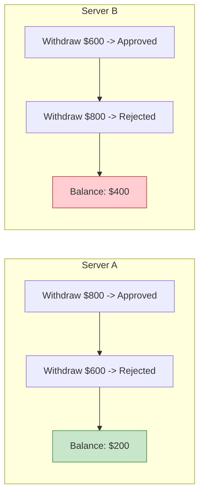
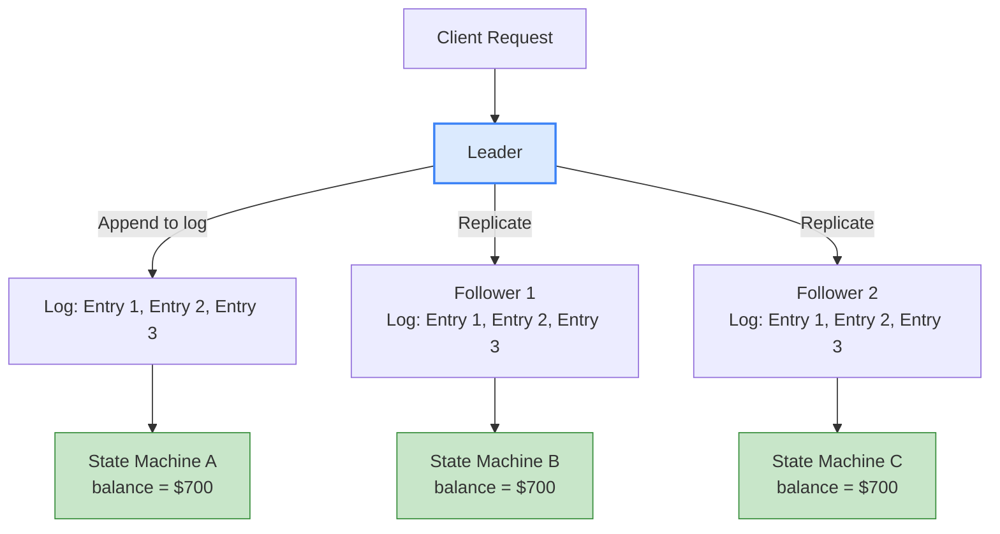
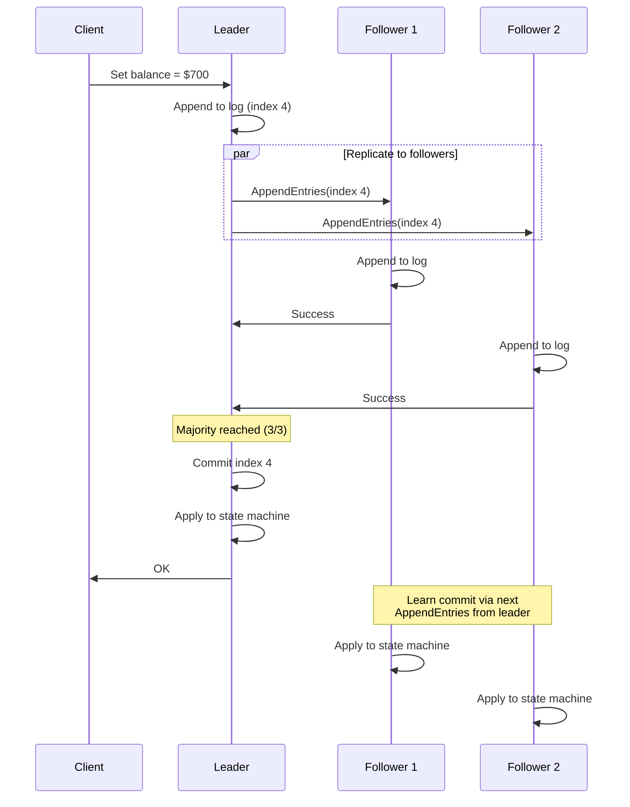
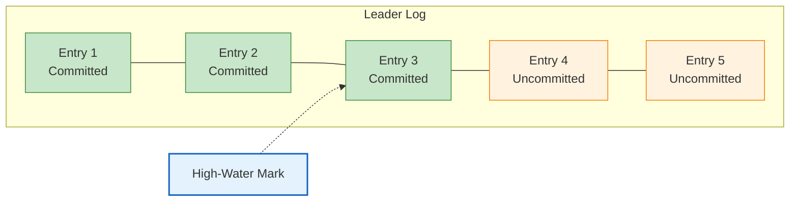
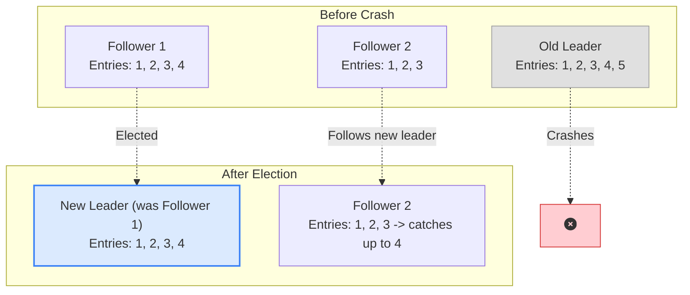
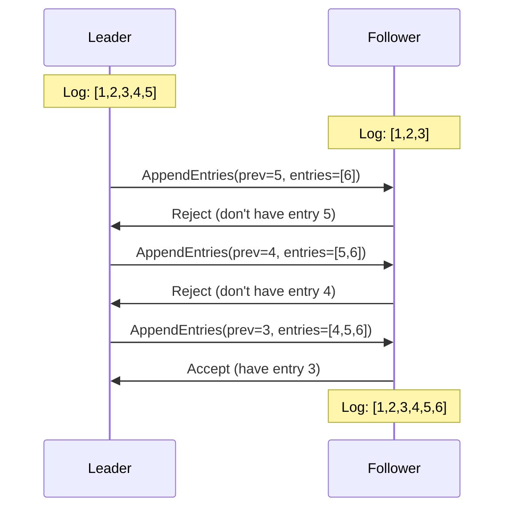
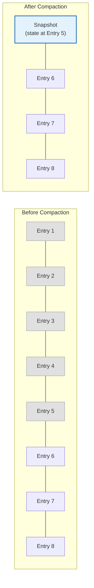
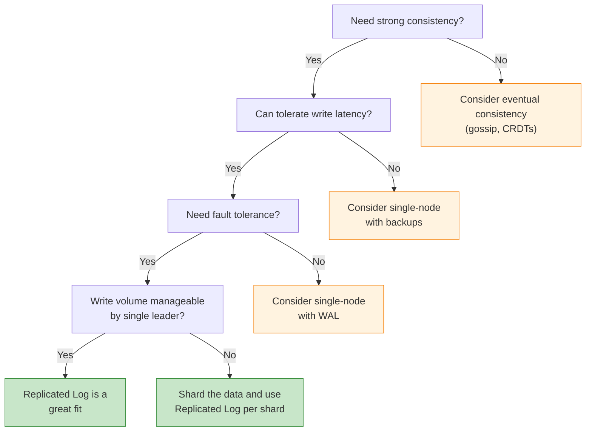

You have three database servers. A client writes `balance = 500` to Server 1. Then another client reads from Server 2. What balance does it see?

If Server 2 hasn't received the update yet, it returns stale data. The client sees an old balance. Maybe they overdraw their account. Maybe they see a phantom order. Maybe two servers disagree on who owns a record, and you get data corruption.

This is the problem at the heart of every distributed database, every consensus system, every coordination service. How do you keep multiple servers in sync, executing the same operations in the same order, even when networks drop packets and servers crash?

The answer is a pattern called **Replicated Log**. It's the backbone of systems like etcd, CockroachDB, Apache Kafka, and ZooKeeper. And once you understand it, a lot of distributed systems start making sense.

## The Problem: Order Matters More Than You Think

Let's say you have two servers sharing a bank account with a balance of $1000. Two requests arrive at almost the same time:

1. **Withdraw $800** (from an ATM)
2. **Withdraw $600** (from a mobile app)

Both servers know the balance is $1000. Both need to check if there's enough money before approving the withdrawal. But they process the requests in different order.

**Server A** processes the ATM withdrawal first:
- Withdraw $800 from $1000 → approved, balance is now $200
- Withdraw $600 from $200 → **rejected**, not enough funds

**Server B** processes the mobile withdrawal first:
- Withdraw $600 from $1000 → approved, balance is now $400
- Withdraw $800 from $400 → **rejected**, not enough funds

Now your two servers disagree. Server A says the balance is $200 and the ATM customer got their cash. Server B says the balance is $400 and the mobile customer got their cash. Two different customers. Two different balances. Two different versions of reality.

The problem is not that servers can't agree on individual operations. They can. The problem is that **they process operations in different orders**, and order changes the outcome. A different order means a different customer gets approved, a different customer gets rejected, and the final balance is different.

This is why you need a replicated log.

## What Is a Replicated Log?

A replicated log is an ordered, append-only sequence of entries that gets copied to every node in a cluster. Think of it as a shared notebook. Every server has a copy. Every copy has the exact same entries in the exact same order.

The idea is based on a simple but powerful insight called **state machine replication**: if you start with the same initial state and apply the same operations in the same order, you always end up with the same final state.

So instead of trying to sync the *state* across servers (which is complicated), you sync the *log of operations*. Each server maintains its own copy of the log. Each server applies the log entries in order. And because the logs are identical, the states are identical.

All three state machines end up with the same balance because they all applied the same entries in the same order. This is the core idea.

If you're familiar with the [Write-Ahead Log (WAL)](/distributed-systems/write-ahead-log/) pattern, the replicated log builds directly on top of it. WAL gives you durability on a single node. The replicated log gives you durability across the entire cluster.

## How Replicated Log Works Step by Step

Let's walk through the full lifecycle of a single client request in a replicated log system.

### Step 1: Client Sends Request to Leader

In a replicated log system, one node is elected as the **leader**. All writes go through the leader. This is important because it establishes a single point of ordering. If multiple nodes could accept writes simultaneously, they might order things differently.

### Step 2: Leader Appends to Its Own Log

The leader takes the client request and appends it as a new entry at the end of its local log. Each entry gets a monotonically increasing index number and includes the leader's current term (generation number).

### Step 3: Leader Sends Entry to Followers

The leader sends the new log entry to all follower nodes. In Raft, this is the `AppendEntries` RPC. The message includes the entry itself, the index, the term, and the index and term of the previous entry (for consistency checks).

### Step 4: Followers Append and Acknowledge

Each follower receives the entry, checks that it matches (the previous entry index and term must match what the follower already has), appends the entry to its own log, and sends back an acknowledgment.

### Step 5: Leader Commits After Majority

Once the leader receives acknowledgments from a [majority of nodes](/distributed-systems/majority-quorum/) (including itself), the entry is **committed**. This is the point of no return. The entry will never be lost or overwritten.

### Step 6: Apply to State Machine

The leader applies the committed entry to its own state machine and responds to the client. Followers learn about the commit through subsequent messages from the leader and apply the entry to their own state machines.

### Why Majority Matters

The leader doesn't wait for all followers. It only waits for a majority. In a 5-node cluster, the leader needs 3 acknowledgments (including itself). This means the system can tolerate 2 node failures and still make progress.

This is where the replicated log pattern connects to the [Majority Quorum](/distributed-systems/majority-quorum/) pattern. The quorum ensures that any committed entry exists on at least a majority of nodes. Even if the minority nodes crash, the committed data survives on the majority.

## The High-Water Mark: What's Safe to Read

Not every entry in the log is committed. The leader might have appended entries that followers haven't acknowledged yet. If a client reads from a follower, should the follower serve those uncommitted entries?

No. Uncommitted entries can still be overwritten if the leader crashes before getting majority acknowledgment.

This is where the **high-water mark** (also called commit index) comes in. It's an index that tracks the last log entry safely replicated to a majority. Only entries at or below the high-water mark are committed. Only committed entries get applied to the state machine.

The leader communicates the high-water mark to followers along with log entries. Each follower updates its own commit index accordingly and only applies entries up to that point.

This pattern has a nice side effect: followers can safely serve read requests for any data derived from committed log entries. This is how systems like etcd and CockroachDB scale reads across the cluster without sacrificing consistency.

## What Happens When the Leader Crashes

The leader is a single point of ordering, but it's not a single point of failure. When the leader crashes, a new leader gets elected. This is where things get interesting.

### Leader Election

Followers detect the leader is gone through missed [heartbeats](/distributed-systems/heartbeat/). One of them starts an election by incrementing its term number and asking other nodes for votes. A node only votes for a candidate whose log is at least as up-to-date as its own. The candidate with the most complete log wins.

This voting rule is critical. It guarantees that the new leader has every committed entry. Since committed entries exist on a majority of nodes, and a candidate needs a majority of votes, at least one voter has every committed entry. And since voters only vote for candidates with equally or more complete logs, the winner must have all committed entries.

### What Happens to Uncommitted Entries

Entries that were on the old leader but not committed (not replicated to a majority) might be lost. This is by design. The client never received a success response for these entries, so from the client's perspective, the operation might not have happened. The client should retry.

Entry 5 was only on the old leader. It was never committed. It's gone. Entry 4 was on the old leader and Follower 1. If 4 was committed (majority had it in a 3-node cluster: leader + Follower 1 = 2 out of 3, which is not a majority), then it's actually not committed and could be lost too. But if the cluster had 5 nodes and 3 had entry 4, then it was committed and the new leader will have it.

This is why the majority quorum size matters so much. It determines how many nodes can fail before committed data is at risk.

## Log Consistency: Keeping Followers in Line

In a running cluster, a follower's log might fall behind the leader's. This happens when:

- The follower was temporarily offline
- Network packets were dropped
- The follower was slow to process entries

The leader handles this with a consistency check. When it sends an `AppendEntries` request, it includes the index and term of the entry just before the new ones. The follower checks if it has that previous entry. If it doesn't match, the follower rejects the request.

The leader then steps back one entry and tries again. It keeps stepping back until it finds a point where the logs match. Then it sends all entries from that point forward, overwriting any conflicting entries on the follower.

This backtracking mechanism ensures that eventually, every follower's log matches the leader's. The leader's log is always the source of truth.

## Log Compaction: Preventing Infinite Growth

If every operation ever performed lives in the log forever, the log grows without bound. A system running for years would have a massive log that takes forever to replay. And when a new node joins the cluster, it would need to replay every single entry from the beginning of time.

This is where **log compaction** (also called snapshotting) comes in.

The idea: periodically take a snapshot of the current state machine state. Once you have the snapshot, you can discard all log entries up to that point. The snapshot represents the cumulative effect of all those entries.

When a new node joins:
1. Leader sends the latest snapshot
2. New node loads the snapshot (instant state recovery)
3. Leader sends log entries after the snapshot
4. New node replays those entries to catch up

This makes recovery fast and keeps storage bounded. Both Raft and ZAB use this approach. Kafka uses a similar concept with log segment retention and compaction.

## Real-World Systems That Use Replicated Logs

### Raft (etcd, CockroachDB, Consul, TiKV)

Raft is the most well-known implementation of the replicated log pattern. Designed by Diego Ongaro and John Ousterhout at Stanford in 2014, Raft was explicitly built to be understandable (unlike [Paxos](/distributed-systems/paxos/), which is notoriously hard to implement correctly).

Raft uses a replicated log as its core mechanism:
- <i class="fas fa-check-circle text-success"></i> A leader accepts all writes
- <i class="fas fa-check-circle text-success"></i> Log entries are replicated to followers via AppendEntries RPCs
- <i class="fas fa-check-circle text-success"></i> Entries are committed after majority acknowledgment
- <i class="fas fa-check-circle text-success"></i> Each node applies committed entries to its state machine

**etcd** (the coordination service behind Kubernetes) uses Raft for its key-value store. Every `put` or `delete` is a log entry. The entire cluster state is the result of applying all committed log entries.

**CockroachDB** uses Raft at the range level. Each range (a chunk of data) has its own Raft group with its own replicated log. This gives you distributed SQL with strong consistency guarantees.

### Apache Kafka

[Kafka](/distributed-systems/how-kafka-works/) takes the replicated log idea and makes the log itself the primary data structure. Each Kafka partition is an ordered, append-only log that gets replicated across multiple brokers.

Kafka's replication model differs slightly from Raft:
- The partition leader writes entries to its log
- Followers pull entries from the leader (rather than the leader pushing)
- The **ISR (In-Sync Replicas)** set tracks which followers are caught up
- An entry is committed when all ISR members have it

The high-water mark in Kafka is called the **Last Stable Offset (LSO)** or **High Watermark**. Consumers can only read up to this point.

### ZooKeeper (ZAB Protocol)

ZooKeeper uses its own protocol called ZAB (ZooKeeper Atomic Broadcast) for log replication. The pattern is similar:
- A leader proposes changes
- Followers acknowledge
- Once a majority acknowledges, the change is committed
- All nodes apply changes in the same order

ZooKeeper is used by many systems for distributed coordination, including older versions of Kafka (for broker metadata). Newer Kafka versions replaced ZooKeeper with KRaft, their own Raft-based protocol.

### Google Spanner

Spanner uses Paxos-based log replication for each split (data partition). Each split has its own Paxos group, and writes are replicated through the Paxos log. This gives Spanner its globally consistent, distributed SQL capabilities.

## Replicated Log vs Other Replication Approaches

Not every replication technique uses a replicated log. Here's how it compares:

### Statement-Based Replication

Instead of replicating the log, you replicate SQL statements. MySQL used this for a long time.

**Problems:**
- <i class="fas fa-times-circle text-danger"></i> Non-deterministic functions (`NOW()`, `RAND()`) produce different results on different nodes
- <i class="fas fa-times-circle text-danger"></i> Auto-incrementing columns can get different values
- <i class="fas fa-times-circle text-danger"></i> Side effects (triggers, stored procedures) may behave differently

### Row-Based Replication

Instead of replicating commands, replicate the actual data changes (before and after values). MySQL binary log in ROW format does this.

**Benefits:**
- <i class="fas fa-check-circle text-success"></i> Deterministic: no issues with `NOW()` or `RAND()`
- <i class="fas fa-check-circle text-success"></i> Works with any SQL statement

**Downsides:**
- <i class="fas fa-times-circle text-danger"></i> More data to transfer (full row values vs. compact commands)
- <i class="fas fa-times-circle text-danger"></i> Doesn't support arbitrary state machine logic

### Replicated Log (Command-Based)

The replicated log replicates the commands themselves in strict order.

**Benefits:**
- <i class="fas fa-check-circle text-success"></i> Compact: just the command, not the full data
- <i class="fas fa-check-circle text-success"></i> Works for any deterministic state machine, not just databases
- <i class="fas fa-check-circle text-success"></i> Enables strong consistency guarantees

**Downsides:**
- <i class="fas fa-times-circle text-danger"></i> Commands must be deterministic
- <i class="fas fa-times-circle text-danger"></i> Requires consensus protocol (added latency)
- <i class="fas fa-times-circle text-danger"></i> All nodes must process every command (can't skip ahead)

## The Tradeoffs

The replicated log pattern is powerful, but it's not free. Here's what you're signing up for:

### Latency

Every write must wait for majority acknowledgment before the client gets a response. In a 5-node cluster spread across data centers, that means waiting for at least 3 nodes to confirm. If two of those nodes are on another continent, you're adding hundreds of milliseconds per write.

### Throughput

All writes go through a single leader. The leader's network and disk bandwidth become the bottleneck. You can shard (like CockroachDB does with ranges), but each shard still has a single leader.

### Complexity

Implementing a replicated log correctly is hard. Edge cases around leader elections, log conflicts, snapshotting, and cluster membership changes are subtle and error-prone. This is why most teams use an existing implementation (etcd, Raft library) rather than building their own.

### Storage

Every node stores a full copy of the log (or at least the state derived from it). If your dataset is 100 GB and you have 5 replicas, you need 500 GB of storage minimum.

## When to Use Replicated Log

**Use replicated log when:**
- You need strong consistency (linearizability or sequential consistency)
- Data loss is unacceptable
- You need automatic failover
- Your write throughput fits within a single leader (or you can shard)

**Consider alternatives when:**
- Eventual consistency is acceptable (use [gossip dissemination](/distributed-systems/gossip-dissemination/))
- You need extreme write throughput from every node (consider leaderless replication)
- Your system is a single server (use a [write-ahead log](/distributed-systems/write-ahead-log/) for durability)
- You're coordinating distributed transactions across services (consider [two-phase commit](/distributed-systems/two-phase-commit/))

## Key Takeaways for Developers

1. **Order is everything.** The replicated log doesn't just copy data. It copies an ordered sequence of commands. This ordering is what keeps all nodes consistent.

2. **Majority quorum makes it fault-tolerant.** By requiring only a majority of nodes to acknowledge, the system keeps working even when some nodes are down.

3. **The high-water mark protects consistency.** Never serve uncommitted data. The high-water mark tells you what's safe to read.

4. **Leader-based design simplifies ordering.** Having a single leader that decides the order of log entries avoids the complexity of multi-leader conflicts.

5. **Log compaction keeps storage bounded.** Snapshots let you discard old log entries without losing state.

6. **Don't implement your own.** Unless you're building infrastructure at the level of etcd or CockroachDB, use an existing Raft library or a system that already implements this pattern.

## Wrapping Up

The replicated log pattern is one of the most important building blocks in distributed systems. It turns the hard problem of keeping multiple servers in sync into a simpler problem: make sure everyone has the same ordered list of operations.

This pattern is behind the systems you use every day. When Kubernetes stores cluster state in etcd, it's using a replicated log. When Kafka replicates your messages across brokers, it's using a replicated log. When CockroachDB gives you distributed SQL that doesn't lose data, it's using a replicated log.

Understanding this pattern gives you a mental model for reasoning about consistency, fault tolerance, and replication in any distributed system you work with.

---

*For more distributed systems patterns, check out [Write-Ahead Log](/distributed-systems/write-ahead-log/), [Majority Quorum](/distributed-systems/majority-quorum/), [Paxos Consensus](/distributed-systems/paxos/), [Heartbeat: Failure Detection](/distributed-systems/heartbeat/), [Gossip Dissemination](/distributed-systems/gossip-dissemination/), and [How Kafka Works](/distributed-systems/how-kafka-works/).*

*Further reading: Martin Fowler's [Patterns of Distributed Systems](https://martinfowler.com/articles/patterns-of-distributed-systems/replicated-log.html) catalog covers the replicated log and related patterns in depth.*
