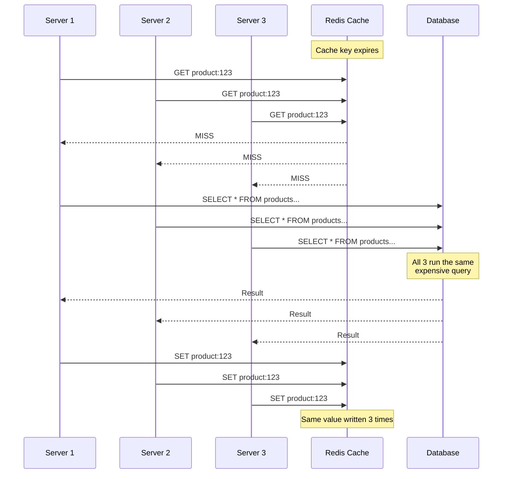
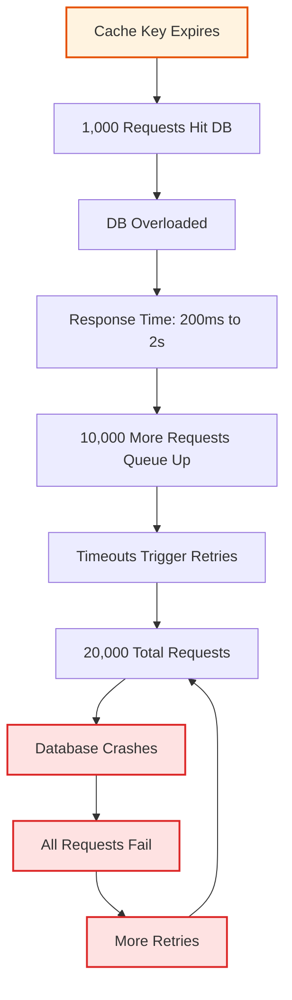
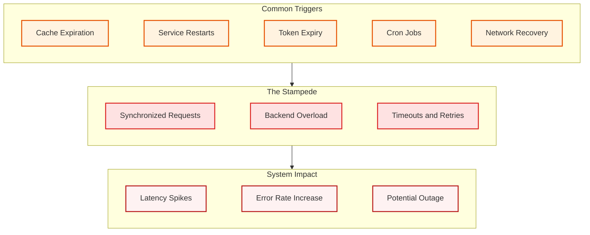
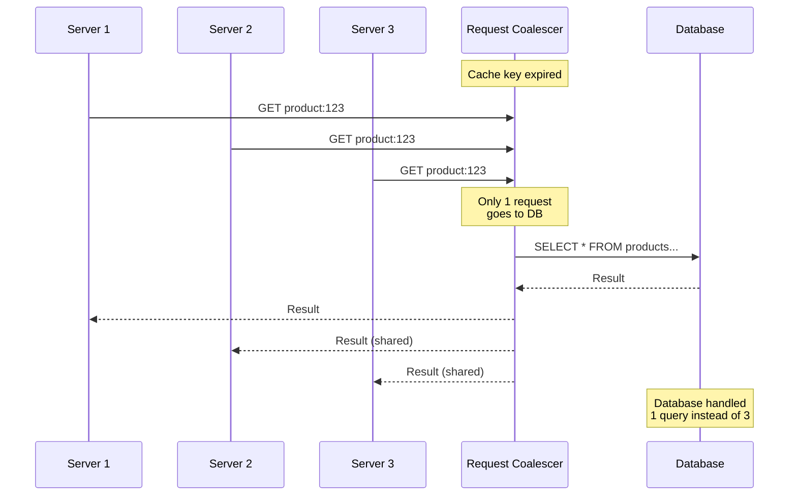
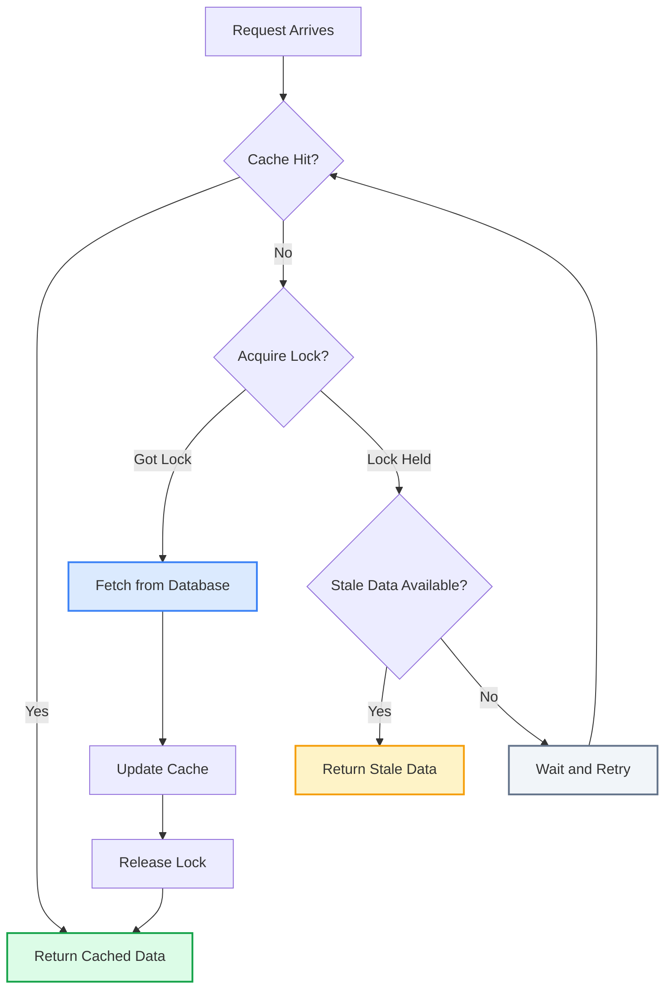
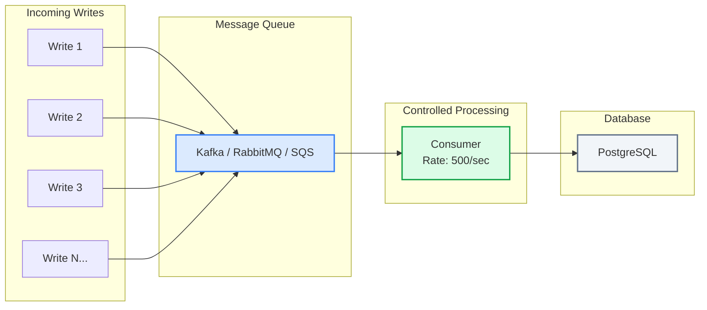
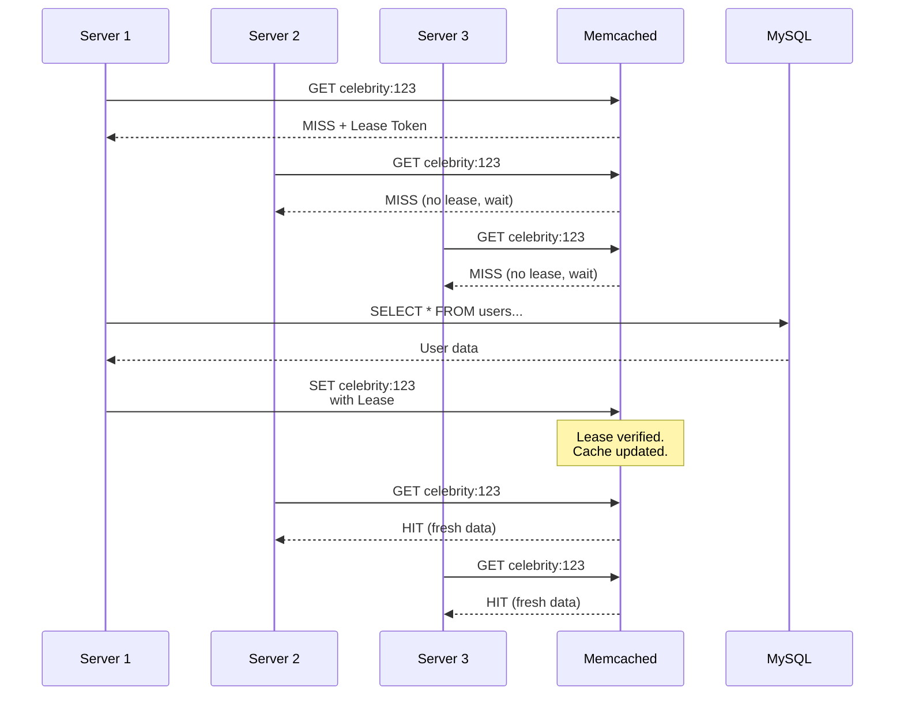
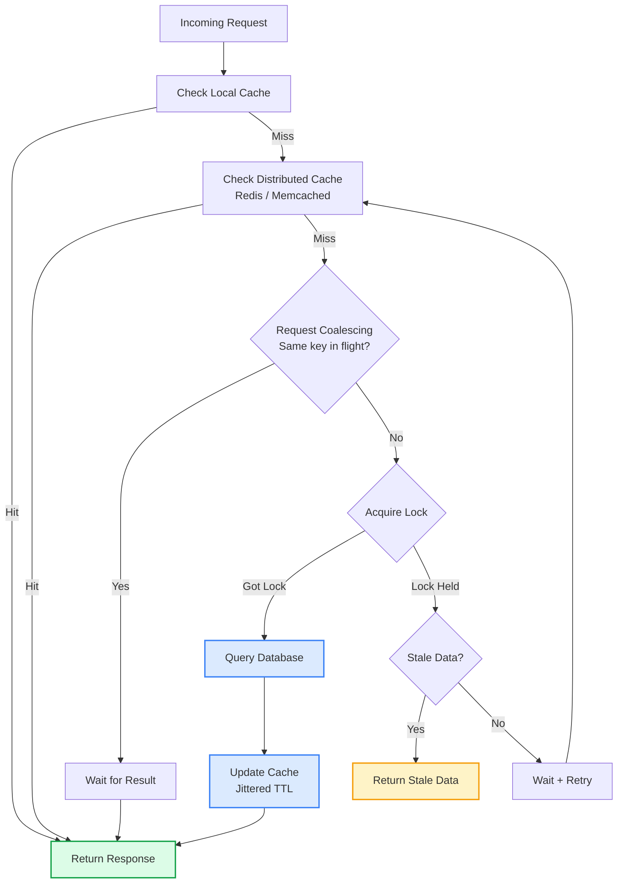

It is 3 AM. Your phone buzzes. "Database CPU at 100%. All queries timing out."

You check the logs. The database went from handling 500 queries per second to receiving 15,000 queries in the same second. Your cache key for the product catalog expired at midnight. Every server in your fleet discovered the miss at the same time. Every one of them hit the database. The database fell over. And because every request timed out, the retry logic kicked in. Now instead of 15,000 queries, you are looking at 30,000.

This is the thundering herd problem. And it has taken down systems at companies of every size.

## Table of Contents

1. [What Is the Thundering Herd Problem?](#what-is-the-thundering-herd-problem)
2. [Why Systems Collapse Under Thundering Herd](#why-systems-collapse-under-thundering-herd)
3. [Where It Shows Up in Real Systems](#where-it-shows-up-in-real-systems)
4. [Six Solutions That Actually Work](#six-solutions-that-actually-work)
5. [How Big Tech Companies Solved It](#how-big-tech-companies-solved-it)
6. [Practical Implementation Guide](#practical-implementation-guide)
7. [Which Solution Should You Pick?](#which-solution-should-you-pick)
8. [Lessons Learned](#lessons-learned)

## What Is the Thundering Herd Problem?

The thundering herd problem happens when a large number of requests hit the same backend resource at the same time. The name comes from a herd of animals startled awake simultaneously, all stampeding in the same direction.

In software systems, this most commonly shows up as a **cache stampede** (also called the dog pile effect). Here is the sequence:

1. A popular cache key expires
2. Hundreds of concurrent requests arrive for that key
3. Every request sees a cache miss
4. Every request queries the database
5. The database gets overwhelmed and either slows down or crashes



Now imagine this with 500 servers instead of 3. That is the thundering herd.

The term originally comes from operating systems. When multiple threads wait on a lock or event, the OS wakes all of them even though only one can proceed. The rest waste CPU cycles going back to sleep. Linux fixed this at the kernel level with the `EPOLLEXCLUSIVE` flag in kernel 4.5, which wakes only one thread per event. But in distributed systems, the problem persists because there is no central OS coordinating your servers.

## Why Systems Collapse Under Thundering Herd

The math is what makes this dangerous. Consider a system with these specs:

| Metric | Value |
|--------|-------|
| Cache TTL | 1 hour |
| Requests per second | 5,000 |
| Database capacity | 500 concurrent queries |
| Backend query time | 200ms |

Under normal operation, the cache absorbs 99% of reads. The database handles a comfortable 50 queries per second. Life is good.

Then the cache key expires.

In the 200ms it takes to execute one database query, **1,000 requests arrive** (5,000 RPS * 0.2 seconds). All 1,000 hit the database. Your database capacity is 500 concurrent queries. It is now overloaded by 2x.

But it gets worse. The overloaded database takes longer to respond. Response times climb from 200ms to 2 seconds. In those 2 seconds, **10,000 more requests pile up**. And then the retries begin.



This is a **positive feedback loop**. The system's failure response (retries) generates more load, which causes more failures, which triggers more retries. What started as a 2x overload snowballs into a 40x overload.

The key insight: **systems are designed for sustained rate, not instantaneous load**. Your database handles 500 QPS just fine. But it cannot handle 10,000 requests arriving in the same millisecond.

## Where It Shows Up in Real Systems

Cache expiration is the most common trigger, but the thundering herd problem appears in many other scenarios.

### <i class="fas fa-sync-alt"></i> Service Restart Storms

You deploy a new version of your service. The rolling deployment restarts 50 instances. Each instance starts with an empty local cache. All 50 instances simultaneously hit the database or downstream services to warm their caches.

### <i class="fas fa-key"></i> Auth Token Expiry

Your microservices share a [JWT token](/how-jwt-works/) with a fixed expiry. When it expires, all 30 services request a new token from the auth server at the exact same second. The auth server buckles under the synchronized load.

### <i class="fas fa-clock"></i> Synchronized Scheduled Tasks

You have 100 servers running a cron job at `0 * * * *` (top of every hour). All 100 servers trigger the same heavy operation simultaneously. If you need to understand cron expressions better, check out [this guide on cron jobs](/explainer/cron-jobs-explained/).

### <i class="fas fa-network-wired"></i> Network Partition Recovery

A network partition isolates some clients from your service. When the partition heals, all the queued requests from those clients arrive at once. The service goes from zero load to peak load instantly.

### <i class="fas fa-redo"></i> Retry Storms

A downstream service goes down for 30 seconds. During that time, all requests fail and queue up for retry. When the service comes back, every client retries simultaneously. The burst of retries can knock the service back down, creating a cycle.

This pattern is related to what happens during major outages. The [AWS US-East outage in October 2025](/aws-us-east-outage-october-2025/) showed how cascading failures combine with retry storms to amplify problems.



## Six Solutions That Actually Work

There is no single magic fix. Each solution addresses the problem from a different angle. The best approach usually combines two or three of these.

### 1. Jitter: Break the Synchronization

The simplest and most effective first step. Jitter adds randomness to TTLs and retry intervals so that requests naturally spread out over time instead of clustering at the same moment.

**Without jitter:**

All cache keys set with `TTL = 3600` expire at exactly the same second. If your service started at 10:00 AM, every key expires at 11:00 AM.

**With jitter:**

```python
import random

BASE_TTL = 3600  # 1 hour
JITTER_RANGE = 300  # 5 minutes

def get_ttl():
    return BASE_TTL + random.randint(-JITTER_RANGE, JITTER_RANGE)
    # Returns between 3300 and 3900 seconds
```

Instead of all keys expiring at 11:00:00, they expire between 10:55:00 and 11:05:00. The database handles a steady stream of individual refreshes instead of one massive spike.

**For retries, use exponential backoff with jitter:**

```python
import random

def get_retry_delay(attempt):
    base_delay = min(2 ** attempt, 60)  # Cap at 60 seconds
    jitter = random.uniform(0, base_delay)
    return base_delay + jitter

# Attempt 1: 2-4 seconds
# Attempt 2: 4-8 seconds
# Attempt 3: 8-16 seconds
# Attempt 4: 16-32 seconds
```

AWS recommends this exact pattern in their architecture best practices. It is simple to implement and eliminates most synchronized retry storms.

<i class="fas fa-check-circle" style="color: #28a745;"></i> **When to use**: Always. Add jitter to every TTL and retry interval in your system. There is no reason not to.

---

### 2. Request Coalescing (Singleflight Pattern)

Request coalescing groups identical concurrent requests and executes only one backend call. All other requests wait for that single result.



**Go's `singleflight` package** is the most well known implementation:

```go
import "golang.org/x/sync/singleflight"

var group singleflight.Group

func GetProduct(id string) (*Product, error) {
    key := "product:" + id
    
    // Check cache first
    if cached, found := cache.Get(key); found {
        return cached.(*Product), nil
    }
    
    // singleflight ensures only one goroutine fetches from DB
    // Others with the same key wait for that result
    result, err, _ := group.Do(key, func() (interface{}, error) {
        product, err := db.GetProduct(id)
        if err != nil {
            return nil, err
        }
        cache.Set(key, product, getTTLWithJitter())
        return product, nil
    })
    
    if err != nil {
        return nil, err
    }
    return result.(*Product), nil
}
```

The key idea: 500 concurrent requests for the same product result in 1 database query instead of 500.

**In Java**, you can achieve the same with `CompletableFuture` and a `ConcurrentHashMap`:

```java
private final ConcurrentHashMap<String, CompletableFuture<Product>> inFlight 
    = new ConcurrentHashMap<>();

public Product getProduct(String id) {
    String cacheKey = "product:" + id;
    
    // Check cache
    Product cached = cache.get(cacheKey);
    if (cached != null) return cached;
    
    // Coalesce: only one thread fetches from DB
    CompletableFuture<Product> future = inFlight.computeIfAbsent(
        cacheKey, 
        k -> CompletableFuture.supplyAsync(() -> {
            try {
                Product product = db.getProduct(id);
                cache.set(cacheKey, product, getTTLWithJitter());
                return product;
            } finally {
                inFlight.remove(cacheKey);
            }
        })
    );
    
    return future.join();
}
```

<i class="fas fa-check-circle" style="color: #28a745;"></i> **When to use**: When you have read heavy workloads with popular keys that many servers request simultaneously.

<i class="fas fa-exclamation-triangle" style="color: #ffc107;"></i> **Limitation**: This works within a single process. For distributed systems with multiple server instances, you need distributed locking (solution 3).

---

### 3. Distributed Locking with Stale Data Fallback

Only one request across your entire cluster refreshes the cache. Everyone else gets slightly stale data while the refresh happens.



**Implementation using Redis:**

```python
import redis
import json

r = redis.Redis()

LOCK_TTL = 5          # Lock expires in 5 seconds
STALE_TTL = 7200      # Stale data kept for 2 hours
FRESH_TTL = 3600      # Fresh data TTL: 1 hour

def get_product(product_id):
    cache_key = f"product:{product_id}"
    lock_key = f"lock:{cache_key}"
    stale_key = f"stale:{cache_key}"
    
    # Step 1: Try fresh cache
    cached = r.get(cache_key)
    if cached:
        return json.loads(cached)
    
    # Step 2: Try to acquire lock
    lock_acquired = r.set(lock_key, "1", nx=True, ex=LOCK_TTL)
    
    if lock_acquired:
        try:
            # We got the lock. Fetch from database.
            product = db.get_product(product_id)
            
            # Update both fresh and stale caches
            ttl = FRESH_TTL + random.randint(-300, 300)  # jitter
            r.set(cache_key, json.dumps(product), ex=ttl)
            r.set(stale_key, json.dumps(product), ex=STALE_TTL)
            
            return product
        finally:
            r.delete(lock_key)
    else:
        # Someone else is refreshing. Return stale data.
        stale = r.get(stale_key)
        if stale:
            return json.loads(stale)
        
        # No stale data available. Wait briefly and retry.
        time.sleep(0.1)
        return get_product(product_id)
```

The trick is the stale key. You keep a copy of the data with a much longer TTL. When the fresh cache expires and someone else holds the lock, other requests return this stale copy instead of hitting the database or waiting.

<i class="fas fa-check-circle" style="color: #28a745;"></i> **When to use**: When you can tolerate briefly stale data (a few seconds) and need cluster wide protection.

<i class="fas fa-exclamation-triangle" style="color: #ffc107;"></i> **Watch out for**: Lock timeouts. If the request holding the lock crashes, you need the lock to auto expire (that is what the `ex=LOCK_TTL` does).

---

### 4. Probabilistic Early Recomputation

Instead of waiting for the cache to expire and dealing with the stampede, refresh it before expiry. The idea is simple: as a cache entry gets closer to its expiry time, requests start probabilistically refreshing it in the background.

```python
import random
import time
import math

def get_with_early_recompute(key, fetch_fn, ttl=3600):
    cached = cache.get_with_metadata(key)
    
    if cached is None:
        # Complete miss. Fetch and cache.
        value = fetch_fn()
        cache.set(key, value, ttl=ttl + random.randint(-300, 300))
        return value
    
    value, created_at, expire_at = cached
    remaining = expire_at - time.time()
    total_ttl = expire_at - created_at
    
    # As we approach expiry, increase probability of refresh
    # When 10% TTL remaining, ~63% chance of refresh
    beta = 1.0  # Tuning parameter
    probability = math.exp(-beta * remaining / total_ttl)
    
    if random.random() < probability:
        # Refresh in background
        threading.Thread(
            target=lambda: cache.set(key, fetch_fn(), ttl=ttl)
        ).start()
    
    return value
```

This technique is called **XFetch** in academic literature. The cache entry gets refreshed during normal traffic before it actually expires. When the TTL hits zero, the cache already has a fresh value.

<i class="fas fa-check-circle" style="color: #28a745;"></i> **When to use**: For predictable, high traffic keys where you cannot afford even a brief stampede window.

<i class="fas fa-exclamation-triangle" style="color: #ffc107;"></i> **Trade off**: Uses more database resources during normal operation because refreshes happen before necessary.

---

### 5. Write Buffering with Message Queues

For write heavy scenarios (like social media feeds during viral events), the thundering herd comes from writes, not reads. The solution: buffer writes in a [message queue](/role-of-queues-in-system-design/) and process them at a sustainable rate.



The queue acts as a shock absorber. It accepts writes at whatever rate they come in but feeds them to the database at a controlled, sustainable rate.

This is exactly how [Kafka](/distributed-systems/how-kafka-works/) is used at companies like LinkedIn and Uber. They do not send events directly to the database. Everything goes through Kafka first, and consumers process events at their own pace.

<i class="fas fa-check-circle" style="color: #28a745;"></i> **When to use**: Write heavy workloads, event processing, anything where the write rate can spike unpredictably.

---

### 6. Admission Control and Load Shedding

Sometimes the best solution is to say no. When the system detects it is overloaded, it starts rejecting excess requests instead of trying to process all of them and failing on all of them.

```python
import time
from collections import deque

class AdaptiveLoadShedder:
    def __init__(self, max_concurrent=500, window_seconds=10):
        self.max_concurrent = max_concurrent
        self.current = 0
        self.recent_latencies = deque(maxlen=1000)
        self.baseline_latency = None
    
    def should_accept(self):
        # Reject if too many concurrent requests
        if self.current >= self.max_concurrent:
            return False
        
        # Reject if latency has spiked (sign of overload)
        if self.baseline_latency and self.recent_latencies:
            avg_latency = sum(self.recent_latencies) / len(self.recent_latencies)
            if avg_latency > self.baseline_latency * 3:
                # Latency 3x above normal. Shed load.
                return False
        
        return True
    
    def record_request(self, latency):
        self.recent_latencies.append(latency)
        if self.baseline_latency is None:
            self.baseline_latency = latency
```

This is the approach behind the [rate limiter pattern](/dynamic-rate-limiter-system-design/). Rather than processing everything and crashing, the system degrades gracefully by prioritizing requests it can actually handle.

<i class="fas fa-check-circle" style="color: #28a745;"></i> **When to use**: As a safety net alongside other solutions. Load shedding is your last line of defense.

---

## How Big Tech Companies Solved It

### <i class="fab fa-facebook"></i> Facebook/Meta: The Lease Mechanism

Facebook's 2013 paper ["Scaling Memcache at Facebook"](https://research.facebook.com/publications/scaling-memcache-at-facebook/) described one of the most influential solutions to the thundering herd problem.

At Facebook's scale, a single popular cache key (like a celebrity profile) could be requested thousands of times per second. When that key expired, the resulting stampede could take down their MySQL shards.

Their solution: **leases**.



How it works:

1. When a cache miss occurs, Memcached returns a **lease token** to the first requester
2. Only the request with the valid lease token can write to the cache
3. Other requests that see the miss are told to wait a short time (usually 10ms) and retry
4. By the time they retry, the first request has already populated the cache

The lease has a timeout. If the first request crashes or takes too long, the lease expires and a new one is issued.

This single change reduced Facebook's peak database load by orders of magnitude. The paper reported that without leases, a single hot key could generate **thousands of database queries**. With leases, it generated **exactly one**.

For more on how Meta handles cache consistency at scale, see [How Meta Achieves 99.99999999% Cache Consistency](/meta-cache-consistency/).

---

### <i class="fab fa-twitter"></i> Twitter/X: Write Buffering for Viral Events

Twitter faces a unique thundering herd challenge. When a celebrity tweets, millions of users need to see it in their timeline. The write path, fanning out the tweet to all followers, can generate millions of writes in a fraction of a second.

Their approach: **don't try to absorb the spike. Smooth it.**

Instead of writing directly to the timeline database, tweets go into a message queue (Kafka). Timeline fanout workers consume from the queue at a controlled rate that the database can handle. The user sees the tweet immediately (optimistic UI), but the actual write to each follower's timeline happens asynchronously over seconds or minutes.

For extremely popular accounts (those with millions of followers), Twitter uses a hybrid approach:

- **Regular users**: Fan out on write. When you tweet, the system writes your tweet to each follower's timeline.
- **Celebrity accounts**: Fan out on read. The tweet is stored once, and when a follower opens their timeline, it is merged in at read time.

This prevents a single celebrity tweet from generating 50 million simultaneous writes.

---

### <i class="fab fa-aws"></i> AWS: Exponential Backoff with Jitter

AWS's approach is documented in their [architecture blog](https://aws.amazon.com/blogs/architecture/exponential-backoff-and-jitter/). All AWS SDKs implement exponential backoff with full jitter by default.

They identified three strategies and measured their effectiveness:

| Strategy | How It Works | Thundering Herd Prevention |
|----------|-------------|---------------------------|
| **Full Jitter** | `sleep = random(0, min(cap, base * 2^attempt))` | Best. Spreads retries evenly. |
| **Equal Jitter** | Half exponential, half random | Good. Some clustering remains. |
| **Decorrelated Jitter** | `sleep = min(cap, random(base, sleep * 3))` | Good. Self-adjusting. |

AWS recommends **full jitter** for most cases because it produces the least amount of work and the most even spread of retries.

---

### <i class="fas fa-cloud"></i> Netflix: Request Coalescing with Hystrix

Netflix built request coalescing into their Hystrix library (now succeeded by Resilience4j). When multiple threads request the same data within a short time window, Hystrix batches them into a single backend call.

Their implementation goes further than basic singleflight by also implementing:

- **Circuit breakers**: If a backend is failing, stop sending requests entirely
- **Bulkheads**: Isolate different types of requests so one thundering herd does not affect unrelated requests
- **Fallbacks**: Return cached data, default values, or degraded responses when the primary call fails

This is a defense in depth approach. Request coalescing prevents the stampede. Circuit breakers detect it early. Bulkheads contain the blast radius. Fallbacks keep users happy while recovery happens.

---

### <i class="fab fa-golang"></i> Go Standard Library: singleflight

Go's approach is the most developer friendly. The `golang.org/x/sync/singleflight` package provides request coalescing as a standard library utility. It is widely used in Go services at companies like Cloudflare, where they handle millions of requests per second at their CDN edge.

When thousands of requests arrive for the same cached resource during a cache miss, `singleflight` ensures only one goroutine calls the backend. The rest simply wait for that result. This pattern is so effective that it has become the default approach for cache access in most Go services.

---

## Practical Implementation Guide

Let me put it all together. Here is a production ready cache layer that combines multiple solutions:

```python
import redis
import json
import random
import time
import threading
from contextlib import contextmanager

class ThunderingHerdCache:
    """
    Cache layer that prevents thundering herd using:
    1. Jittered TTLs
    2. Distributed locking
    3. Stale data fallback
    4. Probabilistic early recomputation
    """
    
    def __init__(self, redis_client, base_ttl=3600, jitter=300, 
                 lock_ttl=5, stale_ttl=7200):
        self.redis = redis_client
        self.base_ttl = base_ttl
        self.jitter = jitter
        self.lock_ttl = lock_ttl
        self.stale_ttl = stale_ttl
    
    def _get_ttl(self):
        """TTL with jitter to prevent synchronized expiration."""
        return self.base_ttl + random.randint(-self.jitter, self.jitter)
    
    def get(self, key, fetch_fn):
        """
        Get a value from cache with thundering herd protection.
        
        Args:
            key: Cache key
            fetch_fn: Function to call on cache miss
        
        Returns:
            Cached or freshly fetched value
        """
        # Step 1: Check fresh cache
        cached = self.redis.get(f"fresh:{key}")
        if cached:
            return json.loads(cached)
        
        # Step 2: Try to acquire lock
        lock_key = f"lock:{key}"
        lock_acquired = self.redis.set(
            lock_key, "1", nx=True, ex=self.lock_ttl
        )
        
        if lock_acquired:
            try:
                # Double-check cache after acquiring lock
                cached = self.redis.get(f"fresh:{key}")
                if cached:
                    return json.loads(cached)
                
                # Fetch from source
                value = fetch_fn()
                serialized = json.dumps(value)
                
                # Set fresh cache with jittered TTL
                ttl = self._get_ttl()
                self.redis.set(f"fresh:{key}", serialized, ex=ttl)
                
                # Set stale cache with longer TTL
                self.redis.set(f"stale:{key}", serialized, ex=self.stale_ttl)
                
                return value
            finally:
                self.redis.delete(lock_key)
        else:
            # Someone else is refreshing. Return stale data.
            stale = self.redis.get(f"stale:{key}")
            if stale:
                return json.loads(stale)
            
            # No stale data. Wait briefly and retry once.
            time.sleep(0.05)  # 50ms
            cached = self.redis.get(f"fresh:{key}")
            if cached:
                return json.loads(cached)
            
            # Last resort: fetch directly (rare edge case)
            return fetch_fn()


# Usage
cache = ThunderingHerdCache(redis.Redis())

product = cache.get(
    key="product:123",
    fetch_fn=lambda: db.get_product(123)
)
```

### Architecture Overview

Here is how all these solutions fit together in a production system:



## Which Solution Should You Pick?

| Scenario | Recommended Solution |
|----------|---------------------|
| **Just starting out** | Jitter on all TTLs and retries |
| **Read heavy with hot keys** | Request coalescing (singleflight) + jitter |
| **Distributed microservices** | Distributed lock + stale data fallback |
| **Predictable high traffic keys** | Probabilistic early recomputation |
| **Write heavy spikes** | Message queue buffering |
| **Safety net for everything** | Admission control / load shedding |

Most production systems combine 2 or 3 of these. A common and effective combination:

1. **Jitter** on all TTLs (prevents synchronized expiration)
2. **Distributed locking** with stale fallback (prevents stampede when misses do happen)
3. **Load shedding** as a safety net (prevents total system failure)

If you are using the [cache-aside pattern](/caching-strategies-explained/) (the most common caching strategy), adding jitter and distributed locking will prevent the vast majority of thundering herd scenarios.

## Lessons Learned

After researching how companies from Facebook to Netflix handle this problem, a few lessons stand out.

### <i class="fas fa-random"></i> 1. Correlated Behavior Is the Enemy

The thundering herd is not a traffic problem. It is a **synchronization problem**. Your system might handle 50,000 requests per second just fine. But 50,000 requests arriving for the same resource at the same millisecond will take it down.

Design for worst case correlation, not average case independence. Ask yourself: what happens when every cache key in this namespace expires at the same time? What happens when all 100 servers restart at once?

### <i class="fas fa-shield-alt"></i> 2. Defense in Depth Works

No single solution is enough. Facebook does not just use leases. They use leases AND jitter AND admission control AND graceful degradation. Netflix does not just use request coalescing. They add circuit breakers, bulkheads, and fallbacks on top.

Layer your defenses. If one fails, the next catches it.

### <i class="fas fa-database"></i> 3. Stale Data Is Better Than No Data

Most users would rather see a product page with prices from 5 seconds ago than see an error page. Design your system to serve stale data during recovery periods.

The exception: financial transactions, inventory counts, and anything where stale data causes real harm. For those, use write through caching with [strong consistency](/meta-cache-consistency/).

### <i class="fas fa-vial"></i> 4. Test for It Before Production Teaches You

Many teams discover the thundering herd problem at 2 AM during a production outage. You can find it earlier by:

- Running load tests that simulate cache expiration under peak traffic
- Testing service restart scenarios with realistic connection counts
- Simulating network partitions and observing recovery behavior

Tools like [Grafana k6](/performance-testing-with-grafana-k6/) can simulate these scenarios in a controlled environment.

### <i class="fas fa-chart-line"></i> 5. Monitor the Right Metrics

Standard metrics like average latency and error rate will not catch a thundering herd forming. Watch for:

- **Cache miss ratio spikes**: A sudden jump from 1% to 50% cache miss rate
- **Database connection pool exhaustion**: All connections in use at once
- **Request latency percentiles**: p99 latency shooting up while p50 stays normal
- **Retry rate**: A spike in retry requests signals a stampede in progress

### <i class="fas fa-code"></i> 6. The Best Fix Is Prevention

Jitter costs nothing to implement. Adding `random.randint(-300, 300)` to your TTLs takes five minutes and prevents the most common trigger of the thundering herd problem. Do it for every TTL and every retry delay in your system. Today.

---

## Further Reading

- [Scaling Memcache at Facebook](https://research.facebook.com/publications/scaling-memcache-at-facebook/) - The original paper on leases for thundering herd prevention
- [AWS Architecture Blog: Exponential Backoff and Jitter](https://aws.amazon.com/blogs/architecture/exponential-backoff-and-jitter/) - Analysis of jitter strategies
- [Go singleflight package](https://pkg.go.dev/golang.org/x/sync/singleflight) - Request coalescing in Go
- [Caching Strategies Explained](/caching-strategies-explained/) - Deep dive into cache patterns
- [Role of Queues in System Design](/role-of-queues-in-system-design/) - How queues absorb traffic spikes
- [How Kafka Works](/distributed-systems/how-kafka-works/) - The engine behind write buffering at scale

## Conclusion

The thundering herd problem is one of those issues that separates systems that work under normal conditions from systems that work under all conditions. Every system that uses caching will eventually face it. The question is whether you have prepared for it or you will discover it during an outage.

The good news: the solutions are well understood and battle tested. Start with jitter on your TTLs. Add request coalescing for hot keys. Implement distributed locking with stale data fallback for your distributed cache. And always have load shedding as your safety net.

These are not theoretical patterns. Facebook runs leases on billions of cache operations daily. Twitter buffers millions of writes through queues. Netflix wraps every external call in circuit breakers. These companies did not start with these solutions. They learned from outages and built them in over time.

You do not have to wait for the 3 AM page to start.
