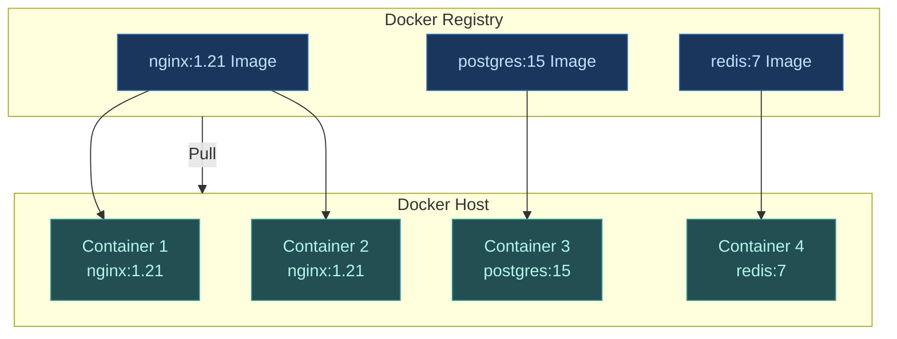
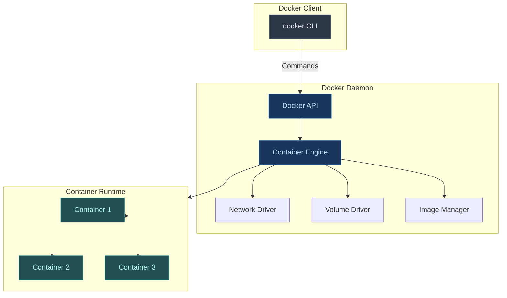
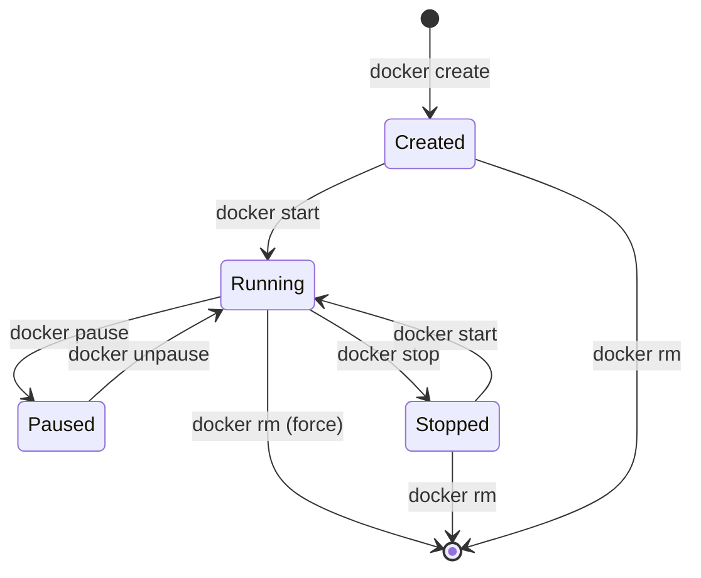
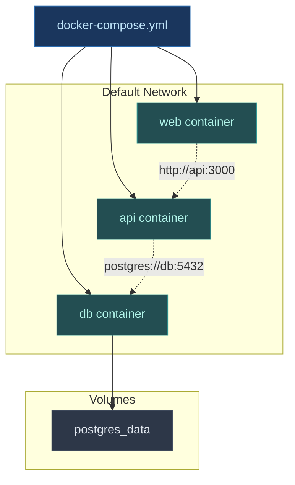
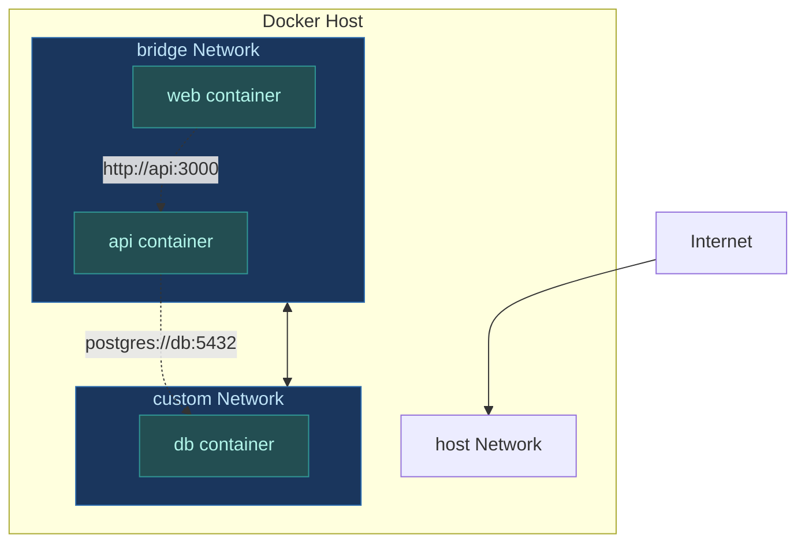
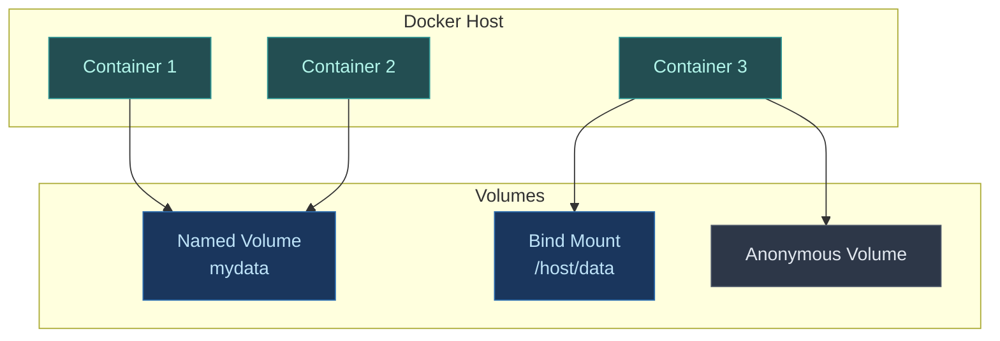

I have been using Docker for years across different projects. Every time I set up a new service, debug a container issue, or onboard someone to a project, I end up looking up the same commands.

This cheat sheet is the result of all those lookups. It covers the Docker commands you will actually use as a developer, with real examples. Not a documentation dump. Just the practical stuff.

Bookmark this page. You will come back to it.

---

## Table of Contents

- [Understanding Docker Basics](#understanding-docker-basics)
- [Image Management](#image-management)
- [Container Lifecycle](#container-lifecycle)
- [Running Containers](#running-containers)
- [Dockerfile Best Practices](#dockerfile-best-practices)
- [Docker Compose](#docker-compose)
- [Networking](#networking)
- [Volumes and Data Persistence](#volumes-and-data-persistence)
- [Logs and Debugging](#logs-and-debugging)
- [Resource Management](#resource-management)
- [Docker Hub and Registries](#docker-hub-and-registries)
- [Common Workflows](#common-workflows)
- [Troubleshooting](#troubleshooting)
- [Quick Reference Tables](#quick-reference-tables)

---

## Understanding Docker Basics

Before diving into commands, understand the core concepts. Docker has three main components: images, containers, and registries.

### Images vs Containers

An **image** is a read-only template. It contains everything needed to run an application: code, runtime, libraries, and dependencies. Think of it as a blueprint.

A **container** is a running instance of an image. It is isolated from other containers and the host system. Multiple containers can run from the same image.



### Docker Architecture



The Docker daemon runs in the background and manages containers. The Docker CLI sends commands to the daemon through the API.

---

## Image Management

Images are the foundation of Docker. You build them, pull them from registries, and use them to create containers.

### Listing Images


```bash
# List all images
docker images

# List images with more details
docker images --format "table {{.Repository}}\t{{.Tag}}\t{{.Size}}"

# List only image IDs
docker images -q

# Filter images by name
docker images nginx

# Show image history (layers)
docker history nginx:latest
```


### Pulling Images

```bash
# Pull latest version
docker pull nginx

# Pull specific version
docker pull nginx:1.21

# Pull from different registry
docker pull registry.example.com/myapp:latest

# Pull without output
docker pull -q nginx
```

### Building Images

```bash
# Build from Dockerfile in current directory
docker build -t myapp:latest .

# Build with specific Dockerfile
docker build -f Dockerfile.prod -t myapp:prod .

# Build without cache
docker build --no-cache -t myapp:latest .

# Build with build arguments
docker build --build-arg NODE_ENV=production -t myapp:latest .

# Build and tag multiple tags
docker build -t myapp:latest -t myapp:1.0.0 .
```

### Tagging Images

```bash
# Tag an existing image
docker tag myapp:latest myapp:1.0.0

# Tag for different registry
docker tag myapp:latest registry.example.com/myapp:latest

# Remove tag (does not delete the image)
docker rmi myapp:1.0.0
```

### Removing Images

```bash
# Remove specific image
docker rmi nginx:latest

# Force remove (even if used by containers)
docker rmi -f nginx:latest

# Remove multiple images
docker rmi nginx:latest postgres:15

# Remove all unused images
docker image prune

# Remove all images (careful)
docker rmi $(docker images -q)
```

### Inspecting Images


```bash
# Show image details
docker inspect nginx:latest

# Show specific field
docker inspect -f '{{.Config.Env}}' nginx:latest

# Show image size
docker images nginx:latest --format "{{.Size}}"
```


---

## Container Lifecycle

Understanding the container lifecycle helps you manage containers effectively.

### Container States



### Creating Containers

```bash
# Create container without starting
docker create --name myapp nginx:latest

# Create with environment variables
docker create --name myapp -e NODE_ENV=production nginx:latest

# Create with port mapping
docker create --name myapp -p 8080:80 nginx:latest

# Create with volume
docker create --name myapp -v /data:/app/data nginx:latest
```

### Starting Containers

```bash
# Start existing container
docker start myapp

# Start in detached mode (background)
docker start -d myapp

# Start and attach
docker start -a myapp

# Start multiple containers
docker start container1 container2 container3
```

### Stopping Containers

```bash
# Stop gracefully (SIGTERM, then SIGKILL after timeout)
docker stop myapp

# Stop with custom timeout (default is 10 seconds)
docker stop -t 5 myapp

# Stop multiple containers
docker stop container1 container2

# Force stop immediately (SIGKILL)
docker kill myapp
```

### Restarting Containers

```bash
# Restart container
docker restart myapp

# Restart with timeout
docker restart -t 5 myapp
```

### Removing Containers

```bash
# Remove stopped container
docker rm myapp

# Force remove running container
docker rm -f myapp

# Remove multiple containers
docker rm container1 container2

# Remove all stopped containers
docker container prune

# Remove containers matching pattern
docker ps -a -q --filter "name=test" | xargs docker rm
```

---

## Running Containers

The `docker run` command combines create and start. It's the most common command you will use.

### Basic Run Commands

```bash
# Run container in foreground
docker run nginx:latest

# Run in detached mode (background)
docker run -d nginx:latest

# Run with name
docker run --name web nginx:latest

# Run and remove when stopped
docker run --rm nginx:latest

# Run with interactive terminal
docker run -it ubuntu:latest /bin/bash
```

### Port Mapping

```bash
# Map host port to container port
docker run -p 8080:80 nginx:latest

# Map to specific host IP
docker run -p 127.0.0.1:8080:80 nginx:latest

# Map random host port
docker run -p 80 nginx:latest

# Map multiple ports
docker run -p 8080:80 -p 8443:443 nginx:latest

# Map all ports
docker run -P nginx:latest
```

### Environment Variables

```bash
# Set single environment variable
docker run -e NODE_ENV=production nginx:latest

# Set multiple environment variables
docker run -e NODE_ENV=production -e DEBUG=true nginx:latest

# Set from file
docker run --env-file .env nginx:latest

# Pass host environment variable
docker run -e HOME nginx:latest
```

### Volume Mounting

```bash
# Mount host directory
docker run -v /host/path:/container/path nginx:latest

# Mount with read-only
docker run -v /host/path:/container/path:ro nginx:latest

# Mount named volume
docker run -v mydata:/container/path nginx:latest

# Mount anonymous volume
docker run -v /container/path nginx:latest
```

### Resource Limits

```bash
# Limit memory
docker run -m 512m nginx:latest

# Limit CPU (1.5 cores)
docker run --cpus="1.5" nginx:latest

# Limit CPU shares (relative priority)
docker run --cpu-shares=512 nginx:latest

# Limit all resources
docker run -m 512m --cpus="1.0" nginx:latest
```

### Common Run Patterns

```bash
# Web server
docker run -d -p 8080:80 --name web nginx:latest

# Database with volume
docker run -d -p 5432:5432 \
  -v postgres_data:/var/lib/postgresql/data \
  -e POSTGRES_PASSWORD=secret \
  --name db postgres:15

# Development with code mount
docker run -it -v $(pwd):/app \
  -p 3000:3000 \
  --name dev node:18 bash

# One-off command
docker run --rm ubuntu:latest ls /etc
```

---

## Dockerfile Best Practices

A Dockerfile is a text file with instructions for building an image. How you write it affects build speed, image size, and security.

### Basic Dockerfile Structure

```dockerfile
# Base image
FROM node:18-alpine

# Set working directory
WORKDIR /app

# Copy dependency files first (for layer caching)
COPY package*.json ./

# Install dependencies
RUN npm ci --only=production

# Copy application code
COPY . .

# Expose port
EXPOSE 3000

# Set user (security best practice)
USER node

# Start application
CMD ["node", "index.js"]
```

### Layer Caching Strategy

Order commands from least to most frequently changing. This maximizes cache hits.

```dockerfile
# Bad: Changes to code invalidate dependency cache
FROM node:18
WORKDIR /app
COPY . .
RUN npm install
CMD ["node", "index.js"]

# Good: Dependencies cached separately
FROM node:18
WORKDIR /app
COPY package*.json ./
RUN npm ci --only=production
COPY . .
CMD ["node", "index.js"]
```

### Multi-Stage Builds

Use multi-stage builds to reduce final image size.

```dockerfile
# Build stage
FROM node:18 AS builder
WORKDIR /app
COPY package*.json ./
RUN npm ci
COPY . .
RUN npm run build

# Production stage
FROM node:18-alpine
WORKDIR /app
COPY --from=builder /app/dist ./dist
COPY --from=builder /app/node_modules ./node_modules
COPY package*.json ./
EXPOSE 3000
CMD ["node", "dist/index.js"]
```

### Common Dockerfile Instructions

| Instruction | Purpose | Example |
|-------------|---------|---------|
| `FROM` | Base image | `FROM node:18-alpine` |
| `WORKDIR` | Set working directory | `WORKDIR /app` |
| `COPY` | Copy files from host | `COPY . .` |
| `ADD` | Copy with URL/tar support | `ADD https://example.com/file.tar.gz /tmp` |
| `RUN` | Execute command | `RUN npm install` |
| `CMD` | Default command | `CMD ["node", "index.js"]` |
| `ENTRYPOINT` | Entry point command | `ENTRYPOINT ["docker-entrypoint.sh"]` |
| `ENV` | Set environment variable | `ENV NODE_ENV=production` |
| `ARG` | Build-time variable | `ARG VERSION=latest` |
| `EXPOSE` | Document port | `EXPOSE 3000` |
| `VOLUME` | Create mount point | `VOLUME ["/data"]` |
| `USER` | Set user | `USER node` |
| `LABEL` | Add metadata | `LABEL version="1.0"` |

### .dockerignore File

Create a `.dockerignore` file to exclude files from build context. This speeds up builds.

```
node_modules
npm-debug.log
.git
.gitignore
.env
.DS_Store
*.md
.vscode
coverage
dist
```

### Security Best Practices

```dockerfile
# Use specific tags, not 'latest'
FROM node:18-alpine

# Use non-root user
RUN addgroup -g 1001 -S nodejs && \
    adduser -S nodejs -u 1001
USER nodejs

# Scan for vulnerabilities (add to CI/CD)
# docker scan myapp:latest

# Use minimal base images
FROM alpine:3.18

# Do not store secrets in image
# Use secrets management instead
```

For more on container security in production environments, see how [Kubernetes manages container security](/kubernetes-cheat-sheet/) with resource limits and security contexts.

---

## Docker Compose

docker-compose manages multi-container applications with a single YAML file. It handles networking, volumes, and dependencies automatically.

### Basic docker-compose.yml

```yaml
version: '3.8'

services:
  web:
    image: nginx:latest
    ports:
      - "8080:80"
    volumes:
      - ./html:/usr/share/nginx/html
    depends_on:
      - api

  api:
    build: ./api
    environment:
      - DATABASE_URL=postgres://db:5432/mydb
    depends_on:
      - db

  db:
    image: postgres:15
    environment:
      - POSTGRES_DB=mydb
      - POSTGRES_PASSWORD=secret
    volumes:
      - postgres_data:/var/lib/postgresql/data

volumes:
  postgres_data:
```

### Common docker-compose Commands

```bash
# Start all services
docker-compose up

# Start in detached mode
docker-compose up -d

# Start specific service
docker-compose up web

# Build and start
docker-compose up --build

# Stop all services
docker-compose down

# Stop and remove volumes
docker-compose down -v

# View logs
docker-compose logs

# Follow logs
docker-compose logs -f

# View logs for specific service
docker-compose logs web

# Execute command in service
docker-compose exec web ls /app

# Scale service
docker-compose up --scale web=3
```

### docker-compose Architecture



### Environment Variables in docker-compose

```yaml
services:
  web:
    image: nginx:latest
    environment:
      - NODE_ENV=production
      - DEBUG=true
    env_file:
      - .env
      - .env.production
```

### Networks in docker-compose

```yaml
services:
  web:
    image: nginx:latest
    networks:
      - frontend

  api:
    image: myapp:latest
    networks:
      - frontend
      - backend

  db:
    image: postgres:15
    networks:
      - backend

networks:
  frontend:
  backend:
```

---

## Networking

Docker provides several network drivers for different use cases.

### Network Types

```bash
# List networks
docker network ls

# Inspect network
docker network inspect bridge

# Create network
docker network create mynetwork

# Create with custom driver
docker network create --driver bridge mynetwork

# Create with subnet
docker network create --subnet=172.20.0.0/16 mynetwork

# Remove network
docker network rm mynetwork

# Remove unused networks
docker network prune
```

### Network Drivers

| Driver | Use Case | Example |
|--------|----------|---------|
| **bridge** | Default for containers on same host | `docker network create --driver bridge mynet` |
| **host** | Use host network directly | `docker run --network host nginx` |
| **overlay** | Multi-host networking (Swarm) | `docker network create --driver overlay mynet` |
| **macvlan** | Assign MAC address to container | `docker network create --driver macvlan mynet` |
| **none** | No networking | `docker run --network none nginx` |

### Connecting Containers

```bash
# Connect container to network
docker network connect mynetwork mycontainer

# Disconnect from network
docker network disconnect mynetwork mycontainer

# Run container on specific network
docker run --network mynetwork nginx:latest

# Use container name as hostname
docker run --name api --network mynetwork nginx:latest
# Other containers can reach it at 'api'
```

### Network Architecture



---

## Volumes and Data Persistence

Volumes persist data beyond container lifecycle. Without them, data disappears when you remove a container.

### Volume Types

| Type | Description | Use Case |
|------|-------------|----------|
| **Named Volume** | Managed by Docker | Databases, shared data |
| **Bind Mount** | Host directory mounted | Development, config files |
| **Anonymous Volume** | Temporary, removed with container | Temporary data |

### Managing Volumes

```bash
# List volumes
docker volume ls

# Create volume
docker volume create mydata

# Inspect volume
docker volume inspect mydata

# Remove volume
docker volume rm mydata

# Remove unused volumes
docker volume prune
```

### Using Volumes

```bash
# Named volume
docker run -v mydata:/app/data nginx:latest

# Bind mount
docker run -v /host/path:/container/path nginx:latest

# Read-only mount
docker run -v /host/path:/container/path:ro nginx:latest

# Multiple volumes
docker run -v data1:/data1 -v data2:/data2 nginx:latest
```

### Volume Architecture



### Backup and Restore

```bash
# Backup volume
docker run --rm -v mydata:/data -v $(pwd):/backup \
  ubuntu:latest tar czf /backup/mydata.tar.gz -C /data .

# Restore volume
docker run --rm -v mydata:/data -v $(pwd):/backup \
  ubuntu:latest tar xzf /backup/mydata.tar.gz -C /data
```

---

## Logs and Debugging

Logs are your first line of defense when debugging container issues.

### Viewing Logs

```bash
# View logs
docker logs mycontainer

# Follow logs (like tail -f)
docker logs -f mycontainer

# Show last N lines
docker logs --tail 100 mycontainer

# Show logs with timestamps
docker logs -t mycontainer

# Show logs since timestamp
docker logs --since "2025-01-01T00:00:00" mycontainer

# Show logs until timestamp
docker logs --until "2025-01-01T23:59:59" mycontainer
```

### Executing Commands

```bash
# Execute command in running container
docker exec mycontainer ls /app

# Get interactive shell
docker exec -it mycontainer /bin/bash

# Execute as specific user
docker exec -u root mycontainer whoami

# Execute in specific working directory
docker exec -w /app mycontainer pwd
```

### Inspecting Containers


```bash
# Show container details
docker inspect mycontainer

# Show specific field
docker inspect -f '{{.State.Status}}' mycontainer

# Show IP address
docker inspect -f '{{.NetworkSettings.IPAddress}}' mycontainer

# Show mounted volumes
docker inspect -f '{{.Mounts}}' mycontainer
```


### Container Stats


```bash
# Show live resource usage
docker stats

# Show stats for specific container
docker stats mycontainer

# Show stats without streaming
docker stats --no-stream

# Show stats in custom format
docker stats --format "table {{.Container}}\t{{.CPUPerc}}\t{{.MemUsage}}"
```


---

## Resource Management

Docker allows you to limit container resources to prevent one container from consuming all host resources.

### Memory Limits

```bash
# Limit memory
docker run -m 512m nginx:latest

# Limit memory and swap
docker run -m 512m --memory-swap 1g nginx:latest

# Disable swap
docker run -m 512m --memory-swap 512m nginx:latest
```

### CPU Limits

```bash
# Limit CPU cores
docker run --cpus="1.5" nginx:latest

# Limit CPU shares (relative priority)
docker run --cpu-shares=512 nginx:latest

# Pin to specific CPUs
docker run --cpuset-cpus="0,1" nginx:latest
```

### I/O Limits

```bash
# Limit read/write IOPS
docker run --device-read-iops /dev/sda:1000 nginx:latest

# Limit read/write bandwidth
docker run --device-read-bps /dev/sda:1mb nginx:latest
```

### Resource Constraints in docker-compose

```yaml
services:
  web:
    image: nginx:latest
    deploy:
      resources:
        limits:
          cpus: '1.5'
          memory: 512M
        reservations:
          cpus: '0.5'
          memory: 256M
```

For production deployments, Kubernetes provides more advanced resource management. See the [Kubernetes Cheat Sheet](/kubernetes-cheat-sheet/) for resource limits, requests, and autoscaling.

---

## Docker Hub and Registries

Docker Hub is the default public registry. You can also use private registries or cloud provider registries.

### Docker Hub Commands

```bash
# Login to Docker Hub
docker login

# Login with username
docker login -u username

# Logout
docker logout

# Push image
docker push username/myapp:latest

# Pull from Docker Hub
docker pull username/myapp:latest
```

### Private Registries

```bash
# Login to private registry
docker login registry.example.com

# Tag for private registry
docker tag myapp:latest registry.example.com/myapp:latest

# Push to private registry
docker push registry.example.com/myapp:latest

# Pull from private registry
docker pull registry.example.com/myapp:latest
```

### Image Tags Best Practices

- Use semantic versioning: `myapp:1.0.0`
- Tag latest stable as `latest`
- Use commit SHA for traceability: `myapp:abc123`
- Use environment tags: `myapp:prod`, `myapp:staging`

---

## Common Workflows

These are the workflows you will use most often.

### Development Workflow

```bash
# 1. Build image
docker build -t myapp:dev .

# 2. Run with volume mount for live reload
docker run -d -p 3000:3000 \
  -v $(pwd):/app \
  --name myapp-dev \
  myapp:dev

# 3. View logs
docker logs -f myapp-dev

# 4. Execute commands
docker exec -it myapp-dev npm test

# 5. Stop and remove
docker stop myapp-dev && docker rm myapp-dev
```

### Production Deployment Workflow

```bash
# 1. Build production image
docker build -f Dockerfile.prod -t myapp:1.0.0 .

# 2. Test locally
docker run -d -p 8080:3000 --name myapp-test myapp:1.0.0

# 3. Tag for registry
docker tag myapp:1.0.0 registry.example.com/myapp:1.0.0

# 4. Push to registry
docker push registry.example.com/myapp:1.0.0

# 5. Deploy to server
docker pull registry.example.com/myapp:1.0.0
docker run -d -p 80:3000 --name myapp myapp:1.0.0
```

### Database Setup Workflow

```bash
# 1. Create volume
docker volume create postgres_data

# 2. Run database
docker run -d \
  --name postgres \
  -e POSTGRES_PASSWORD=secret \
  -e POSTGRES_DB=myapp \
  -v postgres_data:/var/lib/postgresql/data \
  -p 5432:5432 \
  postgres:15

# 3. Run migrations
docker exec postgres psql -U postgres -d myapp -f /migrations/init.sql

# 4. Backup
docker exec postgres pg_dump -U postgres myapp > backup.sql
```

---

## Troubleshooting

Common issues and how to fix them.

### Container Won't Start

```bash
# Check container status
docker ps -a

# View logs
docker logs mycontainer

# Check events
docker events

# Inspect container
docker inspect mycontainer

# Try running interactively
docker run -it myimage /bin/bash
```

### Port Already in Use

```bash
# Find what is using the port
docker ps | grep 8080

# Use different port
docker run -p 8081:80 nginx:latest

# Stop conflicting container
docker stop conflicting-container
```

### Out of Disk Space

```bash
# Check disk usage
docker system df

# Remove unused data
docker system prune

# Remove everything unused (careful)
docker system prune -a

# Remove specific volumes
docker volume prune
```

### Container Keeps Restarting


```bash
# Check restart policy
docker inspect -f '{{.HostConfig.RestartPolicy.Name}}' mycontainer

# View logs
docker logs mycontainer

# Check exit code
docker inspect -f '{{.State.ExitCode}}' mycontainer

# Run without restart policy to see error
docker run --restart=no myimage
```


### Network Issues

```bash
# Check network connectivity
docker exec mycontainer ping google.com

# Inspect network
docker network inspect bridge

# Check DNS resolution
docker exec mycontainer nslookup api

# Recreate network
docker network rm mynetwork
docker network create mynetwork
```

### Permission Denied

```bash
# Check file permissions
docker exec mycontainer ls -la /app

# Run as root (not recommended for production)
docker exec -u root mycontainer chown -R user:user /app

# Fix permissions in Dockerfile
USER root
RUN chown -R node:node /app
USER node
```

---

## Quick Reference Tables

### Most Used Commands

| Task | Command |
|------|---------|
| List containers | `docker ps` |
| List all containers | `docker ps -a` |
| List images | `docker images` |
| Run container | `docker run IMAGE` |
| Run detached | `docker run -d IMAGE` |
| Run with port | `docker run -p HOST:CONTAINER IMAGE` |
| Run with volume | `docker run -v HOST:CONTAINER IMAGE` |
| Stop container | `docker stop CONTAINER` |
| Remove container | `docker rm CONTAINER` |
| Remove image | `docker rmi IMAGE` |
| View logs | `docker logs CONTAINER` |
| Follow logs | `docker logs -f CONTAINER` |
| Execute command | `docker exec CONTAINER COMMAND` |
| Get shell | `docker exec -it CONTAINER /bin/bash` |
| Build image | `docker build -t NAME .` |
| Pull image | `docker pull IMAGE` |
| Push image | `docker push IMAGE` |

### Common Flags

| Flag | Purpose | Example |
|------|---------|---------|
| `-d` | Detached mode | `docker run -d nginx` |
| `-it` | Interactive terminal | `docker run -it ubuntu bash` |
| `-p` | Port mapping | `docker run -p 8080:80 nginx` |
| `-v` | Volume mount | `docker run -v /data:/app nginx` |
| `-e` | Environment variable | `docker run -e KEY=value nginx` |
| `--name` | Container name | `docker run --name web nginx` |
| `--rm` | Remove when stopped | `docker run --rm nginx` |
| `-m` | Memory limit | `docker run -m 512m nginx` |
| `--cpus` | CPU limit | `docker run --cpus="1.5" nginx` |
| `--network` | Network | `docker run --network mynet nginx` |

### docker-compose Commands

| Task | Command |
|------|---------|
| Start services | `docker-compose up` |
| Start detached | `docker-compose up -d` |
| Stop services | `docker-compose down` |
| View logs | `docker-compose logs` |
| Follow logs | `docker-compose logs -f` |
| Execute command | `docker-compose exec SERVICE COMMAND` |
| Scale service | `docker-compose up --scale SERVICE=N` |
| Build images | `docker-compose build` |
| Restart service | `docker-compose restart SERVICE` |

---

## Related Posts

These posts go deeper into container and orchestration topics:

**Container Orchestration**:
- [Kubernetes Cheat Sheet](/kubernetes-cheat-sheet/) - Container orchestration at scale
- [Kubernetes Architecture Explained](/devops/kubernetes-architecture/) - How Kubernetes works internally

**System Design and Architecture**:
- [System Design Cheat Sheet](/system-design-cheat-sheet/) - Building scalable systems
- [Service Discovery Explained](/explainer/service-discovery/) - How services find each other

**Development Tools**:
- [Linux Commands Cheat Sheet](/linux-commands-cheat-sheet/) - Essential Linux commands
- [Git Cheat Sheet](/git-cheat-sheet/) - Version control commands

---

## External Resources

- [Official Docker Documentation](https://docs.docker.com/) - Complete Docker reference
- [Docker Hub](https://hub.docker.com/) - Public image registry
- [Dockerfile Best Practices](https://docs.docker.com/develop/develop-images/dockerfile_best-practices/) - Official best practices guide
- [docker-compose Documentation](https://docs.docker.com/compose/) - Multi-container application guide
- [Docker Security Best Practices](https://docs.docker.com/engine/security/) - Securing containers

---

Every developer working with modern applications needs Docker skills. The commands in this cheat sheet cover 90% of what you will do day to day. Start with the basics, use docker-compose for multi-container apps, and always set resource limits in production.

*What Docker commands do you use most? Drop them in the comments below.*
