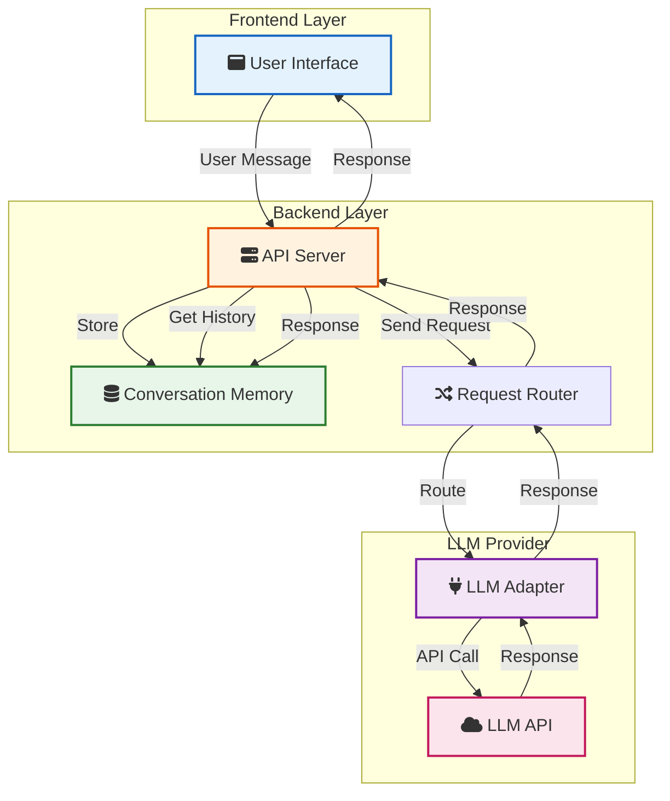

You want to build an LLM application. Maybe a chatbot for customer support. Maybe a coding assistant. Maybe something that helps users search through documents. But where do you start?

Most tutorials show you how to call an API and get a response. That is not an application. That is a demo. Real applications need conversation memory, error handling, user management, and production features.

This guide walks you through building a complete LLM application from scratch. No frameworks required. Just the fundamentals you need to understand before using tools like LangChain or LlamaIndex.

> **TL;DR**: Build your first LLM application in four steps: choose an LLM API, create a backend that handles conversations, add a frontend, and deploy. Use provider-agnostic code so you can switch models. Add error handling, memory, and cost tracking from day one.

## What You Will Build

We will build a simple but complete chat application that:

- Connects to an LLM API (OpenAI, Anthropic, or local)
- Maintains conversation history
- Handles errors gracefully
- Tracks costs
- Works in production

This is not a toy. This is the foundation you can extend into any LLM application you need.

## Understanding LLM Application Architecture

Before writing code, understand the architecture. Every LLM application follows the same pattern:



**Frontend**: The user interface where users type messages and see responses.

**Backend API**: Handles requests, manages conversation memory, and routes to the LLM.

**LLM Adapter**: Provider-agnostic layer that lets you switch between OpenAI, Claude, local models, etc.

**LLM Provider**: The actual API or local model that generates responses.

**Memory**: Stores conversation history so the LLM has context from previous messages.

This architecture separates concerns. You can swap the frontend, change LLM providers, or add features without rewriting everything.

## Step 1: Choose Your LLM Provider

You have three main options:

### Option 1: OpenAI API

**Pros**: Best documentation, most tutorials, reliable, fast

**Cons**: Costs money, data sent to external servers

**Best for**: Getting started quickly, production applications

```python
# OpenAI API example
from openai import OpenAI

client = OpenAI(api_key="your-key")
response = client.chat.completions.create(
    model="gpt-4o",
    messages=[{"role": "user", "content": "Hello"}]
)
```

### Option 2: Anthropic Claude API

**Pros**: Excellent quality, long context windows, good for coding

**Cons**: Costs money, newer than OpenAI

**Best for**: Applications needing long context or coding assistance

```python
# Anthropic API example
from anthropic import Anthropic

client = Anthropic(api_key="your-key")
response = client.messages.create(
    model="claude-3-5-sonnet-20241022",
    messages=[{"role": "user", "content": "Hello"}]
)
```

### Option 3: Local Models via Ollama

**Pros**: Free, private, works offline

**Cons**: Requires hardware, slower than cloud APIs

**Best for**: Privacy-sensitive applications, cost-sensitive use cases

See our guide on [running LLMs locally](/running-llms-locally/) for setup instructions.

```python
# Ollama API (OpenAI-compatible)
from openai import OpenAI

client = OpenAI(
    base_url="http://localhost:11434/v1",
    api_key="ollama"  # Not used but required
)
response = client.chat.completions.create(
    model="llama3.3",
    messages=[{"role": "user", "content": "Hello"}]
)
```





### My Recommendation

Start with OpenAI API for the best developer experience. Once you understand the patterns, you can switch to Claude for better quality or local models for privacy. The code we write will work with all three.

## Step 2: Build the Backend

We will build a Python backend using FastAPI. If you prefer Node.js, the patterns are the same.

### Project Setup

```bash
mkdir llm-app
cd llm-app
python -m venv venv
source venv/bin/activate  # On Windows: venv\Scripts\activate
pip install fastapi uvicorn openai python-dotenv
```

Create a `.env` file:

```
OPENAI_API_KEY=your-key-here
```

### Create the LLM Adapter

First, build a provider-agnostic adapter. This lets you switch between providers without changing your application code:

```python
# llm_adapter.py
from abc import ABC, abstractmethod
from typing import List, Dict
from openai import OpenAI
import os

# ABC stands for Abstract Base Class - it prevents you from creating
# LLMAdapter directly. You must create a concrete implementation like OpenAIAdapter.
class LLMAdapter(ABC):
    @abstractmethod
    def chat(self, messages: List[Dict[str, str]], **kwargs) -> str:
        pass

class OpenAIAdapter(LLMAdapter):
    def __init__(self, api_key: str = None):
        self.client = OpenAI(api_key=api_key or os.getenv("OPENAI_API_KEY"))
        self.model = "gpt-4o"
    
    def chat(self, messages: List[Dict[str, str]], **kwargs) -> str:
        response = self.client.chat.completions.create(
            model=self.model,
            messages=messages,
            temperature=kwargs.get("temperature", 0.7),
            max_tokens=kwargs.get("max_tokens", 1000)
        )
        return response.choices[0].message.content

class AnthropicAdapter(LLMAdapter):
    def __init__(self, api_key: str = None):
        from anthropic import Anthropic
        self.client = Anthropic(api_key=api_key or os.getenv("ANTHROPIC_API_KEY"))
        self.model = "claude-3-5-sonnet-20241022"
    
    def chat(self, messages: List[Dict[str, str]], **kwargs) -> str:
        response = self.client.messages.create(
            model=self.model,
            messages=messages,
            temperature=kwargs.get("temperature", 0.7),
            max_tokens=kwargs.get("max_tokens", 1000)
        )
        return response.content[0].text

class OllamaAdapter(LLMAdapter):
    def __init__(self, base_url: str = "http://localhost:11434/v1"):
        self.client = OpenAI(
            base_url=base_url,
            api_key="ollama"
        )
        self.model = "llama3.3"
    
    def chat(self, messages: List[Dict[str, str]], **kwargs) -> str:
        response = self.client.chat.completions.create(
            model=self.model,
            messages=messages,
            temperature=kwargs.get("temperature", 0.7),
            max_tokens=kwargs.get("max_tokens", 1000)
        )
        return response.choices[0].message.content
```

This adapter pattern is crucial. Your application code never directly calls OpenAI or Claude. It calls the adapter, which you can swap out.

### Create the API Server

```python
# main.py
from fastapi import FastAPI, HTTPException
from fastapi.middleware.cors import CORSMiddleware
from pydantic import BaseModel
from typing import List, Dict, Optional
from llm_adapter import OpenAIAdapter, LLMAdapter
import os

app = FastAPI()

# Enable CORS for frontend
app.add_middleware(
    CORSMiddleware,
    allow_origins=["*"],  # In production, specify your frontend domain
    allow_credentials=True,
    allow_methods=["*"],
    allow_headers=["*"],
)

# Initialize LLM adapter
llm: LLMAdapter = OpenAIAdapter()

# In-memory storage (use a database in production)
conversations: Dict[str, List[Dict[str, str]]] = {}

class ChatRequest(BaseModel):
    message: str
    conversation_id: Optional[str] = None
    temperature: Optional[float] = 0.7
    max_tokens: Optional[int] = 1000

class ChatResponse(BaseModel):
    response: str
    conversation_id: str
    tokens_used: Optional[int] = None

@app.post("/chat", response_model=ChatResponse)
async def chat(request: ChatRequest):
    try:
        # Get or create conversation
        conversation_id = request.conversation_id or f"conv_{len(conversations)}"
        
        if conversation_id not in conversations:
            conversations[conversation_id] = [
                {"role": "system", "content": "You are a helpful assistant."}
            ]
        
        # Add user message
        conversations[conversation_id].append({
            "role": "user",
            "content": request.message
        })
        
        # Get LLM response
        response_text = llm.chat(
            messages=conversations[conversation_id],
            temperature=request.temperature,
            max_tokens=request.max_tokens
        )
        
        # Add assistant response to history
        conversations[conversation_id].append({
            "role": "assistant",
            "content": response_text
        })
        
        return ChatResponse(
            response=response_text,
            conversation_id=conversation_id
        )
    
    except Exception as e:
        raise HTTPException(status_code=500, detail=str(e))

@app.get("/health")
async def health():
    return {"status": "ok"}

if __name__ == "__main__":
    import uvicorn
    uvicorn.run(app, host="0.0.0.0", port=8000)
```

Run the server:

```bash
python main.py
```

You now have a working LLM API. Test it:

```bash
curl -X POST http://localhost:8000/chat \
  -H "Content-Type: application/json" \
  -d '{"message": "Hello, how are you?"}'
```

### Add Error Handling

LLM APIs can fail. Add proper error handling:

```python
import time
from openai import RateLimitError, APIError

def chat_with_retry(self, messages: List[Dict[str, str]], max_retries: int = 3, **kwargs) -> str:
    for attempt in range(max_retries):
        try:
            return self.chat(messages, **kwargs)
        except RateLimitError:
            wait_time = 2 ** attempt  # Exponential backoff
            time.sleep(wait_time)
        except APIError as e:
            if attempt == max_retries - 1:
                raise
            time.sleep(1)
    raise Exception("Failed after retries")
```





### Add Cost Tracking

Track token usage to control costs:

```python
class OpenAIAdapter(LLMAdapter):
    def __init__(self, api_key: str = None):
        self.client = OpenAI(api_key=api_key or os.getenv("OPENAI_API_KEY"))
        self.model = "gpt-4o"
        self.total_tokens = 0
        self.total_cost = 0.0
    
    def chat(self, messages: List[Dict[str, str]], **kwargs) -> tuple[str, int, float]:
        response = self.client.chat.completions.create(
            model=self.model,
            messages=messages,
            temperature=kwargs.get("temperature", 0.7),
            max_tokens=kwargs.get("max_tokens", 1000)
        )
        
        tokens_used = response.usage.total_tokens
        cost = self._calculate_cost(tokens_used, response.usage.prompt_tokens)
        
        self.total_tokens += tokens_used
        self.total_cost += cost
        
        return response.choices[0].message.content, tokens_used, cost
    
    def _calculate_cost(self, total_tokens: int, prompt_tokens: int) -> float:
        # GPT-4o pricing (as of 2026)
        input_cost_per_1k = 2.50 / 1000
        output_cost_per_1k = 10.00 / 1000
        
        completion_tokens = total_tokens - prompt_tokens
        cost = (prompt_tokens * input_cost_per_1k) + (completion_tokens * output_cost_per_1k)
        return cost
```

## Step 3: Add Conversation Memory

The in-memory storage above works for demos. For production, use a database:

```python
# database.py
import sqlite3
from typing import List, Dict
import json

class ConversationDB:
    def __init__(self, db_path: str = "conversations.db"):
        self.conn = sqlite3.connect(db_path)
        self._create_tables()
    
    def _create_tables(self):
        self.conn.execute("""
            CREATE TABLE IF NOT EXISTS conversations (
                id TEXT PRIMARY KEY,
                messages TEXT,
                created_at TIMESTAMP DEFAULT CURRENT_TIMESTAMP,
                updated_at TIMESTAMP DEFAULT CURRENT_TIMESTAMP
            )
        """)
        self.conn.commit()
    
    def get_messages(self, conversation_id: str) -> List[Dict[str, str]]:
        cursor = self.conn.execute(
            "SELECT messages FROM conversations WHERE id = ?",
            (conversation_id,)
        )
        row = cursor.fetchone()
        if row:
            return json.loads(row[0])
        return [{"role": "system", "content": "You are a helpful assistant."}]
    
    def save_messages(self, conversation_id: str, messages: List[Dict[str, str]]):
        messages_json = json.dumps(messages)
        self.conn.execute("""
            INSERT OR REPLACE INTO conversations (id, messages, updated_at)
            VALUES (?, ?, CURRENT_TIMESTAMP)
        """, (conversation_id, messages_json))
        self.conn.commit()
    
    def delete_conversation(self, conversation_id: str):
        self.conn.execute("DELETE FROM conversations WHERE id = ?", (conversation_id,))
        self.conn.commit()
```

Update your API to use the database:

```python
from database import ConversationDB

db = ConversationDB()

@app.post("/chat", response_model=ChatResponse)
async def chat(request: ChatRequest):
    conversation_id = request.conversation_id or f"conv_{int(time.time())}"
    
    # Get existing messages
    messages = db.get_messages(conversation_id)
    
    # Add user message
    messages.append({"role": "user", "content": request.message})
    
    # Get LLM response
    response_text, tokens_used, cost = llm.chat(messages, **request.dict())
    
    # Add assistant response
    messages.append({"role": "assistant", "content": response_text})
    
    # Save to database
    db.save_messages(conversation_id, messages)
    
    return ChatResponse(
        response=response_text,
        conversation_id=conversation_id,
        tokens_used=tokens_used
    )
```

### Handle Context Window Limits

LLMs have token limits. When conversations get long, you need to manage context:

```python
def truncate_messages(messages: List[Dict[str, str]], max_tokens: int = 4000) -> List[Dict[str, str]]:
    """Keep only recent messages that fit within token limit."""
    # Simple approach: keep system message + last N messages
    if len(messages) <= 2:
        return messages
    
    system_message = messages[0]
    recent_messages = messages[-10:]  # Keep last 10 messages
    
    # In production, use tiktoken to count actual tokens
    return [system_message] + recent_messages
```

For production, use a proper token counter:

```python
import tiktoken

def count_tokens(messages: List[Dict[str, str]], model: str = "gpt-4o") -> int:
    encoding = tiktoken.encoding_for_model(model)
    tokens = 0
    for message in messages:
        tokens += 4  # Message overhead
        tokens += len(encoding.encode(message["content"]))
    return tokens
```

## Step 4: Build the Frontend

Create a simple HTML frontend:

```html
<!-- index.html -->
<!DOCTYPE html>
<html>
<head>
    <title>LLM Chat Application</title>
    <style>
        body {
            font-family: system-ui, -apple-system, sans-serif;
            max-width: 800px;
            margin: 0 auto;
            padding: 20px;
        }
        #chat {
            border: 1px solid #ddd;
            border-radius: 8px;
            padding: 20px;
            height: 400px;
            overflow-y: auto;
            margin-bottom: 20px;
        }
        .message {
            margin-bottom: 15px;
        }
        .user {
            text-align: right;
        }
        .assistant {
            text-align: left;
        }
        .message-content {
            display: inline-block;
            padding: 10px 15px;
            border-radius: 8px;
            max-width: 70%;
        }
        .user .message-content {
            background: #007bff;
            color: white;
        }
        .assistant .message-content {
            background: #f0f0f0;
            color: #333;
        }
        #input-form {
            display: flex;
            gap: 10px;
        }
        #message-input {
            flex: 1;
            padding: 10px;
            border: 1px solid #ddd;
            border-radius: 4px;
        }
        button {
            padding: 10px 20px;
            background: #007bff;
            color: white;
            border: none;
            border-radius: 4px;
            cursor: pointer;
        }
        button:disabled {
            background: #ccc;
            cursor: not-allowed;
        }
        .loading {
            opacity: 0.6;
        }
    </style>
</head>
<body>
    <h1>LLM Chat Application</h1>
    <div id="chat"></div>
    <form id="input-form">
        <input type="text" id="message-input" placeholder="Type your message..." />
        <button type="submit" id="send-button">Send</button>
    </form>

    <script>
        const API_URL = 'http://localhost:8000';
        let conversationId = null;

        const chatDiv = document.getElementById('chat');
        const form = document.getElementById('input-form');
        const input = document.getElementById('message-input');
        const button = document.getElementById('send-button');

        function addMessage(role, content) {
            const messageDiv = document.createElement('div');
            messageDiv.className = `message ${role}`;
            
            const contentDiv = document.createElement('div');
            contentDiv.className = 'message-content';
            contentDiv.textContent = content;
            
            messageDiv.appendChild(contentDiv);
            chatDiv.appendChild(messageDiv);
            chatDiv.scrollTop = chatDiv.scrollHeight;
        }

        async function sendMessage(message) {
            addMessage('user', message);
            
            button.disabled = true;
            input.disabled = true;
            chatDiv.classList.add('loading');

            try {
                const response = await fetch(`${API_URL}/chat`, {
                    method: 'POST',
                    headers: {
                        'Content-Type': 'application/json',
                    },
                    body: JSON.stringify({
                        message: message,
                        conversation_id: conversationId
                    })
                });

                if (!response.ok) {
                    throw new Error('Failed to get response');
                }

                const data = await response.json();
                conversationId = data.conversation_id;
                addMessage('assistant', data.response);
            } catch (error) {
                addMessage('assistant', `Error: ${error.message}`);
            } finally {
                button.disabled = false;
                input.disabled = false;
                chatDiv.classList.remove('loading');
                input.focus();
            }
        }

        form.addEventListener('submit', (e) => {
            e.preventDefault();
            const message = input.value.trim();
            if (message) {
                input.value = '';
                sendMessage(message);
            }
        });
    </script>
</body>
</html>
```





Open `index.html` in a browser. You now have a working LLM chat application.

## Step 5: Add Production Features

Your application works, but it is not production-ready. Add these features:

### Rate Limiting

Prevent abuse:

```python
from slowapi import Limiter, _rate_limit_exceeded_handler
from slowapi.util import get_remote_address
from slowapi.errors import RateLimitExceeded

limiter = Limiter(key_func=get_remote_address)
app.state.limiter = limiter
app.add_exception_handler(RateLimitExceeded, _rate_limit_exceeded_handler)

@app.post("/chat")
@limiter.limit("10/minute")
async def chat(request: Request, chat_request: ChatRequest):
    # ... existing code
```

### Input Validation

Sanitize user input:

```python
from pydantic import validator

class ChatRequest(BaseModel):
    message: str
    conversation_id: Optional[str] = None
    
    @validator('message')
    def validate_message(cls, v):
        if len(v) > 10000:
            raise ValueError('Message too long')
        if not v.strip():
            raise ValueError('Message cannot be empty')
        return v.strip()
```

### Logging

Log all requests for debugging:

```python
import logging

logging.basicConfig(level=logging.INFO)
logger = logging.getLogger(__name__)

@app.post("/chat")
async def chat(request: ChatRequest):
    logger.info(f"Chat request: conversation_id={request.conversation_id}, message_length={len(request.message)}")
    # ... rest of code
```

### Health Checks

Monitor your application:

```python
@app.get("/health")
async def health():
    try:
        # Test LLM connection
        test_response = llm.chat([{"role": "user", "content": "test"}])
        return {
            "status": "healthy",
            "llm": "connected",
            "database": "connected"
        }
    except Exception as e:
        return {
            "status": "unhealthy",
            "error": str(e)
        }, 503
```

## Common Patterns and Best Practices

### Pattern 1: System Prompts

Use system prompts to define behavior:

```python
SYSTEM_PROMPTS = {
    "default": "You are a helpful assistant.",
    "coding": "You are a senior software engineer. Provide concise, practical code examples.",
    "support": "You are a customer support agent. Be empathetic and solution-focused."
}

def get_messages(conversation_id: str, prompt_type: str = "default"):
    messages = db.get_messages(conversation_id)
    if not messages or messages[0]["role"] != "system":
        messages.insert(0, {"role": "system", "content": SYSTEM_PROMPTS[prompt_type]})
    return messages
```

### Pattern 2: Streaming Responses

For better UX, stream responses as they generate:

```python
from fastapi.responses import StreamingResponse

@app.post("/chat/stream")
async def chat_stream(request: ChatRequest):
    async def generate():
        # Get streaming response from LLM
        stream = llm.client.chat.completions.create(
            model=llm.model,
            messages=messages,
            stream=True
        )
        
        for chunk in stream:
            if chunk.choices[0].delta.content:
                yield f"data: {chunk.choices[0].delta.content}\n\n"
    
    return StreamingResponse(generate(), media_type="text/event-stream")
```

### Pattern 3: Function Calling

Let the LLM call your functions:

```python
tools = [
    {
        "type": "function",
        "function": {
            "name": "get_weather",
            "description": "Get current weather for a city",
            "parameters": {
                "type": "object",
                "properties": {
                    "city": {"type": "string"}
                },
                "required": ["city"]
            }
        }
    }
]

response = llm.client.chat.completions.create(
    model=llm.model,
    messages=messages,
    tools=tools,
    tool_choice="auto"
)
```

See our guide on [building AI agents](/building-ai-agents/) for more on function calling.

## Deployment

### Deploy to Railway

1. Create `Procfile`:
```
web: uvicorn main:app --host 0.0.0.0 --port $PORT
```

2. Create `requirements.txt`:
```
fastapi
uvicorn
openai
python-dotenv
```

3. Push to GitHub and connect Railway

### Deploy to Render

Similar to Railway. Render automatically detects FastAPI applications.

### Deploy with Docker

```dockerfile
FROM python:3.11-slim

WORKDIR /app

COPY requirements.txt .
RUN pip install --no-cache-dir -r requirements.txt

COPY . .

CMD ["uvicorn", "main:app", "--host", "0.0.0.0", "--port", "8000"]
```

## Testing Your Application

Write tests before shipping:

```python
# test_chat.py
import pytest
from fastapi.testclient import TestClient
from main import app

client = TestClient(app)

def test_chat_endpoint():
    response = client.post("/chat", json={"message": "Hello"})
    assert response.status_code == 200
    assert "response" in response.json()
    assert "conversation_id" in response.json()

def test_conversation_memory():
    # Send first message
    response1 = client.post("/chat", json={"message": "My name is Ajit"})
    conversation_id = response1.json()["conversation_id"]
    
    # Send second message
    response2 = client.post("/chat", json={
        "message": "What is my name?",
        "conversation_id": conversation_id
    })
    
    assert "Ajit" in response2.json()["response"]
```

## Cost Optimization

LLM APIs charge per token. Optimize costs:

1. **Use smaller models when possible**: GPT-4o mini is 10x cheaper than GPT-4o
2. **Cache common responses**: Store frequently asked questions
3. **Limit max_tokens**: Prevent runaway generations
4. **Summarize long conversations**: Compress old messages instead of sending full history
5. **Use local models**: [Ollama](/running-llms-locally/) is free after hardware costs

## Next Steps

You now have a working LLM application. Here is what to build next:

1. **Add RAG (Retrieval Augmented Generation)**: Let the LLM search your documents. See [Building Your First RAG Application](/building-your-first-rag-application/) for a step-by-step guide.
2. **Build AI agents**: Add tool calling for autonomous actions
3. **Add user authentication**: Multi-user support with proper security
4. **Implement fine-tuning**: Train custom models for your use case
5. **Add monitoring**: Track usage, errors, and costs in production

For deeper dives, see:
- [How LLMs Generate Text](/how-llms-generate-text/) - Understand the internals
- [Building AI Agents](/building-ai-agents/) - Add autonomous capabilities
- [Building a Code Review Assistant with LLMs](/building-code-review-assistant-with-llms/) - A practical LLM project with webhooks, structured prompts, and production deployment
- [Running LLMs Locally](/running-llms-locally/) - Privacy and cost savings
- [Context Engineering](/context-engineering/) - Optimize what you send to LLMs
- [Prompt Injection Explained](/prompt-injection-explained/) - The #1 security risk in LLM applications. Essential reading before you ship anything that processes user input.

## Key Takeaways

1. **Start simple**: Build a basic chat application first. Add complexity only when needed.

2. **Use provider-agnostic code**: Abstract LLM calls so you can switch providers easily.

3. **Handle errors**: LLM APIs fail. Add retries, timeouts, and graceful error handling.

4. **Track costs**: Token usage adds up. Monitor costs from day one.

5. **Test thoroughly**: LLMs are non-deterministic. Test with real scenarios before shipping.

6. **Plan for scale**: Use databases for memory, add rate limiting, and monitor performance.

Building LLM applications is not magic. It is software engineering with a new type of API. Follow these patterns, and you will build applications that work in production.

---

**Related Posts:**

- [How LLMs Generate Text](/how-llms-generate-text/) - Understand what happens inside the model
- [Building AI Agents](/building-ai-agents/) - Add autonomous capabilities to your application
- [Running LLMs Locally](/running-llms-locally/) - Use local models for privacy and cost savings
- [Context Engineering](/context-engineering/) - Optimize prompts and context windows
- [LLM Inference Speed Comparison](/llm-inference-speed-comparison/) - Benchmark different models
- [Model Context Protocol (MCP) Explained](/model-context-protocol-mcp-explained/) - Standardize how your LLM application connects to tools and data sources

*Have questions about building LLM applications? Share your experience in the comments below.*
