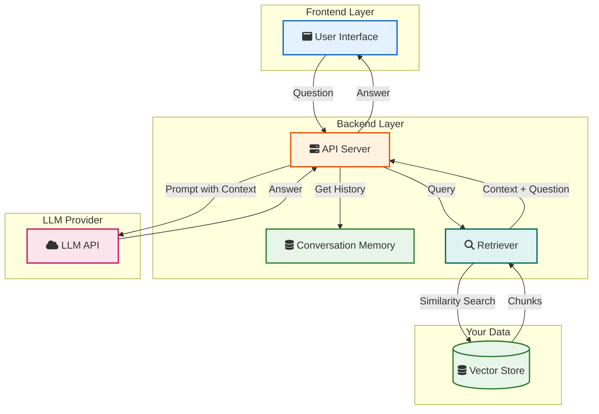
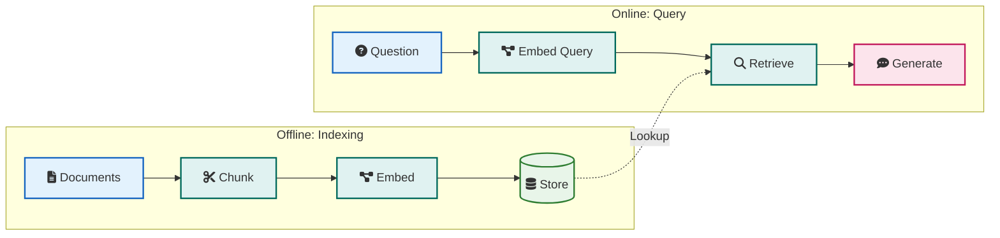

Your LLM application can chat. It has memory. But when users ask about your docs, your API, or your internal wiki, the model is guessing. It was not trained on your data. That is where RAG comes in.

RAG stands for Retrieval Augmented Generation. You pull relevant pieces of text from your own documents, feed them to the LLM as context, and the model answers from that. Fewer hallucinations, answers grounded in your data. This post walks you through building a RAG application from scratch. No hand-waving. Just the steps that work.

If you have not built a basic LLM app yet, start with [Building Your First LLM Application](/building-your-first-llm-application/). RAG sits on top of that: same backend and LLM, plus a retrieval step before generation.

> **TL;DR**: RAG has two phases. Offline: chunk documents, turn chunks into vectors (embeddings), store them. Online: embed the user question, retrieve the closest chunks, send chunks + question to the LLM. The LLM answers using your text. Get chunking and retrieval right first; then worry about fancy rerankers and hybrid search.

## What You Will Build

By the end you will have a small application that:

- Takes a set of documents (e.g. markdown or text files)
- Chunks them and builds a searchable index using embeddings
- Answers questions by retrieving relevant chunks and calling an LLM with that context

You will understand how the pipeline works so you can plug in different vector stores or chunking strategies later.

## How RAG Fits in Your Stack

RAG adds a retrieval layer between the user and the LLM. Your existing [LLM application](/building-your-first-llm-application/) already has a frontend, API, and conversation memory. RAG adds: a place to store document chunks and a step that runs before the LLM to fetch the right chunks.



**User** asks a question. The **API** loads conversation history from **Memory**, then calls the **Retriever**. The retriever turns the question into a vector, runs a **similarity search** on the **Vector Store**, and returns the best matching chunks. The API then sends those chunks plus the question (and history) to the **LLM**. The LLM generates an answer from the retrieved context. No purple, no magic: just search then generate.

## The Two Phases of RAG

Every RAG system has two phases. Mixing them up causes most of the confusion.



**Indexing (offline)**  
You run this when documents change. Load docs, split into chunks, compute embeddings, write to the vector store. This can be a batch job or a pipeline that runs on upload.

**Querying (online)**  
This runs on every user question. Embed the question, search the vector store for the nearest chunks, then call the LLM with those chunks as context. Latency here matters; keep retrieval fast.

## <i class="fas fa-cut"></i> Step 1: Get Your Documents and Chunk Them

Raw documents are too long to embed as a single block. You split them into chunks. Chunk size and how you split (by paragraph, by token count, or by semantic boundaries) have a big impact on retrieval. For a first version, fixed-size chunking is enough.

**Why chunk?**  
Embedding models have token limits. Long texts get truncated or averaged into a single vector and lose detail. Smaller chunks give you more precise retrieval. The trade-off: chunks that are too small lose surrounding context; chunks that are too large pull in irrelevant text and dilute the answer.

A simple approach: split on paragraph breaks, then merge small paragraphs until you hit a target size (e.g. 300–500 tokens). That keeps sentences intact. For more on giving the model the right information, see [Context Engineering](/context-engineering/).

```python
def chunk_text(text: str, chunk_size: int = 500, overlap: int = 50) -> list[str]:
    """Split text into overlapping chunks. overlap helps avoid cutting context at boundaries."""
    words = text.split()
    chunks = []
    start = 0
    while start < len(words):
        end = min(start + chunk_size, len(words))
        chunk = " ".join(words[start:end])
        chunks.append(chunk)
        start = end - overlap if end < len(words) else len(words)
    return chunks
```

In production you will care about chunk size (tokens, not words), overlap, and whether to split on headers or sections. Start simple; improve when you see bad retrievals.

## <i class="fas fa-project-diagram"></i> Step 2: Turn Chunks Into Embeddings and Store Them

An embedding is a vector of numbers that represents the meaning of a piece of text. Similar texts get similar vectors. You use an embedding model (OpenAI, Cohere, or open source) to turn each chunk into a vector, then store the vector and the original text in a vector store.

**Embedding model**  
Use the same model for documents and for the user question. Different models produce different vector spaces; mixing them makes similarity search unreliable. OpenAI `text-embedding-3-small` is cheap and good for most apps. For local setups, [running LLMs locally](/running-llms-locally/) can be combined with local embedding models.

**Vector store**  
For a first RAG app, Chroma is easy: in-memory or persistent, no extra infra. When you need something that scales or you already have PostgreSQL, use pgvector. Other options include Pinecone (managed), Qdrant, and Weaviate. The idea is the same: store vectors and optional metadata, query by nearest neighbor.

Example: chunk a document, embed with OpenAI, store in Chroma.

```python
from openai import OpenAI
import chromadb

client = OpenAI()
chroma_client = chromadb.Client()

def embed_texts(texts: list[str], model: str = "text-embedding-3-small") -> list[list[float]]:
    response = client.embeddings.create(input=texts, model=model)
    return [item.embedding for item in response.data]

def index_document(doc_id: str, text: str, collection_name: str = "docs"):
    chunks = chunk_text(text)
    embeddings = embed_texts(chunks)
    collection = chroma_client.get_or_create_collection(name=collection_name)
    collection.add(
        ids=[f"{doc_id}_{i}" for i in range(len(chunks))],
        embeddings=embeddings,
        documents=chunks,
    )
```

You now have an index: each chunk is stored with its embedding. Next step is to use it at query time.

## <i class="fas fa-search"></i> Step 3: Retrieve Relevant Chunks When the User Asks a Question

When the user sends a question, you embed it with the same model, then ask the vector store for the nearest chunks (e.g. top 5 or top 10). That is your context. You pass it to the LLM along with the question and any system instructions.

```python
def retrieve(question: str, collection_name: str = "docs", top_k: int = 5) -> list[str]:
    collection = chroma_client.get_collection(name=collection_name)
    query_embedding = embed_texts([question])[0]
    results = collection.query(query_embeddings=[query_embedding], n_results=top_k)
    return results["documents"][0]
```

Choosing `top_k` is a trade-off: too few and you miss relevant info; too many and you waste tokens and add noise. Start with 5 and tune using real questions. You can later add reranking or hybrid search (keyword + vector) to improve quality; see the production section below.

## <i class="fas fa-comment-dots"></i> Step 4: Send Context and Question to the LLM

Take the retrieved chunks, format them into a single context string, and put that in the prompt. Tell the model to answer only from the provided context and to say when something is not in the context. That reduces hallucinations and makes answers citable.

```python
def build_rag_prompt(question: str, chunks: list[str]) -> list[dict]:
    context = "\n\n---\n\n".join(chunks)
    system = (
        "You answer questions using only the context below. "
        "If the answer is not in the context, say so. "
        "When you use the context, you can say which part you used."
    )
    return [
        {"role": "system", "content": system},
        {"role": "user", "content": f"Context:\n{context}\n\nQuestion: {question}"},
    ]
```

Then call your LLM with these messages, the same way you do in [Building Your First LLM Application](/building-your-first-llm-application/). The only change is that the user message now includes the retrieved context. You can reuse your existing adapter (OpenAI, Claude, or local via Ollama).

## Putting It Together: A Minimal RAG API

Here is a minimal FastAPI endpoint that ties indexing and querying together. It assumes you have already indexed some documents into a Chroma collection named `"docs"`.

```python
from fastapi import FastAPI, HTTPException
from pydantic import BaseModel

app = FastAPI()

class QueryRequest(BaseModel):
    question: str

class QueryResponse(BaseModel):
    answer: str
    sources: list[str]

@app.post("/rag/query", response_model=QueryResponse)
def rag_query(request: QueryRequest):
    chunks = retrieve(request.question, top_k=5)
    if not chunks:
        raise HTTPException(status_code=404, detail="No relevant documents found")
    messages = build_rag_prompt(request.question, chunks)
    answer = llm.chat(messages)  # Your existing LLM adapter
    return QueryResponse(answer=answer, sources=chunks)
```

In a real app you would add conversation history (from your existing memory layer), rate limiting, and error handling. The flow stays the same: retrieve, then generate.

## Chunking Strategies That Actually Matter

Fixed-size chunking gets you started. As you scale, you will care about:

- **Semantic chunking**  
  Split on meaning (e.g. one chunk per section or topic) so each chunk is a coherent unit. Harder to implement, often better relevance.

- **Overlap**  
  A small overlap (50–100 tokens) between consecutive chunks avoids losing context at boundaries. Too much overlap wastes storage and can duplicate content in retrieval.

- **Metadata**  
  Store source file, section, or page with each chunk. You can filter by source (e.g. only search in “API docs”) and show users where the answer came from.

- **Chunk size**  
  Many tutorials use 256–512 tokens. Try 300–500 first; if retrieval misses key sentences, try slightly larger chunks or better boundaries.

There is no single best setting. Test with real questions and adjust. For more on structuring what you send to the model, see [Context Engineering](/context-engineering/).

## Retrieval Quality and Production Tweaks

- **Same embedding model for docs and queries**  
  Never embed documents with one model and queries with another. Similarity scores will be wrong.

- **Top-k and reranking**  
  Retrieve more than you need (e.g. 20), then rerank with a small cross-encoder or a heuristic (e.g. keyword match) and pass only the top 5 to the LLM. This often improves accuracy more than tuning chunk size alone.

- **Hybrid search**  
  Combine vector similarity with keyword search (BM25 or your database full-text search). Queries that need exact terms (names, IDs) benefit a lot.

- **Metadata filters**  
  If your docs have categories or dates, filter in the vector store before or after similarity search. That keeps the LLM from seeing irrelevant sections.

- **Evaluation**  
  Log questions and which chunks were retrieved. Manually check whether the right chunks are in the list. If not, fix chunking or retrieval before adding more features. As you add agents or tools, the same idea applies: see [Building AI Agents](/building-ai-agents/) for tool use and planning.

## Common Pitfalls

1. **Skipping evaluation**  
  Do not assume “good embeddings” means good answers. Run real questions and inspect retrieved chunks and LLM output.

2. **Chunking too large**  
  Big chunks make retrieval noisy. Start smaller (300–500 tokens) and increase only if you see missing context.

3. **No “I don’t know”**  
  If the model is not instructed to refuse when the context does not contain the answer, it will guess. Add a clear instruction and optionally check whether the retrieved chunks are relevant before calling the LLM.

4. **Indexing only once**  
  When documents change, re-run indexing. Plan for incremental updates or full rebuilds so the vector store stays in sync.

5. **Ignoring cost**  
  Embedding and LLM calls cost money. Cache embeddings for repeated questions, limit top_k, and monitor token usage. The same cost discipline from [Building Your First LLM Application](/building-your-first-llm-application/) applies here.

## When to Use RAG vs Other Approaches

| Approach | When to use it |
|----------|----------------|
| **RAG** | User questions over your docs, APIs, or knowledge base. Data changes often. You want answers grounded in specific text. |
| **Fine-tuning** | You need the model to mimic a style or learn rare patterns that are hard to express in context. Heavier and slower to iterate. |
| **Agents + tools** | User needs actions (search web, run code, call APIs), not just Q&A. See [Building AI Agents](/building-ai-agents/). |

RAG is the right default when “answer from this set of documents” is the main use case.

## Key Takeaways

1. **RAG is retrieve then generate.** Index documents (chunk, embed, store). At query time, embed the question, retrieve chunks, send them to the LLM as context.

2. **Chunking drives retrieval quality.** Start with simple fixed-size or paragraph-based chunking. Tune size and overlap with real questions.

3. **Use one embedding model** for both documents and queries. Same vector space, same similarity meaning.

4. **Start with a simple vector store** (Chroma or in-memory). Move to pgvector or a managed store when you need persistence or scale.

5. **Always instruct the LLM** to answer only from the provided context and to say when the answer is not there. Reduces hallucinations and improves trust.

6. **Evaluate on real questions.** Retrieval metrics (e.g. recall@k) help, but the only test that matters is whether the final answer is correct and grounded.

Building a RAG application is not magic. It is a retrieval pipeline plus the same LLM call you already use. Get the pipeline right, then iterate on chunking and retrieval. For the basics of that LLM call and conversation memory, see [Building Your First LLM Application](/building-your-first-llm-application/). For how to think about what you put in front of the model, see [Context Engineering](/context-engineering/).

---

**Related Posts:**

- [Building Your First LLM Application](/building-your-first-llm-application/) - Foundation for chat, memory, and LLM integration
- [Context Engineering](/context-engineering/) - How to provide the right information to AI
- [Building AI Agents](/building-ai-agents/) - Add tools and autonomous behavior
- [Prompt Injection Explained](/prompt-injection-explained/) - Your retrieval corpus is an attack surface. Learn how RAG poisoning works and how to harden your pipeline.
- [Running LLMs Locally](/running-llms-locally/) - Use local models for the LLM and embeddings
- [How LLMs Generate Text](/how-llms-generate-text/) - What happens inside the model

*Have questions about building RAG applications? Share your experience in the comments below.*
