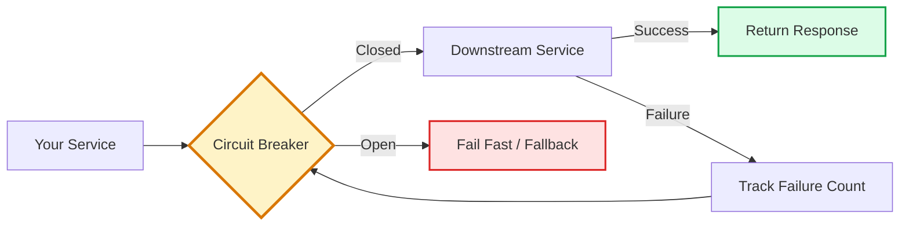
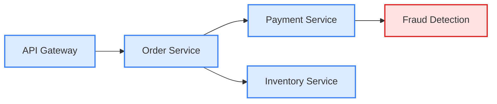
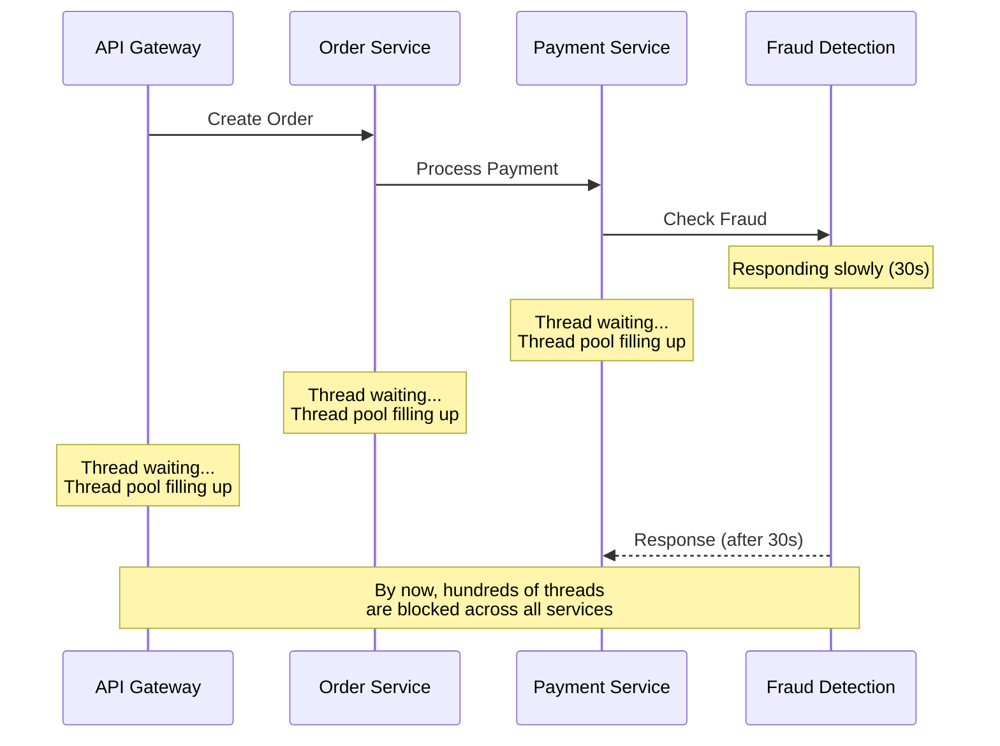
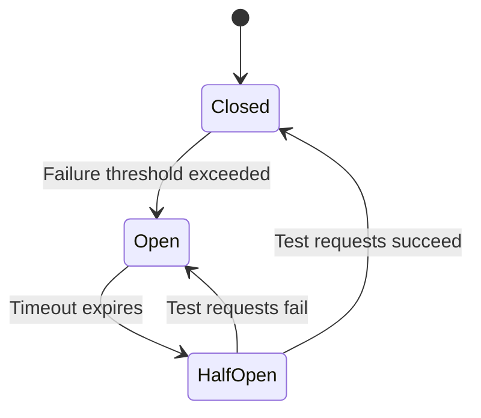
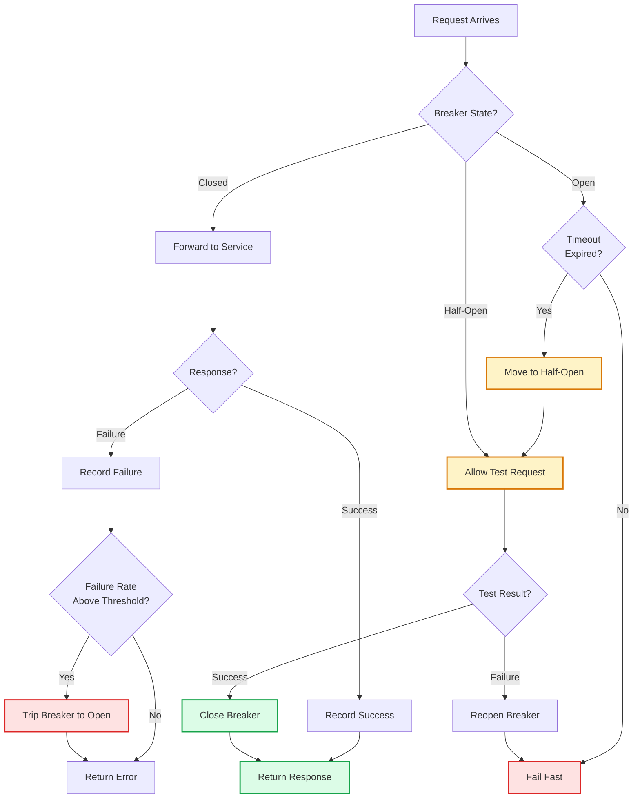
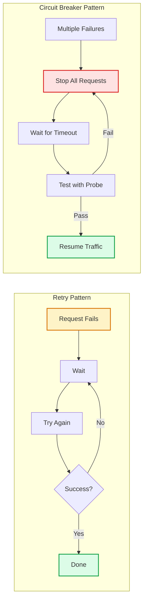
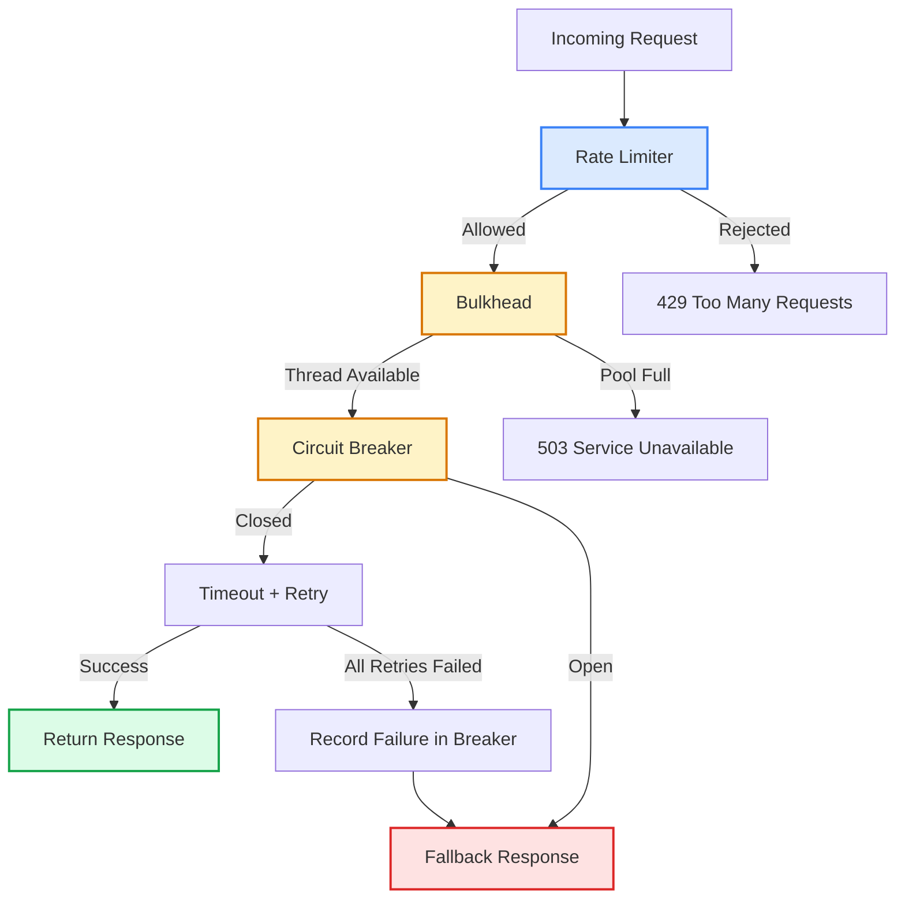
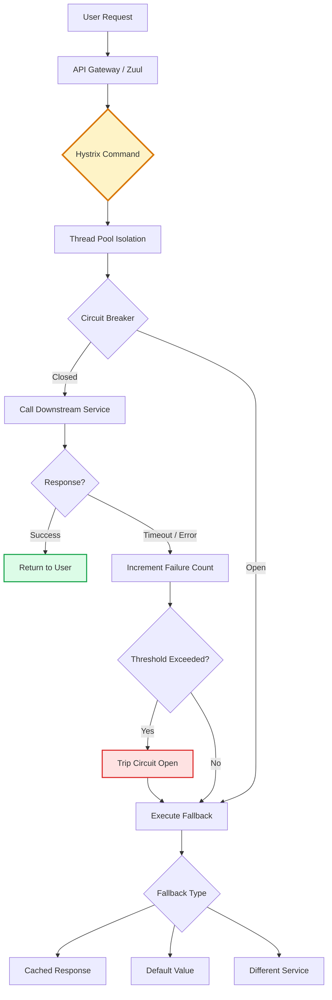
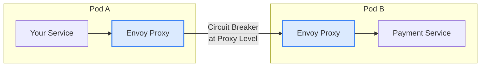

It is 2 AM. Your order service starts responding slowly. Within seconds, the payment service backs up because it is waiting on the order service. Then the inventory service stalls because it depends on payments. Then the notification service. Then the API gateway. Within 3 minutes, your entire platform is down. All because one service got slow.

This is a cascading failure. And the circuit breaker pattern exists to stop it.

## Table of Contents

1. [What Is the Circuit Breaker Pattern?](#what-is-the-circuit-breaker-pattern)
2. [Why Cascading Failures Are So Dangerous](#why-cascading-failures-are-so-dangerous)
3. [How the Circuit Breaker State Machine Works](#how-the-circuit-breaker-state-machine-works)
4. [Implementing a Circuit Breaker From Scratch](#implementing-a-circuit-breaker-from-scratch)
5. [Production Libraries You Should Use](#production-libraries-you-should-use)
6. [Circuit Breaker vs Other Resilience Patterns](#circuit-breaker-vs-other-resilience-patterns)
7. [Building a Complete Fault Tolerance Stack](#building-a-complete-fault-tolerance-stack)
8. [How Netflix Stops One Service From Killing Everything](#how-netflix-stops-one-service-from-killing-everything)
9. [Circuit Breakers in Service Meshes](#circuit-breakers-in-service-meshes)
10. [Monitoring and Alerting](#monitoring-and-alerting)
11. [Common Mistakes](#common-mistakes)
12. [Lessons Learned](#lessons-learned)

## What Is the Circuit Breaker Pattern?

The circuit breaker pattern is borrowed from electrical engineering. In your house, a circuit breaker trips when it detects excessive current. It cuts the circuit to prevent a fire. Once the problem is fixed, you flip the breaker back on.

In software, the idea is the same. A circuit breaker wraps calls to an external service and monitors for failures. When failures cross a threshold, the breaker "trips" and stops making calls to that service. Instead of waiting for timeouts and piling up threads, your service fails fast and returns an error or a fallback response immediately.

Michael Nygard popularized this pattern in his book [Release It!](https://pragprog.com/titles/mnee2/release-it-second-edition/). Martin Fowler later wrote about it in a widely referenced [blog post](https://martinfowler.com/bliki/CircuitBreaker.html). Netflix then made it mainstream by building it into their Hystrix library, which they used to protect every inter-service call in their microservices architecture.

The core mechanic is straightforward:



When the breaker is **closed**, requests flow through normally. When it is **open**, requests fail immediately without even reaching the downstream service. This is the key insight: failing fast is better than failing slow.

## Why Cascading Failures Are So Dangerous

To understand why circuit breakers matter, you need to understand what happens without them.

Say you have four microservices that depend on each other:



The Fraud Detection service hits a bug and starts responding in 30 seconds instead of 200ms. Here is what happens next:

| Time | What Happens |
|------|-------------|
| T+0s | Fraud Detection slows to 30s response time |
| T+5s | Payment Service threads pile up waiting for Fraud Detection |
| T+15s | Payment Service exhausts its thread pool (200 threads, all waiting) |
| T+20s | Order Service calls to Payment start timing out |
| T+30s | Order Service exhausts its own thread pool |
| T+45s | API Gateway starts returning 503 to all users |
| T+60s | Entire platform is down |

One slow service took down four services in 60 seconds. The Fraud Detection service did not even crash. It just got slow. And that is actually worse than crashing, because a crashed service returns errors immediately. A slow service holds onto resources.

This is what engineers mean by **cascading failure**. The failure cascades upstream through the dependency chain, like dominoes falling. Each service consumes its resources waiting for the one below it.



Without a circuit breaker, your services are too polite. They keep waiting, keep retrying, keep hoping the downstream service will respond. With a circuit breaker, your service recognizes the problem early and stops making things worse.

If you have dealt with [thundering herd problems](/thundering-herd-problem/) before, you will recognize a similar pattern here. A surge of requests overwhelms a system, and the system's own retry behavior amplifies the problem. Circuit breakers cut that feedback loop.

## How the Circuit Breaker State Machine Works

A circuit breaker is a state machine with three states: **Closed**, **Open**, and **Half-Open**.



### <i class="fas fa-lock"></i> Closed State (Normal Operation)

This is the default state. All requests pass through to the downstream service. The circuit breaker monitors every call and tracks the outcome in a sliding window.

Two types of sliding windows are commonly used:

- **Count-based**: Tracks the last N calls (e.g., the last 10 requests)
- **Time-based**: Tracks all calls in the last N seconds (e.g., the last 60 seconds)

When the failure rate in the window crosses a configured threshold (say 50%), the breaker trips and transitions to Open.

**Important**: The breaker waits for a minimum number of calls before evaluating. If you set the threshold to 50% and only 2 calls have happened, 1 failure should not trip the breaker. You need enough data to make a meaningful decision.

### <i class="fas fa-ban"></i> Open State (Failing Fast)

The breaker is tripped. Every incoming request fails immediately with an error or returns a fallback response. No calls are made to the downstream service.

This does two things:

1. **Protects your service**: Your threads and connections are not wasted waiting for a service that is down
2. **Protects the failing service**: You stop piling on requests, giving it room to recover

The breaker stays open for a configured timeout (typically 30 to 60 seconds). After the timeout, it moves to Half-Open.

### <i class="fas fa-adjust"></i> Half-Open State (Testing Recovery)

This is the probe state. The breaker lets a small number of test requests through to the downstream service.

- If the test requests **succeed**, the breaker closes and normal traffic resumes
- If any test request **fails**, the breaker opens again and resets the timeout

This is the circuit breaker's self-healing mechanism. You do not need to manually reset it. It tests recovery automatically on a schedule.

Here is the complete flow with all the decision points:



### Configuration Parameters

Every circuit breaker has these knobs:

| Parameter | What It Controls | Typical Default |
|-----------|-----------------|-----------------|
| `failureRateThreshold` | Percentage of failures to trip the breaker | 50% |
| `slidingWindowSize` | Number of calls (or seconds) to evaluate | 10-20 calls |
| `minimumNumberOfCalls` | Minimum calls before evaluating failure rate | 5 |
| `waitDurationInOpenState` | How long to stay open before testing | 30-60 seconds |
| `permittedCallsInHalfOpen` | Number of test calls in half-open state | 3-5 |
| `slowCallRateThreshold` | Percentage of slow calls to trip the breaker | 80% |
| `slowCallDurationThreshold` | What counts as a "slow" call | 2-5 seconds |

The slow call thresholds are often overlooked. A service that responds in 10 seconds is worse than one that returns errors in 50ms. Slow responses tie up your threads. Fast errors free them immediately. Your circuit breaker should trip on slow calls too, not just errors.

## Implementing a Circuit Breaker From Scratch

Before reaching for a library, it helps to understand how a circuit breaker works internally. Here is a minimal implementation in Python:

```python
import time
from enum import Enum
from collections import deque
from threading import Lock

class State(Enum):
    CLOSED = "closed"
    OPEN = "open"
    HALF_OPEN = "half_open"

class CircuitBreaker:
    def __init__(self, failure_threshold=5, recovery_timeout=30,
                 half_open_max_calls=3, window_size=10):
        self.failure_threshold = failure_threshold
        self.recovery_timeout = recovery_timeout
        self.half_open_max_calls = half_open_max_calls
        self.window_size = window_size
        
        self.state = State.CLOSED
        self.failures = deque(maxlen=window_size)
        self.last_failure_time = None
        self.half_open_calls = 0
        self.lock = Lock()
    
    def call(self, func, *args, **kwargs):
        with self.lock:
            if self.state == State.OPEN:
                if self._timeout_expired():
                    self.state = State.HALF_OPEN
                    self.half_open_calls = 0
                else:
                    raise CircuitOpenError(
                        f"Circuit is open. Retry after "
                        f"{self._seconds_until_retry():.0f}s"
                    )
            
            if self.state == State.HALF_OPEN:
                if self.half_open_calls >= self.half_open_max_calls:
                    raise CircuitOpenError("Half-open call limit reached")
                self.half_open_calls += 1
        
        try:
            result = func(*args, **kwargs)
            self._on_success()
            return result
        except Exception as e:
            self._on_failure()
            raise
    
    def _on_success(self):
        with self.lock:
            if self.state == State.HALF_OPEN:
                self.half_open_calls -= 1
                if self.half_open_calls <= 0:
                    self.state = State.CLOSED
                    self.failures.clear()
            self.failures.append(True)
    
    def _on_failure(self):
        with self.lock:
            self.failures.append(False)
            self.last_failure_time = time.time()
            
            if self.state == State.HALF_OPEN:
                self.state = State.OPEN
                return
            
            failure_count = self.failures.count(False)
            if failure_count >= self.failure_threshold:
                self.state = State.OPEN
    
    def _timeout_expired(self):
        if self.last_failure_time is None:
            return True
        return time.time() - self.last_failure_time >= self.recovery_timeout
    
    def _seconds_until_retry(self):
        elapsed = time.time() - self.last_failure_time
        return max(0, self.recovery_timeout - elapsed)

class CircuitOpenError(Exception):
    pass
```

Using it:

```python
breaker = CircuitBreaker(failure_threshold=3, recovery_timeout=30)

def call_payment_service(order_id):
    try:
        return breaker.call(payment_client.charge, order_id)
    except CircuitOpenError:
        return {"status": "pending", "message": "Payment processing delayed"}
    except Exception as e:
        return {"status": "error", "message": str(e)}
```

This is a simplified version. Production circuit breakers add sliding window tracking, metrics emission, event listeners, and thread safety across distributed instances. That is why you should use a library.

## Production Libraries You Should Use

Do not build your own circuit breaker for production. Use a battle-tested library.

### <i class="fab fa-java"></i> Resilience4j (Java / Spring Boot)

Resilience4j replaced Netflix Hystrix as the standard circuit breaker library for Java. Hystrix entered maintenance mode in 2018 and is no longer actively developed.

**Configuration in `application.yml`:**

```yaml
resilience4j:
  circuitbreaker:
    instances:
      paymentService:
        slidingWindowType: COUNT_BASED
        slidingWindowSize: 10
        minimumNumberOfCalls: 5
        failureRateThreshold: 50
        waitDurationInOpenState: 30s
        permittedNumberOfCallsInHalfOpenState: 3
        slowCallRateThreshold: 80
        slowCallDurationThreshold: 2s
```

**Usage:**

```java
@Service
public class PaymentService {

    @CircuitBreaker(name = "paymentService", fallbackMethod = "fallback")
    public PaymentResponse charge(Order order) {
        return paymentClient.charge(order);
    }

    private PaymentResponse fallback(Order order, Throwable t) {
        return new PaymentResponse("pending", "Payment queued for retry");
    }
}
```

Resilience4j also provides **Retry**, **Bulkhead**, **RateLimiter**, and **TimeLimiter** modules that compose well with the circuit breaker.

### <i class="fab fa-golang"></i> sony/gobreaker (Go)

The most popular circuit breaker library for Go, maintained by Sony.

```go
package main

import (
    "fmt"
    "net/http"
    "time"

    "github.com/sony/gobreaker/v2"
)

var cb *gobreaker.CircuitBreaker[[]byte]

func init() {
    cb = gobreaker.NewCircuitBreaker[[]byte](gobreaker.Settings{
        Name:        "payment-service",
        MaxRequests: 3,
        Interval:    60 * time.Second,
        Timeout:     30 * time.Second,
        ReadyToTrip: func(counts gobreaker.Counts) bool {
            failureRatio := float64(counts.TotalFailures) / 
                            float64(counts.Requests)
            return counts.Requests >= 5 && failureRatio >= 0.5
        },
        OnStateChange: func(name string, from, to gobreaker.State) {
            fmt.Printf("Circuit breaker %s: %s -> %s\n", name, from, to)
        },
    })
}

func CallPaymentService(orderID string) ([]byte, error) {
    body, err := cb.Execute(func() ([]byte, error) {
        resp, err := http.Get(
            fmt.Sprintf("http://payment-service/charge/%s", orderID),
        )
        if err != nil {
            return nil, err
        }
        defer resp.Body.Close()
        
        if resp.StatusCode >= 500 {
            return nil, fmt.Errorf("server error: %d", resp.StatusCode)
        }
        
        return io.ReadAll(resp.Body)
    })
    return body, err
}
```

### <i class="fab fa-python"></i> pybreaker (Python)

A clean, decorator-based circuit breaker for Python.

```python
import pybreaker
import requests

payment_breaker = pybreaker.CircuitBreaker(
    fail_max=5,
    reset_timeout=30,
    exclude=[requests.exceptions.HTTPError],
)

@payment_breaker
def charge_payment(order_id, amount):
    response = requests.post(
        "https://payment-service/charge",
        json={"order_id": order_id, "amount": amount},
        timeout=5,
    )
    response.raise_for_status()
    return response.json()

# Usage with fallback
def process_payment(order_id, amount):
    try:
        return charge_payment(order_id, amount)
    except pybreaker.CircuitBreakerError:
        return {"status": "queued", "message": "Payment will be retried"}
```

### Quick Comparison

| Feature | Resilience4j | gobreaker | pybreaker |
|---------|-------------|-----------|-----------|
| Language | Java | Go | Python |
| Sliding Window | Count + Time | Count | Count |
| Slow Call Detection | Yes | Custom via ReadyToTrip | No |
| Metrics | Micrometer, Prometheus | Callbacks | Listeners |
| Distributed State | No (use Redis) | No (use Redis) | Redis support built-in |
| Active Maintenance | Yes | Yes | Yes |

## Circuit Breaker vs Other Resilience Patterns

The circuit breaker is one of several resilience patterns. Understanding when to use which is critical.

### Circuit Breaker vs Retry



| Aspect | Retry | Circuit Breaker |
|--------|-------|-----------------|
| **Handles** | Transient failures (brief glitches) | Sustained failures (service is down) |
| **Behavior** | Keeps trying the same call | Stops trying, fails fast |
| **Scope** | Single request | All requests to that service |
| **Risk** | Can overwhelm a struggling service | None, protects the downstream service |
| **Use when** | Service occasionally hiccups | Service is consistently failing |

**Use them together**: Retry handles individual failures. When retries keep failing, the circuit breaker trips and stops all traffic. This prevents retries from becoming a [thundering herd](/thundering-herd-problem/) of repeated requests hammering a dying service.

### Circuit Breaker vs Bulkhead

The **bulkhead pattern** isolates resources (thread pools, connection pools) per downstream service. If your payment service is slow and consuming all 200 threads, a bulkhead ensures your inventory service still has its own dedicated 50 threads.

- **Circuit breaker** detects the problem (failure rate is high) and reacts (stop calling)
- **Bulkhead** contains the problem (one slow service cannot starve others)

They solve different parts of the same problem. Use both.

### Circuit Breaker vs Rate Limiter

A [rate limiter](/dynamic-rate-limiter-system-design/) controls how many requests a client can make. A circuit breaker controls whether requests should be made at all based on the downstream service's health.

- Rate limiter protects **your service** from too many incoming requests
- Circuit breaker protects **your service** from calling unhealthy downstream services

## Building a Complete Fault Tolerance Stack

Individual patterns are useful. Combined, they form a robust defense. Here is how they layer together:



The order matters:

1. **Rate Limiter** goes first. Reject excessive traffic before it consumes any resources.
2. **Bulkhead** goes second. Isolate the remaining traffic into per-service thread pools.
3. **Circuit Breaker** goes third. Check if the downstream service is healthy before calling.
4. **Timeout** wraps the actual call. Do not wait forever.
5. **Retry** handles transient failures within the timeout budget.
6. **Fallback** returns a degraded but functional response when everything else fails.

Here is what this looks like in Resilience4j:

```java
@Service
public class OrderService {

    @Bulkhead(name = "paymentService")
    @CircuitBreaker(name = "paymentService", fallbackMethod = "paymentFallback")
    @Retry(name = "paymentService")
    @TimeLimiter(name = "paymentService")
    public CompletableFuture<PaymentResponse> processPayment(Order order) {
        return CompletableFuture.supplyAsync(
            () -> paymentClient.charge(order)
        );
    }

    private CompletableFuture<PaymentResponse> paymentFallback(
            Order order, Throwable t) {
        // Queue the payment for async processing
        paymentQueue.send(order);
        return CompletableFuture.completedFuture(
            new PaymentResponse("queued", "Payment processing delayed")
        );
    }
}
```

The decorators execute from bottom to top: TimeLimiter wraps the call first, then Retry wraps that, then CircuitBreaker wraps the retries, and Bulkhead wraps everything.

## How Netflix Stops One Service From Killing Everything

Netflix runs over 1,000 microservices. Any service can fail at any time. Their approach to fault tolerance is a textbook example of defense in depth.

Netflix built **Hystrix** (now in maintenance mode, succeeded by Resilience4j) to wrap every inter-service call. Here is what their architecture looks like:



Key design decisions Netflix made:

**Thread pool isolation (bulkhead)**: Each downstream service gets its own thread pool. If the recommendation service is slow and uses all 20 of its threads, it does not affect the 20 threads allocated to the user profile service.

**Fallback everything**: Every Hystrix command has a fallback. If the personalized recommendation service is down, show generic trending movies. If the user's viewing history is unavailable, show the default homepage. The user gets a degraded experience, not a broken one.

**Request collapsing**: When multiple threads request the same data within a short window, Hystrix batches them into a single backend call. This prevents a [thundering herd](/thundering-herd-problem/) of duplicate requests.

**Monitoring with Hystrix Dashboard**: Netflix monitors circuit breaker state in real time. When a breaker trips, they know immediately which service is failing and how many requests are being short-circuited.

The lesson from Netflix is not to copy their exact implementation. It is to adopt the philosophy: **assume every dependency will fail, and design for it**.

## Circuit Breakers in Service Meshes

If you are running a [service mesh](/explainer/service-mesh-explained/) like Istio, you get circuit breaking at the infrastructure level without changing your application code.

Istio's Envoy sidecar proxy sits between your services and handles circuit breaking transparently:



**Istio DestinationRule for circuit breaking:**

```yaml
apiVersion: networking.istio.io/v1alpha3
kind: DestinationRule
metadata:
  name: payment-service
spec:
  host: payment-service
  trafficPolicy:
    connectionPool:
      tcp:
        maxConnections: 100
      http:
        h2UpgradePolicy: DEFAULT
        http1MaxPendingRequests: 50
        http2MaxRequests: 100
    outlierDetection:
      consecutive5xxErrors: 5
      interval: 30s
      baseEjectionTime: 30s
      maxEjectionPercent: 50
```

The `outlierDetection` section is Istio's circuit breaker. When a service instance returns 5 consecutive 5xx errors, Istio ejects it from the load balancing pool for 30 seconds. After that, it is allowed back in. If it fails again, it is ejected for longer.

This is powerful because:

- **No code changes**: Your application does not know the circuit breaker exists
- **Per-instance granularity**: If 1 out of 10 pods is unhealthy, only that pod gets ejected
- **Consistent behavior**: Every service in the mesh gets the same protection

The tradeoff: you have less control over fallback behavior. Application-level circuit breakers let you return cached data or degraded responses. Mesh-level circuit breakers can only reject or reroute traffic.

For most teams, the answer is **both**. Use the service mesh for basic outlier detection and connection management. Use application-level circuit breakers for smart fallbacks.

## Monitoring and Alerting

A circuit breaker is only useful if you know when it trips. Here are the metrics you should track:

### Key Metrics

| Metric | What to Watch | Alert Threshold |
|--------|--------------|-----------------|
| Circuit breaker state | State changes (Closed, Open, Half-Open) | Alert on every Open transition |
| Failure rate | Percentage of failed calls | > 10% over 5 minutes |
| Rejected calls | Requests rejected by open breaker | Any sustained rejections |
| Call duration (p99) | Latency of calls through the breaker | > 2x normal p99 |
| State transition frequency | How often the breaker flips | > 3 transitions in 5 minutes |

### What Your Dashboard Should Show

Track these for each circuit breaker instance:

```
# Prometheus metrics (Resilience4j)
resilience4j_circuitbreaker_state{name="paymentService"}
resilience4j_circuitbreaker_calls_seconds_count{name="paymentService", kind="successful"}
resilience4j_circuitbreaker_calls_seconds_count{name="paymentService", kind="failed"}
resilience4j_circuitbreaker_not_permitted_calls_total{name="paymentService"}
resilience4j_circuitbreaker_failure_rate{name="paymentService"}
```

A circuit breaker that keeps flipping between Open and Closed is a sign of an unstable downstream service. It might be partially recovering, then failing again. This pattern often indicates the recovery timeout is too short or the half-open test is not representative.

If you use [distributed tracing](/distributed-tracing-jaeger-vs-tempo-vs-zipkin/), make sure your circuit breaker events show up in your traces. When a request fails because a breaker was open, the trace should clearly show that the failure was a circuit break, not a downstream error. This saves hours of debugging.

## Common Mistakes

### <i class="fas fa-exclamation-triangle"></i> 1. Sharing a Circuit Breaker Across Multiple Endpoints

If your payment service has `/charge`, `/refund`, and `/status` endpoints, do not use one circuit breaker for all three. The `/status` endpoint might be working fine while `/charge` is failing. One breaker for all endpoints means a failure in charging blocks status checks too.

Use separate circuit breakers per endpoint, or at minimum, per distinct failure domain.

### <i class="fas fa-exclamation-triangle"></i> 2. Not Implementing Fallbacks

A circuit breaker without a fallback just converts slow errors into fast errors. That is better than nothing, but you can do more. Think about what your service can return when the downstream is unavailable:

- **Cached data**: Return the last known good response
- **Default values**: Show a generic recommendation instead of a personalized one
- **Queued processing**: Accept the request and process it later via a [message queue](/role-of-queues-in-system-design/)
- **Degraded functionality**: Show the page without the component that requires the failing service

### <i class="fas fa-exclamation-triangle"></i> 3. Setting Thresholds Too Low

If you set the failure threshold to 2 out of 10 requests, your circuit breaker will trip on normal jitter. Network calls fail sometimes. Set your threshold high enough to ignore noise but low enough to catch real problems. 50% failure rate with a minimum of 5 calls is a reasonable starting point.

### <i class="fas fa-exclamation-triangle"></i> 4. Not Counting Slow Calls as Failures

A service that responds in 15 seconds is worse than one that returns a 500 error in 100ms. The 500 error frees your thread immediately. The slow response holds it for 15 seconds. Configure your circuit breaker to treat slow calls as failures.

### <i class="fas fa-exclamation-triangle"></i> 5. Ignoring the Half-Open State

Some teams configure the circuit breaker and forget about the half-open state. They set `permittedCallsInHalfOpen` to 1, so the breaker sends a single test request. If that one request happens to hit a still-recovering instance, the breaker reopens and the service stays degraded longer than necessary. Allow 3 to 5 probe requests for a more reliable recovery signal.

## Lessons Learned

### <i class="fas fa-bolt"></i> 1. Slow Is Worse Than Down

A crashed service returns errors in milliseconds. A slow service holds threads for seconds. That thread-holding behavior is what causes cascading failures. Always set timeouts on your outgoing calls, and configure your circuit breaker to trip on slow responses, not just errors.

### <i class="fas fa-layer-group"></i> 2. Defense in Depth Is Not Optional

Netflix does not rely on circuit breakers alone. They layer circuit breakers with thread pool isolation (bulkhead), request coalescing, rate limiting, timeouts, and fallbacks. No single pattern covers all failure modes. A circuit breaker will not help if a single slow service consumes your entire thread pool before the failure rate threshold is reached. You need a bulkhead for that.

### <i class="fas fa-chart-line"></i> 3. Monitor the Breaker, Not Just the Service

Tracking the downstream service's health is not enough. You need to know the state of every circuit breaker in your system. A breaker that is open means users are seeing degraded service. A breaker that keeps flipping means your recovery timeout needs tuning. Make circuit breaker state a first-class metric in your dashboards.

### <i class="fas fa-cog"></i> 4. Tune Your Thresholds Per Service

A payment service and a recommendation service have very different failure tolerances. Payments need aggressive protection (low threshold, short timeout) because failures cost you money. Recommendations can tolerate higher error rates because a failed recommendation does not block the user's workflow. Use different configurations for different downstream services.

### <i class="fas fa-sync-alt"></i> 5. Fallbacks Are a Product Decision

What to show when a service is down is not an engineering decision alone. It is a product decision. Should you show cached prices that might be stale? Should you hide the recommendation section entirely? Should you show a "try again later" message? Work with your product team to define fallback behavior before the outage happens.

### <i class="fas fa-vial"></i> 6. Test Circuit Breaker Behavior Before Production

Do not wait for a real outage to discover how your circuit breakers behave. Test them:

- Inject failures and verify the breaker trips
- Verify fallback responses are correct and useful
- Test recovery: does the breaker close properly when the downstream service comes back?
- Load test with circuit breakers open to confirm your fallback path handles the traffic

If you use chaos engineering tools, circuit breakers are one of the first things to validate. Netflix built [Chaos Monkey](https://netflix.github.io/chaosmonkey/) specifically to test these scenarios in production.

---

## Further Reading

- [Circuit Breaker](https://martinfowler.com/bliki/CircuitBreaker.html) - Martin Fowler's original blog post on the pattern
- [Release It!](https://pragprog.com/titles/mnee2/release-it-second-edition/) - Michael Nygard's book where the pattern was first described for software
- [Resilience4j Documentation](https://resilience4j.readme.io/docs/circuitbreaker) - Production-ready Java circuit breaker
- [sony/gobreaker](https://github.com/sony/gobreaker) - The most popular Go circuit breaker library
- [microservices.io Circuit Breaker](https://microservices.io/patterns/reliability/circuit-breaker.html) - Pattern catalog entry
- [Thundering Herd Problem](/thundering-herd-problem/) - How circuit breakers help prevent retry storms
- [Dynamic Rate Limiter](/dynamic-rate-limiter-system-design/) - Complementary pattern for protecting your APIs
- [Role of Queues](/role-of-queues-in-system-design/) - Using queues for fallback processing when circuit breakers trip
- [Service Mesh Explained](/explainer/service-mesh-explained/) - Infrastructure-level circuit breaking with Istio and Envoy
- [Distributed Tracing](/distributed-tracing-jaeger-vs-tempo-vs-zipkin/) - How to debug circuit breaker behavior across services
- [OpenTelemetry in Production](/opentelemetry-production-guide/) - Instrument your services to capture circuit breaker events in traces

## Conclusion

The circuit breaker pattern is one of the most important patterns for building reliable distributed systems. Without it, one slow service can take down your entire platform in minutes. With it, failures are contained, resources are protected, and your users get a degraded experience instead of a broken one.

Start simple. Pick a library for your language (Resilience4j for Java, gobreaker for Go, pybreaker for Python). Wrap your most critical downstream calls. Set reasonable defaults: 50% failure threshold, 10-call sliding window, 30-second recovery timeout, 3 probe calls in half-open state. Add a fallback that returns something useful.

Then layer your defenses. Add timeouts to every outgoing call. Add retries with exponential backoff and [jitter](/thundering-herd-problem/). Add bulkheads to isolate your thread pools. Add monitoring so you know when breakers trip.

These are not patterns you should adopt because they sound impressive in a system design interview. These are patterns you adopt because at 2 AM, when a service goes down, you want your system to handle it gracefully without waking you up. Netflix, Amazon, and Google all learned this the hard way. You do not have to.
