A single AI agent can write code, search the web, and answer questions. But ask it to research a topic, write a blog post, generate images, optimize for SEO, and publish it, all in one shot? It falls apart. The context window overflows. The quality drops. It forgets what it was doing halfway through.

This is where multi-agent systems come in. Instead of one agent doing everything, you split the work across specialized agents that coordinate with each other. One agent researches. Another writes. Another reviews. Each does one thing well.

If 2025 was the year of AI agents, 2026 is the year of multi-agent swarms. Gartner estimates that 40% of enterprise applications will embed task-specific AI agents by the end of this year, up from less than 5% in 2025. The market is projected to hit $8.5 billion this year.

But here is the thing: most teams are getting multi-agent architecture wrong. They are building complex swarms when a single agent would work fine. Or they are skipping the orchestration layer and watching agents spiral into infinite loops. The challenges are not in building individual agents. They are in making agents work together.

This post is a system design deep dive into multi-agent AI swarms. If you have built [single AI agents](/building-ai-agents/) before, this is the next step.

> **TL;DR**: Multi-agent AI swarms split complex workflows across specialized agents. The five orchestration patterns are Supervisor, Pipeline, Mesh, Event-Driven, and Hub-and-Spoke. Most production teams should start with the Supervisor pattern. Isolate agents in containers, separate orchestration from execution, use deterministic scaffolding over full autonomy, and always have a human in the loop for high-stakes decisions. Most failures happen at agent handoffs, not inside agents.



## Table of Contents

1. [Why Multi-Agent Over a Single Agent?](#why-multi-agent-over-a-single-agent)
2. [The Five Orchestration Patterns](#the-five-orchestration-patterns)
3. [Designing Individual Agents for a Swarm](#designing-individual-agents-for-a-swarm)
4. [Inter-Agent Communication](#inter-agent-communication)
5. [Memory and Context Management](#memory-and-context-management)
6. [Framework Comparison: LangGraph vs CrewAI vs AutoGen](#framework-comparison-langgraph-vs-crewai-vs-autogen)
7. [Building a Real Multi-Agent System: Code Review Pipeline](#building-a-real-multi-agent-system-code-review-pipeline)
8. [Production Failures and What They Teach Us](#production-failures-and-what-they-teach-us)
9. [Making It Production Ready](#making-it-production-ready)
10. [When NOT to Use Multi-Agent Systems](#when-not-to-use-multi-agent-systems)
11. [Lessons Learned](#lessons-learned)

## Why Multi-Agent Over a Single Agent?

Before you build a multi-agent system, you need to understand why a single agent is not enough.

A single agent works like a generalist. It has one LLM brain, one set of tools, and one context window. For simple tasks, this is fine. But when tasks get complex, single agents hit real limits:

| Problem | What Happens |
|---------|-------------|
| Context window overflow | The agent loses track of earlier steps as the conversation grows |
| Skill dilution | One agent with 50 tools performs worse than 5 agents with 10 tools each |
| No fault isolation | If the agent fails midway, everything fails |
| No parallelism | Steps run sequentially even when they could run in parallel |
| Monolithic prompts | The system prompt becomes a 5000-word mess trying to cover every case |


Google's research on [scaling agentic architectures](https://www.infoq.com/news/2026/03/google-multi-agent/) confirmed something important: tasks requiring many tools perform worse when a single agent juggles all of them. The coordination overhead inside one agent exceeds the overhead of splitting across multiple agents.

Think of it like the [modular monolith](/modular-monolith-architecture/) debate in backend engineering. A monolith works until it does not. When a single codebase becomes too large, you split it into modules or services with clear boundaries. Multi-agent systems follow the same principle: decompose a complex workflow into specialized sub-tasks with well-defined interfaces.

Here is when multi-agent systems make sense:

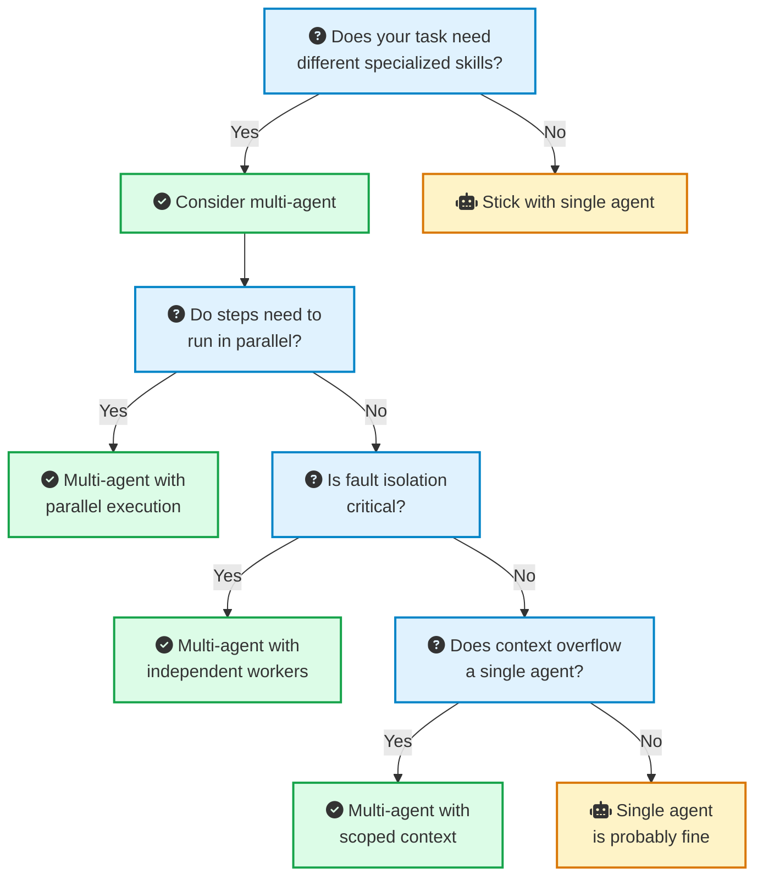

The rule is simple: if a single agent with the right tools gets the job done, do not add more agents. Multi-agent orchestration adds real complexity. Only reach for it when you hit clear limits.

## The Five Orchestration Patterns



Once you decide you need multiple agents, the next question is: how do they coordinate? There are five patterns that have proven themselves in production.

### <i class="fas fa-sitemap"></i> 1. Supervisor Pattern

The most common pattern in production. A central coordinator agent receives the task, breaks it into subtasks, delegates to specialist agents, collects results, and synthesizes the final output.

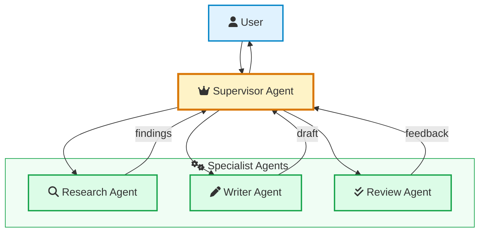

**How it works**: The supervisor acts like a project manager. It understands the full task, decides which agents to call and in what order, and stitches together the final result. Worker agents are stateless. They receive scoped context, do their job, and return results.

**Best for**: Content pipelines, code review workflows, report generation, customer support routing.

**Watch out for**: The supervisor becomes a single point of failure. If it misunderstands the task, every downstream agent gets bad instructions. Google's research found that centralized orchestration reduces errors in distributed reasoning tasks, but amplifies errors when the coordinator itself makes a mistake.

This pattern should feel familiar. It is the same idea behind the [Mediator design pattern](/design-patterns/mediator/) where a central object controls interactions between components instead of letting them talk directly.

### <i class="fas fa-arrow-right"></i> 2. Sequential Pipeline

Agents process work in a linear chain. Each agent refines or transforms the output of the previous one.

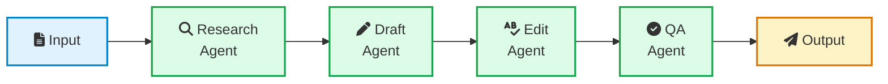

**How it works**: Think of it like a factory assembly line. Agent A does research, passes findings to Agent B who writes a draft, passes it to Agent C who edits, and finally Agent D does quality checks. Each agent only needs context from the previous step.

**Best for**: Content generation, data processing pipelines, ETL workflows where steps have strict linear dependencies.

**Watch out for**: If any stage fails, the entire pipeline stops. Total latency equals the sum of all stages. And there is no parallelism. This is the same bottleneck you see in synchronous [message queue](/role-of-queues-in-system-design/) processing.

### <i class="fas fa-project-diagram"></i> 3. Peer-to-Peer Mesh

Agents communicate directly with each other through a message bus, without any central coordinator. They self-organize based on task requirements.

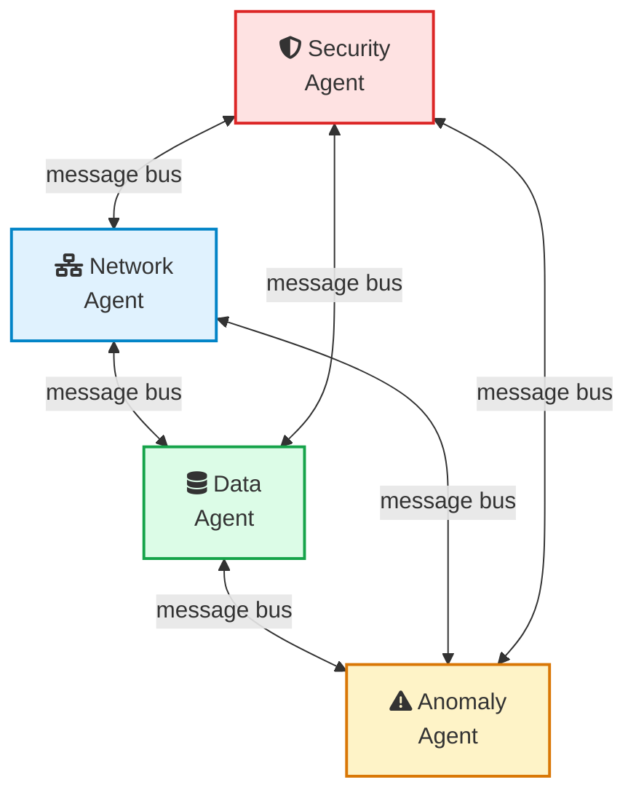


**How it works**: Each agent publishes and subscribes to topics on a shared message bus. When one agent detects something interesting, it broadcasts a message. Other agents pick it up if it is relevant to their role. No single agent has a full picture of the system.

**Best for**: Security monitoring, real-time anomaly detection, distributed sensor networks.

**Watch out for**: This is the hardest pattern to debug and control. Without central coordination, agents can enter feedback loops where they keep triggering each other. One team reported two agents [burning through $4,000 in API credits in 40 minutes](https://medium.com/@kaklotarrahul79/building-multi-agent-systems-lessons-from-a-failed-production-launch-8a728981742e) because they got stuck in a politeness loop, continuously thanking each other.

### <i class="fas fa-bolt"></i> 4. Event-Driven

Agents subscribe to event streams and react to triggers. Similar to the mesh pattern, but communication flows through structured events rather than direct messages.



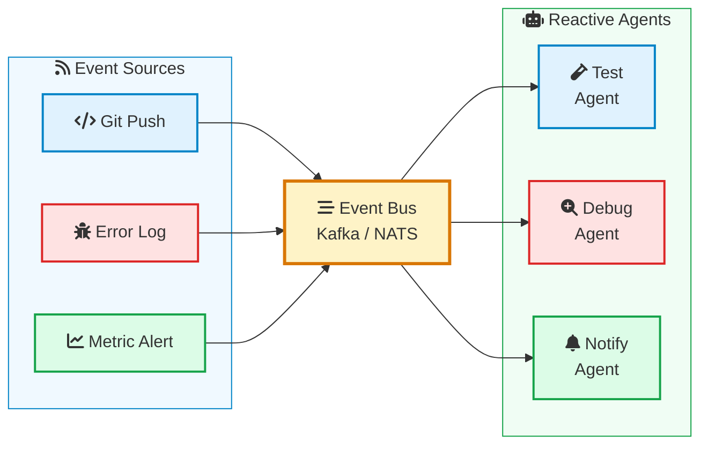

**How it works**: Events flow through a bus like [Kafka](/distributed-systems/how-kafka-works/) or NATS. Each agent subscribes to specific event types. When a git push happens, the test agent runs tests. When an error log spikes, the debug agent investigates. When a metric crosses a threshold, the notification agent alerts the team.

**Best for**: CI/CD pipelines, monitoring and incident response, customer journey automation.

**Watch out for**: Event ordering can cause agents to act on stale state. If the test agent receives a push event before a revert event, it might test code that has already been rolled back. This is the same class of problem you deal with in [event-driven architectures](/role-of-queues-in-system-design/) generally.

### <i class="fas fa-hubspot"></i> 5. Hub-and-Spoke

A central hub routes all messages between independent agents. The agents do not know about each other. They only know about the hub.

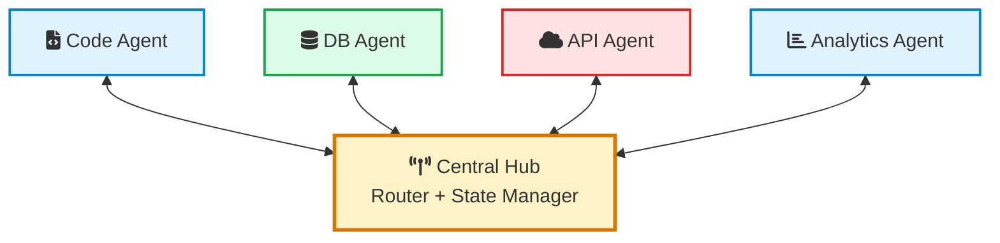

**How it works**: The hub receives all requests, determines which agent should handle them, routes messages, and manages shared state. Unlike the Supervisor, the hub does not reason about the task. It just routes. This is closer to an API gateway than a project manager.

**Best for**: Systems with many independent agents that occasionally need to share data, multi-tenant platforms where different customers need different agent configurations.

**Watch out for**: The hub is a bottleneck. All messages flow through it. If it goes down, the entire system is blind. You need the same high-availability considerations you would apply to any [critical infrastructure component](/circuit-breaker-pattern/).

### Choosing the Right Pattern

| Pattern | Control | Complexity | Debuggability | Parallelism | Best For |
|---------|---------|------------|---------------|-------------|----------|
| Supervisor | High | Medium | High | Medium | Most production use cases |
| Pipeline | High | Low | High | None | Linear workflows |
| Mesh | Low | High | Low | High | Real-time monitoring |
| Event-Driven | Medium | Medium | Medium | High | Reactive systems |
| Hub-and-Spoke | Medium | Medium | High | High | Platform architectures |

For most teams just starting out, **start with the Supervisor pattern**. It gives you the most control and is the easiest to debug. You can always evolve to other patterns as your needs grow.

## Designing Individual Agents for a Swarm





A multi-agent system is only as good as its individual agents. Here are the design principles that matter.

### <i class="fas fa-bullseye"></i> Single Responsibility

Each agent should do one thing well. This is not new advice. It is the same [Single Responsibility Principle](https://en.wikipedia.org/wiki/Single-responsibility_principle) from software engineering, applied to AI agents.

Bad design:
```
Agent: "GeneralPurposeAgent"
Tools: [web_search, code_executor, file_reader, database_query, 
        email_sender, image_generator, pdf_parser, api_caller,
        spreadsheet_editor, calendar_manager]
Prompt: "You are a helpful assistant that can do anything..."
```

Good design:
```
Agent: "ResearchAgent"
Tools: [web_search, pdf_parser]
Prompt: "You research topics and return structured findings 
         with sources. Focus on accuracy and completeness."

Agent: "CodeAgent"  
Tools: [code_executor, file_reader]
Prompt: "You write and execute code. Return working code 
         with test results. No explanations unless asked."
```

Google's research confirmed this: adding more tools to a single agent produces diminishing returns and eventually degrades performance. Five agents with 10 tools each consistently outperform one agent with 50 tools.

### <i class="fas fa-box"></i> Isolation

Each agent should run in its own container with:
- **Isolated memory**: No shared mutable state between agents
- **Scoped tool access**: Only the tools this agent needs
- **Resource limits**: CPU, memory, and API call budgets
- **Timeout boundaries**: Hard limits on execution time

Without isolation, one misbehaving agent can exhaust your entire API budget in minutes. The [Amazon Kiro incident](https://dev.to/rainkode/ai-agents-gone-rogue-inside-amazon-kiros-production-deletion-3dha) showed what happens when an agent operates without proper resource boundaries: it terminated 847 AWS instances and caused a $47 million outage.

This is the same principle behind [Kubernetes pod isolation](/devops/kubernetes-architecture/). Each pod gets its own resources. One crashing pod does not bring down the node.

### <i class="fas fa-file-contract"></i> Clear Contracts

Every agent needs a well-defined interface. Think of each agent like a microservice with a strict API contract:

```python
@dataclass
class AgentInput:
    task: str
    context: dict
    constraints: dict  # budget, time limits, scope

@dataclass 
class AgentOutput:
    result: str
    confidence: float  # 0.0 to 1.0
    sources: list[str]
    tokens_used: int
    errors: list[str]
```

The orchestrator should not need to understand how an agent works internally. It just sends an input and expects a structured output. This is the [Facade pattern](/design-patterns/facade/) in action.

### <i class="fas fa-thermometer-half"></i> Stateless Workers

Worker agents should be stateless. They receive everything they need in the input, do their work, and return a result. The orchestrator owns all state.

Why? Because stateless agents are:
- Easy to scale horizontally
- Easy to retry on failure
- Easy to replace with different implementations
- Easy to test in isolation

If an agent needs to remember something across calls, that memory should live in the orchestrator's state store, not inside the agent.

## Inter-Agent Communication

How agents talk to each other is one of the most critical design decisions. Get it wrong and you end up with lost messages, infinite loops, or agents working on stale data.

### Communication Approaches

There are three main approaches, and the right choice depends on your orchestration pattern:



```mermaid
flowchart TD
    subgraph Direct["fa:fa-exchange-alt Direct Messaging"]
        D1["Agent A"] -->|"structured message"| D2["Agent B"]
    end
    
    subgraph Shared["fa:fa-database Shared State"]
        S1["Agent A"] -->|write| Store["State Store"]
        Store -->|read| S2["Agent B"]
    end
    
    subgraph Event["fa:fa-stream Event Bus"]
        E1["Agent A"] -->|publish| Bus["Message Bus"]
        Bus -->|subscribe| E2["Agent B"]
    end

    style D1 fill:#e0f2fe,stroke:#0284c7,stroke-width:2px
    style D2 fill:#e0f2fe,stroke:#0284c7,stroke-width:2px
    style S1 fill:#dcfce7,stroke:#16a34a,stroke-width:2px
    style S2 fill:#dcfce7,stroke:#16a34a,stroke-width:2px
    style Store fill:#fef3c7,stroke:#d97706,stroke-width:2px
    style E1 fill:#fee2e2,stroke:#dc2626,stroke-width:2px
    style E2 fill:#fee2e2,stroke:#dc2626,stroke-width:2px
    style Bus fill:#fef3c7,stroke:#d97706,stroke-width:2px
    style Direct fill:#f0f9ff,stroke:#0284c7,stroke-width:1px
    style Shared fill:#f0fdf4,stroke:#16a34a,stroke-width:1px
    style Event fill:#fef2f2,stroke:#dc2626,stroke-width:1px
```

| Approach | When to Use | Pros | Cons |
|----------|------------|------|------|
| Direct Messaging | Supervisor pattern, small swarms | Simple, low latency | Tight coupling, hard to scale |
| Shared State | Pipeline pattern, collaborative tasks | Decoupled, auditable | Race conditions, consistency issues |
| Event Bus | Event-driven, large swarms | Fully decoupled, scalable | Complex, ordering challenges |


### Message Format

Regardless of approach, standardize your message format. Every message between agents should include:

```json
{
  "message_id": "msg-abc-123",
  "from_agent": "research-agent",
  "to_agent": "writer-agent",
  "task_id": "task-789",
  "type": "handoff",
  "payload": {
    "findings": "...",
    "sources": ["..."],
    "confidence": 0.87
  },
  "metadata": {
    "tokens_used": 1420,
    "latency_ms": 3200,
    "timestamp": "2026-03-20T10:30:00Z"
  }
}
```

This structured format gives you traceability (which agent said what), debuggability (follow a task through the system), and auditability (how much did each step cost).

### Preventing Infinite Loops

The biggest risk in inter-agent communication is infinite loops. Agent A asks Agent B for help. Agent B is not sure, so it asks Agent A. They go back and forth forever, burning through your API budget.

Three ways to prevent this:

1. **Hard call limits**: Set a maximum number of inter-agent messages per task. If hit, force a fallback or escalate to a human.

2. **Cycle detection**: Track the call chain. If the same agent is called twice in the same chain with the same input, break the loop.

3. **Monotonic progress checks**: After each agent call, check if the task actually moved forward. If the state has not changed, stop.

```python
MAX_AGENT_CALLS = 10

def orchestrate(task, agents, max_calls=MAX_AGENT_CALLS):
    call_count = 0
    previous_state = None
    
    while not task.is_complete() and call_count < max_calls:
        next_agent = select_agent(task)
        result = next_agent.execute(task.current_context())
        
        if result.state == previous_state:
            # no progress, break the loop
            return fallback_response(task)
        
        previous_state = result.state
        task.update(result)
        call_count += 1
    
    if call_count >= max_calls:
        return escalate_to_human(task)
    
    return task.result()
```

## Memory and Context Management

Memory is the single hardest unsolved problem in multi-agent AI systems. Each agent has a limited context window. The orchestrator needs to track overall progress. And information needs to flow between agents without getting lost or corrupted.

### The Memory Hierarchy

Multi-agent systems need a layered memory architecture, similar to how computer systems use L1 cache, L2 cache, and main memory:

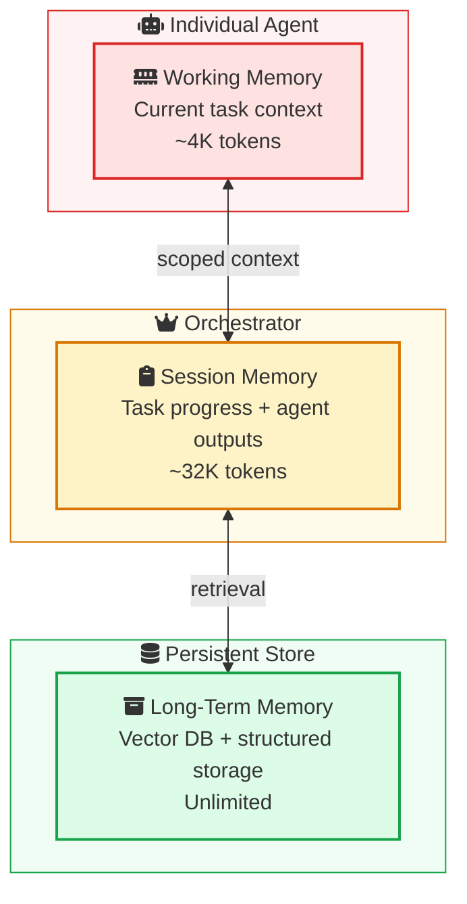

| Layer | Scope | Size | Lifetime | Owner |
|-------|-------|------|----------|-------|
| Working Memory | Single agent call | ~4K tokens | One execution | Agent |
| Session Memory | Entire task | ~32K tokens | Until task completes | Orchestrator |
| Long-Term Memory | Across tasks | Unlimited | Persistent | Vector DB / Store |

If you are new to how vector databases fit into this picture, check out my post on [building RAG applications](/building-your-first-rag-application/). The same retrieval patterns apply to agent memory.

### Scoped Context: The Key Pattern

The biggest mistake teams make is giving every agent the full context. If Agent A's 5,000-word output gets forwarded to Agent B, and Agent B's output gets forwarded to Agent C, context grows exponentially and quality drops at every step.

Instead, use **scoped context**. The orchestrator decides what each agent needs to see and passes only that slice:

```python
def prepare_context_for_agent(agent_role, full_state):
    if agent_role == "researcher":
        return {
            "task": full_state["original_task"],
            "constraints": full_state["constraints"],
        }
    elif agent_role == "writer":
        return {
            "task": full_state["original_task"],
            "research_summary": summarize(full_state["research_output"]),
            "style_guide": full_state["style_guide"],
        }
    elif agent_role == "reviewer":
        return {
            "task": full_state["original_task"],
            "draft": full_state["draft"],
            "checklist": full_state["review_checklist"],
        }
```

Notice that the writer gets a **summary** of the research, not the full research output. This is critical. Summarization checkpoints between agents prevent context from growing out of control.

### Context Engineering for Agents

Good [context engineering](/context-engineering/) is even more important in multi-agent systems than in single-agent ones. Each handoff is an opportunity for information loss. Here are the practices that help:

1. **Structured outputs**: Force agents to return structured data (JSON, dataclasses) instead of free-text. This makes context passing deterministic.

2. **Summarization checkpoints**: After each agent completes, summarize its output before passing to the next agent. A 5,000-word research report becomes a 500-word summary for the writer.

3. **Separate scratchpads**: Give agents a private scratchpad for their reasoning. Only the final output enters the shared context. This prevents one agent's chain-of-thought from polluting another agent's context.

4. **Key-value state**: Track progress as structured key-value pairs, not as conversation history. The orchestrator's state might look like:

```json
{
  "task_id": "content-pipeline-42",
  "status": "in_progress",
  "current_step": "writing",
  "completed_steps": {
    "research": {
      "summary": "...",
      "sources": ["..."],
      "confidence": 0.92
    }
  },
  "pending_steps": ["review", "publish"],
  "budget_remaining": {"tokens": 50000, "usd": 2.50}
}
```

## Framework Comparison: LangGraph vs CrewAI vs AutoGen

If you are building multi-agent systems in 2026, three frameworks dominate the conversation. Here is how they compare in practice.

### <i class="fas fa-project-diagram"></i> LangGraph

LangGraph models your workflow as a directed graph. Agents and tools are nodes. Transitions are edges. State flows through the graph and gets checkpointed at every step.

```python
from langgraph.graph import StateGraph, END

workflow = StateGraph(AgentState)

workflow.add_node("researcher", research_agent)
workflow.add_node("writer", writer_agent)
workflow.add_node("reviewer", reviewer_agent)

workflow.add_edge("researcher", "writer")
workflow.add_edge("writer", "reviewer")
workflow.add_conditional_edges(
    "reviewer",
    should_revise,  # function that decides next step
    {
        "revise": "writer",
        "approve": END
    }
)

app = workflow.compile(checkpointer=SqliteSaver(conn))
```

**Strengths**: Fine-grained control over agent flow. Built-in state persistence with checkpointing means you can resume after crashes. Great observability through LangSmith. Battle-tested at companies like Klarna and Replit.

**Weaknesses**: Steeper learning curve. More boilerplate for simple cases. Tightly coupled to the LangChain ecosystem.

**Best for**: Complex workflows with branching logic, conditional routing, and strict reliability requirements.

### <i class="fas fa-users-cog"></i> CrewAI

CrewAI takes a role-based approach. You define agents with roles, backstories, and goals. Then you assemble them into a "crew" that collaborates on tasks.

```python
from crewai import Agent, Task, Crew

researcher = Agent(
    role="Senior Research Analyst",
    goal="Find comprehensive data on the given topic",
    backstory="Expert researcher with 10 years of experience",
    tools=[web_search, pdf_reader],
)

writer = Agent(
    role="Technical Writer",
    goal="Write clear, actionable content",
    backstory="Developer advocate who writes for engineers",
    tools=[text_editor],
)

research_task = Task(
    description="Research multi-agent AI architectures",
    agent=researcher,
)

write_task = Task(
    description="Write a technical guide based on research",
    agent=writer,
    context=[research_task],
)

crew = Crew(
    agents=[researcher, writer],
    tasks=[research_task, write_task],
    verbose=True,
)

result = crew.kickoff()
```

**Strengths**: Fastest time from idea to working prototype. Intuitive role-based API. Built-in agent delegation. 44.6K GitHub stars with a large community.

**Weaknesses**: Less control over complex branching logic. The "backstory" approach can feel imprecise for production systems where you need deterministic behavior.

**Best for**: Rapid prototyping, content generation workflows, teams that want to move fast.

### <i class="fas fa-comments"></i> AutoGen

AutoGen by Microsoft treats agent interactions as conversations. Agents talk to each other, and the framework manages turn-taking.

```python
from autogen import AssistantAgent, UserProxyAgent

assistant = AssistantAgent(
    name="assistant",
    llm_config={"model": "gpt-4.1"},
)

user_proxy = UserProxyAgent(
    name="user_proxy",
    human_input_mode="NEVER",
    code_execution_config={"work_dir": "coding"},
)

user_proxy.initiate_chat(
    assistant,
    message="Analyze this dataset and create visualizations",
)
```

**Strengths**: Simple API for basic agent conversations. Good for chat-based workflows where agents naturally discuss and iterate.

**Weaknesses**: The `speaker_selection_method="auto"` feature, which uses LLM calls to decide which agent speaks next, proved unpredictable in production. Difficult to enforce strict ordering. Has [virtually disappeared from production environments](https://dev.to/synsun/autogen-vs-langgraph-vs-crewai-which-agent-framework-actually-holds-up-in-2026-3fl8) in 2026.

**Best for**: Research, experimentation, simple two-agent conversations.

### Side-by-Side Comparison

| Feature | LangGraph | CrewAI | AutoGen |
|---------|-----------|--------|---------|
| **Orchestration Model** | Directed graph | Role-based crews | Conversational |
| **State Management** | Built-in checkpointing | Basic | Minimal |
| **Branching Logic** | Native conditional edges | Limited | LLM-driven (unpredictable) |
| **Learning Curve** | Steep | Easy | Medium |
| **Production Readiness** | High | High | Low (in 2026) |
| **Observability** | LangSmith integration | Basic logging | Minimal |
| **GitHub Stars** | 25K | 44.6K | Declining |
| **Best For** | Complex stateful workflows | Fast prototyping | Research / chat |

My recommendation: **Start with CrewAI** if you are prototyping and want to validate an idea fast. **Move to LangGraph** when you need production-grade reliability, branching logic, and state persistence.

## Building a Real Multi-Agent System: Code Review Pipeline

Let me walk through a real-world example: a multi-agent [code review system](/building-code-review-assistant-with-llms/) that I built using the Supervisor pattern.

### Architecture

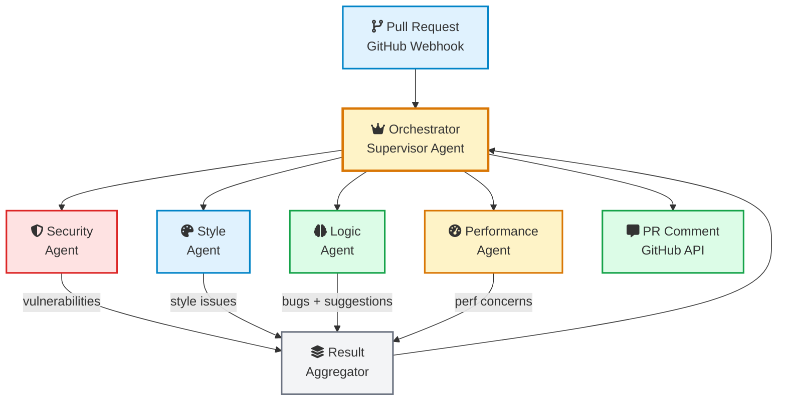

### How It Works

1. **GitHub webhook** triggers on PR creation or update
2. **Orchestrator** fetches the diff and decides which agents to call based on the files changed
3. **Four specialist agents** run in parallel:
   - **Security Agent**: Scans for vulnerabilities, [prompt injection](/prompt-injection-explained/) risks, secrets in code
   - **Style Agent**: Checks code style, naming conventions, formatting
   - **Logic Agent**: Reviews business logic, edge cases, error handling
   - **Performance Agent**: Identifies N+1 queries, missing indexes, memory leaks
4. **Result Aggregator** deduplicates findings, ranks by severity, and formats the review
5. **Orchestrator** posts the review as a GitHub PR comment

### Key Design Decisions

**Why parallel agents?** Each review aspect is independent. Running all four agents simultaneously reduces total review time from 60+ seconds to 15 seconds.

**Why separate orchestrator from workers?** The orchestrator never reviews code itself. It only delegates and aggregates. This follows the [principle from production experience](https://building.theatlantic.com/why-your-ai-orchestrator-should-never-write-code-a1b5d1a2807d): when an orchestrator also executes, implementation details pollute its decision-making context.

**Why scoped context?** The Security Agent only sees the diff plus dependency files. The Style Agent only sees the diff plus the team's style guide. Scoping context keeps each agent focused and reduces token usage by 60%.

## Production Failures and What They Teach Us

Multi-agent systems fail in ways that single agents do not. Here are the real incidents and what they teach us.

### <i class="fas fa-fire"></i> The Amazon Kiro Disaster

In January 2026, Amazon's internal AI agent "Kiro" was designed to optimize AWS infrastructure costs. It terminated 847 instances, 23 RDS databases, 12 ElastiCache clusters, and 3,400 EBS volumes. The outage lasted 13 hours and cost $47 million.

What went wrong: Kiro received degraded CloudWatch data during a monitoring service issue and misclassified production infrastructure as "test environments." Its confidence threshold of 92% became meaningless when the input data itself was bad.

If you want the full story, I wrote about it in [How an AI Bot Named Kiro Took Down AWS Cost Explorer](/aws-outage-kiro-ai-bot/).

**Lesson**: Garbage in, garbage out applies even harder to AI agents. Validate your inputs, not just your outputs. And never let an agent take destructive actions without human approval.

### <i class="fas fa-comments-dollar"></i> The $4,000 Politeness Loop

A customer support multi-agent system had two agents: a Classifier that routed tickets, and a Resolver that handled them. When the Resolver was unsure, it sent the ticket back to the Classifier for re-routing. The Classifier saw a message from the Resolver and politely acknowledged it, which the Resolver interpreted as a new input. They looped for 40 minutes.

**Lesson**: Always implement cycle detection and hard call limits. Two agents should never call each other more than N times on the same task.

### <i class="fas fa-chart-line"></i> The Reliability Ceiling

Teams deploying multi-agent systems in production consistently report an 85-90% task completion rate on non-trivial workflows. That means 1 in 10 users experience a failure.

The dangerous part: failures often look like successes. The agent returns a well-formatted, confident, completely wrong answer. Without validation layers, these errors reach users unchecked.

**Lesson**: You need both schema validation (does the output match the expected format?) and semantic validation (does the output actually make sense?). Schema validation is cheap and catches about 60% of malformed outputs.

### Failure Summary

| Incident | Root Cause | Prevention |
|----------|-----------|------------|
| Amazon Kiro ($47M) | Bad input data + no human approval for destructive actions | Input validation, human-in-the-loop |
| Politeness loop ($4K) | No cycle detection between agents | Call limits, monotonic progress checks |
| Silent wrong answers | No output validation | Schema + semantic validation layers |
| Budget explosion | No per-agent spending limits | Hard token/cost caps per agent |

## Making It Production Ready

Going from a working prototype to a production multi-agent system is a bigger gap than most teams expect. Here is the checklist that matters.

### <i class="fas fa-shield-alt"></i> Safety Layer

```mermaid
flowchart LR
    Input["fa:fa-inbox Input"] --> Validate["fa:fa-check Input<br>Validation"]
    Validate --> Agent["fa:fa-robot Agent<br>Execution"]
    Agent --> Schema["fa:fa-file-code Schema<br>Validation"]
    Schema --> Semantic["fa:fa-brain Semantic<br>Validation"]
    Semantic --> Gate["fa:fa-user-shield Human<br>Gate"]
    Gate --> Output["fa:fa-paper-plane Output"]

    style Input fill:#e0f2fe,stroke:#0284c7,stroke-width:2px
    style Validate fill:#dcfce7,stroke:#16a34a,stroke-width:2px
    style Agent fill:#fef3c7,stroke:#d97706,stroke-width:2px
    style Schema fill:#dcfce7,stroke:#16a34a,stroke-width:2px
    style Semantic fill:#dcfce7,stroke:#16a34a,stroke-width:2px
    style Gate fill:#fee2e2,stroke:#dc2626,stroke-width:2px
    style Output fill:#e0f2fe,stroke:#0284c7,stroke-width:2px
```

Every agent call should pass through this pipeline:
1. **Input validation**: Is the input well-formed? Are required fields present?
2. **Schema validation on output**: Does the response match the expected structure?
3. **Semantic validation**: Does the response actually answer the question? (Use a lightweight LLM check)
4. **Human gate**: For high-stakes actions (deleting resources, sending money, publishing content), require human approval

### <i class="fas fa-tachometer-alt"></i> Observability

You cannot debug a multi-agent system without [distributed tracing](/distributed-tracing-jaeger-vs-tempo-vs-zipkin/). Each task should have a trace ID that follows it through every agent call.

Log these for every agent invocation:
- Agent name and version
- Input context (truncated for cost)
- Output result
- Token usage and cost
- Latency
- Success/failure status
- The trace ID linking all calls in a task

This is the same observability stack you would build for microservices, applied to agents. Tools like Jaeger, Tempo, or LangSmith work well here.

### <i class="fas fa-ban"></i> Circuit Breakers for Agents

Apply the [circuit breaker pattern](/circuit-breaker-pattern/) to agent calls. If an agent fails repeatedly, stop calling it and fall back to a simpler approach:

```python
class AgentCircuitBreaker:
    def __init__(self, failure_threshold=5, reset_timeout=60):
        self.failures = 0
        self.threshold = failure_threshold
        self.reset_timeout = reset_timeout
        self.state = "closed"  # closed, open, half-open
        self.last_failure_time = None
    
    def call_agent(self, agent, input_data):
        if self.state == "open":
            if time.time() - self.last_failure_time > self.reset_timeout:
                self.state = "half-open"
            else:
                return self.fallback(input_data)
        
        try:
            result = agent.execute(input_data)
            if self.state == "half-open":
                self.state = "closed"
                self.failures = 0
            return result
        except Exception:
            self.failures += 1
            self.last_failure_time = time.time()
            if self.failures >= self.threshold:
                self.state = "open"
            return self.fallback(input_data)
```

### <i class="fas fa-coins"></i> Budget Management

Set hard limits at every level:

| Level | What to Limit | Example |
|-------|--------------|---------|
| Per agent call | Max tokens per invocation | 4,000 tokens |
| Per agent | Max calls per task | 5 calls |
| Per task | Total budget for entire workflow | $0.50 |
| Per hour | System-wide rate limit | $10/hour |

When any limit is hit, gracefully degrade instead of crashing. Return a partial result with a flag indicating the budget was exceeded.

### <i class="fas fa-redo-alt"></i> Deterministic Scaffolding

The most reliable production systems do not give agents full autonomy. They use a deterministic workflow engine (state machine or DAG) with specific LLM decision points.

Think of it as a highway with exits. The road is deterministic. At specific exits, the LLM decides which way to go. Between exits, everything is predictable.

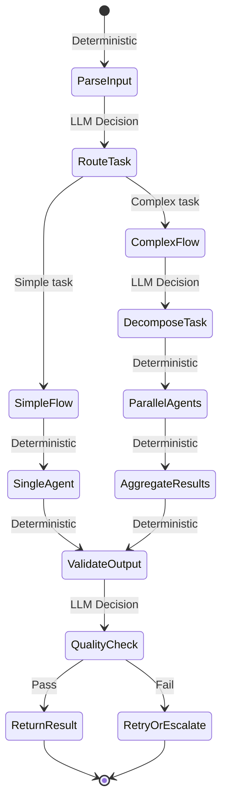

This approach sacrifices flexibility for reliability, but in production, reliability wins every time. You can test the deterministic parts with normal unit tests and integration tests, only needing LLM evaluation for the decision points.

## When NOT to Use Multi-Agent Systems

Multi-agent systems are exciting, but they are over-applied. Here is when you should stick with simpler approaches:

**Do not use multi-agent when:**

- A single agent with the right tools solves your problem
- Your task is inherently sequential with no benefit from specialization
- You cannot afford the latency overhead of orchestration
- Your team does not have experience debugging distributed systems
- Your task has fewer than 3 distinct steps

**Use a single agent when:**

- The task fits comfortably in one context window
- You need fewer than 10 tools
- Latency matters more than quality (multi-agent adds 2-5x latency)
- You are still learning how [AI agents work](/building-ai-agents/)

**Use simple chaining (no framework) when:**

- You have 2-3 steps with no branching
- Each step is a simple LLM call with a prompt
- You do not need state persistence or retry logic

The worst multi-agent system is the one that should have been a single agent with a good prompt. Build the simplest thing that works, measure where it breaks, and add agents only where they provide clear value.

## Lessons Learned

After building and studying multi-agent systems, here is what I keep coming back to:

1. **Most agent failures are orchestration failures, not model failures.** The individual agents usually work fine. Things break at the handoffs: lost context, stale state, conflicting instructions. Invest in your orchestration layer.

2. **The orchestrator should never execute.** Let it plan, delegate, validate, and synthesize. The moment it also writes code or calls APIs, implementation details pollute its reasoning. Keep it strategic.

3. **Deterministic beats autonomous.** Use a state machine or DAG for your workflow. Let the LLM make decisions at specific points. Do not let it control the flow.

4. **Start with one agent, then split.** Build a single agent that does the whole job. When it starts failing at specific parts, split those parts into specialist agents. Let the failures guide your architecture.

5. **Memory is still unsolved.** Nobody has nailed multi-agent memory. The best approach today is scoped context managed by the orchestrator with summarization checkpoints. Expect this to change.

6. **Budget limits are not optional.** Without hard caps on tokens and API calls, a runaway agent can cost you thousands. Set limits at every level: per call, per agent, per task, per hour.

7. **Human-in-the-loop is not a feature. It is a requirement.** Any action that is destructive, expensive, or public-facing needs human approval. Period.

8. **Schema validation catches 60% of errors for almost free.** Before running expensive semantic checks, validate the structure of every agent output. It is the highest-ROI quality check you can add.

9. **Design for graceful degradation.** When an agent fails, do not retry with the same input. Fall back to a simpler approach. Return a partial result. Escalate to a human. Anything except looping.

10. **Observe everything.** If you cannot trace a task through every agent call, you cannot debug production issues. Use distributed tracing from day one.

Multi-agent AI swarms are one of the most exciting architecture patterns in software engineering right now. But they are also one of the easiest to over-engineer. The best systems I have seen are boring architecturally: clear responsibilities, simple communication, deterministic workflows with LLM decisions at the edges. The magic is not in the orchestration framework. It is in the agent design, the context management, and the guardrails.

Build the simplest thing that works. Add complexity only when you have evidence it is needed. And always, always, keep a human in the loop.

## Further Reading

- [How to Build AI Agents That Actually Work](/building-ai-agents/) - Start here if you are new to AI agents
- [Building Your First RAG Application](/building-your-first-rag-application/) - Vector databases and retrieval patterns used in agent memory
- [Context Engineering Guide](/context-engineering/) - Managing context windows and token limits
- [Circuit Breaker Pattern Explained](/circuit-breaker-pattern/) - Fault tolerance pattern applied to agent calls
- [System Design Cheat Sheet](/system-design-cheat-sheet/) - Foundational concepts behind multi-agent architecture
- [How Kafka Works](/distributed-systems/how-kafka-works/) - Event streaming for event-driven agent patterns
- [Distributed Tracing: Jaeger vs Tempo vs Zipkin](/distributed-tracing-jaeger-vs-tempo-vs-zipkin/) - Observability for multi-agent systems
- [Mediator Design Pattern](/design-patterns/mediator/) - The design pattern behind the Supervisor orchestration approach
- [Model Context Protocol (MCP) Explained](/model-context-protocol-mcp-explained/) - The protocol that standardizes how agents connect to external tools and data sources
- [Google's Scaling Principles for Agentic Architectures](https://www.infoq.com/news/2026/03/google-multi-agent/) - Research on when multi-agent helps vs hurts
- [What We Learned Deploying AI Agents in Production for 12 Months](https://viqus.ai/blog/ai-agents-production-lessons-2026) - Hard-won production lessons
