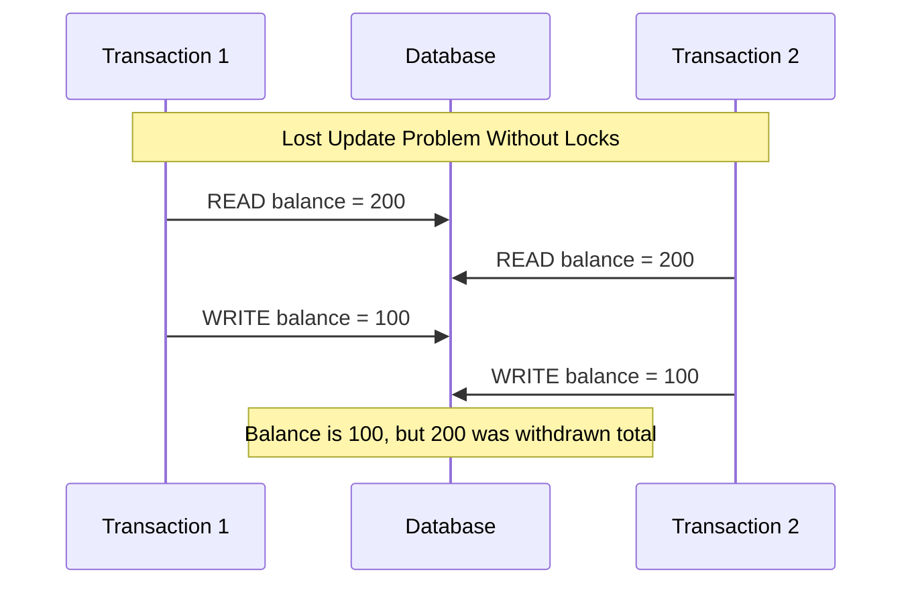
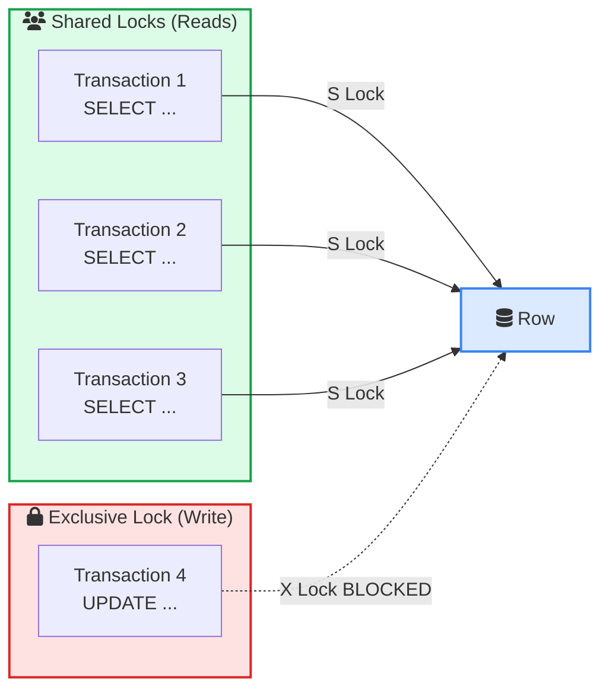
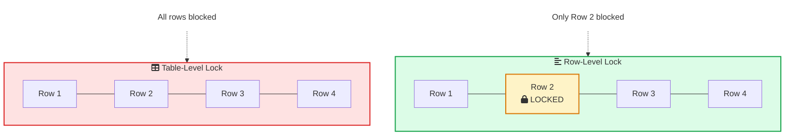
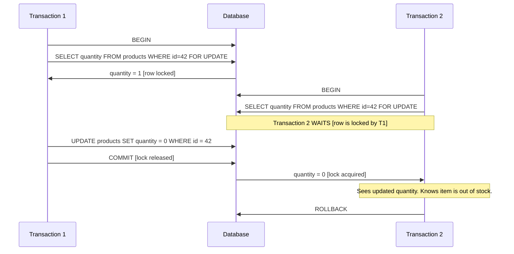
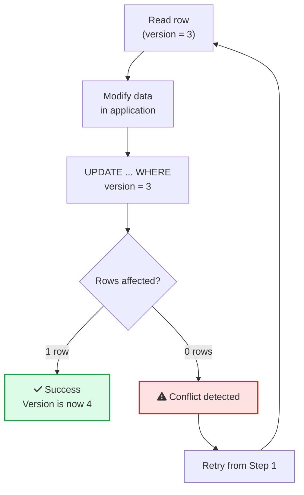
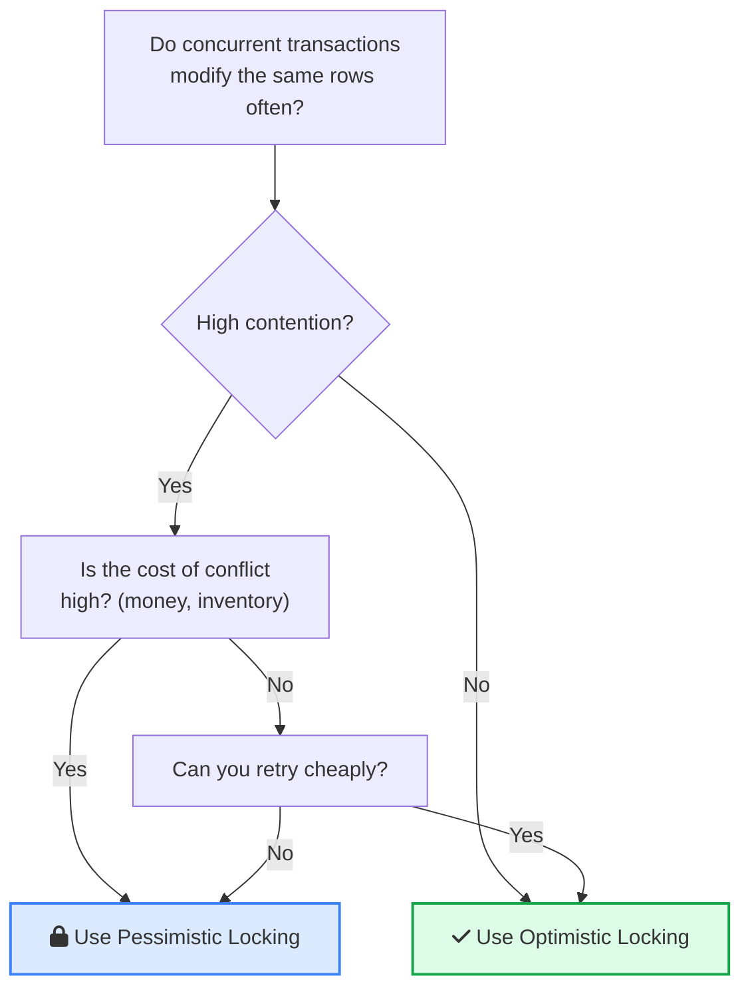
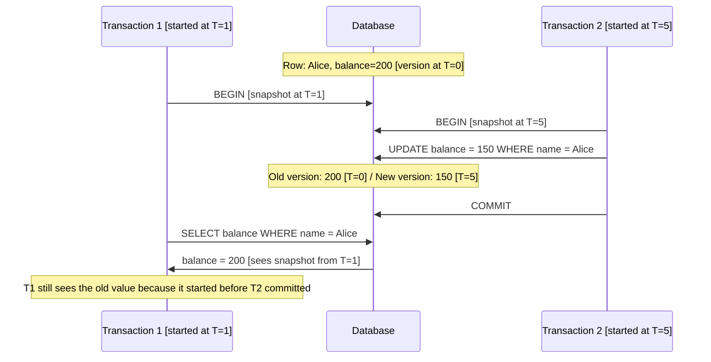
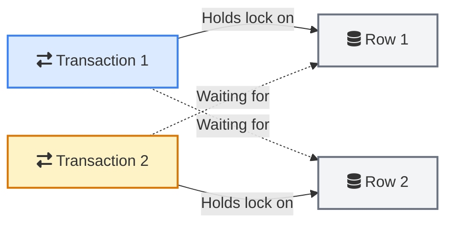
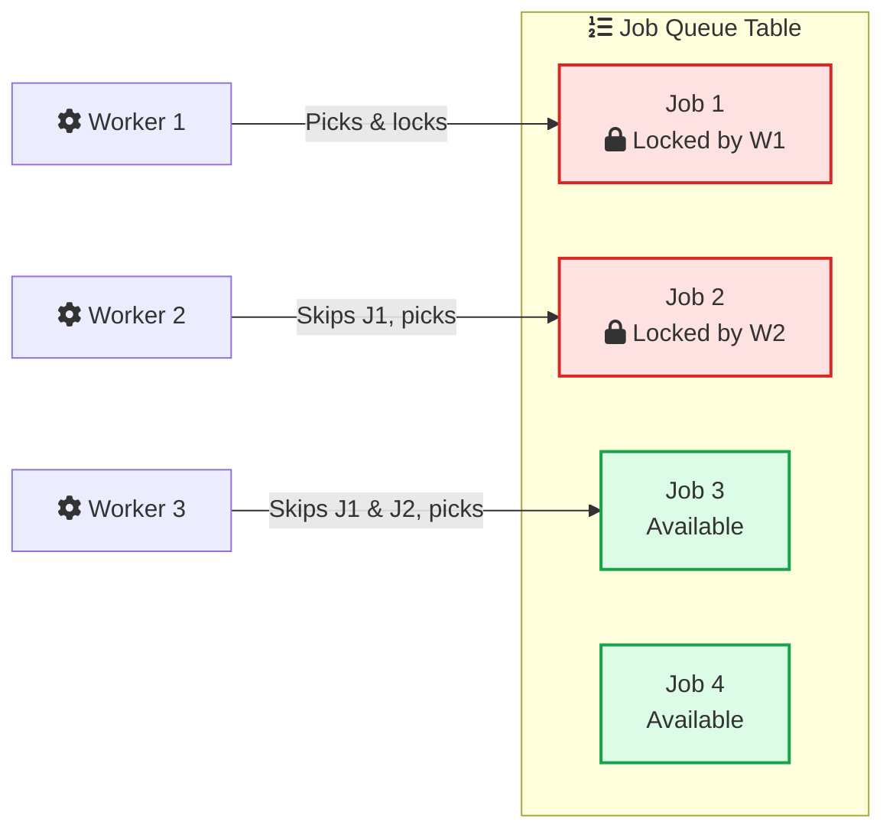

Two users click "Buy" on the last item in stock at the same time. Both transactions read the inventory count as 1. Both decrement it to 0. Both succeed. You just sold an item you do not have.

This is not a hypothetical. It happens in production every day. The fix? Database locks.

Locks are how databases keep concurrent transactions from stomping on each other. But most developers treat locking as a black box. They know locks exist. They have seen deadlock errors. They have no idea what is actually happening under the hood.

This guide covers everything a software developer needs to know about database locks. How they work, when the database grabs them automatically, how to use them explicitly, and how to avoid the problems they cause when used badly.

> **TL;DR**: Databases use **shared locks** (reads) and **exclusive locks** (writes) to manage concurrent access. Lock granularity ranges from row-level to table-level. **Pessimistic locking** grabs locks upfront with `SELECT FOR UPDATE`. **Optimistic locking** checks for conflicts at commit time using version columns. **MVCC** lets readers work without blocking writers. **Deadlocks** happen when transactions wait on each other in a cycle. Keep transactions short, lock in consistent order, and use the right locking strategy for your workload.

## Table of Contents

- [Why Locks Exist](#why-locks-exist)
- [Lock Types: Shared vs Exclusive](#lock-types-shared-vs-exclusive)
- [Lock Granularity: Row vs Page vs Table](#lock-granularity-row-vs-page-vs-table)
- [Intent Locks: The Signaling System](#intent-locks-the-signaling-system)
- [How Databases Acquire Locks Automatically](#how-databases-acquire-locks-automatically)
- [Pessimistic Locking: SELECT FOR UPDATE](#pessimistic-locking-select-for-update)
- [Optimistic Locking: Version Columns](#optimistic-locking-version-columns)
- [Optimistic vs Pessimistic: When to Use Which](#optimistic-vs-pessimistic-when-to-use-which)
- [MVCC: How Modern Databases Avoid Locking](#mvcc-how-modern-databases-avoid-locking)
- [Deadlocks: The Circular Wait Problem](#deadlocks-the-circular-wait-problem)
- [Lock Escalation](#lock-escalation)
- [SKIP LOCKED and NOWAIT](#skip-locked-and-nowait)
- [Advisory Locks](#advisory-locks)
- [Gap Locks and Next-Key Locks (MySQL)](#gap-locks-and-next-key-locks-mysql)
- [Debugging Lock Problems in Production](#debugging-lock-problems-in-production)
- [Practical Rules for Working with Locks](#practical-rules-for-working-with-locks)
- [Further Reading](#further-reading)

---

## Why Locks Exist

The fundamental problem is simple: multiple transactions accessing the same data at the same time.

Without locks, you get three classic problems:

| Problem | What Happens | Example |
|---------|-------------|---------|
| **Lost Update** | Two transactions read the same value, both modify it, second write overwrites the first | Two users withdraw $100 from a $200 balance. Both read $200. Both write $100. Final balance: $100 instead of $0 |
| **Dirty Read** | A transaction reads data that another transaction has not committed yet | You read an order total while another transaction is still adding items. You see an incomplete total |
| **Non-repeatable Read** | You read the same row twice in a transaction and get different values | You check inventory, start processing, check again, and the count changed because someone else bought it |

Locks prevent these by controlling who can read and write what, and when. If you have worked with [database indexing](/database-indexing-explained/), you know how the database organizes data for fast reads. Locks are the other half of that story: they organize access for safe writes.



With proper locking, the second transaction would wait until the first one commits, then read the updated balance.

---

## Lock Types: Shared vs Exclusive

Every database lock boils down to two fundamental types.

### <i class="fas fa-users"></i> Shared Lock (S Lock / Read Lock)

A shared lock says: "I am reading this data. Others can read it too, but nobody can modify it while I am reading."

- Multiple transactions **can** hold shared locks on the same row
- A shared lock **blocks** exclusive locks (writes)
- A shared lock **does not block** other shared locks (reads)

### <i class="fas fa-lock"></i> Exclusive Lock (X Lock / Write Lock)

An exclusive lock says: "I am modifying this data. Nobody else can read or write it until I am done."

- Only **one** transaction can hold an exclusive lock on a row
- An exclusive lock **blocks** both shared and exclusive locks
- The lock is held until the transaction commits or rolls back

Here is the compatibility matrix:

| | Shared (S) | Exclusive (X) |
|---|---|---|
| **Shared (S)** | <i class="fas fa-check" style="color: #16a34a;"></i> Compatible | <i class="fas fa-times" style="color: #dc2626;"></i> Conflict |
| **Exclusive (X)** | <i class="fas fa-times" style="color: #dc2626;"></i> Conflict | <i class="fas fa-times" style="color: #dc2626;"></i> Conflict |

This is the foundation. Everything else in database locking builds on these two types.



In practice, modern databases with [MVCC](#mvcc-how-modern-databases-avoid-locking) relax this. In PostgreSQL, a plain `SELECT` does not acquire a shared lock. It reads from a snapshot instead. But the conceptual model still matters for understanding `SELECT FOR UPDATE`, `SELECT FOR SHARE`, and explicit locking.

---

## Lock Granularity: Row vs Page vs Table

Lock granularity is about scope. How much data does a single lock protect?

| Granularity | Locks | Concurrency | Lock Overhead |
|-------------|-------|-------------|---------------|
| **Table-level** | Entire table | Low | Low |
| **Page-level** | An 8KB or 16KB page | Medium | Medium |
| **Row-level** | A single row | High | High |

### <i class="fas fa-table"></i> Table-Level Locks

Locking the whole table. Simple, cheap to manage, but terrible for concurrency.

```sql
-- PostgreSQL: explicit table lock
LOCK TABLE orders IN ACCESS EXCLUSIVE MODE;

-- MySQL: explicit table lock
LOCK TABLES orders WRITE;
```

Use cases:
- Schema changes (`ALTER TABLE`)
- Bulk operations where you know nobody else should be touching the table
- Maintenance operations like `VACUUM FULL` in PostgreSQL

Most applications should never need explicit table locks. If you find yourself reaching for one, you are probably doing something wrong.

### <i class="fas fa-th"></i> Page-Level Locks

Some databases lock at the page level. A page is typically an 8KB or 16KB chunk of data containing multiple rows. SQL Server uses page-level locks as an intermediate between row and table locks.

If you are not familiar with database pages, check out [How Databases Store Data Internally](/how-databases-store-data-internally/) for a deep dive into pages, B-trees, and buffer pools.

### <i class="fas fa-align-left"></i> Row-Level Locks

Row-level locking gives the best concurrency. Only the specific row being modified is locked. Other transactions can freely read and write other rows in the same table.

PostgreSQL and MySQL InnoDB both default to row-level locking for DML operations (`INSERT`, `UPDATE`, `DELETE`).

```sql
-- These statements automatically acquire row-level exclusive locks
UPDATE accounts SET balance = balance - 100 WHERE id = 42;
DELETE FROM sessions WHERE expired_at < NOW();
```

The trade-off: managing thousands of individual row locks takes more memory and CPU than a single table lock. This is why [lock escalation](#lock-escalation) exists.



---

## Intent Locks: The Signaling System

Intent locks solve an efficiency problem. Imagine you want to lock an entire table. How do you know if any row in that table already has a lock?

Without intent locks, you would have to scan every row to check. That is expensive.

Intent locks work like a signaling system. When a transaction acquires a row-level lock, the database also places an intent lock on the table. This tells other transactions: "someone has row-level locks inside this table."

| Intent Lock | Meaning |
|-------------|---------|
| **Intent Shared (IS)** | A transaction holds or is about to acquire shared locks on rows |
| **Intent Exclusive (IX)** | A transaction holds or is about to acquire exclusive locks on rows |

Now, when another transaction wants a table-level lock, it just checks the table's intent lock instead of scanning all rows.

| | IS | IX | S | X |
|---|---|---|---|---|
| **IS** | <i class="fas fa-check" style="color: #16a34a;"></i> | <i class="fas fa-check" style="color: #16a34a;"></i> | <i class="fas fa-check" style="color: #16a34a;"></i> | <i class="fas fa-times" style="color: #dc2626;"></i> |
| **IX** | <i class="fas fa-check" style="color: #16a34a;"></i> | <i class="fas fa-check" style="color: #16a34a;"></i> | <i class="fas fa-times" style="color: #dc2626;"></i> | <i class="fas fa-times" style="color: #dc2626;"></i> |
| **S** | <i class="fas fa-check" style="color: #16a34a;"></i> | <i class="fas fa-times" style="color: #dc2626;"></i> | <i class="fas fa-check" style="color: #16a34a;"></i> | <i class="fas fa-times" style="color: #dc2626;"></i> |
| **X** | <i class="fas fa-times" style="color: #dc2626;"></i> | <i class="fas fa-times" style="color: #dc2626;"></i> | <i class="fas fa-times" style="color: #dc2626;"></i> | <i class="fas fa-times" style="color: #dc2626;"></i> |

Two transactions with intent exclusive locks on the same table is fine. They might be locking different rows. The intent lock just signals that row-level locks exist inside the table.

---

## How Databases Acquire Locks Automatically

You do not need to call any locking functions for basic operations. The database handles it.

| SQL Statement | Lock Acquired |
|--------------|---------------|
| `SELECT` | No lock (MVCC snapshot) in PostgreSQL/MySQL InnoDB |
| `SELECT FOR SHARE` | Shared row lock |
| `SELECT FOR UPDATE` | Exclusive row lock |
| `INSERT` | Exclusive row lock on new row |
| `UPDATE` | Exclusive row lock on affected rows |
| `DELETE` | Exclusive row lock on affected rows |
| `ALTER TABLE` | Table-level lock (blocks everything) |
| `CREATE INDEX CONCURRENTLY` | Weaker table lock (allows reads and writes) |

The key insight: in modern databases using MVCC, a plain `SELECT` does not block and is not blocked by anything. This is why PostgreSQL and MySQL handle mixed read/write workloads so well.

But the moment you use `SELECT FOR UPDATE`, `UPDATE`, or `DELETE`, you are in lock territory.

---

## Pessimistic Locking: SELECT FOR UPDATE

Pessimistic locking assumes the worst. "Someone else is probably going to modify this data while I am working with it, so I will lock it first."

The tool for this is `SELECT FOR UPDATE`.

### The Classic Inventory Problem

```sql
-- Without locking (broken)
BEGIN;
SELECT quantity FROM products WHERE id = 42;
-- Application checks: quantity >= 1, proceed
UPDATE products SET quantity = quantity - 1 WHERE id = 42;
COMMIT;
```

The problem: between the `SELECT` and the `UPDATE`, another transaction can read the same quantity and also decrement it. You sell two items when you only had one.

```sql
-- With pessimistic locking (correct)
BEGIN;
SELECT quantity FROM products WHERE id = 42 FOR UPDATE;
-- Row is now locked. Other transactions wait here.
-- Application checks: quantity >= 1, proceed
UPDATE products SET quantity = quantity - 1 WHERE id = 42;
COMMIT;
```

The `FOR UPDATE` clause acquires an exclusive row-level lock. Any other transaction trying to `SELECT FOR UPDATE`, `UPDATE`, or `DELETE` that row will block until this transaction completes.



### FOR SHARE: The Read Lock

If you only need to prevent modifications but want to allow other readers:

```sql
SELECT * FROM products WHERE id = 42 FOR SHARE;
```

This acquires a shared lock. Other `FOR SHARE` queries succeed, but `FOR UPDATE`, `UPDATE`, and `DELETE` will block. Use this when you need to ensure data does not change while you read it, but you do not plan to modify it yourself.

### When to Use Pessimistic Locking

- Financial transactions (transfers, payments, balance updates)
- Inventory management (stock decrements)
- Seat reservations (booking systems)
- Any scenario where conflicts are likely and the cost of a conflict is high

If you are building a [ticket booking system](/ticket-booking-system-design/) or payment flow, pessimistic locking is usually the right choice.

---

## Optimistic Locking: Version Columns

Optimistic locking takes the opposite approach. "Conflicts are unlikely, so I will just go ahead and check at the end."

No database locks are acquired. Instead, you add a `version` column (or `updated_at` timestamp) to your table and check it at commit time.

### How It Works

```sql
-- Step 1: Read the row and its version
SELECT id, name, email, version
FROM users WHERE id = 42;
-- Returns: id=42, name='Alice', email='alice@example.com', version=3
```

```sql
-- Step 2: Update, but only if the version has not changed
UPDATE users
SET email = 'newalice@example.com', version = version + 1
WHERE id = 42 AND version = 3;
```

If another transaction modified the row between your read and write, the version will have changed. Your `UPDATE` will affect 0 rows. Your application checks the row count and retries.



### Implementation in Application Frameworks

Most ORMs have built-in optimistic locking:

**JPA / Hibernate (Java)**:
```java
@Entity
public class Product {
    @Id
    private Long id;
    private String name;

    @Version
    private Integer version;
}
```

**Django (Python)**:
```python
# Using django-concurrency or manual implementation
updated = Product.objects.filter(
    id=42, version=3
).update(
    name='New Name',
    version=F('version') + 1
)
if updated == 0:
    raise ConflictError("Row was modified by another transaction")
```

**Rails (Ruby)**:
```ruby
# Add lock_version column (integer) to your model
# Rails handles the rest automatically
product = Product.find(42)
product.name = "New Name"
product.save!  # Raises ActiveRecord::StaleObjectError on conflict
```

### When to Use Optimistic Locking

- CMS and content editing (multiple editors, rare simultaneous edits)
- User profile updates
- Configuration changes
- Any scenario where conflicts are rare and retries are cheap

---

## Optimistic vs Pessimistic: When to Use Which

This is the question that comes up in every design discussion. Here is the practical answer:

| Factor | Pessimistic | Optimistic |
|--------|------------|------------|
| **Conflict frequency** | High (many writes to same data) | Low (reads dominate, writes rarely collide) |
| **Cost of conflict** | High (payment, inventory) | Low (can retry cheaply) |
| **Transaction duration** | Short | Short to medium |
| **Throughput** | Lower (blocking) | Higher (no blocking) |
| **Deadlock risk** | Yes | No |
| **Retry logic needed** | No | Yes |
| **SQL example** | `SELECT FOR UPDATE` | `UPDATE WHERE version = N` |



A practical rule: if you are dealing with money or inventory, start with pessimistic locking. For everything else, try optimistic first and switch to pessimistic if you see too many retries.

---

## MVCC: How Modern Databases Avoid Locking

Multi-Version Concurrency Control (MVCC) is the reason modern databases perform so well under mixed read/write workloads. Instead of making readers wait for writers (or vice versa), MVCC keeps multiple versions of each row.

### How MVCC Works

When a transaction updates a row, the database does not overwrite the old data. It creates a new version of the row. Other transactions that started before the update still see the old version. Transactions that start after the update see the new version.



The key benefit: **readers never block writers. Writers never block readers.**

This is why a plain `SELECT` in PostgreSQL or MySQL InnoDB does not acquire any locks and does not wait for concurrent writes to complete.

### MVCC in PostgreSQL vs MySQL

| Aspect | PostgreSQL | MySQL InnoDB |
|--------|-----------|-------------|
| **Storage** | Old row versions stored in the main table (heap) | Old versions stored in undo log (separate space) |
| **Cleanup** | VACUUM process removes dead tuples | Purge thread cleans undo log |
| **Bloat risk** | Yes, if VACUUM falls behind | Lower, undo log is separate |
| **Transaction IDs** | xmin/xmax per row | Transaction ID + undo pointers |

PostgreSQL keeps old row versions in the same table, which can cause table bloat if [VACUUM does not keep up](/postgresql-cheat-sheet/#performance-and-troubleshooting). MySQL InnoDB stores old versions in a separate undo log, which avoids bloat in the main data but adds complexity.

### MVCC Does Not Eliminate All Locks

MVCC handles the read side. But writes still need exclusive locks. Two transactions trying to `UPDATE` the same row at the same time will still block. MVCC just means that while one transaction is updating, other transactions can still read the row (they see the old version).

Think of MVCC and locks as complementary systems:
- **MVCC**: Handles read-write concurrency (no blocking)
- **Locks**: Handle write-write concurrency (blocking required)

---

## Deadlocks: The Circular Wait Problem

A deadlock happens when two or more transactions are each waiting for the other to release a lock. Neither can proceed. The system is stuck.

### The Classic Deadlock

```sql
-- Transaction 1
BEGIN;
UPDATE accounts SET balance = balance - 100 WHERE id = 1;  -- Locks row 1
UPDATE accounts SET balance = balance + 100 WHERE id = 2;  -- Waits for row 2

-- Transaction 2 (running at the same time)
BEGIN;
UPDATE accounts SET balance = balance - 50 WHERE id = 2;   -- Locks row 2
UPDATE accounts SET balance = balance + 50 WHERE id = 1;   -- Waits for row 1
```

Transaction 1 holds the lock on row 1 and waits for row 2. Transaction 2 holds the lock on row 2 and waits for row 1. Circular dependency. Deadlock.



### How Databases Handle Deadlocks

Every modern database has a deadlock detector that runs periodically (or on every lock wait). When it finds a cycle in the wait graph, it picks one transaction as the "victim" and rolls it back, allowing the other transactions to proceed.

| Database | Detection Method | What Happens |
|----------|-----------------|-------------|
| PostgreSQL | Checks on every lock wait | Rolls back the transaction that was waiting |
| MySQL InnoDB | Runs continuously | Rolls back the transaction with the fewest changes (cheapest to undo) |
| SQL Server | Background thread every 5 seconds | Rolls back the least costly transaction |

The killed transaction gets an error:

```
-- PostgreSQL
ERROR: deadlock detected
DETAIL: Process 1234 waits for ShareLock on transaction 5678;
blocked by process 9012.

-- MySQL
ERROR 1213 (40001): Deadlock found when trying to get lock;
try restarting transaction
```

### How to Prevent Deadlocks

**1. Always acquire locks in a consistent order**

If every transaction locks account 1 before account 2, deadlocks between those rows become impossible.

```sql
-- Both transactions should lock in the same order (lower ID first)
BEGIN;
UPDATE accounts SET balance = balance - 100 WHERE id = LEAST(1, 2);
UPDATE accounts SET balance = balance + 100 WHERE id = GREATEST(1, 2);
COMMIT;
```

**2. Keep transactions short**

The longer a transaction runs, the longer it holds locks, and the more likely it is to collide with another transaction.

```sql
-- Bad: long transaction holding locks
BEGIN;
UPDATE products SET quantity = quantity - 1 WHERE id = 42;
-- ... application does external API call here (5 seconds) ...
-- ... locks held the entire time ...
COMMIT;

-- Better: do the slow work outside the transaction
-- Validate externally, then run a short transaction
BEGIN;
UPDATE products SET quantity = quantity - 1 WHERE id = 42;
COMMIT;
```

**3. Use lock timeouts**

```sql
-- PostgreSQL: wait at most 5 seconds for a lock
SET lock_timeout = '5s';

-- MySQL: wait at most 5 seconds
SET innodb_lock_wait_timeout = 5;
```

If the lock is not acquired within the timeout, the statement fails instead of waiting indefinitely.

**4. Reduce the scope of locks**

Lock only what you need. If you need to update two tables, try to design your application so it does not need to lock both at the same time.

---

## Lock Escalation

Lock escalation is when the database automatically converts many fine-grained locks (row locks) into a single coarse-grained lock (table lock). This saves memory but kills concurrency.

### How Lock Escalation Works

Every row lock consumes memory. If a transaction locks 20,000 rows, that is 20,000 lock objects the database has to track. At some point, it is cheaper to just lock the whole table.

| Database | Escalation Behavior |
|----------|-------------------|
| **SQL Server** | Escalates to table lock after ~5,000 row locks |
| **PostgreSQL** | No lock escalation. Row locks always stay as row locks |
| **MySQL InnoDB** | No lock escalation. Uses row-level locking only |

This is one of the areas where PostgreSQL and MySQL have an advantage over SQL Server for concurrent workloads. No lock escalation means a large `UPDATE` that touches thousands of rows will not suddenly lock the entire table and block everyone.

If you are on SQL Server and hit lock escalation problems:

```sql
-- Disable lock escalation on a specific table
ALTER TABLE orders SET (LOCK_ESCALATION = DISABLE);

-- Or break large operations into smaller batches
-- Instead of: DELETE FROM logs WHERE created_at < '2025-01-01'
-- Do:
WHILE EXISTS (SELECT 1 FROM logs WHERE created_at < '2025-01-01')
    DELETE TOP (1000) FROM logs WHERE created_at < '2025-01-01';
```

---

## SKIP LOCKED and NOWAIT

These are two options for `SELECT FOR UPDATE` that change what happens when a row is already locked.

### <i class="fas fa-forward"></i> SKIP LOCKED: Build a Job Queue in Your Database

By default, `SELECT FOR UPDATE` waits when it hits a locked row. `SKIP LOCKED` tells it to skip locked rows and return only unlocked ones.

This is incredibly useful for building job queues:

```sql
-- Worker 1
BEGIN;
SELECT id, payload FROM jobs
WHERE status = 'pending'
ORDER BY created_at
FOR UPDATE SKIP LOCKED
LIMIT 1;
-- Gets job #1 (locks it)
-- Process the job...
UPDATE jobs SET status = 'completed' WHERE id = 1;
COMMIT;
```

```sql
-- Worker 2 (running at the same time)
BEGIN;
SELECT id, payload FROM jobs
WHERE status = 'pending'
ORDER BY created_at
FOR UPDATE SKIP LOCKED
LIMIT 1;
-- Skips job #1 (locked), gets job #2
-- Process the job...
UPDATE jobs SET status = 'completed' WHERE id = 2;
COMMIT;
```

Each worker gets a different job. No race conditions. No duplicate processing. No external queue system needed.



This pattern is used by popular job queue libraries like Que (Ruby), Oban (Elixir), and river (Go). It works well for moderate job volumes. For high-throughput job processing, a dedicated [message queue](/role-of-queues-in-system-design/) is usually better.

### <i class="fas fa-exclamation-circle"></i> NOWAIT: Fail Instead of Wait

`NOWAIT` tells the query to fail immediately if any row is locked, instead of waiting.

```sql
BEGIN;
SELECT * FROM products WHERE id = 42 FOR UPDATE NOWAIT;
-- If the row is locked, this fails immediately with:
-- ERROR: could not obtain lock on row in relation "products"
```

Use `NOWAIT` in user-facing APIs where you would rather return an error than let a request hang. If a user's request would block on a lock, it is better to tell them to try again than to have them stare at a loading spinner.

---

## Advisory Locks

Advisory locks in PostgreSQL are a different animal. They do not lock any actual rows or tables. They are purely application-level locks that your code uses for coordination.

### How They Work

Advisory locks use an arbitrary integer key. Your application decides what each key means.

```sql
-- Session-level advisory lock (held until you release or disconnect)
SELECT pg_advisory_lock(12345);
-- Do your work...
SELECT pg_advisory_unlock(12345);

-- Transaction-level advisory lock (released at COMMIT/ROLLBACK)
BEGIN;
SELECT pg_advisory_xact_lock(12345);
-- Do your work...
COMMIT;  -- Lock automatically released
```

### Non-Blocking Try

```sql
-- Returns true if lock acquired, false if already held by someone else
SELECT pg_try_advisory_lock(12345);
```

### Real-World Use Cases

**Preventing duplicate cron job execution:**

```sql
-- At the start of your cron job
SELECT pg_try_advisory_lock(hashtext('daily-report-job'));
-- Returns false if another instance is already running
```

**Serializing writes to an external system:**

```sql
-- Only one process at a time should push to the payment gateway
SELECT pg_advisory_xact_lock(hashtext('payment-gateway'));
-- Make the API call, record the result
COMMIT;
```

**Schema migrations:**

```sql
-- Prevent two deploy processes from running migrations simultaneously
SELECT pg_advisory_lock(hashtext('schema-migration'));
-- Run migrations...
SELECT pg_advisory_unlock(hashtext('schema-migration'));
```

Advisory locks are lightweight and do not have the overhead of locking actual table data. They are a powerful tool for coordinating application-level concerns. If you need distributed locking across multiple database connections, advisory locks are simpler than building your own locking table.

---

## Gap Locks and Next-Key Locks (MySQL)

MySQL InnoDB has a unique type of lock that PostgreSQL does not: gap locks.

### What is a Gap Lock?

A gap lock locks the "gap" between index records, not the records themselves. This prevents other transactions from inserting new rows into that gap.

```sql
-- Assume an orders table with ids: 10, 20, 30
BEGIN;
SELECT * FROM orders WHERE id BETWEEN 15 AND 25 FOR UPDATE;
-- In MySQL InnoDB, this locks:
-- 1. Row with id=20 (record lock)
-- 2. Gap between 10 and 20 (gap lock)
-- 3. Gap between 20 and 30 (gap lock)
```

Now another transaction cannot insert a row with `id = 12` or `id = 22`. The gaps are locked.

### Why Gap Locks Exist

Gap locks prevent **phantom reads** under the REPEATABLE READ isolation level (MySQL's default). A phantom read is when a transaction re-executes a range query and gets new rows that were inserted by another transaction.

| Isolation Level | Gap Locks? |
|----------------|-----------|
| READ UNCOMMITTED | No |
| READ COMMITTED | No |
| REPEATABLE READ | Yes (MySQL default) |
| SERIALIZABLE | Yes |

### Next-Key Locks

A next-key lock is a combination of a record lock and a gap lock. It locks the record itself plus the gap before it. This is MySQL InnoDB's default locking behavior for `SELECT FOR UPDATE` under REPEATABLE READ.

### Gap Lock Gotchas

Gap locks can cause unexpected blocking and deadlocks, especially with non-unique indexes. If your application does a lot of range-based `SELECT FOR UPDATE` queries and you are seeing unexpected lock waits, gap locks might be the cause.

If you do not need phantom read protection, switching to READ COMMITTED isolation level eliminates gap locks:

```sql
SET TRANSACTION ISOLATION LEVEL READ COMMITTED;
```

---

## Debugging Lock Problems in Production

Locks become a problem when they cause contention: transactions waiting too long for locks, or deadlocks killing transactions. Here is how to find and fix these issues.

### <i class="fas fa-search"></i> PostgreSQL: Finding Lock Contention

**See all current locks:**

```sql
SELECT
    pid,
    locktype,
    relation::regclass AS table_name,
    mode,
    granted,
    query
FROM pg_locks
JOIN pg_stat_activity USING (pid)
WHERE NOT granted
ORDER BY pid;
```

**Find which process is blocking which:**

```sql
SELECT
    blocked.pid AS blocked_pid,
    blocked.query AS blocked_query,
    blocking.pid AS blocking_pid,
    blocking.query AS blocking_query,
    now() - blocked.query_start AS blocked_duration
FROM pg_stat_activity blocked
JOIN pg_locks blocked_locks ON blocked.pid = blocked_locks.pid
JOIN pg_locks blocking_locks ON blocked_locks.locktype = blocking_locks.locktype
    AND blocked_locks.relation = blocking_locks.relation
    AND blocked_locks.pid != blocking_locks.pid
JOIN pg_stat_activity blocking ON blocking_locks.pid = blocking.pid
WHERE NOT blocked_locks.granted;
```

**Kill a blocking query:**

```sql
-- Try graceful cancel first
SELECT pg_cancel_backend(blocking_pid);

-- Force terminate if cancel does not work
SELECT pg_terminate_backend(blocking_pid);
```

For more PostgreSQL debugging queries, see the [PostgreSQL Cheat Sheet](/postgresql-cheat-sheet/#useful-monitoring-queries).

### <i class="fas fa-search"></i> MySQL: Finding Lock Contention

**Show current locks and waits:**

```sql
-- MySQL 8.0+
SELECT * FROM performance_schema.data_locks;
SELECT * FROM performance_schema.data_lock_waits;

-- Quick deadlock info
SHOW ENGINE INNODB STATUS\G
-- Look for the "LATEST DETECTED DEADLOCK" section
```

**Find long-running transactions holding locks:**

```sql
SELECT
    trx_id,
    trx_state,
    trx_started,
    TIMESTAMPDIFF(SECOND, trx_started, NOW()) AS duration_seconds,
    trx_query,
    trx_rows_locked
FROM information_schema.innodb_trx
ORDER BY trx_started;
```

### Common Lock Contention Patterns

| Problem | Symptom | Fix |
|---------|---------|-----|
| Long-running transaction | Many queries waiting on the same lock | Keep transactions short. Move slow operations outside the transaction |
| Missing index | `UPDATE` or `DELETE` locks more rows than needed (full table scan) | Add an [index](/database-indexing-explained/) on the WHERE clause column |
| Hot row | Many transactions update the same row (counters, queues) | Shard the counter, use atomic operations, or use a different data structure |
| Deadlock loop | Repeated deadlock errors in application logs | Lock rows in a consistent order across all transactions |
| Lock escalation (SQL Server) | Entire table locked, blocking everything | Break large operations into batches, or disable escalation |

---

## Practical Rules for Working with Locks

After working with database locks across many production systems, here are the rules that actually matter:

### 1. Keep Transactions Short

This is the single most important rule. Every lock is held for the duration of the transaction. Shorter transactions mean shorter lock hold times, which means less contention.

Do not make API calls, send emails, or do file I/O inside a database transaction. Do those things before or after.

### 2. Access Resources in a Consistent Order

If your code needs to lock rows A and B, always lock them in the same order (e.g., by primary key). This prevents deadlocks.

### 3. Use the Right Isolation Level

Most applications work fine with READ COMMITTED (PostgreSQL default) or REPEATABLE READ (MySQL default). Using SERIALIZABLE gives you the strongest guarantees but the most locking.

| Isolation Level | Dirty Reads | Non-repeatable Reads | Phantom Reads |
|----------------|-------------|---------------------|---------------|
| READ UNCOMMITTED | Possible | Possible | Possible |
| READ COMMITTED | Prevented | Possible | Possible |
| REPEATABLE READ | Prevented | Prevented | Possible (prevented in MySQL) |
| SERIALIZABLE | Prevented | Prevented | Prevented |

### 4. Index Your WHERE Clauses

An `UPDATE` without an index might scan the entire table, locking every row it examines. With a proper index, it locks only the rows it actually modifies. This is where [database indexing](/database-indexing-explained/) and locking intersect.

### 5. Prefer Optimistic Locking for Read-Heavy Workloads

If your application has a 100:1 read-to-write ratio, pessimistic locking adds unnecessary contention. Use version columns and handle the occasional conflict retry.

### 6. Monitor Lock Wait Times

Set up alerts for queries that wait too long on locks. In PostgreSQL, enable `log_lock_waits` and set `deadlock_timeout`:

```sql
-- postgresql.conf
log_lock_waits = on
deadlock_timeout = 1s  -- Log lock waits longer than 1 second
```

### 7. Use SKIP LOCKED for Queue-Like Patterns

If multiple workers need to grab tasks from a table, `SKIP LOCKED` is cleaner and more efficient than polling with application-level locks.

### 8. Know When the Database Is the Wrong Tool

If you need a distributed lock across multiple services (not just database connections), consider using Redis with the Redlock algorithm, or a coordination service like etcd or ZooKeeper. Database locks only work within a single database instance. For in-memory locking across services, see [Redis vs DragonflyDB vs KeyDB](/redis-vs-dragonflydb-vs-keydb/) for your options.

---

## Further Reading

This post covered how database locks work and how to use them effectively. Here are related topics to dig deeper:

- [How Database Indexing Works](/database-indexing-explained/) - Indexes determine how many rows your queries lock
- [How Databases Store Data Internally](/how-databases-store-data-internally/) - Pages, B-trees, and buffer pools that underpin locking
- [PostgreSQL Cheat Sheet](/postgresql-cheat-sheet/) - Monitoring queries, transactions, and lock debugging
- [MongoDB Cheat Sheet](/mongodb-cheat-sheet/) - MongoDB uses document-level locking with a different concurrency model
- [PostgreSQL vs MongoDB vs DynamoDB](/postgresql-vs-mongodb-vs-dynamodb/) - How each database handles concurrency differently
- [Two-Phase Commit](/distributed-systems/two-phase-commit/) - Distributed transactions that span multiple databases
- [Role of Queues in System Design](/role-of-queues-in-system-design/) - When you outgrow database-based job queues
- [Redis vs DragonflyDB vs KeyDB](/redis-vs-dragonflydb-vs-keydb/) - Distributed locking beyond a single database
- [Ticket Booking System Design](/ticket-booking-system-design/) - Real-world application of pessimistic locking
- [PostgreSQL Explicit Locking Documentation](https://www.postgresql.org/docs/current/explicit-locking.html) - Official reference
- [MySQL InnoDB Locking](https://dev.mysql.com/doc/refman/8.0/en/innodb-locking.html) - Official reference
- [Designing Data-Intensive Applications](https://dataintensive.net/) by Martin Kleppmann - The definitive book on this topic

---

*Locks are one of those things you can ignore until you cannot. The next time a query hangs in production or a deadlock kills a transaction, you will know exactly where to look. If you are designing systems where data consistency matters (which is most systems), understanding locks is not optional. It is infrastructure knowledge.*
