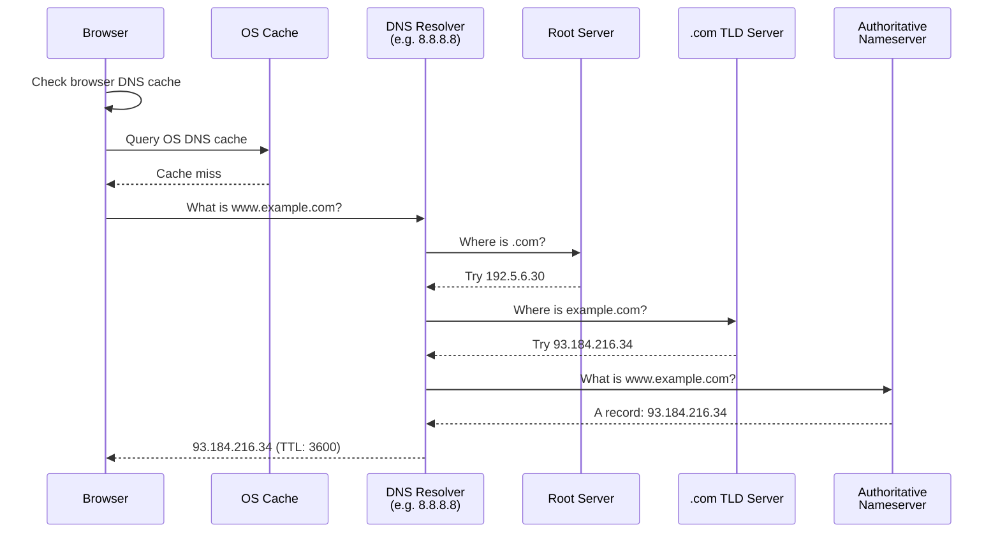
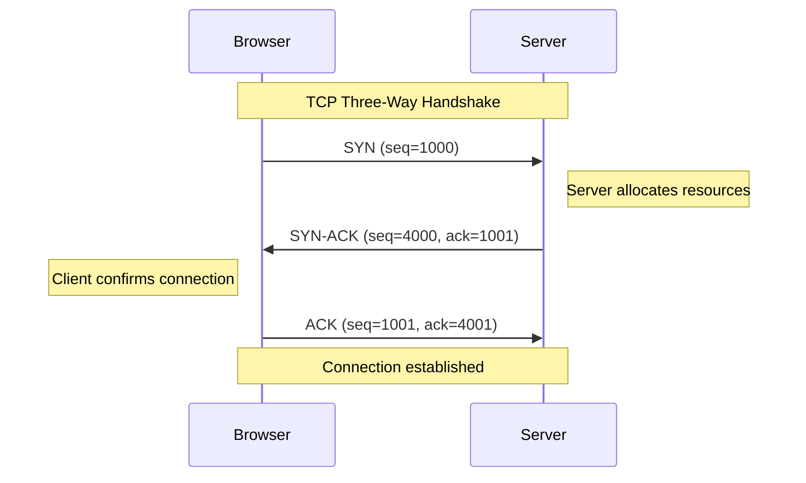
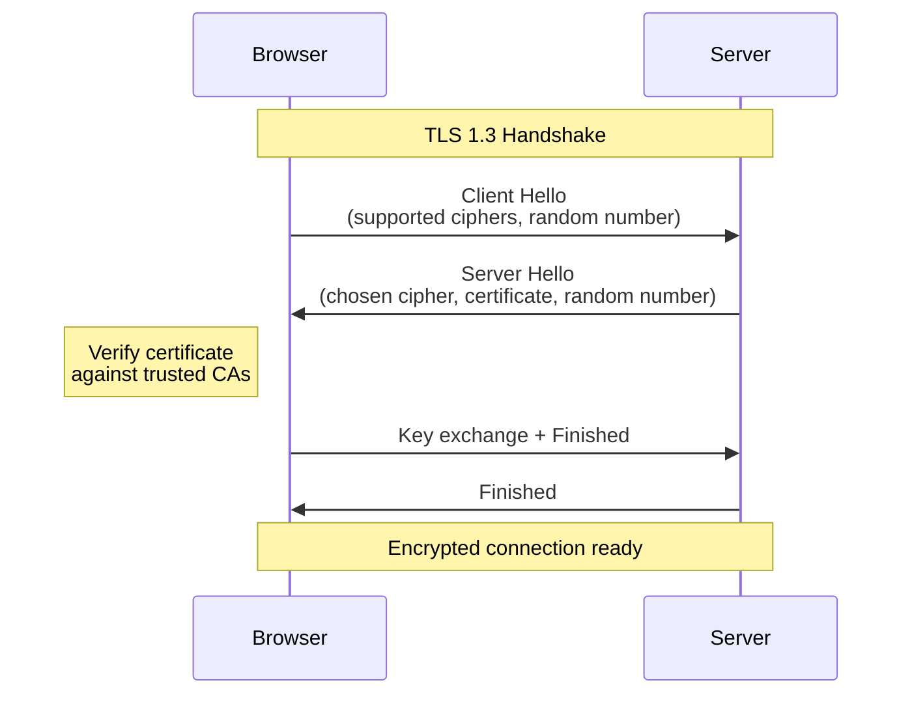
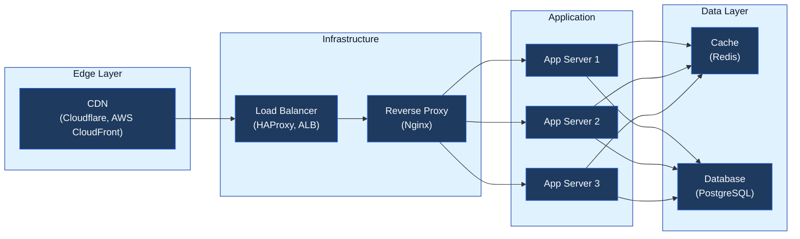
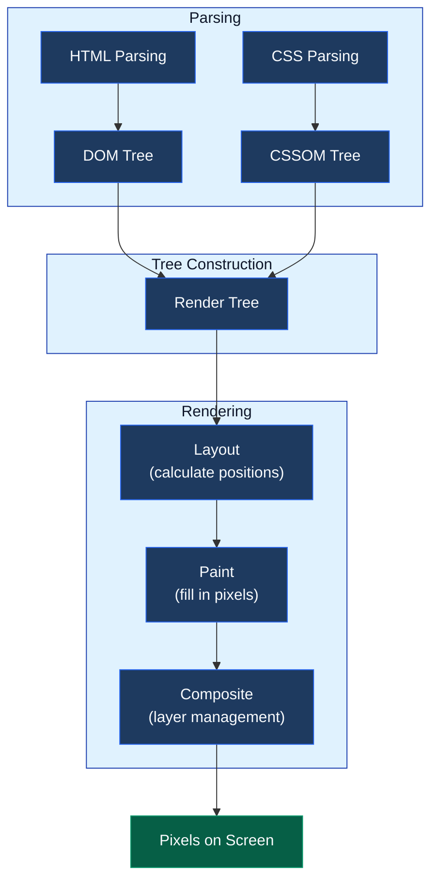
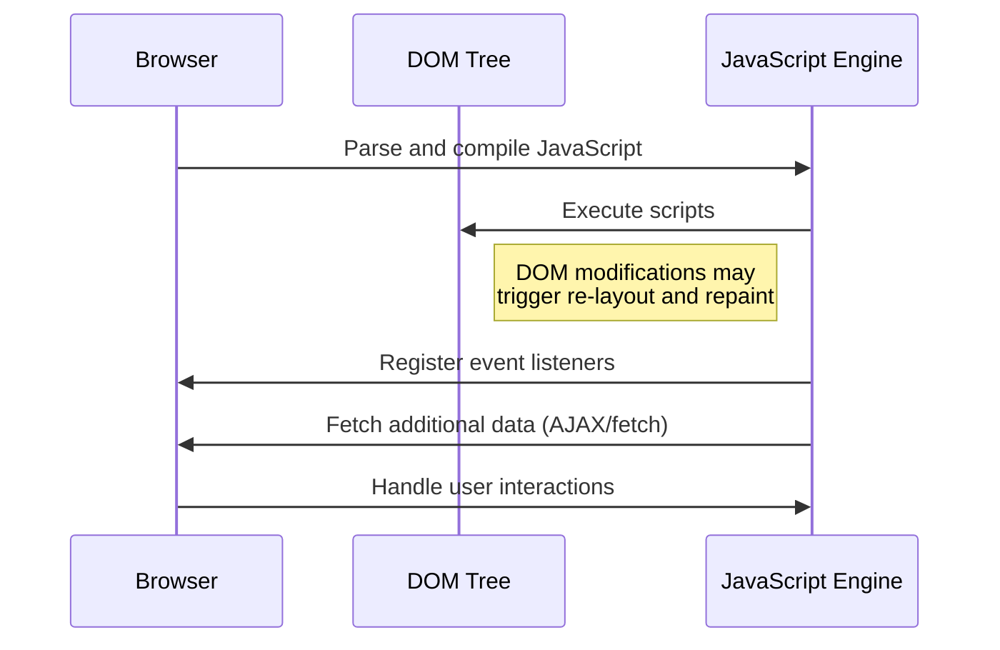

You type `google.com` into your browser and press Enter. Less than a second later, the page appears. It feels instant, but in that brief moment, your browser completed a dozen distinct steps involving networks across the globe, cryptographic negotiations, and a rendering pipeline that turns raw text into pixels.

Every software developer will face this question in an interview at some point. More importantly, understanding this process makes you better at debugging, performance optimization, and system design. When your page loads slowly, you need to know where in this chain the bottleneck is.

Let's walk through the entire journey, step by step.


---

## Step 1: URL Parsing

Before anything touches the network, the browser needs to figure out what you actually typed.

When you enter `https://www.example.com:443/search?q=hello#results`, the browser breaks it apart:

| Component | Value | Purpose |
|-----------|-------|---------|
| **Scheme** | `https` | Protocol to use |
| **Host** | `www.example.com` | Server to connect to |
| **Port** | `443` | Port number (443 is default for HTTPS) |
| **Path** | `/search` | Resource on the server |
| **Query** | `q=hello` | Parameters for the request |
| **Fragment** | `#results` | Client-side anchor (never sent to server) |

If you just type `example.com` without a scheme, the browser has to decide: is this a URL or a search query? Modern browsers check if it looks like a valid domain. If it does, they prepend `https://`. If not, they send it to your default search engine.

### HSTS Check

Before making any connection, the browser checks its **HSTS (HTTP Strict Transport Security) preload list**. This is a hardcoded list of domains that must always use HTTPS. Sites like Google, Facebook, and Twitter are on this list.

If the domain is on the HSTS list, the browser will never attempt an HTTP connection, not even briefly. This prevents a class of attacks where someone intercepts the initial HTTP request before the redirect to HTTPS.

```
User types: example.com
Browser checks: Is example.com on the HSTS preload list?
  Yes → Use https://example.com directly
  No  → Try https://example.com, fall back to http:// if needed
```

### Browser Cache Check

The browser also checks if it already has a cached copy of the page. If you visited this exact URL recently and the cache headers allow it, the browser can skip everything and show the cached version immediately. This is why hitting the back button feels instant.

---

## Step 2: DNS Lookup

The browser now has a hostname: `www.example.com`. But it cannot connect to a hostname. It needs an IP address like `93.184.216.34`.

This is where DNS (Domain Name System) comes in. DNS is a distributed database that maps domain names to IP addresses. The lookup goes through multiple layers of caching before hitting the network.



**The caching layers, in order:**

1. **Browser cache** - Chrome caches DNS records for about 60 seconds
2. **OS cache** - Your operating system maintains its own DNS cache (`systemd-resolved` on Linux, `mDNSResponder` on macOS)
3. **Router cache** - Your home router often caches DNS lookups too
4. **ISP resolver cache** - Your ISP's DNS server (or a public one like Cloudflare's `1.1.1.1` or Google's `8.8.8.8`) caches results based on the TTL (time to live) value

If all caches miss, the resolver walks the DNS hierarchy: root servers, TLD servers (`.com`, `.org`), and finally the authoritative nameserver that actually holds the record.

The result is cached at every level so the next request is faster. A typical DNS lookup takes 20-120ms. A cached lookup takes under 1ms.

> **Deep dive:** For the full picture on DNS resolution, record types (A, CNAME, MX, TXT), TTL strategies, and debugging with `dig`, see [How DNS Works: The Complete Guide](/how-dns-works-complete-guide/).

---

## Step 3: TCP Connection

The browser now has an IP address. Time to connect.

TCP (Transmission Control Protocol) provides reliable, ordered delivery of data. Before any data is exchanged, the browser and server must agree to communicate. This happens through the **three-way handshake**.



**What each step does:**

1. **SYN** - The client sends a synchronize packet with a random sequence number (say, 1000). This tells the server: "I want to talk. Here is my starting number so you can track my data."
2. **SYN-ACK** - The server responds with its own sequence number (4000) and acknowledges the client's number by incrementing it (1001). This says: "I hear you, and here is my starting number."
3. **ACK** - The client acknowledges the server's number (4001). Connection is established.

These sequence numbers are not just formalities. They allow both sides to detect missing packets, reorder data that arrives out of sequence, and retransmit anything that gets lost. This is what makes TCP reliable.

### The Cost of TCP

The three-way handshake takes one full round trip (RTT). If you are in New York connecting to a server in Singapore, that round trip might be 200ms. That is 200ms before any data flows.

This is one reason modern protocols like [HTTP/3 and QUIC](/how-webtransport-works/) are replacing TCP. QUIC combines the transport and encryption handshakes into a single round trip, cutting connection time in half.

---

## Step 4: TLS Handshake

Almost all websites today use HTTPS. After the TCP connection is established, the browser and server need to set up encryption through TLS (Transport Layer Security).

The TLS handshake ensures two things: the server is who it claims to be, and the communication is encrypted so nobody in between can read it.



**Here is what happens in TLS 1.3:**

1. **Client Hello** - The browser sends a list of cipher suites it supports (like `TLS_AES_256_GCM_SHA384`), a random number, and the server name (SNI). The server name is sent in plain text so the server knows which certificate to use if it hosts multiple domains.

2. **Server Hello** - The server picks a cipher suite, sends its certificate (which contains its public key), and a random number.

3. **Certificate Verification** - The browser checks the server's certificate against its list of trusted Certificate Authorities (CAs). It verifies the certificate is not expired, not revoked, and actually issued for this domain. If verification fails, you get the "Your connection is not private" warning.

4. **Key Exchange** - Both sides use the exchanged information to derive a shared session key. This key is used for symmetric encryption for the rest of the connection. Symmetric encryption is much faster than asymmetric (public/private key) encryption, which is why TLS only uses asymmetric crypto for the handshake.

5. **Finished** - Both sides send a "Finished" message encrypted with the new session key, proving the handshake succeeded.

TLS 1.3 reduced the handshake from two round trips (TLS 1.2) to one round trip. It also supports **0-RTT resumption** for repeat visits, where the browser reuses session information from a previous connection to skip the handshake entirely.

### What About TLS and Performance?

On a modern server, TLS adds about 1-2ms of processing time per connection. The bigger cost is the round trip latency. For a 100ms RTT connection, TLS 1.2 added 200ms. TLS 1.3 cut that to 100ms. QUIC (HTTP/3) combines TCP and TLS into one round trip, bringing it down further.

---

## Step 5: HTTP Request

The connection is open and encrypted. The browser sends an HTTP request.

```
GET /search?q=hello HTTP/2
Host: www.example.com
User-Agent: Mozilla/5.0 (Macintosh; Intel Mac OS X 10_15_7)
Accept: text/html,application/xhtml+xml
Accept-Encoding: gzip, br
Accept-Language: en-US,en;q=0.9
Cookie: session_id=abc123; theme=dark
Connection: keep-alive
```

**The key parts:**

- **Method**: `GET` is for fetching data. `POST` for sending data. `PUT` for updating. `DELETE` for removing. These are the HTTP verbs you use in every API you build.
- **Path**: `/search?q=hello` is the resource the browser wants.
- **Headers**: Metadata about the request. `Accept-Encoding: gzip, br` tells the server the browser can handle compressed responses. `Cookie` sends stored session data.
- **HTTP Version**: Most browsers today negotiate HTTP/2 or HTTP/3 during the TLS handshake.

### HTTP/1.1 vs HTTP/2 vs HTTP/3

| Feature | HTTP/1.1 | HTTP/2 | HTTP/3 |
|---------|----------|--------|--------|
| **Connections** | One request per connection (or keep-alive) | Multiplexed on one TCP connection | Multiplexed on one QUIC connection |
| **Header compression** | None | HPACK | QPACK |
| **Head-of-line blocking** | Yes | Yes (TCP level) | No (QUIC streams are independent) |
| **Transport** | TCP | TCP | QUIC (UDP) |

HTTP/2 was a big improvement because it multiplexed multiple requests over a single TCP connection. Instead of waiting for one request to finish before sending the next, the browser can fire off requests for the HTML, CSS, JavaScript, and images all at once.

But HTTP/2 still uses TCP, and TCP treats all streams as one connection. If one packet is lost, TCP holds up everything until it is retransmitted. This is **head-of-line blocking**.

HTTP/3 fixes this by using [QUIC, a protocol built on UDP](/how-webtransport-works/) that treats each stream independently. A lost packet in one stream does not block the others.

---

## Step 6: Server-Side Processing

The request arrives at the server. But "the server" is rarely a single machine. In production, your request passes through multiple layers before reaching the application code.



### CDN (Content Delivery Network)

For static content (images, CSS, JS files), the request might never reach your origin server. A CDN like [Cloudflare](/how-cloudflare-supports-55-million-requests-per-second/) or AWS CloudFront caches content at edge locations around the world. If you are in Tokyo, the CDN serves the cached file from a server in Tokyo instead of fetching it from a server in Virginia.

CDNs use **anycast routing** where one IP address maps to hundreds of servers globally, and your request automatically goes to the nearest one.

### Load Balancer

If the request reaches your infrastructure, it hits a load balancer first. The load balancer distributes traffic across multiple application servers. Common strategies include:

- **Round Robin** - Requests go to servers in rotation
- **Least Connections** - Requests go to the server with the fewest active connections
- **Consistent Hashing** - Requests with the same key (like user ID) always go to the same server, which is great for [caching](/caching-strategies-explained/)

### Application Server

The app server runs your code. For a search query like `/search?q=hello`, the server might:

1. Authenticate the request (check the [session cookie or JWT](/how-jwt-works/))
2. Parse the query parameters
3. Check the cache (Redis, Memcached) for a cached result
4. If cache miss, query the database
5. Process and format the results
6. Return the response

If the server depends on other services (a search service, a recommendation engine, a payment provider), those are additional network calls. Each one adds latency. This is where [distributed tracing](/distributed-tracing-jaeger-vs-tempo-vs-zipkin/) becomes essential for debugging slow requests.

### Database Query

If the data is not in the cache, the server queries the database. For our search query, this might be:

```sql
SELECT id, title, snippet
FROM pages
WHERE to_tsvector('english', content) @@ plainto_tsquery('english', 'hello')
ORDER BY rank DESC
LIMIT 10;
```

The database parses the query, checks its query plan cache, determines the best execution strategy (which indexes to use, whether to do a sequential scan), runs the query, and returns results. A well-indexed query takes under 1ms. A full table scan on millions of rows can take seconds.

---

## Step 7: HTTP Response

The server sends back a response.

```
HTTP/2 200 OK
Content-Type: text/html; charset=utf-8
Content-Encoding: br
Cache-Control: max-age=0, private, must-revalidate
Set-Cookie: session_id=abc123; Secure; HttpOnly; SameSite=Lax
Content-Length: 45231
X-Request-Id: 8f14e45f-ceea-467f-a83d-8a5b2a1d8f3e

<!DOCTYPE html>
<html>
<head>...
```

**Important response headers:**

- **Status Code**: `200 OK` means success. `301` is a permanent redirect. `404` means not found. `500` is a server error. `503` is service unavailable (often during deployments).
- **Content-Encoding: br**: The response is compressed with Brotli. The browser will decompress it. Brotli typically achieves 15-25% better compression than gzip.
- **Cache-Control**: Tells the browser how long to cache this response. `max-age=3600` means cache it for one hour. `no-store` means never cache it.
- **Set-Cookie**: Stores data in the browser. The `HttpOnly` flag prevents JavaScript from reading the cookie (protecting against XSS). `Secure` ensures it is only sent over HTTPS. `SameSite=Lax` prevents it from being sent in cross-site requests (protecting against CSRF).
- **X-Request-Id**: A unique identifier for this request, useful for [tracing requests across services](/distributed-tracing-jaeger-vs-tempo-vs-zipkin/).

### Response Compression

Modern servers compress responses before sending them. The three common algorithms:

| Algorithm | Compression | Speed | Browser Support |
|-----------|-------------|-------|-----------------|
| **gzip** | Good | Fast | All browsers |
| **Brotli (br)** | Better (15-25% smaller) | Slower to compress | All modern browsers |
| **zstd** | Best for large files | Very fast | Growing support |

The browser tells the server what it supports via `Accept-Encoding: gzip, br`. The server picks the best option.

---

## Step 8: Browser Rendering

This is where the magic happens. The browser has received raw HTML text. It needs to turn it into the visual page you see. This process is called the **critical rendering path**.



### Step 8a: HTML Parsing and DOM Construction

The browser reads the HTML byte by byte and constructs the **DOM (Document Object Model)** tree. The DOM is a tree representation of the page structure.

```html
<html>
  <head>
    <title>Search Results</title>
    <link rel="stylesheet" href="/styles.css">
  </head>
  <body>
    <header>
      <h1>Results for "hello"</h1>
    </header>
    <main>
      <article>
        <h2>First Result</h2>
        <p>Description of the first result...</p>
      </article>
    </main>
  </body>
</html>
```

This becomes a tree:

```
Document
├── html
│   ├── head
│   │   ├── title ("Search Results")
│   │   └── link (stylesheet)
│   └── body
│       ├── header
│       │   └── h1 ("Results for hello")
│       └── main
│           └── article
│               ├── h2 ("First Result")
│               └── p ("Description...")
```

When the parser encounters a `<link>` tag for a CSS file or a `<script>` tag for JavaScript, it has to make decisions that directly impact performance.

**CSS is render-blocking.** The browser will not render anything until all CSS is downloaded and parsed, because it needs the styles to know how to display elements. This is why you should put CSS in the `<head>` and keep it small.

**JavaScript is parser-blocking by default.** When the parser hits a `<script>` tag, it stops parsing HTML, downloads the script, and executes it. This is because JavaScript can modify the DOM (via `document.write()`, for example). You can avoid this with `async` or `defer` attributes:

```html
<!-- Parser-blocking: stops HTML parsing -->
<script src="/app.js"></script>

<!-- Async: downloads in parallel, executes when ready (pauses parser) -->
<script async src="/analytics.js"></script>

<!-- Defer: downloads in parallel, executes after HTML parsing is done -->
<script defer src="/app.js"></script>
```

Use `defer` for scripts that need the full DOM. Use `async` for independent scripts like analytics.

### Step 8b: CSSOM Construction

While the DOM represents structure, the **CSSOM (CSS Object Model)** represents styles. The browser downloads and parses every CSS file to build the CSSOM tree.

```css
body { font-family: sans-serif; margin: 0; }
header { background: #1e293b; color: white; padding: 20px; }
h1 { font-size: 24px; }
article { padding: 16px; border-bottom: 1px solid #e2e8f0; }
.hidden { display: none; }
```

The CSSOM stores the computed style for every element. "Computed" means the browser resolves all cascading, inheritance, and specificity rules. If your body sets `font-family: sans-serif` and nothing overrides it, every text element inherits that font.

### Step 8c: Render Tree

The browser combines the DOM and CSSOM to create the **render tree**. The render tree only contains visible elements. Elements with `display: none` are excluded entirely. Elements with `visibility: hidden` are included (they take up space but are invisible).

```
Render Tree:
├── html (block)
│   ├── body (block, font: sans-serif)
│   │   ├── header (block, bg: #1e293b, color: white)
│   │   │   └── h1 (block, font-size: 24px) "Results for hello"
│   │   └── main (block)
│   │       └── article (block, padding: 16px)
│   │           ├── h2 (block) "First Result"
│   │           └── p (block) "Description..."
```

### Step 8d: Layout (Reflow)

The browser calculates the exact position and size of every element in the render tree. This is called **layout** (or **reflow**).

The browser starts at the root element and works down the tree. For each element, it calculates:

- Width and height (based on content, padding, border, margin)
- Position (based on the layout model: normal flow, flexbox, grid, absolute positioning)
- How the element affects its siblings and children

Layout is one of the most expensive operations in the rendering pipeline. Changing a single element's width can trigger layout recalculation for hundreds of other elements. This is why CSS properties that trigger layout (like `width`, `height`, `top`, `left`, `margin`) are more expensive to animate than properties that only trigger compositing (like `transform` and `opacity`).

### Step 8e: Paint

The browser fills in the actual pixels. It creates a list of drawing instructions: "draw a rectangle at (0, 0) with width 1200 and height 60, fill it with #1e293b" and so on.

Modern browsers paint in **layers**. Elements with certain CSS properties (like `transform`, `opacity`, `will-change`, or `position: fixed`) get their own compositing layer. This is important because when something changes, the browser only needs to repaint the affected layer, not the entire page.

### Step 8f: Compositing

The browser takes all the painted layers and composites them into the final image. This step handles:

- Layer ordering (z-index)
- Transparency and blending
- Transformations (translate, rotate, scale)

Compositing happens on the GPU, which is why `transform` and `opacity` animations are smooth (they only need the compositing step), while `width` or `height` animations are janky (they trigger layout, paint, and compositing).

---

## Step 9: JavaScript Execution

After the initial render, JavaScript kicks in. Modern web applications often ship a JavaScript bundle that "hydrates" the server-rendered HTML, attaching event listeners and making the page interactive.



The JavaScript engine (V8 in Chrome, SpiderMonkey in Firefox) parses, compiles, and executes your code. When JavaScript modifies the DOM (adding elements, changing styles), the browser may need to recalculate layout and repaint, the same pipeline from Step 8.

**This is why frameworks like React use a virtual DOM.** Instead of making many small changes to the real DOM (each potentially triggering layout), React batches changes and applies them in one update.

### Lazy Loading and Deferred Resources

Not everything loads upfront. Modern browsers and frameworks optimize by deferring non-critical resources:

- **Images below the fold**: `loading="lazy"` tells the browser to load images only when they are near the viewport
- **Code splitting**: JavaScript bundles are split into chunks. Only the code needed for the current page is loaded initially
- **Prefetching**: `<link rel="prefetch" href="/next-page.html">` tells the browser to fetch resources for likely next navigations during idle time

---

## The Full Timeline

Let's put it all together with approximate timings for a typical page load over a 50ms RTT connection:

```mermaid
gantt
    title Page Load Timeline
    dateFormat X
    axisFormat %Lms

    section Network
    DNS Lookup           :dns, 0, 20
    TCP Handshake        :tcp, 20, 70
    TLS Handshake        :tls, 70, 120
    HTTP Request/Response :http, 120, 220

    section Rendering
    HTML Parse + DOM     :dom, 220, 280
    CSS Parse + CSSOM    :css, 230, 270
    Render Tree          :rt, 280, 290
    Layout               :layout, 290, 300
    Paint                :paint, 300, 320

    section Interactive
    JS Parse + Execute   :js, 280, 400
    Page Interactive     :milestone, 400, 400
```



**On a fast connection, this all happens in under 500ms.** On a slow 3G connection, DNS alone can take 200ms, and the total might stretch to 5-10 seconds.

---

## Where Things Go Wrong

Understanding this pipeline helps you diagnose performance issues. Here is where to look when things are slow:

| Symptom | Likely Cause | Fix |
|---------|-------------|-----|
| Slow initial load | DNS resolution, no CDN | Use a fast DNS provider, add a CDN |
| White screen for seconds | Render-blocking CSS/JS | Inline critical CSS, defer scripts |
| Page loads but not interactive | Large JavaScript bundle | Code splitting, tree shaking |
| Slow on repeat visits | No caching | Set proper `Cache-Control` headers |
| Slow API responses | Server/database bottleneck | Add [caching layer](/caching-strategies-explained/), optimize queries |
| Janky scrolling | Layout thrashing | Avoid animating layout properties, use `transform` instead |
| Connection timeouts | Server overloaded | Add [load balancing](/system-design-cheat-sheet/), [circuit breakers](/circuit-breaker-pattern/) |

---

## Performance Metrics That Matter

Google measures page performance through **Core Web Vitals**. These map directly to the rendering pipeline:

- **LCP (Largest Contentful Paint)** - How long until the largest visible element renders. Measures perceived load speed. Target: under 2.5 seconds.
- **FID (First Input Delay)** - How long until the page responds to the first user interaction. Measures interactivity. Target: under 100ms.
- **CLS (Cumulative Layout Shift)** - How much the page layout shifts during loading. Measures visual stability. Target: under 0.1.

These metrics directly affect your Google search ranking. A page that loads fast but shifts around as images and ads load will score poorly on CLS.

---

## Key Takeaways

1. **DNS adds latency before anything else happens.** Use a fast DNS provider and enable DNS prefetching for domains you know you will need.

2. **TCP + TLS handshakes cost round trips.** HTTP/2 reuses connections. HTTP/3 (QUIC) combines handshakes. Use persistent connections and consider QUIC for latency-sensitive applications.

3. **CSS blocks rendering. JavaScript blocks parsing.** Put CSS in the head, keep it small. Use `defer` or `async` for scripts. Inline critical CSS for the fastest first paint.

4. **The server stack matters.** CDNs, load balancers, caching layers, and database query optimization all affect the time between receiving the request and sending the response.

5. **The browser does a lot of work after receiving HTML.** DOM construction, CSSOM, render tree, layout, paint, and compositing are all separate steps. Understanding which CSS properties trigger which steps helps you write performant animations.

6. **Every millisecond counts for user experience.** A 100ms delay in page load reduces conversion rates by 7% (source: Akamai). Google's research shows 53% of mobile users abandon sites that take longer than 3 seconds.

---

## Further Reading

- [How DNS Works: The Complete Guide](/how-dns-works-complete-guide/) - Deep dive into DNS resolution, record types, and performance
- [WebTransport and HTTP/3](/how-webtransport-works/) - How QUIC and HTTP/3 fix TCP's head-of-line blocking
- [Caching Strategies Explained](/caching-strategies-explained/) - Cache-aside, write-through, and other patterns
- [How Cloudflare Handles 55M RPS](/how-cloudflare-supports-55-million-requests-per-second/) - CDN architecture, anycast routing, and connection pooling
- [How JWT Works](/how-jwt-works/) - Session management and token-based authentication
- [Distributed Tracing: Jaeger vs Tempo vs Zipkin](/distributed-tracing-jaeger-vs-tempo-vs-zipkin/) - Tracing requests across services
- [Flutter Under the Hood](/flutter-under-the-hood/) - How Flutter uses a similar tree-based rendering pipeline to turn Dart code into pixels
- [System Design Cheat Sheet](/system-design-cheat-sheet/) - Concepts every developer should know
