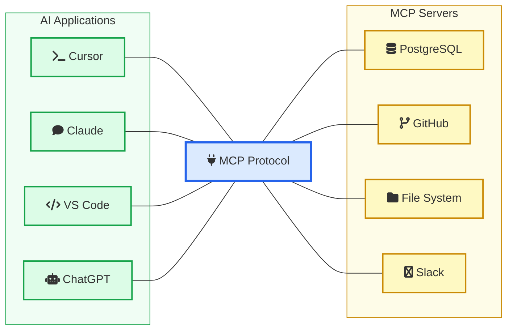
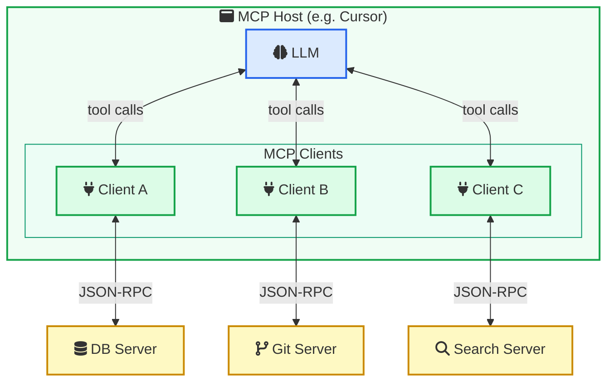
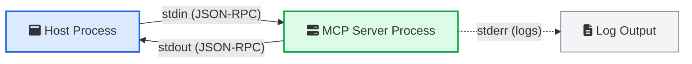
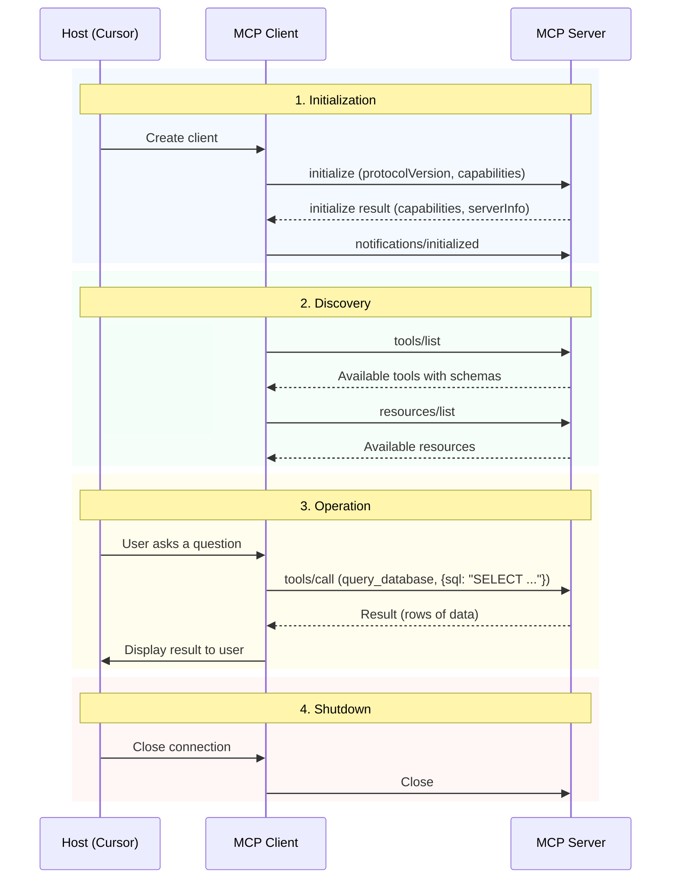
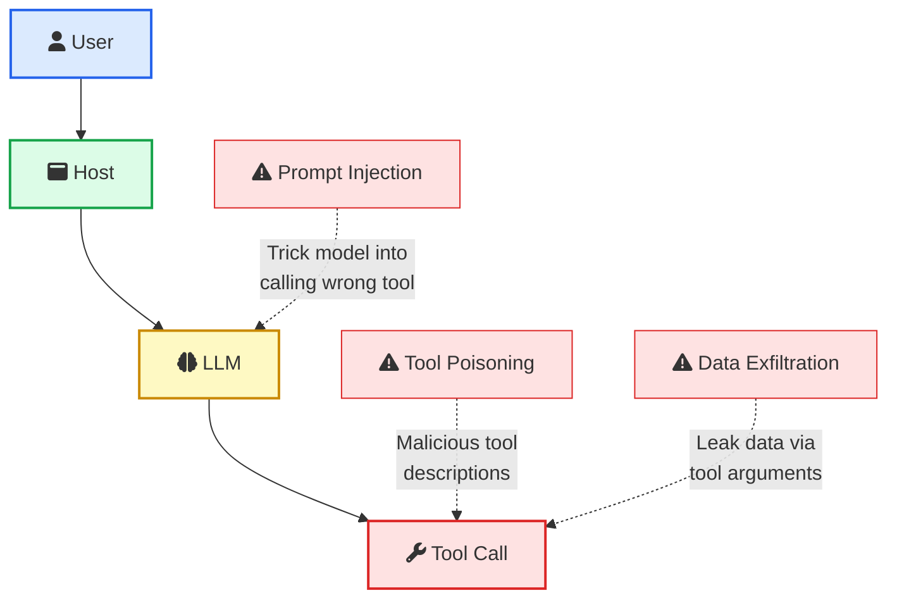
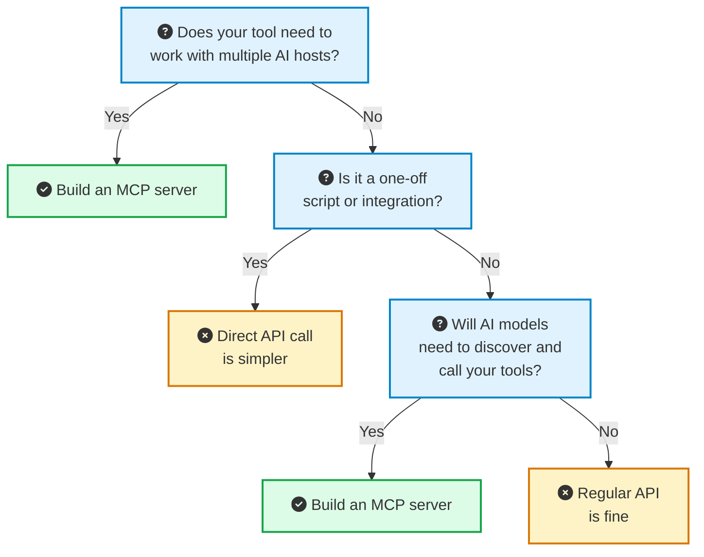

Every AI tool you use today is isolated. Claude can write code but cannot read your Jira tickets. ChatGPT can analyze data but cannot pull from your company's database. Cursor can edit files but needs custom configuration for every new tool you want to plug in.

The result? Developers end up building one-off integrations for every combination of AI app and external tool. If you have 5 AI applications and 10 tools, that is 50 custom integrations. Add a new tool, and you are building 5 more.

This is the problem MCP solves.

Model Context Protocol (MCP) is an open standard created by Anthropic that gives AI applications a universal way to connect to tools, data sources, and services. Build one MCP server for your tool, and every MCP-compatible AI app can use it. No more custom integrations for each host.

If you have been [building AI agents](/building-ai-agents/) or working with [LLM applications](/building-your-first-llm-application/), you have already hit this wall. MCP is the industry's answer to it.

> **TL;DR**: MCP is a protocol (not a framework) that standardizes how AI apps talk to external tools. It uses JSON-RPC 2.0, defines three primitives (Tools, Resources, Prompts), and runs over stdio or HTTP. Think of it as USB-C for AI: one port, many devices. Major AI tools like Cursor, Claude, VS Code, and ChatGPT already support it.

## Table of Contents

1. [What is MCP?](#what-is-mcp)
2. [The Problem MCP Solves](#the-problem-mcp-solves)
3. [MCP Architecture: Hosts, Clients, and Servers](#mcp-architecture-hosts-clients-and-servers)
4. [The Three Primitives: Tools, Resources, and Prompts](#the-three-primitives-tools-resources-and-prompts)
5. [How MCP Communicates: JSON-RPC and Transports](#how-mcp-communicates-json-rpc-and-transports)
6. [MCP vs REST APIs: Complementary, Not a Replacement](#mcp-vs-rest-apis-complementary-not-a-replacement)
7. [How a Typical MCP Session Works](#how-a-typical-mcp-session-works)
8. [Build Your First MCP Server](#build-your-first-mcp-server)
9. [Connecting MCP Servers to Real Clients](#connecting-mcp-servers-to-real-clients)
10. [MCP Security: What You Need to Know](#mcp-security-what-you-need-to-know)
11. [The MCP Ecosystem Today](#the-mcp-ecosystem-today)
12. [When to Use MCP (and When Not To)](#when-to-use-mcp-and-when-not-to)
13. [What is Coming Next](#what-is-coming-next)

---

## What is MCP?

MCP stands for Model Context Protocol. It is an open-source protocol that defines how AI applications connect to external data sources, tools, and services.

The official documentation calls it **"USB-C for AI applications."** Just like USB-C gives you one port to connect to monitors, drives, and peripherals, MCP gives AI apps one protocol to connect to databases, APIs, file systems, and any other tool.

Here is what that looks like in practice:



Without MCP, each connection in this diagram would require its own integration code. With MCP, you write the integration once as an MCP server, and it works with every host that speaks the protocol.

Anthropic released MCP as an open standard in November 2024 and it has since been adopted by nearly every major AI tool. The protocol is now governed by an open specification, and contributions come from across the industry.

---

## The Problem MCP Solves

Before MCP, connecting AI to external tools looked like this:

**The M x N integration problem:**

| | Cursor | Claude | VS Code | ChatGPT |
|---|---|---|---|---|
| **GitHub** | Custom plugin | Custom connector | Custom extension | Custom GPT Action |
| **PostgreSQL** | Custom config | Custom integration | Custom extension | Custom GPT Action |
| **Slack** | N/A | Custom integration | Custom extension | Custom GPT Action |
| **Jira** | Custom plugin | Custom connector | Custom extension | Custom GPT Action |

That is 16 custom integrations for 4 tools and 4 hosts. Add one more tool, you build 4 more. Add one more host, you build 4 more. The complexity grows as M x N.

With MCP, it becomes M + N:

- Build 4 MCP servers (one per tool)
- Each host connects to any server using the same protocol
- Total: 4 servers + 4 hosts = 8 pieces of work instead of 16

This is the same pattern that solved similar problems before. USB-C standardized hardware connections. [Language Server Protocol (LSP)](https://microsoft.github.io/language-server-protocol/) standardized how code editors talk to language-specific tooling. MCP does the same thing for AI-to-tool connections.

---

## MCP Architecture: Hosts, Clients, and Servers

The MCP architecture has three distinct layers. Understanding each one is important because they have different responsibilities.



### <i class="fas fa-window-maximize"></i> MCP Host

The host is the AI application the user interacts with. Cursor, Claude Desktop, VS Code with Copilot, ChatGPT are all hosts. The host is responsible for:

- Running the LLM
- Managing user interactions
- Creating and managing MCP clients
- Deciding which tools the model can access
- Enforcing security policies and user consent

The host is the boss. It controls what the model sees and what it is allowed to do.

### <i class="fas fa-plug"></i> MCP Client

The client is a component **inside** the host. Each client maintains a dedicated, one-to-one connection with a single MCP server. If Cursor connects to three MCP servers (GitHub, PostgreSQL, Slack), it creates three separate client instances.

The client handles:

- Protocol negotiation with the server
- Message routing (JSON-RPC)
- Capability management (what the server supports)
- Connection lifecycle

You do not usually build clients yourself. The host application handles this. But understanding the client layer helps when debugging connection issues.

### <i class="fas fa-server"></i> MCP Server

The server is where the real work happens. It exposes tools, resources, and prompts that AI models can use. A server might:

- Wrap a REST API (GitHub, Jira, Slack)
- Provide database access (PostgreSQL, MongoDB)
- Expose file system operations
- Run specialized computations

Each server is a standalone program. It can be a local subprocess (running on your machine) or a remote service (running in the cloud). The protocol is the same either way.

---

## The Three Primitives: Tools, Resources, and Prompts

MCP defines three types of things a server can provide. Knowing which one to use and when is the difference between building an effective MCP server and a confusing one.

### <i class="fas fa-wrench"></i> Tools: Actions the Model Can Take

Tools are functions the LLM can call. They are the most commonly used primitive and the one you will build first.

**Key characteristics:**
- The **model** decides when to call them (based on tool descriptions)
- They have defined input schemas (JSON Schema)
- They can have side effects (write data, send messages, create files)
- They require user approval for safety-critical operations

```json
{
  "name": "query_database",
  "description": "Run a read-only SQL query against the production database",
  "inputSchema": {
    "type": "object",
    "properties": {
      "sql": {
        "type": "string",
        "description": "The SQL query to execute. Must be a SELECT statement."
      }
    },
    "required": ["sql"]
  }
}
```

When to use: When the model needs to **do something**. Query a database. Create a GitHub issue. Send a Slack message. Anything with an action.

### <i class="fas fa-file-alt"></i> Resources: Data the Model Can Read

Resources are read-only data identified by URIs. They are how you expose context to the model without giving it the ability to modify anything.

**Key characteristics:**
- Identified by URI (e.g., `file:///path/to/doc.md`, `postgres://db/users/123`)
- Read-only (no side effects)
- Can be listed and searched by the client
- Support subscriptions for real-time updates

```json
{
  "uri": "file:///workspace/README.md",
  "name": "Project README",
  "description": "The main README file for the current project",
  "mimeType": "text/markdown"
}
```

When to use: When the model needs **context** to make better decisions. Project documentation, configuration files, database schemas, log entries.

### <i class="fas fa-comment-dots"></i> Prompts: Reusable Templates

Prompts are predefined message templates that guide the model through specific workflows. They are the least understood primitive but very useful for repeatable tasks.

**Key characteristics:**
- User-facing (usually surfaced as slash commands)
- Can accept arguments
- Return structured message sequences
- Help standardize how users interact with specific tools

```json
{
  "name": "review_code",
  "description": "Review code changes for bugs, security issues, and style",
  "arguments": [
    {
      "name": "diff",
      "description": "The code diff to review",
      "required": true
    }
  ]
}
```

When to use: When you want to create **repeatable workflows** that users can trigger. Code review templates, report generation, data analysis patterns.

### When to Use Each Primitive

| Scenario | Primitive | Why |
|----------|-----------|-----|
| Run a database query | Tool | It is an action with parameters |
| Read a config file | Resource | Read-only context, no side effects |
| Review a pull request | Prompt + Tool | Template guides the workflow, tool fetches the diff |
| Send a Slack message | Tool | Action with side effects |
| Load project documentation | Resource | Static context for the model |
| Generate a weekly report | Prompt | Repeatable workflow template |

---

## How MCP Communicates: JSON-RPC and Transports

MCP is built on two layers: a **data layer** (what gets sent) and a **transport layer** (how it gets sent).

### The Data Layer: JSON-RPC 2.0

All MCP messages follow the [JSON-RPC 2.0](https://www.jsonrpc.org/specification) format. If you have worked with LSP (Language Server Protocol) in VS Code extensions, this will feel familiar.

There are three types of messages:

**Requests** (expect a response):
```json
{
  "jsonrpc": "2.0",
  "id": 1,
  "method": "tools/list",
  "params": {}
}
```

**Responses** (answer a request):
```json
{
  "jsonrpc": "2.0",
  "id": 1,
  "result": {
    "tools": [
      {
        "name": "query_database",
        "description": "Run a SQL query",
        "inputSchema": { "type": "object", "properties": { "sql": { "type": "string" } } }
      }
    ]
  }
}
```

**Notifications** (one-way, no response expected):
```json
{
  "jsonrpc": "2.0",
  "method": "notifications/tools/list_changed"
}
```

### The Transport Layer: How Messages Travel

MCP supports two transport mechanisms. Which one you use depends on where your server runs.

**stdio (Standard I/O)** is for local servers. The host launches the server as a child process and communicates through stdin/stdout. This is what you use when running MCP servers on your own machine with Cursor or Claude Desktop.



Important rule: if you use stdio, **never** write anything other than valid JSON-RPC messages to stdout. Debug output goes to stderr. Printing to stdout will corrupt the protocol stream.

**Streamable HTTP** is for remote servers. The client sends requests via HTTP POST and the server responds with JSON or opens an SSE (Server-Sent Events) stream for ongoing communication. This is what you use for cloud-hosted MCP servers that multiple users connect to.

| Transport | Use Case | Deployment | Session |
|-----------|----------|------------|---------|
| stdio | Local development, single user | Host spawns process | Process lifetime |
| Streamable HTTP | Remote/shared, multi-user | Cloud service | Session ID header |

The deprecated transport (HTTP+SSE from protocol version 2024-11-05) used separate endpoints for sending and receiving. Streamable HTTP combined them into a single endpoint. If you are building something new, use Streamable HTTP for remote and stdio for local.

---

## MCP vs REST APIs: Complementary, Not a Replacement

This is the most common misconception about MCP. It does not replace your REST APIs. It sits on top of them.

| Aspect | REST API | MCP |
|--------|----------|-----|
| **Designed for** | App-to-service communication | AI-to-tool communication |
| **Discovery** | Manual (read docs, know endpoints) | Automatic (`tools/list`, `resources/list`) |
| **Invocation** | HTTP methods, custom auth, headers | Standardized `tools/call` with JSON Schema |
| **Schema** | OpenAPI/Swagger (optional) | Built-in JSON Schema (required) |
| **Who calls it** | Your application code | The AI model (via the host) |
| **State** | Typically stateless | Stateful session with capability negotiation |

Here is a practical example. Say you have a GitHub REST API. To use it directly from an AI agent, you need to:

1. Know the endpoint (`api.github.com/repos/{owner}/{repo}/issues`)
2. Handle authentication (tokens, headers)
3. Know the request format (JSON body, query params)
4. Parse the response format
5. Handle pagination, rate limits, errors

With an MCP server wrapping that API:

1. The model calls `tools/list` and finds `create_github_issue`
2. The tool description tells the model what parameters it needs
3. The model calls `tools/call` with structured input
4. The server handles auth, request formatting, and error handling internally
5. The model gets back a clean result

The MCP server is a translator. It takes the messy reality of REST APIs and presents a clean, discoverable interface to the AI model. Your [existing API architecture](/building-your-first-llm-application/) stays the same. MCP just adds a layer that AI models understand.

---

## How a Typical MCP Session Works

Let us walk through what actually happens when an AI application uses MCP, from startup to tool execution.



### Step 1: Initialization

When the host starts up (or when you configure a new MCP server), the client connects to the server and they negotiate capabilities. The client says what protocol version it supports and what features it offers (like sampling, where the server can ask the host's LLM for help). The server responds with its own capabilities (tools, resources, prompts).

This is similar to a TLS handshake. Both sides agree on what they can do before exchanging real data.

### Step 2: Discovery

After initialization, the client asks the server what it has available. `tools/list` returns all available tools with their names, descriptions, and input schemas. `resources/list` returns available data sources. `prompts/list` returns available templates.

This is what makes MCP different from raw API calls. The AI model can **discover** what is available without anyone hardcoding tool definitions.

### Step 3: Operation

Now the model can work. When a user asks a question that requires external data or actions, the model looks at available tools, decides which one to call, formats the input according to the schema, and the client sends the request to the server. The server executes the action and returns the result.

If you have worked with [function calling in AI agents](/building-ai-agents/), this is the same concept, but standardized across hosts and tools.

### Step 4: Shutdown

When the session ends, the client sends a close message and the server cleans up. For stdio servers, the process exits. For HTTP servers, the session ID is invalidated.

---

## Build Your First MCP Server

Let us build a simple MCP server that exposes a weather tool. This is a minimal but complete example using the official TypeScript SDK.

### Setup

```bash
mkdir weather-mcp-server
cd weather-mcp-server
npm init -y
npm install @modelcontextprotocol/sdk zod
npm install -D typescript @types/node
npx tsc --init
```

### The Server Code

```typescript
import { McpServer } from "@modelcontextprotocol/sdk/server/mcp.js";
import { StdioServerTransport } from "@modelcontextprotocol/sdk/server/stdio.js";
import { z } from "zod";

const server = new McpServer({
  name: "weather-server",
  version: "1.0.0",
});

server.tool(
  "get_weather",
  "Get the current weather for a city",
  {
    city: z.string().describe("City name, e.g. London"),
    units: z.enum(["celsius", "fahrenheit"]).default("celsius")
      .describe("Temperature units"),
  },
  async ({ city, units }) => {
    const response = await fetch(
      `https://wttr.in/${encodeURIComponent(city)}?format=j1`
    );
    const data = await response.json();
    const current = data.current_condition[0];
    const temp = units === "celsius"
      ? `${current.temp_C}°C`
      : `${current.temp_F}°F`;

    return {
      content: [
        {
          type: "text",
          text: `Weather in ${city}: ${temp}, ${current.weatherDesc[0].value}. ` +
                `Humidity: ${current.humidity}%, Wind: ${current.windspeedKmph} km/h`,
        },
      ],
    };
  }
);

const transport = new StdioServerTransport();
await server.connect(transport);
```

That is a complete, working MCP server. It defines one tool (`get_weather`) with typed input parameters and connects over stdio.

### Adding a Resource

You can also expose read-only data as resources:

```typescript
server.resource(
  "weather-help",
  "weather://help",
  async (uri) => ({
    contents: [
      {
        uri: uri.href,
        mimeType: "text/plain",
        text: "This server provides weather data. Use the get_weather tool " +
              "with a city name to get current conditions.",
      },
    ],
  })
);
```

### Adding a Prompt

And provide reusable templates:

```typescript
server.prompt(
  "travel-weather",
  "Get weather for a travel destination with packing suggestions",
  { destination: z.string() },
  ({ destination }) => ({
    messages: [
      {
        role: "user",
        content: {
          type: "text",
          text: `I'm planning to travel to ${destination}. ` +
                `Check the current weather and suggest what to pack.`,
        },
      },
    ],
  })
);
```

### Running and Testing

Build and test with the MCP Inspector:

```bash
npx tsc
npx @modelcontextprotocol/inspector node dist/index.js
```

The Inspector gives you a web UI to call tools, read resources, and test prompts without connecting to a full AI host.

---

## Connecting MCP Servers to Real Clients

Once your server works, connecting it to AI hosts is straightforward.

### Cursor

Create a `.cursor/mcp.json` file in your project root:

```json
{
  "mcpServers": {
    "weather": {
      "command": "node",
      "args": ["/absolute/path/to/weather-mcp-server/dist/index.js"]
    }
  }
}
```

Restart Cursor, and the weather tool appears in your available tools. The model can now call it when you ask weather-related questions.

If you are already using MCP servers in Cursor (like many developers working with [AI coding assistants](/ai-coding-assistants-guide/)), this pattern is familiar.

### Claude Desktop

Edit `~/Library/Application Support/Claude/claude_desktop_config.json` (macOS):

```json
{
  "mcpServers": {
    "weather": {
      "command": "node",
      "args": ["/absolute/path/to/weather-mcp-server/dist/index.js"]
    }
  }
}
```

Restart Claude Desktop, and you will see a hammer icon indicating MCP tools are available.

### VS Code (GitHub Copilot)

In your VS Code settings or `.vscode/mcp.json`:

```json
{
  "mcpServers": {
    "weather": {
      "command": "node",
      "args": ["./weather-mcp-server/dist/index.js"]
    }
  }
}
```

The configuration pattern is the same across hosts: tell the host what command to run, and MCP handles the rest.

---

## MCP Security: What You Need to Know

MCP gives AI models the ability to execute tools. That is powerful and dangerous. The protocol defines a security model, but enforcement is your responsibility.

### The Threat Model



The risks are real. A malicious MCP server could define tools with misleading descriptions that trick the model. [Prompt injection attacks](/prompt-injection-explained/) could manipulate the model into calling destructive tools. Tool arguments could be used to exfiltrate sensitive data.

### Security Best Practices

**For MCP server builders:**

| Practice | What to Do |
|----------|------------|
| **Input validation** | Validate every input against your JSON Schema. Do not trust the model to send clean data |
| **Least privilege** | Only expose the minimum capabilities needed. A read-only DB tool should not have write access |
| **Sandboxing** | Run tool execution in isolated environments. Do not give MCP servers access to your entire system |
| **Rate limiting** | Limit how often tools can be called. An AI model in a loop can drain resources fast |
| **Output sanitization** | Clean tool outputs before returning them. Do not leak internal errors, stack traces, or credentials |

**For MCP host configuration:**

| Practice | What to Do |
|----------|------------|
| **Human approval** | Require user confirmation for destructive operations (delete, update, send) |
| **Local binding** | Bind local servers to `127.0.0.1`, never `0.0.0.0` |
| **Origin validation** | For HTTP servers, validate the `Origin` header to prevent DNS rebinding |
| **Auth for remote** | Use OAuth or equivalent for remote MCP servers |
| **Audit logging** | Log every tool call with timestamp, input, output, and user |

The [OWASP MCP Security Cheat Sheet](https://cheatsheetseries.owasp.org/cheatsheets/MCP_Security_Cheat_Sheet.html) goes deeper on threats like rug pulls (where a server changes tool definitions after approval), cross-server shadowing, and supply chain attacks. If you are deploying MCP in production, read it.

---

## The MCP Ecosystem Today

MCP adoption has grown faster than most developer protocols. Here is the current landscape.

### Hosts (AI applications with MCP support)

| Host | MCP Support | Notes |
|------|-------------|-------|
| Claude Desktop | Full | The reference implementation |
| Claude Code | Full | Terminal-based, great for development |
| Cursor | Full | IDE integration, project-level config |
| VS Code (Copilot) | Full | Via GitHub Copilot MCP support |
| ChatGPT | Growing | Added MCP support in 2025 |
| Windsurf | Full | Editor with native MCP support |

### Popular MCP Servers

The community has built MCP servers for almost every major developer tool:

- **Databases**: PostgreSQL, MySQL, MongoDB, SQLite, Redis
- **Version control**: GitHub, GitLab, Git (local)
- **Communication**: Slack, Discord, Email
- **Project management**: Jira, Linear, Notion
- **Cloud**: AWS, GCP, Cloudflare
- **Search**: Brave Search, Google Search, web scraping
- **Dev tools**: Docker, Kubernetes, Sentry, Puppeteer

Reference implementations are available at [github.com/modelcontextprotocol/servers](https://github.com/modelcontextprotocol/servers). For a broader directory, [mcp-awesome.com](https://mcp-awesome.com/) maintains a searchable list of 1200+ verified community servers.

### SDKs

Official SDKs are available for:

- **TypeScript**: `@modelcontextprotocol/sdk`
- **Python**: `mcp` (PyPI)
- **Kotlin**, **Java**, and others are in development or community-maintained

---

## When to Use MCP (and When Not To)

MCP is not always the right answer. Here is a decision framework:



**Use MCP when:**
- You are building tools that multiple AI applications should be able to use
- You want AI models to discover and call your tools without hardcoded integrations
- You are building [multi-agent systems](/multi-agent-ai-swarms-system-design/) where agents need standardized tool access
- Your team uses multiple AI hosts and wants a single integration per tool

**Do not use MCP when:**
- You are building a one-off integration for a single app
- Your tool does not need to be called by AI models
- Direct API calls are simpler and you do not need cross-host compatibility
- You are just starting with [context engineering](/context-engineering/) and need to learn the basics first

---

## What is Coming Next

MCP is evolving fast. Here is what the community and specification are moving toward:

**Streamable HTTP maturity.** The newer transport mechanism (replacing the old HTTP+SSE) is becoming the standard for remote MCP servers. It enables better load balancing, session management, and horizontal scaling.

**Better authentication.** OAuth integration is being standardized across the protocol, making it easier to deploy MCP servers in enterprise environments where users need scoped access.

**Tasks (experimental).** The specification includes an experimental "Tasks" primitive for long-running, durable operations. Instead of blocking on a tool call that takes minutes, the server can return a task ID and the host can poll for completion.

**Registry and discovery.** Efforts are underway to create standard registries where MCP servers can be published, discovered, and installed, similar to how npm works for packages.

**Governance.** MCP has moved from Anthropic-only governance to a broader community model. The specification is open, and the goal is for MCP to be an industry standard, not tied to any single AI provider.

---

## Getting Started

If you made it this far, here is the fastest path to getting hands-on:

1. **Try existing MCP servers.** Install one in Cursor or Claude Desktop. The [filesystem server](https://github.com/modelcontextprotocol/servers/tree/main/src/filesystem) and [GitHub server](https://github.com/github/github-mcp-server) are good starting points.

2. **Build a simple server.** Follow the example in this post or the [official quickstart](https://modelcontextprotocol.io/quickstart). Wrap one of your existing APIs as an MCP tool.

3. **Read the specification.** The [MCP spec](https://modelcontextprotocol.io/specification/latest/) is well-written and not that long. Understanding the protocol details will help you build better servers.

4. **Explore the ecosystem.** Browse the [reference servers](https://github.com/modelcontextprotocol/servers) and community projects to see how others structure their MCP servers.

If you have been building [RAG applications](/building-your-first-rag-application/) or [AI agents](/building-ai-agents/), MCP is the natural next step. It takes the tools and integrations you have already built and makes them available to every AI application through a single protocol.

The era of building custom integrations for every AI tool is ending. MCP is how we connect AI to everything else.
