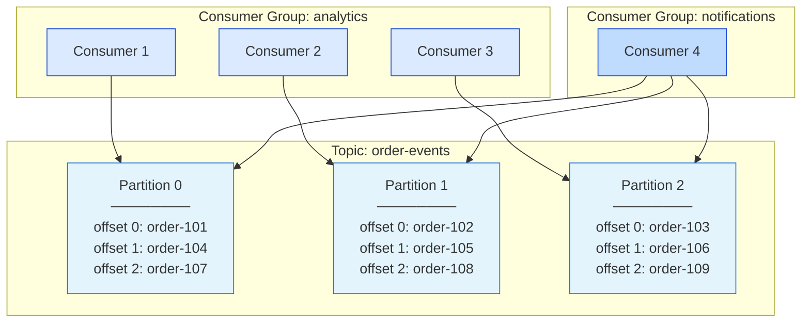
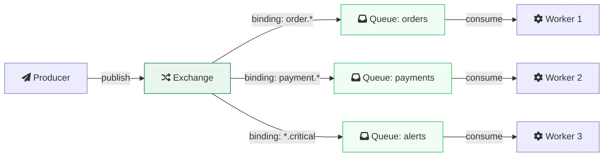
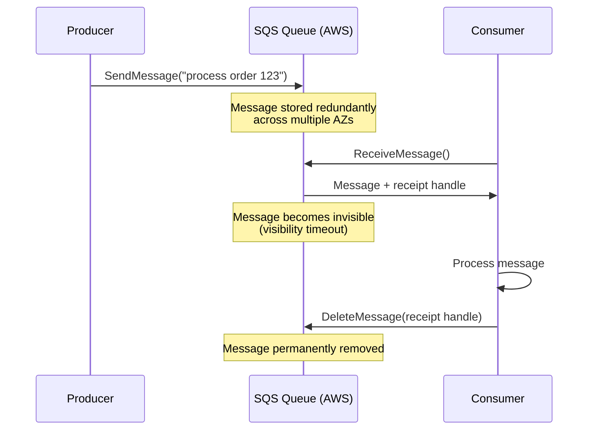
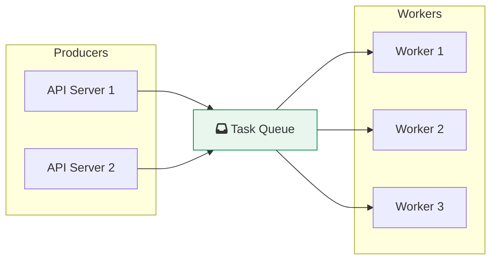
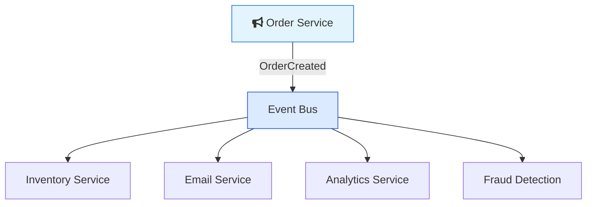
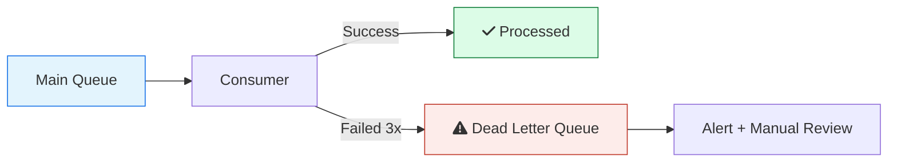

Kafka, RabbitMQ, and Amazon SQS all move messages from one place to another. But they are built on fundamentally different ideas about how messaging should work. Pick the wrong one and you will either overpay, under-deliver, or spend weeks fighting the tool instead of building your product.

This guide covers the real differences so you can make that decision with your eyes open.

> **TL;DR**: Use Kafka for high-throughput event streaming with replay. Use RabbitMQ for flexible routing and traditional work queues. Use SQS for simple AWS-native queuing with zero ops. At scale, many companies use more than one.

If you want a broader picture of how queues fit into system architecture, start with [Role of Queues in System Design](/role-of-queues-in-system-design/).

---

## Quick Comparison

| | Kafka | RabbitMQ | Amazon SQS |
|---|---|---|---|
| **Type** | Distributed commit log | Message broker (AMQP) | Managed cloud queue |
| **Throughput** | Millions of msgs/sec | ~100K msgs/sec (with confirms) | Nearly unlimited (Standard) |
| **Latency** | Low (batched) | Very low (sub-ms possible) | Medium (network round-trip) |
| **Message retention** | Days/weeks/indefinitely | Until consumed (queues) or configurable (streams) | Up to 14 days |
| **Message replay** | Yes | Yes (streams only) | No |
| **Ordering** | Per partition | Per queue | Per message group (FIFO only) |
| **Delivery guarantee** | At-least-once, exactly-once | At-least-once | At-least-once (Standard), exactly-once (FIFO) |
| **Routing** | Topic + partitions | Exchanges (direct, topic, fanout, headers) | Queue-level only (SNS for fan-out) |
| **Max message size** | 1 MB (configurable) | 16 MB default (up to 512 MB) | 256 KB |
| **Ops overhead** | High (cluster management) | Medium (single node to cluster) | None (fully managed) |
| **Cost model** | Infrastructure + ops | Infrastructure + ops | Pay per request ($0.40/M) |
| **Best for** | Event streaming, log aggregation, multiple consumers | Complex routing, task queues, request-reply | Serverless, simple decoupling, AWS-native |

---

## How They Think About Messages

This is the part that matters most and the part most comparison articles skip. These three tools are built on different philosophies. Understanding the philosophy tells you more than any benchmark.

<pre><code class="language-mermaid">
flowchart TB
    subgraph KF["fa:fa-stream Kafka: The Commit Log"]
        direction LR
        KP["Producer"] -->|"append"| KL["Partition Log\n─────────────\noffset 0: msg A\noffset 1: msg B\noffset 2: msg C\noffset 3: msg D"]
        KL -->|"read at offset 1"| KC1["Consumer A"]
        KL -->|"read at offset 3"| KC2["Consumer B"]
    end

    subgraph RB["fa:fa-exchange-alt RabbitMQ: The Smart Router"]
        direction LR
        RP["Producer"] -->|"publish"| RE["Exchange\n(routing rules)"]
        RE -->|"route"| RQ1["Queue 1"]
        RE -->|"route"| RQ2["Queue 2"]
        RQ1 -->|"deliver + delete"| RC1["Consumer A"]
        RQ2 -->|"deliver + delete"| RC2["Consumer B"]
    end

    subgraph SQ["fa:fa-cloud SQS: The Managed Pipe"]
        direction LR
        SP["Producer"] -->|"send"| SQQ["SQS Queue\n(AWS manages\neverything)"]
        SQQ -->|"receive + delete"| SC1["Consumer"]
    end

    KF ~~~ RB
    RB ~~~ SQ

    style KF fill:#e3f4fd,stroke:#1a73e8,color:#0d2137
    style RB fill:#e8f6ee,stroke:#00884A,color:#0d2137
    style SQ fill:#fff4e0,stroke:#e07b00,color:#0d2137
</code></pre>

**Kafka says**: "I am a log. You append to me. I keep everything. You read wherever you want, as many times as you want."

**RabbitMQ says**: "I am a router. You give me a message and routing rules. I figure out which queue it goes to. Once a consumer processes it, it is gone."

**SQS says**: "I am a pipe. You put messages in, consumers take them out. I handle the infrastructure. Keep it simple."

These philosophies drive every design decision in each system. If you understand this, the rest of the differences make sense.

---

## <i class="fas fa-stream"></i> Apache Kafka

Kafka was created at LinkedIn and open-sourced in 2011 to solve a specific problem: how do you move billions of events per day between hundreds of services without anything falling over? Traditional message queues could not keep up. Databases were too slow for append-heavy workloads. So they built a distributed commit log.

For a deep dive into Kafka internals, see [How Kafka Works: The Engine Behind Real-Time Data Pipelines](/distributed-systems/how-kafka-works/).

### How Kafka Works

Kafka stores messages in an append-only log, organized into **topics** split across **partitions**. Producers append messages to the end of a partition. Consumers read at their own pace by tracking an **offset**, which is just a position in the log.

This is the same idea behind the [Write-Ahead Log](/distributed-systems/write-ahead-log/) that databases use for durability. Simple, but extremely powerful.

The key ideas:

- **Messages are not deleted after consumption.** They stay in the log for a configurable retention period (hours, days, weeks, or forever). Multiple consumer groups can read the same data independently. This is what makes Kafka fundamentally different from a queue.

- **Ordering is guaranteed within a partition, not across partitions.** If you need all messages for a specific user to be in order, use the user ID as the partition key. Kafka hashes the key to pick the partition.

- **Consumer groups allow parallel processing.** Each partition is assigned to exactly one consumer within a group. If a consumer dies, Kafka reassigns its partitions to other consumers in the group.

- **Replication keeps data safe.** Each partition is replicated across multiple brokers. If the leader broker dies, a follower takes over.

### Kafka 4.0: ZooKeeper is Gone

Kafka 4.0 (released March 2025) removed ZooKeeper entirely. This is not a soft deprecation. ZooKeeper is gone. [KRaft mode](https://kafka.apache.org/40/getting-started/zk2kraft/) is now the only way to run a Kafka cluster.

What this means for you:

- **Simpler deployment.** You run one system instead of two. No more managing a separate ZooKeeper ensemble.
- **More partitions.** KRaft supports up to ~2 million partitions per cluster, compared to ~200,000 with ZooKeeper.
- **Faster failover.** Controller elections happen through the Raft protocol, which is faster than ZooKeeper-coordinated failover.
- **Single security configuration.** One set of TLS certificates instead of configuring both Kafka and ZooKeeper.

If you are running Kafka 3.x with ZooKeeper, you need to migrate to KRaft before upgrading to 4.0.

### Kafka Performance

Kafka achieves high throughput by doing a few things differently from traditional message brokers:

- **Sequential disk I/O.** Kafka writes to an append-only log. Sequential writes are fast, even on spinning disks. Random writes are not.
- **Batching.** Producers batch messages before sending. Consumers fetch batches. This reduces network round-trips.
- **Zero-copy transfer.** Kafka uses the `sendfile()` system call to transfer data from disk to network socket without copying it through application memory.
- **Page cache.** Kafka relies on the OS page cache for reads. Recent messages are served from memory without Kafka doing any caching itself.

Confluent's benchmarks show [Kafka achieving 605 MB/s peak throughput with p99 latency of 5ms at 200 MB/s load](https://developer.confluent.io/learn/kafka-performance). In terms of messages per second, Kafka clusters at companies like Uber handle over [12 million messages per second](https://www.uber.com/en-US/blog/kafka-async-queuing-with-consumer-proxy/).

The trade-off: Kafka optimizes for throughput, not per-message latency. It batches messages, which adds a small delay. If you need sub-millisecond delivery of individual messages, RabbitMQ is faster.

### When Kafka is the Right Choice

- **Event streaming.** You have a continuous flow of events (clicks, transactions, sensor readings) and multiple downstream consumers need to process them independently.
- **Event sourcing.** You want to store the full history of state changes and rebuild state by replaying events.
- **Log aggregation.** Collecting logs from hundreds of services into a central pipeline for processing.
- **Stream processing.** Real-time transformations, aggregations, and windowed computations using Kafka Streams or ksqlDB.
- **Multiple consumers for the same data.** The analytics team, the fraud team, and the notification team all need the same order events. Kafka lets each team consume independently without affecting the others.

### When Kafka is the Wrong Choice

- **Simple task queues.** If you just want to distribute work across workers and each message should be processed once, Kafka is overkill. RabbitMQ or SQS is simpler.
- **Low message volume.** If you are processing hundreds of messages per minute, a Kafka cluster is a waste of money and operational effort.
- **Complex routing.** If messages need to be routed to different consumers based on content, headers, or patterns, RabbitMQ's exchange system handles this natively. Kafka makes you do it yourself.
- **Request-reply patterns.** RPC over Kafka is possible but awkward. RabbitMQ has built-in support for request-reply.

### Who Uses Kafka

- **Uber**: Trillions of messages daily, over 300 microservices connected through Kafka
- **Stripe**: Powers payment event processing with 99.9999% availability
- **Netflix**: Real-time data pipelines for recommendations and analytics
- **LinkedIn**: The company that built Kafka, processing hundreds of billions of events per day
- **PayPal**: Streams over a trillion events per day through Kafka

---

## <i class="fas fa-exchange-alt"></i> RabbitMQ

RabbitMQ was first released in 2007. It implements the AMQP (Advanced Message Queuing Protocol) standard and is the most widely deployed open-source message broker. Where Kafka is a log, RabbitMQ is a router.

### How RabbitMQ Works

RabbitMQ uses a model with four main components: producers, exchanges, queues, and consumers.

The **exchange** is the key concept that separates RabbitMQ from Kafka and SQS. Producers never send messages directly to queues. They publish to an exchange with a routing key. The exchange uses its type and bindings to decide which queues receive the message.

**Exchange types:**

- **Direct**: Routes to queues where the binding key exactly matches the routing key. One message, one destination.
- **Topic**: Routes using wildcard pattern matching. `order.*` matches `order.created` and `order.cancelled`. `#.critical` matches anything ending in `.critical`.
- **Fanout**: Broadcasts to all bound queues. Every queue gets a copy. This is RabbitMQ's version of pub/sub.
- **Headers**: Routes based on message header attributes instead of routing keys. More flexible but less common.

This routing flexibility is something neither Kafka nor SQS offer natively.

### Traditional Queues vs Streams

RabbitMQ has two ways to handle messages now:

<pre><code class="language-mermaid">
flowchart TB
    subgraph CQ["fa:fa-inbox Classic/Quorum Queues"]
        direction LR
        CQP["Producer"] -->|"publish"| CQQ["Queue\n(in memory/disk)"]
        CQQ -->|"deliver"| CQC["Consumer"]
        CQQ -->|"ACK received"| CQD["Message deleted"]
    end

    subgraph ST["fa:fa-stream Streams"]
        direction LR
        STP["Producer"] -->|"append"| STL["Stream\n(append-only log)"]
        STL -->|"read at offset 5"| STC1["Consumer A"]
        STL -->|"read at offset 2"| STC2["Consumer B"]
    end

    CQ ~~~ ST

    style CQ fill:#e8f6ee,stroke:#00884A,color:#0d2137
    style ST fill:#dbeafe,stroke:#1d4ed8,color:#0d2137
</code></pre>

**Quorum queues** (the recommended queue type since RabbitMQ 4.0) use the Raft consensus algorithm for replication. Messages are delivered to a consumer, acknowledged, and deleted. This is the traditional message queue behavior. Classic queue mirroring was removed in RabbitMQ 4.0.

**Streams** (introduced in RabbitMQ 3.9) use an append-only log, similar to Kafka. Messages are not deleted after consumption. Multiple consumers can read from different offsets. This gives RabbitMQ replay capability, though the ecosystem around it is less mature than Kafka's.

### RabbitMQ Performance

[Recent benchmarks with RabbitMQ 4.0](https://danubedata.ro/blog/rabbitmq-performance-benchmarks-120k-messages-per-second-2026) show:

- **Without publisher confirms (auto-ack)**: ~123,000 messages per second
- **With publisher confirms (batch of 5,000)**: ~108,000 messages per second
- **With publisher confirms (batch of 1,000)**: ~18,500 messages per second

The batch size for publisher confirms has a large impact on throughput. In production, you want publisher confirms on (otherwise you risk losing messages), so the 100K figure is the realistic ceiling for most deployments.

RabbitMQ's strength is per-message latency. Individual messages can be delivered in sub-millisecond time, which is faster than Kafka's batch-oriented approach.

RabbitMQ 4.1 improved quorum queue performance further by offloading log reads to channels, which [reduces publisher interference on delivery rates](https://rabbitmq.com/blog/2025/04/15/rabbitmq-4.1.0-is-released).

### When RabbitMQ is the Right Choice

- **Complex routing.** You need messages routed to different queues based on type, priority, or content. RabbitMQ's exchange system handles this without application code.
- **Work queues.** You want to distribute tasks across a pool of workers where each task is processed exactly once. This is RabbitMQ's bread and butter.
- **Request-reply patterns.** RabbitMQ has built-in support for RPC: send a request to a queue, get a response on a reply queue.
- **Protocol diversity.** Your system uses AMQP, MQTT (IoT devices), or STOMP (web sockets). RabbitMQ speaks all three. RabbitMQ 4.1 added full MQTT 5.0 support.
- **Moderate throughput needs.** You are processing tens of thousands of messages per second, not millions. RabbitMQ handles this without the operational complexity of Kafka.

### When RabbitMQ is the Wrong Choice

- **High-throughput event streaming.** If you need millions of messages per second, RabbitMQ will hit its ceiling. Kafka is built for this.
- **Message replay.** RabbitMQ Streams support replay, but the tooling and ecosystem are not as mature as Kafka's. If replay is a core requirement, Kafka is the safer choice.
- **Multiple independent consumer groups.** Kafka's consumer group model is designed for this. With RabbitMQ, you need to set up fanout exchanges and separate queues for each consumer, which works but is more manual.
- **Long-term message storage.** Kafka can retain messages for weeks or months. RabbitMQ is not designed for long-term storage.

### Who Uses RabbitMQ

- **Goldman Sachs**: Trade processing and internal messaging
- **Reddit**: Asynchronous task processing
- **Mozilla**: Push notification delivery
- **Zalando**: Order processing and event distribution
- **Government agencies and banks**: RabbitMQ's AMQP compliance makes it a go-to for regulated industries

---

## <i class="fas fa-cloud"></i> Amazon SQS

Amazon SQS was the first AWS service ever launched, introduced in beta in 2004 and reaching general availability in 2006. It is the simplest option in this comparison. There are no brokers to manage, no clusters to configure, no disks to monitor. You create a queue, send messages, and receive messages. AWS handles everything else.

### How SQS Works

SQS uses a **pull model**. Consumers poll the queue for messages. When a consumer receives a message, it becomes invisible to other consumers for a configurable **visibility timeout**. If the consumer processes the message and deletes it, it is gone. If the consumer crashes and the visibility timeout expires, the message becomes visible again for another consumer to pick up.

### Standard vs FIFO Queues

SQS comes in two flavors, and picking the wrong one is a common mistake.

<pre><code class="language-mermaid">
flowchart TB
    subgraph STD["fa:fa-bolt Standard Queue"]
        direction TB
        STD_T["Nearly unlimited throughput"]
        STD_D["At-least-once delivery\n(may deliver duplicates)"]
        STD_O["Best-effort ordering\n(may arrive out of order)"]
    end

    subgraph FIFO["fa:fa-list-ol FIFO Queue"]
        direction TB
        FIFO_T["3,000 msgs/sec default\n(up to 70K with high throughput)"]
        FIFO_D["Exactly-once processing\n(deduplication built in)"]
        FIFO_O["Strict ordering\n(within message group)"]
    end

    STD ~~~ FIFO

    style STD fill:#fff4e0,stroke:#e07b00,color:#0d2137
    style FIFO fill:#dbeafe,stroke:#1d4ed8,color:#0d2137
</code></pre>

**Standard queues** offer nearly unlimited throughput. But messages might be delivered more than once, and they might arrive out of order. For most use cases (sending emails, processing images, triggering notifications), this is fine. Your consumer should be idempotent anyway.

**FIFO queues** guarantee exactly-once processing and strict ordering within a message group. Default throughput is 300 transactions per second per API action, or 3,000 messages per second with batching. High throughput mode pushes this to 9,000+ TPS per API action in major regions (up to 70,000 with batching), but requires a warm-up period and careful message group design.

### SQS Pricing

SQS pricing is straightforward and can be surprisingly cheap or surprisingly expensive depending on your pattern:

- **Standard queues**: $0.40 per million requests
- **FIFO queues**: $0.50 per million requests
- **Free tier**: First 1 million requests per month are free

The catch: every API call counts as a request. `SendMessage`, `ReceiveMessage`, `DeleteMessage` are each separate requests. A single message lifecycle is at least three requests. If you are polling with `ReceiveMessage` and the queue is empty, you are still paying for those requests.

**Long polling** helps. Instead of returning immediately when the queue is empty, long polling waits up to 20 seconds for a message to arrive. This reduces empty responses and saves money.

At low volume, SQS is almost free. At high volume, costs add up. [One team discovered their SQS bill was $3,000 per month more than expected](https://cloudwithazeem.medium.com/kafka-vs-rabbitmq-vs-aws-sqs-how-i-watched-a-safe-choice-quietly-bleed-3-000-a-month-96acef1ebe34) because of aggressive polling patterns.

### When SQS is the Right Choice

- **Serverless architectures.** SQS integrates natively with Lambda. A message hits the queue, Lambda invokes your function. No servers to manage.
- **Simple decoupling.** You have two services and want to decouple them. You do not need complex routing, replay, or streaming. SQS takes five minutes to set up.
- **AWS-native systems.** Your infrastructure is already on AWS. SQS works with IAM, CloudWatch, SNS, Lambda, and Step Functions out of the box.
- **Variable traffic.** SQS scales to zero when idle and scales to nearly unlimited throughput during spikes. No capacity planning needed.
- **Small teams without DevOps.** You do not have the bandwidth to operate a Kafka or RabbitMQ cluster. SQS lets you focus on your application.

### When SQS is the Wrong Choice

- **Message replay.** SQS deletes messages after they are processed. There is no way to go back and reprocess old messages.
- **Complex routing.** SQS has no exchange or routing mechanism. One queue, one type of message. You can use SNS for fan-out, but it is not as flexible as RabbitMQ exchanges.
- **Cross-cloud or on-premises.** SQS is AWS only. If you need to run the same messaging system on-premises or across cloud providers, Kafka or RabbitMQ are portable.
- **Sub-millisecond latency.** SQS adds network latency because it is a remote service. If you need the fastest possible message delivery, a locally deployed RabbitMQ instance is faster.
- **High-throughput FIFO.** SQS FIFO high throughput mode can reach 9,000+ TPS, but if you need ordered messages at rates beyond that with consistent low latency, Kafka partitions with key-based ordering scale further.

### Who Uses SQS

- **Capital One**: Decoupling microservices in banking applications
- **Airbnb**: Background job processing and notification delivery
- **BMW**: IoT data ingestion from connected vehicles
- **Duolingo**: Serverless event processing with Lambda triggers
- Most companies on AWS use SQS somewhere in their stack, even alongside Kafka or RabbitMQ

---

## Architecture Patterns Compared

Different messaging patterns work better with different brokers. Here is how each one handles the most common patterns.

### Pattern 1: Work Queue (Task Distribution)

Distribute tasks across a pool of workers. Each task should be processed exactly once.

| | Kafka | RabbitMQ | SQS |
|---|---|---|---|
| **Fit** | Possible but not ideal | Native and excellent | Native and simple |
| **How** | Consumer group with one consumer per partition | Workers consume from a shared queue | Workers poll the queue |
| **Gotcha** | If you have 3 partitions and 5 workers, 2 workers sit idle | Just works | Visibility timeout must exceed processing time |

**Verdict**: RabbitMQ or SQS. Kafka can do this, but it is like using a firehose to water a garden.

### Pattern 2: Fan-Out (Event Broadcasting)

One event needs to reach multiple independent consumers.

| | Kafka | RabbitMQ | SQS |
|---|---|---|---|
| **Fit** | Excellent | Good | Needs SNS |
| **How** | Multiple consumer groups on the same topic | Fanout exchange broadcasts to all bound queues | SNS topic fans out to multiple SQS queues |
| **Gotcha** | None, this is what Kafka is built for | More queues to manage | SNS + SQS adds complexity |

**Verdict**: Kafka. This is its strongest pattern. Each consumer group reads independently, at its own pace, and can replay if it falls behind. If you are building an event-driven architecture, Kafka's consumer group model is hard to beat. For a deeper look at event-driven patterns, see [CQRS Pattern Guide](/cqrs-pattern-guide/).

### Pattern 3: Request-Reply (RPC over Messages)

Send a request message and wait for a response.

| | Kafka | RabbitMQ | SQS |
|---|---|---|---|
| **Fit** | Awkward | Native support | Manual |
| **How** | Produce to request topic, consume from response topic with correlation ID | Built-in reply-to queue and correlation ID | Send to request queue, poll response queue |
| **Gotcha** | High latency, complex to implement | Just works with AMQP | Polling adds latency |

**Verdict**: RabbitMQ. It has built-in support for the request-reply pattern with reply-to addresses and correlation IDs. Do not try to build RPC on top of Kafka unless you have a very good reason.

### Pattern 4: Event Sourcing

Store every state change as an immutable event. Rebuild current state by replaying the event log.

| | Kafka | RabbitMQ | SQS |
|---|---|---|---|
| **Fit** | Excellent | Poor | Not possible |
| **How** | Topic with long retention, replay from offset 0 | Streams offer partial support | No replay capability |
| **Gotcha** | Log compaction needed for long-lived entities | Streams are new and less battle-tested | Cannot replay deleted messages |

**Verdict**: Kafka. Event sourcing requires an immutable, replayable log. That is literally what Kafka is.

---

## Delivery Guarantees: The Details That Bite You

Message delivery guarantees sound simple until you are debugging a production issue at 2 AM.

### At-Least-Once vs Exactly-Once vs At-Most-Once

<pre><code class="language-mermaid">
flowchart LR
    subgraph AMO["At-Most-Once"]
        direction TB
        AMO_D["Fire and forget.\nMessage may be lost.\nNever duplicated."]
    end

    subgraph ALO["At-Least-Once"]
        direction TB
        ALO_D["Guaranteed delivery.\nMay get duplicates.\nConsumer must be\nidempotent."]
    end

    subgraph EO["Exactly-Once"]
        direction TB
        EO_D["No loss, no duplicates.\nHardest to implement.\nPerformance cost."]
    end

    AMO ~~~ ALO
    ALO ~~~ EO

    style AMO fill:#fdecea,stroke:#c0392b,color:#3d0a07
    style ALO fill:#fff4e0,stroke:#e07b00,color:#0d2137
    style EO fill:#dcfce7,stroke:#15803d,color:#052e16
</code></pre>

**Kafka**: At-least-once by default. Exactly-once is available with idempotent producers (enabled by default since Kafka 3.0) and transactional IDs. On the consumer side, you need to set `isolation.level=read_committed` to only read committed transactional messages. Kafka 4.0 added server-side transaction defenses (KIP-890) to make exactly-once more robust. The performance cost of exactly-once is around 3-5% lower throughput.

**RabbitMQ**: At-least-once with publisher confirms and consumer acknowledgments. At-most-once if you use auto-ack (not recommended in production). RabbitMQ does not offer exactly-once delivery natively. You need idempotent consumers.

**SQS Standard**: At-least-once. Messages may be delivered more than once. Your consumer must handle duplicates.

**SQS FIFO**: Exactly-once processing with built-in deduplication. You provide a `MessageDeduplicationId` and SQS prevents duplicates within a 5-minute window.

**The practical advice**: Build idempotent consumers regardless of which broker you use. Even with exactly-once guarantees, network partitions, retries, and application bugs can cause duplicates. Idempotency is your safety net. If you also need to guarantee that events are published reliably from your database to the broker, look at the [Transactional Outbox Pattern](/transactional-outbox-pattern/).

---

## Dead Letter Queues

All three support dead letter queues (DLQ), but the implementation varies.

**SQS**: Built-in. Set a `maxReceiveCount` on the source queue and point it to a DLQ. After the message has been received (and not deleted) that many times, SQS moves it to the DLQ automatically.

**RabbitMQ**: Configure a dead letter exchange on the queue. When a message is rejected or its TTL expires, RabbitMQ routes it to the dead letter exchange, which delivers it to a DLQ.

**Kafka**: No built-in DLQ. You implement it in your consumer code. When processing fails after retries, produce the message to a separate `<topic>-dlq` topic. This is more work but gives you full control.

For more on this pattern, see the DLQ section in [Role of Queues in System Design](/role-of-queues-in-system-design/).

---

## Operations and Infrastructure

This is where the three options diverge the most.

### Kafka: High Operational Effort

Running Kafka means running a distributed system. Even with KRaft replacing ZooKeeper, you are still managing:

- **Broker nodes.** Typically 3+ brokers for production. Each needs fast disks (SSDs or NVMe) and enough RAM for the page cache.
- **Partition rebalancing.** When you add or remove brokers, partitions need to be redistributed. This is a manual operation that can take hours on large clusters.
- **Consumer group management.** Consumer rebalancing during deployments can cause processing pauses. Kafka 4.0's redesigned rebalance protocol (KIP-848) reduces this, but it is still something you monitor.
- **Retention and disk usage.** Messages accumulate. You need enough disk for your retention period. Kafka 4.0's tiered storage (offloading old segments to S3/GCS) helps, but it is a new feature.
- **Monitoring.** Under-replicated partitions, consumer lag, broker disk usage, request latency. You need dashboards and alerts. See [Distributed Tracing: Jaeger vs Tempo vs Zipkin](/distributed-tracing-jaeger-vs-tempo-vs-zipkin/) for how to trace messages flowing through your broker.

**Managed alternatives**: Confluent Cloud, Amazon MSK, Aiven, and Redpanda Cloud reduce ops overhead but cost more than self-managed.

### RabbitMQ: Medium Operational Effort

RabbitMQ is simpler than Kafka to operate, especially for smaller deployments.

- **Single node for dev/test.** A single RabbitMQ server handles most development workloads.
- **Clustering for production.** A 3-node cluster with quorum queues gives you high availability. RabbitMQ 4.1 added a new peer discovery mechanism for Kubernetes.
- **Management UI.** RabbitMQ ships with a built-in management dashboard for monitoring queues, exchanges, connections, and message rates.
- **Memory pressure.** RabbitMQ can hit memory limits if consumers fall behind and messages pile up. Set memory high watermarks and use flow control.

**Managed alternatives**: CloudAMQP, Amazon MQ, and most cloud providers offer managed RabbitMQ.

### SQS: Zero Operational Effort

There is nothing to operate. No servers. No disks. No clusters. No patches. No failover planning. AWS runs it all. You focus on your application code.

The trade-off: you get fewer knobs to turn. If you need to tune something SQS does not expose, you are stuck.

---

## Cost Comparison

Cost depends heavily on your volume, retention requirements, and team size. Here is a rough comparison for three different scales.

### Low Volume: 10,000 messages/day

| | Kafka | RabbitMQ | SQS |
|---|---|---|---|
| **Infrastructure** | 3 brokers, ~$300/month | 1 small server, ~$50/month | $0 (free tier) |
| **Ops cost** | High (overkill) | Low | None |
| **Total** | ~$300+/month | ~$50/month | ~$0/month |

**Winner**: SQS. Do not run a Kafka cluster for 10,000 messages a day.

### Medium Volume: 1 million messages/day

| | Kafka | RabbitMQ | SQS |
|---|---|---|---|
| **Infrastructure** | 3 brokers, ~$500/month | 3-node cluster, ~$300/month | ~$40/month |
| **Ops cost** | Medium | Low-medium | None |
| **Total** | ~$500+/month | ~$300/month | ~$40/month |

**Winner**: SQS if you are on AWS and do not need replay. RabbitMQ if you need routing.

### High Volume: 100 million messages/day

| | Kafka | RabbitMQ | SQS |
|---|---|---|---|
| **Infrastructure** | 5+ brokers, ~$2,000/month | Struggling at this scale | ~$4,000/month (3 API calls per message) |
| **Ops cost** | High | Very high | None |
| **Total** | ~$2,000+/month | Not recommended | ~$4,000/month |

**Winner**: Kafka. At this scale, Kafka's throughput efficiency and ability to serve multiple consumer groups from the same data makes it the most cost-effective option. SQS gets expensive because every API call costs money.

---

## Decision Flowchart

When you are not sure which one to pick, work through this:

<pre><code class="language-mermaid">
flowchart TD
    Start["What are you building?"] --> Q1{"Need message\nreplay?"}

    Q1 -->|"Yes"| Kafka["fa:fa-stream Use Kafka"]
    Q1 -->|"No"| Q2{"Need complex\nrouting?"}

    Q2 -->|"Yes"| RabbitMQ["fa:fa-exchange-alt Use RabbitMQ"]
    Q2 -->|"No"| Q3{"On AWS with\nlow ops budget?"}

    Q3 -->|"Yes"| SQS["fa:fa-cloud Use SQS"]
    Q3 -->|"No"| Q4{"Throughput >\n100K msgs/sec?"}

    Q4 -->|"Yes"| Kafka
    Q4 -->|"No"| Q5{"Need request-reply\nor priority queues?"}

    Q5 -->|"Yes"| RabbitMQ
    Q5 -->|"No"| Q6{"Want zero\ninfra management?"}

    Q6 -->|"Yes"| SQS
    Q6 -->|"No"| RabbitMQ

    style Kafka fill:#e3f4fd,stroke:#1a73e8,color:#0d2137
    style RabbitMQ fill:#e8f6ee,stroke:#00884A,color:#0d2137
    style SQS fill:#fff4e0,stroke:#e07b00,color:#0d2137
    style Start fill:#f1f5f9,stroke:#64748b,color:#0d2137
</code></pre>

---

## Combining Brokers: The Real-World Approach

Most large systems do not pick just one. They use different brokers for different problems.

A common pattern at companies like Uber and Netflix:

<pre><code class="language-mermaid">
flowchart TB
    subgraph APP["Application Layer"]
        API["API Servers"]
        Workers["Background Workers"]
    end

    subgraph MSG["Messaging Layer"]
        direction LR
        KFK["fa:fa-stream Kafka\n(event streaming)"]
        RMQ["fa:fa-exchange-alt RabbitMQ\n(task queues)"]
        SQSQ["fa:fa-cloud SQS\n(serverless triggers)"]
    end

    API -->|"user events, clicks,\ntransactions"| KFK
    API -->|"send email,\nprocess image"| RMQ
    API -->|"trigger Lambda,\nAsync webhook"| SQSQ

    KFK -->|"analytics pipeline"| DW["Data Warehouse"]
    KFK -->|"real-time"| Stream["Stream Processing"]
    RMQ -->|"task execution"| Workers
    SQSQ -->|"invoke"| Lambda["AWS Lambda"]

    style KFK fill:#e3f4fd,stroke:#1a73e8,color:#0d2137
    style RMQ fill:#e8f6ee,stroke:#00884A,color:#0d2137
    style SQSQ fill:#fff4e0,stroke:#e07b00,color:#0d2137
</code></pre>

- **Kafka** handles the high-volume event stream: user activity, transactions, logs. Multiple teams consume from the same topics.
- **RabbitMQ** handles task distribution: sending emails, generating reports, processing uploads. Work queues where each message is processed once.
- **SQS** handles serverless glue: triggering Lambda functions, connecting AWS services, simple async decoupling.

There is no rule that says you can only use one. Use the right tool for each job. If you are designing a system from scratch and want to understand how all these pieces fit together, the [System Design Cheat Sheet](/system-design-cheat-sheet/) covers the building blocks.

---

## Common Mistakes

After seeing teams pick and run message brokers for years, these are the mistakes that come up most often.

**1. Using Kafka for simple task queues.** If each message should be processed exactly once by one worker, and you do not need replay or multiple consumers, Kafka adds complexity you do not need. RabbitMQ or SQS is simpler and cheaper.

**2. Ignoring idempotency.** All three brokers can deliver messages more than once in edge cases. If your consumer creates a charge or sends an email every time it receives a message, duplicates will cause real damage. Build idempotent consumers from day one.

**3. Not setting up dead letter queues.** A malformed message will retry forever and block your entire queue. Always configure a DLQ to catch poison messages before they become an incident.

**4. Treating SQS like Kafka.** SQS deletes messages after consumption. You cannot replay. If you build a system that depends on reprocessing old messages, SQS will not work.

**5. Underestimating Kafka ops.** Kafka is powerful but demanding. Partition rebalancing, broker failures, consumer lag monitoring, disk management. If you do not have the team to operate it, use a managed service or pick a simpler broker.

**6. Polling SQS too aggressively.** Every `ReceiveMessage` call costs money, even if the queue is empty. Use long polling (up to 20 seconds) to reduce empty responses and keep your SQS bill under control.

**7. Wrong SQS queue type.** Standard queues can deliver duplicates and reorder messages. If your application cannot handle that, use FIFO. Default FIFO throughput is 3,000 messages per second with batching, though high throughput mode can increase this significantly.

**8. Not thinking about failure modes.** What happens when your consumer crashes? What happens when the broker goes down? What happens when your consumer is slower than your producer? Think through these scenarios before you go to production. A [circuit breaker](/circuit-breaker-pattern/) on the consumer side can prevent cascading failures.

---

## Final Thoughts

The right message broker depends on what problem you are solving, not what is trending on Hacker News.

**Kafka** is a distributed commit log built for high-throughput event streaming. It keeps messages for replay. Multiple consumer groups can read the same data independently. It is the backbone of data infrastructure at Uber, Stripe, Netflix, and LinkedIn. But it is complex to run and overkill for simple workloads.

**RabbitMQ** is a message broker built for flexible routing and reliable delivery. It speaks AMQP, MQTT, and STOMP. It has the best routing model of the three. It is the right choice for work queues, request-reply, and moderate-throughput messaging. It does not scale to Kafka levels and is not designed for long-term message storage.

**Amazon SQS** is a managed queue that costs nothing when idle and scales automatically. It is the simplest option and the right starting point for AWS-native applications that just need to decouple services. It cannot replay messages and has no routing intelligence.

Start with the simplest option that meets your requirements. SQS if you are on AWS and need a queue. RabbitMQ if you need routing or request-reply. Kafka if you need streaming, replay, or multiple consumers on the same data.

You can always add more later. Most large systems do.
