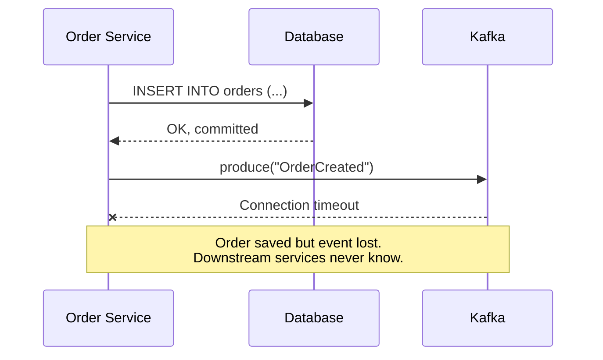
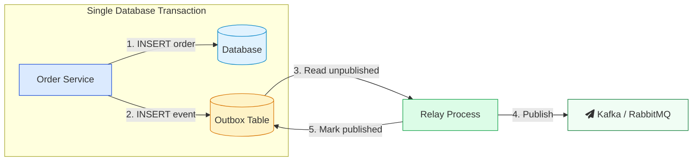
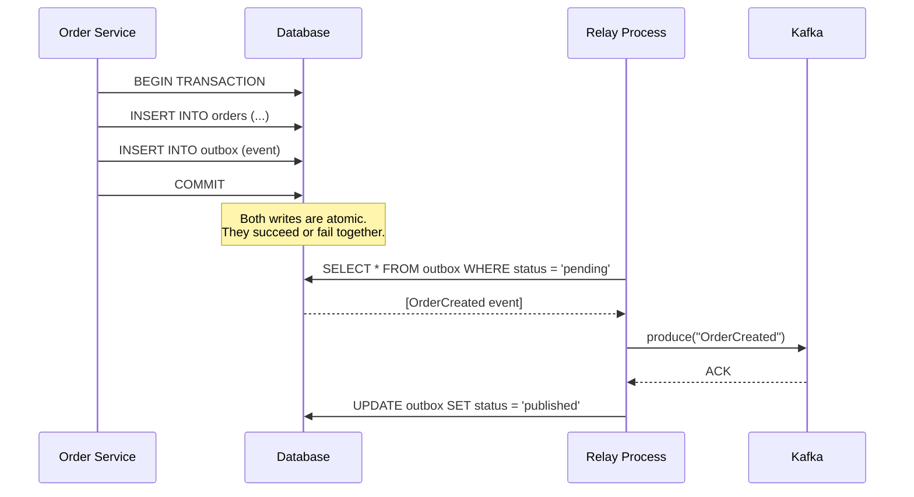
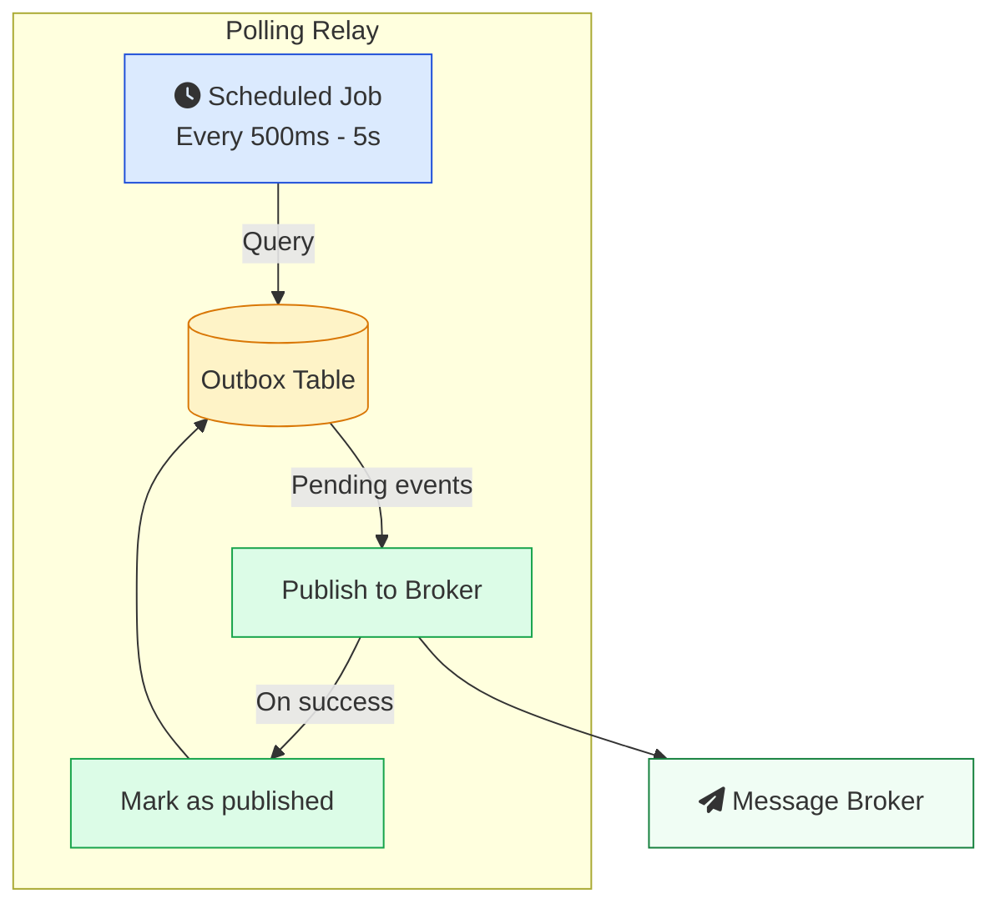
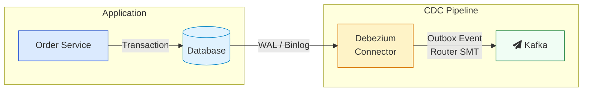
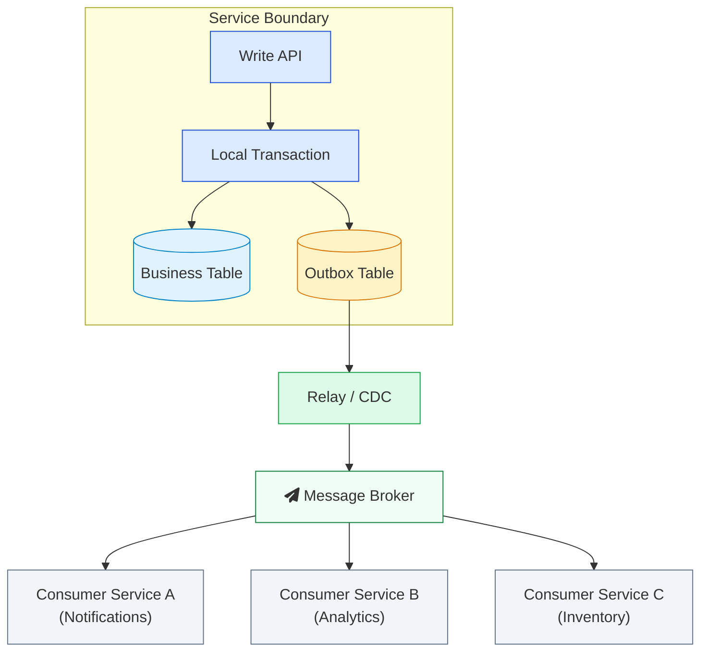
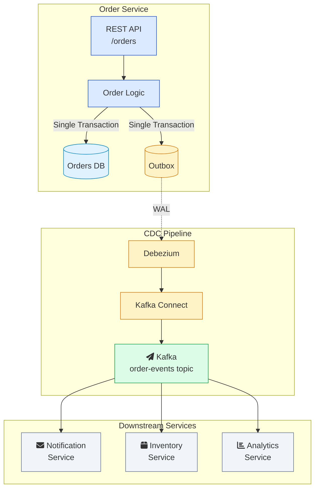

You have an Order Service. A customer places an order. You save it to the database. Then you publish an `OrderCreated` event to Kafka so that the Notification Service can send a confirmation email and the Inventory Service can reserve stock.

The database write succeeds. The Kafka publish fails. Network blip. Timeout. Broker is down for 30 seconds. Whatever the reason.

Now your order exists in the database, but no other service knows about it. The customer never gets a confirmation email. The inventory is never reserved. The downstream services are out of sync, and they have no way of knowing.

This is the **dual write problem**. And if you are building microservices with [event-driven architecture](/kafka-vs-rabbitmq-vs-sqs/), you will run into it sooner or later.

The **transactional outbox pattern** is how you fix it.

---

## <i class="fas fa-exclamation-triangle"></i> The Dual Write Problem

The dual write problem happens when a service needs to do two things that must succeed together:

1. Write to its database
2. Publish a message to a broker (Kafka, RabbitMQ, SQS, etc.)

These are two separate systems. They do not share a transaction. You cannot wrap a PostgreSQL `INSERT` and a Kafka `produce()` call in the same `BEGIN ... COMMIT`.

Here is what typically goes wrong:



There are a few variations of this failure:

**Scenario 1: Database succeeds, broker fails.** The order is saved but no event is published. Downstream services miss the event.

**Scenario 2: Broker succeeds, database fails.** The event is published but the database transaction rolls back. Other services act on an event for an order that does not exist.

**Scenario 3: Service crashes between the two writes.** The database committed, but the service died before it could call the broker. The event is gone.

Every one of these scenarios leaves your system in an inconsistent state. And they are not edge cases. In a distributed system running thousands of transactions per second, these failures happen regularly.

### Why "just retry" does not work

Your first instinct might be to catch the broker failure and retry. But this creates new problems:

- **What if the service crashes before the retry?** The event is still lost.
- **What if the retry succeeds but the original also went through?** Now you have duplicate events.
- **What if you retry the database write too?** Now you might have duplicate orders.

Retrying without a proper pattern is putting a band-aid on a broken bone. You need a structural fix.

### Why distributed transactions (2PC) are not the answer here

You might think: why not use [Two-Phase Commit (2PC)](/distributed-systems/two-phase-commit/) to coordinate the database and the broker? After all, 2PC exists to make multiple systems agree on a single transaction.

The problems with 2PC for this use case:

1. **Most message brokers do not support XA transactions.** Kafka does not. RabbitMQ does not. SQS does not.
2. **2PC is blocking.** If the coordinator goes down, participants are stuck holding locks.
3. **2PC kills throughput.** The round-trips and lock holding add significant latency.
4. **Tight coupling.** Your service becomes dependent on both the database and the broker being available at the same time.

2PC solves a different class of problems. For reliable event publishing from a single service, the outbox pattern is the right tool.

---

## <i class="fas fa-inbox"></i> How the Outbox Pattern Works

The idea is simple. Instead of writing to the database and publishing to the broker as two separate operations, you write everything to the database in one transaction. Then a separate process takes care of publishing.

Three components:

1. **Your service** writes business data and the event to the same database, in the same transaction.
2. **An outbox table** in your database stores events waiting to be published.
3. **A relay process** reads from the outbox table and publishes events to the message broker.



The trick is step 1 and step 2 happening in the same database transaction. If the transaction commits, both the order and the event are saved. If it rolls back, neither is saved. There is no window where one exists without the other.

The relay process runs independently. It picks up events from the outbox table and publishes them to the broker. If it crashes, no problem. On the next run, it picks up where it left off. Events are not lost because they are sitting safely in the database.

This is the core insight: **your database becomes the source of truth for events**, not the broker. The broker is just a delivery mechanism.

### Step by step

Let us walk through an order placement with the outbox pattern:



If Kafka is down when the relay runs, the event stays in the outbox table with `status = 'pending'`. The relay tries again on the next cycle. The event is eventually published once Kafka comes back up.

---

## <i class="fas fa-database"></i> Designing the Outbox Table

The outbox table schema matters more than you might think. A bad schema leads to slow queries, ordering problems, and operational headaches.

Here is a practical schema for PostgreSQL:

```sql
CREATE TABLE outbox_events (
    id              BIGSERIAL PRIMARY KEY,
    aggregate_type  VARCHAR(255) NOT NULL,
    aggregate_id    VARCHAR(255) NOT NULL,
    event_type      VARCHAR(255) NOT NULL,
    payload         JSONB NOT NULL,
    status          VARCHAR(20) NOT NULL DEFAULT 'pending',
    created_at      TIMESTAMPTZ NOT NULL DEFAULT NOW(),
    published_at    TIMESTAMPTZ,
    retry_count     INT NOT NULL DEFAULT 0
);

CREATE INDEX idx_outbox_pending ON outbox_events (status, id)
    WHERE status = 'pending';
```

And for MySQL:

```sql
CREATE TABLE outbox_events (
    id              BIGINT UNSIGNED NOT NULL AUTO_INCREMENT PRIMARY KEY,
    aggregate_type  VARCHAR(255) NOT NULL,
    aggregate_id    VARCHAR(255) NOT NULL,
    event_type      VARCHAR(255) NOT NULL,
    payload         JSON NOT NULL,
    status          VARCHAR(20) NOT NULL DEFAULT 'pending',
    created_at      TIMESTAMP NOT NULL DEFAULT CURRENT_TIMESTAMP,
    published_at    TIMESTAMP NULL,
    retry_count     INT NOT NULL DEFAULT 0,
    INDEX idx_outbox_pending (status, id)
) ENGINE=InnoDB DEFAULT CHARSET=utf8mb4;
```

### Column breakdown

| Column | Purpose |
|---|---|
| **id** | Auto-incrementing bigint. Gives you a total order of events. Do not use UUIDs here. Bigints are smaller, faster to index, and give you natural ordering. |
| **aggregate_type** | The type of entity this event relates to (e.g., `Order`, `Payment`, `User`). The relay uses this to route events to the correct Kafka topic. |
| **aggregate_id** | The ID of the specific entity (e.g., `order-123`). This becomes the message key in Kafka, which determines partition assignment. All events for the same entity go to the same partition, preserving order. |
| **event_type** | What happened (e.g., `OrderCreated`, `OrderShipped`, `PaymentFailed`). Consumers use this to decide how to handle the event. |
| **payload** | The event data as JSON. Contains everything a consumer needs to process the event. |
| **status** | `pending`, `published`, or `failed`. The relay queries for `pending` events. |
| **created_at** | When the event was created. Useful for monitoring lag and debugging. |
| **published_at** | When the event was successfully published. Useful for auditing. |
| **retry_count** | How many times the relay has attempted to publish this event. After a threshold (say 5 retries), move it to `failed` status for manual investigation. |

The partial index on `(status, id) WHERE status = 'pending'` is important. Without it, the relay query scans the entire table, which gets slow as the table grows. With the partial index, it only scans pending events.

### Writing to the outbox

Here is what the application code looks like. This is the critical part. Both writes happen in the same transaction:

```python
def place_order(order_data):
    with db.transaction():
        order = Order.create(
            customer_id=order_data['customer_id'],
            items=order_data['items'],
            total=order_data['total']
        )

        OutboxEvent.create(
            aggregate_type='Order',
            aggregate_id=str(order.id),
            event_type='OrderCreated',
            payload={
                'order_id': order.id,
                'customer_id': order.customer_id,
                'items': order.items,
                'total': order.total,
                'created_at': order.created_at.isoformat()
            }
        )

    return order
```

The `db.transaction()` context manager wraps both writes in a single database transaction. If the `OutboxEvent.create` call fails, the order is rolled back too. If the order creation fails, no outbox event is written.

---

## <i class="fas fa-sync-alt"></i> Relay Approach 1: Polling Publisher

The simplest way to get events out of the outbox table is polling. A background process runs on a timer, queries the outbox for pending events, publishes them, and marks them as published.



### Implementation

```python
import time
from kafka import KafkaProducer

producer = KafkaProducer(
    bootstrap_servers=['kafka:9092'],
    value_serializer=lambda v: json.dumps(v).encode('utf-8'),
    acks='all'
)

def poll_outbox():
    while True:
        with db.transaction():
            events = db.execute("""
                SELECT * FROM outbox_events
                WHERE status = 'pending'
                ORDER BY id ASC
                LIMIT 100
                FOR UPDATE SKIP LOCKED
            """)

            for event in events:
                try:
                    producer.send(
                        topic=event.aggregate_type.lower() + '-events',
                        key=event.aggregate_id.encode('utf-8'),
                        value=event.payload
                    ).get(timeout=10)

                    db.execute("""
                        UPDATE outbox_events
                        SET status = 'published', published_at = NOW()
                        WHERE id = %s
                    """, [event.id])

                except Exception as e:
                    db.execute("""
                        UPDATE outbox_events
                        SET retry_count = retry_count + 1,
                            status = CASE
                                WHEN retry_count >= 4 THEN 'failed'
                                ELSE 'pending'
                            END
                        WHERE id = %s
                    """, [event.id])

        time.sleep(1)
```

A few things worth noting:

- **`FOR UPDATE SKIP LOCKED`** is important if you run multiple relay instances. It locks the rows being processed so another instance does not pick up the same events. `SKIP LOCKED` means instead of waiting for the lock, the second instance skips already-locked rows and picks up different ones. Both PostgreSQL and MySQL support this.

- **`ORDER BY id ASC`** ensures events are published in the order they were created. This matters when event ordering is important (e.g., `OrderCreated` must come before `OrderShipped`).

- **`LIMIT 100`** processes events in batches to avoid loading too many rows into memory.

- **`acks='all'`** on the Kafka producer ensures the message is replicated before the broker acknowledges it. Without this, you could lose events if a Kafka broker dies right after accepting the message.

### Pros and cons of polling

**Pros:**
- Simple to implement. No additional infrastructure needed.
- Easy to understand and debug.
- Works with any database and any message broker.

**Cons:**
- **Latency.** Events are not published until the next poll cycle. If you poll every second, you have up to 1 second of delay.
- **Database load.** Constant queries against the outbox table, even when there are no new events.
- **Scaling limits.** Polling every 100ms to reduce latency means 10 queries per second per relay instance, which adds up.

Polling works well for systems processing up to a few thousand events per second. Beyond that, you should look at change data capture.

---

## <i class="fas fa-bolt"></i> Relay Approach 2: Change Data Capture (CDC)

Change data capture takes a different approach. Instead of querying the outbox table, it reads the database transaction log directly. Every committed write to the outbox table appears in the log, and CDC streams those changes to the message broker in near real time.

The most widely used CDC tool for this is [Debezium](https://debezium.io/), an open-source platform that connects to PostgreSQL, MySQL, MongoDB, and other databases.



### How CDC works with the outbox

1. Your service writes to the orders table and the outbox table in the same transaction, just like before.
2. The database commits and writes to its transaction log (WAL in PostgreSQL, binlog in MySQL).
3. Debezium reads the transaction log and detects the new row in the outbox table.
4. The Outbox Event Router (a Kafka Connect Single Message Transform) extracts the event from the row and routes it to the correct Kafka topic.
5. The event arrives in Kafka within milliseconds of the database commit.

The key difference from polling: **you do not query the outbox table at all**. Debezium reads the transaction log, which is an append-only file that the database is already writing. There is no additional load on the database.

### Setting up Debezium for the outbox pattern

For PostgreSQL, you first need to enable logical replication:

```sql
-- postgresql.conf
wal_level = logical
max_replication_slots = 4
max_wal_senders = 4
```

Then register a Debezium connector with the Outbox Event Router transform:

```json
{
  "name": "order-service-outbox-connector",
  "config": {
    "connector.class": "io.debezium.connector.postgresql.PostgresConnector",
    "database.hostname": "postgres",
    "database.port": "5432",
    "database.user": "debezium",
    "database.password": "dbz",
    "database.dbname": "orders_db",
    "database.server.name": "order-service",
    "table.include.list": "public.outbox_events",
    "tombstones.on.delete": false,
    "transforms": "outbox",
    "transforms.outbox.type": "io.debezium.transforms.outbox.EventRouter",
    "transforms.outbox.route.by.field": "aggregate_type",
    "transforms.outbox.table.field.event.key": "aggregate_id",
    "transforms.outbox.table.field.event.payload": "payload",
    "transforms.outbox.table.field.event.timestamp": "created_at",
    "transforms.outbox.route.topic.replacement": "${routedByValue}-events"
  }
}
```

With this configuration:
- Debezium watches only the `outbox_events` table.
- The Outbox Event Router extracts the `aggregate_type` and uses it to decide the Kafka topic. An event with `aggregate_type = 'Order'` goes to the `Order-events` topic.
- The `aggregate_id` becomes the Kafka message key, which ensures all events for the same order go to the same partition (preserving order).
- The `payload` column becomes the message value.

Once this is running, you can delete published events from the outbox table or just let Debezium ignore them. The transaction log is the source, not the table contents.

### Pros and cons of CDC

**Pros:**
- **Low latency.** Events are published within milliseconds of the commit.
- **No database polling.** Reads the transaction log, which has minimal impact on database performance.
- **Ordering guaranteed.** The transaction log preserves the exact commit order.

**Cons:**
- **More infrastructure.** You need Kafka Connect, Debezium, and proper configuration of the database replication settings.
- **Operational complexity.** Debezium connectors need monitoring. Replication slot management in PostgreSQL requires attention (slots that fall behind can cause WAL to grow unbounded).
- **Database-specific.** Debezium supports PostgreSQL, MySQL, MongoDB, SQL Server, and a few others. If your database is not supported, you are back to polling.

---

## <i class="fas fa-balance-scale"></i> Polling vs CDC: Which One Should You Pick?

| | Polling | CDC (Debezium) |
|---|---|---|
| **Latency** | 500ms - 5s (depends on poll interval) | Milliseconds |
| **Database load** | Adds query load | Reads transaction log (minimal impact) |
| **Infrastructure** | Just your app + a scheduler | Kafka Connect + Debezium connector |
| **Complexity** | Low | Medium-High |
| **Ordering** | Guaranteed (ORDER BY id) | Guaranteed (transaction log order) |
| **Broker support** | Any broker (Kafka, RabbitMQ, SQS) | Primarily Kafka (via Kafka Connect) |
| **Best for** | Lower throughput, simpler setups | High throughput, low latency requirements |

**Start with polling.** It is easier to build, easier to debug, and easier to operate. If you find that the latency or database load is a problem, migrate to CDC. The outbox table schema stays the same either way, so switching relay strategies does not require application changes.

---

## <i class="fas fa-shield-alt"></i> Handling Duplicates: Idempotent Consumers

The outbox pattern guarantees **at-least-once delivery**, not exactly-once. Here is why:

1. The relay reads an event from the outbox.
2. It publishes the event to Kafka. Kafka acknowledges.
3. The relay crashes before it can update the event status to `published`.
4. On restart, the relay sees the event still marked as `pending` and publishes it again.

Now the consumer gets the same event twice. If the consumer blindly processes every event it receives, you end up with duplicate side effects. Double emails. Double inventory deductions. Double charges.

This is the same problem that [Stripe solves with idempotency keys](/how-stripe-prevents-double-payment/). The solution is the same: make your consumers idempotent.

### Strategies for idempotent consumers

**1. Deduplication table**

Store the ID of every processed event. Before processing a new event, check if you have seen it before.

```sql
CREATE TABLE processed_events (
    event_id BIGINT PRIMARY KEY,
    processed_at TIMESTAMPTZ NOT NULL DEFAULT NOW()
);
```

```python
def handle_event(event):
    with db.transaction():
        exists = db.execute(
            "SELECT 1 FROM processed_events WHERE event_id = %s",
            [event['id']]
        )
        if exists:
            return  # already processed, skip

        process_order(event['payload'])

        db.execute(
            "INSERT INTO processed_events (event_id) VALUES (%s)",
            [event['id']]
        )
```

**2. Natural idempotency**

Design operations so that running them twice produces the same result. For example, `SET status = 'confirmed'` is idempotent. `SET balance = balance - 100` is not.

**3. Version checks**

Include a version or sequence number in events. Consumers reject events with a version they have already processed or that is out of order.

Idempotent consumers are not optional when using the outbox pattern. They are a requirement. For a deeper look at how message brokers handle delivery guarantees, see [Kafka vs RabbitMQ vs SQS](/kafka-vs-rabbitmq-vs-sqs/).

---

## <i class="fas fa-sitemap"></i> Outbox Pattern in the Bigger Picture

The outbox pattern does not exist in isolation. It is one piece of a larger toolkit for building reliable distributed systems. Here is how it fits with other patterns:



### Outbox + CQRS

If you use [CQRS (Command Query Responsibility Segregation)](/cqrs-pattern-guide/), the outbox pattern is how you reliably publish events from the write side to update the read models. Without a reliable publishing mechanism, your read models can fall behind or miss updates entirely.

### Outbox + Saga

In a Saga, each service performs its local transaction and publishes an event to trigger the next step. The outbox pattern makes sure that event actually gets published. Without it, a saga step can complete locally but fail to notify the next service, leaving the saga stuck. The [Role of Queues in System Design](/role-of-queues-in-system-design/) post covers how queues power saga choreography.

### Outbox vs Two-Phase Commit

[Two-Phase Commit (2PC)](/distributed-systems/two-phase-commit/) coordinates transactions across multiple databases. The outbox pattern works within a single database. They solve different problems:

- **2PC**: "I need multiple databases to agree on one transaction."
- **Outbox**: "I need to reliably tell other services what happened after my local transaction."

In practice, most teams avoid 2PC for inter-service communication and use outbox + saga instead. It is more resilient, more scalable, and does not require a distributed transaction coordinator.

---

## <i class="fas fa-tools"></i> Production Considerations

### Cleaning up the outbox table

The outbox table grows over time. If you do not clean it up, queries slow down and storage costs increase. Three strategies:

1. **Delete after publishing.** The relay deletes rows after successful publication. Simple, but you lose the audit trail.
2. **Move to an archive table.** After publishing, move events to an `outbox_events_archive` table. Keeps the main table small while preserving history.
3. **Time-based deletion.** A scheduled job deletes events older than N days (e.g., 7 days). Good balance between cleanup and debugging ability.

If you use CDC with Debezium, you do not even need a `status` column. Debezium reads from the transaction log, not the table. You can delete events from the table immediately after insertion. The event is already in the log.

### Ordering guarantees

Events in the outbox table are ordered by `id`, which matches insertion order. The relay publishes them in this order. But ordering only holds within a single aggregate. If you need global ordering across all aggregates, you need a single partition in your message broker, which kills parallelism.

In practice, per-aggregate ordering is what you need. All events for `order-123` arrive in order. Events for `order-123` and `order-456` may interleave, and that is fine because they are independent.

### Monitoring

Track these metrics:

- **Outbox lag**: the difference between `NOW()` and the `created_at` of the oldest pending event. If this is growing, your relay is falling behind.
- **Pending event count**: number of rows with `status = 'pending'`. Should stay close to zero during normal operation.
- **Failed event count**: number of rows with `status = 'failed'`. These need manual investigation.
- **Publishing throughput**: events published per second. Watch for sudden drops.

Set up alerts on outbox lag. If it exceeds a few seconds (for polling) or a few hundred milliseconds (for CDC), something is wrong.

### Multiple services, multiple outbox tables

Each service has its own database and its own outbox table. Do not try to share an outbox table across services. That defeats the purpose of service independence and creates a shared database anti-pattern.

---

## <i class="fas fa-list-ol"></i> Outbox Pattern vs Alternatives

| Pattern | What it solves | Consistency | Complexity | When to use |
|---|---|---|---|---|
| **Transactional Outbox** | Reliable event publishing from a single service | Eventual | Medium | Default choice for async event publishing |
| **[Two-Phase Commit (2PC)](/distributed-systems/two-phase-commit/)** | Atomic transactions across multiple databases | Strong | High | Same data center, strong consistency required |
| **Saga** | Multi-step business processes across services | Eventual | High | Workflows spanning multiple services |
| **Event Sourcing** | Complete history of state changes | Eventual | Very High | Audit trails, temporal queries, rebuilding state |
| **Direct publish (fire and forget)** | Simple notification | None | Low | Non-critical events where loss is acceptable |

The outbox pattern is the right default for most microservices that need to publish events. It gives you reliability without the complexity of 2PC or event sourcing.

---

## <i class="fas fa-code"></i> Putting It All Together

Here is a complete architecture for an e-commerce system using the outbox pattern:



The flow:

1. A customer calls `POST /orders` on the Order Service.
2. The service validates the request, creates the order, and writes an `OrderCreated` event to the outbox, all in one transaction.
3. Debezium picks up the new outbox row from the PostgreSQL WAL.
4. The Outbox Event Router transform sends it to the `order-events` Kafka topic with the order ID as the key.
5. The Notification Service consumes the event and sends a confirmation email.
6. The Inventory Service consumes the event and reserves stock.
7. The Analytics Service consumes the event and updates dashboards.

If Kafka is down, events accumulate in the WAL. When Kafka comes back, Debezium catches up and publishes the backlog. No events are lost.

If a consumer fails, Kafka retains the message. The consumer retries after recovery. Each consumer processes events idempotently, so duplicates are handled safely.

---

## <i class="fas fa-graduation-cap"></i> Lessons from Production

After working with the outbox pattern in production systems, here are the things I wish someone had told me earlier:

**1. Keep the payload small.** Store the minimum data a consumer needs in the event payload. Do not dump entire database rows into the outbox. Large payloads slow down the relay and increase broker storage costs. If a consumer needs more data, it can query the source service.

**2. Version your events.** Add a `schema_version` field to the payload. When you change the event structure, increment the version. Consumers can then handle multiple versions during the migration period.

**3. Test the failure scenarios.** Kill the relay mid-publish. Kill the database mid-transaction. Kill Kafka. Verify that no events are lost and no duplicates slip through without being handled. Chaos testing is not optional for this pattern.

**4. Do not put business logic in the relay.** The relay should be a simple pump: read from outbox, publish to broker, mark as done. No transformations. No filtering. No conditional logic. Keep it dumb and reliable.

**5. Use the outbox for domain events, not database changes.** The outbox should contain business events like `OrderCreated`, `PaymentProcessed`, `UserRegistered`. Not database-level changes like `row_inserted` or `column_updated`. Domain events are meaningful to consumers. Database changes are not.

**6. Plan for outbox table growth.** In a system processing 1,000 orders per second, the outbox table gets 86 million rows per day. You need a cleanup strategy from day one, not as an afterthought when the database runs out of disk space.

**7. Monitor the lag religiously.** The gap between event creation and event publication is the most important metric. If it is growing, investigate immediately. A growing lag means your consumers are working with increasingly stale data.

---

## Wrapping Up

The transactional outbox pattern is not glamorous. It is a table, a relay process, and a commit. But it solves one of the hardest problems in distributed systems: making sure that when something happens in your service, the rest of the world finds out about it.

The dual write problem is real, and it will bite you in production. Not in testing, not in staging, but at 3 AM when the network between your service and Kafka drops for 30 seconds and 500 orders lose their events.

Start simple. Add an outbox table. Build a polling relay. Make your consumers idempotent. When your scale demands it, upgrade to CDC with Debezium. The foundation stays the same.

If you are building microservices, this pattern is not optional. It is infrastructure.

For more on how queues and brokers fit into system architecture, check out [Role of Queues in System Design](/role-of-queues-in-system-design/) and [How Kafka Works](/distributed-systems/how-kafka-works/).
