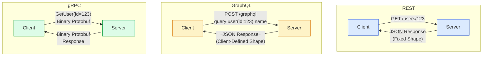
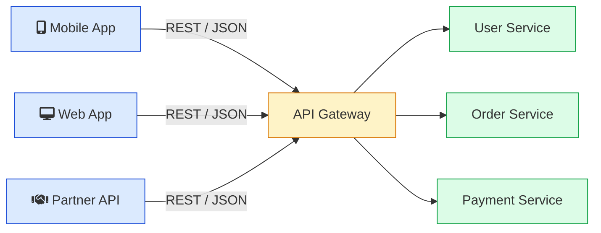
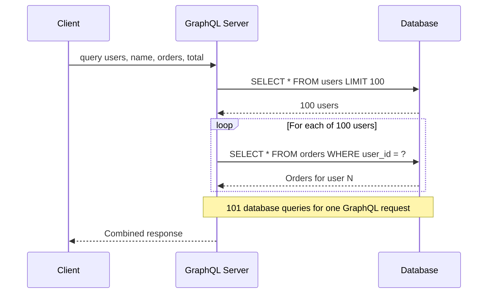
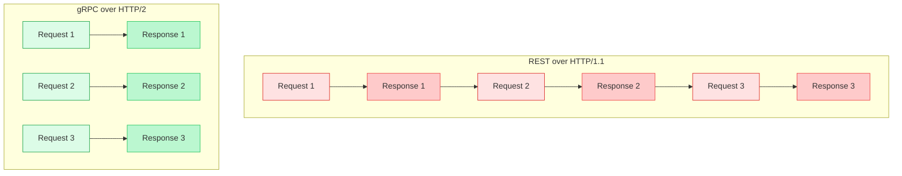
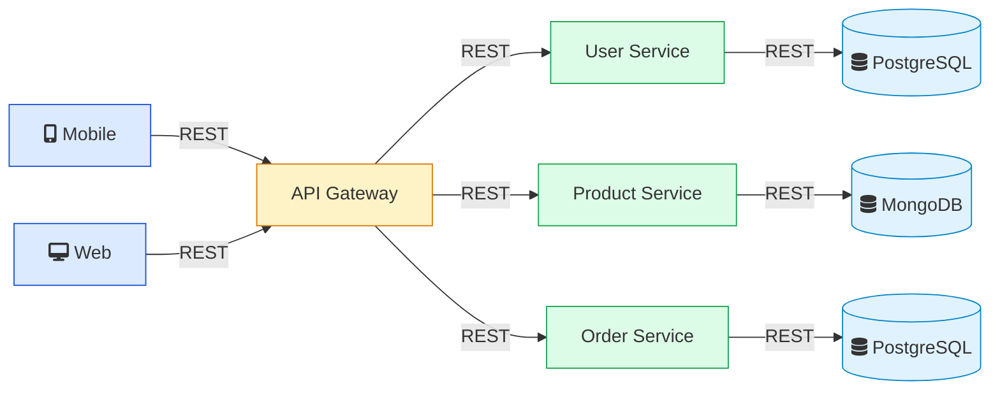
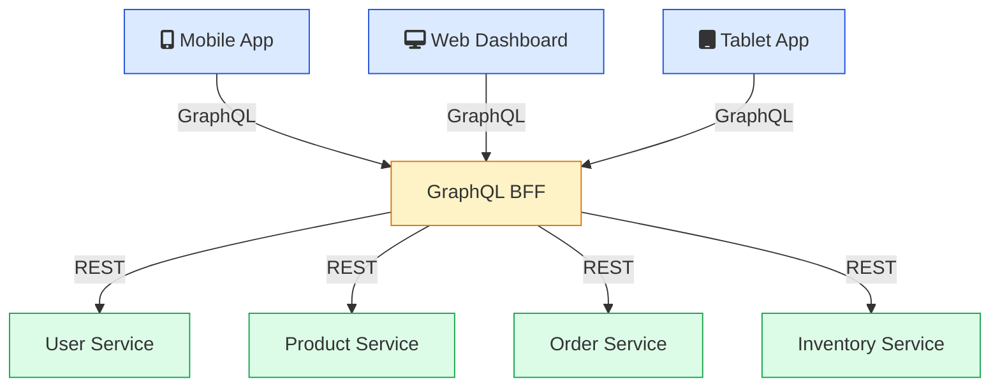
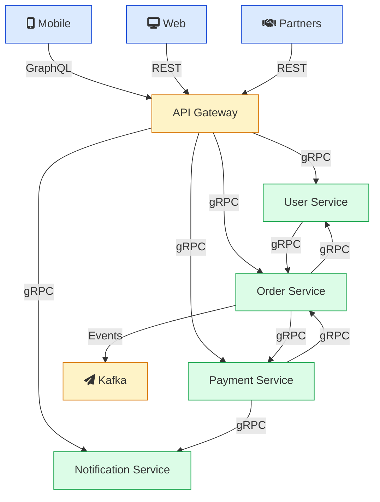
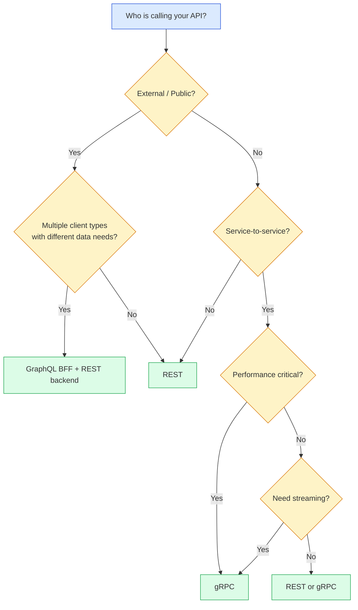
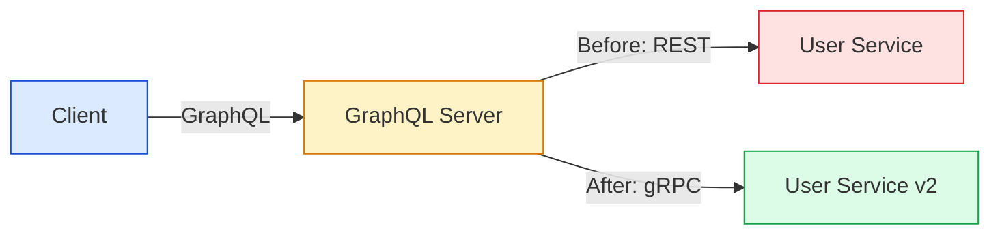

You are building a new service. It needs to talk to other services and serve data to clients. You open your editor and the first question is not about the business logic. It is about the API layer.

REST? GraphQL? gRPC?

If you pick REST, you get simplicity and broad support but you might end up with chatty APIs that require multiple round trips. If you pick GraphQL, you get flexible queries but you take on query complexity, caching headaches, and the N+1 problem. If you pick gRPC, you get raw performance but you lose browser support and human-readable payloads.

There is no single right answer. The right choice depends on who is calling your API, what data they need, and where in your system the communication happens.

This post breaks down all three protocols with real architecture, real trade-offs, and a decision framework you can actually use.

---

## <i class="fas fa-sitemap"></i> The 30-Second Overview

Before diving deep, here is the core difference in one sentence each:

- **REST**: Resources exposed as URLs. You call `GET /users/123` and get back a fixed JSON response the server designed.
- **GraphQL**: A query language for your API. You send a query specifying exactly what fields you want, and the server returns only that.
- **gRPC**: A binary RPC framework. You define services in `.proto` files, generate client/server code, and communicate over HTTP/2 with Protocol Buffers.



Each protocol makes a different core trade-off. REST optimizes for simplicity and cacheability. GraphQL optimizes for client flexibility. gRPC optimizes for performance and type safety. Understanding these trade-offs is the entire point of this post.

---

## <i class="fas fa-exchange-alt"></i> REST: The Default Choice

REST (Representational State Transfer) has been the standard for web APIs since Roy Fielding defined it in his 2000 dissertation. Most APIs you have ever used are REST APIs. Stripe, Twilio, GitHub (v3), AWS -- all REST.

### How REST works

REST maps your data model to URLs and uses HTTP methods to operate on them:

```
GET    /users          -- List users
GET    /users/123      -- Get one user
POST   /users          -- Create a user
PUT    /users/123      -- Replace a user
PATCH  /users/123      -- Partial update
DELETE /users/123      -- Delete a user
```

The server decides what data each endpoint returns. The client has no control over the response shape.

```json
// GET /users/123
{
  "id": 123,
  "name": "Alice",
  "email": "alice@example.com",
  "avatar_url": "https://cdn.example.com/avatars/alice.jpg",
  "created_at": "2025-03-15T10:30:00Z",
  "department": {
    "id": 5,
    "name": "Engineering"
  },
  "permissions": ["read", "write", "admin"]
}
```

A mobile app that only needs `name` and `avatar_url` still gets everything else. This is **over-fetching**, and it is the most common criticism of REST. The server sends more data than the client needs, wasting bandwidth and processing time.

The opposite problem is **under-fetching**. If you need a user's profile, their recent orders, and their shipping addresses, that is three separate REST calls:

```
GET /users/123
GET /users/123/orders?limit=5
GET /users/123/addresses
```

Three round trips. Three TCP handshakes (or at least three request-response cycles). On a mobile network with 100ms latency, that adds up.

### Where REST works well

Despite these drawbacks, REST is still the right choice in many situations:

**Public APIs.** If third-party developers will call your API, REST is the safest bet. Every programming language has an HTTP client. Every developer knows how to call a REST endpoint. The learning curve is close to zero.

**HTTP caching.** REST responses map naturally to HTTP caching. A `GET /users/123` response can be cached at the CDN, the reverse proxy, and the browser level using standard `Cache-Control` headers. This is a big deal for read-heavy APIs.

**Simple CRUD.** If your API is mostly create, read, update, delete operations on a handful of resources, REST is clean and predictable. No need to introduce a query language.

**Tooling.** OpenAPI (Swagger) gives you auto-generated documentation, client SDKs, and request validation. Postman, curl, and browser dev tools all work out of the box.

### REST versioning

APIs change over time. REST handles versioning in several ways:

- **URL versioning**: `/v1/users`, `/v2/users` -- the most common approach. Simple and explicit.
- **Header versioning**: `Accept-Version: 2` -- cleaner URLs but harder to test in a browser.
- **Content negotiation**: `Accept: application/vnd.api+json;v=2` -- technically correct but complex.

Most teams use URL versioning because it is straightforward and works well with [caching](/caching-strategies-explained/).

### REST in a real architecture







REST works well here because each client type (mobile, web, partner) gets the same interface. The API gateway can handle [authentication](/how-jwt-works/), [rate limiting](/dynamic-rate-limiter-system-design/), and routing.

---

## <i class="fas fa-project-diagram"></i> GraphQL: Client-Driven Data Fetching

Facebook created GraphQL in 2012 and open-sourced it in 2015. The problem they were solving was specific: the Facebook mobile app needed wildly different data shapes for the News Feed, user profiles, and notifications. Building a separate REST endpoint for every screen combination was not scaling.

GraphQL lets the client decide exactly what data it wants.

### How GraphQL works

GraphQL uses a single endpoint (typically `POST /graphql`) and a query language:

```graphql
# Client sends this query
query {
  user(id: 123) {
    name
    avatarUrl
    recentOrders(limit: 3) {
      id
      total
      status
    }
  }
}
```

```json
// Server returns exactly this
{
  "data": {
    "user": {
      "name": "Alice",
      "avatarUrl": "https://cdn.example.com/avatars/alice.jpg",
      "recentOrders": [
        { "id": 1001, "total": 59.99, "status": "delivered" },
        { "id": 1002, "total": 124.50, "status": "shipped" },
        { "id": 1003, "total": 34.00, "status": "processing" }
      ]
    }
  }
}
```

One request. No over-fetching. No under-fetching. The client got the user profile and their recent orders in a single round trip, with only the fields it asked for.

### The GraphQL schema

Every GraphQL API is defined by a schema that describes the types, queries, and mutations available:

```graphql
type User {
  id: ID!
  name: String!
  email: String!
  avatarUrl: String
  orders(limit: Int): [Order!]!
}

type Order {
  id: ID!
  total: Float!
  status: String!
  items: [OrderItem!]!
}

type Query {
  user(id: ID!): User
  users(limit: Int, offset: Int): [User!]!
}

type Mutation {
  createUser(name: String!, email: String!): User!
  updateUser(id: ID!, name: String): User!
}
```

This schema is the contract between client and server. Clients can introspect the schema to discover what is available, which is why tools like GraphiQL and Apollo Studio can provide autocomplete and documentation automatically.

### Where GraphQL works well

**Multiple client types with different data needs.** A mobile app needs a compact payload. A web dashboard needs everything. An internal tool needs a different slice entirely. With REST, you build separate endpoints or add query parameters. With GraphQL, each client writes its own query.

**Deeply nested data.** If your data has relationships that span multiple resources (users have orders, orders have items, items have reviews), GraphQL can fetch the entire graph in one request.

**Rapid frontend iteration.** Frontend teams can add new fields to their queries without waiting for backend changes, as long as the field exists in the schema.

GitHub switched from REST (v3) to GraphQL (v4) specifically because their API consumers needed different subsets of data. A single REST endpoint for a repository returned hundreds of fields that most callers did not need. Their GraphQL API lets each caller request exactly what they want.

### The problems GraphQL introduces

GraphQL solves real problems, but it creates new ones that you need to plan for.

**The [N+1 query problem](/explainer/n-plus-one-query-problem/).** This is the most common performance issue in GraphQL. When you request a list of users and their orders, the naive implementation runs one query to fetch users, then a separate query for each user's orders:



That is 101 queries for a single GraphQL request. The solution is a **DataLoader** that batches and deduplicates queries, but you have to implement it yourself.

**Caching is hard.** With REST, `GET /users/123` always returns the same URL, so CDNs and browser caches work out of the box. GraphQL uses `POST` requests with query bodies, so standard HTTP caching does not apply. You need application-level caching (Apollo Client, Relay) or persisted queries.

**Query complexity attacks.** A malicious client can send deeply nested queries that consume massive server resources:

```graphql
# A query designed to overload your server





query {
  users {
    orders {
      items {
        reviews {
          author {
            orders {
              items {
                reviews {
                  # ... 10 more levels deep
                }
              }
            }
          }
        }
      }
    }
  }
}
```

You need query depth limiting, complexity analysis, and [rate limiting](/dynamic-rate-limiter-system-design/) to protect your GraphQL API. This is extra infrastructure that REST APIs rarely need.

**Introspection leaks.** By default, GraphQL exposes its entire schema through introspection queries. This is great for development but dangerous in production. Attackers can discover every type, field, and relationship in your API in seconds. You should disable introspection in production or use an allowlist.

**File uploads are awkward.** GraphQL was designed for structured data queries, not binary uploads. The multipart request spec for GraphQL file uploads exists but is not part of the official specification.

---

## <i class="fas fa-bolt"></i> gRPC: Built for Speed

Google developed gRPC internally as "Stubby" and open-sourced it in 2015. It was designed for one thing: fast, reliable communication between services inside Google's data centers.

### How gRPC works

gRPC uses **Protocol Buffers** (protobuf) for serialization and **HTTP/2** as the transport protocol. You define your service in a `.proto` file, and the protobuf compiler generates client and server code in your language of choice.

```protobuf
// user_service.proto
syntax = "proto3";

service UserService {
  rpc GetUser(GetUserRequest) returns (User);
  rpc ListUsers(ListUsersRequest) returns (stream User);
  rpc CreateUser(CreateUserRequest) returns (User);
}

message GetUserRequest {
  int32 id = 1;
}

message User {
  int32 id = 1;
  string name = 2;
  string email = 3;
  string avatar_url = 4;
}

message ListUsersRequest {
  int32 limit = 1;
  int32 offset = 2;
}

message CreateUserRequest {
  string name = 1;
  string email = 2;
}
```

You run `protoc` (the Protocol Buffers compiler) and it generates typed client stubs and server interfaces in Go, Java, Python, C++, Rust, or a dozen other languages. No manual HTTP request building. No JSON parsing. The generated code handles serialization, deserialization, and transport.

### Why gRPC is fast

Three things make gRPC significantly faster than REST:

**1. Binary serialization with Protocol Buffers.** JSON is text. It has to be parsed character by character. Protocol Buffers encode data as compact binary, which is 3-5x smaller than JSON and 5-10x faster to serialize and deserialize.

A user object as JSON: ~200 bytes. The same user object as protobuf: ~60 bytes.

**2. HTTP/2 multiplexing.** REST typically uses HTTP/1.1, where each request needs its own TCP connection (or waits for the previous request on a shared connection). HTTP/2 multiplexes multiple requests over a single TCP connection, so you can send dozens of requests simultaneously without head-of-line blocking.

**3. Header compression.** HTTP/2 compresses headers with HPACK, so repeated metadata (auth tokens, content types) is not sent in full on every request.



With HTTP/1.1, requests are sequential (or require multiple TCP connections). With HTTP/2, all three requests and responses flow over a single connection in parallel.

### gRPC streaming patterns

gRPC supports four communication patterns, which is something REST and GraphQL cannot match natively:

**Unary RPC** -- The standard request-response pattern. Client sends one message, server sends one message back. Similar to a REST call.

**Server streaming** -- Client sends one request, server sends back a stream of responses. Useful for feeds, logs, or [real-time price updates](/how-stock-brokers-handle-real-time-price-updates/).

**Client streaming** -- Client sends a stream of messages, server responds once when done. Useful for file uploads or telemetry data ingestion.

**Bidirectional streaming** -- Both client and server send streams of messages independently. Useful for chat applications, multiplayer games, or collaborative editing.

```protobuf
service ChatService {
  // Unary
  rpc SendMessage(ChatMessage) returns (SendResult);

  // Server streaming
  rpc SubscribeToRoom(RoomRequest) returns (stream ChatMessage);

  // Client streaming
  rpc UploadFile(stream FileChunk) returns (UploadResult);

  // Bidirectional streaming
  rpc Chat(stream ChatMessage) returns (stream ChatMessage);
}
```





If you have used [Server-Sent Events](/server-sent-events-explained/) or [WebSockets](/long-polling-explained/) for real-time communication, gRPC bidirectional streaming is the equivalent for service-to-service calls, with built-in type safety and flow control.

### Schema evolution in gRPC

One of Protocol Buffers' best features is safe schema evolution. You can add new fields without breaking existing clients:

```protobuf
message User {
  int32 id = 1;
  string name = 2;
  string email = 3;
  // Added in v2 -- old clients simply ignore this field
  string phone = 4;
  // Added in v3
  repeated string roles = 5;
}
```

The rules are simple:
- Never change a field number once it is in use
- Never reuse a deleted field number
- New fields get new numbers
- Old clients ignore fields they do not know about
- New clients handle missing fields with default values

This is better than REST URL versioning because you do not have to maintain multiple API versions simultaneously. Old and new clients work with the same service.

### Where gRPC falls short

**No browser support.** Browsers cannot make raw HTTP/2 requests with the framing that gRPC needs. gRPC-Web exists as a workaround, but it requires a proxy (Envoy or grpc-web) between the browser and the server, and it does not support client streaming or bidirectional streaming.

**Not human-readable.** You cannot read a protobuf payload in your browser dev tools or curl output. Debugging requires tools like `grpcurl` or Bloom RPC. This slows down development and makes troubleshooting harder.

**Steeper learning curve.** You need to learn Protocol Buffers, understand `.proto` file syntax, set up code generation pipelines, and manage generated code across repos. REST just uses HTTP and JSON, which every developer already knows.

**Tight coupling.** Client and server share a `.proto` file. If you change the service definition, you need to regenerate and redeploy clients. This is manageable in a monorepo but gets complicated when services are owned by different teams.

---

## <i class="fas fa-balance-scale"></i> Head-to-Head Comparison

### Performance

| Metric | REST | GraphQL | gRPC |
|--------|------|---------|------|
| Serialization format | JSON (text) | JSON (text) | Protobuf (binary) |
| Typical payload size | 1x (baseline) | 0.5-0.8x (no over-fetching) | 0.2-0.3x (binary encoding) |
| Serialization speed | Baseline | Similar to REST | 5-10x faster than JSON |
| Transport | HTTP/1.1 or HTTP/2 | HTTP/1.1 or HTTP/2 | HTTP/2 (required) |
| Connection reuse | Per-request or keep-alive | Per-request or keep-alive | Multiplexed, persistent |
| Relative latency | Baseline | Similar or slightly higher | Significantly lower (binary + HTTP/2) |
| Relative throughput | Baseline | Similar or slightly lower | 3-10x higher depending on payload |

Exact numbers depend heavily on payload size, hardware, network, and implementation. But the relative picture is consistent across benchmarks: gRPC has significantly higher throughput and lower latency than REST and GraphQL, primarily due to binary serialization and HTTP/2 multiplexing. The gap widens as payload sizes grow because binary encoding scales better than text.

GraphQL is slightly slower than REST for simple single-resource queries because the server has to parse the query, validate it against the schema, and execute resolvers. But GraphQL can be faster end-to-end when it replaces multiple REST round trips with a single request.

### Developer experience

| Aspect | REST | GraphQL | gRPC |
|--------|------|---------|------|
| Learning curve | Low | Medium | High |
| Debugging | Easy (curl, browser) | Medium (GraphiQL) | Hard (needs special tools) |
| Documentation | OpenAPI / Swagger | Self-documenting schema | Protobuf files as docs |
| Client libraries | Every language, manual | Apollo, Relay, urql | Auto-generated from .proto |
| Browser support | Native | Native | Requires proxy (gRPC-Web) |
| File uploads | Standard multipart | Awkward, non-standard | Streaming-based |





### Caching

| Approach | REST | GraphQL | gRPC |
|----------|------|---------|------|
| HTTP caching | Built-in (Cache-Control) | Not supported (POST) | Not applicable |
| CDN caching | Works out of the box | Requires persisted queries | Not applicable |
| Client caching | ETag, If-None-Match | Apollo Cache, Relay Store | Application-level |
| Cache invalidation | Standard HTTP patterns | Normalized cache updates | Manual |

Caching is REST's biggest advantage over GraphQL. If your API is read-heavy and the same data is requested repeatedly, REST with HTTP caching at the CDN and browser level can save you a lot of backend load. This is why public APIs almost always use REST. The [caching layer](/caching-strategies-explained/) is built into the protocol.

### Error handling

REST uses HTTP status codes that every developer and every tool understands:

```
200 OK           -- Success
400 Bad Request  -- Client sent invalid data
401 Unauthorized -- Missing or invalid auth
404 Not Found    -- Resource does not exist
429 Too Many     -- Rate limited
500 Server Error -- Something broke
```

GraphQL always returns 200 OK, even when there are errors. Errors go in the response body:

```json
{
  "data": { "user": null },
  "errors": [
    {
      "message": "User not found",
      "path": ["user"],
      "extensions": { "code": "NOT_FOUND" }
    }
  ]
}
```

This means your monitoring tools, load balancers, and CDNs cannot distinguish between success and failure based on status codes. You need custom error parsing on both client and server.

gRPC has its own status codes (OK, NOT_FOUND, PERMISSION_DENIED, INTERNAL, etc.) that map roughly to HTTP codes but are not the same. Error details can include structured metadata.

### Security

All three protocols support TLS encryption and standard [authentication mechanisms like JWT](/how-jwt-works/) or [OAuth 2.0](/oauth-2-explained/). But there are differences:

| Concern | REST | GraphQL | gRPC |
|---------|------|---------|------|
| Authentication | Standard (JWT, OAuth, API keys) | Same as REST | Per-call metadata or interceptors |
| Authorization | Per-endpoint middleware | Per-resolver (field-level) | Per-method interceptors |
| Rate limiting | Standard (per-endpoint) | Complex (per-query cost) | Per-method or custom |
| Schema exposure | OpenAPI is opt-in | Introspection is on by default | Proto files are private |
| Attack surface | Well understood | Query complexity, batching abuse | Smaller (binary, typed) |

GraphQL has a larger attack surface because of introspection, query complexity, and batching. You need to add depth limiting, complexity analysis, and persisted queries to lock it down. REST and gRPC are simpler to secure.

---

## <i class="fas fa-building"></i> Real-World Architecture Patterns

### Pattern 1: REST everywhere (small team)

For a small team building a straightforward product, REST everywhere is the right call. It is simple, everyone knows it, and the tooling is mature.



This is the right architecture for 90% of startups and small teams. Do not add GraphQL or gRPC unless you have a specific problem that REST cannot solve. Premature optimization of your API protocol is a real thing.

### Pattern 2: GraphQL BFF with REST services

When your frontend needs diverge (mobile needs minimal data, web dashboard needs everything), a GraphQL [Backend for Frontend (BFF)](https://samnewman.io/patterns/architectural/bff/) layer makes sense.







The GraphQL layer aggregates data from multiple REST services and lets each client query exactly what it needs. This is how [Shopify](/shopify-system-design/) structures their Storefront API. The backend services remain simple REST, but the client-facing layer is flexible.

### Pattern 3: gRPC internally, REST/GraphQL externally (large-scale)

This is the pattern used by Netflix, Uber, and Google. Internal services talk to each other over gRPC for performance. External clients use REST or GraphQL.



Netflix uses gRPC for their internal service mesh. Their graph abstraction layer handles 650TB of data and exposes a gRPC API that delivers single-digit millisecond latency for single-hop queries. Externally, they use GraphQL for their marketing and content APIs.

Uber uses gRPC between backend services, with a consumer proxy (uForwarder) that pushes [Kafka](/distributed-systems/how-kafka-works/) messages to services over gRPC endpoints.

When events need to flow between services asynchronously, combine gRPC for synchronous calls with a message broker like Kafka for async communication. The [transactional outbox pattern](/transactional-outbox-pattern/) ensures reliable event delivery in this setup.

---

## <i class="fas fa-code"></i> What Each Protocol Looks Like in Code

Let us build the same API -- get a user by ID -- in all three protocols to see the practical differences.

### REST (Node.js + Express)

```javascript
const express = require('express');
const app = express();

app.get('/users/:id', async (req, res) => {
  const user = await db.users.findById(req.params.id);
  if (!user) {
    return res.status(404).json({ error: 'User not found' });
  }
  res.json({
    id: user.id,
    name: user.name,
    email: user.email,
    avatar_url: user.avatar_url
  });
});
```

### GraphQL (Node.js + Apollo Server)

```javascript
const { ApolloServer, gql } = require('apollo-server');

const typeDefs = gql`
  type User {
    id: ID!
    name: String!
    email: String!
    avatarUrl: String
    orders(limit: Int): [Order!]!
  }

  type Order {
    id: ID!
    total: Float!
    status: String!
  }

  type Query {
    user(id: ID!): User
  }
`;

const resolvers = {
  Query: {
    user: (_, { id }) => db.users.findById(id),
  },
  User: {
    orders: (user, { limit }) =>
      db.orders.findByUserId(user.id, { limit }),
  },
};
```

### gRPC (Go)

```protobuf
// user.proto
syntax = "proto3";

service UserService {
  rpc GetUser(GetUserRequest) returns (User);
}

message GetUserRequest {
  int32 id = 1;
}

message User {
  int32 id = 1;
  string name = 2;
  string email = 3;
  string avatar_url = 4;
}
```

```go
// server.go
func (s *server) GetUser(ctx context.Context, req *pb.GetUserRequest) (*pb.User, error) {
    user, err := s.db.FindUser(req.Id)
    if err != nil {
        return nil, status.Errorf(codes.NotFound, "user not found")
    }
    return &pb.User{
        Id:        user.ID,
        Name:      user.Name,
        Email:     user.Email,
        AvatarUrl: user.AvatarURL,
    }, nil
}
```

Notice the difference: REST requires you to manually define routes, parse parameters, and format JSON. GraphQL requires schema definition and resolver implementation. gRPC requires a `.proto` file and generated code, but the actual handler is the simplest because all the boilerplate is auto-generated.

---

## <i class="fas fa-route"></i> Decision Flowchart

Use this to pick the right protocol for your next project:



A few rules of thumb:

1. **Start with REST.** It is the simplest choice and works for most use cases. Only switch when you hit a specific problem that REST cannot solve.
2. **Add GraphQL when your frontend team is bottlenecked** by having to ask the backend team for new endpoints or response shapes.
3. **Add gRPC when latency between services matters.** If your service is making 50 REST calls to assemble a response, switching those to gRPC can cut your P95 latency significantly.
4. **Use multiple protocols.** There is no rule that says your system must use one protocol everywhere. Most mature systems use at least two.

---

## <i class="fas fa-tools"></i> Migration Strategies

### Moving from REST to GraphQL

You do not have to rewrite everything. The practical approach:

1. **Start with a GraphQL layer on top of REST.** Your GraphQL resolvers call your existing REST endpoints. This is what GitHub did during their v3 to v4 migration.
2. **Migrate one resource at a time.** Start with the resource that has the worst over-fetching or under-fetching problem.
3. **Use schema stitching or federation** to combine multiple GraphQL schemas if different teams own different services.
4. **Keep REST for public/partner APIs.** Your GraphQL layer can coexist with REST endpoints indefinitely.

### Moving from REST to gRPC

1. **Define your `.proto` files** based on your existing REST API contracts.
2. **Start with internal services** that have the highest call volume between them.
3. **Use gRPC-Gateway** to automatically generate REST endpoints from your `.proto` files. This lets you support both protocols during migration.
4. **Keep REST at the edge.** Your API gateway can translate between REST (external) and gRPC (internal).

### Adding gRPC to a GraphQL architecture

This is common. Your GraphQL resolvers switch from calling REST services to calling gRPC services. The client-facing API stays the same. The performance improvement happens behind the scenes.



---

## <i class="fas fa-exclamation-circle"></i> Common Mistakes

**Choosing GraphQL for a simple CRUD API.** If you have 5 resources with straightforward CRUD operations and one frontend, REST is simpler. GraphQL adds schema definition, resolver implementation, query parsing, and caching complexity that you do not need.

**Using REST for chatty internal microservices.** If your service makes 20 REST calls to assemble a single response, the latency adds up. This is where gRPC pays off. The binary serialization and HTTP/2 multiplexing can cut your P95 latency from hundreds of milliseconds to single digits.

**Exposing gRPC directly to browsers.** Browsers do not support the HTTP/2 framing that gRPC needs. Use gRPC-Web with a proxy, or put a REST/GraphQL layer in front. Do not fight the browser.

**Skipping DataLoader in GraphQL.** If you build a GraphQL API without batching, you will hit [N+1 queries](/explainer/n-plus-one-query-problem/) on day one. Every GraphQL server needs a DataLoader. This is not optional.

**Ignoring schema evolution.** Whether it is REST versioning, GraphQL schema changes, or protobuf field numbering, plan for how your API will change over time from day one. Breaking changes in production APIs are painful and expensive.

**Not monitoring GraphQL query performance.** Since all GraphQL requests go to one endpoint (`POST /graphql`), your standard per-endpoint monitoring is useless. You need per-query monitoring with [distributed tracing](/distributed-tracing-jaeger-vs-tempo-vs-zipkin/) to find slow resolvers. Tools like [OpenTelemetry](/opentelemetry-production-guide/) can help here.

---

## <i class="fas fa-check-circle"></i> Summary: Which One Should You Pick?

| Scenario | Pick | Why |
|----------|------|-----|
| Public API for third-party developers | REST | Universal support, simple, cacheable |
| Internal microservice-to-microservice calls | gRPC | Much higher throughput, type safety, streaming |
| Mobile app with bandwidth constraints | GraphQL | No over-fetching, single round trip |
| Multiple frontend clients (web + mobile + tablet) | GraphQL (BFF) | Each client defines its own data shape |
| Simple CRUD with one frontend | REST | Simplest option, no extra tooling |
| Real-time bidirectional communication between services | gRPC | Native streaming support |
| Partner API with strict contracts | REST + OpenAPI | Documentation, validation, wide tooling |
| High-throughput data pipeline | gRPC | Binary serialization, multiplexing |
| Small team, early-stage product | REST | Ship fast, switch later if needed |
| Legacy system integration | REST | Maximum compatibility |

The pattern that works for most growing teams:

1. **Start with REST.** Build fast, ship fast.
2. **Add gRPC** when your internal services start talking to each other frequently and latency matters.
3. **Add GraphQL** when your frontend team starts building multiple clients with different data needs.

Each protocol solves a different problem. The best systems use the right protocol at each boundary rather than forcing one protocol everywhere.

---

## <i class="fas fa-book"></i> Further Reading

If you are building systems where API design matters, these related posts go deeper on specific topics:

- [System Design Cheat Sheet](/system-design-cheat-sheet/) -- Covers REST vs GraphQL vs gRPC along with other system design concepts
- [Kafka vs RabbitMQ vs SQS](/kafka-vs-rabbitmq-vs-sqs/) -- When you need async communication alongside your synchronous APIs
- [Transactional Outbox Pattern](/transactional-outbox-pattern/) -- Reliable event publishing when your gRPC services need to emit events
- [How JWT Works](/how-jwt-works/) -- Authentication across all three API protocols
- [Caching Strategies Explained](/caching-strategies-explained/) -- Deep dive on the caching advantage REST has over GraphQL
- [Circuit Breaker Pattern](/circuit-breaker-pattern/) -- Protecting your services when downstream APIs fail
- [Server-Sent Events Explained](/server-sent-events-explained/) -- The HTTP-native alternative for server push when gRPC is not an option
