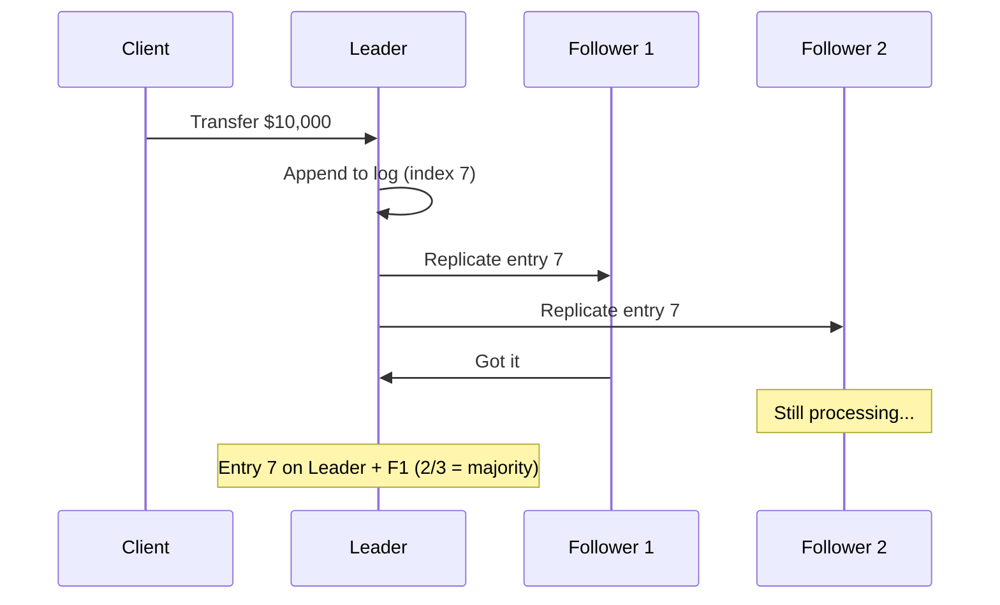
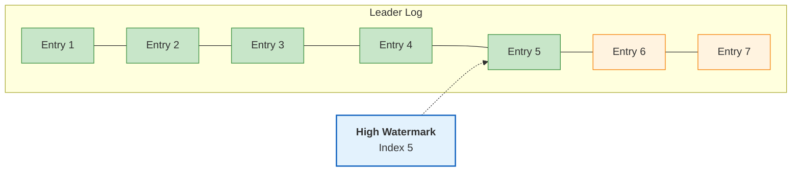
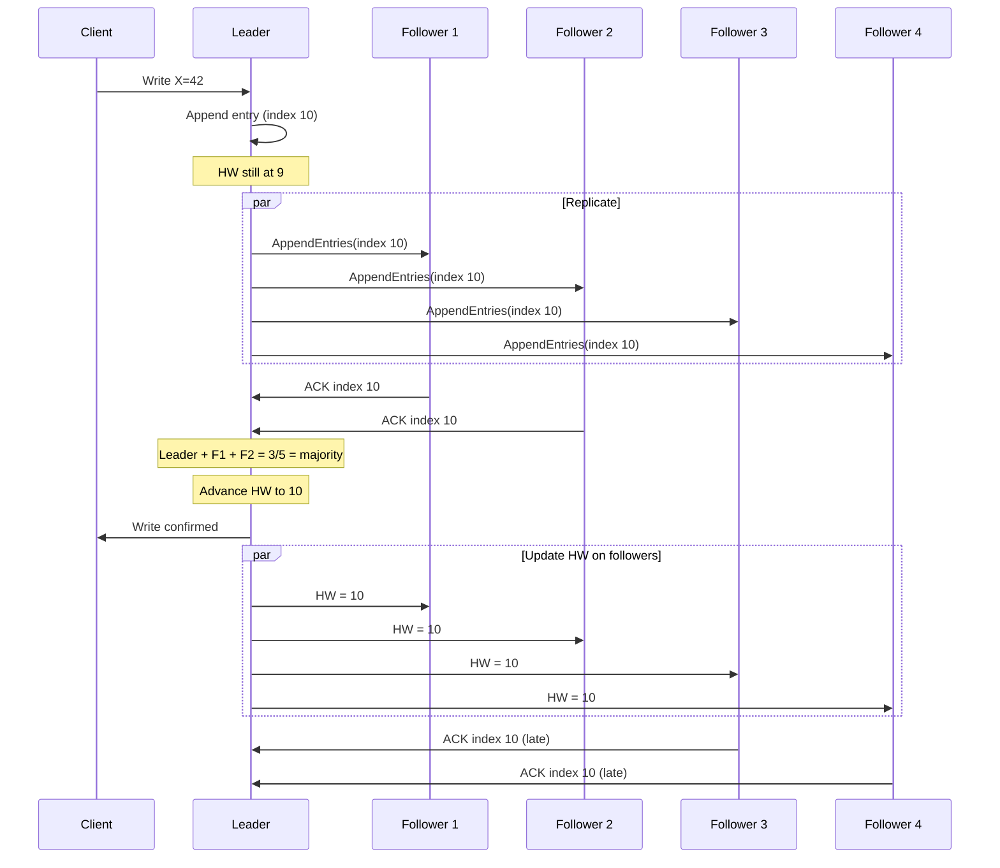
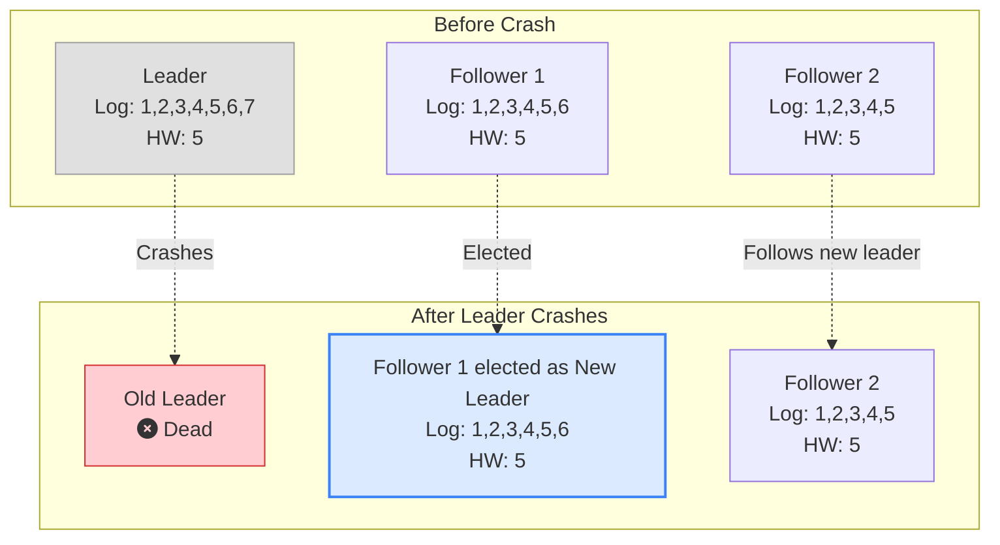
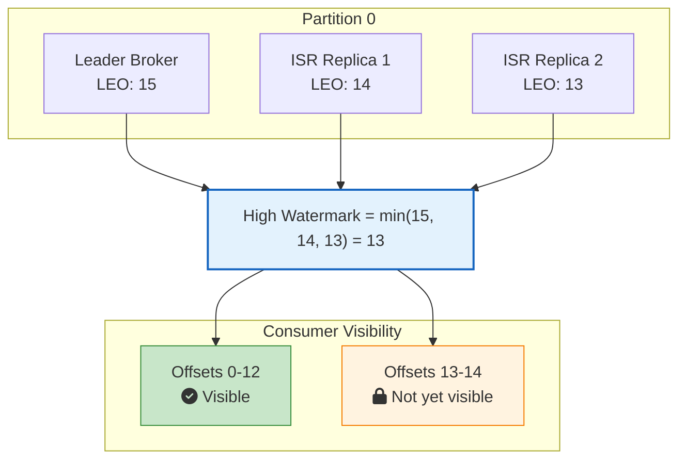
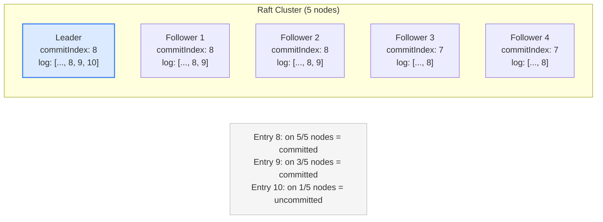
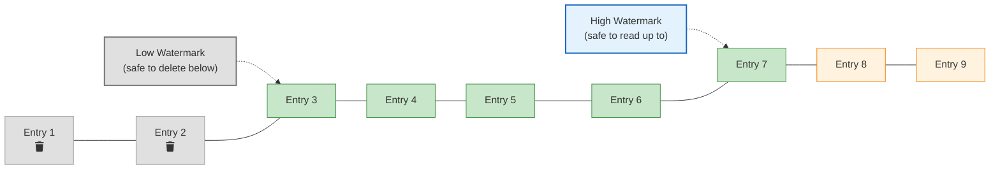
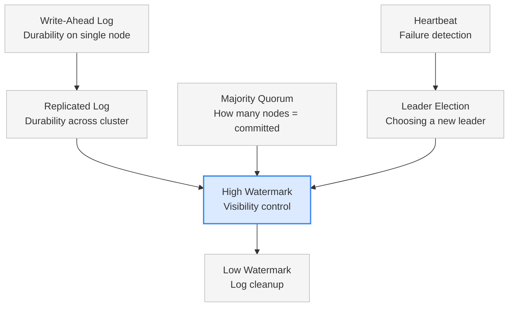

You have a three-node Kafka cluster. A producer writes a message to partition 0. The leader appends it to its log. One follower grabs it. The other follower is still catching up.

Now a consumer sends a fetch request. Should it see that message?

If you say yes, you have a problem. That message only exists on two out of three nodes. If the leader crashes right now, the new leader might be the follower that doesn't have it. The message is gone. But the consumer already read it. They processed it, maybe triggered a payment, sent an email, updated a dashboard. Now the data they acted on doesn't exist anymore.

This is the exact problem the **High Watermark** pattern solves. It draws a line in the log and says: everything below this line is safe. Everything above it? Not yet.

## The Problem: When Replication Lags Behind Visibility

In any distributed system that uses [leader-follower replication](/distributed-systems/replicated-log/), the leader is always ahead of the followers. That's by design. The leader accepts writes first, then replicates them.

But this creates a gap. Between the moment the leader appends an entry and the moment enough followers confirm it, that entry is in a dangerous state. It exists, but it's not safe.

### A Banking Example

Imagine a distributed banking system with three nodes. A customer transfers $10,000.



Entry 7 is now on the leader and Follower 1. That's a [majority in a 3-node cluster](/distributed-systems/majority-quorum/). It's safe. Even if one node dies, the entry survives on at least one other.

But what if the client reads from Follower 2 before it receives entry 7? The client would see an old balance. Or worse, what if the leader had appended entry 8 that only exists on the leader itself? If a client reads entry 8 and then the leader crashes, that entry is gone forever.

The question is: **how does each node know which entries are safe to serve?**

That's what the high watermark answers.

## What Is the High Watermark?

The high watermark is an index in the [write-ahead log](/distributed-systems/write-ahead-log/) that marks the last entry known to be replicated to a majority of nodes. Every entry at or below this index is **committed**. Every entry above it is **uncommitted**.

The rules are simple:

- <i class="fas fa-check-circle text-success"></i> Only committed entries are visible to clients
- <i class="fas fa-check-circle text-success"></i> The leader calculates the high watermark based on follower acknowledgments
- <i class="fas fa-check-circle text-success"></i> The leader communicates the high watermark to followers during replication
- <i class="fas fa-check-circle text-success"></i> Each follower updates its own high watermark and only serves data up to that point

In Raft, this is called the **commit index**. In Kafka, it's called the **High Watermark (HW)**. Different names, same idea.



Entries 1 through 5 are committed (green). The leader knows they're on a majority of nodes. Entries 6 and 7 exist on the leader's log but haven't been confirmed by enough followers yet. They're uncommitted (orange). No client will ever see entries 6 or 7 until they cross the high watermark.

## How the High Watermark Works Step by Step

Let's walk through a 5-node cluster where the leader receives a write and the high watermark advances.

### Step 1: Leader Appends the Entry

A client sends a write request. The leader appends it to its own log. At this point, the entry exists on exactly one node. The high watermark doesn't move.

### Step 2: Leader Sends Entry to Followers

The leader sends the new entry to all four followers. Each follower will receive it at different times depending on network latency and load.

### Step 3: Followers Acknowledge

As followers receive and store the entry, they send acknowledgments back to the leader. The leader tracks which followers have which entries.

### Step 4: Leader Advances the High Watermark

Once the leader knows that a majority of nodes (3 out of 5, including itself) have the entry, it advances the high watermark. The entry is now committed.

### Step 5: Leader Communicates New High Watermark

The leader includes the updated high watermark in its next round of replication messages (or [heartbeats](/distributed-systems/heartbeat/)). Followers update their own high watermark accordingly and can now serve the committed entry to clients.



Notice that the leader didn't wait for all four followers. It only needed two (plus itself) to reach the majority of 3 out of 5. Followers 3 and 4 will catch up eventually, but the entry is already committed.

## How the Leader Calculates the High Watermark

The leader maintains a record of each follower's **log end offset (LEO)**, which is the index of the last entry in that follower's log.

To calculate the high watermark, the leader:

1. Collects the LEO from each follower (updated through acknowledgments)
2. Sorts all LEOs (including its own)
3. Picks the value at position `(N/2)` (for a cluster of N nodes)

This gives the highest index that exists on a majority of nodes.

Here's a concrete example with 5 nodes:

| Node | Log End Offset (LEO) |
|------|---------------------|
| Leader | 10 |
| Follower 1 | 10 |
| Follower 2 | 9 |
| Follower 3 | 10 |
| Follower 4 | 8 |

Sorted LEOs: [8, 9, 10, 10, 10]

For 5 nodes, majority is 3. The value at position 3 (from the end) is **9**. So the high watermark is 9. Entries up to index 9 are on at least 3 nodes.

Wait, entry 10 is on 3 nodes too (Leader, Follower 1, Follower 3). Shouldn't the high watermark be 10?

Yes, it should. The exact calculation picks the median of the sorted LEOs: position `floor(N/2)` from the sorted array, which is index 2 (0-based) in [8, 9, 10, 10, 10] = **10**. The leader sees that 3 out of 5 nodes have entry 10, so the high watermark advances to 10.

The key insight: the high watermark is the **highest offset that exists on at least a majority of nodes**.

## What Happens During a Leader Failover

This is where the high watermark really earns its keep. Let's see what happens when a leader crashes.

### Scenario: Leader Crashes With Uncommitted Entries



Entry 7 was only on the old leader. It was never replicated to any follower, so it was never committed. It's lost. But no client ever saw it because it was above the high watermark.

Entry 6 is on the old leader and Follower 1. In a 3-node cluster, 2 out of 3 is a majority. But the leader crashed before advancing the high watermark to 6, so it was still uncommitted. The new leader (Follower 1) has entry 6 in its log. Depending on the protocol, the new leader might commit it or truncate it.

Entries 1 through 5 are safe. They exist on all three nodes and were committed (HW = 5). Every client read was based on these entries. Nothing that any client saw will disappear.

This is the guarantee: **the high watermark ensures clients never see data that could be lost.**

### Why Uncommitted Entries Can Be Lost

When the old leader had entries 6 and 7, it hadn't received enough acknowledgments. The client that sent those writes didn't get a confirmation response either. From the client's perspective, those writes might not have happened. The client knows to retry.

If the system had served those entries to other clients before they were committed, those clients would have acted on data that later vanished. Orders would disappear, balances would jump, audit trails would have gaps. The high watermark prevents all of this.

## High Watermark in Apache Kafka

[Kafka](/distributed-systems/how-kafka-works/) uses the high watermark extensively. Every partition has a leader and a set of followers called **In-Sync Replicas (ISR)**. The high watermark determines what consumers can read.

### Kafka's Terminology

| Term | Meaning |
|------|---------|
| **LEO (Log End Offset)** | The offset of the next message to be written to a replica's log |
| **HW (High Watermark)** | The minimum LEO across all ISR members |
| **ISR (In-Sync Replicas)** | The set of replicas that are fully caught up with the leader |
| **Consumer Offset** | The position a consumer has read up to |

### How Kafka Calculates the High Watermark

In Kafka, the leader calculates the high watermark as the **minimum LEO across all ISR members**. This is slightly different from Raft's majority-based calculation. Since ISR membership already guarantees that all members are caught up, taking the minimum gives the highest offset that all ISR members have.



When Replica 2 catches up and its LEO reaches 14, Kafka recalculates: min(15, 14, 14) = 14. The high watermark advances, and offset 13 becomes visible to consumers.

### The Fetch Cycle

Here's how the high watermark flows through Kafka's replication:

1. **Producer** sends a message to the partition leader
2. **Leader** appends the message and its LEO advances
3. **Followers** send fetch requests to the leader
4. **Leader** responds with new messages and the current high watermark
5. **Followers** append messages and update their own LEO and high watermark
6. **Leader** sees updated follower LEOs and recalculates the high watermark
7. **Consumers** can read up to the high watermark

This cycle runs continuously. As followers catch up, the high watermark advances, and more data becomes visible to consumers.

### Consumer Lag and the High Watermark

If you've ever monitored a Kafka consumer group, you've seen **consumer lag**. That's the difference between the high watermark and the consumer's current offset. It tells you how far behind the consumer is from the latest committed data.

```
Consumer Lag = High Watermark - Consumer Offset
```

This is one of the most important metrics for any Kafka-based system. High lag means the consumer is falling behind. It could lead to data processing delays, stale dashboards, or missed alerts.

## High Watermark in Raft (etcd, CockroachDB)

In Raft consensus, the same concept is called the **commit index**. The mechanics are similar but the terminology and some details differ.

### Raft's Approach

The Raft leader maintains a `commitIndex` that tracks the highest log entry replicated to a majority of nodes. Here's how it works:

1. The leader appends an entry to its log at index N
2. It sends `AppendEntries` RPCs to all followers
3. Each follower that successfully stores the entry responds with success
4. When the leader sees that a majority has entry N, it sets `commitIndex = N`
5. The leader includes `commitIndex` in subsequent `AppendEntries` messages
6. Followers update their own `commitIndex` and apply entries up to that point



In this example, the leader will advance `commitIndex` to 9 because entry 9 exists on 3 out of 5 nodes (Leader, F1, F2), which is a majority. Entry 10 only exists on the leader, so it stays uncommitted.

### commitIndex vs lastApplied

Raft actually tracks two indices:

- **commitIndex**: The highest entry known to be committed (replicated to a majority). This is the high watermark.
- **lastApplied**: The highest entry actually applied to the state machine.

The rule is: `lastApplied` can never exceed `commitIndex`. The node applies entries one by one, advancing `lastApplied` toward `commitIndex`. This separation exists because applying entries to the state machine takes time, and the node might have committed entries it hasn't processed yet.

## The Low Watermark: The Other End

If the high watermark tells you "how far forward is safe to read," the **[low watermark](/distributed-systems/low-watermark/)** tells you "how far back can we safely forget."

Write-ahead logs grow forever if left unchecked. Old entries that every node has already applied don't need to stick around. The low watermark marks the point below which log entries can be safely deleted or compacted.



The low watermark is calculated as the minimum `lastApplied` across all nodes. If every node has applied entry 2 to its state machine, no one needs entries 1 and 2 in the log anymore. They can be replaced with a snapshot.

Together, the two watermarks define the "active window" of the log:

| Watermark | What it controls | How it moves |
|-----------|-----------------|--------------|
| **High Watermark** | Visibility to clients | Advances when followers confirm replication |
| **Low Watermark** | Log cleanup and truncation | Advances when all nodes apply entries to state machine |

Kafka handles this through **log retention policies** and **log compaction**. Raft-based systems use **snapshotting** to discard old entries. For a deep dive into how the Low Watermark works, including real-world examples from Kafka, etcd, and PostgreSQL, see [Low Watermark: How Distributed Systems Clean Up Old Data Without Breaking Things](/distributed-systems/low-watermark/).

## Real-World Systems Using the High Watermark

### Apache Kafka

Kafka's entire consumer visibility model is built on the high watermark. Every partition has a high watermark that advances as ISR replicas catch up. The `kafka-consumer-groups` CLI tool shows consumer lag based on the high watermark. When you set `acks=all` in your producer config, you're saying "don't confirm until the message crosses the high watermark."

### etcd (Kubernetes)

etcd uses Raft consensus, and the commit index is central to its operation. When Kubernetes stores a pod spec in etcd, that write is committed only after a majority of etcd nodes confirm. The Kubernetes API server reads from etcd based on the commit index, ensuring it never sees a pod definition that might disappear.

### CockroachDB

CockroachDB runs a Raft group for each data range. Each range has its own commit index (high watermark). SQL queries are served based on committed data only. This is how CockroachDB provides serializable isolation across a distributed cluster.

### Apache BookKeeper (Pulsar)

Apache BookKeeper, which powers Apache Pulsar's storage layer, uses the concept of a **Last Add Confirmed (LAC)** entry. This is functionally identical to the high watermark. Entries beyond the LAC are not visible to readers. BookKeeper's approach is different from Kafka's because it uses a quorum-based write protocol rather than ISR-based replication.

### ZooKeeper (ZAB Protocol)

ZooKeeper uses ZAB (ZooKeeper Atomic Broadcast), where the leader proposes changes and waits for a [majority quorum](/distributed-systems/majority-quorum/) to acknowledge before committing. The commit point serves the same role as the high watermark. Clients reading from ZooKeeper followers only see committed state.

## Common Pitfalls and Tradeoffs

### The Visibility Delay

There's always a gap between when a message is produced and when it becomes visible to consumers. This is the time it takes for followers to replicate the message and for the high watermark to advance.

In Kafka, this delay is typically a few milliseconds for a healthy cluster. But if a follower falls out of ISR or network latency spikes, the delay can grow. This is why monitoring ISR shrinkage is important. A shrinking ISR can stall the high watermark.

### The Tradeoff Between Safety and Latency

A strict high watermark gives you safety but adds latency. Every write must wait for replication before it's visible. You can tune this:

- **Kafka `acks=all`**: Producer waits for all ISR replicas. Safest, but slowest.
- **Kafka `acks=1`**: Producer waits for leader only. The message might be lost if the leader crashes before replication. Faster, but riskier.
- **Kafka `acks=0`**: Producer doesn't wait at all. Fire and forget. Fastest, but no durability guarantee.

Even with `acks=1`, the high watermark still controls consumer visibility. The producer might get a faster response, but consumers still wait for the high watermark to advance.

### Follower Lag and ISR Dynamics

If a follower falls behind (maybe it's on a slow disk or across a network partition), Kafka removes it from the ISR. This actually **helps** the high watermark advance faster because the minimum LEO is now calculated across fewer (faster) replicas.

But it also reduces fault tolerance. With fewer ISR members, you can tolerate fewer failures. If `min.insync.replicas=2` and only one replica remains in ISR, the partition stops accepting writes entirely.

This is the classic distributed systems tradeoff between **availability** and **consistency**.

## Implementation Sketch

Here's a simplified version of how the high watermark works in a leader node. This isn't production code, but it shows the core logic.

```python
class Leader:
    def __init__(self, cluster_size):
        self.log = []
        self.high_watermark = -1
        self.follower_leos = {}
        self.cluster_size = cluster_size
        self.majority = cluster_size // 2 + 1

    def append(self, entry):
        self.log.append(entry)
        return len(self.log) - 1  # return the index

    def on_follower_ack(self, follower_id, follower_leo):
        self.follower_leos[follower_id] = follower_leo
        self._try_advance_high_watermark()

    def _try_advance_high_watermark(self):
        all_leos = [len(self.log)]  # leader's own LEO
        all_leos.extend(self.follower_leos.values())
        all_leos.sort(reverse=True)

        if len(all_leos) >= self.majority:
            new_hw = all_leos[self.majority - 1]
            if new_hw > self.high_watermark:
                self.high_watermark = new_hw

    def is_committed(self, index):
        return index <= self.high_watermark

    def get_visible_entries(self):
        return self.log[:self.high_watermark + 1]
```

The `_try_advance_high_watermark` method sorts all known LEOs in descending order and picks the value at position `majority - 1`. That's the highest index guaranteed to be on at least `majority` nodes.

## How It Connects to Other Patterns

The high watermark doesn't work in isolation. It's part of a family of distributed systems patterns that work together:



- The [Write-Ahead Log](/distributed-systems/write-ahead-log/) gives durability on a single node
- The [Replicated Log](/distributed-systems/replicated-log/) extends that durability across a cluster
- The [Majority Quorum](/distributed-systems/majority-quorum/) decides how many nodes must confirm before an entry is committed
- The [Heartbeat](/distributed-systems/heartbeat/) detects failures and triggers leader election
- The **High Watermark** ties it all together by defining what's safe to show clients
- The **Low Watermark** determines when old log entries can be cleaned up
- The [Hybrid Logical Clock](/distributed-systems/hybrid-clock/) provides the monotonic, time-aware version stamps that the high watermark indexes into

## Key Takeaways for Developers

1. **The high watermark is about visibility, not storage.** Entries above it still exist in the log. They're just not visible to clients until they're committed.

2. **Different systems, same pattern.** Kafka calls it High Watermark. Raft calls it commit index. BookKeeper calls it Last Add Confirmed. The names change, but the concept doesn't.

3. **Consumer lag is measured against the high watermark.** If your consumers are falling behind, the high watermark tells you how far behind they are from the latest committed data.

4. **ISR shrinkage stalls the high watermark.** In Kafka, watch for replicas falling out of ISR. When the ISR shrinks, the high watermark can advance faster, but your fault tolerance drops. It's a signal that something is wrong.

5. **The high watermark is what makes leader failover safe.** Without it, clients could read data that disappears when a new leader is elected. The high watermark guarantees that any data a client has seen will survive failover.

6. **You probably don't need to implement this yourself.** If you're using Kafka, etcd, or CockroachDB, the high watermark is built in. Understand it so you can debug issues and tune configurations, but don't try to build your own replication protocol unless you really know what you're doing.

## Wrapping Up

The high watermark is one of those patterns that seems simple on the surface but has deep implications. It's just an index, a number that moves forward as replication progresses. But that single number is what keeps distributed systems honest. It's the boundary between "definitely safe" and "maybe safe." And in distributed systems, "maybe safe" is just another way of saying "not safe at all."

Every time you set `acks=all` in Kafka, every time you read a consistent value from etcd, every time CockroachDB gives you a serializable transaction, the high watermark is doing its job. Quietly, reliably, drawing that line between committed and uncommitted data.

---

*For more distributed systems patterns, check out [Low Watermark](/distributed-systems/low-watermark/), [Hybrid Logical Clock](/distributed-systems/hybrid-clock/), [Write-Ahead Log](/distributed-systems/write-ahead-log/), [Replicated Log](/distributed-systems/replicated-log/), [Majority Quorum](/distributed-systems/majority-quorum/), [Heartbeat](/distributed-systems/heartbeat/), [Gossip Dissemination](/distributed-systems/gossip-dissemination/), [Paxos](/distributed-systems/paxos/), [Two-Phase Commit](/distributed-systems/two-phase-commit/), and [How Kafka Works](/distributed-systems/how-kafka-works/).*

*Further reading: Unmesh Joshi's [Patterns of Distributed Systems](https://martinfowler.com/articles/patterns-of-distributed-systems/high-watermark.html) on Martin Fowler's site covers the high watermark and related patterns in depth.*
