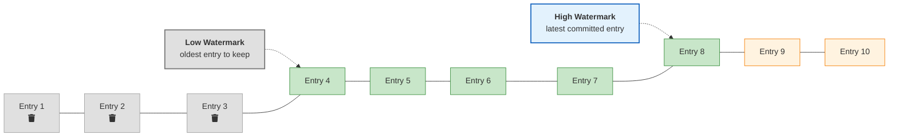
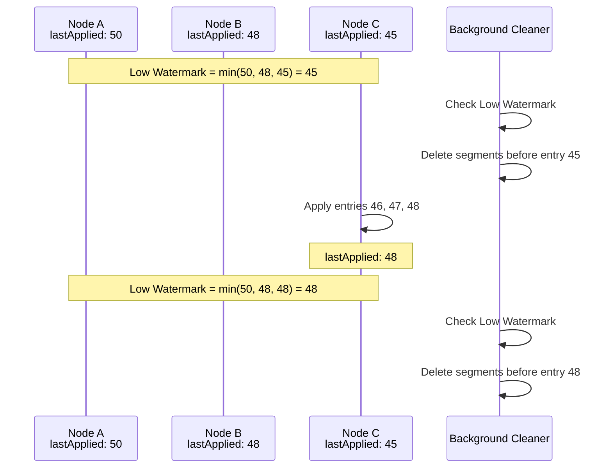
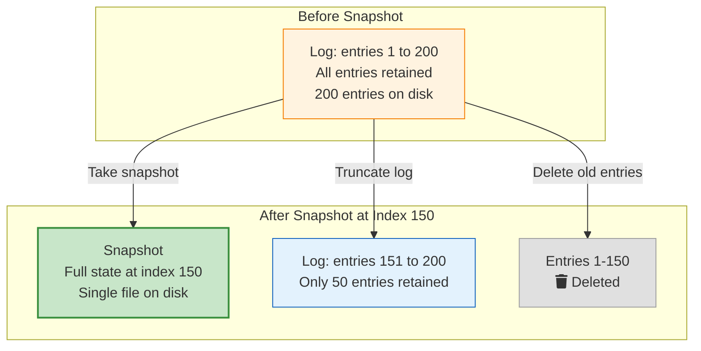
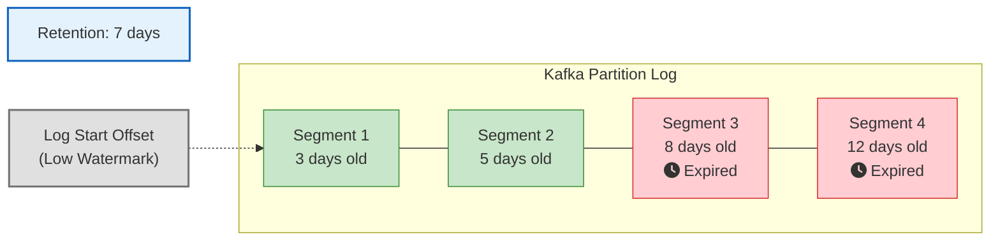
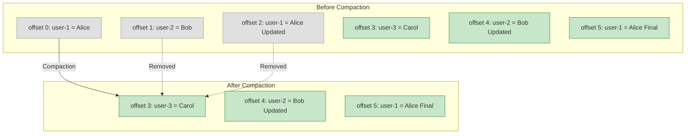
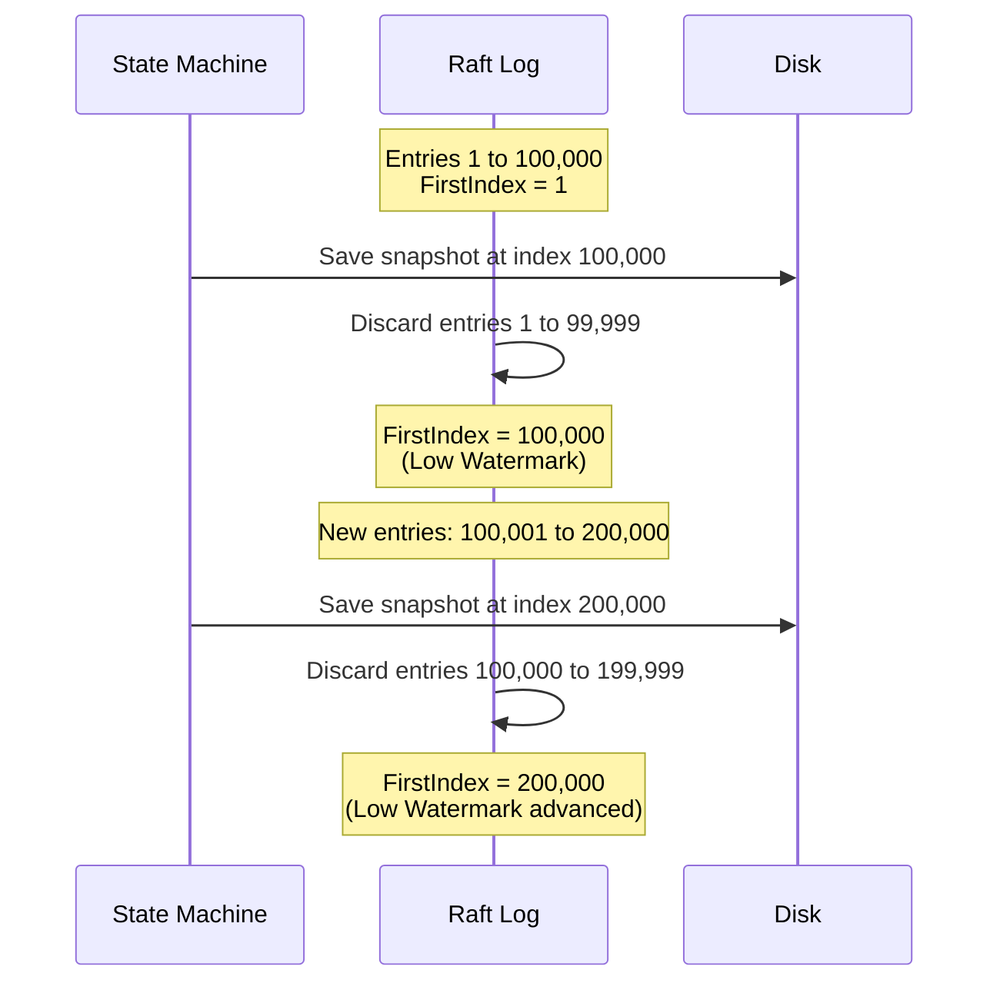
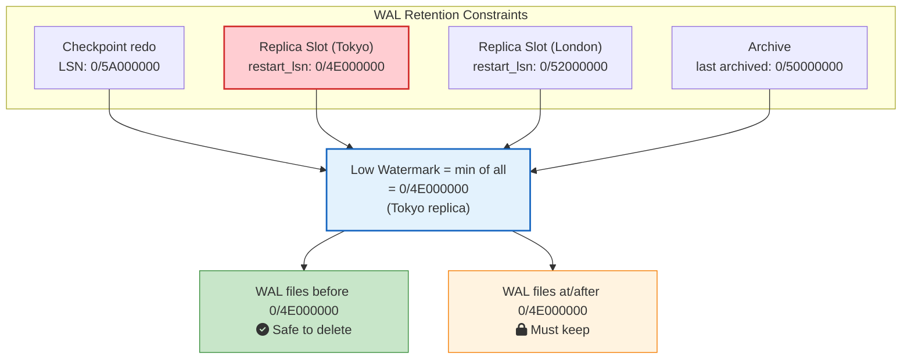
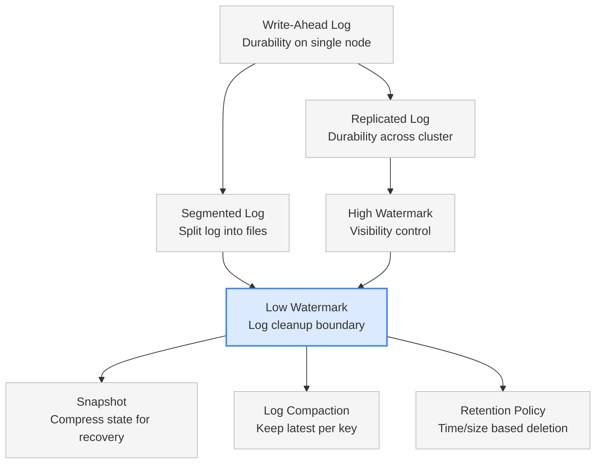

Your Kafka cluster has been running in production for six months. Everything looks fine until one morning, an alert fires: disk usage at 95%. You check the broker and find terabytes of old log segments sitting there. Messages from months ago that no consumer will ever read again. But the broker kept them all because nothing told it those logs were safe to delete.

This is the problem the **Low Watermark** pattern solves. It tells the system: everything before this point? You can let it go.

## The Problem: Logs That Never Stop Growing

Every durable distributed system writes to some form of [write-ahead log (WAL)](/distributed-systems/write-ahead-log/). Every database insert, every Kafka message, every Raft command goes into a log first. That log is what keeps your data safe when nodes crash.

But logs are append-only. They only grow. Even with [segmented logs](https://martinfowler.com/articles/patterns-of-distributed-systems/segmented-log.html) that split the log into manageable files, the total storage keeps climbing.

Think about it. A Kafka broker handling 10,000 messages per second produces about 864 million messages per day. At 1 KB per message, that is roughly 860 GB of log data every single day. After a month, you are looking at over 25 TB on a single broker. After a year, the math stops being fun.

Databases have the same problem. PostgreSQL's WAL files accumulate with every transaction. etcd's Raft log grows with every key-value update. Without cleanup, every system eventually runs out of disk and dies.

The question is: **which parts of the log can you safely throw away?**

That is what the Low Watermark answers.

## What Is the Low Watermark?

The Low Watermark is an index in the write-ahead log that marks the oldest entry the system still needs to keep. Everything below this index can be safely deleted, compacted, or replaced by a snapshot.

If you read the [High Watermark](/distributed-systems/high-watermark/) post, you know it controls **visibility**: how far forward clients can safely read. The Low Watermark is its counterpart. It controls **cleanup**: how far back the system needs to retain data.



The log has three zones:

| Zone | Entries | Status |
|------|---------|--------|
| **Below Low Watermark** | 1, 2, 3 | Safe to delete. No node needs them. |
| **Between Low and High Watermark** | 4, 5, 6, 7, 8 | Active data. Committed and still needed. |
| **Above High Watermark** | 9, 10 | Uncommitted. Not yet safe to read. |

Together, the two watermarks define the **active window** of the log. The Low Watermark trims the tail. The High Watermark caps the head.

## How the Low Watermark Works

The core idea is straightforward. The system tracks every reason it might need old log entries. The Low Watermark is set to the **minimum** across all of them. Only when every consumer, every replica, and every backup has moved past an entry can that entry be deleted.

### Step by Step

Here is how it works in a typical replicated system:

**1. Nodes apply log entries to their state machines.**

Each node in the cluster independently takes committed log entries and applies them. A database node executes the SQL statements. A key-value store updates its in-memory hash map. Each node tracks how far it has applied: this is its `lastApplied` index.

**2. The system computes the safe cleanup point.**

The Low Watermark is the **minimum `lastApplied` across all nodes**. If Node A has applied up to entry 50, Node B up to entry 48, and Node C up to entry 45, then the Low Watermark is 45. Entries 1 through 44 are safe to delete because every node has already processed them.

**3. A background task cleans up.**

A periodic background thread checks the Low Watermark and deletes log segments that fall entirely below it. This runs separately from the main processing path to avoid slowing down writes.

**4. The Low Watermark advances over time.**

As slow nodes catch up and apply more entries, the minimum `lastApplied` moves forward. The cleanup point advances, and more old log data becomes eligible for deletion.







Notice how the Low Watermark is bottlenecked by the **slowest node**. Node C was at 45, so nothing below 45 could be deleted even though Nodes A and B were ahead. Once Node C caught up to 48, the Low Watermark moved forward.

This is a key point: **a slow or stuck node holds back cleanup for the entire cluster**.

## Two Approaches to Moving the Low Watermark

Different systems use different strategies to advance the Low Watermark and reclaim disk space. The two main approaches are **snapshot-based cleanup** and **time/size-based retention**.

### Approach 1: Snapshot-Based Cleanup

This is how Raft, etcd, ZooKeeper, and most consensus systems work.

The idea is simple. Instead of replaying the entire log from the beginning to rebuild state, take a **snapshot** of the current state machine at a specific log index. Once you have a snapshot at index 100, you do not need log entries 1 through 100 anymore. Any node that needs to rebuild can load the snapshot and then replay only entries 101 onwards.



The snapshot becomes the new starting point. The Low Watermark jumps forward to the snapshot index. Any follower that is so far behind that it needs entries before the snapshot cannot use the log anymore. It must receive the full snapshot and start from there.

### Approach 2: Time/Size-Based Retention

This is how Kafka and many messaging systems work.

Instead of snapshots, the system defines retention policies. "Keep messages for 7 days" or "Keep no more than 100 GB per partition." A background process periodically checks each log segment against these policies and deletes segments that have expired.



After cleanup, segments 3 and 4 are gone. The Log Start Offset (Kafka's Low Watermark) moves forward. Any consumer trying to read offsets from those deleted segments gets an `OFFSET_OUT_OF_RANGE` error and must reset.

## Real-World Implementations

### Apache Kafka: Log Start Offset

Kafka does not use the term "Low Watermark" in its documentation, but the concept maps directly to the **Log Start Offset (LSO)**, which is the earliest offset still available on a broker for a given partition.

Kafka uses two cleanup mechanisms that advance the Log Start Offset:

**Delete policy** (`log.cleanup.policy=delete`): The default for most topics. Kafka deletes entire log segments when they exceed the retention window.

| Configuration | Default | What it does |
|--------------|---------|--------------|
| `log.retention.ms` | 604,800,000 (7 days) | Delete segments older than this |
| `log.retention.bytes` | -1 (unlimited) | Delete oldest segments when partition exceeds this size |
| `log.retention.check.interval.ms` | 300,000 (5 min) | How often to check for expired segments |

**Compact policy** (`log.cleanup.policy=compact`): Used for topics where you only care about the latest value per key (like changelogs and CDC streams). The compaction thread scans old segments, builds a map of each key's latest offset, and creates new segments containing only the latest records.







After compaction, only the latest value for each key remains. Offsets 0, 1, and 2 are gone. The Log Start Offset advances.

You can also combine both: `log.cleanup.policy=compact,delete`. This keeps the latest value per key but also enforces time-based expiration on the compacted data. Useful for things like session data where you want the latest state but also want to clean up after a TTL.

**What happens to consumers?**

When the Log Start Offset advances past a consumer's current position, Kafka returns `OFFSET_OUT_OF_RANGE`. The consumer's `auto.offset.reset` configuration determines what happens next:

- `earliest`: Jump to the new Log Start Offset and continue from there
- `latest`: Jump to the end of the log and only read new messages
- `none`: Throw an exception. The application must handle it.

This is why monitoring consumer lag against the [High Watermark](/distributed-systems/high-watermark/) matters. If a consumer falls too far behind, the data it needs might literally not exist anymore.

### etcd and Raft: Snapshot Compaction

In Raft-based systems like etcd, the Low Watermark advances through **snapshot compaction**. The state machine periodically takes a snapshot of its entire state and persists it to disk. After the snapshot is saved, log entries up to the snapshot index are discarded.

etcd controls this with the `--snapshot-count` flag (default: 100,000). After 100,000 new entries, etcd takes a snapshot and truncates the log.



The `FirstIndex()` function in etcd's Raft implementation returns the first log entry still available. This is the Low Watermark. Any request for an entry before `FirstIndex` returns `ErrCompacted`.

**What happens to slow followers?**

If a follower is so far behind that it needs entries before `FirstIndex`, normal log replication will not work. The leader detects this and sends the follower a full snapshot instead. The follower loads the snapshot, wipes its old state, and starts replaying from the snapshot index forward.

This is expensive. A snapshot can be hundreds of megabytes or even gigabytes. It is one of the main reasons you want your cluster nodes to stay relatively close together. A node that falls too far behind triggers a full state transfer instead of a cheap incremental replay.

### PostgreSQL: WAL Checkpoints and Replication Slots

PostgreSQL's WAL cleanup is a good example of how the Low Watermark works as a **multi-constraint minimum**.

PostgreSQL cannot delete a WAL file until **all** of the following have moved past it:

1. **Checkpoint redo point**: The checkpoint records a redo LSN (Log Sequence Number). If the database crashes, recovery starts from this LSN. WAL files before it are needed for crash recovery until the next checkpoint completes.

2. **Replication slots**: Each replication slot tracks a `restart_lsn`, the earliest WAL position that a replica might still need. If you have a replica in Tokyo that is 30 minutes behind, the primary must keep 30 minutes of WAL files.

3. **Archive requirements**: If WAL archiving is enabled (for point-in-time recovery), WAL files must be archived before they can be deleted.

The LSN values below (like `0/4E000000`) are hexadecimal WAL positions in PostgreSQL's `segment/offset` format. You can check these on your own database:

```sql
-- Check replication slot positions
SELECT slot_name, slot_type, active, restart_lsn
FROM pg_replication_slots;

-- Check current WAL write position
SELECT pg_current_wal_lsn();

-- Check latest checkpoint location
SELECT checkpoint_lsn FROM pg_control_checkpoint();
```







The Tokyo replica is the bottleneck here. Even though the checkpoint, London replica, and archive have all moved past `0/50000000`, the Tokyo replica still needs data from `0/4E000000`. The Low Watermark stays at the minimum.

This is the scenario every PostgreSQL DBA dreads: a **stale replication slot**. If a replica goes down and its slot is not cleaned up, that slot's `restart_lsn` never advances. PostgreSQL keeps accumulating WAL files, and the primary's disk fills up. It is one of the most common causes of PostgreSQL production outages.

### ZooKeeper: Transaction Log Purging

ZooKeeper takes a similar snapshot-based approach. It periodically writes snapshots of its data tree and transaction logs. The `autopurge.snapRetainCount` setting (default: 3) controls how many recent snapshots to keep. The `autopurge.purgeInterval` setting controls how often the purge task runs (in hours).

When the purge task runs, it keeps the most recent N snapshots and deletes all snapshots and transaction logs older than the oldest retained snapshot. The Low Watermark is effectively the `zxid` (ZooKeeper transaction ID) of the oldest retained snapshot.

## The Danger of Getting It Wrong

The Low Watermark is a balancing act. Too aggressive, and you break things. Too conservative, and you waste resources.

### Too Aggressive: Data Loss and Broken Recovery

If you advance the Low Watermark past entries that a slow replica still needs:

- <i class="fas fa-times-circle text-danger"></i> **Broken follower catch-up**: The follower cannot replay the log to catch up. It needs a full snapshot transfer, which is expensive and can saturate the network.
- <i class="fas fa-times-circle text-danger"></i> **Lost consumer data**: In Kafka, consumers that were behind the deleted offsets lose their position and potentially miss messages.
- <i class="fas fa-times-circle text-danger"></i> **Broken backup and restore**: If your backup tool was reading from a position that no longer exists, the backup fails.
- <i class="fas fa-times-circle text-danger"></i> **Broken point-in-time recovery**: In PostgreSQL, deleting WAL files needed for PITR means you cannot restore to a specific past timestamp.

### Too Conservative: Resource Exhaustion

If you never advance the Low Watermark (or advance it too slowly):

- <i class="fas fa-times-circle text-danger"></i> **Disk fills up**: The most obvious problem. Logs grow until the disk is full, and the entire system stops.
- <i class="fas fa-times-circle text-danger"></i> **Slower recovery**: On restart, the node must replay a massive log from the beginning, which can take hours.
- <i class="fas fa-times-circle text-danger"></i> **Higher memory usage**: Some systems keep recent log entries in memory for fast access. More retained entries means more memory.
- <i class="fas fa-times-circle text-danger"></i> **Longer state transfers**: When a new node joins, it must receive and process a larger backlog, making cluster scaling slower.

### A Real Production Story

Here is a scenario that plays out in production more often than people admit.

A team runs a Kafka cluster with `log.retention.hours=168` (7 days). One of their consumer groups goes offline on a Friday evening. Nobody notices until Monday morning, 60 hours later. The consumer group's lag is now 60 hours behind the High Watermark, but the retention is 7 days, so the data is still there.

They restart the consumer. It catches up over the next few hours. Crisis averted.

Now imagine the same scenario, but the retention was set to `log.retention.hours=24`. The consumer goes down Friday evening and comes back Monday morning. The data from Friday night and Saturday is gone. The consumer gets `OFFSET_OUT_OF_RANGE`. Depending on `auto.offset.reset`, it either jumps to the latest offset (skipping 60 hours of data) or crashes.

The retention period is your Low Watermark policy. Set it too low and you lose data when things go wrong. Set it too high and you pay for storage you will never use.

## Implementation Sketch





Here is a simplified implementation showing how the Low Watermark works in a replicated system with snapshot support:

```python
class ReplicatedLog:
    def __init__(self):
        self.segments = []
        self.low_watermark = 0
        self.snapshot_index = 0
        self.node_applied = {}

    def report_applied(self, node_id, applied_index):
        """Called when a node reports its lastApplied index."""
        self.node_applied[node_id] = applied_index
        self._try_advance_low_watermark()

    def _try_advance_low_watermark(self):
        if not self.node_applied:
            return

        min_applied = min(self.node_applied.values())
        safe_to_delete = max(min_applied, self.snapshot_index)

        if safe_to_delete > self.low_watermark:
            self.low_watermark = safe_to_delete
            self._cleanup_segments()

    def _cleanup_segments(self):
        """Remove log segments that fall entirely below the low watermark."""
        self.segments = [
            seg for seg in self.segments
            if seg.end_index >= self.low_watermark
        ]

    def take_snapshot(self, state, at_index):
        """Persist a snapshot and advance the cleanup boundary."""
        save_to_disk(state, at_index)
        self.snapshot_index = at_index
        self._try_advance_low_watermark()

    def get_entries(self, from_index):
        """Fetch log entries starting at from_index."""
        if from_index < self.low_watermark:
            raise CompactedError(
                f"Entry {from_index} is below low watermark "
                f"{self.low_watermark}. Use snapshot instead."
            )
        return self._read_from_segments(from_index)
```

The key logic is in `_try_advance_low_watermark`: it takes the minimum of all reported `lastApplied` values and the snapshot index, and only advances the Low Watermark when it is safe to do so.

## How It Connects to Other Patterns

The Low Watermark does not work alone. It sits in a family of distributed systems patterns that handle different aspects of log management:



- The [Write-Ahead Log](/distributed-systems/write-ahead-log/) provides durability on a single node. The Low Watermark tells you when old WAL entries can be cleaned up.
- The [Replicated Log](/distributed-systems/replicated-log/) extends durability across the cluster. The Low Watermark must respect the slowest replica.
- The [High Watermark](/distributed-systems/high-watermark/) controls the upper bound (what is committed). The Low Watermark controls the lower bound (what can be discarded).
- **Snapshots** compress the full state at a point in time, allowing the log before that point to be truncated.
- **Log Compaction** selectively removes outdated entries per key rather than truncating a whole prefix.
- **Retention Policies** enforce time or size limits independent of replication state.
- The [Hybrid Logical Clock](/distributed-systems/hybrid-clock/) gives each log entry a monotonic, time-aware version, which is what makes "delete everything before timestamp T" a meaningful operation across nodes.

## Key Takeaways for Developers

1. **The Low Watermark is about cleanup, not visibility.** It answers "what can we delete?" while the [High Watermark](/distributed-systems/high-watermark/) answers "what can clients read?" They are two sides of the same coin.

2. **The slowest consumer sets the pace.** The Low Watermark cannot advance past the slowest replica, the oldest replication slot, or the most behind backup cursor. A single stuck consumer can hold back cleanup for the entire cluster.

3. **Monitor your retention and disk usage.** In Kafka, track `kafka.log:type=Log,name=LogStartOffset` and consumer lag. In PostgreSQL, monitor replication slot `restart_lsn` values. In etcd, watch the `--snapshot-count` and compaction metrics.

4. **Clean up stale replication slots and consumers.** A disconnected PostgreSQL replica with an active slot will prevent WAL cleanup forever. An abandoned Kafka consumer group does not hold back retention, but a Kafka connector with a stuck offset does. Audit your slots and consumers regularly.

5. **Snapshot-based systems are more aggressive.** In etcd, once a snapshot is taken, old log entries are gone. There is no "keep them for 7 days just in case." If a follower is too slow, it gets a full snapshot transfer. This keeps disk usage tight but makes slow followers expensive.

6. **Design your retention around your worst-case recovery time.** If your consumers can be down for up to 48 hours, set retention to at least 72 hours. Give yourself a buffer. Disk is cheap compared to the cost of losing data.

## Wrapping Up

The Low Watermark is one of those patterns that you barely notice when it is working correctly. Disk usage stays stable. Old logs get cleaned up. Recovery works. Everything is fine.

You only notice it when something goes wrong. When a replication slot holds back WAL cleanup and the primary runs out of disk at 3 AM. When a consumer group comes back after the weekend and finds its offsets pointing at deleted segments. When a new etcd follower joins and needs a multi-gigabyte snapshot because the log was compacted too aggressively.

The pattern itself is simple: track the minimum position across everyone who still needs the log, and do not delete anything before that point. The hard part is getting the balance right between reclaiming space and keeping enough history for everyone who needs it.

Get it right, and your system runs for years without running out of disk. Get it wrong, and you learn a lot about disaster recovery.

---

*For more distributed systems patterns, check out [High Watermark](/distributed-systems/high-watermark/), [Hybrid Logical Clock](/distributed-systems/hybrid-clock/), [Write-Ahead Log](/distributed-systems/write-ahead-log/), [Replicated Log](/distributed-systems/replicated-log/), [Majority Quorum](/distributed-systems/majority-quorum/), [Heartbeat](/distributed-systems/heartbeat/), [Gossip Dissemination](/distributed-systems/gossip-dissemination/), [Paxos](/distributed-systems/paxos/), [Two-Phase Commit](/distributed-systems/two-phase-commit/), and [How Kafka Works](/distributed-systems/how-kafka-works/).*

*Further reading: Unmesh Joshi's [Patterns of Distributed Systems](https://martinfowler.com/articles/patterns-of-distributed-systems/low-watermark.html) on Martin Fowler's site covers the Low Watermark and related patterns in depth.*
