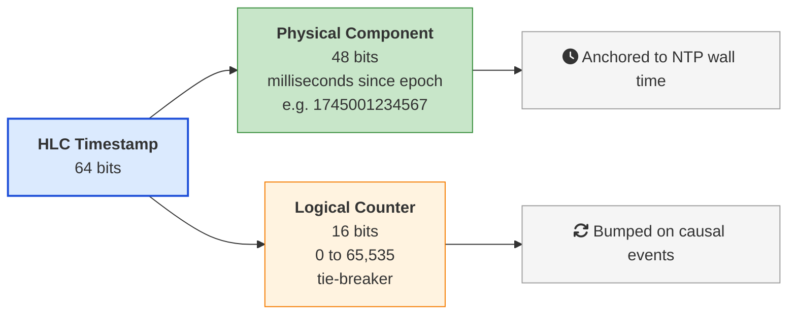
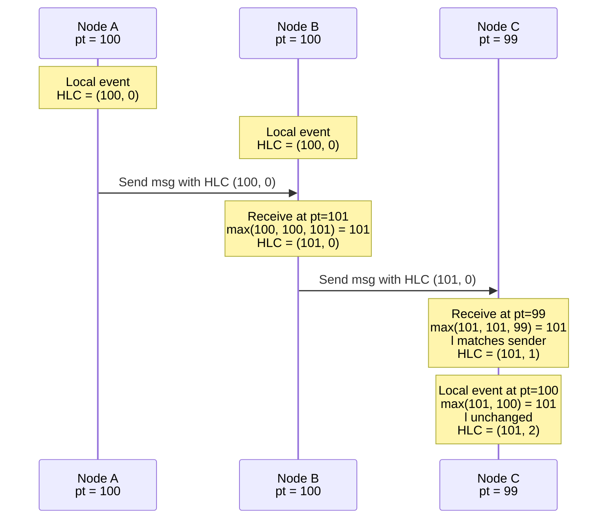
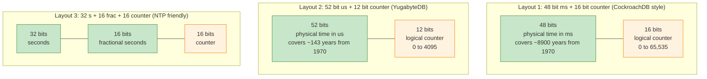
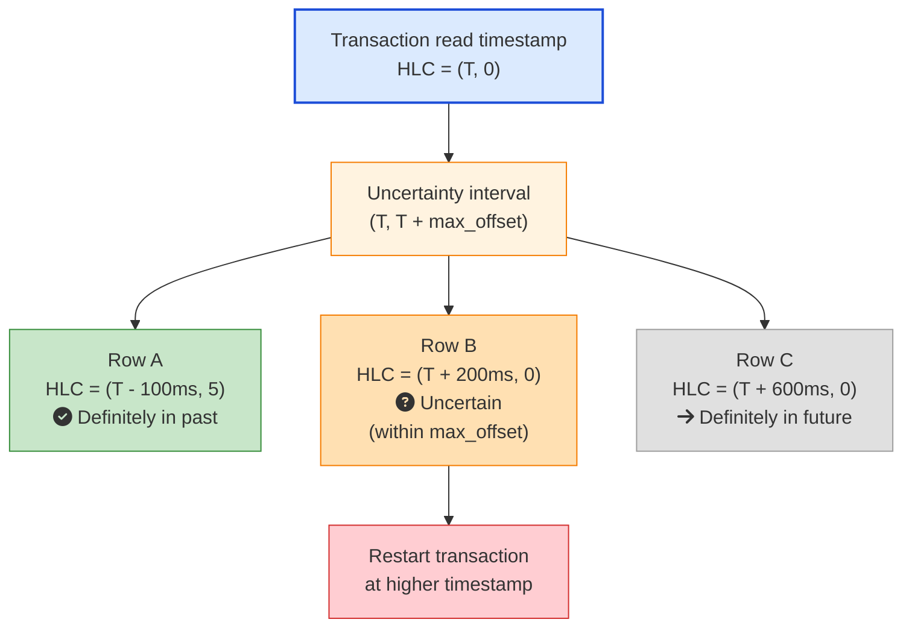
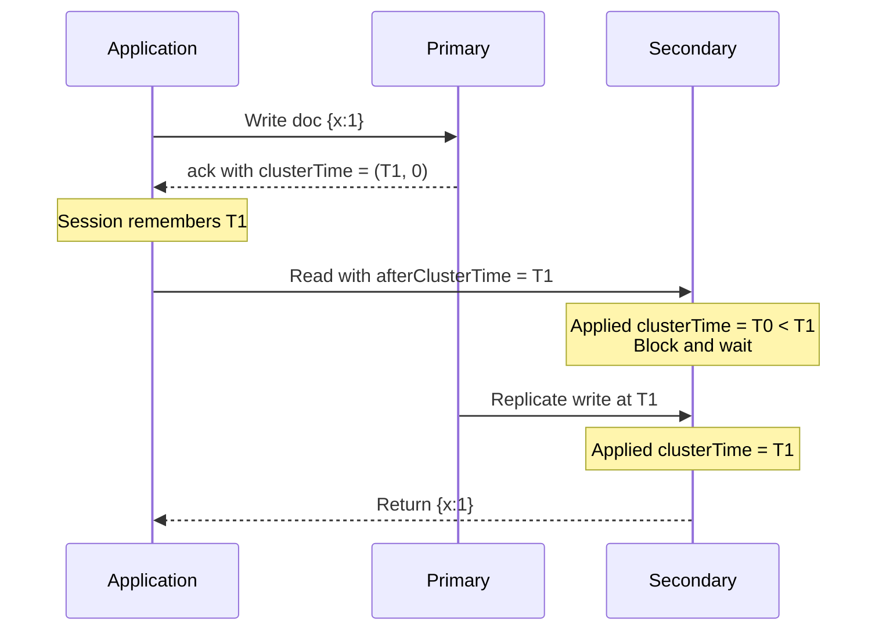
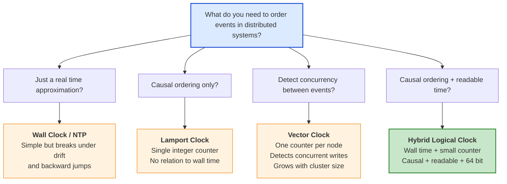
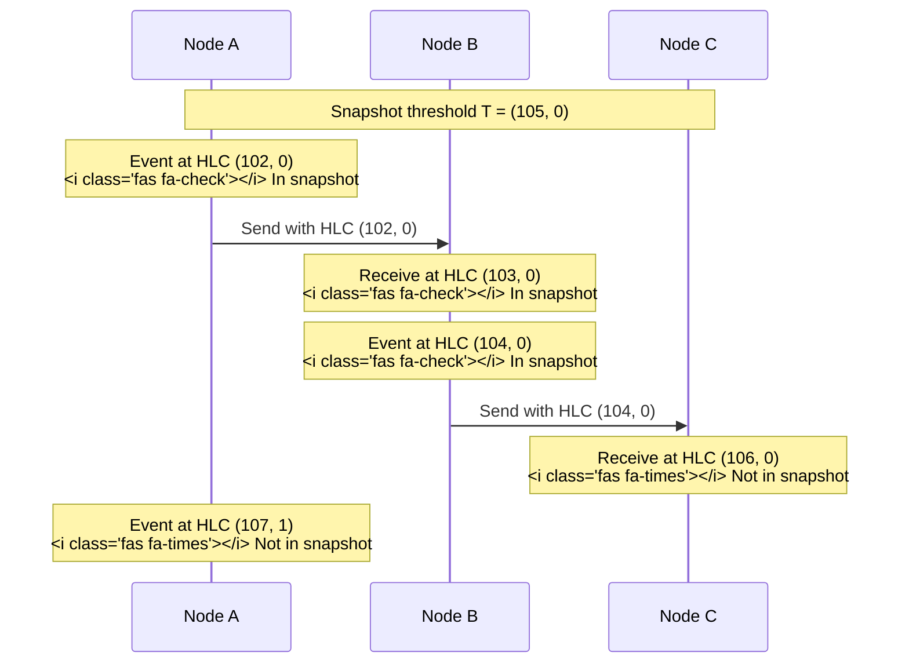
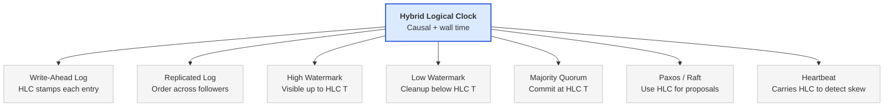

Picture a globally distributed database with three nodes. One in New York. One in London. One in Tokyo. A transaction starts in New York at `12:00:00.500`. It writes a row, then sends a message to Tokyo to write a related row. The Tokyo node receives the message at `12:00:00.498` according to its own clock, two milliseconds before the New York event "happened".

That clock skew is normal. NTP keeps clocks within a few milliseconds of each other on a good day, and within a few hundred milliseconds on a bad day. But the database now has a problem. If you order writes by wall clock time, Tokyo's row appears to have been written before New York's row, even though New York actually triggered it. A snapshot read at `12:00:00.499` would see Tokyo's row but not the New York row that caused it. That breaks causality.

This is the exact problem the **Hybrid Logical Clock** pattern solves. It combines the readability of wall clock time with the causal correctness of a [Lamport Clock](https://martinfowler.com/articles/patterns-of-distributed-systems/lamport-clock.html){:target="_blank" rel="noopener"} so you get both in a single 64 bit timestamp.

## The Problem: Two Bad Choices for Time

Before HLC, distributed systems engineers had two options for ordering events across nodes, and both had serious flaws.

### Option 1: Use the System Wall Clock

Just call `System.currentTimeMillis()` and use that as the version. Easy. Readable. Searchable.

The problem is that wall clocks lie. NTP corrections, leap seconds, virtualization pauses, and bad hardware all cause clocks to drift, jump forward, or even jump backward. A node that crashed and rejoined might have a clock that is 30 seconds behind. A virtual machine that paused for a snapshot might wake up with a clock that is 5 minutes behind. If you ordered transactions by wall time, those events would appear to have happened in the past, and a follower that already saw "future" timestamps would silently drop them.

Even on a healthy cluster, NTP only guarantees synchronization within tens of milliseconds. That is enough skew to make causally related events appear out of order.

### Option 2: Use a Lamport Clock

A [Lamport Clock](https://en.wikipedia.org/wiki/Lamport_timestamp){:target="_blank" rel="noopener"} is a single integer that increments on every event. The rule is simple: on receive, set your local clock to `max(local, received) + 1`. This guarantees that if A happens before B, then `LC(A) < LC(B)`.

The problem with Lamport clocks is that the integer has no meaning. A Lamport timestamp of `4837291` tells you nothing about when the event happened. You cannot answer "show me all rows written between 9 AM and 10 AM yesterday" because the version is just an opaque number. You cannot use it for time-travel queries, MVCC snapshots tied to wall time, or anything a human needs to interpret.

You can read more about Lamport's original idea in his classic 1978 paper [Time, Clocks, and the Ordering of Events in a Distributed System](https://lamport.azurewebsites.net/pubs/time-clocks.pdf){:target="_blank" rel="noopener"}.

### What We Actually Want

We want a timestamp that is:

1. **Monotonic** within and across nodes. It never goes backward.
2. **Close to wall clock time**. We can interpret it as a real date.
3. **Causally correct**. If A happens before B, then `T(A) < T(B)`.
4. **Compact**. It fits in 64 bits so it can be stored as a database row version, an MVCC tag, or a Kafka offset.
5. **Tolerant of NTP drift**. It does not break when clocks disagree by a few hundred milliseconds.

The Hybrid Logical Clock gives us all five. It was formalized in the 2014 paper [Logical Physical Clocks and Consistent Snapshots in Globally Distributed Databases](https://cse.buffalo.edu/tech-reports/2014-04.pdf){:target="_blank" rel="noopener"} by Sandeep Kulkarni, Murat Demirbas, and colleagues at Michigan State and Buffalo.

## What Is a Hybrid Logical Clock?

An HLC timestamp is a tuple of two values:

- `l` (physical or logical-physical time): A wall clock value, usually milliseconds or microseconds since the Unix epoch
- `c` (logical counter): An integer that breaks ties when multiple events share the same `l`

Both fit together into a single 64 bit value. The physical part dominates the comparison. The counter only matters when two HLCs share the same physical time.



When you compare two HLCs, you compare the physical part first, then the counter. Lexicographic order. That single rule gives you a total order across the cluster.

| HLC A | HLC B | Comparison | Reason |
|-------|-------|------------|--------|
| `(1000, 0)` | `(2000, 0)` | A < B | Physical part wins |
| `(2000, 5)` | `(2000, 3)` | A > B | Same physical, counter wins |
| `(2000, 0)` | `(2000, 0)` | A == B | Identical |
| `(1999, 99)` | `(2000, 0)` | A < B | Physical part wins, counter ignored |

## How HLC Works: The Algorithm

Each node `j` keeps a single HLC state `(l.j, c.j)`. There are three events that update it: a local event, a send, and a receive. The algorithm is short, and it is the same idea as a Lamport clock except the counter only ticks when the physical clock cannot distinguish events.

### Local or Send Event

When a node performs a local event or sends a message, it advances its clock and stamps the event:

```python
old_l = l.j
l.j   = max(old_l, pt.j)
if l.j == old_l:
    c.j = c.j + 1
else:
    c.j = 0
return (l.j, c.j)
```

Here `pt.j` is the current physical time on node `j`. If the physical clock advanced, we adopt it and reset the counter. If it did not (because two events happened in the same millisecond, or the physical clock went backward), we keep the previous `l` and bump the counter.

### Receive Event

When a node receives a message tagged with the sender's HLC `(l.m, c.m)`, it merges the three values: its previous `l`, the sender's `l`, and its current physical clock.

```python
old_l = l.j
l.j   = max(old_l, l.m, pt.j)

if l.j == old_l == l.m:
    c.j = max(c.j, c.m) + 1
elif l.j == old_l:
    c.j = c.j + 1
elif l.j == l.m:
    c.j = c.m + 1
else:
    c.j = 0

return (l.j, c.j)
```

The four branches handle the four possible "winners" of the `max`. Whichever component contributed the new `l`, we set the counter to keep the timestamp strictly greater than every input.

### A Worked Example

Three nodes. Wall clocks roughly synchronized but not perfectly. Time flows left to right.



Notice what happened on Node C. Its physical clock was behind (`pt = 99` then `pt = 100`), but the HLC still moved forward to `(101, 0)` after receiving the message, then to `(101, 1)` and `(101, 2)` for subsequent local events. Causality is preserved even though Node C's wall clock is behind.

This is the core magic of HLC. **Even when individual physical clocks drift or disagree, the cluster as a whole produces a strictly increasing, causally correct timestamp sequence.**

## A Reference Implementation

Here is a clean Python implementation that follows the algorithm directly. It is similar in spirit to Unmesh Joshi's [`HybridTimestamp`](https://martinfowler.com/articles/patterns-of-distributed-systems/hybrid-clock.html){:target="_blank" rel="noopener"} Java example in *Patterns of Distributed Systems*.

```python
import time
import threading

class HybridLogicalClock:
    def __init__(self):
        self._lock = threading.Lock()
        self._l = 0
        self._c = 0

    def _physical_now_ms(self):
        return int(time.time() * 1000)

    def now(self):
        """Generate a timestamp for a local event or outgoing send."""
        with self._lock:
            pt = self._physical_now_ms()
            old_l = self._l
            self._l = max(old_l, pt)
            if self._l == old_l:
                self._c += 1
            else:
                self._c = 0
            return (self._l, self._c)

    def update(self, msg_l, msg_c):
        """Merge an incoming HLC from a received message."""
        with self._lock:
            pt = self._physical_now_ms()
            old_l = self._l
            self._l = max(old_l, msg_l, pt)

            if self._l == old_l == msg_l:
                self._c = max(self._c, msg_c) + 1
            elif self._l == old_l:
                self._c += 1
            elif self._l == msg_l:
                self._c = msg_c + 1
            else:
                self._c = 0
            return (self._l, self._c)
```

Three properties to notice:

1. **All updates take the lock.** HLC is per-node shared state. Without the lock you can violate monotonicity.
2. **The counter is the only place that grows when physical time stalls or jumps backward.** That is what gives you tolerance to NTP corrections.
3. **The timestamp returned by `now()` is always strictly greater than every previous local timestamp and every incoming `(msg_l, msg_c)` seen so far.** That is the invariant the rest of the system depends on.

If you want to inspect a battle tested implementation, read [`pkg/util/hlc/hlc.go`](https://github.com/cockroachdb/cockroach/blob/master/pkg/util/hlc/hlc.go){:target="_blank" rel="noopener"} in the CockroachDB source tree. It adds atomic reads for the fast path, panic guards for huge clock jumps, and per-cluster max offset enforcement.

## Encoding HLC in 64 Bits

The whole point of HLC is to fit into one 64 bit integer so you can use it as an MVCC version, a Kafka offset key, a Raft log entry tag, or a row version in a B-tree. There are a few popular layouts.



Sixteen bits of counter sounds tiny but it is plenty in practice. A 16 bit counter only overflows if a single node generates more than 65,535 events in the same physical millisecond, which would require the system clock to be frozen for that millisecond. If your clock advances even once, the counter resets to zero.

Twelve bits, like YugabyteDB uses, allows up to 4096 events per physical microsecond. That is roughly one event every 250 picoseconds, which no real workload comes close to.

## Real World Implementations

### CockroachDB: HLC for Transaction Ordering

[CockroachDB](https://www.cockroachlabs.com/blog/clock-management-cockroachdb/){:target="_blank" rel="noopener"} was one of the first widely deployed databases to use HLC. Every transaction gets an HLC timestamp at the gateway node, and that timestamp travels with the transaction through every range, every replica, and every conflict resolution.

The clever part is what happens when CockroachDB cannot tell from the HLC alone whether a row was written before or after a transaction started. This is the **uncertainty interval**.



If a transaction reads a row with an HLC inside its uncertainty interval, CockroachDB cannot prove the row was written after the transaction started or just looks that way because of clock skew. The safe move is to **restart the transaction at a higher timestamp** so the row is unambiguously in the past.

The default `--max-offset` is 500 milliseconds. CockroachDB also actively monitors the inter-node skew. If a node detects its clock has drifted past 80 percent of `max-offset` against a majority of peers, it shuts itself down to protect consistency. This is documented in the [CockroachDB clock management runbook](https://github.com/cockroachlabs/cockroachdb-runbook-template/blob/main/system-overview/clock-management.md){:target="_blank" rel="noopener"}.

This is the trade off CockroachDB makes versus Google Spanner. Spanner uses GPS and atomic clocks ([TrueTime](https://research.google/pubs/spanner-googles-globally-distributed-database-2/){:target="_blank" rel="noopener"}) to keep skew under 7 milliseconds. CockroachDB uses HLC plus NTP, which is good enough for most workloads but causes more transaction restarts when clocks drift. If you are interested in how Spanner handles globe scale traffic, our post on [how Google Ads scales with Spanner](/how-google-ads-scales-with-spanner/){:target="_blank" rel="noopener"} digs into the TrueTime side of the story.

### MongoDB: HLC as Cluster Time

MongoDB uses HLC under the name **cluster time**. Every write to the primary stamps an oplog entry with the current cluster time. The cluster time is propagated through the wire protocol on every command, so drivers, mongos routers, and replica members all stay in sync.

The clever application is **causally consistent sessions**, introduced in MongoDB 3.6. When a client opens a session, the driver remembers the highest cluster time it has seen. Every subsequent read attaches that value as `afterClusterTime`. The receiving secondary blocks the read until its applied cluster time is at least that high.



Without HLC, that read on the secondary would have to either go to the primary (defeating the point of having replicas) or risk missing the write that just happened. With HLC, the secondary knows exactly when its data is "fresh enough" for this client, even if a different client connected to the secondary sees a slightly older view.

If you are choosing between databases for a similar workload, our comparison of [PostgreSQL vs MongoDB vs DynamoDB](/postgresql-vs-mongodb-vs-dynamodb/){:target="_blank" rel="noopener"} covers when MongoDB's causal consistency model is the right fit.

### YugabyteDB: HLC Inside DocDB

[YugabyteDB](https://docs.yugabyte.com/v2024.2/architecture/transactions){:target="_blank" rel="noopener"} uses HLC inside its DocDB storage layer. The 64 bit timestamp is stored alongside every row version and used for MVCC, transaction ordering, and last writer wins resolution in xCluster active-active deployments.

YugabyteDB exposes the current HLC through SQL:

```sql
SELECT yb_get_current_hybrid_time_lsn();
-- 7016203829923512320
```

You can decode this 64 bit integer into the physical microseconds and the 12 bit counter. Right shift by 12 bits to get the microsecond part, divide by 1000 to get milliseconds since the Unix epoch, then drop that into our [Epoch Converter](/tools/epoch-converter/){:target="_blank" rel="noopener"} to read it as a regular date. This is useful for debugging, building consistent backup boundaries, or coordinating external systems with internal HLC values.

The DocDB design follows the same pattern as CockroachDB. A leader stamps writes with HLC, replicates through Raft, and uses uncertainty windows to handle reads that might fall inside a clock skew window.

### Other Implementations

| System | What HLC powers | Notes |
|--------|-----------------|-------|
| [CockroachDB](https://github.com/cockroachdb/cockroach/blob/master/pkg/util/hlc/hlc.go){:target="_blank" rel="noopener"} | Transaction ordering, MVCC, follower reads | Default 500 ms max offset, panics on big skew |
| [MongoDB](https://www.mongodb.com/blog/post/casual-guarantees-anything-casual){:target="_blank" rel="noopener"} | Cluster time, causally consistent sessions, oplog ordering | Exposed as `$clusterTime` in every command |
| [YugabyteDB](https://github.com/yugabyte/yugabyte-db/blob/master/src/yb/server/hybrid_clock.cc){:target="_blank" rel="noopener"} | DocDB MVCC, distributed transactions, xCluster | 52 bit microseconds + 12 bit counter |
| [TiDB](https://docs.pingcap.com/tidb/stable/tso/){:target="_blank" rel="noopener"} | Hybrid time via PD timestamp oracle (related, not pure HLC) | Centralized TSO instead of per-node HLC |
| [FoundationDB](https://apple.github.io/foundationdb/transaction-processing.html){:target="_blank" rel="noopener"} | Versionstamps for ordering | Uses a dedicated sequencer rather than HLC |
| [Dropbox Magic Pocket](https://dropbox.tech/infrastructure/inside-the-magic-pocket){:target="_blank" rel="noopener"} and other in-house systems | Internal version ordering | Influenced by the original HLC paper |

## How HLC Compares to Other Clocks

Here is the quick mental model. Each clock fixes a different problem.



| Property | Wall Clock | Lamport Clock | Vector Clock | Hybrid Logical Clock |
|----------|-----------|---------------|--------------|----------------------|
| Total order | Yes (with ties) | Yes (with ties) | No (partial only) | Yes |
| Causal correctness | No | Yes | Yes | Yes |
| Detects concurrent events | No | No | Yes | No |
| Close to real time | Yes | No | No | Yes |
| Size | 64 bits | 64 bits | O(N) bits | 64 bits |
| Tolerates clock drift | No | N/A | N/A | Yes |
| Used by | Most legacy systems | Academic, some queues | Dynamo, Riak, Voldemort | CockroachDB, MongoDB, YugabyteDB |

The big insight: HLC is not a replacement for vector clocks when you need to detect concurrent writes (Riak, Dynamo style systems still use vector clocks for sibling resolution). HLC is the right answer when you need a compact, time-aware total order, which is what most transactional databases need.

For more on Lamport clocks specifically, the original 1978 [Time, Clocks paper](https://lamport.azurewebsites.net/pubs/time-clocks.pdf){:target="_blank" rel="noopener"} is short and very readable. Kevin Sookocheff's [Hybrid Logical Clocks post](https://sookocheff.com/post/time/hybrid-logical-clocks/){:target="_blank" rel="noopener"} walks through the algorithm with great diagrams.

## Why HLC Enables Consistent Snapshots

One of the most important properties of HLC is that it makes **consistent distributed snapshots cheap to compute**.

A consistent snapshot is a set of states from each node such that no message could "cross the cut" from the future into the past. If node A sends a message at time T and node B receives it at time T', then either both events are in the snapshot or neither is.

With HLC, taking a snapshot at logical-physical time `T` is just: "for each node, include every event with HLC strictly less than `(T, 0)`." Because the algorithm guarantees that the receive HLC is always strictly greater than the send HLC, you cannot have a message in the snapshot whose send is outside it.



This snapshot is consistent because the send at `(104, 0)` was included on Node B but its receive at `(106, 0)` was excluded on Node C, which is fine. The opposite (receiving an event whose send is outside the snapshot) cannot happen because HLC guarantees `HLC(receive) > HLC(send)`.

This property is what makes HLC suitable for **MVCC reads at a specific timestamp** in CockroachDB and YugabyteDB. You pick an HLC `T`, ask every range for the latest committed value with HLC less than `T`, and you get a consistent view of the database as of that moment.

## Failure Modes and How They Are Handled

HLC is robust but it is not magic. Here are the failure modes you should know about.

### Backward Clock Jump

NTP corrections can cause the system clock to jump backward by a small amount (usually less than a second) or, in pathological cases, by minutes.

The HLC algorithm handles small backward jumps automatically. Because `l.j = max(old_l, pt.j)`, if `pt.j` is now less than `old_l`, the HLC keeps the old value and just bumps the counter. The cluster does not notice.

For large backward jumps, CockroachDB optionally panics the process if the jump exceeds a configured threshold (`--clock-device` and panic flags). The thinking is that a multi-second backward jump probably means the hardware is unhealthy, and you want the node out of the cluster fast before it corrupts data.

### Forward Clock Jump

A forward jump (e.g., a VM unpaused, NTP correction) is also handled by `max`. The HLC just adopts the new larger physical value. The risk is that this node's HLC is now in the future relative to other nodes. Their HLCs catch up next time they receive a message tagged with this node's HLC, so the cluster converges quickly.

### Counter Overflow

If you really managed to generate 65,536 events in a single physical millisecond on one node (for a 16 bit counter), the counter would overflow. In practice this never happens because as soon as the wall clock advances by even one millisecond, the counter resets. CockroachDB explicitly checks for this and panics if it ever sees a counter overflow without a clock advance, since it would indicate a frozen clock.

### Asymmetric Skew

The worst case is when two nodes have clocks that disagree by more than the configured `max_offset`. In CockroachDB this triggers the self-shutdown logic. In MongoDB and YugabyteDB, the consequence is more transaction restarts and longer wait times for causally consistent reads.

This is why monitoring `clock_offset_nanos` and equivalents is one of the first metrics every distributed database operator sets up. Pair it with [heartbeats](/distributed-systems/heartbeat/){:target="_blank" rel="noopener"} for failure detection and you have a solid story for clock health.

## How HLC Connects to Other Patterns

HLC sits in a family of distributed systems patterns that together make a transactional, causally consistent, replicated system possible.



- The [Write-Ahead Log](/distributed-systems/write-ahead-log/){:target="_blank" rel="noopener"} gets a monotonic version per entry. HLC is the natural choice.
- The [Replicated Log](/distributed-systems/replicated-log/){:target="_blank" rel="noopener"} needs a consistent ordering across followers. HLC carries that ordering across the wire.
- The [High Watermark](/distributed-systems/high-watermark/){:target="_blank" rel="noopener"} marks the latest HLC visible to clients.
- The [Low Watermark](/distributed-systems/low-watermark/){:target="_blank" rel="noopener"} marks the oldest HLC the system still needs to keep.
- [Majority Quorum](/distributed-systems/majority-quorum/){:target="_blank" rel="noopener"} commits a write when enough nodes have acked the HLC.
- [Paxos](/distributed-systems/paxos/){:target="_blank" rel="noopener"} and Raft use HLC-style versions for proposal numbers and term ordering.
- [Heartbeats](/distributed-systems/heartbeat/){:target="_blank" rel="noopener"} carry HLC values, which doubles as a clock skew probe.

If you want to see a more complete distributed pattern stack in action, the [transactional outbox pattern](/transactional-outbox-pattern/){:target="_blank" rel="noopener"} and [two-phase commit](/distributed-systems/two-phase-commit/){:target="_blank" rel="noopener"} posts walk through how these primitives compose into reliable workflows.

## Key Takeaways for Developers

1. **Reach for HLC when you need a versioned, time-aware total order.** That covers MVCC, distributed transactions, change data capture cursors, and consistent snapshots. It does not cover concurrency detection, where vector clocks still win.

2. **64 bits is enough.** The 48 bit physical part covers thousands of years. The 16 bit counter covers any realistic event rate. Do not be tempted to grow it.

3. **Keep your NTP healthy and monitor `max_offset`.** HLC is robust, but only up to your configured uncertainty window. A node with broken NTP will drag down the whole cluster's transaction throughput.

4. **Use HLC as your row version, not as your business timestamp.** The physical part is close to wall time but it is not the same. Store the application-level timestamp separately if you need it for business logic.

5. **Read the algorithm once and trust it.** The receive rule looks complex but it is just `max` with a tie-breaking counter. Once you internalize that, debugging HLC issues becomes much easier.

6. **HLC works best in symmetrically deployed clusters.** If one of your data centers has clocks that drift 5 seconds per day, no clever algorithm will save you. Start with good time discipline, then layer HLC on top.

## Wrapping Up

Time in distributed systems is one of those topics that looks simple from the outside and gets harder the more you know. Wall clocks lie. Logical clocks are opaque. Vector clocks do not scale. Atomic clocks are expensive.

The Hybrid Logical Clock is the pragmatic compromise that won. It gives you the causal correctness of a Lamport clock, the readability of a wall clock, the compactness of a 64 bit integer, and tolerance for the messy reality of NTP. That is why it ended up inside CockroachDB, MongoDB, YugabyteDB, and most other modern multi region databases.

The algorithm is short enough to fit on a napkin. The properties it gives you are deep enough to power production databases serving billions of transactions. That is a beautiful trade in a field where so many ideas demand expensive hardware or impossible assumptions.

Next time you debug a "this row appeared before its parent" bug or wonder why your follower reads sometimes block, you will know which timestamp to look at first.

---

*For more distributed systems patterns, check out [High Watermark](/distributed-systems/high-watermark/){:target="_blank" rel="noopener"}, [Low Watermark](/distributed-systems/low-watermark/){:target="_blank" rel="noopener"}, [Write-Ahead Log](/distributed-systems/write-ahead-log/){:target="_blank" rel="noopener"}, [Replicated Log](/distributed-systems/replicated-log/){:target="_blank" rel="noopener"}, [Majority Quorum](/distributed-systems/majority-quorum/){:target="_blank" rel="noopener"}, [Paxos](/distributed-systems/paxos/){:target="_blank" rel="noopener"}, [Heartbeat](/distributed-systems/heartbeat/){:target="_blank" rel="noopener"}, [Gossip Dissemination](/distributed-systems/gossip-dissemination/){:target="_blank" rel="noopener"}, [Two-Phase Commit](/distributed-systems/two-phase-commit/){:target="_blank" rel="noopener"}, and [How Google Ads Scales with Spanner](/how-google-ads-scales-with-spanner/){:target="_blank" rel="noopener"}.*

*Further reading: the original [Logical Physical Clocks paper](https://cse.buffalo.edu/tech-reports/2014-04.pdf){:target="_blank" rel="noopener"} by Kulkarni, Demirbas, and colleagues; Unmesh Joshi's [Hybrid Clock chapter](https://martinfowler.com/articles/patterns-of-distributed-systems/hybrid-clock.html){:target="_blank" rel="noopener"} on Martin Fowler's site; Kevin Sookocheff's [Hybrid Logical Clocks post](https://sookocheff.com/post/time/hybrid-logical-clocks/){:target="_blank" rel="noopener"}; and the [CockroachDB clock management blog](https://www.cockroachlabs.com/blog/clock-management-cockroachdb/){:target="_blank" rel="noopener"} for a real-world operational perspective.*
