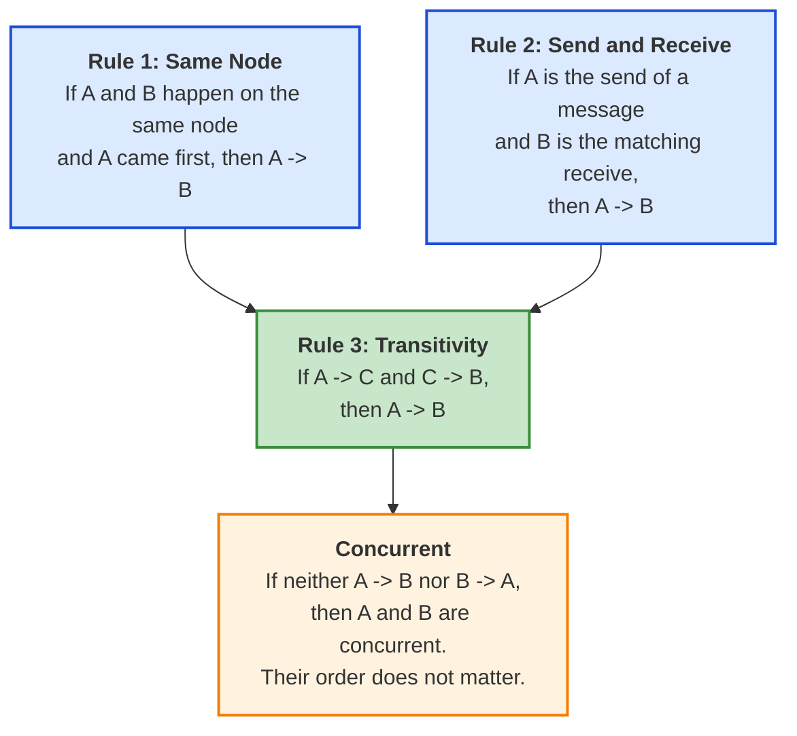
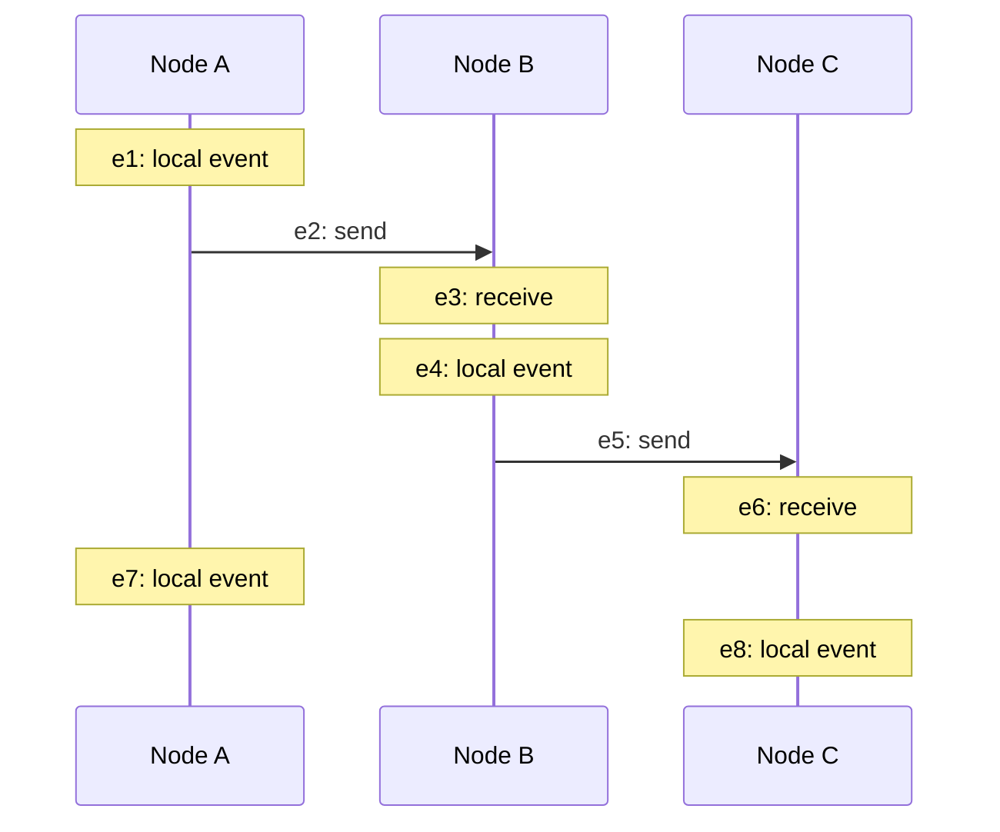
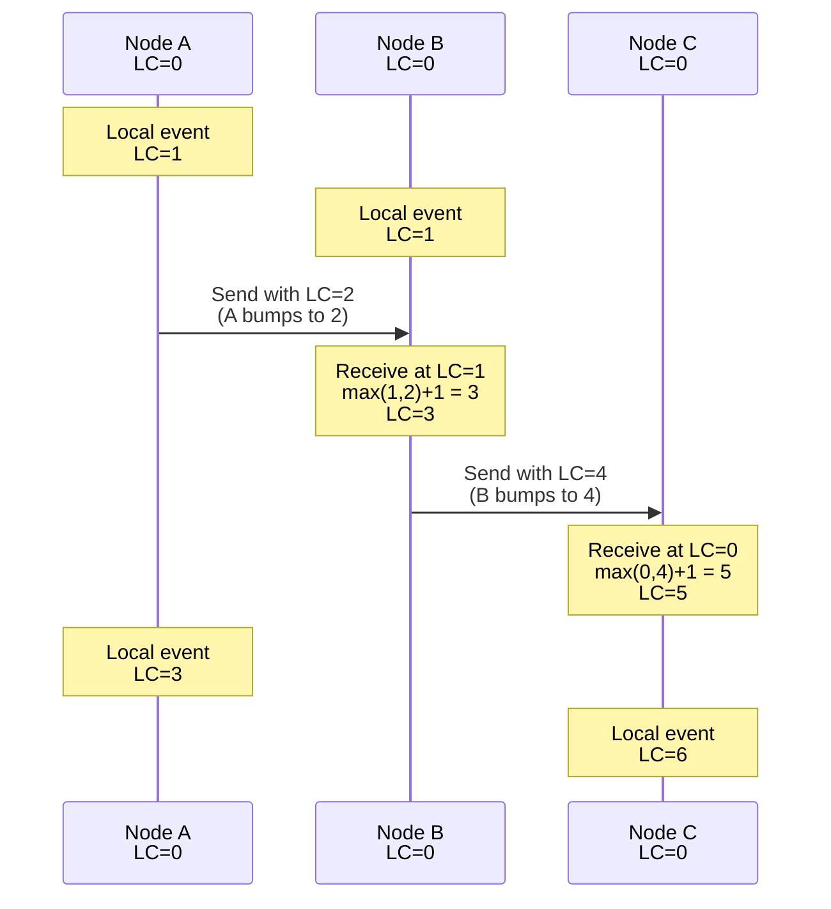
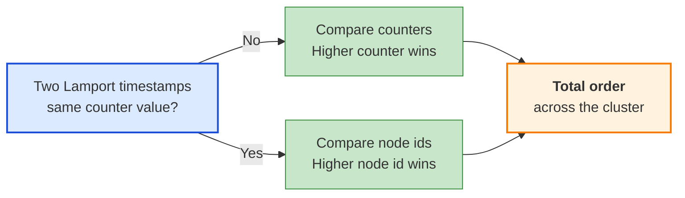
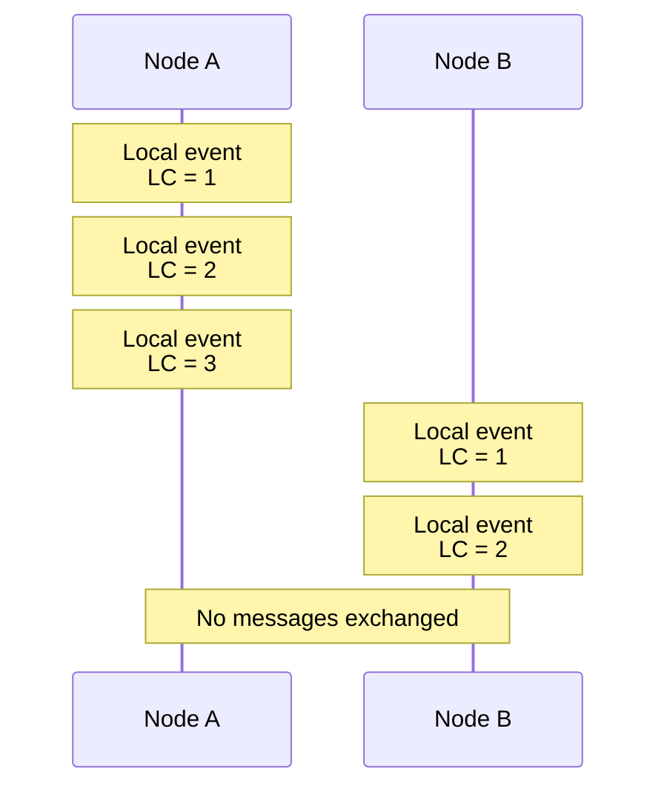
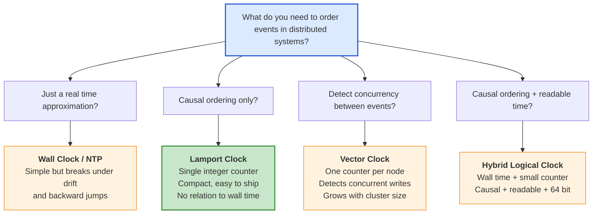
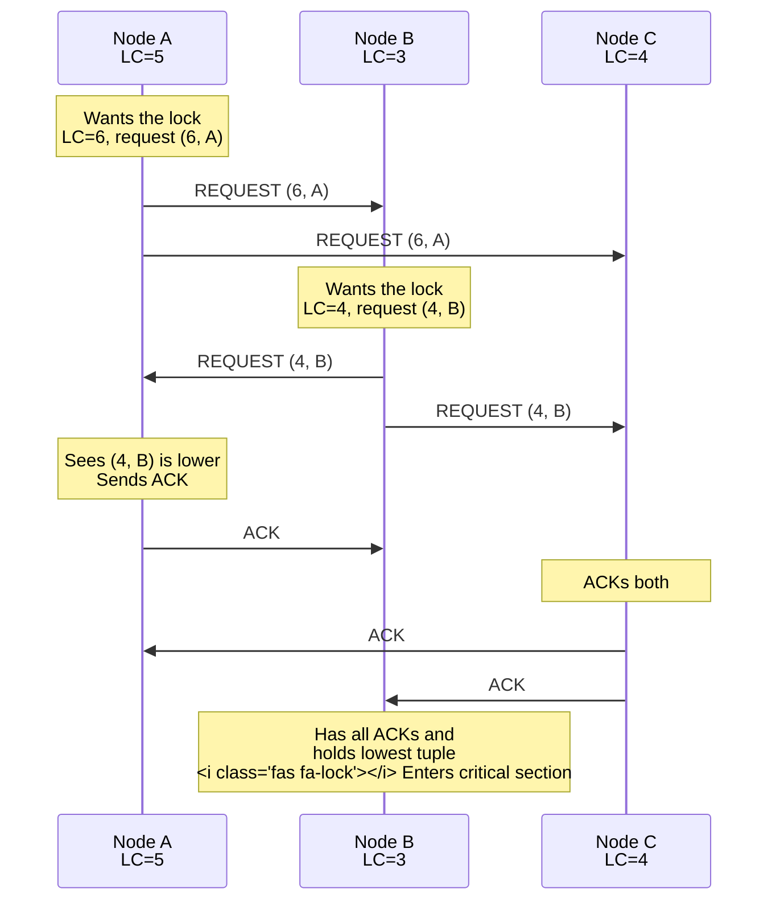

Distributed systems sound like they should be easy. You have a few servers, they pass messages, jobs get done. Then someone asks a simple question. Which event happened first? The order in which user U paid for the cart, the inventory service decremented stock, and the email service sent a confirmation. Three events on three machines. You look at the wall clock timestamps and they disagree by 200 milliseconds. The "send" looks like it happened after the "receive". You spend a Friday afternoon staring at logs.

That afternoon is exactly what Leslie Lamport had in mind in 1977 when he sketched out a tiny algorithm on a napkin. The algorithm is so simple that you can hold it in your head, and so powerful that almost every distributed database, queue, and consensus protocol you use today is built on top of it. It is called the **Lamport Clock**, and once you understand it the rest of distributed systems gets a lot less mysterious.

This post walks through what a Lamport Clock is, how the algorithm works, how to extend it to a total order, where it shows up in production systems like Cassandra, Kafka, and Raft, and how it relates to its more famous cousins, the [vector clock](https://en.wikipedia.org/wiki/Vector_clock){:target="_blank" rel="noopener"} and the [Hybrid Logical Clock](/distributed-systems/hybrid-clock/){:target="_blank" rel="noopener"}.

## The Problem: There Is No Global Now

In a single process, ordering events is trivial. The CPU executes one instruction at a time. The program counter is your clock. Done.

The moment you split work across two machines, that simplicity is gone. Each machine has its own clock crystal that drifts a few microseconds per second. Each runs an NTP daemon that periodically nudges the clock forward or backward to stay close to a reference time. Each is subject to virtualization pauses, leap seconds, and the occasional sysadmin who runs `date -s` on the wrong host.

The result is that when machine A says "this happened at 12:00:00.500" and machine B says "this happened at 12:00:00.498", you cannot trust which was actually first. The skew is real and it is unavoidable. The classic [Riak post on clocks](https://riak.com/clocks-are-bad-or-welcome-to-distributed-systems/){:target="_blank" rel="noopener"} tells the war story of clocks drifting by 30 seconds in production and silently dropping writes.

So we cannot use the wall clock. What we can use is **causality**. If event A sent a message that triggered event B, then A definitely happened before B, no matter what the wall clocks say. That is the insight Lamport had, and the entire pattern is built around it.

## The Happens-Before Relation

Before we can talk about the algorithm, we need one definition. Lamport defined the **happens-before** relation, written `A -> B`, on events in a distributed system using three rules.







That is it. Three rules. They define a [partial order](https://en.wikipedia.org/wiki/Partially_ordered_set){:target="_blank" rel="noopener"} on events because some pairs are unrelated. That is fine. If two events never exchanged messages, their order does not matter for correctness anyway.

Concrete example. Imagine three nodes labeled A, B, C.



What can we say about ordering?

- `e1 -> e2` because they are on the same node. `e2 -> e3` because of send-receive. So `e1 -> e3` by transitivity.
- `e3 -> e4 -> e5 -> e6` chain across B and C.
- `e1 -> e6` is true (you can trace a chain).
- `e7` and `e8` are **concurrent** with each other. Neither node ever heard from the other in this slice of the diagram.
- `e7` and `e6` are also concurrent.

The happens-before relation is exactly what we want to capture in numbers. That is what the Lamport Clock does.

## The Lamport Clock Algorithm

Each node `j` keeps a single integer `LC.j`, initially zero. There are three rules that update it. They mirror the three rules of happens-before.

### Rule 1: Local Event

Before any local event, increment the counter.

```python
LC.j = LC.j + 1
```

### Rule 2: Send

Before sending a message, increment the counter, then attach the new value to the outgoing message.

```python
LC.j = LC.j + 1
send(message, LC.j)
```

In practice steps 1 and 2 are usually merged: a "send" is just a kind of local event.

### Rule 3: Receive

When you receive a message tagged with sender timestamp `t`, take the max of your local counter and `t`, then add one.

```python
(message, t) = receive()
LC.j = max(LC.j, t) + 1
```

That is the entire algorithm. Five lines of pseudocode and a single integer per node.

### Why It Works

The receive rule is the magic. By taking `max` you guarantee that the local counter jumps past any value the sender had ever seen. By adding `+ 1` you guarantee that the receive event is strictly later than the send. So if `A -> B` (A causally precedes B), then by induction `LC(A) < LC(B)`.

The famous [Patterns of Distributed Systems chapter on the Lamport Clock](https://martinfowler.com/articles/patterns-of-distributed-systems/lamport-clock.html){:target="_blank" rel="noopener"} on Martin Fowler's site reduces the whole thing to a one method `tick(requestTime)`:

```java
public int tick(int requestTime) {
    latestTime = Integer.max(latestTime, requestTime);
    latestTime++;
    return latestTime;
}
```

Whether you call it on send, receive, or local event, the math is the same. That is why the pattern is so easy to bolt onto an existing system.

## A Worked Example

Three nodes. Each starts at zero. Time flows left to right. Watch the counters.



Trace any causal chain. `e_send_AB = 2 < e_recv_AB = 3 < e_send_BC = 4 < e_recv_BC = 5`. The numbers grow strictly along the chain, even though Node C's wall clock might be 200 milliseconds behind Node A's. That is the power of the Lamport Clock in one diagram.

Notice also that Node A's local event at `LC = 3` and Node C's local event at `LC = 6` look like A came before C numerically. But these events are concurrent. The Lamport Clock cannot tell you that. It just gives you a number that respects causality when causality exists.

## A Reference Implementation





Here is a clean Python implementation. It is short on purpose.

```python
import threading

class LamportClock:
    def __init__(self):
        self._lock = threading.Lock()
        self._counter = 0

    def tick(self):
        """Call before a local event or an outgoing send.
        Returns the timestamp to attach to the event."""
        with self._lock:
            self._counter += 1
            return self._counter

    def update(self, received):
        """Call when receiving a message with timestamp `received`.
        Returns the new local timestamp."""
        with self._lock:
            self._counter = max(self._counter, received) + 1
            return self._counter

    def now(self):
        with self._lock:
            return self._counter
```

Three things to notice.

1. **Every update takes a lock.** A Lamport Clock is shared mutable state inside a process. If two threads tick at the same time you can violate monotonicity.
2. **`tick` and `update` are the only writers.** Reading without writing is safe but you should still lock for memory visibility on most platforms.
3. **The integer can grow forever.** In practice this is fine. A 64 bit counter at one billion ticks per second still lasts roughly 290 years. A 32 bit counter wraps in seconds at high event rates so use 64.

If you want to see a battle tested implementation, look at how [CockroachDB encodes the logical part of its HLC](https://github.com/cockroachdb/cockroach/blob/master/pkg/util/hlc/hlc.go){:target="_blank" rel="noopener"}. The same monotonic counter trick is in there.

## From Partial Order to Total Order

A pure Lamport Clock gives a partial order. Two events on different nodes can land on the same counter value. For some workloads that is fine. For others, like distributed mutual exclusion, you need a strict total order.

The standard fix is to append the node id and compare lexicographically. The pair `(counter, node_id)` is unique. To compare two timestamps:

```python
def compare(a, b):
    if a.counter != b.counter:
        return a.counter - b.counter
    return a.node_id - b.node_id
```



This `(counter, node_id)` pair is sometimes called a **Lamport tuple** or **Lamport pair**. It still respects happens-before because if `A -> B` then `LC(A) < LC(B)` regardless of node id. The node id only matters when the counters tie, and tied counters mean the events are concurrent, so any deterministic tiebreaker is correct.

The original Lamport paper used this exact construction to build a [distributed mutual exclusion](https://en.wikipedia.org/wiki/Lamport%27s_distributed_mutual_exclusion_algorithm){:target="_blank" rel="noopener"} algorithm. Every node broadcasts a request stamped with its Lamport tuple, and the lowest tuple wins the lock. No central coordinator needed.

## What Lamport Clocks Cannot Do

Before celebrating, two important limits.

### Limit 1: They Cannot Detect Concurrency

Look at this scenario.



A's third event has `LC = 3`. B's second event has `LC = 2`. A "looks" later. But the events are concurrent. They never influenced each other. The Lamport Clock cannot tell the difference between "A truly happened after B" and "they are unrelated and we are guessing". For workloads that need to detect concurrent writes, like [Dynamo style](https://www.allthingsdistributed.com/files/amazon-dynamo-sosp2007.pdf){:target="_blank" rel="noopener"} key-value stores, you need a [vector clock](https://en.wikipedia.org/wiki/Vector_clock){:target="_blank" rel="noopener"}.

### Limit 2: They Have No Wall Clock Meaning

A Lamport timestamp of `4231` tells you nothing about when the event happened. You cannot run a "show me all writes between 9 AM and 10 AM yesterday" query. You cannot use it as an MVCC version that matches a user visible timestamp. That is the gap that the [Hybrid Logical Clock](/distributed-systems/hybrid-clock/){:target="_blank" rel="noopener"} fills.

For most ordering and consensus problems, neither limit matters. But knowing when you are about to hit them saves a lot of debugging.

## How Lamport Clocks Compare to Other Clocks





Each clock fixes a different problem. Pick the one that matches your need.



| Property | Wall Clock | Lamport Clock | Vector Clock | Hybrid Logical Clock |
|----------|-----------|---------------|--------------|----------------------|
| Total order | Yes (with ties) | With node id tie-break | No (partial only) | Yes |
| Captures happens-before | No | Yes | Yes | Yes |
| Detects concurrent events | No | No | Yes | No |
| Close to real time | Yes | No | No | Yes |
| Size | 64 bits | 64 bits | O(N) bits | 64 bits |
| Tolerates clock drift | No | N/A | N/A | Yes |
| Used by | Most legacy systems | Cassandra, Kafka, Raft, Paxos | Dynamo, Riak, Voldemort | CockroachDB, MongoDB, YugabyteDB |

If you want a deeper comparison of the time-aware family, the [Hybrid Logical Clock post](/distributed-systems/hybrid-clock/){:target="_blank" rel="noopener"} walks through the same trade-offs from the HLC side.

## Real World Implementations

Almost every distributed system you use is running a Lamport Clock under a different name. Here are some of the bigger ones.

### Apache Cassandra: Last Write Wins Timestamps

Cassandra uses Lamport style timestamps for [last write wins (LWW) conflict resolution](https://cassandra.apache.org/doc/latest/cassandra/architecture/dynamo.html){:target="_blank" rel="noopener"}. Every column write carries a microsecond timestamp from the coordinator node. On read, Cassandra returns the value with the highest timestamp.

The timestamp is normally derived from the coordinator's wall clock, but the comparison rule is pure Lamport. If two writes for the same key arrive with the same timestamp, the higher value byte order wins as a deterministic tiebreaker, exactly the same trick as appending a node id. The downside, as documented in [Aphyr's Jepsen analysis of Cassandra](https://aphyr.com/posts/294-jepsen-cassandra){:target="_blank" rel="noopener"}, is that LWW is fragile when wall clocks drift, which is why HLC based systems are increasingly preferred for new designs.

### Apache Kafka: Producer Epoch and Leader Epoch

Kafka uses a Lamport style **producer epoch** to fence off zombie producers after a transaction restart. Every transactional producer gets a producer id and an epoch number from the transaction coordinator. The epoch is monotonically increased on every transaction restart. Brokers reject any append from a producer whose epoch is older than the latest one they have seen.

Kafka also uses a **leader epoch** on every partition that follows the same monotonic, max on receive rule. Followers use the leader epoch when truncating their logs after a leader change to avoid losing committed data. The pattern is documented in [KIP-101](https://cwiki.apache.org/confluence/display/KAFKA/KIP-101+-+Alter+Replication+Protocol+to+use+Leader+Epoch+rather+than+High+Watermark+for+Truncation){:target="_blank" rel="noopener"} and underpins everything Kafka does to keep replicas consistent. If you want the bigger picture, our deep dive on [how Kafka works](/distributed-systems/how-kafka-works/){:target="_blank" rel="noopener"} traces these epochs through the full write path.

### Raft: Term Numbers

In [Raft](https://raft.github.io/raft.pdf){:target="_blank" rel="noopener"}, every leader is elected for a numbered **term**. Terms increase monotonically. Whenever a node sees a message with a higher term it adopts that term and steps down if it was leader. The rule is identical to a Lamport receive: `term = max(local_term, received_term)`, with the increment happening only on a new election rather than every receive.

This is what makes Raft safe across network partitions. Old leaders that come back online see a higher term in heartbeats and immediately resign. The pattern shows up the same way in [Paxos](/distributed-systems/paxos/){:target="_blank" rel="noopener"} ballot numbers and in [ZAB](https://zookeeper.apache.org/doc/r3.9.0/zookeeperInternals.html){:target="_blank" rel="noopener"}, the protocol behind ZooKeeper.

### Write-Ahead Logs and Sequence Numbers

Almost every [write-ahead log](/distributed-systems/write-ahead-log/){:target="_blank" rel="noopener"} stamps entries with a monotonically increasing sequence number that is, in spirit, a Lamport counter. PostgreSQL's LSN, MySQL's GTID, MongoDB's optime, etcd's Raft log index, Kafka's offset. They are all single integer counters that tick on every write and travel with the data when it replicates. The receive rule is implicit because followers always apply entries in order.

When you understand the Lamport Clock, you stop seeing each of these as a separate trick and start seeing them as the same idea wearing different hats.

### Other Notable Implementations

| System | Where Lamport style ordering shows up | Notes |
|--------|---------------------------------------|-------|
| [Cassandra](https://cassandra.apache.org/doc/latest/cassandra/architecture/dynamo.html){:target="_blank" rel="noopener"} | Cell timestamps for LWW | Microsecond resolution, byte order tie-break |
| [Kafka](https://cwiki.apache.org/confluence/display/KAFKA/KIP-101+-+Alter+Replication+Protocol+to+use+Leader+Epoch+rather+than+High+Watermark+for+Truncation){:target="_blank" rel="noopener"} | Producer epoch, leader epoch, log offsets | Monotonic per partition |
| [Raft](https://raft.github.io/raft.pdf){:target="_blank" rel="noopener"} | Term numbers, log indices | `max` on receive, step down on higher term |
| [Paxos](/distributed-systems/paxos/){:target="_blank" rel="noopener"} | Ballot numbers | Same monotonic counter pattern |
| [ZooKeeper / ZAB](https://zookeeper.apache.org/doc/r3.9.0/zookeeperInternals.html){:target="_blank" rel="noopener"} | zxid (epoch + counter) | Lamport tuple in disguise |
| [PostgreSQL](https://www.postgresql.org/docs/current/wal-internals.html){:target="_blank" rel="noopener"} | LSN | Monotonic byte position in WAL |
| [Spanner / TrueTime](https://research.google/pubs/spanner-googles-globally-distributed-database-2/){:target="_blank" rel="noopener"} | Commit timestamps | Hybrid of wall clock + Lamport-style increments |





## A Worked Example: Distributed Mutex

Lamport's original 1978 paper used Lamport Clocks to build a fully distributed mutual exclusion algorithm. There is no central lock manager. Every node decides for itself whether it holds the lock, and they all agree. Here is the sketch.



The rule is simple. A node wanting the lock broadcasts `REQUEST(LC, node_id)`. Other nodes reply with `ACK`. A node enters the critical section when it has received an `ACK` from every other node and its own `REQUEST` is the lowest `(counter, node_id)` tuple in the global queue. When done, it broadcasts `RELEASE`.

Because every event uses the Lamport tuple total order, every node agrees on which request came "first". No coordinator. No locks. No leader election. Just `(counter, node_id)` pairs and a few message types.

This is a beautiful demonstration of how much you can build on top of one tiny algorithm. Production systems usually use simpler designs (a Raft leader, a database row lock) because the message complexity is high, but the Lamport mutex is still required reading for any distributed systems engineer.

## How Lamport Clocks Connect to Other Patterns

Lamport Clocks are the seed. Once you have them, a whole family of distributed systems patterns becomes natural.

- A [vector clock](https://en.wikipedia.org/wiki/Vector_clock){:target="_blank" rel="noopener"} is one Lamport counter per node, packed in a vector.
- A [Hybrid Logical Clock](/distributed-systems/hybrid-clock/){:target="_blank" rel="noopener"} is a Lamport counter plus a wall clock anchor.
- A [Write-Ahead Log](/distributed-systems/write-ahead-log/){:target="_blank" rel="noopener"} sequence number is a Lamport counter scoped to one log.
- A [Replicated Log](/distributed-systems/replicated-log/){:target="_blank" rel="noopener"} relies on monotonic indices that follow Lamport's receive rule across followers.
- [Paxos](/distributed-systems/paxos/){:target="_blank" rel="noopener"} ballot numbers and Raft terms are Lamport tuples in production code.
- The [High Watermark](/distributed-systems/high-watermark/){:target="_blank" rel="noopener"} and [Low Watermark](/distributed-systems/low-watermark/){:target="_blank" rel="noopener"} are pointers into a Lamport ordered log.
- [Heartbeats](/distributed-systems/heartbeat/){:target="_blank" rel="noopener"} carry counters that double as a clock health signal.

If you have not read the [transactional outbox pattern](/transactional-outbox-pattern/){:target="_blank" rel="noopener"} or the [two-phase commit](/distributed-systems/two-phase-commit/){:target="_blank" rel="noopener"} posts, those show how these primitives compose into reliable workflows.

## Failure Modes and How to Handle Them

The algorithm is robust but there are a few sharp edges in production.

### Lost Messages Do Not Break the Clock

If a message is dropped, the receiver simply never bumps its counter for that send. The happens-before relation across the dropped pair is lost, but the rest of the system is unaffected. Lamport Clocks degrade gracefully.

### Out of Order Messages

Network reordering is fine because the receive rule uses `max`. A late message with a small timestamp does not pull the counter backward.

### Counter Overflow

A 64 bit counter is essentially unbounded. A 32 bit counter at 10K events per second wraps in about five days, so always use 64 in production. If you ever truly worry about overflow, periodic snapshots of the counter and modular arithmetic with epoch numbers is the answer (this is how Raft layers terms over indices).

### Skew Between Counters Across Nodes

Lamport counters drift apart between nodes that talk infrequently. That is by design. Drift only matters if you compare counters across nodes that have never communicated, which is exactly the case where the comparison is meaningless anyway.

### Misuse As a Wall Clock

The most common production mistake is treating a Lamport counter as if it were a real timestamp. It is not. A counter of `4231` does not mean "January 4th". If you find yourself wanting to ask "what events happened in this hour", you want a [Hybrid Logical Clock](/distributed-systems/hybrid-clock/){:target="_blank" rel="noopener"} or a separate wall clock column. Use the right tool.

## Key Takeaways for Developers





1. **Memorize the receive rule.** `local = max(local, received) + 1`. That single line is the entire pattern. Everything else is application detail.

2. **Use a Lamport tuple for total order.** When you need a deterministic single ordering across the cluster, append the node id and compare lexicographically. Two lines of code, full total order.

3. **Do not confuse counter values with wall time.** A Lamport counter has no calendar meaning. If your product team wants "show me events from yesterday", reach for a Hybrid Logical Clock or a separate timestamp column.

4. **Reach for vector clocks when you need to detect concurrent writes.** If your system has to merge concurrent updates (Dynamo style), Lamport is not enough. Vector clocks are the right tool.

5. **You are already using Lamport Clocks.** Kafka leader epochs, Raft terms, Cassandra timestamps, Postgres LSNs are all the same idea. Once you see it, you cannot unsee it.

6. **Pair Lamport Clocks with [heartbeats](/distributed-systems/heartbeat/){:target="_blank" rel="noopener"}.** Heartbeats give you liveness. Lamport Clocks give you ordering. Together they cover the two hardest problems in a distributed system.

## Wrapping Up

Time in distributed systems is one of those topics that looks intimidating until you see the trick. Wall clocks lie. Atomic clocks are expensive. We need an ordering, but we cannot trust the obvious one.

Leslie Lamport's 1978 insight was that we do not need a real clock. We need an algorithm that respects causality. A counter that increments on every event and jumps forward on every receive is enough. The math is short. The properties are deep. The pattern is hiding inside almost every distributed system you have ever used.

Once Lamport Clocks click, vector clocks fall out as a small extension, [Hybrid Logical Clocks](/distributed-systems/hybrid-clock/){:target="_blank" rel="noopener"} fall out as a clever combination, and the consensus protocols you use start to look like elaborate scaffolding around the same monotonic counter.

Next time you debug an "event B looks like it happened before A" puzzle, the first question to ask is: what does the Lamport timestamp say? You may save yourself a Friday afternoon.

---

*For more distributed systems patterns, check out [Hybrid Logical Clock](/distributed-systems/hybrid-clock/){:target="_blank" rel="noopener"}, [High Watermark](/distributed-systems/high-watermark/){:target="_blank" rel="noopener"}, [Low Watermark](/distributed-systems/low-watermark/){:target="_blank" rel="noopener"}, [Write-Ahead Log](/distributed-systems/write-ahead-log/){:target="_blank" rel="noopener"}, [Replicated Log](/distributed-systems/replicated-log/){:target="_blank" rel="noopener"}, [Majority Quorum](/distributed-systems/majority-quorum/){:target="_blank" rel="noopener"}, [Paxos](/distributed-systems/paxos/){:target="_blank" rel="noopener"}, [Heartbeat](/distributed-systems/heartbeat/){:target="_blank" rel="noopener"}, [Gossip Dissemination](/distributed-systems/gossip-dissemination/){:target="_blank" rel="noopener"}, [Two-Phase Commit](/distributed-systems/two-phase-commit/){:target="_blank" rel="noopener"}, and [How Kafka Works](/distributed-systems/how-kafka-works/){:target="_blank" rel="noopener"}.*

*Further reading: Lamport's original 1978 paper [Time, Clocks, and the Ordering of Events in a Distributed System](https://lamport.azurewebsites.net/pubs/time-clocks.pdf){:target="_blank" rel="noopener"}; the [Lamport Clock chapter](https://martinfowler.com/articles/patterns-of-distributed-systems/lamport-clock.html){:target="_blank" rel="noopener"} in Unmesh Joshi's Patterns of Distributed Systems on Martin Fowler's site; Kevin Sookocheff's [Lamport Clocks](https://sookocheff.com/post/time/lamport-clock/){:target="_blank" rel="noopener"} post; the Baeldung CS article on the [Lamport Clock](https://www.baeldung.com/cs/lamport-clock){:target="_blank" rel="noopener"}; and the Wikipedia entry on [Lamport timestamps](https://en.wikipedia.org/wiki/Lamport_timestamp){:target="_blank" rel="noopener"} for a quick reference.*
