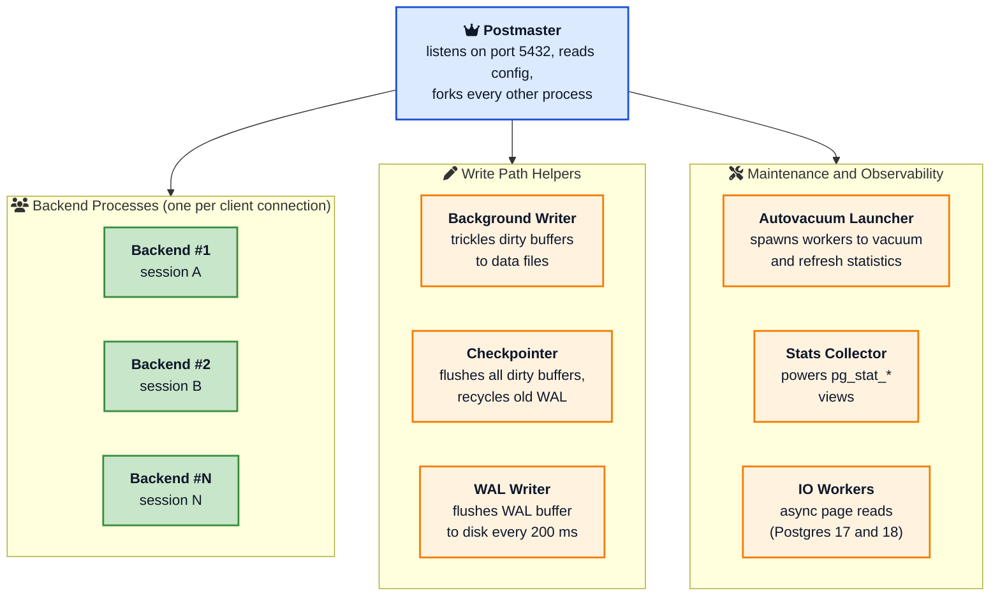
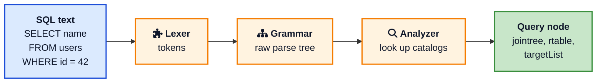
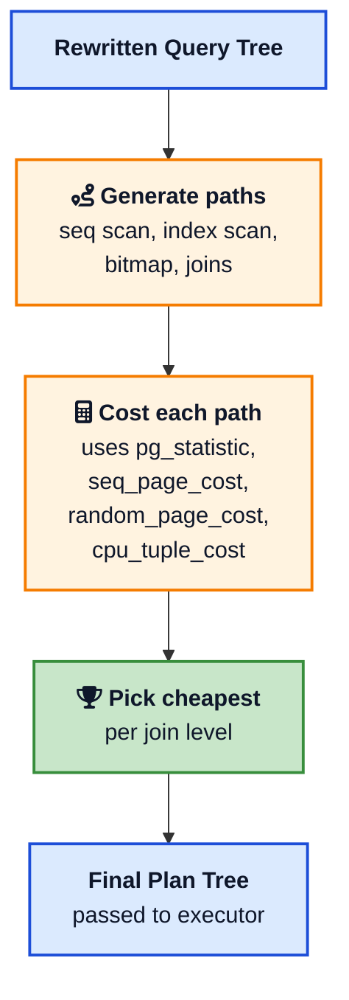
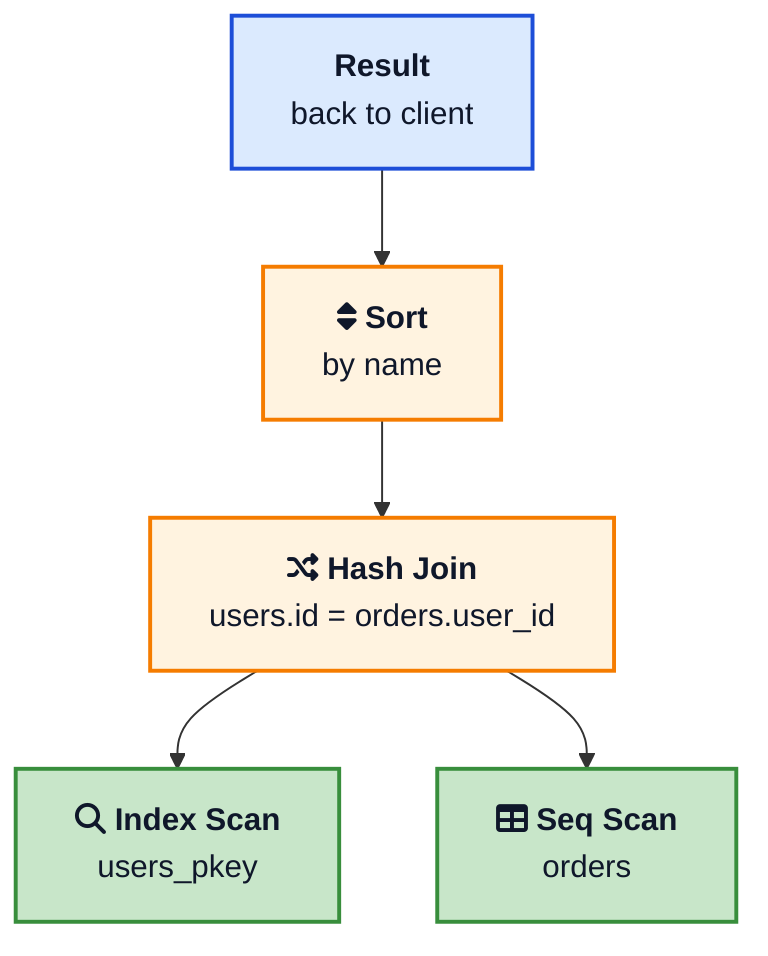
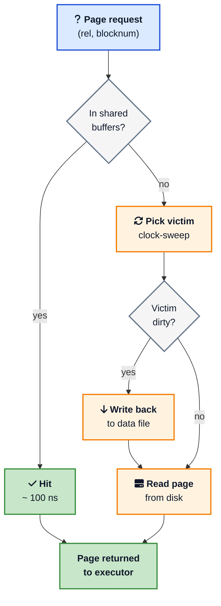
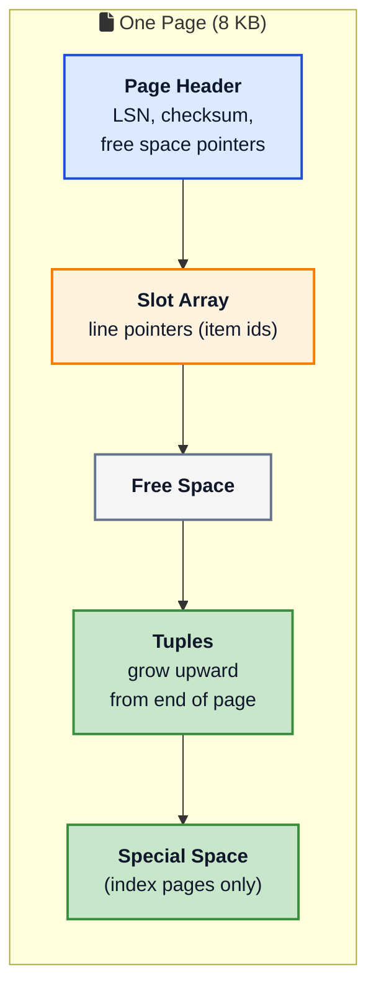
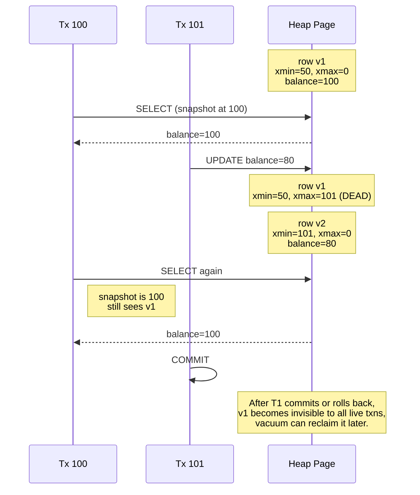
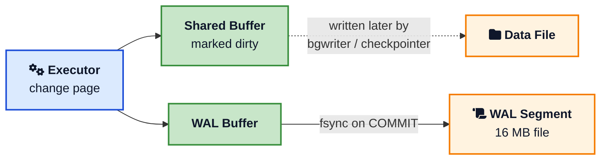

You write a `SELECT`. You hit enter. A few milliseconds later, rows come back. Most of the time it just works, and you move on. Then one day a query that used to return in ten milliseconds takes ten seconds. Or a `JOIN` you wrote a year ago suddenly chooses a sequential scan over the index you carefully built. Or a transaction blocks for a minute and you have no idea why.

The difference between a developer who shrugs at this and one who fixes it in an hour is one thing: knowing what actually happens inside PostgreSQL between `SELECT` and the rows hitting the wire.

This post is a tour of **PostgreSQL internals** from the developer's seat. Not a contributor's guide. Not the source code. Just the mental model you need so that the next time `EXPLAIN ANALYZE` shows a 9 second `Bitmap Heap Scan`, you know what it means and what to do about it. We will follow a single query from the network socket all the way to the disk and back, with a stop at every component that matters.

If you want a refresher on storage first, the [How Databases Store Data Internally](/how-databases-store-data-internally/){:target="_blank" rel="noopener"} post covers pages, slotted pages, and B-trees. If you want a hands on companion, the [PostgreSQL cheat sheet](/postgresql-cheat-sheet/){:target="_blank" rel="noopener"} has every command we use here.

## The 30 Second Picture

Before we zoom in, here is the whole pipeline on one slide.

```mermaid
flowchart LR
    Client["fa:fa-laptop-code <b>Client</b><br/>psql, app, JDBC"]

    subgraph Backend["fa:fa-server Backend Process (one per connection)"]
        direction TB
        Parse["fa:fa-code <b>Parser</b><br/>SQL text to query tree"]
        Rewrite["fa:fa-pen-to-square <b>Rewriter</b><br/>views, rules"]
        Plan["fa:fa-lightbulb <b>Planner / Optimizer</b><br/>cheapest plan wins"]
        Exec["fa:fa-cogs <b>Executor</b><br/>pull rows through tree"]
        Parse --> Rewrite --> Plan --> Exec
    end

    subgraph Mem["fa:fa-memory Shared Memory"]
        SB["<b>Shared Buffers</b><br/>8 KB pages"]
        WB["<b>WAL Buffers</b>"]
    end

    subgraph Disk["fa:fa-hard-drive Disk"]
        Heap["Heap files<br/>+ indexes"]
        WAL["WAL segments"]
    end

    Client -->|SQL over TCP| Parse
    Exec -->|page request| SB
    SB -->|miss| Heap
    Exec -->|change record| WB
    WB -->|fsync on COMMIT| WAL
    Exec -->|rows| Client

    classDef boxBlue fill:#dbeafe,stroke:#1d4ed8,stroke-width:2px,color:#0f172a
    classDef boxGreen fill:#c8e6c9,stroke:#388e3c,stroke-width:2px,color:#0f172a
    classDef boxOrange fill:#fff3e0,stroke:#f57c00,stroke-width:2px,color:#0f172a
    class Client boxBlue
    class SB,WB boxGreen
    class Heap,WAL boxOrange
```



Five things to lock in:

1. There is **one backend process per connection**. No threads.
2. Every query goes through **four stages** inside that backend.
3. Reads always go through the **shared buffer pool**.
4. Every write goes to the **WAL** before it touches a data page.
5. The result rows stream back as the executor produces them.

Now let us walk through it slowly.

## Process Architecture: One Backend Per Connection

When you start `postgres`, the first process to come up is the **postmaster**. It listens on the configured port (5432 by default), reads the configuration files, and supervises everything else. It does not handle queries itself.

When a client connects, the postmaster authenticates it and then `fork()`s a new OS process called a **backend**. That backend owns the connection for its entire life. Every parse, every plan, every page read for that session happens in that one process. When the client disconnects, the backend exits.

Around the postmaster sits a small fleet of **auxiliary processes** that handle work no individual backend should do.



A few practical implications fall out of this design.

- **Each backend uses around 10 MB of resident memory by itself**, plus whatever it allocates for sorts and hashes. A thousand idle connections is not free.
- **A crash in one backend cannot take down the others**, because they live in separate address spaces. Postgres survives application bugs that would kill a threaded database.
- **Connection setup is expensive**. Forking a process and authenticating takes milliseconds. Web apps with tens of thousands of short requests will swamp Postgres unless you put [PgBouncer](https://www.pgbouncer.org/){:target="_blank" rel="noopener"} or [pgcat](https://github.com/postgresml/pgcat){:target="_blank" rel="noopener"} in front. This is exactly the lesson covered in the [How OpenAI Scales PostgreSQL](/how-openai-scales-postgresql/){:target="_blank" rel="noopener"} write up.

For a deeper look at the process model, the EnterpriseDB write up [Postgres Internals Deep Dive: Process Architecture](https://www.enterprisedb.com/blog/postgres-internals-deep-dive-process-architecture){:target="_blank" rel="noopener"} goes into each auxiliary process in detail.

## Stage 1: The Parser

Your `SELECT` arrives as a string of bytes over a TCP socket. The first thing the backend does is hand it to the **parser**.

The parser does two jobs.

1. The **lexer** (built on the classic Unix tool `flex`) chops the text into tokens: keywords, identifiers, numbers, operators.
2. The **grammar** (built with `bison`) checks that the tokens form valid SQL according to the formal Postgres grammar, and produces a tree of nodes called the **raw parse tree**.

At this point Postgres has not opened a single table. The parser does not know whether `users` is a table, a view, or a typo. That happens next.

After the raw parse, the **analyzer** runs. It looks up every name in the system catalogs (`pg_class`, `pg_attribute`, `pg_proc`, and friends), checks types, resolves operator overloads, and produces a fully decorated tree called a **Query**. From the official [Path of a Query](https://www.postgresql.org/docs/current/query-path.html){:target="_blank" rel="noopener"} docs, this Query node has three fields you should know about:

- `jointree`: the `FROM` and `WHERE` clauses
- `rtable`: the **range table**, listing every relation referenced
- `targetList`: the columns you actually want back, with expressions



The parser is the cheapest part of executing a query. It runs in microseconds. If you want to skip it on repeated queries, that is what **prepared statements** are for. `PREPARE` parses, analyzes, and plans the statement once, then `EXECUTE` skips straight to the executor with new parameters bound in.

## Stage 2: The Rewriter

The query tree from the parser then goes through the **rewriter**, also called the **rule system**. This stage is small but important.

Its main job is **view expansion**. If your query selects from a view, the rewriter inlines the view definition into the tree, replacing the view name with the underlying `SELECT`. After rewriting, the executor never sees views; it only sees base tables.

The rewriter is also what powers Postgres `RULE` definitions and the `INSTEAD OF` triggers on updatable views. Most apps will never write a `RULE`, but every app uses views and most use materialized views. The rewriter is where they get unwrapped.

The full reference is the [Rule System](https://www.postgresql.org/docs/current/rule-system.html){:target="_blank" rel="noopener"} chapter of the docs. For day to day work you can treat the rewriter as a transparent step that turns `SELECT * FROM my_view` into the longer query you would have written by hand.

## Stage 3: The Planner / Optimizer

This is the most interesting stage and the one that decides whether your query takes 3 milliseconds or 30 seconds.

The planner takes the rewritten Query tree and asks a hard question: **out of all the equivalent ways to compute this result, which is cheapest?**

For a single table `SELECT` with a `WHERE` clause, the choices include:

- **Sequential Scan**: read every page of the table.
- **Index Scan**: walk a B-tree index, then fetch matching heap pages.
- **Index Only Scan**: walk the index and never touch the heap if all needed columns are in the index.
- **Bitmap Index Scan + Bitmap Heap Scan**: collect a bitmap of matching pages from one or more indexes, then read those pages in physical order.

For a `JOIN`, the choices multiply. There are three join algorithms (Nested Loop, Hash Join, Merge Join), and for `N` tables there are factorially many join orders. For up to 12 tables Postgres uses a [dynamic programming algorithm](https://www.postgresql.org/docs/current/planner-optimizer.html){:target="_blank" rel="noopener"} that explores plans bottom up. Above 12 tables it switches to the [Genetic Query Optimizer (GEQO)](https://www.postgresql.org/docs/current/geqo.html){:target="_blank" rel="noopener"}, which uses a genetic algorithm to find a good (not optimal) plan in reasonable time.



### How Cost Is Computed

The planner uses a **cost model** measured in arbitrary units. The defaults assume one sequential page read costs `1.0`. The other costs are calibrated against that baseline.

| Setting | Default | Meaning |
|---------|---------|---------|
| `seq_page_cost` | 1.0 | Sequential page read |
| `random_page_cost` | 4.0 | Random page read (lower for SSDs, often 1.1) |
| `cpu_tuple_cost` | 0.01 | Per row CPU work |
| `cpu_index_tuple_cost` | 0.005 | Per index entry CPU work |
| `cpu_operator_cost` | 0.0025 | Per operator/function call |
| `parallel_tuple_cost` | 0.1 | Cost of moving a row across worker boundary |
| `effective_cache_size` | 4 GB | Planner's belief about OS cache size |

The rule of thumb on modern SSDs is to lower `random_page_cost` to `1.1` and to raise `effective_cache_size` to about 70 percent of system RAM. Both are documented in the [resource consumption](https://www.postgresql.org/docs/current/runtime-config-resource.html){:target="_blank" rel="noopener"} reference and in the Timescale [parameter tuning guide](https://www.timescale.com/blog/postgresql-performance-tuning-key-parameters/){:target="_blank" rel="noopener"}.

### Statistics Are Everything

The cost formula needs to estimate **how many rows each step produces**. That estimate comes from `pg_statistic`, populated by `ANALYZE` and refreshed automatically by autovacuum. For each column Postgres stores:

- The fraction of `NULL`s.
- The number of distinct values (`n_distinct`).
- A **most common values** list with their frequencies.
- A **histogram** of the remaining values.
- The physical correlation of the column with table order.

When you write `WHERE age = 30`, the planner looks up 30 in the most common values list. If it is there, the planner gets an exact frequency. Otherwise it estimates from the histogram. The default sample size is 30000 rows times the per column `default_statistics_target` (100 by default).

Stale statistics are the single most common cause of "the planner suddenly chose the wrong plan". When in doubt, run `ANALYZE`. When the table is large and skewed, raise `default_statistics_target` to `500` or `1000` for the column that matters and run `ANALYZE` again.

If you want to dig deeper into the planner's math, the canonical reference is the [Planner / Optimizer](https://www.postgresql.org/docs/current/planner-optimizer.html){:target="_blank" rel="noopener"} chapter and the excellent [Internals of PostgreSQL](https://www.interdb.jp/pg/){:target="_blank" rel="noopener"} book by Hironobu Suzuki.

## Stage 4: The Executor

The final tree from the planner is passed to the **executor**, which actually runs it. The executor uses the **Volcano model**, also called the **iterator model**, introduced by Goetz Graefe in 1994. Every node in the plan tree exposes a single `next()` method that returns one tuple or `NULL`. The root node calls `next()` on its children, who call `next()` on theirs, and rows percolate up the tree one at a time.

This is what the official [Executor](https://www.postgresql.org/docs/current/executor.html){:target="_blank" rel="noopener"} docs mean by **demand pull pipeline**.



The executor calls `Sort.next()`. `Sort` calls `HashJoin.next()` repeatedly, builds the join, then sorts the result. `HashJoin` builds a hash table from `users` (the smaller side) by calling `IndexScan.next()` until done, then probes it for each row from `SeqScan` on `orders`. Each leaf node fetches pages from the buffer pool. No materialization of intermediate result sets, no temporary tables, just rows flowing through a pipeline.

The most common executor node types every developer should recognize:

| Node | When you see it | What it means |
|------|----------------|---------------|
| `Seq Scan` | small tables, no useful index, or selective filter on most rows | Read every page of the table |
| `Index Scan` | selective filter, useful index | Walk the index, then fetch matching heap pages |
| `Index Only Scan` | covering index | All needed columns are in the index, heap untouched |
| `Bitmap Heap Scan` | medium selectivity, multi index `OR`/`AND` | Build a bitmap of pages from one or more indexes, then read in physical order |
| `Nested Loop` | very selective inner side, small outer side | For each outer row, look up matches in inner side |
| `Hash Join` | both sides medium to large, equality join | Build a hash table on the smaller side, probe with the larger |
| `Merge Join` | both sides already sorted on the join key | Walk both sorted streams in parallel |
| `Sort` | `ORDER BY` without a usable index, `MERGE JOIN` prep | Sort tuples, in memory if `work_mem` permits, otherwise spill to disk |
| `Hash Aggregate` | `GROUP BY`, `DISTINCT` | Build a hash table keyed by the group columns |
| `Gather` / `Gather Merge` | parallel query | Collect rows from worker processes |

The full list is in [Using EXPLAIN](https://www.postgresql.org/docs/current/using-explain.html){:target="_blank" rel="noopener"}. We will read a real plan in a moment.

## Memory: Where Pages Live While You Work

The executor never reads disk directly. It always asks the **shared buffer pool** for a page, identified by a `(relation, block number)` pair. If the page is in the pool, you get it for the cost of a hash lookup. If it is not, the buffer manager reads it from disk into a free buffer slot, optionally evicting another page.



The pool is a contiguous array of fixed size buffers in shared memory. Each buffer holds exactly one **8 KB page**. The number of slots equals `shared_buffers / 8 KB`. With `shared_buffers = 8 GB` you get about one million buffer slots.

When the pool is full, Postgres uses a **clock-sweep** eviction algorithm. Each buffer has a `usage_count` between 0 and 5. The sweeper rotates through buffers, decrementing the count on each pass. When it finds a buffer with count zero and no pin, it evicts it. Hot pages keep getting their counts bumped on use and survive.

A few rules of thumb every Postgres operator learns the hard way:

- Set `shared_buffers` to **about 25 percent of system RAM** as a starting point. Going higher rarely helps because Postgres relies on the OS file cache for the rest.
- Set `effective_cache_size` to **about 50-75 percent of system RAM**. This is a hint to the planner, not a real allocation.
- `work_mem` is **per sort or hash node, per query, per backend**. A query with three sorts running on 200 connections can use `3 * 200 * work_mem` bytes. Be careful when raising this.
- If queries spill to disk because `work_mem` is too small, you will see `Sort Method: external merge Disk: 64MB` in `EXPLAIN ANALYZE`. That is your signal.

The full memory tuning reference is in the [Resource Consumption](https://www.postgresql.org/docs/current/runtime-config-resource.html){:target="_blank" rel="noopener"} chapter, with practical advice in the Fastware [shared_buffers and work_mem guide](https://www.postgresql.fastware.com/pzone/2024-06-understanding-shared-buffers-work-mem-and-wal-buffers-in-postgresql){:target="_blank" rel="noopener"}.

## On Disk: Pages, Tuples, and the Heap

Every Postgres table is stored as a **heap file** of fixed size pages, exactly as covered in the [How Databases Store Data Internally](/how-databases-store-data-internally/){:target="_blank" rel="noopener"} post. Each page is **8 KB** and uses a **slotted page** layout.



Each row Postgres stores is called a **tuple**. Every tuple has a fixed sized header followed by the column data. The header carries the **transaction visibility** information that powers MVCC:

- `xmin`: the transaction id that **inserted** this tuple.
- `xmax`: the transaction id that **deleted or updated** this tuple, or 0 if still live.
- `cmin` / `cmax`: command ids inside a transaction.
- `ctid`: a `(page, offset)` pair, used as the physical address.
- A handful of flag bits including the **hint bits** described in the [Postgres wiki](https://wiki.postgresql.org/wiki/Hint_Bits){:target="_blank" rel="noopener"}.

The full layout reference is the [Database Page Layout](https://www.postgresql.org/docs/current/storage-page-layout.html){:target="_blank" rel="noopener"} chapter. You can see a tuple's physical address yourself with `SELECT ctid, * FROM users LIMIT 1`.

If a row is too big for a single page, Postgres uses **TOAST** (The Oversized Attribute Storage Technique) to push large columns out to a side table with an internal pointer. The TOAST chapter is [here](https://www.postgresql.org/docs/current/storage-toast.html){:target="_blank" rel="noopener"}.

Indexes are separate files of pages with the same 8 KB layout, but with a tree structure (B-tree by default, or GIN, GiST, BRIN, Hash, SP-GiST). The [data structures B-tree](/data-structures/b-tree/){:target="_blank" rel="noopener"} post walks through how the tree balances itself.

## MVCC: Why UPDATE Never Updates In Place

Here is the part that surprises most developers when they first read it. **PostgreSQL never updates a row in place.** Every `UPDATE` is, internally, a new `INSERT` plus a `DELETE` mark on the old row.

That trick is what enables **Multi-Version Concurrency Control** ([MVCC](https://www.postgresql.org/docs/current/mvcc-intro.html){:target="_blank" rel="noopener"}). Every transaction takes a **snapshot** at start and sees only the row versions visible to that snapshot. Readers do not block writers. Writers do not block readers. Different transactions can see different versions of the same row at the same time.



The visibility rule (simplified) is: a tuple is **visible to my transaction** if `xmin` is committed and visible in my snapshot, **and** `xmax` is either zero, or my own transaction, or aborted, or not visible in my snapshot.

This design has three big consequences every developer should internalise.

1. **Tables grow even with constant row counts.** Updates create dead tuples until vacuum reclaims them. A heavily updated table can grow several times its real size if vacuum cannot keep up. This is called **bloat**.
2. **Indexes also bloat.** Each new tuple version needs new index entries unless [HOT (Heap Only Tuple)](https://www.postgresql.org/docs/current/storage-hot.html){:target="_blank" rel="noopener"} kicks in (when no indexed column changed and the page has free space).
3. **Long running transactions are dangerous.** A `BEGIN` from yesterday holds a snapshot that prevents vacuum from reclaiming any tuple newer than that snapshot. The fix is short transactions and the `idle_in_transaction_session_timeout` GUC.

The classic write up is Bruce Momjian's [MVCC Unmasked](https://momjian.us/main/writings/pgsql/mvcc.pdf){:target="_blank" rel="noopener"} talk. For a friendly walkthrough, the [MVCC introduction](https://www.postgresql.org/docs/current/mvcc-intro.html){:target="_blank" rel="noopener"} in the official docs is short and clear. If you want to compare with how other databases handle concurrency, the [Database Locks](/database-locks-explained/){:target="_blank" rel="noopener"} post covers locking and isolation in general.

## The Write-Ahead Log

Now the durability story. When the executor decides to write, it does **not** flush the changed page to disk. That would be slow and would lose data on crash. Instead it does this:

1. Modify the page in the buffer pool.
2. Write a record describing the change to the **WAL buffer**.
3. Mark the buffer **dirty**.
4. On `COMMIT`, force the WAL buffer down to disk with `fsync()` (or its `O_DSYNC` equivalent).
5. Tell the client "OK".

The dirty data page itself is written **later** by the background writer or the checkpointer. If we crash between steps 4 and 5, recovery replays the WAL from the last checkpoint and brings the data files back to a consistent state. If we crash before step 4, the COMMIT was never confirmed and the change is gone, which is correct.



Every WAL record carries a **Log Sequence Number (LSN)** that is exactly a [Lamport-style](/distributed-systems/lamport-clock/){:target="_blank" rel="noopener"} monotonic counter measured in bytes from the start of the log. Replicas pull WAL by LSN, point in time recovery rewinds to a specific LSN, and physical replication slots track LSNs to know how much WAL the primary can recycle.

For more on the general pattern of writing to a log first, the [Write-Ahead Log distributed systems pattern](/distributed-systems/write-ahead-log/){:target="_blank" rel="noopener"} post covers it from a different angle. The Postgres specific reference is the [WAL Internals](https://www.postgresql.org/docs/current/wal-internals.html){:target="_blank" rel="noopener"} chapter.

A useful trio of WAL related GUCs:

| Setting | What it controls |
|---------|------------------|
| `wal_level` | minimal / replica / logical. Determines how much info is logged for replication |
| `wal_buffers` | size of the in-memory WAL buffer (defaults to `1/32` of `shared_buffers`) |
| `synchronous_commit` | `on` waits for fsync, `off` returns early (faster but loses last few ms on crash) |
| `checkpoint_timeout` | how often the checkpointer runs (default 5 minutes) |
| `max_wal_size` | soft cap on WAL between checkpoints |

Tuning is documented in [WAL Configuration](https://www.postgresql.org/docs/current/wal-configuration.html){:target="_blank" rel="noopener"}.

## Putting It All Together: A SELECT, End to End

Let us walk through one query and tag every component we have discussed.

```sql
SELECT u.id, u.name, COUNT(o.id) AS orders
FROM users u
JOIN orders o ON o.user_id = u.id
WHERE u.created_at > '2026-01-01'
GROUP BY u.id, u.name
ORDER BY orders DESC
LIMIT 10;
```

1. **Postmaster** has long since forked your **backend** when the connection opened.
2. The SQL bytes arrive on the socket. The **parser** lexes, parses, and analyses them, producing a Query node with two range table entries and a join tree.
3. The **rewriter** runs. No views referenced, so the tree is unchanged.
4. The **planner** generates paths.
   - For `users`: index scan on `created_at` (if such index exists) vs sequential scan. With statistics saying 5 percent of `users` rows are after Jan 1 2026, an index scan looks cheaper.
   - For `orders`: estimate it has many rows per user. Hash join with `users` as build side wins.
   - Aggregation: hash aggregate by `(u.id, u.name)`.
   - Final sort + limit on `orders DESC`.
5. The **executor** starts pulling rows from the root.
   - `Limit` calls `Sort`.
   - `Sort` calls `HashAggregate`.
   - `HashAggregate` calls `HashJoin`.
   - `HashJoin` calls `IndexScan` on `users` to build the hash table, then `SeqScan` on `orders` to probe.
   - Each leaf node asks the **shared buffer pool** for pages. Misses go to disk.
   - If `Sort` overflows `work_mem`, it spills to a temporary file under `pg_tmp`.
6. Rows stream out of `Limit` 10 at a time, are formatted by the wire protocol, and sent back to the client.

If we had run an `UPDATE` instead, every changed page would also have produced a WAL record, the buffer would be dirty, and the COMMIT would have flushed the WAL to disk before responding.

## Reading EXPLAIN ANALYZE Like a Pro

`EXPLAIN ANALYZE` is the X-ray that shows everything we just described. It actually executes the query and reports each node with estimated and actual numbers.

Here is a real plan.

```text
Limit  (cost=18420.32..18420.34 rows=10 width=68)
       (actual time=124.221..124.228 rows=10 loops=1)
  ->  Sort  (cost=18420.32..18488.10 rows=27110 width=68)
            (actual time=124.219..124.221 rows=10 loops=1)
        Sort Key: (count(o.id)) DESC
        Sort Method: top-N heapsort  Memory: 26kB
        ->  HashAggregate  (cost=17567.41..17838.51 rows=27110 width=68)
                          (actual time=120.510..122.844 rows=27033 loops=1)
              Group Key: u.id, u.name
              Batches: 1  Memory Usage: 4113kB
              ->  Hash Join  (cost=4823.10..15871.00 rows=339282 width=44)
                            (actual time=12.910..78.413 rows=341557 loops=1)
                    Hash Cond: (o.user_id = u.id)
                    ->  Seq Scan on orders o
                          (cost=0.00..7912.00 rows=400000 width=12)
                          (actual time=0.014..18.205 rows=400000 loops=1)
                    ->  Hash  (cost=4485.10..4485.10 rows=27040 width=36)
                              (actual time=12.799..12.800 rows=27033 loops=1)
                          Buckets: 32768  Batches: 1  Memory Usage: 2095kB
                          ->  Index Scan using users_created_at_idx on users u
                                (cost=0.42..4485.10 rows=27040 width=36)
                                (actual time=0.041..7.330 rows=27033 loops=1)
                                Index Cond: (created_at > '2026-01-01')
Planning Time: 0.612 ms
Execution Time: 124.366 ms
```

Three things to learn to spot.

**1. Estimated vs actual rows.** `Seq Scan on orders` estimates `400000` and gets `400000`. Excellent. `Hash Join` estimates `339282` and gets `341557`. Within a few percent. `HashAggregate` estimates `27110` and gets `27033`. Close. The plan is well calibrated. If you ever see a 100x gap (`rows=10` estimated, `rows=1000000` actual) you have a statistics problem and `ANALYZE` is the first fix to try.

**2. Time per node.** The total `Execution Time` is `124.366 ms`. Most of it is spent in `HashJoin` (about 78 ms cumulative). The seq scan on `orders` is `18 ms`. The index scan is `7 ms`. If you wanted to make this faster, the join is where to focus, not the index.

**3. Loops and per-loop time.** Inside a `Nested Loop`, the inner side runs `loops=N` times. The displayed `actual time` per node is per loop. Multiply by `loops` to get the real cost.

A few non obvious tips:

- Always run with `BUFFERS`: `EXPLAIN (ANALYZE, BUFFERS) SELECT ...` shows shared hit, read, dirtied, and written. A query that does heavy `Buffers: shared read=` is doing real disk IO. A pure `shared hit=` is hot in cache.
- Run `EXPLAIN (ANALYZE, BUFFERS, VERBOSE)` to see every output column and worker stats.
- Tools like [explain.depesz.com](https://explain.depesz.com/){:target="_blank" rel="noopener"} and [pgMustard](https://www.pgmustard.com/){:target="_blank" rel="noopener"} render plans visually and call out problems. For complex plans they save hours.
- Postgres 18 added `EXPLAIN (ANALYZE, BUFFERS, SETTINGS, MEMORY)` so you can see plan time memory usage too.

The single best deep dive is the official [Using EXPLAIN](https://www.postgresql.org/docs/current/using-explain.html){:target="_blank" rel="noopener"} chapter. The [thoughtbot post on reading plans](https://thoughtbot.com/blog/reading-an-explain-analyze-query-plan){:target="_blank" rel="noopener"} and Markus Winand's [Use The Index, Luke](https://use-the-index-luke.com/){:target="_blank" rel="noopener"} are also excellent.

## Auxiliary Processes That Keep Things Running

We covered them in the diagram. Here is what each one actually does, in priority order for what to monitor.

### Autovacuum

`UPDATE` and `DELETE` leave dead tuples behind. Without cleanup, tables and indexes bloat and queries get slower. **Autovacuum** runs in the background, scanning tables that have crossed configurable thresholds (`autovacuum_vacuum_scale_factor` defaults to `0.2`, meaning vacuum when 20 percent of rows are dead).

It does two things per pass:

1. **VACUUM**: marks dead tuple slots reusable, freezes very old tuples to prevent transaction id wraparound, and updates the visibility map.
2. **ANALYZE**: refreshes `pg_statistic` so the planner has accurate row estimates.

The single most common production tuning is to make autovacuum **more aggressive on large hot tables**, by setting per table `autovacuum_vacuum_scale_factor = 0.05` and `autovacuum_vacuum_cost_limit = 1000`. Reference: [Routine Vacuuming](https://www.postgresql.org/docs/current/routine-vacuuming.html){:target="_blank" rel="noopener"} and [autovacuum settings](https://www.postgresql.org/docs/current/runtime-config-autovacuum.html){:target="_blank" rel="noopener"}.

### Background Writer

The bgwriter trickles dirty pages from the buffer pool to data files between checkpoints. Its goal is to keep clean buffers available so that backends do not have to do their own writes during eviction. If you see backends doing heavy `buffers_backend` writes in `pg_stat_bgwriter`, raise `bgwriter_lru_maxpages`.

### Checkpointer

Once every `checkpoint_timeout` (or once `max_wal_size` is reached), the checkpointer flushes **all** dirty buffers to disk and writes a checkpoint record to the WAL. After a checkpoint, all WAL before that point is no longer needed for crash recovery and can be recycled.

Checkpoints are bursty by nature. To smooth them out, raise `checkpoint_completion_target` to `0.9` (it is already the default in modern Postgres) so the checkpointer spreads the writes over 90 percent of the interval. This is one of the simplest tunings that makes write heavy workloads feel calmer.

### WAL Writer

The WAL buffer is in shared memory. The WAL writer flushes it to the WAL files on a regular interval, even between commits, so that an explicit `COMMIT` does not have to flush a large backlog. Default cadence is 200 ms.

### Stats Collector / Cumulative Statistics

In Postgres 15 and later this became the **cumulative statistics system** living in shared memory. It is what populates `pg_stat_user_tables`, `pg_stat_user_indexes`, `pg_stat_statements`, and friends. Always install [pg_stat_statements](https://www.postgresql.org/docs/current/pgstatstatements.html){:target="_blank" rel="noopener"} in production. It is the single most useful diagnostic extension Postgres ships with.

### IO Workers (Postgres 17 and 18)

The new asynchronous IO subsystem in [Postgres 18](/postgres-18-features/){:target="_blank" rel="noopener"} introduces dedicated **IO workers** that issue page reads concurrently instead of one at a time. The result is up to 3x faster sequential scans on modern SSDs. If you are running Postgres 16 or older, this is one more reason to upgrade.

## Practical Lessons for Developers

You can use a database for years without thinking about any of this. But once you understand the pipeline, a lot of practical decisions become obvious.

### Always Look at the Plan Before You Add an Index

Adding an index that the planner does not use is a silent tax on every write. Before you `CREATE INDEX`, run `EXPLAIN (ANALYZE, BUFFERS)` on the slow query, look at which scan it picks, and ask whether an index would actually help. The [Database Indexing Explained](/database-indexing-explained/){:target="_blank" rel="noopener"} post walks through B-tree, hash, GIN, and BRIN indexes and when each one shines.

### Run ANALYZE After Big Loads

After a `COPY`, a bulk insert, or a schema migration, the row count statistics are stale until autovacuum catches up (which can be tens of minutes). Run `ANALYZE` explicitly. The cost is small. The benefit is a planner that picks the right plan from the next query onwards.

### Keep Transactions Short

Long transactions hold snapshots that block vacuum and inflate bloat. They also block schema changes, because most DDL takes an `AccessExclusiveLock`. Set `idle_in_transaction_session_timeout = '60s'` (or whatever fits your app) and watch `pg_stat_activity` for old `xact_start` timestamps.

### Use Connection Pooling

Even a small Rails or Django app can open more connections than Postgres can comfortably handle. Put PgBouncer in front, configure `transaction` mode pooling, and set `max_connections` on Postgres lower than you think (usually `100-200`). The [Django PostgreSQL setup guide](/django-postgresql-setup-from-zero-to-production/){:target="_blank" rel="noopener"} walks through `CONN_MAX_AGE` and pooling for Django specifically.

### Tune `random_page_cost` for SSDs

The default `random_page_cost = 4.0` was set when spinning disks were normal. On NVMe SSDs the real ratio is closer to `1.1`. Lowering it makes index scans look comparatively cheaper and unblocks the planner from picking sequential scans where indexes would actually be faster.

### Watch the Buffer Pool Hit Ratio

```sql
SELECT
  sum(blks_hit) * 100.0 / sum(blks_hit + blks_read) AS hit_ratio
FROM pg_stat_database;
```

If this is below `99 percent` on an OLTP workload, your `shared_buffers` is too small or your working set has grown beyond memory. Both are fixable.

### Cache Aggressively at the App Layer

The fastest query is the one you do not run. Combine read replicas with an application cache layer. The [Caching Strategies](/caching-strategies-explained/){:target="_blank" rel="noopener"} post walks through cache aside, write through, and write back patterns.

## How PostgreSQL Compares to Other Databases

Once you know how Postgres works, the patterns elsewhere become familiar. The differences are mostly variations on the same theme.

| Aspect | PostgreSQL | MySQL InnoDB | MongoDB | DynamoDB |
|--------|-----------|--------------|---------|----------|
| Concurrency | MVCC, no in place updates | MVCC, undo logs allow in place | MVCC, WiredTiger | Optimistic, conditional writes |
| Process model | Process per connection | Thread per connection | Thread per connection | Managed service |
| Storage unit | 8 KB page | 16 KB page | 32 KB page | Internal partitions |
| WAL equivalent | WAL | InnoDB redo log | Journal | Internal log |
| Default index | B-tree | Clustered B-tree | B-tree | Hash + sort key |
| Vacuum needed | Yes | No (in place) | Compact rare | Managed |

For a longer head-to-head, see [PostgreSQL vs MongoDB vs DynamoDB](/postgresql-vs-mongodb-vs-dynamodb/){:target="_blank" rel="noopener"}. For lock semantics across engines, the [How Database Locks Work](/database-locks-explained/){:target="_blank" rel="noopener"} post covers shared, exclusive, advisory, and `SELECT FOR UPDATE` in detail.

## Further Reading

The PostgreSQL community has produced an unusual amount of high quality, freely available material on internals.

- The official [Overview of PostgreSQL Internals](https://www.postgresql.org/docs/current/overview.html){:target="_blank" rel="noopener"} is short, dense, and the source of truth.
- [The Internals of PostgreSQL](https://www.interdb.jp/pg/){:target="_blank" rel="noopener"} by Hironobu Suzuki is a free book that walks through every component.
- [Postgres pro Habr article: Queries in PostgreSQL](https://habr.com/en/companies/postgrespro/articles/649499/){:target="_blank" rel="noopener"} is the best long form post on query stages.
- The [PostgreSQL Backend Flowchart](https://wiki.postgresql.org/wiki/Backend_flowchart){:target="_blank" rel="noopener"} gives you a one page overview of the C functions involved.
- [A Tour of PostgreSQL Internals](https://www.postgresql.org/files/developer/tour.pdf){:target="_blank" rel="noopener"} is Tom Lane's classic talk in slide form.
- For a practical SaaS oriented summary, [How PostgreSQL Works: Internal Architecture Explained](https://blog.algomaster.io/p/postgresql-internal-architecture){:target="_blank" rel="noopener"} on AlgoMaster is friendly and well diagrammed.
- For replication and distributed Postgres, Crunchy Data's [Overview of Distributed PostgreSQL Architectures](https://www.crunchydata.com/blog/an-overview-of-distributed-postgresql-architectures){:target="_blank" rel="noopener"} is a great starting point.

If you want a hands on summary of every command you would actually use in your terminal, our own [PostgreSQL cheat sheet](/postgresql-cheat-sheet/){:target="_blank" rel="noopener"} pairs well with this post. For a broader map of database topics on this blog, the [Database Engineering hub](/database/){:target="_blank" rel="noopener"} links them together.

## Wrapping Up

PostgreSQL feels magical when it works and infuriating when it does not. The truth is that it is none of those things. It is a careful, well documented machine made of components you can name: postmaster, backend, parser, rewriter, planner, executor, buffer pool, WAL, MVCC, autovacuum, checkpointer.

Once you can place a slow query inside that machine, debugging is no longer a dark art. You read `EXPLAIN ANALYZE`, you spot the bad estimate or the cold buffer, you fix the index or the statistics, you move on. And when scale arrives and you start thinking about pooling, replication, sharding, and caching, the same mental model carries over because every Postgres scaling story is a story about moving load off one of the components we just walked through.

Spend an afternoon with `EXPLAIN ANALYZE` on your real production queries. Spend another with `pg_stat_statements`. Spend a third reading the WAL configuration page. By the end of the week you will have a clearer picture of your database than 90 percent of the developers who use it.

---

*For more practical Postgres reading on this blog, see the [PostgreSQL cheat sheet](/postgresql-cheat-sheet/){:target="_blank" rel="noopener"}, [PostgreSQL 18 features guide](/postgres-18-features/){:target="_blank" rel="noopener"}, [How OpenAI Scales PostgreSQL](/how-openai-scales-postgresql/){:target="_blank" rel="noopener"}, [Django PostgreSQL setup](/django-postgresql-setup-from-zero-to-production/){:target="_blank" rel="noopener"}, [How Database Locks Work](/database-locks-explained/){:target="_blank" rel="noopener"}, [Database Indexing Explained](/database-indexing-explained/){:target="_blank" rel="noopener"}, [How Databases Store Data Internally](/how-databases-store-data-internally/){:target="_blank" rel="noopener"}, and the broader [Database Engineering hub](/database/){:target="_blank" rel="noopener"}.*

*Further reading: the official [Path of a Query](https://www.postgresql.org/docs/current/query-path.html){:target="_blank" rel="noopener"} chapter, the [Executor](https://www.postgresql.org/docs/current/executor.html){:target="_blank" rel="noopener"} reference, [Using EXPLAIN](https://www.postgresql.org/docs/current/using-explain.html){:target="_blank" rel="noopener"}, [WAL Internals](https://www.postgresql.org/docs/current/wal-internals.html){:target="_blank" rel="noopener"}, [MVCC Introduction](https://www.postgresql.org/docs/current/mvcc-intro.html){:target="_blank" rel="noopener"}, Hironobu Suzuki's free book [The Internals of PostgreSQL](https://www.interdb.jp/pg/){:target="_blank" rel="noopener"}, and Markus Winand's [Use The Index, Luke](https://use-the-index-luke.com/){:target="_blank" rel="noopener"} for query tuning.*
