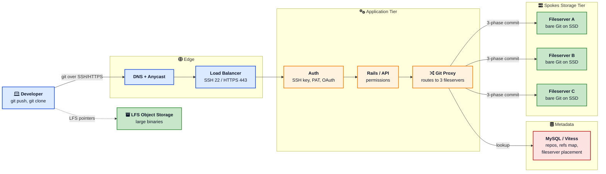
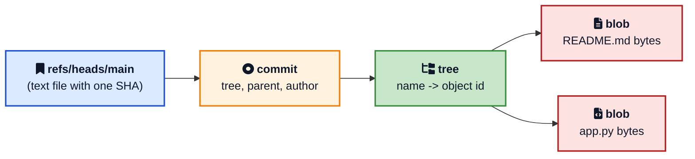
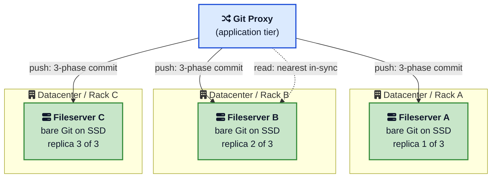
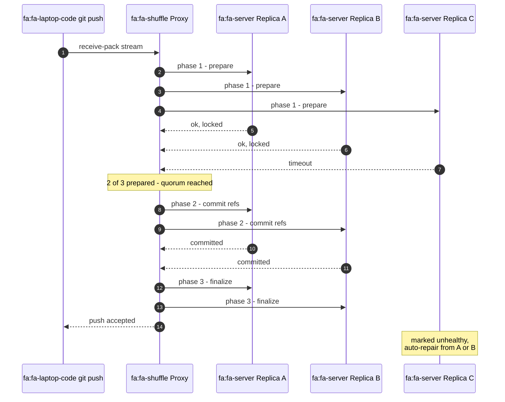
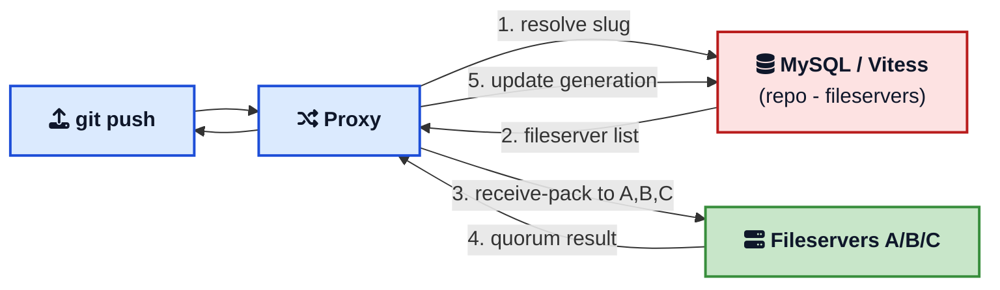
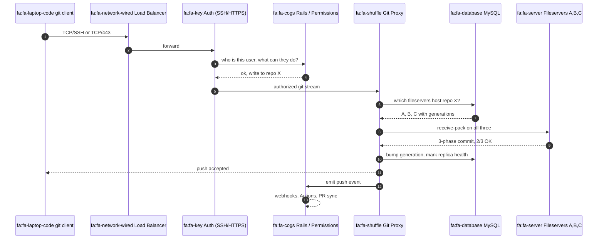
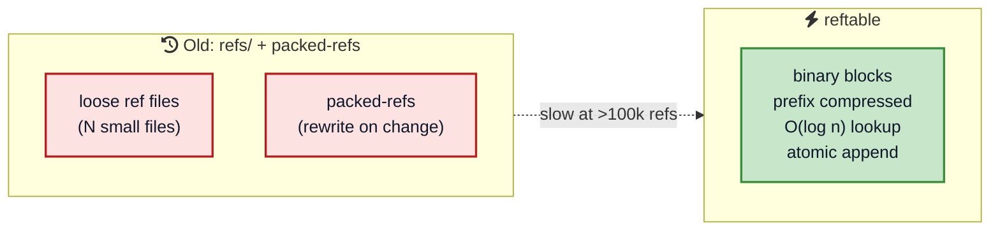
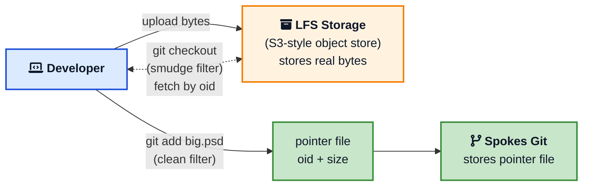

If you have used GitHub for a year you have done a few thousand `git push` and `git clone` operations without ever thinking about what happens behind the URL. The push returns. The clone finishes. The branch protection rule fires. It feels like magic.

It is not magic. It is a careful pile of plain Git, a small distributed systems protocol, a routing proxy, and a lot of MySQL. Once you can name the parts, a lot of things make sense: why a `git push --force` to a busy repo can take a moment, why `git clone` from a long way away is still surprisingly fast, why GitHub can reboot half its fleet during a working day and you do not notice, and why some of the worst monorepos in the world still respond in under a second.

This post is a tour of **how GitHub stores and serves Git repositories**, written for developers who want a working mental model. We will start with what Git itself stores on disk, then climb into [Spokes](https://github.blog/engineering/architecture-optimization/introducing-dgit/){:target="_blank" rel="noopener"}, the replication system that keeps three copies of every repo in sync, then look at the proxy that fronts it, the metadata layer behind it, and the optimizations that let it scale to monorepos with millions of files.

## The 30 Second Picture

Before zooming in, here is the whole pipeline from your terminal to the disk on a GitHub fileserver.



Five things to lock in:

1. Your Git client speaks the **standard Git wire protocol** over SSH or HTTPS. There is nothing GitHub specific on the wire. The TCP connection itself starts with a normal [DNS lookup](/how-dns-works/){:target="_blank" rel="noopener"} and TLS or SSH handshake (the same path covered in [what happens when you type a URL](/what-happens-when-you-type-url-in-browser/){:target="_blank" rel="noopener"}).
2. A **proxy** in the application tier figures out which three fileservers hold your repo by asking the metadata database.
3. The repository lives as a **plain bare Git repository** on three different machines.
4. Writes go to all three using a **three-phase commit**. Reads go to the closest in-sync replica.
5. Large files do not live in Git at all. They live as **pointer files** in Git and the actual bytes live in [LFS object storage](https://docs.github.com/repositories/working-with-files/managing-large-files/about-git-large-file-storage){:target="_blank" rel="noopener"}.

Everything below is just zooming into one of these boxes.

## The Foundation: How Git Itself Stores Data

You cannot understand how GitHub stores repositories without first understanding what a repository is on disk. If you already know the Git object model, skim this section and move on.

Inside any Git project, the entire database lives in `.git`. Two folders matter most.

```
.git/
  objects/        the object store (the database)
  refs/           branches, tags, remote pointers
  HEAD            which ref is currently checked out
  config          local config
  packed-refs     packed reference list
```

The [object store](https://git-scm.com/book/en/v2/Git-Internals-Git-Objects){:target="_blank" rel="noopener"} is a **content-addressable database**. Every object is identified by the cryptographic hash of its contents (SHA-1 historically, with SHA-256 support being added). There are four object types.

| Object | What it stores | Example |
|--------|----------------|---------|
| `blob` | A file's contents (no name, no mode) | The bytes of `README.md` |
| `tree` | A directory listing of names, modes, and child object IDs | `README.md -> blob abc, src -> tree def` |
| `commit` | Snapshot pointer plus author, message, parents | `tree xyz, parent 123, "fix typo"` |
| `tag` | Signed pointer to another object plus a message | `v1.0 -> commit pqr` |

Because the ID is the hash of the contents, two files with identical bytes are stored exactly once across the whole repo. That is why `git clone` of a repo with thousands of identical license files is fast and small.



### Loose Objects vs Pack Files

When you make a new commit, Git writes each new object as a **loose object**: one zlib compressed file at `.git/objects/ab/cdef...` (the first two hex chars are the directory). Loose objects are simple but inefficient at scale. Once a repository has millions of objects you do not want millions of tiny files.

Git's solution is **pack files**. Periodically (or on `git gc`) Git rolls many loose objects into a single `pack-<sha>.pack` file, with a companion `pack-<sha>.idx` index. Inside a pack, similar objects are stored as **deltas** against each other. The index is a sorted list of object IDs and offsets so that `git cat-file` can find any object in `O(log n)` without scanning the file, much like a [B-tree](/data-structures/b-tree/){:target="_blank" rel="noopener"} index in a database.

The GitHub blog post [Git's database internals](https://github.blog/open-source/git/gits-database-internals-i-packed-object-store/){:target="_blank" rel="noopener"} explains this in beautiful detail and is worth a long sit. The core insight is that Git is a database, the object store is its main table, and pack files are its compressed indexes.

### References Are Just Files

A branch in Git is not a fancy object. It is a single text file containing one 40-character commit hash.

```
$ cat .git/refs/heads/main
9f9258a8ffe4187f08a93bcba47784e07985d999
```

That is the entire implementation of a branch. `git push origin main` is, at heart, a request to update one such file on the server. This simplicity is a big part of why Git scales. Creating a branch is essentially free.

When the number of refs grows into the hundreds of thousands (Android famously has [~866k refs](https://eclipse.googlesource.com/jgit/jgit/+/master/Documentation/technical/reftable.md){:target="_blank" rel="noopener"}), individual ref files and the `packed-refs` blob both become a bottleneck. We will see in a later section how the new [reftable](https://github.com/git/git/blob/master/Documentation/technical/reftable.adoc){:target="_blank" rel="noopener"} format fixes this.

If you are new to Git internals, skim Pro Git's [Git Internals chapter](https://git-scm.com/book/en/v2/Git-Internals-Plumbing-and-Porcelain){:target="_blank" rel="noopener"} once. It is short, free, and pays for itself many times over.

## The Storage Tier: Spokes (formerly DGit)

Now to the GitHub specific part. Every public Git project on the planet has to live somewhere. GitHub's answer is a system called **Spokes**.

Spokes was originally launched in April 2016 under the name **DGit** ("Distributed Git") and renamed later that year because the name was too easy to confuse with Git itself. The defining write-up is the [Introducing DGit](https://github.blog/engineering/architecture-optimization/introducing-dgit/){:target="_blank" rel="noopener"} blog post and the follow-up [Building resilience in Spokes](https://github.blog/engineering/infrastructure/building-resilience-in-spokes/){:target="_blank" rel="noopener"}.

Spokes does three jobs.

1. Decide **which three fileservers** hold each repository.
2. Keep those three copies **in sync** on every push.
3. **Heal** automatically when a server fails.

Critically, each fileserver still runs plain Git on a regular Linux filesystem with local SSDs. There is no SAN, no distributed filesystem, no clever block layer. The reasoning, in GitHub's words, is that Git is extremely sensitive to disk latency. A single `git log` or `git blame` can touch thousands of objects sequentially, and any abstraction that adds even a millisecond of latency per object lookup becomes a serious tax. So Spokes lives one layer above the filesystem and treats each replica as a normal Git repo it talks to over Git protocols.



Replicas are placed so that **no two replicas share a rack**. Racks act as availability zones because a single power or top-of-rack network failure can take down a whole rack at once. Stretching Spokes added support for placing replicas in **different datacenters on different continents**, which is how GitHub serves a clone in Singapore from a fileserver in Singapore even when the canonical write happened in Virginia.

### Why Three Replicas

Three is the smallest number that lets you do useful things with a majority vote.

- One replica gives you no redundancy.
- Two replicas can both fail at once with no quorum.
- Three replicas tolerate one failure and still have a majority of two.

With three copies, Spokes can require **at least two** to confirm any write before it tells the user the push succeeded. Two-of-three [majority quorum](/distributed-systems/majority-quorum/){:target="_blank" rel="noopener"} gives both **durability** (the write is on two disks before anyone knows about it) and **conflict resolution** (two concurrent pushes cannot both acquire a majority of locks at the same time, so one has to wait).

If two servers fail at once, the affected repositories are still **readable** from the remaining replica, even if writes are blocked until repair finishes. This is exactly the [CAP theorem](https://en.wikipedia.org/wiki/CAP_theorem){:target="_blank" rel="noopener"} trade-off Spokes makes: it favors **consistency and partition tolerance** over availability for writes during a degraded state. The same trade-off shows up in many other distributed systems, like the [Paxos consensus algorithm](/distributed-systems/paxos/){:target="_blank" rel="noopener"} and [majority quorum protocols](/distributed-systems/replicated-log/){:target="_blank" rel="noopener"}.

### Writes: A Three-Phase Commit Across Replicas

A push is the most interesting thing that happens in Spokes. Here is what actually goes on the wire.



Step by step:

1. The proxy opens a Git `receive-pack` stream and forwards the pack data to all three replicas in parallel.
2. **Phase 1, prepare.** Each replica acquires local Git reference [locks](/database-locks-explained/){:target="_blank" rel="noopener"} and verifies that the old ref values match what the client expects.
3. **Phase 2, commit.** A majority confirms it can apply the update. Each agreeing replica writes the new ref values atomically using `git update-ref --stdin`, a transactional ref update API that GitHub engineers contributed to upstream Git specifically to make this work. See the [Git documentation for update-ref](https://git-scm.com/docs/git-update-ref){:target="_blank" rel="noopener"}.
4. **Phase 3, finalize.** All committed replicas release locks. A **Spokes checksum** is computed across the new ref state. If the majority's checksums match, the push is acknowledged.
5. Any replica that disagreed (in our example, replica C) is **rolled back** and marked unhealthy. A repair job copies the missing objects and refs from a healthy replica.

Across a continent, a round trip takes 60 to 80 milliseconds. Spokes uses about four round trips per write, so a coast-to-coast push of a single ref takes around a third of a second of pure network time. That is the whole budget. Everything else (computing checksums, scanning refs, locking) has to run **in parallel with the network waits**. The [Stretching Spokes](https://github.blog/engineering/infrastructure/stretching-spokes/){:target="_blank" rel="noopener"} post is a great walk through the optimizations that made this possible.

### Reads: Routed to the Closest In-Sync Replica

A `git fetch` or `git clone` does not need a quorum. It just needs **one** replica that is up to date.

The proxy keeps a per repository view of which replicas are in sync. For each read, it ranks the replicas by latency and routes to the closest healthy one. If that replica fails for any reason, the proxy fails over to the next one in the list. Because every fileserver is running plain Git, the read uses the standard Git `upload-pack` protocol with the standard performance optimizations (negotiation, pack reuse, [reachability bitmaps](https://github.blog/open-source/git/scaling-monorepo-maintenance/){:target="_blank" rel="noopener"}).

This is also how GitHub's geo-replicated reads work. The same Spokes voting protocol that ensures writes were durable also tracks **which replicas have caught up to which version**, so it can confidently send your `git clone` to a nearby replica.

### Failure Detection by Real Traffic, Not Heartbeats

Most distributed systems use heartbeats to detect failures. Spokes uses them too, but only as a secondary signal. The primary failure detector is **the actual application traffic**. As [Building resilience in Spokes](https://github.blog/engineering/infrastructure/building-resilience-in-spokes/){:target="_blank" rel="noopener"} explains, a fileserver that starts to fail will start failing real RPCs. After **three failed RPCs in a row**, the proxy moves that fileserver to the back of the routing list for that repository.

Why traffic instead of heartbeats? Two reasons:

1. **Heartbeats are slow to react.** A 1 Hz heartbeat learns about a failure after a hundred real requests have already failed.
2. **Heartbeats only test a subset.** A no-op TCP ping can succeed while the Git binary is corrupt, the disk is hung, or auth is broken.

The detection is also **MxN**. Each application server keeps its own opinion of which fileservers are healthy. If many app servers mark one fileserver bad, the fileserver really is bad. If one app server marks every fileserver bad, the **app server** is the broken one. That diagnostic clarity is impossible with a single global health view.

The same idea shows up in many places once you start looking, including service mesh outlier detection, the [circuit breaker pattern](/circuit-breaker-pattern-explained/){:target="_blank" rel="noopener"} that trips on consecutive failures, [heartbeats in distributed systems](/distributed-systems/heartbeat/){:target="_blank" rel="noopener"}, and the [gossip dissemination](/distributed-systems/gossip-dissemination/){:target="_blank" rel="noopener"} pattern.

### Self-Healing and Quiescing

When a fileserver dies, every repository that lived on it is suddenly down to two replicas. Spokes detects this and starts creating fresh replicas on other fileservers, copying objects and refs from the surviving two. Because every fileserver in the pool can be both source and destination, healing is **N to N** across the cluster: the more fileservers you have, the faster recovery is.

Planned reboots use a more polite mechanism called **quiescing**. The fileserver is marked offline for new reads but still accepts writes (because writes go to all three replicas anyway, dropping one is fine). Existing long reads, like a `git clone` of a multi gigabyte repo over a slow network, are allowed to finish before the server actually reboots. This is why GitHub can roll out kernel patches across the storage tier without users noticing.

For a more general look at the same ideas, the [Replicated Log](/distributed-systems/replicated-log/){:target="_blank" rel="noopener"} and [High Watermark](/distributed-systems/high-watermark/){:target="_blank" rel="noopener"} posts cover the broader pattern.

## The Routing and Metadata Layer

Spokes by itself does not know where any specific repository lives. That information is in a **MySQL** based metadata tier, sharded with a Vitess-style topology. (GitHub has been a long-time MySQL shop and contributes heavily to the ecosystem; see the [GitHub Engineering blog on MySQL HA](https://github.blog/2018-06-20-mysql-high-availability-at-github/){:target="_blank" rel="noopener"} for background. For a different take on running a sharded relational tier at scale, see [how OpenAI scales PostgreSQL](/how-openai-scales-postgresql/){:target="_blank" rel="noopener"}.)

For each repository the metadata layer stores roughly:

- A canonical **repository ID** and **owner**.
- The **three fileserver IDs** currently holding replicas, with a generation number per replica.
- The **status** of each replica (in-sync, lagging, unhealthy, decommissioning).
- The **slug** mapping (`octocat/hello-world` to repo ID).

When a `git push` arrives, the proxy does roughly this:

1. Resolve the slug `octocat/hello-world` to a repository ID via MySQL.
2. Check that the user is authenticated and authorized via the Rails app and permissions service.
3. Look up the three fileservers that hold replicas of that repository ID.
4. Open `receive-pack` connections to all three and run the three-phase commit described earlier.
5. On success, update the metadata to record the new generation number and any replica health changes.

The metadata layer is the brain of routing. Without it, the proxy has no idea which fileservers to talk to. With it, the proxy can fail over a single repository's replicas as easily as updating one row.



This is also where GitHub's higher level features hook in. Pull requests, branch protection, merge queues, status checks, and webhooks all live in the Rails application and read or update metadata when events happen on the fileservers. A push triggers a webhook because the proxy publishes an event onto an internal log (similar in spirit to [how Kafka works](/distributed-systems/how-kafka-works/){:target="_blank" rel="noopener"}) after the quorum vote succeeds, not because the fileserver knows what a webhook is.

If you are curious how a similar metadata plus storage split looks elsewhere, [How Amazon S3 Works](/how-amazon-s3-works/){:target="_blank" rel="noopener"} covers the keymap and storage node split, and [How Google Docs Works](/how-google-docs-works/){:target="_blank" rel="noopener"} covers a similar metadata service in front of Bigtable.

## How a git push Travels End to End

We can put it all together. Here is what happens when you run `git push origin main` from your laptop.



The whole thing typically completes in a few hundred milliseconds for a small push, even when one of the replicas is sluggish. The latency budget is dominated by the three-phase commit, which is exactly why GitHub spent so much effort making reference updates in upstream Git transactional and fast.

If you are debugging push performance, knowing this pipeline is the single most useful thing. A slow push is almost always one of: slow client network, slow auth handshake, large pack file, slow ref transaction on the fileserver, or a degraded replica forcing a retry. Each of these maps to a specific box in the diagram above. If you operate any system shaped like this, [distributed tracing](/distributed-tracing-jaeger-vs-tempo-vs-zipkin/){:target="_blank" rel="noopener"} is the single tool that turns a vague "push is slow" report into a fixable span.

## Pack Files, Multi-Pack-Index, and Reachability Bitmaps

If Spokes is the **distribution** problem, pack files are the **single-server performance** problem. GitHub's monorepo customers (and big open source projects like Linux, Chromium, and the Windows source tree) have repositories with tens of millions of objects and hundreds of thousands of refs. Without serious engineering on the Git side, those repos would be unusable.

The most important features GitHub helped land in upstream Git are summarized in [Scaling monorepo maintenance](https://github.blog/open-source/git/scaling-monorepo-maintenance/){:target="_blank" rel="noopener"} and [Improving large monorepo performance on GitHub](https://github.blog/developer-skills/github/improving-large-monorepo-performance-on-github/){:target="_blank" rel="noopener"}.

### Pack Files

A pack file packs many objects into one file with delta compression. Similar files (think two versions of the same TypeScript module) are stored as a small diff against each other, which can shrink a repo by 5-10x. Each pack has an `.idx` index file that maps object ID to byte offset.

### Multi-Pack-Index (MIDX)

Once a repo has dozens of pack files, looking up an object means asking each `.idx` in turn. The **multi-pack-index** is a single index that spans many pack files, turning that linear scan into a single binary search. On a large repo this alone can cut common operations by an order of magnitude.

### Reachability Bitmaps

Lots of Git operations need to answer "given this commit, what is the closure of all reachable objects?". The naive answer is to walk the commit graph. The fast answer is a **reachability bitmap**: for each precomputed commit, a compressed bit per object that says "is this object reachable from here?". Set operations on bitmaps are essentially free, so once you have them, computing the difference between two refs is a single `XOR`.

Bitmaps used to require a single pack file. GitHub extended them to work on a multi-pack-index, which means a huge monorepo can keep its bitmaps fresh without an expensive full repack. That extension is the headline feature of the [Scaling monorepo maintenance](https://github.blog/open-source/git/scaling-monorepo-maintenance/){:target="_blank" rel="noopener"} post.

### Partial Clone and Sparse Checkout

The other half of monorepo scale is on the **client**. **Partial clone** lets `git clone --filter=blob:none` skip downloading file blobs and lazily fetch them on demand. **Sparse checkout** lets you check out only a subset of paths into your worktree. Together they make a 10 GB monorepo feel like a small project for any given developer.

### Reftable

The classic ref store has two failure modes when refs grow into the hundreds of thousands. Loose refs become millions of tiny files. The packed-refs file becomes a giant text file that has to be rewritten on every change.

The new [reftable](https://github.com/git/git/blob/master/Documentation/technical/reftable.adoc){:target="_blank" rel="noopener"} format is a binary, prefix compressed, multi-block file with constant time lookup and atomic appends. The [JGit reftable design doc](https://eclipse.googlesource.com/jgit/jgit/+/master/Documentation/technical/reftable.md){:target="_blank" rel="noopener"} reports that for Android's 866k refs, reftable shrinks storage to roughly 60 percent of packed-refs and cuts lookups from 410 milliseconds to 34 microseconds. That is what makes a million-ref monorepo feel snappy.



These are not exotic optimizations any more. If you push to a busy GitHub repository today, a real-world stack of MIDX, bitmaps, and (increasingly) reftable is what makes your push feel instant.

## Git LFS: Where the Big Files Actually Live

Git is great at source code. It is bad at five gigabyte video files. Every clone has to download every version of every file, and pack file delta compression does not help for already-compressed binaries.

[Git Large File Storage (LFS)](https://git-lfs.com/){:target="_blank" rel="noopener"} solves this by **not** putting big files in Git. When you `git lfs track "*.psd"`, a Git filter intercepts large files at `git add` time and replaces them with a tiny pointer file like this:

```
version https://git-lfs.github.com/spec/v1
oid sha256:4d7a214614ab2935c943f9e0ff69d22eadbb8f32b1258daaa5e2ca24d17e2393
size 12345
```

That pointer is what gets stored in the Git object database and replicated by Spokes. The actual bytes are uploaded over HTTPS to a separate **LFS object storage backend** (built on S3-style object storage; see the [Git LFS API spec](https://github.com/git-lfs/git-lfs/blob/main/docs/api/README.md){:target="_blank" rel="noopener"}). On checkout, a smudge filter sees the pointer, downloads the real bytes by SHA-256, and writes them to your worktree.



The split is a clean separation of concerns. Spokes only ever sees small text pointers, so the three replica voting stays cheap. The big bytes live in object storage that is built for exactly this workload, with similar durability guarantees to those in the [Amazon S3 deep dive](/how-amazon-s3-works/){:target="_blank" rel="noopener"}.

The current [GitHub LFS file size limits](https://docs.github.com/en/repositories/working-with-files/managing-large-files/about-git-large-file-storage){:target="_blank" rel="noopener"} are 2 GB on Free/Pro, 4 GB on Team, and 5 GB on Enterprise Cloud per file.

## What Other Pieces Look Like

GitHub is not just storage. A few adjacent pieces are worth knowing about because they sit on top of the same plumbing.

### GitHub Pages

[GitHub Pages](https://docs.github.com/pages){:target="_blank" rel="noopener"} serves your `index.html` from a separate fileserver tier behind [Fastly](https://www.fastly.com/){:target="_blank" rel="noopener"} as a CDN. The classic [Rearchitecting GitHub Pages](https://github.blog/news-insights/rearchitecting-github-pages/){:target="_blank" rel="noopener"} post describes the move from DRBD-paired fileservers to an `nginx + ngx_lua` routing tier that looks up the right Pages backend in MySQL on every request. Cached responses live at the CDN edge using fairly standard [caching strategies](/caching-strategies-explained/){:target="_blank" rel="noopener"}, which is what gives Pages its surprisingly good availability.

### GitHub Actions

[GitHub Actions](/github-actions-basics-cicd-automation/){:target="_blank" rel="noopener"} runs in a separate compute tier. It clones the repository it is acting on by talking to the same Spokes fileservers as your laptop does, just over the internal network. Webhooks flowing out of Spokes after each push are what trigger workflow runs.

### Search and Code Navigation

Code search is its own indexing pipeline backed by a large Elasticsearch cluster (and now [Blackbird](https://github.blog/engineering/the-technology-behind-githubs-new-code-search/){:target="_blank" rel="noopener"}, GitHub's purpose-built code search engine). It consumes events from Spokes and reindexes affected files asynchronously, which is why a search for code you just pushed can take a few seconds to update.

### Pull Requests and Code Review

A pull request is metadata in MySQL plus refs on the fileservers. When you open a PR, GitHub computes a **test merge** between source and target and stores it as a hidden ref like `refs/pull/123/merge` on the fileserver. The Stretching Spokes post mentions that a single push to `master` can trigger more than a hundred bookkeeping ref updates as PRs are recomputed. This is exactly why fast and transactional ref updates are so important.

## Practical Lessons for Developers

You can use GitHub for years without thinking about any of this. Once you do think about it, several practical decisions become obvious.

### Treat Refs as Cheap, Not Free

Branches are nearly free, but every branch is a ref and every ref participates in the three-phase commit when you push. A workflow that creates and pushes thousands of refs per minute can saturate the ref update budget for a repository, especially with geo-replicated replicas. Batch your ref updates with `git push --atomic` when you can.

### Pack Your Pushes

Many small pushes are slower than one big push because each one pays the round-trip cost of the three-phase commit. If you have a script generating commits, push at the end. If you are scripting against the API, prefer a single `git push` over a loop.

### Embrace Partial Clone for Big Repos

If you ever clone a GitHub repository that takes more than a few minutes, try `git clone --filter=blob:none --sparse <url>` followed by `git sparse-checkout set <paths>`. You will download the commit graph and trees but skip blobs you do not care about. This is the same workflow Microsoft uses internally with Scalar; see the [microsoft/scalar](https://github.com/microsoft/scalar){:target="_blank" rel="noopener"} project for a wrapper that automates this.

### Move Big Binaries to LFS Before They Hurt

A 100 MB Photoshop file checked into Git directly will live in every clone of your repo forever, including all forks. The same file in LFS lives once on object storage and only gets pulled to your worktree on demand. Set up [`.gitattributes`](https://git-scm.com/docs/gitattributes){:target="_blank" rel="noopener"} early, before the binaries pile up.

### Trust the Geo Replica

If your `git fetch` from outside the US feels slow, it is rarely the fileservers and almost always your local link or a misbehaving SSH session. Spokes is already routing you to the closest in-sync replica. Try cloning over HTTPS instead of SSH; HTTPS goes through the regular load balancer fleet which is heavily geo-distributed.

### Read Your Webhooks for Push Truth

If you need to know exactly when a push has been **durably accepted**, the webhook from GitHub is your truth. The `git push` exit code tells you the proxy was happy, but the webhook fires after metadata has been updated and the push event has been published to subscribers.

For a deeper dive into the patterns that make this kind of architecture possible, the [Distributed Systems hub](/distributed-systems/){:target="_blank" rel="noopener"} on this blog has posts on [consistent hashing](/consistent-hashing-explained/){:target="_blank" rel="noopener"}, [the write-ahead log](/distributed-systems/write-ahead-log/){:target="_blank" rel="noopener"}, [two-phase commit](/distributed-systems/two-phase-commit/){:target="_blank" rel="noopener"}, and [Lamport clocks](/distributed-systems/lamport-clock/){:target="_blank" rel="noopener"}.

## How GitHub Compares to Other Git Hosts

Once you understand the GitHub model, the differences in other Git hosts become easier to read. Each one trades different things off.

| Aspect | GitHub | GitLab | Bitbucket | Self-hosted Gitea |
|--------|--------|--------|-----------|-------------------|
| Storage tier | Spokes (3 replicas, plain Git) | [Gitaly](https://docs.gitlab.com/administration/gitaly/){:target="_blank" rel="noopener"} (sharded, [Praefect](https://docs.gitlab.com/administration/gitaly/praefect/){:target="_blank" rel="noopener"} for HA) | NFS or block storage | Single node by default |
| Replication | App-level via Git protocols | Praefect transactions | Filesystem level | Optional mirror push |
| Metadata DB | MySQL/Vitess | PostgreSQL | PostgreSQL | SQLite/MySQL/Postgres |
| LFS backend | Object storage | Object storage | Object storage | Local or object storage |
| Geo-replication | Built into Spokes | [GitLab Geo](https://about.gitlab.com/solutions/geo/){:target="_blank" rel="noopener"} | Smart Mirroring | Manual |

The ideas are very similar across hosts. Plain Git on disk, a routing layer in front, replicated metadata, and a separate large-file path. The differences are in how aggressively each host pushes the storage tier toward strict consistency.

## Further Reading

The GitHub engineering team has published an unusual amount of high-quality material on this stack. These are the canonical sources.

- [Introducing DGit](https://github.blog/engineering/architecture-optimization/introducing-dgit/){:target="_blank" rel="noopener"}: the original announcement, with the design motivation and rollout story.
- [Building resilience in Spokes](https://github.blog/engineering/infrastructure/building-resilience-in-spokes/){:target="_blank" rel="noopener"}: failure detection, MxN health, quiescing, and durability internals.
- [Stretching Spokes](https://github.blog/engineering/infrastructure/stretching-spokes/){:target="_blank" rel="noopener"}: how Spokes scaled to widely separated datacenters.
- [Git's database internals (5-part series)](https://github.blog/open-source/git/gits-database-internals-i-packed-object-store/){:target="_blank" rel="noopener"} by Derrick Stolee: the deepest readable tour of Git as a database.
- [Scaling monorepo maintenance](https://github.blog/open-source/git/scaling-monorepo-maintenance/){:target="_blank" rel="noopener"}: multi-pack-index bitmaps and incremental repacking.
- [Improving large monorepo performance on GitHub](https://github.blog/developer-skills/github/improving-large-monorepo-performance-on-github/){:target="_blank" rel="noopener"}: the developer-facing summary.
- [Rearchitecting GitHub Pages](https://github.blog/news-insights/rearchitecting-github-pages/){:target="_blank" rel="noopener"}: how the Pages serving tier is built.
- [reftable design doc](https://github.com/git/git/blob/master/Documentation/technical/reftable.adoc){:target="_blank" rel="noopener"} and the [JGit reftable spec](https://eclipse.googlesource.com/jgit/jgit/+/master/Documentation/technical/reftable.md){:target="_blank" rel="noopener"}.
- The free [Pro Git book](https://git-scm.com/book/en/v2){:target="_blank" rel="noopener"}, especially the [Git Internals](https://git-scm.com/book/en/v2/Git-Internals-Plumbing-and-Porcelain){:target="_blank" rel="noopener"} chapter.
- For a different perspective, [Git Internals: Understanding the Architecture of Distributed Version Control](https://marabesi.com/git/2-git-internals.html){:target="_blank" rel="noopener"} on marabesi.com is a friendly walk-through.

## Wrapping Up

GitHub is one of the most heavily used pieces of developer infrastructure in the world, and it is built on top of an idea that sounds almost too simple: keep three plain Git repositories on three different SSDs, put a smart proxy in front, and wrap a small distributed protocol around it.

That simplicity is the whole point. Git is fast on local disks. Three is the smallest useful quorum. A majority vote is the simplest way to make writes both durable and consistent. A real-traffic failure detector reacts faster than any heartbeat could. And every clever scaling feature, from pack files to multi-pack-index bitmaps to reftable, is being co-developed in upstream Git so that the same techniques work for everyone.

The next time a push lands in 200 milliseconds, you will know that somewhere in a datacenter near you, three SSDs just agreed on the same Git transaction, a MySQL row got bumped, and a webhook went out to your CI system. None of it was magic. All of it was good engineering layered on top of the original good engineering of Git itself.

Spend an afternoon reading the [DGit](https://github.blog/engineering/architecture-optimization/introducing-dgit/){:target="_blank" rel="noopener"} and [Spokes](https://github.blog/engineering/infrastructure/building-resilience-in-spokes/){:target="_blank" rel="noopener"} posts in their original form. Spend another running `git cat-file -p HEAD` and walking the object graph by hand. By the end of the week you will have a clearer picture of what is happening behind every `git push` than 99 percent of the developers who use GitHub every day.

---

*For more practical reading on this blog, see the [Git cheat sheet](/git-cheat-sheet/){:target="_blank" rel="noopener"}, [Git command line basics](/git-command-line-basics/){:target="_blank" rel="noopener"}, [Git config guide](/git-config-guide/){:target="_blank" rel="noopener"}, [GitHub Actions basics](/github-actions-basics-cicd-automation/){:target="_blank" rel="noopener"}, [How Amazon S3 Works](/how-amazon-s3-works/){:target="_blank" rel="noopener"}, [How Databases Store Data Internally](/how-databases-store-data-internally/){:target="_blank" rel="noopener"}, [PostgreSQL internals](/postgresql-internals-how-queries-execute/){:target="_blank" rel="noopener"}, [How OpenAI Scales PostgreSQL](/how-openai-scales-postgresql/){:target="_blank" rel="noopener"}, [Two-Phase Commit](/distributed-systems/two-phase-commit/){:target="_blank" rel="noopener"}, [Replicated Log](/distributed-systems/replicated-log/){:target="_blank" rel="noopener"}, [Majority Quorum](/distributed-systems/majority-quorum/){:target="_blank" rel="noopener"}, [Heartbeats](/distributed-systems/heartbeat/){:target="_blank" rel="noopener"}, [Consistent Hashing](/consistent-hashing-explained/){:target="_blank" rel="noopener"}, the [System Design Cheat Sheet](/system-design-cheat-sheet/){:target="_blank" rel="noopener"}, and the broader [Distributed Systems hub](/distributed-systems/){:target="_blank" rel="noopener"} and [System Design hub](/system-design/){:target="_blank" rel="noopener"}.*

*Further reading: the official [Pro Git book](https://git-scm.com/book/en/v2){:target="_blank" rel="noopener"}, [Git's database internals](https://github.blog/open-source/git/gits-database-internals-i-packed-object-store/){:target="_blank" rel="noopener"} series on the GitHub Blog, the [Spokes](https://github.blog/engineering/infrastructure/building-resilience-in-spokes/){:target="_blank" rel="noopener"} write-ups, and Microsoft's [Scalar](https://github.com/microsoft/scalar){:target="_blank" rel="noopener"} project for monorepo workflows.*
