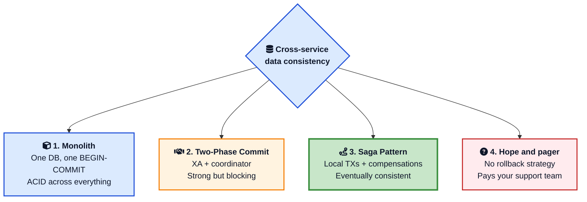
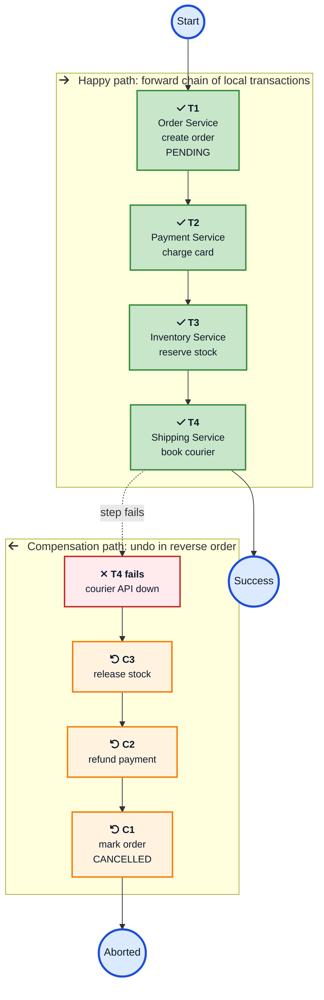
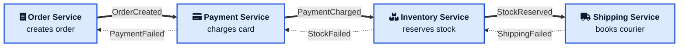
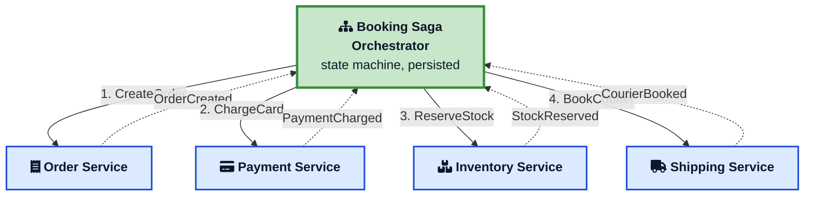
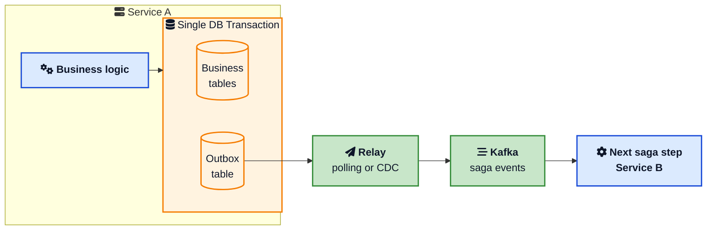
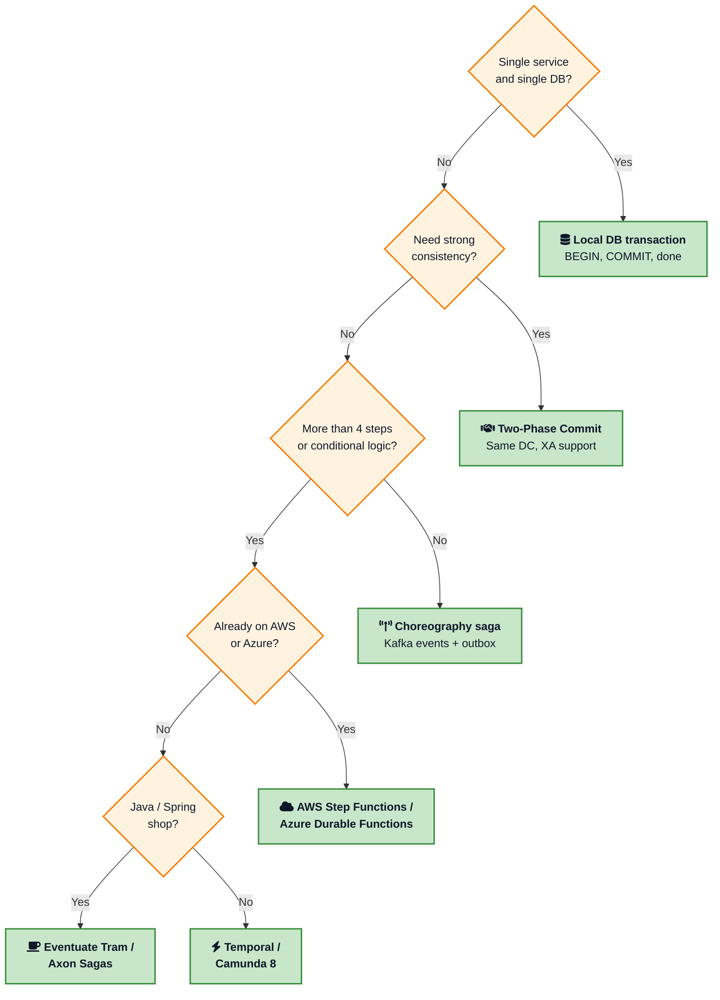

A customer hits **Book Trip**. Behind that one click your system has to charge a card, reserve a hotel room, hold a flight seat, and put a rental car on hold. Four services. Four databases. Four ways for the request to fail.

If the flight reservation fails *after* you charged the card, what happens? You cannot wrap all four calls in a `BEGIN ... COMMIT`. Each service owns its own database. The flight provider is on the other side of the internet. There is no global transaction here.

This is the problem the **Saga Pattern** was invented to solve. It is one of the most quoted, most misunderstood patterns in microservices. This post is a deep dive into how it actually works, the two flavours people argue about, the traps that catch teams in production, and the tools that take most of the pain away.

If you have already read the [Transactional Outbox Pattern](/transactional-outbox-pattern/){:target="_blank" rel="noopener"} and [Two-Phase Commit](/distributed-systems/two-phase-commit/){:target="_blank" rel="noopener"} posts, this one fills the gap between them. Outbox guarantees that one service publishes events reliably. 2PC tries to make multiple databases agree atomically. Sagas are the practical pattern for everything in between, when you need a multi-step business workflow to either complete or unwind cleanly.

> **TL;DR**: A saga is a sequence of local transactions linked by events or commands. Each step has a compensating transaction. There is no global lock, no XA, and no distributed deadlocks. You pick choreography for simple flows, orchestration for anything you actually want to debug. Pair sagas with the outbox pattern, make every step idempotent, and use Temporal or AWS Step Functions before you write your own engine.

## Why You Cannot Just Use a Database Transaction

In a [modular monolith](/modular-monolith-architecture/){:target="_blank" rel="noopener"}, the trip booking flow is easy. One database, one transaction, ACID does the rest:

```sql
BEGIN;
  INSERT INTO orders (...);
  UPDATE accounts SET balance = balance - 250 WHERE id = 42;
  INSERT INTO hotel_holds (...);
  INSERT INTO flight_holds (...);
COMMIT;
```

If anything fails, Postgres rolls everything back. You do not even have to think about it.

In a microservice architecture, that single COMMIT is gone. Order Service has its own Postgres. Payments runs Aurora. Inventory uses MongoDB. The Flight provider is a third-party HTTPS API. Each one only knows about its own data. There is no shared lock manager, no shared write-ahead log, no shared anything.

You only have three options to coordinate them:

1. **Two-Phase Commit (2PC)**. Every participant supports XA, votes prepare or abort, and a coordinator commits everything atomically. Strong consistency but [blocking, slow, and rarely supported by modern brokers](/distributed-systems/two-phase-commit/){:target="_blank" rel="noopener"}.
2. **Eventual consistency with no rollback**. Just write to each service in turn and hope. This is what most "we will fix it in support" architectures actually look like.
3. **The Saga Pattern**. Local transactions plus explicit compensations. Eventual consistency, but with structured recovery.



Sagas are option three, and in 2026 they are the default for anything more complex than a single-service write.



## A One-Paragraph History

The pattern is older than microservices. **Hector Garcia-Molina and Kenneth Salem** introduced the idea in their 1987 paper [Sagas](https://www.cs.cornell.edu/andru/cs711/2002fa/reading/sagas.pdf){:target="_blank" rel="noopener"}, written for long-running transactions inside a single database where holding locks for hours was unworkable. A saga, in their words, was "a long-lived transaction that can be written as a sequence of transactions that can be interleaved with other transactions." The compensating transaction concept comes straight from that paper.

The pattern slept for two decades, then got resurrected in the mid-2010s when companies like **Netflix, Uber, and Amazon** moved from monoliths to microservices and ran straight into the cross-service consistency wall. Chris Richardson formalized the modern version on [microservices.io](https://microservices.io/patterns/data/saga.html){:target="_blank" rel="noopener"}, and tools like Camunda, Temporal, and AWS Step Functions turned it into infrastructure.

## What a Saga Actually Is

A **saga** is a sequence of `n` local transactions `T1, T2, ... Tn`. Each `Ti` runs entirely inside one service and uses that service's local ACID transaction. After each successful step, the saga moves to the next.

For each `Ti` you also write a **compensating transaction** `Ci`. The compensation undoes the *business effect* of `Ti`. It is not a database rollback. The original transaction has long since committed. The compensation is a new transaction that does the opposite work.

If step `Tk` fails, the saga executes `Ck-1, Ck-2, ... C1` in reverse order to back the world out.



A few things to notice in that picture, because they trip people up:

- The forward path is a happy chain. Each `T` only knows the result of the previous step.
- Compensations run in reverse, but you do not need every `C` for every failure. If `T2` fails, only `C1` runs. If `T4` fails, you run `C3`, `C2`, `C1`.
- There is no compensation for the failed step itself. `T4` did not commit anything, so there is nothing to undo.
- The whole thing assumes compensations succeed, eventually. If `C2` keeps failing, you need a manual recovery workflow, not another saga.

This is the entire pattern. Everything else is "how do we coordinate the steps" and "how do we make the compensations behave."



## Compensating Transactions Are Not Rollbacks

This is the single biggest mental shift. Read it twice.

In a database, ROLLBACK undoes uncommitted changes. The transaction never happened. With a saga, every `Ti` *committed locally* before the next step started. The world has moved on. By the time you decide to compensate, three other things may already depend on what `T2` did.

A compensation is a **new business operation**, written in normal code:

| Step (Ti) | Compensation (Ci) |
|---|---|
| Reserve hotel room | Cancel reservation |
| Charge customer card | Issue refund |
| Send order confirmation email | Send order cancellation email |
| Decrement inventory | Increment inventory |
| Generate invoice number | Mark invoice as voided |
| Notify warehouse to pack | Notify warehouse to skip |

Two practical consequences:

1. **Some actions cannot be undone.** You cannot un-send an email. You cannot un-physically-ship a parcel that already left the warehouse. The best you can do is *semantic compensation*, which is a follow-up action that explains the change, not a literal reversal.
2. **Compensations can fail.** Refund APIs go down. The hotel says the booking was already cleaned up. Your compensation has to be retried until it succeeds, or escalated to a human.

Chris Richardson's classification, which I have found genuinely useful, splits transaction types into three buckets:

- **Compensable transactions**: can be undone with a compensation. Most data writes fit here.
- **Pivot transaction**: the point of no return. Once it commits, the saga must complete forward. Charging the card or shipping the parcel is often the pivot.
- **Retriable transactions**: post-pivot steps that have no compensation and just have to be retried until they succeed. Typically things like sending the receipt or updating analytics.

Designing a saga is in large part deciding **where the pivot lives**, and making sure compensations exist for everything before it.

## Choreography vs Orchestration

There are two ways to wire a saga together. The whole industry argues about which is better. The honest answer is "it depends on how many steps you have and how much you value debuggability."

### Choreography: services react to each other

In a **choreography saga**, there is no central brain. Each service does its local transaction, publishes an event, and listens for events from others. The saga is implicit in the topology of who subscribes to what.



The double-arrows are the happy path. The dotted arrows are compensation events that flow backward. Each service knows nothing about the saga as a whole. It only knows which events it cares about and what it should do with them.

**What it gets right:**

- No new infrastructure. You probably already have [Kafka or RabbitMQ](/kafka-vs-rabbitmq-vs-sqs/){:target="_blank" rel="noopener"}.
- No single point of failure. The saga continues as long as the broker is up.
- Clean service boundaries. Nobody depends on a coordinator.

**What it gets wrong, fast:**

- The flow is invisible. To understand what happens after `OrderCreated`, you have to grep every service's consumer code. Tracing a stuck saga is painful.
- Cyclic dependencies sneak in. Service A subscribes to events from B, B subscribes to A. Now you have a coupling no architecture diagram shows.
- Compensation logic is duplicated. Every service has to know what events to listen to in order to undo its work.
- The state of the saga is **distributed across logs**. There is no row anywhere that says "this saga is on step 3 of 5."

Choreography is great for sagas with two or three steps. By five it becomes a maintenance burden. The [Camunda team's blog post on orchestration vs choreography](https://camunda.com/blog/2023/02/orchestration-vs-choreography/){:target="_blank" rel="noopener"} has a good treatment of this trade-off if you want a second opinion.

### Orchestration: a coordinator drives the flow

In an **orchestration saga**, a dedicated component, the **saga orchestrator**, owns the workflow. It calls each service in turn, waits for the reply, decides the next step, and triggers compensations on failure.



The orchestrator is a state machine. It knows the saga's current step, persists progress, retries failed calls, and runs compensations in reverse when a step fails.

**What it gets right:**

- The flow is explicit and lives in one place. New engineers can read it.
- Easy to debug. You can ask "where is saga 12345 stuck?" and get an answer.
- Centralized retry, timeout, and compensation logic.
- Easy to extend. Adding a new step is editing the state machine, not negotiating with three teams about new event topics.
- Plays naturally with [observability](/opentelemetry-production-guide/){:target="_blank" rel="noopener"} tools because every step has a clear span.

**What it gets wrong:**

- The orchestrator is a new service to operate. It needs durable state, leader election, and high availability.
- You can drift into "smart pipes" where the orchestrator does business logic that should live in services.
- Tight coupling. The orchestrator must know the API of every participant.

In practice almost every serious production system ends up using orchestration, often via a managed engine like Temporal or AWS Step Functions. The "we will keep it pure choreography" position usually lasts until the second on-call incident.

## A Concrete Walkthrough: The Booking Saga

Let us put real types on the trip booking story. The saga has four steps:

```text
T1: OrderService.createOrder()              -> C1: cancelOrder()
T2: PaymentService.charge()                  -> C2: refund()
T3: InventoryService.reserveSeats()         -> C3: releaseSeats()
T4: NotificationService.sendConfirmation()  -> (no compensation, retriable)
```

`T4` is post-pivot. Once payment succeeds and stock is reserved, sending the confirmation is just a retriable call. There is no compensation for it.

### Choreography version

Each service publishes events. The flow is encoded in subscriptions.

```python
# Order Service
def handle_book_trip(cmd):
    with db.transaction():
        order = Order.create(status="PENDING", ...)
        outbox.publish("OrderCreated", {"order_id": order.id, "amount": cmd.amount})

# Payment Service
def on_order_created(event):
    try:
        charge_id = stripe.charge(amount=event.amount, idempotency_key=event.order_id)
        with db.transaction():
            Payment.create(order_id=event.order_id, charge_id=charge_id, status="CHARGED")
            outbox.publish("PaymentCharged", {"order_id": event.order_id})
    except CardDeclined:
        outbox.publish("PaymentFailed", {"order_id": event.order_id, "reason": "declined"})

# Inventory Service
def on_payment_charged(event):
    try:
        reserve_seats(event.order_id)
        outbox.publish("StockReserved", {"order_id": event.order_id})
    except OutOfStock:
        outbox.publish("StockFailed", {"order_id": event.order_id})

# Compensation listeners
def on_payment_failed(event):
    OrderService.cancel(event.order_id)

def on_stock_failed(event):
    PaymentService.refund(event.order_id)
    OrderService.cancel(event.order_id)
```



Notice three things:

1. Every state change happens inside a local DB transaction together with an `outbox.publish` call. That is the [transactional outbox pattern](/transactional-outbox-pattern/){:target="_blank" rel="noopener"} doing the heavy lifting. Without it your saga loses events and gets stuck.
2. `idempotency_key` on the Stripe charge. The consumer can be retried any number of times and Stripe will return the same charge. This is the second non-negotiable rule of sagas.
3. The compensation listeners are tiny but they multiply. Add a fifth service, and every prior service may need a new listener for new failure events. This is how choreography spirals.

### Orchestration version

The orchestrator is a state machine, often expressed as code in tools like [Temporal](https://www.temporal.io/blog/mastering-saga-patterns-for-distributed-transactions-in-microservices){:target="_blank" rel="noopener"} or as a JSON state machine in [AWS Step Functions](https://docs.aws.amazon.com/prescriptive-guidance/latest/modernization-data-persistence/saga-pattern.html){:target="_blank" rel="noopener"}. In Temporal Python it looks like this:

```python
@workflow.defn
class BookTripSaga:
    @workflow.run
    async def run(self, req: BookTripRequest) -> BookTripResult:
        compensations = []
        try:
            order = await workflow.execute_activity(
                create_order, req, start_to_close_timeout=timedelta(seconds=10)
            )
            compensations.append(lambda: workflow.execute_activity(cancel_order, order.id))

            payment = await workflow.execute_activity(
                charge_card, ChargeReq(order.id, req.amount, req.card),
                retry_policy=RetryPolicy(maximum_attempts=3),
            )
            compensations.append(lambda: workflow.execute_activity(refund_payment, payment.id))

            await workflow.execute_activity(reserve_seats, ReserveReq(order.id, req.seats))
            compensations.append(lambda: workflow.execute_activity(release_seats, order.id))

            await workflow.execute_activity(send_confirmation, order.id)
            return BookTripResult(order_id=order.id, status="CONFIRMED")

        except ActivityError as err:
            for compensate in reversed(compensations):
                await compensate()
            raise SagaFailed(str(err))
```

This reads like normal code. Temporal persists the state of the workflow at every `await`. If the worker crashes, the workflow resumes on another worker exactly where it left off. Activities are retried automatically. The compensations form a stack that unwinds in reverse on failure.

This is also where you really feel the value of orchestration. The whole business flow is one file. Reviewing it, debugging it, and extending it are normal engineering activities, not archaeology across five repos.

## Sagas, Outbox, and Why They Are Inseparable

The simplest saga still has a fundamental problem: how does step `T1` *reliably* tell step `T2` that it is done?

If you commit to the database and then publish to Kafka in two separate calls, you have the [dual write problem](/transactional-outbox-pattern/){:target="_blank" rel="noopener"}. The DB succeeds, the broker fails, and the saga stalls forever with no event. Or the broker succeeds, the DB fails, and the next service acts on something that does not exist.

The fix is to put the event in the **same database transaction** as the local change, then have a relay process publish it later. That is the Transactional Outbox pattern, and it is the foundation under every reliable saga in production.



If you have not read it yet, the [Transactional Outbox Pattern post](/transactional-outbox-pattern/){:target="_blank" rel="noopener"} walks through the polling and CDC variants. For the rest of this article, assume every "publish event" call is doing this under the hood. If you are choosing CDC with Debezium, the [Debezium plus outbox database impact analysis](/debezium-outbox-postgres-database-impact/){:target="_blank" rel="noopener"} covers the Postgres-side cost in detail.

## Idempotency, Without Which Everything Burns

Brokers and orchestrators retry on failure. Networks drop ACKs. Workers crash mid-step. You will deliver every saga message at least once, sometimes many times.

If your steps are not idempotent, you will charge a card twice, ship a parcel twice, and refund a customer that already got a refund. The [Stripe double-payment post](/how-stripe-prevents-double-payment/){:target="_blank" rel="noopener"} on this blog is essentially "what idempotency in production looks like at scale."

Two practical patterns:

**1. Idempotency keys at the API boundary.** Every external call carries a unique key derived from saga ID and step. The downstream system stores `(key, result)` and returns the cached result on retries.

```python
def charge_card(saga_id: str, step_id: str, amount: int, card: Card) -> Charge:
    key = f"saga:{saga_id}:step:{step_id}"
    return stripe.Charge.create(amount=amount, source=card.token, idempotency_key=key)
```

**2. Inbox table for consumers.** Each consumer remembers the message IDs it has already processed. Duplicate deliveries become no-ops.

```sql
INSERT INTO processed_messages(message_id) VALUES ($1)
ON CONFLICT (message_id) DO NOTHING
RETURNING message_id;
```

If `RETURNING` gives you a row, you process the message. If not, it was already done.

Compensations need the same treatment. Refunding twice is just as bad as charging twice.

## The Isolation Problem Sagas Cannot Hide

Sagas drop the I in ACID. While a saga is running, the world can read the partial state it has produced. Order is created but not paid. Stock is reserved but not shipped. This is real, and you have to design for it.

Three concrete failure modes:

- **Lost updates**. Two sagas modify the same entity, one overwrites the other.
- **Dirty reads**. A user sees an order in the UI that another saga is about to compensate.
- **Fuzzy reads**. A read returns different data within the same saga because something changed in between.

The classic countermeasures, taken from [Microsoft's saga reference](https://learn.microsoft.com/en-us/azure/architecture/reference-architectures/saga/saga){:target="_blank" rel="noopener"} and Chris Richardson's writing:

| Counter-measure | Idea | Example |
|---|---|---|
| **Semantic lock** | Use a status field as a soft lock | Order is `PENDING` until the saga completes |
| **Commutative updates** | Write operations that produce the same result regardless of order | `balance += amount` not `balance = X` |
| **Pessimistic view** | Order steps to minimize the inconsistency window | Reserve stock before charging the card |
| **Re-read value** | Re-read entities at compensation time, do not trust cached state | Refund based on current charge, not the original amount |
| **Version file** | Track all updates and validate the order in the compensation | Reject compensation if a newer state exists |
| **By value** | Steer high-risk transactions to a different (possibly synchronous) path | Use 2PC or manual approval for transactions over 1M USD |

You will not need all of these for every saga. But you will need at least the semantic lock. A status column with values like `PENDING`, `CONFIRMED`, `CANCELLED` is the cheapest, most effective tool you have to prevent the world from acting on intermediate state.

## Sagas vs The Other Patterns People Confuse Them With

This is where many architecture reviews go sideways. A saga is not the same thing as 2PC, not the same as an event sourced aggregate, and not a CQRS read model. Here is how they compare.

| Pattern | What it does | When to reach for it |
|---|---|---|
| **Saga** | Coordinates a multi-service business workflow with local transactions and compensations | Cross-service workflows that can tolerate eventual consistency |
| **[Two-Phase Commit](/distributed-systems/two-phase-commit/){:target="_blank" rel="noopener"}** | Atomically commits across multiple databases that all support XA | Same data centre, strong consistency, low scale |
| **[Transactional Outbox](/transactional-outbox-pattern/){:target="_blank" rel="noopener"}** | Reliably publishes events from one service | Required infrastructure under every saga |
| **[CQRS](/cqrs-pattern-guide/){:target="_blank" rel="noopener"}** | Splits the write and read models | When read patterns differ greatly from write patterns |
| **[Circuit Breaker](/circuit-breaker-pattern/){:target="_blank" rel="noopener"}** | Stops calling a failing dependency | Protects callers from cascading failures, often inside saga steps |
| **Event Sourcing** | Stores every state change as an immutable event | When you need full history and rebuildable state |

A saga and an outbox are nearly always used together. A saga and CQRS often coexist because the events the saga publishes also feed read models. A saga step that calls a flaky external API should be wrapped in a [circuit breaker](/circuit-breaker-pattern/){:target="_blank" rel="noopener"} to fail fast and trigger compensation cleanly.

## The Production Tools You Should Look At First

Writing a saga engine yourself is a tar pit. State persistence, leader election, retries, timeouts, exactly-once semantics, observability, replay, history, versioning. Every team that builds one ends up with a worse Temporal six months in.

Here are the ones worth knowing in 2026:

### Temporal

[Temporal](https://www.temporal.io/blog/mastering-saga-patterns-for-distributed-transactions-in-microservices){:target="_blank" rel="noopener"} (open source, with managed Temporal Cloud) is the spiritual successor to Uber's Cadence. You write workflows as normal code in Go, Java, Python, TypeScript, .NET, or Ruby. Temporal persists the workflow's execution state and replays it deterministically on failures. The saga pattern is essentially first-class: you build a list of compensations and unwind on exception. Strong fit for orchestration sagas where you want code to express the flow.

### AWS Step Functions

A managed state machine. You define states in Amazon States Language (JSON), wire each state to a Lambda, ECS task, or HTTP endpoint, and Step Functions handles retries, timeouts, and compensations. The "Saga Pattern" example in the [AWS Prescriptive Guidance](https://docs.aws.amazon.com/prescriptive-guidance/latest/modernization-data-persistence/saga-pattern.html){:target="_blank" rel="noopener"} is the canonical reference. Cheap to start, very low operational overhead. Pays back fast inside an AWS-heavy stack.

### Camunda 8 (Zeebe)

[Camunda 8](https://camunda.com/blog/2023/02/orchestration-vs-choreography/){:target="_blank" rel="noopener"} uses BPMN diagrams as the source of truth. Business analysts and engineers can read the same diagram. Strong for regulated industries and workflows that change frequently. The runtime, Zeebe, is built for high throughput.

### Azure Durable Functions

Microsoft's analogue to Temporal, built on top of Azure Functions. Saga support is documented in the [Azure architecture centre](https://learn.microsoft.com/en-us/azure/architecture/reference-architectures/saga/saga){:target="_blank" rel="noopener"}. Strong fit if you are already on Azure.

### Eventuate Tram Sagas

[Chris Richardson's Eventuate Tram Sagas](https://github.com/eventuate-tram/eventuate-tram-sagas){:target="_blank" rel="noopener"} is the canonical Java/Spring Boot library, and the codebase that pairs with the [microservices.io patterns](https://microservices.io/patterns/data/saga.html){:target="_blank" rel="noopener"}. It implements the outbox pattern under the hood and provides both choreography and orchestration helpers.

### Netflix Conductor

Open source workflow engine from Netflix. Heavy in adoption inside data and ML pipelines. Workflows are defined in JSON or Python.

### Axon Framework

Java library focused on CQRS and event sourcing. Sagas are first-class and are wired up via annotations on event handlers. A natural fit if your domain is already event sourced.

The boring advice: pick one of these and use it. Hand-rolling a saga engine on top of Kafka and a Postgres state table is a common path that ends with reinventing badly what these tools already do well.



## Saga Pitfalls That Show Up in Production

These are the issues that come up over and over in saga support channels.

### 1. Forgetting the outbox

The single most common cause of "sagas are randomly broken." A service commits its DB write, publishes to Kafka with a separate call, and the publish fails. The next step never fires. The saga is stuck and there is no record of why. Always couple the local transaction and the event in the same DB write via the [outbox pattern](/transactional-outbox-pattern/){:target="_blank" rel="noopener"}.

### 2. Compensations that depend on cached state

Refunds based on the original charge amount, instead of looking up the current state. Stock release that assumes the original quantity even though the inventory team adjusted it. Always re-read entities at compensation time. The world has moved on.

### 3. Non-idempotent steps

A step charges a card, then crashes before publishing the event. The retry charges again. Now the saga has succeeded *and* the customer has two charges. Use idempotency keys, an inbox table, or both.

### 4. Synchronous calls inside the saga

A saga step makes a blocking HTTP call to another service. That service is slow. The saga thread is held. The orchestrator's queue backs up. Now thousands of sagas are blocked on one slow dependency. Treat saga steps like message handlers: short, idempotent, no synchronous waits on slow IO. Wrap remote calls in a [circuit breaker](/circuit-breaker-pattern/){:target="_blank" rel="noopener"}.

### 5. The pivot is in the wrong place

If your pivot is "send confirmation email" and payment fails after that, you cannot un-send the email. Move the pivot earlier, or split the saga so the email is post-pivot.

### 6. Missing timeouts

A step calls a flight provider that just hangs. The saga has no timeout. It sits in `RUNNING` forever, holding semantic locks on the order. Every step needs a timeout. Every timeout should trigger compensation.

### 7. No central observability

A choreography saga across five services with no correlation ID. When a customer says "my order is stuck," the on-call engineer has to grep five services' logs. Always propagate a `saga_id` and a `correlation_id` and feed them into your [distributed tracing](/distributed-tracing-jaeger-vs-tempo-vs-zipkin/){:target="_blank" rel="noopener"} and structured logs.

### 8. Treating the saga as the source of truth

The orchestrator's state and your services' DBs can drift. The orchestrator thinks step 3 succeeded, the inventory service has no record of it. Whenever there is a conflict, services own their own data. The saga is a coordinator, not a system of record.

### 9. Compensation cycles

`A` triggers `B`, which fails and triggers compensation `C_A`. `C_A` itself fires another saga. That saga fails and tries to compensate the original. You now have a recursive dance with no clear exit. Compensations should be terminal: they undo and stop, not start new sagas.

### 10. Building everything as a saga

Some workflows are not sagas. A single service calling its own DB is not a saga. A read-only aggregation is not a saga. A fire-and-forget notification is not a saga. Reach for sagas when you have multiple services and real compensation requirements. Otherwise the ceremony is not worth it.

## A Decision Framework

You do not need a 50-row scoring matrix. Five questions get you to a good answer.



This flowchart is opinionated, not gospel. The real industry pattern is:

- Stay in the local DB transaction whenever you can.
- Use 2PC only when participants natively support XA, you control the same data centre, and consistency outweighs availability.
- Reach for choreography for two or three step flows where you already run a broker and the team owns the saga end-to-end.
- Move to orchestration with a managed engine the moment the flow has conditionals, parallel branches, or you want clean operational visibility.

## Practical Lessons from Running Sagas

A few things that took me too long to learn.

### Persist the saga state explicitly

Even if you use orchestration tools that persist state for you, store a `saga_id` in every related entity. When a customer asks "what happened to my order," you want a SQL query, not a tool dive.

### Keep saga steps small

Each step should be a single coherent business action. "Charge card" is good. "Charge card and reserve seat and send email" is not, because there is no clean compensation when the email fails.

### Time-bound everything

Every step has a timeout. Every saga has a global timeout. After the timeout, compensate or escalate. The number of "sagas in RUNNING for 90 days" rows I have seen in production state tables is unreasonable.

### Make compensations human-friendly

Compensations show up in customer support tickets. Refund descriptions, cancellation emails, audit logs. Write them like the customer is reading them, because the customer often is.

### Test the unhappy paths

The happy path is easy. Unit-test every compensation. Add chaos tests that randomly fail a step. Run the saga to completion thousands of times in CI with random failure injection. The first time you find a saga that "succeeded" with one missing compensation will pay for the test infrastructure.

### Limit the blast radius of a stuck saga

A saga stuck for 30 minutes should not block all of inventory. Use semantic locks at the entity level (per-order), not at the resource level (whole inventory). Use queues with dead-letter topics so a single bad message does not poison the rest.

### Version your saga definitions

You will change the saga. Steps will move, compensations will be reworded. Old sagas mid-flight need to keep using the old definition. Version every saga and store the version with the running instance. Temporal does this natively. Hand-rolled engines almost never do.

### Add a manual override

Some compensations will fail forever. The card is closed. The hotel is bankrupt. The flight provider is down for a week. You need a runbook that lets a human mark a compensation as "given up" and the saga as "manually resolved." Build it before you need it.

## Where Sagas Are Heading

A few real shifts to watch:

- **Workflow engines are eating saga code**. Temporal, Restate, and Inngest are converging on "code looks like a normal function, the platform handles state and retries." The boilerplate of writing your own saga library is disappearing.
- **Tighter integration with brokers**. Kafka transactions, RabbitMQ Streams, and SQS FIFO queues are slowly making "exactly once" delivery realistic for a wider class of consumers, simplifying the idempotency story.
- **AI agent workflows are sagas in disguise**. [AI agents](/building-ai-agents/){:target="_blank" rel="noopener"} that book travel, place orders, or manage cloud resources need exactly the compensable, retriable, observable workflow primitives sagas provide. Expect saga libraries and agent runtimes to merge.
- **More language support**. Saga DSLs are showing up in Rust, Elixir, and Go for teams who do not want a heavy framework.

## Wrapping Up

A saga is the practical answer to "how do I keep multiple services consistent without a distributed transaction." It is a sequence of local commits, each with a paired compensation, coordinated either by events between services or by a central orchestrator. There is no magic. There is no rollback. The cleanup is real business logic that you write, test, and operate.

Choreography is fine for two or three steps. By five, move to orchestration. Pair every saga with the [transactional outbox](/transactional-outbox-pattern/){:target="_blank" rel="noopener"} pattern so events do not get lost. Make every step idempotent, because retries are not optional. Use semantic locks to keep dirty intermediate state from leaking. Pick a workflow engine like Temporal or AWS Step Functions before you write your own.

Done well, sagas are invisible. The customer clicks Book Trip, the four services do their work, and the order shows up confirmed. Done badly, they are the hardest class of bug to debug in your system. The difference is mostly the patterns in this post.

If you are designing your first saga today, the order to read other things in is roughly: [Two-Phase Commit](/distributed-systems/two-phase-commit/){:target="_blank" rel="noopener"} (so you understand what you are *not* doing), then [Transactional Outbox](/transactional-outbox-pattern/){:target="_blank" rel="noopener"} (the foundation), then [Kafka vs RabbitMQ vs SQS](/kafka-vs-rabbitmq-vs-sqs/){:target="_blank" rel="noopener"} (the broker that sits underneath), then this post.

---

**Related Posts:**

- [Transactional Outbox Pattern](/transactional-outbox-pattern/){:target="_blank" rel="noopener"} - The reliable event publishing foundation under every saga
- [Two-Phase Commit Explained](/distributed-systems/two-phase-commit/){:target="_blank" rel="noopener"} - The pattern sagas were invented to replace
- [CQRS Pattern Guide](/cqrs-pattern-guide/){:target="_blank" rel="noopener"} - The read-write split that pairs naturally with sagas
- [Circuit Breaker Pattern](/circuit-breaker-pattern/){:target="_blank" rel="noopener"} - Protecting saga steps from flaky downstreams
- [Kafka vs RabbitMQ vs SQS](/kafka-vs-rabbitmq-vs-sqs/){:target="_blank" rel="noopener"} - Picking the broker that carries your saga events
- [Role of Queues in System Design](/role-of-queues-in-system-design/){:target="_blank" rel="noopener"} - How queues power both choreography and orchestration sagas
- [How Stripe Prevents Double Payment](/how-stripe-prevents-double-payment/){:target="_blank" rel="noopener"} - Idempotency in production at scale
- [Modular Monolith Architecture](/modular-monolith-architecture/){:target="_blank" rel="noopener"} - The simpler alternative if you do not yet need microservices
- [How Kafka Works](/distributed-systems/how-kafka-works/){:target="_blank" rel="noopener"} - The internals of the broker most sagas run on
- [OpenTelemetry Production Guide](/opentelemetry-production-guide/){:target="_blank" rel="noopener"} - Observability that makes sagas debuggable

*Further reading: the [original Sagas paper](https://www.cs.cornell.edu/andru/cs711/2002fa/reading/sagas.pdf){:target="_blank" rel="noopener"} by Garcia-Molina and Salem, [Chris Richardson's saga pattern](https://microservices.io/patterns/data/saga.html){:target="_blank" rel="noopener"}, the [Microsoft Azure saga reference](https://learn.microsoft.com/en-us/azure/architecture/reference-architectures/saga/saga){:target="_blank" rel="noopener"}, the [AWS Prescriptive Guidance saga article](https://docs.aws.amazon.com/prescriptive-guidance/latest/modernization-data-persistence/saga-pattern.html){:target="_blank" rel="noopener"}, [Baeldung's saga overview](https://www.baeldung.com/cs/saga-pattern-microservices){:target="_blank" rel="noopener"}, and the [Eventuate Tram Sagas](https://github.com/eventuate-tram/eventuate-tram-sagas){:target="_blank" rel="noopener"} reference implementation in Java.*
