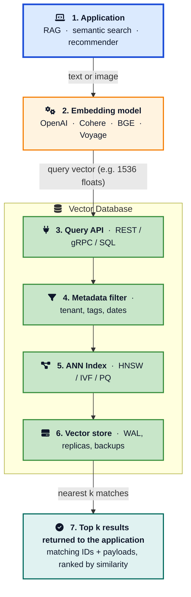
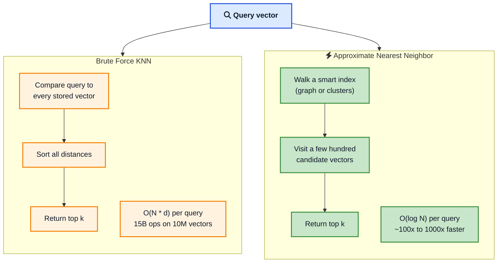
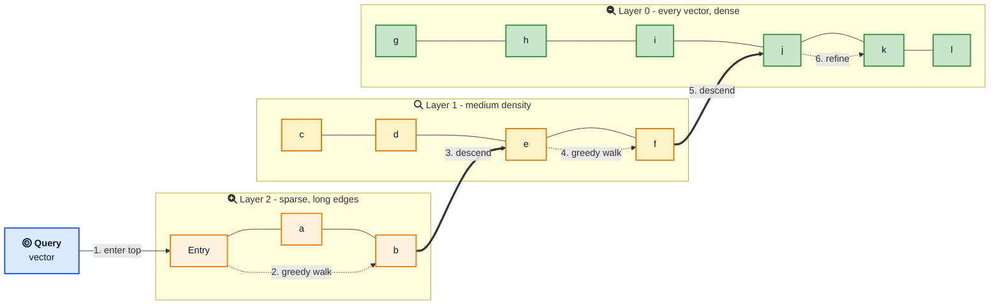
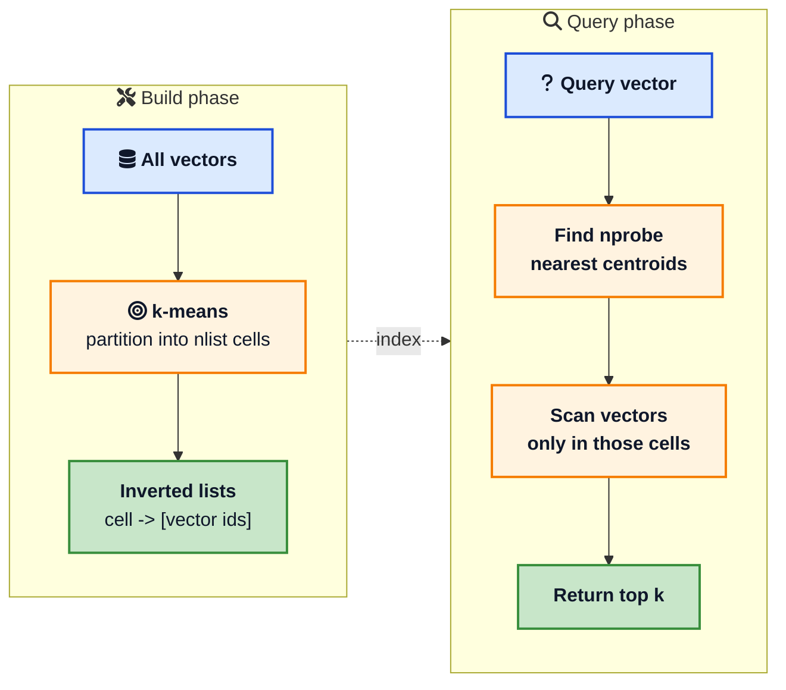
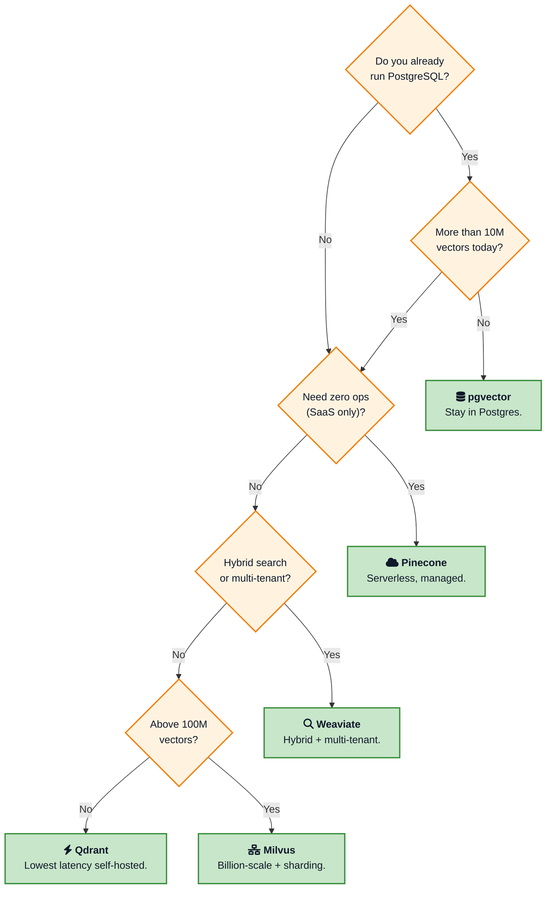

A few years ago, "find similar things" meant writing custom Lucene queries or stitching together a recommendation pipeline. Today it usually means one HTTP call to a vector database, and the answer comes back in single-digit milliseconds even when you are searching across hundreds of millions of items.

Almost every interesting AI product in 2026 leans on a vector database somewhere in its stack. [RAG systems](/building-your-first-rag-application/){:target="_blank" rel="noopener"} use them to ground LLM answers in your own documents. Recommendation engines use them to find items with similar embeddings. Anti-fraud systems use them to spot transactions that look statistically alike. Internal "search" features over Slack, Notion, and email are now nearly always vector based.

This post is a deep dive into how they actually work. Not a marketing comparison. We will look at the math, the indexes, the architecture, and the trade-offs that decide whether your **vector search** stays at 5 milliseconds or balloons to 500.

If you have not built a [RAG application](/building-your-first-rag-application/){:target="_blank" rel="noopener"} yet, that post is the gentler on-ramp. This one assumes you have at least called an embedding API once and want to know what happens after the vectors leave your service.

> **TL;DR**: A vector database stores embeddings and answers nearest neighbor queries with an ANN index, usually HNSW or IVF, plus metadata filtering and persistence. Exact KNN is too slow above a few hundred thousand vectors, so you accept a small recall loss for huge speedups. Memory matters more than CPU. Hybrid search beats pure vector search. Pick pgvector unless you have measured a reason not to.

## What Is a Vector Database, Precisely?

The phrase "vector database" gets used loosely. Let us nail it down.

A **vector database** is a system that stores high-dimensional vectors and answers two kinds of queries efficiently:

1. **Nearest neighbor**: given a query vector, return the `k` stored vectors closest to it under some distance metric.
2. **Filtered nearest neighbor**: same as above, but only consider vectors whose metadata matches a predicate (e.g. `tenant_id = 42 AND created_at > '2026-01-01'`).

Around that core it provides the things you expect from a database: durability, replication, an API, authentication, backups, and a way to update or delete vectors as your data changes.



The interesting parts are the **ANN index** and the **metadata filter** that runs alongside it. Everything else is engineering you would expect from any modern database.

A useful way to think about it: a vector database is a search engine where the document is a point in 1024-dimensional space and "relevance" means "geometrically close." The full taxonomy comparison appears in the [PractiqAI overview](https://practiqai.com/blog/vector-databases-what-why-when){:target="_blank" rel="noopener"}.



## Embeddings: The Currency of Vector Search

Before any of this matters, you need vectors. Vectors come from **embedding models**.

An embedding model takes raw input (text, image, audio) and returns a fixed-length array of floats. Modern models output anywhere from 384 (small open-source models like `all-MiniLM-L6-v2`) to 4096 (`text-embedding-3-large`) dimensions per vector.

The key property: **semantically similar inputs produce geometrically similar vectors**.

```python
from openai import OpenAI
client = OpenAI()

def embed(text: str) -> list[float]:
    resp = client.embeddings.create(
        input=text,
        model="text-embedding-3-small",
    )
    return resp.data[0].embedding

v1 = embed("How do I cancel my subscription?")
v2 = embed("Where can I unsubscribe from the service?")
v3 = embed("Why is the sky blue?")
```

`v1` and `v2` will sit close to each other in vector space; `v3` will be far away. That is the whole game. Every clever index in the rest of this post is just a way to find that closeness fast.

A few practical notes that bite developers in production:

- **Dimensionality**: more dimensions usually means better quality but quadratically more memory. A million 1536-dim vectors is roughly 6 GB of float32 data; a million 3072-dim vectors is 12 GB. Pick the smallest model that gives acceptable retrieval quality.
- **Same model on both sides**: if you embed documents with `text-embedding-3-small` and queries with `text-embedding-3-large`, similarity scores are meaningless. The two models do not share a vector space.
- **Normalization**: many models, including OpenAI's, return vectors normalized to unit length. That makes cosine similarity equal to dot product, which is faster to compute.

For more on what embeddings are doing under the hood, see [How LLMs Generate Text](/how-llms-generate-text/){:target="_blank" rel="noopener"}, which explains why the same neural network that predicts the next token also gives you a meaningful representation of meaning.

## Distance Metrics: Pick the Right Yardstick

You cannot do nearest neighbor search without a definition of "near." Vector databases support a handful of metrics. The four you will actually use are:

| Metric | Formula (informal) | Good for |
|--------|-------------------|----------|
| **Cosine similarity** | angle between vectors | Text embeddings (OpenAI, Cohere, Voyage, BGE) |
| **Dot product** | sum of element-wise products | Normalized text vectors, recommender systems |
| **Euclidean (L2)** | straight-line distance | Image embeddings, spatial data |
| **Manhattan (L1)** | sum of absolute differences | Sparse vectors, some bio-info applications |

The single most important rule: **use the metric the embedding model was trained with**. The model card tells you. Mismatched metrics are a common cause of "my retrieval quality is terrible" tickets.

For unit-normalized vectors, cosine and dot product produce the same ranking, but dot product is usually faster because there is no division. Many production systems normalize all vectors at write time and switch to dot product for the speed.

## Why You Cannot Just Loop Over Every Vector

The naive solution to nearest neighbor is brute force: compute the distance from the query to every stored vector and sort.

```python
def brute_force_knn(query, vectors, k=10):
    scored = [(i, dot(query, v)) for i, v in enumerate(vectors)]
    scored.sort(key=lambda x: -x[1])
    return scored[:k]
```

This is exact. It is also catastrophically slow at scale. With one million 1536-dimensional vectors and float32 storage, a single query touches **6 GB of memory and roughly 1.5 billion floating point operations**. At ten million vectors you are at 15 billion ops per query. There is no SIMD trick that saves you.

Real systems give up on exact answers and use **approximate nearest neighbor (ANN)** algorithms instead. ANN trades a small recall loss (typically 95 to 99 percent of the true top-k) for huge speedups, often 100x to 1000x. The classic [ann-benchmarks project](https://ann-benchmarks.com/){:target="_blank" rel="noopener"} maintained by Erik Bernhardsson is the place to see how the algorithms compare on real datasets.



The rest of the engineering inside a vector database is essentially "which clever ANN index do we use, and how do we keep it fast as data grows?"





## <i class="fas fa-project-diagram"></i> HNSW: The Default Index Almost Everywhere

If you remember one acronym from this post, make it HNSW. Hierarchical Navigable Small World is the default index in **pgvector, Qdrant, Weaviate, Milvus, Pinecone, and Chroma**. It dominates because it is fast, has good recall, supports incremental inserts, and works well with metadata filters.

The original 2016 paper by Malkov and Yashunin, [Efficient and robust approximate nearest neighbor search using Hierarchical Navigable Small World graphs](https://arxiv.org/abs/1603.09320){:target="_blank" rel="noopener"}, is dense but readable. The intuition is much simpler than the math.

### How HNSW Works

Imagine drawing a graph where each vector is a node and edges connect "nearby" vectors. A naive graph would have you walk forever before finding the closest neighbor. HNSW fixes this with two ideas borrowed from skip lists and from small world networks.

1. **Multiple layers**. The bottom layer (layer 0) contains every vector with dense local connections. Each higher layer is a sparser sample of the layer below, with longer-range edges that span the dataset.
2. **Greedy descent**. A search starts at a fixed entry point in the top layer. At each layer it greedily moves to the neighbor closest to the query, until no neighbor is closer. Then it drops down a layer and repeats. The top layers act like an index that gets you to the right region; the bottom layer refines.



The result: search complexity is roughly **O(log N)** even on hundreds of millions of vectors. On a single core, modern HNSW implementations hit sub-millisecond query times for datasets up to ten million 1024-dim vectors with 95+ percent recall.

### HNSW Parameters You Will Actually Tune

There are three parameters that matter, and they are exposed in pgvector, Qdrant, Weaviate, and every other implementation under similar names:

- **`M`**: number of neighbors each node keeps. Higher means a denser graph, better recall, more memory. Defaults are 16 (pgvector) to 32. Raise to 32 to 64 for high-recall workloads.
- **`ef_construction`**: candidate list size during index build. Higher means a slower build but a better graph. Common values are 64 to 200.
- **`ef_search`** (also called `ef`): candidate list size during query. The single most important runtime tuning knob. Higher means slower queries but better recall. Typical values are 40 to 400.

You almost never need to invent these from scratch. The defaults are good. Tune `ef_search` based on the latency-recall trade-off your product can tolerate.

### The Catch: HNSW Wants RAM

The HNSW graph has to live in memory for the layered walk to be fast. A million 1024-dim float32 vectors plus an HNSW graph with `M=32` is roughly 5 GB of RAM. At a hundred million vectors you are looking at half a terabyte. This is the single biggest reason teams move from pgvector or Qdrant to alternatives, or to Product Quantization (more on that below).

There is a well documented failure mode: if HNSW does not fit in memory, the database silently falls back to either a sequential scan or a much slower paged walk. The OneUptime guide on [implementing vector indexing](https://oneuptime.com/blog/post/2026-01-30-vector-indexing/view){:target="_blank" rel="noopener"} has a good account of this trap. Always size your instance for the index, not just the data.

## <i class="fas fa-layer-group"></i> IVF: The Memory-Friendly Alternative

The other big algorithm is **IVF**, short for Inverted File Index. It is older and conceptually simpler than HNSW.

The idea: cluster your vectors with k-means into `nlist` cells. For each cell, store the centroid and the list of vectors that belong to it. At query time, find the closest centroids (the `nprobe` parameter controls how many) and only scan vectors inside those cells.



A million vectors split into a thousand cells, with `nprobe=10`, means each query scans roughly 1 percent of the data. That is the speedup.



### When IVF Wins

- **Memory pressure**. The index itself is tiny: just `nlist` centroids. The vectors live wherever you want them, including SSD or object storage with a thin in-memory cache.
- **Hundreds of millions of vectors**. HNSW works at this scale only with a lot of RAM and careful sharding. IVF degrades more gracefully.
- **Cold or skewed access patterns**. If most queries hit a small subset of cells, the working set in memory stays small.

### When IVF Hurts

- **Recall is sensitive to cluster quality**. If your data drifts after the index is built, the centroids stop representing the data and recall drops. You need to rebuild the index periodically.
- **`nprobe` tuning is non-obvious**. Too low and you miss results; too high and you burn through the speedup. Most teams end up writing a small benchmark script.
- **Inserts are awkward**. IVF assumes the centroid layout is fixed. Inserting a wildly out-of-distribution vector lands it in the closest cell even if it is far away.

The Milvus reference [How does indexing work in a vector DB (IVF, HNSW, PQ, etc.)](https://milvus.io/ai-quick-reference/how-does-indexing-work-in-a-vector-db-ivf-hnsw-pq-etc){:target="_blank" rel="noopener"} is a good companion if you want to see the variants (IVF-Flat, IVF-SQ, IVF-PQ) side by side.

## <i class="fas fa-compress"></i> Product Quantization: Squeeze the Vectors

Both HNSW and IVF still store the original float32 vectors somewhere. **Product Quantization (PQ)** attacks that storage cost directly.

The trick: split each vector into `m` sub-vectors, run k-means on each sub-space with `2^k` centroids, then represent each sub-vector by the centroid index. A 1024-dim float32 vector is normally 4 KB. With PQ at `m=32, k=8` you store 32 bytes per vector. That is **128x compression**.

You lose precision: distances are estimated from the centroid lookup tables instead of computed exactly. But for nearest neighbor ranking you usually do not need exact distances; you need the right *order*. PQ gives you that with controlled accuracy loss.

In practice you combine PQ with one of the indexes:

- **IVF-PQ**: cluster, then quantize each vector inside its cell. The default scale-out choice in FAISS and Milvus.
- **HNSW-PQ**: HNSW graph plus PQ-compressed vectors. Used by Qdrant and recent versions of pgvector via [pgvectorscale](https://github.com/timescale/pgvectorscale){:target="_blank" rel="noopener"}.

PQ is what makes billion-vector indexes feasible on a single beefy machine. Pinecone's serverless tier and most large RAG deployments are running PQ under the hood whether you know it or not.


## Anatomy of a Modern Vector Database

Now that the index pieces are clear, here is how a real vector database puts them together. The exact split varies, but every modern system has these layers.

```mermaid
flowchart TB
    subgraph API["fa:fa-plug API Layer"]
        REST["<b>REST / gRPC</b><br/>insert, query, delete"]
        SDK["<b>Client SDKs</b><br/>Python, JS, Go"]
    end

    subgraph Query["fa:fa-cogs Query Engine"]
        Plan["<b>Query planner</b><br/>filter first or filter after?"]
        Filter["<b>Metadata filter</b><br/>tags, dates, tenant"]
        Hybrid["<b>Hybrid scorer</b><br/>BM25 + vector"]
        Rerank["<b>Reranker hook</b><br/>cross-encoder, ColBERT"]
    end

    subgraph Index["fa:fa-project-diagram Index Engine"]
        HNSW["<b>HNSW graph</b><br/>or IVF buckets"]
        PQ["<b>PQ codes</b><br/>compressed vectors"]
    end

    subgraph Storage["fa:fa-hdd Storage Layer"]
        WAL["<b>Write-Ahead Log</b><br/>durability"]
        Vec["<b>Vector + payload<br/>columnar files</b>"]
        Meta["<b>Metadata B-tree</b><br/>for filters"]
    end

    subgraph Cluster["fa:fa-network-wired Cluster Layer"]
        Shard["<b>Sharding</b><br/>by tenant or hash"]
        Repl["<b>Replication</b><br/>followers, raft"]
        Snap["<b>Snapshots</b><br/>backup + restore"]
    end

    API --> Query
    Query --> Index
    Index --> Storage
    Storage --> Cluster

    classDef boxBlue fill:#dbeafe,stroke:#1d4ed8,stroke-width:2px,color:#0f172a
    classDef boxOrange fill:#fff3e0,stroke:#f57c00,stroke-width:2px,color:#0f172a
    classDef boxGreen fill:#c8e6c9,stroke:#388e3c,stroke-width:2px,color:#0f172a
    classDef boxTeal fill:#e0f2f1,stroke:#00695c,stroke-width:2px,color:#0f172a

    class REST,SDK boxBlue
    class Plan,Filter,Hybrid,Rerank boxOrange
    class HNSW,PQ boxGreen
    class WAL,Vec,Meta boxTeal
    class Shard,Repl,Snap boxBlue
```



A few things in that diagram are worth pulling apart, because they are where teams spend most of their debugging time.

### Metadata Filtering: Pre vs Post

You almost never search the whole corpus. You search "documents owned by this tenant created in the last 30 days." Whether the database applies that filter **before** running the ANN search (pre-filtering) or **after** (post-filtering) changes everything.

- **Post-filtering** is easy to implement: do the ANN search, then drop results that fail the predicate. The problem is recall: if your filter is selective, you might filter out all the top-k matches and return very few results.
- **Pre-filtering** is harder: you need an index that can constrain the ANN walk to only nodes matching the predicate. Qdrant pioneered serious pre-filtering with payload indexes; pgvector relies on Postgres' regular B-tree indexes combined with HNSW.

If you have selective filters (tenant, time window, status) you want a database that does pre-filtering well. This is where Qdrant and Weaviate often pull ahead of vanilla pgvector for production RAG, as the [knowsync benchmarks](https://www.knowsync.ai/blog/choosing-vector-database-qdrant-pinecone-pgvector-2026){:target="_blank" rel="noopener"} show.

### Hybrid Search: Vector Plus Keyword

Pure vector search is great at fuzzy, intent-driven queries ("how do I reset my password"). It is bad at queries that include exact tokens, identifiers, or rare proper nouns ("invoice INV-2026-04781"). Real search traffic is a mix of both.

Hybrid search runs a **dense vector search** and a **sparse keyword search (BM25)** in parallel, then combines the rankings (typically with Reciprocal Rank Fusion). Almost every production RAG system ends up here. Weaviate ships hybrid search as a first-class feature; Qdrant added sparse vector support in 2025; pgvector users typically combine vector search with the built-in `ts_vector` full-text index.

The same pattern shows up in non-AI search engines, by the way. The architecture you would use for [How the X (Twitter) For You Algorithm Works](/system-design/x-twitter-for-you-algorithm/){:target="_blank" rel="noopener"} blends vector and keyword signals exactly like this.

### Reranking: The Last 20 Percent of Quality

The ANN index returns "approximately the top 50" by vector distance. A **reranker** takes those 50 and rescores them with a more expensive model (usually a small cross-encoder or a ColBERT-style late-interaction model). It is slow (a few hundred milliseconds for 50 documents) but it routinely lifts retrieval quality by 10 to 30 percent. Production RAG systems often run the cheap ANN call first, then rerank, then send only the top 5 to the LLM. We covered the practical wiring of this in the [RAG application post](/building-your-first-rag-application/){:target="_blank" rel="noopener"}.

## The Vector Database Landscape in 2026

Here is the field as it actually shapes up today, with the strengths and trade-offs that matter for engineering decisions. This is a living space; check vendor docs for the latest numbers.

### pgvector

A PostgreSQL extension that adds a `vector` column type and HNSW + IVFFlat indexes. Open source, maintained by Andrew Kane. The [pgvector GitHub repo](https://github.com/pgvector/pgvector){:target="_blank" rel="noopener"} is the reference.

**Why pick it**: you already run PostgreSQL. You get vector search, JOINs, transactions, backups, replication, point-in-time recovery, and one operational story for everything. The [Hugging Face benchmark](https://huggingface.co/blog/ImranzamanML/pgvector-vs-elasticsearch-vs-qdrant-vs-pinecone-vs){:target="_blank" rel="noopener"} shows pgvector beating the cloud-managed options on many local-deployment metrics for small to medium datasets.

**Why think twice**: above 10 million vectors with high QPS you start to feel Postgres' single-writer architecture. You can extend it with [pgvectorscale](https://github.com/timescale/pgvectorscale){:target="_blank" rel="noopener"} from Timescale, which adds StreamingDiskANN and label-based filtering. Beyond that you are looking at sharding, which is where dedicated vector databases shine.

For a deeper look at how Postgres itself executes queries, the [PostgreSQL Internals deep dive](/postgresql-internals-how-queries-execute/){:target="_blank" rel="noopener"} covers the planner, executor, MVCC, and WAL that pgvector builds on.

### Qdrant

A purpose-built vector database written in Rust. Open source, single binary, very fast. The [Qdrant docs](https://qdrant.tech/documentation/){:target="_blank" rel="noopener"} are excellent.

**Why pick it**: best-in-class latency, strong pre-filtering, payload indexes for arbitrary metadata, sparse vectors, and a clean API. Single Rust binary that you can run anywhere from a Raspberry Pi to a cluster.

**Why think twice**: it is a separate system to operate. The hosted Qdrant Cloud is solid but newer than competitors.

### Pinecone

The original commercial vector database. Fully managed, no self-hosted option. See [Pinecone docs](https://docs.pinecone.io/){:target="_blank" rel="noopener"}.

**Why pick it**: zero operational overhead, predictable scaling, deep integration with every LLM framework. Their serverless tier separates compute from storage so cost scales with usage, not with provisioned capacity.

**Why think twice**: cost. Independent benchmarks consistently show 3x to 8x higher cost per QPS than self-hosted alternatives. You cannot bring it on-prem.

### Weaviate

Open source vector database with strong hybrid search and a clean GraphQL API. The [Weaviate docs](https://weaviate.io/developers/weaviate){:target="_blank" rel="noopener"} are well organised.

**Why pick it**: best-in-class hybrid search, multi-tenancy, modules for in-database generation (call an LLM right from the query). Schema-driven approach feels familiar to engineers coming from traditional databases.

**Why think twice**: heavier operational footprint than Qdrant. The GraphQL API can be either a feature or a learning curve depending on your team.

### Milvus

The big-data option. Open source, with managed [Zilliz Cloud](https://zilliz.com/){:target="_blank" rel="noopener"} on top. Designed for billion-scale workloads.

**Why pick it**: it scales further than anything else in this list. Decoupled compute and storage, GPU acceleration, multiple index types, and serious sharding. The [Milvus architecture overview](https://milvus.io/docs/architecture_overview.md){:target="_blank" rel="noopener"} is worth reading even if you do not pick it, because it shows what a "real" distributed vector database looks like.

**Why think twice**: complexity. Below ~100M vectors you are paying operational cost for capacity you do not need.

### Chroma

The "first vector database you should try" option. Open source, embedded or client-server, ergonomic Python API. The [Chroma docs](https://docs.trychroma.com/){:target="_blank" rel="noopener"} are short and friendly.

**Why pick it**: prototypes, notebooks, small RAG apps. You can be searching in 10 lines of code.

**Why think twice**: not designed for high-QPS production workloads. Once you outgrow it, migrate.

### FAISS

Not a database, a [library from Meta](https://github.com/facebookresearch/faiss){:target="_blank" rel="noopener"}. The grandparent of most modern indexes; HNSW, IVF-PQ, and the rest are all available as FAISS modules. Use it inside your service if you want full control and your corpus is static.

### Honourable Mentions

- [Elasticsearch](https://www.elastic.co/guide/en/elasticsearch/reference/current/dense-vector.html){:target="_blank" rel="noopener"} added native dense vector support and HNSW indexes in 8.x. Worth considering if you already run Elastic for logs or full-text search.
- [Redis Stack](https://redis.io/docs/latest/develop/interact/search-and-query/){:target="_blank" rel="noopener"} ships with a vector search module. Low latency, in-memory only. Fits naturally if you are already using Redis as a cache. We compared the wider Redis ecosystem in [Redis vs DragonflyDB vs KeyDB](/redis-vs-dragonflydb-vs-keydb/){:target="_blank" rel="noopener"}.
- [LanceDB](https://lancedb.com/){:target="_blank" rel="noopener"} stores vectors in columnar Lance files on object storage. Interesting for "data lake plus vectors" use cases.

## Performance: What the Real Numbers Look Like

The honest answer to "how fast is a vector database" is "it depends on M, ef_search, recall target, dataset size, vector dimension, and whether the index fits in RAM." But ballpark numbers are useful for capacity planning.

These numbers are aggregated from the [CallSphere 2026 benchmarks](https://callsphere.ai/blog/vector-database-benchmarks-2026-pgvector-qdrant-weaviate-milvus-lancedb){:target="_blank" rel="noopener"}, the [TokenMix 2026 comparison](https://tokenmix.ai/blog/vector-database-2026-pinecone-weaviate-qdrant-milvus){:target="_blank" rel="noopener"}, and [ann-benchmarks](https://ann-benchmarks.com/){:target="_blank" rel="noopener"}. They will be slightly off for your workload; treat them as starting estimates, not promises.

| Database | p50 latency (1M vectors, 768 dim, top-10) | Throughput per node | Notes |
|----------|------------------------------------------:|--------------------:|-------|
| pgvector (HNSW) | ~5 to 20 ms | ~1k QPS | Local Postgres, M=16, ef_search=80 |
| Qdrant (self-hosted) | ~2 to 10 ms | ~12k QPS | Default HNSW, in-memory |
| Weaviate | ~10 ms | ~4k QPS | Default HNSW |
| Milvus | ~5 ms | ~8k QPS | IVF-PQ for cost or HNSW for latency |
| Pinecone (serverless) | ~8 to 50 ms | depends on tier | Includes network round trip |

Two patterns repeat across every benchmark you will read:

1. **Self-hosted beats managed on raw latency**, mostly because there is no internet round trip. Managed wins on operational cost.
2. **At ten million vectors and below**, the choice barely matters for query speed. It matters for memory, for cost, and for whether you have to babysit a separate system.



## Common Pitfalls Production Teams Hit

These are the issues that show up over and over in vector database support channels.


### 1. Embedding Drift After a Model Upgrade

You upgrade from `text-embedding-ada-002` to `text-embedding-3-small`. The new vectors live in a different space. Old documents get garbage similarity scores against new queries. The fix is brutal but unavoidable: re-embed everything. Plan for this. Keep a `model_version` column on every vector and run dual-write or backfill jobs when you bump models.

### 2. Memory Surprises

The vectors fit in RAM. The HNSW graph does not. The whole index falls back to a slow path and your p99 latency spikes from 8 ms to 800 ms. Always size for `data + index + filter index + headroom`. Run `pg_stat_statements` or your vendor's equivalent to confirm you are hitting the index, not scanning.

### 3. Pure Vector Search for Queries That Need Keywords

Users will type SKUs, error codes, ticket numbers, and rare names. These are exactly the queries vector search is bad at. Add hybrid search before users complain. The pattern is well documented in any modern [Building Code Review Assistant with LLMs](/building-code-review-assistant-with-llms/){:target="_blank" rel="noopener"} or RAG case study.

### 4. Filtering After Search

`top_k=10` plus a tenant filter that matches 1 percent of your data means you might return zero rows. Always pre-filter when possible, or oversample and then filter (e.g. `top_k=200, filter, return 10`). This is the single most common cause of "the bot says it cannot find anything" tickets.

### 5. Forgetting Backups

Vector databases are databases. They need backups, snapshots, point-in-time recovery, and a documented restore procedure. The number of teams running self-hosted Qdrant or Milvus with zero backups is alarming. The fact that the data is "just embeddings you can recompute" is true until your embedding pipeline depends on a model that has been deprecated.

### 6. Ignoring Cost of Recompute

Re-embedding 100 million chunks at OpenAI rates is expensive. Cache aggressively. Store embeddings keyed by content hash so you never pay twice for the same chunk. The same cost discipline from [Building Your First LLM Application](/building-your-first-llm-application/){:target="_blank" rel="noopener"} applies here at much larger scale.

### 7. Using a Vector Database for Things It Is Not Good At

Vector databases are not a good fit for:

- **Exact lookups by ID** (use a regular KV store).
- **Range queries on metadata only** (use Postgres or your existing OLTP database).
- **Time series** (use TimescaleDB, ClickHouse, or InfluxDB).
- **Strong consistency across vectors and relational data** (use pgvector inside the same Postgres).

Vector search is a hammer. Not every problem is a nail.

## How Vector Databases Compare to the Databases You Already Know

If you have read [PostgreSQL vs MongoDB vs DynamoDB](/postgresql-vs-mongodb-vs-dynamodb/){:target="_blank" rel="noopener"}, the pattern of trade-offs will feel familiar. Here is where vector databases sit alongside the rest.

| Aspect | Vector DB | PostgreSQL | MongoDB | Elasticsearch |
|--------|-----------|-----------|---------|--------------|
| Primary access pattern | Nearest neighbor search | Relational + indexed lookup | Document fetch | Full-text + filters |
| Index type | HNSW / IVF / PQ | B-tree, GIN, BRIN | B-tree | Inverted index + HNSW |
| Update model | Append, occasional rebuild | MVCC | Versioned writes | Segment merges |
| Consistency | Usually eventual within shard | Strong (single node) | Tunable | Near real-time |
| Cost dominated by | Memory for index | Disk + connections | Memory + IO | Heap + disk |

For more on how the underlying B-tree and index structures work in traditional engines, the [Database Indexing Explained](/database-indexing-explained/){:target="_blank" rel="noopener"} post is the right companion read. The mental shift with vector databases is that you no longer pick "which column to index"; you pick "which embedding to compute and which ANN algorithm to use."

## A Decision Framework: Picking Your Vector Database

You do not need a 50-row scoring matrix. Three questions get you 90 percent of the way to a decision.



This flowchart is opinionated, not gospel. It works because the industry has converged on a small set of clear sweet spots:

- pgvector wins on operational simplicity for teams under 10M vectors.
- Pinecone wins on "I do not want to think about it."
- Weaviate wins on hybrid search and multi-tenant SaaS workloads.
- Qdrant wins on self-hosted latency and filtering.
- Milvus wins when you cross the billion mark.

If you are building an [AI agent](/building-ai-agents/){:target="_blank" rel="noopener"} or a [code review assistant](/building-code-review-assistant-with-llms/){:target="_blank" rel="noopener"} on top of your codebase, you are almost certainly in pgvector or Qdrant territory. Most teams never need to leave.

## Practical Lessons for Software Developers

Spend long enough operating any vector database and the same lessons keep appearing. Worth committing them to muscle memory.

### Start With Postgres, Move When You Have a Reason

The "nobody got fired for choosing Postgres" rule applies here too. pgvector is good enough for the first 10M vectors and removes a category of operational complexity. Move only when you can point to a specific bottleneck.

### Always Measure Recall and Latency Together

Vendor benchmarks show "12,000 QPS." At what recall? On what dataset? Always measure both numbers on **your data** with **your queries**. The [ann-benchmarks](https://ann-benchmarks.com/){:target="_blank" rel="noopener"} methodology is the gold standard.

### Cache Embeddings Forever

Embedding API calls cost real money and add latency. Hash content, keep a `(content_hash, model, embedding)` table, and only call the embedding API on cache misses. Re-use across documents wherever possible.

### Treat the Index as a Build Artifact

For large datasets, a full HNSW build can take hours. You do not want to discover that mid-incident. Run periodic builds in CI or a batch job, store the resulting index in object storage, and have a documented procedure to load it into a fresh instance.

### Filter Before Vector Search When Possible

If a filter is selective (one tenant out of thousands), pre-filtering a million vectors down to a few thousand and then running brute-force search is often faster than running ANN over the whole index and filtering after. Modern Qdrant, Weaviate, and pgvector with [pgvectorscale](https://github.com/timescale/pgvectorscale){:target="_blank" rel="noopener"} all do this automatically when the cost model says so.

### Add Hybrid Search Early

It is rarely worth shipping pure vector search. Add a BM25 score from day one and combine with reciprocal rank fusion. The first time a user types a SKU and gets the right document, you will know it was the right call.

### Monitor What Actually Matters

For each vector query, log: recall (against a periodic ground truth set), p50 and p99 latency, candidate count returned, filter selectivity, and whether the index was used. The metrics you cared about for [observability](/opentelemetry-production-guide/){:target="_blank" rel="noopener"} apply directly: traces, latency histograms, and structured logs.

### Plan for Multi-Tenancy From the Start

If you are building SaaS, every vector should carry a `tenant_id` and every query must filter by it. Get this wrong and you ship the worst kind of data leak: one customer seeing semantic neighbors of another customer's content. Use a database that supports multi-tenant collections natively (Weaviate) or enforce it rigorously at the application layer.

## Where Vector Databases Are Heading

A few real shifts to watch over the next year:

- **Tighter integration with relational stores**. pgvectorscale, MongoDB Atlas Vector Search, and SingleStore are blurring the line. The "have one database for everything" pitch is back.
- **Object-storage-backed indexes**. LanceDB, Turbopuffer, and Pinecone serverless all push the data to S3 and keep only a hot working set in memory. Cost drops, cold-query latency rises. This is the same architectural shift that changed analytics databases a decade ago.
- **Native sparse vectors**. Pure dense retrieval has hit a quality plateau. Learned sparse models (SPLADE, ColBERT) and hybrid scoring are showing up as first-class features in Qdrant, Weaviate, and Vespa.
- **Built-in RAG primitives**. Vector databases are starting to ship rerankers, chunkers, and even direct LLM call pipelines. Useful for prototyping, risky if it locks you in. The [Model Context Protocol](/model-context-protocol-mcp-explained/){:target="_blank" rel="noopener"} is moving in the opposite direction: making everything pluggable.

## Wrapping Up

A vector database is a search engine for high-dimensional spaces. Underneath the API there is one of two algorithms doing most of the work: a layered graph (HNSW) or a clustered index (IVF), often combined with product quantization to fit in memory. Around that index sits the same kind of engineering you would build for any database: filters, persistence, replication, and an API.

If you understand what HNSW is doing on every query and why pre-filtering matters, you already know more than most engineers shipping RAG systems in production. The names of the products will keep changing. The math underneath does not.

Start with pgvector or Chroma. Add hybrid search early. Reach for Qdrant, Pinecone, Weaviate, or Milvus when you have measured a real reason. And whatever you pick, keep your embedding pipeline reproducible and your ground-truth evaluation set sharp. Those two habits are worth more than any vendor choice.

---

**Related Posts:**

- [Building Your First RAG Application](/building-your-first-rag-application/){:target="_blank" rel="noopener"} - The end-to-end RAG tutorial that uses everything in this post
- [Building Your First LLM Application](/building-your-first-llm-application/){:target="_blank" rel="noopener"} - Foundations for any AI app: backend, memory, LLM calls
- [Context Engineering](/context-engineering/){:target="_blank" rel="noopener"} - How to decide what to put in front of the model
- [Database Indexing Explained](/database-indexing-explained/){:target="_blank" rel="noopener"} - B-tree, hash, GIN, BRIN, and where vector indexes fit
- [PostgreSQL Internals: How Queries Execute](/postgresql-internals-how-queries-execute/){:target="_blank" rel="noopener"} - The engine pgvector runs on
- [PostgreSQL vs MongoDB vs DynamoDB](/postgresql-vs-mongodb-vs-dynamodb/){:target="_blank" rel="noopener"} - Where each store fits, and how vector DBs compare
- [How LLMs Generate Text](/how-llms-generate-text/){:target="_blank" rel="noopener"} - Why embeddings carry meaning in the first place
- [Building AI Agents](/building-ai-agents/){:target="_blank" rel="noopener"} - Agents that retrieve and reason over your vectors
- [Prompt Injection Explained](/prompt-injection-explained/){:target="_blank" rel="noopener"} - Your retrieval corpus is an attack surface

*Further reading: the original [HNSW paper](https://arxiv.org/abs/1603.09320){:target="_blank" rel="noopener"} by Malkov and Yashunin, the [pgvector source on GitHub](https://github.com/pgvector/pgvector){:target="_blank" rel="noopener"}, the [FAISS wiki](https://github.com/facebookresearch/faiss/wiki){:target="_blank" rel="noopener"} for index implementations, the [Qdrant documentation](https://qdrant.tech/documentation/){:target="_blank" rel="noopener"}, the [Milvus architecture overview](https://milvus.io/docs/architecture_overview.md){:target="_blank" rel="noopener"}, and the [ann-benchmarks](https://ann-benchmarks.com/){:target="_blank" rel="noopener"} project for honest performance numbers.*
