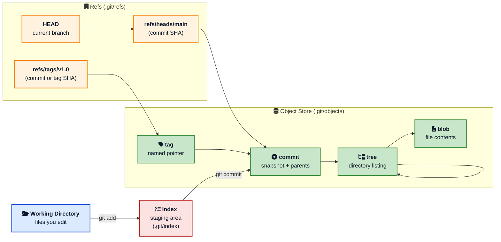
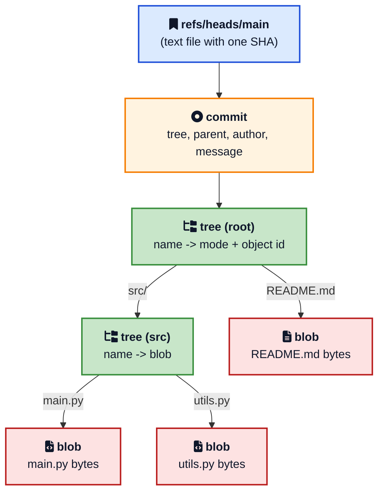
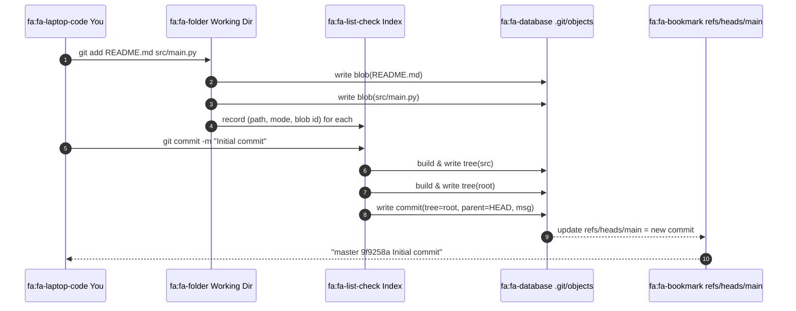
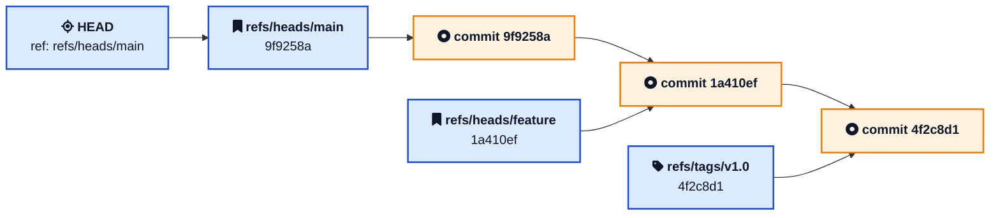
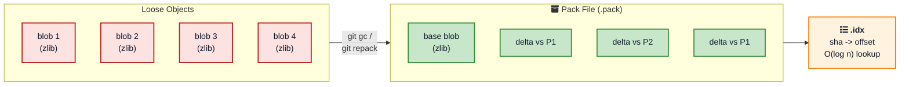
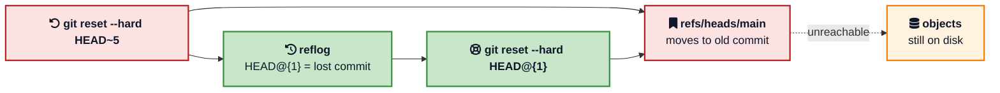

If you have used Git for years you have run thousands of `git add`, `git commit`, and `git push` commands without thinking about what is happening on disk. The commit returns. The branch points at the new SHA. The push succeeds. It feels like magic.

It is not magic. Git is one of the cleanest pieces of software ever shipped, and underneath the noisy CLI it is just a small key-value database with four object types, a few text files, and a smart compression strategy. Once you know the parts, a lot of things stop being scary: detached HEAD, lost commits after a bad reset, weird merge conflicts, why a repo gets huge after committing one big binary. All of them have mechanical answers once you see the storage model.

This post is a tour of **how Git stores data internally**, written for developers who want a working mental model. We will start with the `.git` folder, look at every object type by hand, follow a `git add` and `git commit` through the system, then climb into pack files, garbage collection, and the SHA-1 to SHA-256 transition.

If you want a refresher on commands first, the [Git cheat sheet](/git-cheat-sheet/){:target="_blank" rel="noopener"} and [Git command line basics](/git-command-line-basics/){:target="_blank" rel="noopener"} have the syntax. If you want to know what happens after `git push` leaves your laptop, [How GitHub Stores and Serves Git Repositories](/how-github-stores-and-serves-git-repositories/){:target="_blank" rel="noopener"} picks up where this post ends.

## The 30 Second Picture

Before zooming in, here is the whole storage model on one slide.





Five things to lock in:

1. The **working directory** is the files you edit. The **index** is a binary file that says what the next commit will look like. The **object store** is the immutable database of everything Git has ever seen.
2. There are only **four object types**: blob, tree, commit, tag.
3. Every object is named by the **SHA-1 hash** of its content. Same content, same name, stored once.
4. **Refs** (branches, tags, HEAD) are tiny text files that point at object hashes. They are the only mutable thing in Git.
5. Loose objects on disk are eventually packed into **pack files** with delta compression for efficiency.

Everything below is just zooming into one of those boxes.

## What Lives Inside the .git Folder

When you run `git init`, Git creates one folder. That folder is your entire repository. The files you see in your editor are a checkout of one snapshot from that folder.

```
.git/
  HEAD              symbolic ref to current branch
  config            local configuration
  description       used by gitweb
  hooks/            client-side hook scripts
  info/             auxiliary info, like exclude patterns
  index             binary file: the staging area
  objects/          the object database
    pack/           pack files and indexes
    info/           pack listing files
    ab/             first two hex chars of object hashes
      cdef...       loose object file
  refs/
    heads/          branches
    tags/           tags
    remotes/        remote tracking branches
  packed-refs       (optional) single file with packed refs
  logs/             reflog data
```

Three of these matter the most:

- **`objects/`** is the database. Every commit, tree, blob, and annotated tag you ever made lives here.
- **`refs/`** is where the labels are. Branches and tags are just text files with one hash inside.
- **`HEAD`** is your current location. It usually says `ref: refs/heads/main`, which means you are on the branch called `main`.

You can run a few commands and see this with your own eyes. The output below is from a tiny demo repo with one commit.

```bash
$ ls -la .git
HEAD
config
description
hooks/
info/
objects/
refs/

$ cat .git/HEAD
ref: refs/heads/main

$ cat .git/refs/heads/main
9f9258a8ffe4187f08a93bcba47784e07985d999

$ ls .git/objects
9f
67
4b
info
pack
```

That commit hash in `refs/heads/main` is the entire implementation of your `main` branch. Switching branches is a one-line file change. Creating a branch is creating a new one-line file. This is why Git branches are nearly free, and why a workflow like [trunk-based development](/feature-flags-guide/){:target="_blank" rel="noopener"} works so well on top of Git.

## Git Is a Content-Addressable Database

The single design choice that makes Git Git is **content addressing**. The address (filename) of an object is computed from its contents. Concretely, Git takes the object type, a space, the size, a null byte, and the raw bytes, and runs SHA-1 on the result.

```
hash = SHA-1("blob 13\0Hello, world!")
```

That is it. The hash is the name. The implications are quietly enormous.

- **Deduplication** is automatic. Two files with identical bytes produce the same hash, so they share one blob. A repo with one thousand identical license files stores exactly one blob.
- **Integrity** is built in. If a single byte of any object is corrupted on disk, the hash will not match and Git will refuse to use it.
- **Distribution** is trivial. Two repos can compare hashes to know exactly which objects each is missing without sending the contents.

This is the same design used by IPFS and a few other content-addressable systems, and it is closely related to the idea of a Merkle tree. Each commit hash in Git transitively covers the entire state of the project at that moment, so signing a commit signs the whole snapshot.

If you want to see this for yourself, [git hash-object](https://git-scm.com/docs/git-hash-object){:target="_blank" rel="noopener"} is the plumbing command that computes an object's SHA without storing it.

```bash
$ echo "Hello, world!" | git hash-object --stdin
af5626b4a114abcb82d63db7c8082c3c4756e51b
```

You can verify that the file format is exactly what was claimed:

```bash
$ printf "blob 14\0Hello, world!\n" | shasum
af5626b4a114abcb82d63db7c8082c3c4756e51b
```

(`printf` here adds the trailing newline that `echo` adds. The `14` is `len("Hello, world!\n")`.)

## The Four Object Types

Everything in Git is one of four object types. None of them know their own name on disk. The name is always the hash of their contents.



### Blob: The File Content

A blob is the rawest thing in Git. It is the bytes of a file with **no filename, no path, and no permissions**. The format on disk is:

```
blob <size>\0<bytes>
```

That entire string is zlib compressed and stored at `.git/objects/<first 2 hash chars>/<remaining 38>`.

```bash
$ git cat-file -t af5626b4a114abcb82d63db7c8082c3c4756e51b
blob

$ git cat-file -p af5626b4a114abcb82d63db7c8082c3c4756e51b
Hello, world!
```

Notice what is missing. There is no `README.md` in the blob. There is no `0644` mode. The blob does not know it is a README. That information lives one level up, in the tree.

### Tree: The Directory Listing

A tree object describes one directory. It is a list of entries, where each entry is `(mode, name, object id)`. The `object id` is either a blob (a file in this directory) or another tree (a subdirectory).

```
100644 blob af5626b4...   README.md
100644 blob 9b7a3c1a...   main.py
040000 tree 6b25cad8...   src
```

Modes are a small set:

- `100644` regular file
- `100755` executable file
- `120000` symbolic link
- `040000` subdirectory (tree)
- `160000` submodule (gitlink to another commit)

Trees are how Git stores directory hierarchy. To see a tree by hand:

```bash
$ git ls-tree HEAD
100644 blob af5626b4...   README.md
040000 tree 6b25cad8...   src
```

Or recursively:

```bash
$ git ls-tree -r HEAD
100644 blob af5626b4...   README.md
100644 blob 9b7a3c1a...   src/main.py
100644 blob 4f2c8d12...   src/utils.py
```

### Commit: The Snapshot Pointer

A commit is the smallest object. It contains:

- a single `tree` line pointing at the root tree of the project
- zero or more `parent` lines pointing at parent commits
- an `author` line with name, email, timestamp
- a `committer` line (often the same as author)
- a blank line
- the commit message

```bash
$ git cat-file -p HEAD
tree 4b825dc642cb6eb9a060e54bf8d69288fbee4904
parent 1a410efbd13591db07496601ebc7a059dd55cfe9
author Ajit Singh <jeetsingh.ajit@gmail.com> 1735689600 +0530
committer Ajit Singh <jeetsingh.ajit@gmail.com> 1735689600 +0530

Add greeting message
```

That is the entire commit. The tree line is the snapshot. There is no list of changed files in a commit object. When you run `git show` and see a diff, Git is computing it live by comparing the commit's tree to its parent's tree.

The first commit in a repo has no `parent` line. A merge commit has two (or more) `parent` lines, which is what makes the history a [directed acyclic graph (DAG)](/data-structures/graph/){:target="_blank" rel="noopener"} rather than a simple list.

### Tag: The Named Pointer (Annotated Only)

An annotated tag is a real object with the format:

```
object 9f9258a8...
type commit
tag v1.0.0
tagger Ajit Singh <jeetsingh.ajit@gmail.com> 1735689600 +0530

Release 1.0.0
```

It is essentially a signed or unsigned wrapper around another object, almost always a commit. **Lightweight tags** are not objects at all. They are just files in `.git/refs/tags/` containing one commit hash, exactly like a branch. The difference matters when you sign or annotate releases.



## How git add and git commit Actually Work

Now you have everything to read what these two commands do. Suppose your repo looks like this:

```
README.md
src/
  main.py
```

You run:

```bash
$ git add README.md src/main.py
$ git commit -m "Initial commit"
```

Here is what happens behind the scenes.



Step by step:

1. **`git add` writes blobs**. For each file you stage, Git computes the SHA-1 of its content, writes a zlib-compressed blob object under `.git/objects/`, and adds an entry to the binary `.git/index` file recording the file's mode, path, and the blob hash.
2. **The index is now a draft of the next commit**. You can keep staging more files, unstaging, modifying, and the index reflects the current draft.
3. **`git commit` builds tree objects from the index**. Git walks the index, builds one tree object per directory, and writes them into the object store. The root tree is the snapshot of the entire project.
4. **A commit object is written** with the root tree's hash, the current `HEAD` as parent, your author info, and your message. Its hash is computed and the object is stored.
5. **The current branch ref is updated** to point at the new commit hash. If you were on `main`, `.git/refs/heads/main` is overwritten with the new SHA. `HEAD` already pointed at `refs/heads/main`, so it now transitively follows.

The neat part is that nothing in step 1-3 is destructive. Until step 5 updates the ref, the new commit is sitting in the object store unreachable from any branch. It is reachable again later through the **reflog**, which we will get to.

If you ever want to see this in action, the [Pro Git book Internals chapter](https://git-scm.com/book/en/v2/Git-Internals-Plumbing-and-Porcelain){:target="_blank" rel="noopener"} walks through it with the plumbing commands `git hash-object`, `git update-index`, `git write-tree`, and `git commit-tree`. They are the `git add` and `git commit` you actually used, just one step at a time.

## The Index: Git's Most Misunderstood File

The **index** (also called the staging area or cache) is a binary file at `.git/index`. It is the single most underappreciated part of Git.

For each file Git is tracking, the index stores:

- the file's **path** in the repo
- its **mode** (file type and exec bit)
- the **blob hash** that represents the staged content
- timestamp and stat info to detect changes quickly

You can dump it with:

```bash
$ git ls-files --stage
100644 af5626b4... 0   README.md
100644 9b7a3c1a... 0   src/main.py
```

The third column is the **stage number**. It is zero for normal files. During a merge, conflicting files have stages 1, 2, and 3 (common ancestor, ours, theirs), which is how `git status` knows about a conflict.

The index serves three jobs at once:

1. It is a **draft of the next commit**. Everything you `git add` lands here first.
2. It is a **cache of the working directory's state**, which is why `git status` is fast even on big repos. Git compares stat info against the index instead of reading every file.
3. It is the **source for tree objects** that the next commit will use.

The index is never visible to other people. It does not get pushed, fetched, or merged. It is purely a local scratch pad. That is why advice like "commit often, push later" works so well: your index and local objects are private until you push, and the push is what publishes them.

## Refs, HEAD, and How Branches Really Work

A **ref** is a name that points at an object. Almost always it points at a commit.

```bash
$ cat .git/refs/heads/main
9f9258a8ffe4187f08a93bcba47784e07985d999

$ cat .git/refs/tags/v1.0
1a410efbd13591db07496601ebc7a059dd55cfe9
```

That is the entire on-disk format. A branch is one line of text. A tag is one line of text. Want a hundred branches? You get a hundred small files.

**HEAD** is special. It is a **symbolic ref** that points at another ref:

```bash
$ cat .git/HEAD
ref: refs/heads/main
```

When you `git commit`, Git follows `HEAD` to find which branch ref to update. When you `git checkout some-branch`, Git rewrites `HEAD` to point at that branch's ref.

If you `git checkout <commit-hash>` directly (or check out a tag), Git puts a raw hash into `HEAD` instead of a symbolic ref:

```bash
$ cat .git/HEAD
9f9258a8ffe4187f08a93bcba47784e07985d999
```

This is **detached HEAD**. Nothing is broken. It just means new commits will not update any branch, because there is no branch to update. They are reachable only through `HEAD` itself, which moves the moment you check out anything else. The fix is `git switch -c new-branch` to plant a flag where you are.



### Packed Refs and Reftable

Tens of thousands of one-line files can become slow on some filesystems. Git's first answer is `packed-refs`: a single file at `.git/packed-refs` that contains all (ref, sha) pairs in sorted order. Loose ref files take precedence over packed entries.

For repositories with **hundreds of thousands** of refs (think large monorepos with auto-generated refs per pull request), the new [reftable](https://github.com/git/git/blob/master/Documentation/technical/reftable.adoc){:target="_blank" rel="noopener"} format is being introduced. Reftable is a binary, prefix-compressed, multi-block file with constant time lookup and atomic appends. The [JGit reftable design doc](https://eclipse.googlesource.com/jgit/jgit/+/master/Documentation/technical/reftable.md){:target="_blank" rel="noopener"} reports that for Android's 866k refs, reftable cuts ref lookups from 410 milliseconds to 34 microseconds. We covered why this matters at scale in [How GitHub Stores and Serves Git Repositories](/how-github-stores-and-serves-git-repositories/){:target="_blank" rel="noopener"}.

## Loose Objects vs Pack Files

Every new object Git creates starts as a **loose object**. One zlib-compressed file. Simple, but expensive at scale: a busy repo can accumulate millions of objects, and millions of tiny files are not nice to filesystems, backups, or network transfer.

Git's solution is **pack files**. When you run `git gc`, when you push, or when Git decides on its own that things are getting messy, it rolls many loose objects into a single pack file:

```
.git/objects/pack/
  pack-9a2b3c4d....pack    the actual data
  pack-9a2b3c4d....idx     the lookup index
  pack-9a2b3c4d....rev     (optional) reverse index
  pack-9a2b3c4d....mtimes  (optional) mtimes for cruft packs
```

Inside a `.pack` file, Git uses two big tricks.



### Trick 1: Delta Compression

Git groups similar objects together (typically two versions of the same file across commits) and stores one as a **base** and the others as **deltas** against the base. A delta is a small list of "copy bytes from the base" and "insert these new bytes" instructions.

The result is dramatic. A monorepo with thousands of versions of similar source files can easily compress 5 to 10 times smaller. The [pack format spec](https://git-scm.com/docs/gitformat-pack){:target="_blank" rel="noopener"} describes the two delta types, `OBJ_REF_DELTA` (base by full SHA) and `OBJ_OFS_DELTA` (base by offset within the pack), and the instruction encoding.

The other beautiful detail is that **what gets packed against what is heuristic**. Git looks at filename similarity, size, and content windows to pick base objects. There is real engineering in `git repack` that you only ever see if you go looking for it.

### Trick 2: The Pack Index

Without an index, finding an object in a 5 GB pack file would mean scanning. The companion `.idx` file is sorted by SHA-1 and has a 256-entry **fanout table** at the front. The fanout lets Git jump directly to the slice of hashes starting with the same first byte, then a binary search inside the slice finds the offset.

This is the same idea that makes [B-tree indexes](/data-structures/b-tree/){:target="_blank" rel="noopener"} fast in databases, applied to a flat file. Look up cost is `O(log n)` and the whole index is small enough to mmap.

When a repo has dozens of pack files, looking up an object means asking each `.idx` in turn. Git has another optimization for that: the **multi-pack-index (MIDX)**, a single index that spans many pack files. GitHub's [Git's database internals series](https://github.blog/open-source/git/gits-database-internals-i-packed-object-store/){:target="_blank" rel="noopener"} is the deepest readable tour of how this fits together at scale, and a great companion read.

### Trick 3: Reachability Bitmaps

For network operations, Git often needs to answer "given commit X, what is the set of all reachable objects?". Walking the graph is slow. **Reachability bitmaps** precompute, for chosen commits, a compressed bit per object that says "is this object reachable from here?". Set differences become bitwise XORs, which are essentially free. This is the secret behind fast `git fetch` of a tiny diff over a 10 GB repository.

## What Happens When You Run git push

You can put it all together. Suppose you make one commit and run `git push origin main`. Logically:

1. Git compares your local `refs/heads/main` to the server's idea of `refs/heads/main`. The two SHAs differ.
2. Git walks back from your local `main` to find the last common ancestor. This is just a graph traversal of commit objects and their `parent` pointers.
3. Git enumerates **every object reachable from your new commit but not from the common ancestor**: new commits, new trees, new blobs.
4. It builds a **thin pack file** on the fly, using delta compression where it can, and streams it to the server using the Git wire protocol.
5. The server unpacks (or in modern hosts, indexes the thin pack directly), runs hooks, and atomically updates the remote `refs/heads/main` if everything is good.

That is it. There is nothing GitHub-specific about the data on the wire. The same protocol works against a bare Git repo on a Linux box you SSH into. Hosts like GitHub, GitLab, and Bitbucket layer replication, auth, and pull request workflows on top, but the bytes are the same. We dug into how that layering works in [How GitHub Stores and Serves Git Repositories](/how-github-stores-and-serves-git-repositories/){:target="_blank" rel="noopener"}.



## Garbage Collection, Reflog, and How Lost Commits Come Back

If you `git reset --hard HEAD~5` you have not lost anything. The five "deleted" commits are still in the object store. They are unreachable from any branch, but they exist.

Git tracks ref movements in the **reflog** (`.git/logs/`). Every time `HEAD` or a branch ref changes, an entry is appended:

```bash
$ git reflog
9f9258a HEAD@{0}: reset: moving to HEAD~5
1a410ef HEAD@{1}: commit: WIP debugging
```

You can recover by simply `git reset --hard 1a410ef` or `git checkout HEAD@{1}` to land on the commit you thought you lost. The reflog is one of the most powerful features in Git and most developers do not learn about it until something goes wrong.

**Garbage collection** is what eventually deletes truly unreachable objects. `git gc` does several jobs:

- Packs loose objects into pack files.
- Repacks small pack files into bigger ones.
- Computes reachability and prunes objects that are not reachable from any ref or reflog entry.
- Updates auxiliary indexes like the multi-pack-index.

By default, `git gc` will not prune objects younger than two weeks (`gc.pruneExpire = 2.weeks.ago`) and respects the reflog (`gc.reflogExpire = 90.days`). That is why a `git reset` you did this morning is recoverable for months unless you explicitly `git gc --prune=now --reflog-expire=now`.



This is also why Git can feel like it has memory loss after a long-running script that hammers the reflog. Once entries age out and `git gc` runs, the unreachable objects really are gone. The lesson is the same one we learned with [database write-ahead logs](/distributed-systems/write-ahead-log/){:target="_blank" rel="noopener"}: durable history is a prerequisite for safe destructive operations.

## SHA-1, SHA-256, and the Hash Migration

Git was designed in 2005 with SHA-1. The choice was about distribution and integrity, not cryptographic security. Two practical concerns have appeared since.

1. In 2017, the [SHAttered attack](https://en.wikipedia.org/wiki/SHA-1#SHAttered_%E2%80%93_first_public_collision){:target="_blank" rel="noopener"} produced two PDFs with the same SHA-1. That is not yet a Git break (Git uses a hardened SHA-1 implementation that detects the SHAttered pattern by default), but it is a warning shot.
2. Hash collisions in a content-addressable database would be catastrophic, since two different objects would end up with the same name.

Git has been adding **SHA-256** support since version 2.29 in 2020. You can already initialize a repository with `git init --object-format=sha256`. The migration is gradual because the entire ecosystem (server hosts, CI, IDEs, language bindings) needs to interoperate. Hashes appear in commit messages, build pipelines, signed releases, and a thousand other places. A coordinated, multi-year transition is the only realistic path.

For now, if you are reading object hashes in production code, treat them as **opaque strings** of variable length and do not assume 40 hex chars forever. The official tracking page is the [SHA-256 transition document](https://git-scm.com/docs/hash-function-transition){:target="_blank" rel="noopener"} in the Git source tree.

## Plumbing vs Porcelain: Why You Should Care

Git's commands are split into two layers:

- **Porcelain**: high level commands meant for humans. `git add`, `git commit`, `git checkout`, `git log`, `git rebase`. These are the tools you use every day.
- **Plumbing**: low level commands meant for scripts. `git hash-object`, `git cat-file`, `git update-ref`, `git ls-tree`, `git rev-parse`, `git write-tree`, `git commit-tree`.

When something weird happens in a porcelain command, plumbing is your debugger. A few essentials.

| Plumbing | What it does |
|----------|--------------|
| `git cat-file -t <sha>` | Print the type of an object |
| `git cat-file -p <sha>` | Pretty print an object's contents |
| `git ls-tree <commit>` | List the tree of a commit |
| `git rev-parse <ref>` | Resolve a ref to a SHA |
| `git rev-list <commit>` | List reachable commits |
| `git hash-object <file>` | Compute the SHA of a file as if it were a blob |
| `git update-ref <ref> <sha>` | Move a ref to a new SHA |
| `git fsck` | Verify connectivity and integrity |
| `git reflog` | Show the reflog |

If you read [Git Internals: Plumbing and Porcelain](https://git-scm.com/book/en/v2/Git-Internals-Plumbing-and-Porcelain){:target="_blank" rel="noopener"} once and try the commands on a real repo, you will leave with a clearer mental model of Git than 99 percent of the developers who use it every day. The Boot.dev guide [Git Internals: How Git Stores Data and History on Disk](https://www.boot.dev/blog/devops/git-internals/){:target="_blank" rel="noopener"} is another friendly walk through.

## Hands-On: See It Yourself

The best way to lock this in is to run the commands on a real repository. Try this on a fresh clone of any small repo you have lying around.

```bash
# 1. Find the current commit
git rev-parse HEAD

# 2. Print the commit object
git cat-file -p HEAD

# 3. Print the root tree of that commit
git cat-file -p HEAD^{tree}

# 4. List that tree
git ls-tree HEAD

# 5. Print one of the blobs
git cat-file -p $(git ls-tree HEAD | head -1 | awk '{print $3}')

# 6. Compute what the SHA of a file would be
git hash-object README.md

# 7. See the staging area
git ls-files --stage

# 8. Walk the commit graph
git log --oneline --graph --all

# 9. See the reflog (your local time machine)
git reflog

# 10. See loose objects
find .git/objects -type f -not -path '*/pack/*' | head -20

# 11. See pack files
ls .git/objects/pack/
```

You can complete steps 1 to 5 entirely with plumbing and reach a single byte of one of your files. That hierarchy (ref to commit to tree to blob) is the entire Git data model in one walk.

## Practical Lessons for Developers

Once you internalize the storage model, several things become obvious.

### Snapshots, Not Diffs, Are Why Git Is Fast

Every commit is a full tree. Diffs are computed on the fly by walking two trees. Because trees and blobs are deduplicated, "full tree" mostly means "shared tree", which is why Git can store millions of commits without exploding.

### Lots of Branches Are Free, Lots of Refs Are Not

Branches are one-line files. You can have a thousand of them. But auto-generating millions of refs (a common pattern in CI systems that push a ref per build) does scale-test the ref store. If you cross hundreds of thousands of refs, you want `packed-refs` and probably reftable.

### Big Binaries Hurt Forever

Once a 100 MB binary is in a commit, every clone of every fork of your repo downloads it forever. Pack file delta compression does not help on already-compressed formats like JPEG, MP4, or ZIP. Use [Git LFS](https://git-lfs.com/){:target="_blank" rel="noopener"} from day one for media and large assets, and keep `.gitignore` and [`.gitattributes`](https://git-scm.com/docs/gitattributes){:target="_blank" rel="noopener"} tidy.

### Force Pushes Do Not Delete Anything Immediately

A `git push --force` rewrites a ref on the server. The old commits are still there until the server's `git gc` runs. This is why you can sometimes get a "rewound" branch back if you act fast and ask the server admin politely. Conversely, this is also why pushing a secret and force-pushing a "fix" does not actually remove the secret. The blob is still in the object store, and any clone made between the two pushes still has it. **Rotate the secret.**

### `git fsck` Is Underused

`git fsck --full --strict` walks every object and verifies hashes, structure, and connectivity. If a disk fails or a backup is suspect, this is the command that proves whether your repository is intact. It pairs well with the same disciplined approach to durability we covered in [How Databases Store Data Internally](/how-databases-store-data-internally/){:target="_blank" rel="noopener"}.

### Tools That Read the Object Model Directly

Once you understand objects, a class of tools makes sense.

- **`git filter-repo`** rewrites history by reading and emitting object streams. Use it to remove a leaked secret from history (then rotate the secret).
- **BFG Repo-Cleaner** is the same idea with a friendlier UI for big binaries.
- **`gitleaks`** and **`trufflehog`** scan the object store for secrets that ever appeared in any commit.

These tools are only possible because the object model is small and well documented.

### Configure Git Once, Properly

A handful of config flags pay for themselves on any non-trivial repo. Set `feature.manyFiles=true` for big work trees, enable `core.commitGraph` for fast graph walks, and turn on `gc.writeCommitGraph`. The full list and rationale is in the [Git config guide](/git-config-guide/){:target="_blank" rel="noopener"}.

## How Git Compares to Other Version Control Systems

Once you understand Git's storage model, the differences from older systems become easy to read.

| System | Model | What a "commit" is | Branching cost |
|--------|-------|--------------------|----------------|
| Git | Snapshots in a content-addressable object store | A pointer to a full tree | Nearly free (one file) |
| Mercurial | Revlogs (per-file storage of revisions) | An index entry per file plus a manifest | Cheap, slightly heavier than Git |
| Subversion (SVN) | Centralized, deltas in a server-side database | A single repository revision number | Branches are server-side directory copies |
| Perforce | Centralized, file-based change lists | A change list referenced on the server | Branches are server-side, can be heavyweight |
| Fossil | SQLite-backed object store with embedded wiki and tickets | A blob in the SQLite store | Cheap, all-in-one |

Git's design choice (a fully decentralized, content-addressable object store) is the thing that makes offline work, fast branching, and trivial replication possible. Most modern hosted Git platforms layer different replication strategies on top of the same object model, which is exactly what we walked through in [How GitHub Stores and Serves Git Repositories](/how-github-stores-and-serves-git-repositories/){:target="_blank" rel="noopener"}.

## Further Reading

If you want to go deeper, these are the canonical sources.

- The free [Pro Git book](https://git-scm.com/book/en/v2){:target="_blank" rel="noopener"} by Scott Chacon and Ben Straub, especially the [Git Internals chapter](https://git-scm.com/book/en/v2/Git-Internals-Plumbing-and-Porcelain){:target="_blank" rel="noopener"} and the [Git Objects](https://git-scm.com/book/en/v2/Git-Internals-Git-Objects){:target="_blank" rel="noopener"} section.
- [Git's database internals](https://github.blog/open-source/git/gits-database-internals-i-packed-object-store/){:target="_blank" rel="noopener"} on the GitHub Blog by Derrick Stolee. A five-part deep dive into pack files, multi-pack-index, commit graph, and reachability bitmaps.
- The [pack format spec](https://git-scm.com/docs/gitformat-pack){:target="_blank" rel="noopener"} and the [pack-protocol spec](https://git-scm.com/docs/pack-protocol){:target="_blank" rel="noopener"} on git-scm.com.
- The [reftable design doc](https://github.com/git/git/blob/master/Documentation/technical/reftable.adoc){:target="_blank" rel="noopener"} and the [JGit reftable spec](https://eclipse.googlesource.com/jgit/jgit/+/master/Documentation/technical/reftable.md){:target="_blank" rel="noopener"} for the future of refs at scale.
- [Git Internals: How Git Stores Data and History on Disk](https://www.boot.dev/blog/devops/git-internals/){:target="_blank" rel="noopener"} on Boot.dev, a friendly walk through with examples.
- [Demystifying Git's Object Database](https://timderzhavets.com/blog/demystifying-gits-object-database-a-hands-on/){:target="_blank" rel="noopener"} for a hands-on exploration of blobs, trees, and commits.
- The original 2005 [Linus Torvalds talk on Git](https://www.youtube.com/watch?v=4XpnKHJAok8){:target="_blank" rel="noopener"} for the design philosophy in his own words.

## Wrapping Up

Git is one of the most heavily used pieces of developer infrastructure ever built, and it is built on top of an idea that sounds almost too simple. A small key-value database. Four object types. Hashes as names. Tiny text files for refs. A binary file for the staging area. A clever pack format with delta compression. The rest is just commands on top.

That simplicity is the whole point. It is why a `git commit` is fast. It is why a `git checkout` between branches is instant. It is why you can cherry-pick a commit from one repo to another and the bytes line up. It is why `git fsck` can prove a repository is intact. It is why you can recover a "lost" commit weeks later.

The next time a `git rebase` confuses you, or a merge conflict feels random, or someone says "Git is too complicated", remember the model. Three folders, four object types, a binary index, a few text files. Once you can name the parts, almost every Git problem turns into a mechanical question with a mechanical answer.

Spend an afternoon with `git cat-file`, `git ls-tree`, and the [Pro Git Internals chapter](https://git-scm.com/book/en/v2/Git-Internals-Plumbing-and-Porcelain){:target="_blank" rel="noopener"} on a real repo. By the end of the week you will read Git the way an experienced DBA reads a query plan. The CLI will stop being a maze and start looking like a thin layer of porcelain over a beautifully simple database.

---

*For more practical reading on this blog, see the [Git cheat sheet](/git-cheat-sheet/){:target="_blank" rel="noopener"}, [Git command line basics](/git-command-line-basics/){:target="_blank" rel="noopener"}, [Git config guide](/git-config-guide/){:target="_blank" rel="noopener"}, [How GitHub Stores and Serves Git Repositories](/how-github-stores-and-serves-git-repositories/){:target="_blank" rel="noopener"}, [How Databases Store Data Internally](/how-databases-store-data-internally/){:target="_blank" rel="noopener"}, [PostgreSQL Internals](/postgresql-internals-how-queries-execute/){:target="_blank" rel="noopener"}, [B-Tree Data Structure](/data-structures/b-tree/){:target="_blank" rel="noopener"}, [Hashtable Collisions](/data-structures/hashtable-collisions/){:target="_blank" rel="noopener"}, [GitHub Actions Basics](/github-actions-basics-cicd-automation/){:target="_blank" rel="noopener"}, [Write-Ahead Log](/distributed-systems/write-ahead-log/){:target="_blank" rel="noopener"}, the [full archive](/archive/){:target="_blank" rel="noopener"}, and the broader [System Design hub](/system-design/){:target="_blank" rel="noopener"} and [Distributed Systems hub](/distributed-systems/){:target="_blank" rel="noopener"}.*

*Further reading: the official [Pro Git book](https://git-scm.com/book/en/v2){:target="_blank" rel="noopener"}, the [Git Internals chapter](https://git-scm.com/book/en/v2/Git-Internals-Plumbing-and-Porcelain){:target="_blank" rel="noopener"}, [Git's database internals](https://github.blog/open-source/git/gits-database-internals-i-packed-object-store/){:target="_blank" rel="noopener"} on the GitHub Blog, and the [gitformat-pack reference](https://git-scm.com/docs/gitformat-pack){:target="_blank" rel="noopener"} on git-scm.com.*
