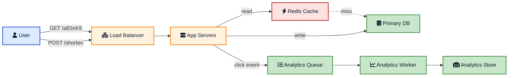
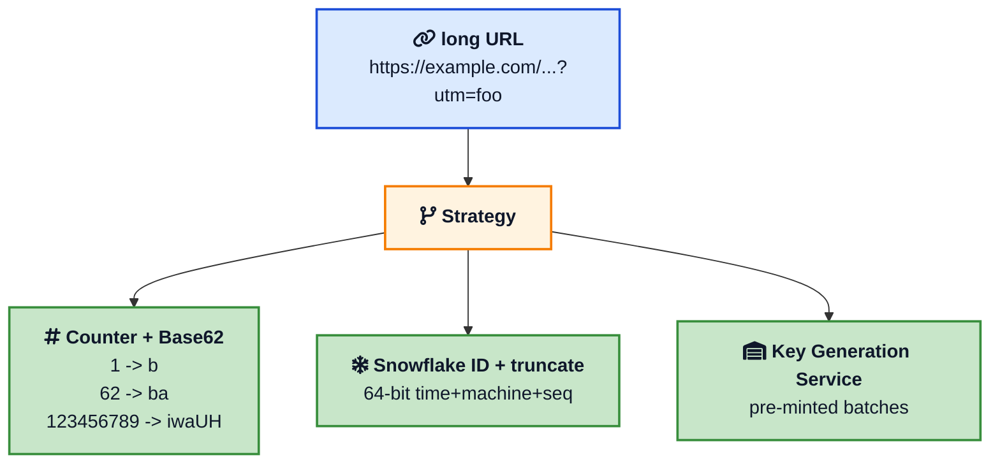
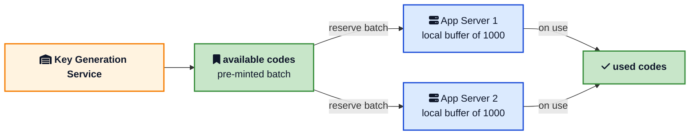
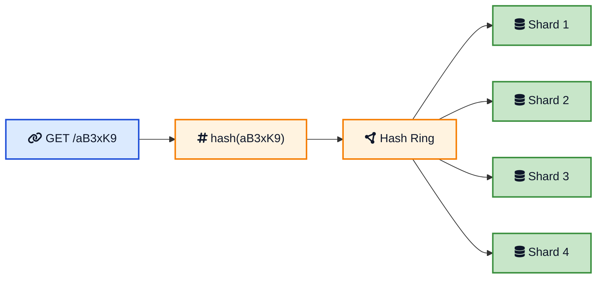
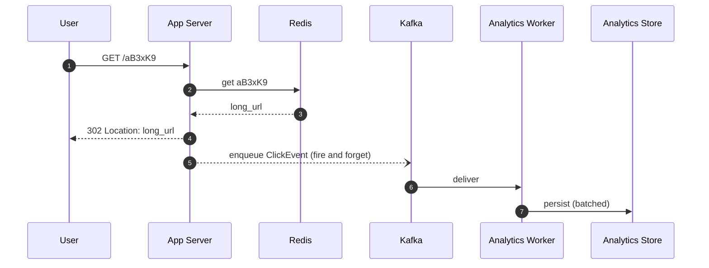
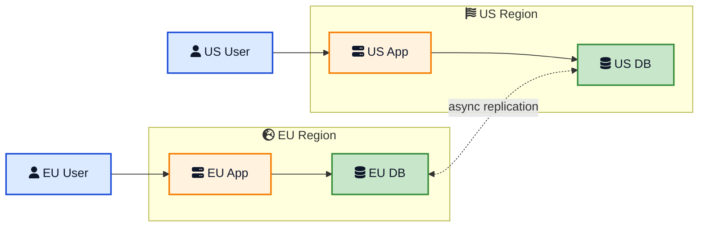
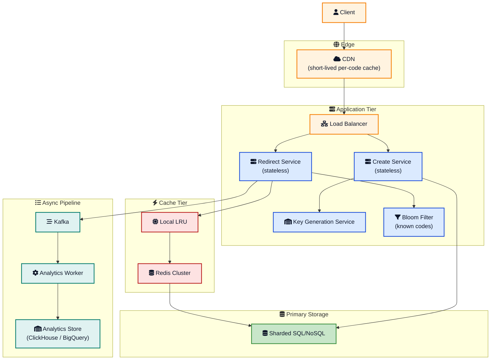

You paste a 200-character link into a tweet. Twitter wraps it in `t.co/...`. Bitly turns a marketing URL into `bit.ly/3xK9aB`. The original TinyURL service has been doing the same trick since 2002. The product looks trivial: long URL in, short URL out, click takes you to the original. The architecture behind it is one of the most reused interview questions on the planet for a reason. It is small, full of trade-offs, and almost every concept in [system design](/system-design/){:target="_blank" rel="noopener"} appears in some form.

This post is a working answer to **how to design TinyURL** that you can use in an interview, in a brown-bag talk, or as the starting point for a real service. It is not a mile wide and an inch deep. We will walk through requirements, capacity, the API, short code generation, the database, caching, redirects, analytics, custom aliases, abuse, multi region, and the failure modes that always show up two weeks after launch.

If you want a quick refresher on the building blocks first, the [System design cheat sheet](/system-design-cheat-sheet/){:target="_blank" rel="noopener"}, [Caching strategies](/caching-strategies-explained/){:target="_blank" rel="noopener"}, and [Consistent hashing](/consistent-hashing-explained/){:target="_blank" rel="noopener"} cover most of what we will reach for.

## What a URL Shortener Actually Does

A URL shortener has two endpoints and one promise.

1. `POST /shorten` takes a long URL and returns a short one.
2. `GET /:code` redirects to the long URL.

The promise is that the redirect is fast, available, and forever. Everything else (analytics, custom aliases, expiration, branded domains, link rotation, password protection) is a feature on top of those two endpoints.

That sounds like a one-day project. The hard part is the **scale and the read to write ratio**.





That is the whole system on one page. Most of this post is justifying each box and the lines between them.

## Functional and Non Functional Requirements

In an interview, the first five minutes are about agreeing on what you are building.

**Functional requirements**

- Shorten a long URL into a short one.
- Redirect a short URL to the original long URL.
- Optional custom alias (`example.com/launch` instead of `aB3xK9`).
- Optional expiration time.
- Optional click analytics (count, country, referer, time of day).
- Optional user accounts and link management.

**Non functional requirements**

- High availability for redirects. The number to quote is "four nines" (99.99 percent) for the read path, since a broken link is worse than a slow one.
- Low latency. P99 redirect under 50 milliseconds end to end is a reasonable bar, with cache hit closer to single digit milliseconds.
- Read heavy. Plan for a 100 to 1 read to write ratio, sometimes 1000 to 1 for viral campaigns.
- Eventually consistent analytics. Click counts can lag the redirect by seconds.
- Predictable codes are bad. The short code should not leak ID order to the world, otherwise scrapers can walk the entire link database.

These constraints drive almost every decision below.

## Capacity Estimation

Numbers force you to make better trade-offs. A common interview prompt is "100 million new URLs per month, 10 billion redirects per month, keep the data for five years".

| Quantity | Value | Where it comes from |
|---|---|---|
| URLs created per second | ~38 | 100M / (30 * 86400) |
| Redirects per second | ~3,800 | 10B / (30 * 86400) |
| Read to write ratio | 100 : 1 | 10B / 100M |
| URLs over 5 years | 6 billion | 100M * 12 * 5 |
| Storage per row | ~500 bytes | code + long URL + metadata |
| Total storage | ~3 TB | 6B * 500 bytes |
| Cache target | top 20% hot | Pareto, hit rate ~95% |
| Cache size | ~50 GB | 1.2B rows * ~40 bytes per Redis entry |
| Daily bandwidth out | ~10 TB | 333M redirects * ~30 KB target page |

Three takeaways from those numbers:

1. The write rate is tiny. A single decent SQL primary can take 38 inserts per second without breaking a sweat. The system is not write bound.
2. The read rate is much larger. 3,800 reads per second is fine for one Redis node, but spike traffic on viral links can push that to 100,000 reads per second on the hot subset. That is the number to design for.
3. The data is small. 3 TB total over five years is a single shard on modern hardware. The reason to shard is not size, it is the cache locality and replication budget you want for the read path.

These are also the numbers you cite when an interviewer asks "why did you pick that?" later. If you cannot quote a number, you cannot defend a choice.

## API Design

Two endpoints carry 99 percent of the load.

```bash
POST /api/v1/shorten
Content-Type: application/json
Authorization: Bearer <token>

{
  "long_url": "https://example.com/some/long/path?utm=foo",
  "custom_alias": "launch",
  "expires_at": "2027-01-01T00:00:00Z"
}

201 Created
{
  "short_url": "https://tiny.example/launch",
  "code": "launch",
  "long_url": "https://example.com/some/long/path?utm=foo",
  "expires_at": "2027-01-01T00:00:00Z"
}
```

<br>

```bash
GET /:code

302 Found
Location: https://example.com/some/long/path?utm=foo
Cache-Control: private, max-age=0
```

A small set of supporting endpoints rounds out the surface.

- `GET /api/v1/links/:code` to read metadata.
- `DELETE /api/v1/links/:code` to deactivate a link.
- `GET /api/v1/links/:code/stats` for analytics.
- `POST /api/v1/links/bulk` for batch creation, since marketing teams always need it.

Because most of the load is `GET /:code`, that path should not need authentication, should not write to the primary database, and should be cacheable by a CDN. Everything else can be more expensive.

## The Heart of the Problem: Generating the Short Code

The code is what every other piece of the system revolves around. There are three production-grade ways to mint one. Each has different operational characteristics.





### Option 1: Counter Plus Base62

Take a unique integer ID, write it in base62. Done.

```python
ALPHABET = "abcdefghijklmnopqrstuvwxyzABCDEFGHIJKLMNOPQRSTUVWXYZ0123456789"

def encode(num: int) -> str:
    if num == 0:
        return ALPHABET[0]
    out = []
    while num > 0:
        num, rem = divmod(num, 62)
        out.append(ALPHABET[rem])
    return "".join(reversed(out))

def decode(code: str) -> int:
    n = 0
    for ch in code:
        n = n * 62 + ALPHABET.index(ch)
    return n
```

The integer can come from any source that produces unique numbers. The simplest is a `BIGINT` primary key with auto increment in a single SQL table.

| Code length | 62^n | Capacity |
|---|---|---|
| 5 | 916,132,832 | ~916 million |
| 6 | 56,800,235,584 | ~56.8 billion |
| 7 | 3,521,614,606,208 | ~3.5 trillion |
| 8 | 218,340,105,584,896 | ~218 trillion |

Pros: simple, deterministic, no collisions ever.

Cons: a single auto-increment counter is a write hot spot at huge scale, and codes are sequential and guessable, so anyone can scrape `tiny.example/aB3xK1`, `aB3xK2`, `aB3xK3` and walk through the whole database. You can defeat that with **base62 of a XOR-encrypted counter** (encrypt the integer with a small block cipher, then encode), which keeps codes unique and unguessable while staying short.

### Option 2: Snowflake ID, Then Truncate

A [Snowflake ID](/snowflake-id-guide/){:target="_blank" rel="noopener"} packs a millisecond timestamp, a machine ID, and a per-millisecond sequence into 64 bits. Each app server can mint IDs locally without coordination. Encode the lower bits with base62 to get a 7 to 11 character code, or take the lower 42 bits and base62 encode for a clean 7 character code.

Pros: distributed, no central counter, IDs are roughly time-ordered which is friendly to B-tree indexes, no contention on writes.

Cons: lots of bits to carry, so the truncation step needs care to avoid collisions. The full pattern is to truncate, check for collision in the database, and rehash with a salt on the rare collision.

This is what you reach for when the write rate is high enough that a single counter would be a bottleneck, or when you want every region to mint codes independently.

### Option 3: Key Generation Service

A standalone service pre-mints codes in batches and hands them to app servers. Codes are pulled from a "available" table and moved to a "used" table when assigned. App servers buffer a few hundred at a time so they never block on the KGS during a request.



Pros: codes can be **truly random** (no order leak), collisions are impossible by construction, app servers are fast because they hand out from a local buffer.

Cons: the KGS itself is a stateful service and needs replication. If you lose the "used" set during a failover, you risk handing out a code twice. Run two KGS instances against the same store, with the available table partitioned, or use a shared lock or a strict atomic move.

This is the design used by some large URL shorteners and by other systems that need globally unique short codes (invitation codes, coupon codes, license keys).

### What About Hash Plus Truncate?

Take MD5 or SHA-1 of the long URL, base62 encode, take the first 7 characters. It is tempting because it is one line of code. It is also wrong for a public service.

- Two different long URLs can collide. You have to check, and on a hit, you either return the existing code (if the long URLs match) or rehash with a salt (if they do not). That collision-check pass turns a single-write into a read plus a maybe-write.
- Different users who shorten the same long URL all share the same short code. That breaks per-user analytics, expiration, and revocation.
- A 128-bit hash truncated to 42 bits has more than enough room, but the engineering complexity is not worth it.

The hash approach makes sense **only** if you explicitly want content addressing, the same way [Git uses SHA-1 to name objects](/how-git-stores-data-internally/){:target="_blank" rel="noopener"}.

## Database: Schema, Engine, and Sharding

The schema is small, which is the only easy part.

```sql
CREATE TABLE links (
    short_code   VARCHAR(10) NOT NULL PRIMARY KEY,
    long_url     TEXT        NOT NULL,
    user_id      BIGINT,
    created_at   TIMESTAMPTZ NOT NULL DEFAULT NOW(),
    expires_at   TIMESTAMPTZ,
    is_active    BOOLEAN     NOT NULL DEFAULT TRUE,
    is_custom    BOOLEAN     NOT NULL DEFAULT FALSE
);

CREATE INDEX idx_links_user      ON links (user_id);
CREATE INDEX idx_links_expires   ON links (expires_at) WHERE expires_at IS NOT NULL;
```

The `short_code` is the primary key because every read is keyed by it. There is no compound key. There is no `JOIN` in the redirect path.

### SQL or NoSQL

Both work. Pick the one your team operates well.

| Choice | When it fits | Risks |
|---|---|---|
| PostgreSQL or MySQL with read replicas | Up to a few hundred million rows, single region, modest QPS | Primary becomes a bottleneck if write rate spikes; replica lag affects newly created codes |
| DynamoDB or Cassandra (or ScyllaDB) | Billions of rows, multi region, very high redirect QPS | Eventual consistency on reads; harder to do analytical queries; per-request cost adds up |
| Hybrid (SQL for create, NoSQL for read mirror) | Mixed workloads, audit-heavy products | Two stores to keep in sync; complexity tax |

For a system design interview, the right answer is "for our target of 38 writes per second and 100K redirect peak QPS, a partitioned PostgreSQL with replicas is fine, and we can move the read path to DynamoDB or Cassandra later if growth demands it." Concrete, defensible, and honest.

If you go with PostgreSQL, the [B-tree index](/data-structures/b-tree/){:target="_blank" rel="noopener"} on `short_code` gives O(log n) lookup and a small enough working set that the index pages stay in RAM. We covered the mechanics in [How databases store data internally](/how-databases-store-data-internally/){:target="_blank" rel="noopener"}.

### Sharding

When one node is not enough, partition by the short code itself.





[Consistent hashing](/consistent-hashing-explained/){:target="_blank" rel="noopener"} on the short code spreads load evenly and minimizes data movement when nodes are added or removed. That is exactly the workload it was designed for.

## Caching: Where the Real Win Lives

Reads on a URL shortener follow a long-tail distribution. A small fraction of links carry most of the traffic, especially for marketing campaigns and viral posts.


Four layers, each absorbing the misses of the one above:

1. **CDN edge cache**. For very hot codes (a top tweet, a Black Friday banner), a CDN like Cloudflare or Fastly can cache the redirect itself for a few seconds. The cache key is the short code. This handles the noisy "thundering herd" we discussed in [Thundering herd problem explained](/thundering-herd-problem/){:target="_blank" rel="noopener"}.
2. **In-process LRU**. The app server keeps a few thousand of its own most recent codes. This skips even the Redis hop for the very hottest links.
3. **Redis cluster**. Sharded by short code, with [LRU eviction](/caching-strategies-explained/){:target="_blank" rel="noopener"} so cold links fall out automatically. Plan for ~50 GB of memory at the scale we estimated.
4. **Primary database**. Authoritative, always correct, slowest.

A 95 percent Redis hit rate plus a 50 percent CDN hit rate effectively makes the database the lookup of last resort. That is the only way 38 writes per second can also serve a 3,800 redirect per second steady state with a 100,000 QPS spike.

A small detail that matters: a request for a **non-existent** short code is also a cache lookup. Without protection, a script that hammers `GET /xxxxxxx` for random codes will every time miss the cache and hit the database. Two defenses help.

- Cache the **negative result** for a few seconds with a small TTL.
- Run a [Bloom filter](/data-structures/bloom-filter/){:target="_blank" rel="noopener"} of known codes in front of the database. Bloom filters answer "is this code definitely not in the set?" in O(1) with very little memory. A 1 GB filter holds around 600 million entries with a one in a thousand false positive rate, which is a huge defense against drive-by scrapers and well within budget for a single Redis or in-process structure.

## The Redirect: 301 vs 302

This is where most engineers get tripped up in interviews.

| Code | Meaning | Browser caches? | Click counted? | SEO link equity |
|---|---|---|---|---|
| 301 Moved Permanently | Permanent redirect | Yes, aggressively | No, after the first hit | Passes to destination |
| 302 Found (Temporary) | Temporary redirect | No (or very short) | Yes, every click hits your servers | Stays with the short URL |

For a URL shortener, the trade-off is clear: **301 cuts traffic and breaks analytics. 302 keeps analytics and absorbs more traffic.**

Real services pick based on use case. A marketing analytics product like Bitly defaults to 302 because every click is the product. A pure "make this URL shorter for SMS" service can default to 301 to save infrastructure. Some let users choose per link.

Both responses should set `Cache-Control: private, max-age=0` (302) or a small `max-age` (301) to keep behavior consistent across clients.



## Analytics Without Hurting the Redirect Path

The cardinal sin in a URL shortener is letting analytics writes block the redirect. Every click runs synchronous code, and a slow analytics database (or worse, a flaky external one) becomes a redirect outage.

The fix is the [transactional outbox / async pipeline pattern](/transactional-outbox-pattern/){:target="_blank" rel="noopener"} we have used elsewhere.



Steps to lock in:

1. The redirect returns the moment the long URL is known. The user is on their way to the destination in single-digit milliseconds.
2. The click event is published asynchronously to a queue (Kafka, Kinesis, RabbitMQ, SQS). The app server does not wait for confirmation. We compared the trade-offs in [Kafka vs RabbitMQ vs SQS](/kafka-vs-rabbitmq-vs-sqs/){:target="_blank" rel="noopener"}.
3. A consumer batches click events and writes them to an analytical store. ClickHouse, BigQuery, Druid, or Snowflake are all fine choices. Aggregations (clicks per hour, by country, by referer) run on read-time queries or materialized views.

If the queue is down, you keep redirecting. Click data lags. That is the right call. **Never lose a redirect to save a click event.**

## Custom Aliases

A custom alias is just a short code that the user picked instead of one the system generated.

```sql
INSERT INTO links (short_code, long_url, is_custom, ...)
VALUES ('launch', 'https://example.com/...', TRUE, ...);
```

Three rules keep custom aliases from causing pain.

1. **Reserve a namespace**. Generated codes must avoid the alphabet pattern of custom aliases (or vice versa). The simplest rule is: generated codes use only characters in `[a-zA-Z0-9]` of length 7, and custom aliases must contain a digit followed by a letter or some pattern that no random base62 string of length 7 will ever produce. In practice, a flag in the database (`is_custom`) and a uniqueness check at insert time covers it.
2. **Validate** on input. Block reserved words (`api`, `admin`, `login`, `static`), enforce a max length, allow only `[a-zA-Z0-9-_]`, and disallow homoglyphs that look like reserved paths.
3. **Race-safe insert**. Two users typing the same alias at the same time is a race. Make the database key constraint do the work. `INSERT ... ON CONFLICT (short_code) DO NOTHING` and check the row count to detect the conflict.

## Rate Limiting and Abuse

Most "load" on URL shorteners is malicious traffic, not organic. Spammers, phishers, and malware operators love a free shortening service because it hides the destination.

Defenses, in order of importance.

- **Per-IP and per-user rate limit on `POST /shorten`**. We covered the algorithms in [Dynamic rate limiter system design](/dynamic-rate-limiter-system-design/){:target="_blank" rel="noopener"}. Token bucket with 60 requests per minute per IP is a sane default.
- **Reputation check on the long URL**. Google Safe Browsing, VirusTotal, or PhishTank at create time. Reject anything flagged. Periodically rescan stored URLs because reputations change.
- **Allowed schemes**. `http` and `https` only. No `javascript:`, `data:`, `file:`, `ftp:`, or exotic ports.
- **Quarantine new codes**. For the first hour after creation, return a small interstitial that says "you are about to leave for `<domain>`, continue?" instead of a direct redirect. Spammers move on, real users click through.
- **Disable on flag**. A flagged link returns a `410 Gone` page with the reason. Do not silently delete; you want logs to investigate the campaign.

## Multi Region and High Availability

A multi region URL shortener has two flavors.

**Active-passive**. Writes go to a primary region. Reads can be served from a secondary read replica. On primary failure, the secondary is promoted. Simple, but cross-region failover takes 60 to 300 seconds and creates a noticeable redirect blip.

**Active-active with a global short code namespace**. Writes can land in either region. The challenge is making sure two app servers in two regions never mint the same short code for two different URLs. This is exactly where Snowflake IDs or a Key Generation Service shine because both produce globally unique IDs without coordination. The database (DynamoDB Global Tables, Cassandra, Spanner) replicates the row to both regions asynchronously. A read after a write in the other region might briefly miss, which is why custom aliases need a two-region uniqueness check or a single-region creation path.



For a system design interview, name the trade-off explicitly: **active-active gets you the lowest redirect latency for global users at the cost of more complex consistency for newly created links**. That is enough.

## Expiration and Garbage Collection

Some URLs are temporary by design (one-time login links, paid trial signups, magic-login emails). Two ways to expire them.

1. **Lazy expiration**. The redirect handler checks `expires_at`. If past, return `410 Gone`. Easy to implement, no background process. Storage keeps growing.
2. **Active expiration**. A nightly job deletes rows where `expires_at < NOW()`. Saves space, requires careful coordination with the cache (delete cache entries when rows are deleted, or let TTL handle it).

Most services do both: lazy enforcement for safety, active cleanup for storage.

"Garbage collection" here is the broader sweep that runs alongside expiration. A URL shortener accumulates more dead state than people expect, and none of it cleans itself up.

- **Soft-deleted abuse links**. When a URL is flagged as malicious you mark it inactive instead of deleting, so investigators can still see what was hosted. After a retention window (typically 90 days) the row can be hard-deleted.
- **Orphaned analytics rows**. Click events keep arriving for codes whose links were deleted or expired. Nightly jobs roll those click rows into aggregates and drop the raw events.
- **Stale cache entries**. When a row is deleted in the database, the matching Redis key and CDN edge entry must be invalidated. Either explicit invalidation or short cache TTLs handle this; relying on LRU alone leaves zombie entries pointing at deleted URLs.
- **Cold partitions**. Old shards or old time-partitioned tables (links created five years ago that nobody clicks anymore) can be moved to cheaper storage or dropped entirely if the retention policy allows.
- **Tombstones in NoSQL stores**. Cassandra and DynamoDB do not free space on delete; they write tombstones that get compacted away later. Tune compaction so tombstones do not pile up and slow reads.

The practical rule is the same one we covered in [How Git stores data internally](/how-git-stores-data-internally/){:target="_blank" rel="noopener"}: anything unreachable that is not actively swept will sit on disk forever. Pick the retention window once, write the cleanup job, and let it run.

## Putting It All Together: The Production Architecture

Here is the same diagram from the top, fully labeled.





Highlights you should be able to defend in an interview.

- **Two stateless service tiers**, one for reads and one for writes. They scale independently. The read tier is autoscaled on QPS, the write tier on creation rate.
- **A Bloom filter** in front of the cache to absorb scraper traffic for unknown codes.
- **A KGS** as the source of unguessable, collision-free codes. If the team prefers Snowflake IDs, swap it.
- **An async pipeline** for analytics that never blocks redirects.
- **Sharded storage** keyed by short code, using consistent hashing so node changes do not reshuffle the world.

## Common Failure Modes (And How They Are Fixed)

The patterns repeat in every URL shortener postmortem.

| Failure | Symptom | Fix |
|---|---|---|
| Cache miss storm on a viral link | All app servers hit the DB at the same time for the same code | Single-flight (one in-flight DB lookup per key per server), short negative-cache TTL, request coalescing at the CDN |
| Counter contention | Single auto-increment is a write hot spot | Switch to Snowflake IDs or KGS with batched ranges |
| Replica lag visible to user | User creates link, immediately tries to read it from replica, gets 404 | Read-your-writes via primary on the create flow, or pin reads to primary for `<5s` after a write |
| Analytics queue down | Click events back up | Drop on the floor with metrics, never block the redirect |
| Spam campaign | A wave of malicious shortenings | Rate limit per IP, run reputation API at create, quarantine new codes |
| Database unreachable | Redirects fail | Serve stale from Redis with a header that signals "stale", page humans for the DB |
| Hash collision in custom alias | Two users pick the same alias at the same second | Unique constraint at the database level, return 409 Conflict |
| Long tail GC | Redis evicts cold codes, every miss hits DB | Tune Redis memory, add a Bloom filter, or move to a tiered cache (Redis + on-disk warm tier) |

## Comparison With Real Services

| Service | Scale | Code length | Notable |
|---|---|---|---|
| TinyURL | Tens of billions of historical URLs | Variable, often 4 to 7 | Original from 2002, anonymous shortening |
| Bitly | Hundreds of billions of clicks | 7 | Branded domains, enterprise analytics |
| `t.co` (Twitter / X) | Every link in every tweet | 10 | Click tracking and safety scanning |
| `goo.gl` | Retired in 2019 | 6 | Google operated, replaced by Firebase Dynamic Links |
| YOURLS (open source) | Self-hosted | Configurable | PHP and MySQL, single node by default |

The architectures are remarkably similar. The differences are in commercial features (custom domains, analytics, team plans) and operational scale, not in the data model.

## What Senior Interviewers Look For

When you walk a system design interview, the grading is rarely "did you mention Redis". It is "did you reason like an engineer who has been on call for this system?".

Concrete things that move the needle.

1. **Capacity numbers up front**. Anyone can draw boxes. Numbers tie boxes to choices.
2. **One-line trade-offs**. "I would use 302 because we want analytics, knowing it costs us more requests" beats "302" alone.
3. **Failure mode awareness**. Talk about cache miss storms, replica lag, queue back-pressure, abuse. Solving for the happy path is half the answer.
4. **Sensible defaults, then optimize**. Start with PostgreSQL plus Redis. Move parts to NoSQL or sharding only when the numbers demand it.
5. **Pick one ID strategy and own it**. Counter plus base62, Snowflake, or KGS, all are correct. Defending one well beats waffling between three.

If you want a bigger toolbox of these reasoning patterns, the [System design cheat sheet](/system-design-cheat-sheet/){:target="_blank" rel="noopener"} covers them in one page.

## Hands-On: A 100 Line Reference

If you want a working playground, the redirect path is short enough to fit on a screen.

```python
from fastapi import FastAPI, HTTPException
from pydantic import BaseModel, HttpUrl
import sqlite3, threading

ALPHABET = "abcdefghijklmnopqrstuvwxyzABCDEFGHIJKLMNOPQRSTUVWXYZ0123456789"

def encode(num: int) -> str:
    out = []
    while num > 0:
        num, r = divmod(num, 62)
        out.append(ALPHABET[r])
    return "".join(reversed(out)) or ALPHABET[0]

class CreateReq(BaseModel):
    long_url: HttpUrl
    custom_alias: str | None = None

app = FastAPI()
_lock = threading.Lock()
_db = sqlite3.connect("links.db", check_same_thread=False)
_db.execute("""CREATE TABLE IF NOT EXISTS links(
    code TEXT PRIMARY KEY, long_url TEXT, custom INTEGER)""")
_db.execute("""CREATE TABLE IF NOT EXISTS counter(id INTEGER PRIMARY KEY)""")

def next_id() -> int:
    with _lock:
        cur = _db.execute("SELECT id FROM counter")
        row = cur.fetchone()
        nxt = (row[0] if row else 0) + 1
        _db.execute("DELETE FROM counter")
        _db.execute("INSERT INTO counter(id) VALUES (?)", (nxt,))
        _db.commit()
        return nxt

@app.post("/shorten")
def shorten(req: CreateReq):
    if req.custom_alias:
        try:
            _db.execute("INSERT INTO links VALUES (?,?,1)",
                        (req.custom_alias, str(req.long_url)))
            _db.commit()
        except sqlite3.IntegrityError:
            raise HTTPException(409, "alias taken")
        return {"code": req.custom_alias}
    code = encode(next_id())
    _db.execute("INSERT INTO links VALUES (?,?,0)", (code, str(req.long_url)))
    _db.commit()
    return {"code": code}

@app.get("/{code}")
def go(code: str):
    cur = _db.execute("SELECT long_url FROM links WHERE code = ?", (code,))
    row = cur.fetchone()
    if not row:
        raise HTTPException(404)
    return {"redirect_to": row[0]}
```

That is a real URL shortener. To make it production grade, you add Redis in front of `_db`, swap SQLite for PostgreSQL, replace `next_id` with a Snowflake generator, push the click event to Kafka in the redirect handler, return a real `302`, and run it behind a CDN. The shape does not change.

You can also use the [Base64 encoder](/tools/base64-encoder/){:target="_blank" rel="noopener"} or [Snowflake decoder](/tools/snowflake-decoder/){:target="_blank" rel="noopener"} on this blog to play with the building blocks.

## Practical Lessons for Developers

Once you have implemented the redirect path once, a few patterns become obvious.

### Reads Drive Architecture, Writes Drive Schema

In any read-heavy system, the read path determines the cache, sharding, and CDN choices. The schema is shaped by the write path. Optimize them separately.

### Avoid Synchronous Anything on the Redirect

Click logging, fraud checks, A/B tests. All of them belong on the async side. The redirect should do one cache lookup and one HTTP response. Period.

### Codes Are Public, So Treat Them As Such

Anyone can scrape `aB3xK1`, `aB3xK2`, `aB3xK3` if they are sequential. If your business is privacy sensitive (medical, financial, legal), use unguessable codes (KGS or encrypted counter) from day one. Migrating later is painful.

### Analytics Schema Is Bigger Than the URL Schema

Counts by hour, by country, by referer, by device, by campaign. The analytics database easily becomes 10 to 100 times bigger than the URL database. Plan retention windows, materialized views, and cold storage early.

### Build the Boring Defenses Before You Go Public

A URL shortener with no rate limit, no reputation check, and no abuse interstitial will be on a phishing report within 24 hours. Build the boring defenses on day one.

### Prefer Eventual Consistency for Click Counts

Click counts are best-effort by definition. Trying to make them strictly consistent across regions destroys redirect latency. Pick eventual, accept the small lag, and explain it in the product.

## Further Reading

If you want to go deeper, these are the best sources.

- The [Pro Git internals chapter](https://git-scm.com/book/en/v2/Git-Internals-Plumbing-and-Porcelain){:target="_blank" rel="noopener"} for an example of a content-addressable hash-based key-value store, which is the same shape as a URL shortener internally.
- The [Cloudflare engineering blog](https://blog.cloudflare.com/){:target="_blank" rel="noopener"} for posts on redirect-heavy workloads, edge caching, and DDoS for short URL services.
- [Designing Data-Intensive Applications](https://dataintensive.net/){:target="_blank" rel="noopener"} by Martin Kleppmann for the deeper theory on partitioning, replication, and read-heavy systems.
- [System Design Primer](https://github.com/donnemartin/system-design-primer){:target="_blank" rel="noopener"} on GitHub for an open-source curriculum that includes a URL shortener case study.
- The [Bitly engineering blog](https://word.bitly.com/){:target="_blank" rel="noopener"} for real war stories from one of the largest URL shorteners on the planet.
- [Google Safe Browsing](https://safebrowsing.google.com/){:target="_blank" rel="noopener"} and [PhishTank](https://www.phishtank.com/){:target="_blank" rel="noopener"} for the reputation APIs you should call at create time.

## Wrapping Up

A URL shortener looks simple from the outside and is a clean window into almost everything in [system design](/system-design/){:target="_blank" rel="noopener"} from the inside. Read-heavy traffic. Tiered caching. Distributed ID generation. Async analytics. Custom aliases. Abuse prevention. Multi region. None of these problems are unique to URL shorteners, which is exactly why the question shows up in interview after interview.

If you can walk an interviewer (or a junior teammate) through the capacity numbers, the choice between counter and Snowflake and KGS, the cache layers, the 301 vs 302 trade-off, the async analytics path, and the abuse defenses, you have a working mental model that transfers to almost any read-heavy service. Build it once, on a weekend, with the 100 lines above. Then add Redis, then add a queue, then add a Bloom filter. By the third weekend you will read other people's URL shortener writeups the way an experienced operator reads a postmortem.

The next time someone says "design TinyURL", you will not start with a box-and-arrow diagram. You will start with the capacity table, name the read to write ratio, pick an ID strategy, defend it, and only then draw the boxes.

---

*For more practical reading on this blog, see the [System design cheat sheet](/system-design-cheat-sheet/){:target="_blank" rel="noopener"}, [Snowflake ID guide](/snowflake-id-guide/){:target="_blank" rel="noopener"}, [Consistent hashing](/consistent-hashing-explained/){:target="_blank" rel="noopener"}, [Caching strategies](/caching-strategies-explained/){:target="_blank" rel="noopener"}, [Bloom filter](/data-structures/bloom-filter/){:target="_blank" rel="noopener"}, [Database indexing](/database-indexing-explained/){:target="_blank" rel="noopener"}, [How databases store data internally](/how-databases-store-data-internally/){:target="_blank" rel="noopener"}, [Dynamic rate limiter](/dynamic-rate-limiter-system-design/){:target="_blank" rel="noopener"}, [Kafka vs RabbitMQ vs SQS](/kafka-vs-rabbitmq-vs-sqs/){:target="_blank" rel="noopener"}, [Thundering herd problem](/thundering-herd-problem/){:target="_blank" rel="noopener"}, [Transactional outbox pattern](/transactional-outbox-pattern/){:target="_blank" rel="noopener"}, [Slack system design](/slack-system-design/){:target="_blank" rel="noopener"}, [Ticket booking system design](/ticket-booking-system-design/){:target="_blank" rel="noopener"}, the [full archive](/archive/){:target="_blank" rel="noopener"}, and the broader [System design hub](/system-design/){:target="_blank" rel="noopener"} and [Distributed systems hub](/distributed-systems/){:target="_blank" rel="noopener"}.*

*Further reading: [System Design Primer](https://github.com/donnemartin/system-design-primer){:target="_blank" rel="noopener"}, [Designing Data-Intensive Applications](https://dataintensive.net/){:target="_blank" rel="noopener"}, the [Bitly engineering blog](https://word.bitly.com/){:target="_blank" rel="noopener"}, and [Google Safe Browsing](https://safebrowsing.google.com/){:target="_blank" rel="noopener"} for the reputation API you should integrate from day one.*
