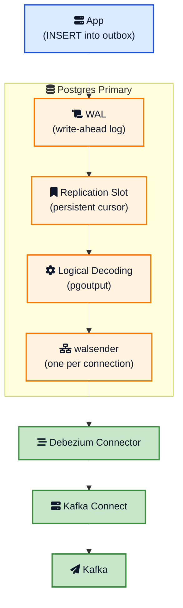
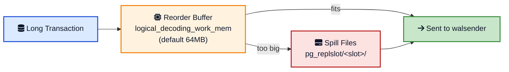
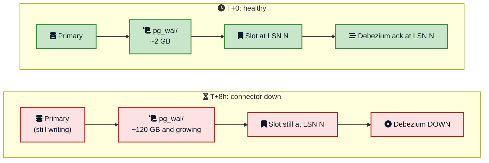
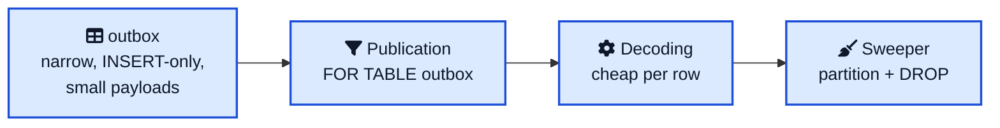
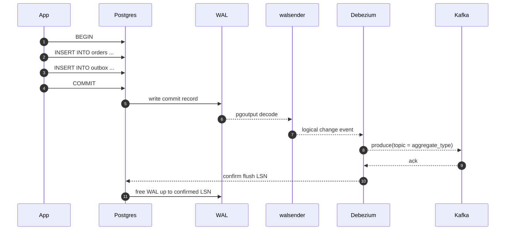
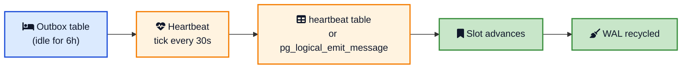
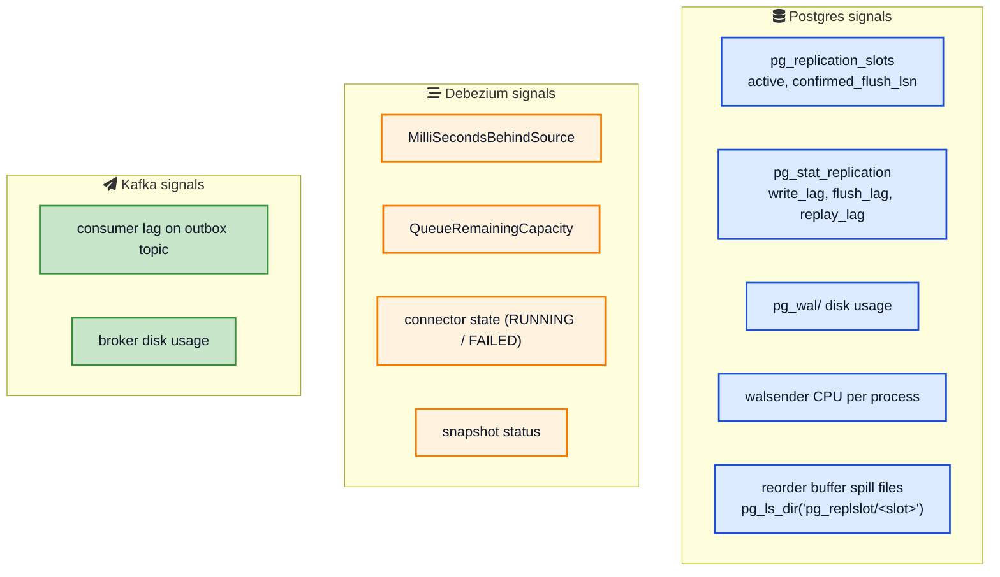
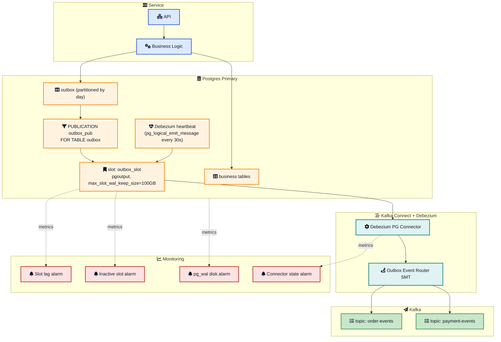

You proposed [the transactional outbox pattern](/transactional-outbox-pattern/){:target="_blank" rel="noopener"} for your service. The design review goes well until the DBA on the call says: "So you want me to add a third logical replica to the primary? That is going to slow the database down."

That single sentence kills more outbox rollouts than any other concern. The DBA's worry is real, but it is also often overstated. The truth sits in the middle. Debezium does add load to your Postgres primary, but the load lands in very specific places, the steady-state cost for an outbox-only stream is small, and the actual production risk is almost never CPU. It is **WAL retention**.

This post is the answer you wish you had ready in that meeting. We will walk through what Debezium actually does to a Postgres primary, where the overhead lives (CPU, memory, disk, network), why the outbox pattern is the best-case workload for change data capture, and the configuration knobs and monitoring that keep your DBA from paging you at 3 AM. The previous deep dive on [the transactional outbox pattern](/transactional-outbox-pattern/){:target="_blank" rel="noopener"} covered the why and the how. This one is about what your database team needs to hear before they sign off.

If you are still deciding between Debezium and a polling relay, or between Kafka and another broker, the [Kafka vs RabbitMQ vs SQS](/kafka-vs-rabbitmq-vs-sqs/){:target="_blank" rel="noopener"} and [How Kafka Works](/distributed-systems/how-kafka-works/){:target="_blank" rel="noopener"} posts will help frame the trade-offs.

## What Debezium Actually Does to Postgres

Debezium for Postgres is built on top of [logical replication](https://www.postgresql.org/docs/current/logical-replication.html){:target="_blank" rel="noopener"}. From the database's point of view, the connector behaves like one more logical replica. Three components on the database side carry all of the weight.



A quick tour of each piece:

- **Replication slot** (`pg_replication_slots`). A persistent cursor into the WAL stream. As long as the slot exists, Postgres will not recycle any WAL segments past the slot's confirmed position. This is the single most important concept in this post.
- **Logical decoding plugin**. Postgres ships with `pgoutput` since version 10. The older `wal2json` exists but you should not reach for it on a new project. We explain why below. The plugin is the code that takes physical WAL records and turns them into logical change events (INSERT, UPDATE, DELETE) that an external consumer can understand.
- **walsender process**. One backend process per active replication connection from Debezium. It reads the WAL, runs it through the plugin, applies publication and column filters, reorders by transaction commit, and streams the result over the network to the connector.



So yes, your DBA is right that Debezium "looks like a replica" to the database. The cost profile is different from a streaming physical replica, but the mental model of "another consumer of the WAL pipeline" is correct. The disagreement is about what that actually costs.

## Where the Overhead Actually Lands

There are four places the load shows up. CPU is the one everyone talks about. Disk is the one that takes down your production database.

### CPU: mostly on the primary

The walsender does the decoding work, and the walsender lives on the primary. There is no way to push that to a standby. The cost depends on three things: how many tables are in the publication, how big the transactions are, and how much filtering happens at the publication level versus inside the walsender.

| Source | Impact | Notes |
|---|---|---|
| Logical decoding (pgoutput) | Moderate | The walsender reads physical WAL and decodes it into logical change events. CPU work on the primary, not on a standby. |
| Reorder buffer | Can spike | Postgres reassembles transactions in commit order. Long-running or large transactions cause memory then disk spilling and visible CPU churn. |
| Filtering | Low to moderate | If you publish all tables but only care about the outbox, the primary still decodes everything before filtering. Use `PUBLICATION FOR TABLE outbox` to cut this to near zero. |
| TOAST and large columns | Low for outbox | Outbox payloads are small JSON. UPDATE-heavy tables with TOAST columns are far more expensive to decode. |

A reasonable rule of thumb from the [Debezium project's own performance tests](https://debezium.io/blog/2025/07/07/quick-perf-check/){:target="_blank" rel="noopener"} and from posts like [Reorchestrate's measurements](https://reorchestrate.com/posts/debezium-performance-impact/){:target="_blank" rel="noopener"} is that Debezium adds little to no CPU on the primary under normal OLTP load when the publication is narrow. For a busy database with a wildcard publication, expect 5 to 15 percent extra CPU steady state, with spikes higher during bulk jobs and schema migrations. For an outbox-only publication on a small table with small inserts, the overhead is usually below 5 percent.

The [Microsoft Azure Postgres CDC tuning guide](https://techcommunity.microsoft.com/t5/microsoft-blog-for-postgresql/performance-tuning-for-cdc-managing-replication-lag-in-azure/ba-p/4473232){:target="_blank" rel="noopener"} also points out that **multiple slots multiply the work**. Each slot decodes the entire WAL stream independently, so two Debezium connectors against the same database do roughly twice the decoding work, even if they care about different tables. This matters when you start adding more services.

### Memory: per walsender, not free but not huge

Each walsender has its own backend memory (around 10 to 20 MB of static cost) and a reorder buffer governed by `logical_decoding_work_mem` (default 64 MB). When a transaction grows beyond the reorder buffer, Postgres spills it to disk in the slot's directory under `pg_replslot/<slot>/`.



For an outbox table where every transaction inserts a single small row, the reorder buffer will rarely spill. For a database where the outbox table sits next to a long-running batch job that updates millions of rows in one transaction, the spill files for that one transaction can hit gigabytes. The spill is disk, not memory, but you still pay for the I/O.

Tune `logical_decoding_work_mem` up if you see frequent spills under real load. Tune it down only if you run many slots on a memory-tight host.

### Disk and WAL retention: this is the one that matters

This is the section to read twice. Almost every Debezium production incident traces back to here.

A replication slot prevents WAL recycling until the consumer has acknowledged it. That sounds reasonable until something causes the consumer to stop acknowledging. The Kafka Connect worker dies. The connector enters a failed state. The downstream Kafka cluster goes into a rolling restart. A network partition isolates Debezium from Postgres for an hour. Your on-call engineer pauses the connector for a deployment and forgets to resume.

Whatever the reason, **WAL keeps accumulating in `pg_wal/` on the primary**, and the primary has no way to push back. As [Gunnar Morling's deep dive on Postgres replication slots](https://morling.dev/blog/mastering-postgres-replication-slots){:target="_blank" rel="noopener"} puts it, an inactive slot is a "ticking time bomb" for your database disk. Multiple production outages have been postmortem'd as "Debezium went down on Friday, disk filled by Sunday, primary crashed Monday morning."





The fix is a combination of three things, in order of importance.

1. **Set `max_slot_wal_keep_size`** (Postgres 13 and later). This caps how much WAL a single slot is allowed to retain. When the cap is exceeded, Postgres invalidates the slot. Debezium will need to be re-snapshotted from the source tables, which is operationally annoying but very, very preferable to your primary crashing. A typical value is 50 to 200 GB depending on disk size and recovery tolerance.
2. **Monitor slot lag in bytes**, not just rows. Use `pg_wal_lsn_diff(pg_current_wal_lsn(), confirmed_flush_lsn)` per slot. Alert at a few hundred megabytes (warning) and a few gigabytes (page).
3. **Alarm on inactive slots**. A slot with `active = false` for more than a few minutes is a sign the connector is gone. Page on it. The minutes you save here are the difference between a graceful failover and a primary down.

We covered why disk pressure on a primary is a particularly nasty failure mode in [How OpenAI scales Postgres](/how-openai-scales-postgresql/){:target="_blank" rel="noopener"} and in the broader [How databases store data internally](/how-databases-store-data-internally/){:target="_blank" rel="noopener"} write-up. The TL;DR is the same: when the primary's disk fills, you do not get a graceful degradation. You get a hard crash and a recovery from backup.

### Network: small for outbox, large for full database

The logical replication stream from primary to Debezium carries roughly the size of WAL records for tables in the publication, plus protocol overhead. For an outbox-only publication, this is small (proportional to outbox insert rate, which is one row per business write). For a full-database publication on a busy OLTP system, you are looking at a meaningful fraction of the primary's network throughput.

The hop from Debezium to Kafka is a separate network path that does not load the database at all. Putting the Debezium worker on the same data center or VPC as Postgres is good practice. Cross-region streaming from Debezium to Postgres is allowed, but adds latency and increases the chance of slot lag if the link blips.

## Debezium vs a Streaming Replica: What Your DBA Means

The "another replica" framing your DBA used is partially right. Here is the side-by-side that usually settles the conversation.

| Aspect | Streaming (physical) replica | Debezium (logical) |
|---|---|---|
| WAL decoding on primary | None | Yes (extra CPU for `pgoutput`) |
| Replays WAL on a standby | Yes (separate machine) | No, Debezium just consumes events |
| Holds WAL on primary | Yes, until streamed | Yes, until acknowledged via slot |
| Risk of unbounded WAL growth | Low (replicas usually keep up) | Higher (Kafka Connect outages are common) |
| Network out of primary | Full WAL stream | Only the publication scope |
| Per-table filtering | No | Yes (publications, column filters, row filters) |
| Failover protocol | Built into Postgres | Manual or via tools like patroni-cdc |

Two takeaways. First, Debezium is not "free" the way a read replica is "free" once it exists. There is real CPU on the primary for decoding. Second, Debezium is also not "the same as another replica" the way the DBA might fear. You can scope it down to a single small table and pay almost nothing in steady state, which is exactly what the outbox pattern lets you do.

## Why the Outbox Pattern Is the Best Case for Debezium

If your only use of CDC was streaming an entire OLTP database, your DBA's worry would be more justified. The outbox pattern is different. It is the friendliest possible workload for logical decoding for four reasons.



1. **Narrow publication.** Only the outbox table is decoded into events. Every other table in the database is invisible to the walsender from the moment you write `CREATE PUBLICATION outbox_pub FOR TABLE outbox`.
2. **Small payloads.** Outbox rows are typically a few hundred bytes of metadata plus a JSON payload that consumers actually need. There are no large TOAST columns, no full-row UPDATE traffic, no cascading FK updates.
3. **Insert-only workload.** The outbox is append-only by design. There are no UPDATE replication amplifiers (no full row reconstruction, no TOAST chasing) unless you accidentally enable `REPLICA IDENTITY FULL`.
4. **Self-cleaning by partition drop.** Combined with the [Debezium outbox event router](https://debezium.io/documentation/reference/stable/transformations/outbox-event-router.html){:target="_blank" rel="noopener"} you can drop entire daily partitions instead of running row-by-row DELETE, which would otherwise generate WAL traffic of its own.

### Concrete settings for the outbox table

These are the defaults you want for a Postgres outbox table that streams to Kafka via Debezium.

```sql
CREATE TABLE outbox (
    id              bigserial PRIMARY KEY,
    aggregate_type  text        NOT NULL,
    aggregate_id    text        NOT NULL,
    event_type      text        NOT NULL,
    payload         jsonb       NOT NULL,
    created_at      timestamptz NOT NULL DEFAULT now()
) PARTITION BY RANGE (created_at);

ALTER TABLE outbox REPLICA IDENTITY DEFAULT;

CREATE PUBLICATION outbox_pub FOR TABLE outbox;
```

Five rules ride on those few lines.

- **`REPLICA IDENTITY DEFAULT`**, not `FULL`. Default uses the primary key for replication identity. `FULL` writes the entire old row image into every WAL record for UPDATE and DELETE. For an INSERT-only table you do not need it, and it bloats every WAL record without giving any information to the consumer that the new-row image does not already provide.
- **Keep the table narrow.** Store only what you need to publish. Reference business entities by ID. Do not dump the whole order row into the outbox payload.
- **Partition by time.** Daily partitions are a good starting point. `DROP PARTITION outbox_2026_05_01` is metadata-only; it generates almost no WAL. `DELETE FROM outbox WHERE created_at < ...` is row-by-row, generates WAL for every row, and creates index bloat that you then have to vacuum.
- **Index sparingly.** The relay (or Debezium) reads via the WAL, not the table, so most of the indexes you might add for "querying" the outbox are dead weight. Keep the primary key, add indexes only for sweepers that actually run.
- **Dedicated tablespace if needed.** If your DBA is worried about IO contention with hot OLTP tables, put the outbox on its own tablespace. The append-only access pattern lives well on a separate disk.

### A mental picture of the steady-state path



Notice the last two steps. The slot only advances when Debezium tells Postgres "I have safely shipped everything up to LSN X." That ack is the heartbeat that keeps the disk from filling. Anything that breaks this loop, even briefly, accumulates WAL.

## The WAL Bloat Mitigations, Step by Step

You have already met the headline mitigation (`max_slot_wal_keep_size`). Here is the full set of defenses, ordered roughly by how much they help.

### 1. Cap WAL retention per slot

```ini
# postgresql.conf
wal_level = logical
max_replication_slots = 10
max_wal_senders = 10
max_slot_wal_keep_size = 100GB
logical_decoding_work_mem = 256MB
```

`max_slot_wal_keep_size` is the brick wall that prevents a single misbehaving slot from killing the primary. When a slot exceeds the cap, Postgres invalidates the slot. Re-snapshotting Debezium is annoying. A primary crash on a Sunday is worse.

### 2. Use a Debezium heartbeat for quiet outbox tables

If your outbox table receives writes infrequently while the rest of the database is busy (think a low-volume admin service in a database that is shared with a busier service), the slot's `confirmed_flush_lsn` will not advance past the latest activity in the publication. Meanwhile the rest of the database keeps writing WAL that the slot still pins. The result is exactly the same as a connector being down: WAL keeps growing.

The fix is a [Debezium heartbeat](https://debezium.io/documentation/reference/stable/connectors/postgresql.html){:target="_blank" rel="noopener"}. Two ways to implement it.



- **Heartbeat table.** Debezium periodically updates a row in a small dedicated table that sits inside the publication. The change flows through the WAL like any other, the slot advances, WAL recycles. You can also query the table to see "is the heartbeat ticking?" from SQL. [Donghua's measurements](https://www.dbaglobe.com/2026/03/preventing-postgresql-replication-lag.html){:target="_blank" rel="noopener"} on this approach showed slot lag dropping from gigabytes to a few hundred bytes after enabling heartbeats.
- **`pg_logical_emit_message()`.** Postgres can emit a logical message into the WAL without touching any table. This is even cleaner because it does not pollute your schema with a heartbeat table.

Pick whichever fits your operational style. Either one solves the "quiet outbox in a busy database" problem.

### 3. Use a narrow, explicit publication

```sql
CREATE PUBLICATION outbox_pub FOR TABLE outbox;
```

Not `FOR ALL TABLES`. Not `FOR TABLES IN SCHEMA public`. Specifically the outbox table.

The reason is subtle. Postgres still decodes every WAL record before publication-level filtering decides what to ship. With `pgoutput` and a narrow `FOR TABLE` publication, much of that filtering happens early, before the expensive parts of decoding. With a wildcard publication, the walsender pays decoding cost for every change in the database, even when you are going to throw most of them away. For a busy database with a quiet outbox, that is pure waste.

### 4. Tune the reorder buffer for your workload

If you observe spill files in `pg_replslot/<slot>/` under normal load, raise `logical_decoding_work_mem`. A common starting point is 256 MB; some teams go to 1 GB on hosts that can afford it. The cost is memory per active walsender, so multiply by the number of slots you run.

### 5. Watch for long-running transactions in the rest of the database

Logical decoding cannot ship the events for a transaction until that transaction commits. A transaction that stays open for an hour holds the slot at its starting LSN for that whole hour, which means an hour of WAL is pinned, even if the outbox table never sees a write from that transaction. Long transactions are a sin for many reasons; this is one more. The [Postgres internals: how queries execute](/postgresql-internals-how-queries-execute/){:target="_blank" rel="noopener"} post covers transaction visibility in more depth.



## Pgoutput vs Wal2json (and Why You Should Care)

Postgres ships with `pgoutput` since version 10. It is also what AWS RDS, GCP Cloud SQL, and Azure Database for PostgreSQL provide out of the box, with no extension installation required. `wal2json` is older, requires a separate extension, and serializes events to JSON text instead of the binary `pgoutput` format.

| Plugin | Format | Install | Filtering | Recommendation |
|---|---|---|---|---|
| `pgoutput` | Binary, native protocol | Built into Postgres 10+ | Publications, column lists, row filters | Default for all new projects |
| `wal2json` | JSON text | Separate extension, often needs OS package | Limited | Legacy only, do not start here |

`pgoutput` is faster, smaller on the wire, and supports finer-grained filtering. The filtering matters because Postgres can skip work for excluded rows before decoding them, which directly saves CPU on the primary. There is essentially no reason to use `wal2json` on a new Debezium project today. If you inherit a setup that uses it, plan a migration.

## Debezium vs Polling: A Fair Comparison

The original [transactional outbox post](/transactional-outbox-pattern/){:target="_blank" rel="noopener"} introduces both options. Once you have read the database-impact analysis above, the comparison gets sharper.

| Concern | Debezium / CDC | App-level polling |
|---|---|---|
| Primary CPU | Logical decoding cost | Repeated index scans, lock contention |
| Latency | Milliseconds | Polling interval (typically 100ms to 5s) |
| WAL retention risk | Yes, must monitor | None |
| Index bloat from cleanup | None (CDC just reads WAL) | Significant if you DELETE row-by-row |
| Lock contention with writers | None | Yes (`SELECT FOR UPDATE SKIP LOCKED` battles writers) |
| At-least-once delivery | Easy (LSN-based checkpoint) | Possible but you have to build it |
| Operational complexity | Higher (Kafka Connect, slot ops) | Lower (just an app job) |
| Throughput ceiling | Very high | Hits a wall around a few thousand events per second |

For most teams that are already running Kafka, Debezium is the right default for an outbox, provided you put the WAL-retention monitoring in place. For small teams without Kafka, polling is fine to start with, and you can switch to CDC later because the outbox table schema does not change.

## What to Tell Your DB Team

If you remember nothing else from this post, remember the script for the design review.

- "Yes, the primary does extra CPU work for logical decoding. For an outbox-only publication on a small INSERT-heavy table, expect single-digit percent steady state."
- "The bigger operational risk is WAL retention, not steady-state CPU. We will set `max_slot_wal_keep_size`, alarm on slot lag in bytes, and page on inactive slots."
- "We will scope the publication tightly: `CREATE PUBLICATION outbox_pub FOR TABLE outbox`. No wildcards."
- "We will use `REPLICA IDENTITY DEFAULT` on the outbox table. Not `FULL`."
- "We will partition the outbox table by day and drop old partitions instead of `DELETE`. The WAL impact of cleanup is essentially zero."
- "We will add a Debezium heartbeat so the slot keeps advancing during quiet hours."
- "Steady-state overhead for an outbox-only stream is far cheaper than the alternative of polling the outbox table from the application, which would cause index bloat and lock contention with our writers."

That conversation usually ends with "fine, but you own the slot lag dashboard." Which, fairly, you should.

## Monitoring Checklist

Before going to production, every one of these signals should be on a dashboard, and the most important ones should be on a pager.



Concrete alert thresholds that have served real teams well.

| Signal | Warning | Page |
|---|---|---|
| Slot retained WAL bytes | 1 GB | 5 GB or 50 percent of `max_slot_wal_keep_size` |
| Slot inactive duration | 1 minute | 5 minutes |
| `pg_wal/` disk usage | 60 percent | 80 percent |
| walsender CPU sustained | 50 percent of one core | 90 percent for 5 minutes |
| Debezium `MilliSecondsBehindSource` | 10 seconds | 60 seconds |
| Connector state | TASK_FAILED for 1 minute | TASK_FAILED for 5 minutes |
| Reorder buffer spill rate | Any sustained spilling | Spills exceed available disk on slot directory |

The pattern from the [thundering herd post](/thundering-herd-problem/){:target="_blank" rel="noopener"} applies here too: alarming late is alarming useless. The disk filling is a binary event with no soft-fail mode.

## Failure Modes You Will Actually See

Patterns that show up in postmortems for Debezium plus outbox setups, with the fix.

| Failure | Symptom | Fix |
|---|---|---|
| Connector down over the weekend | Disk fills on Monday | `max_slot_wal_keep_size` plus paging on inactive slot |
| Slot frozen on quiet outbox | WAL grows even though outbox is calm | Add a Debezium heartbeat |
| Long-running transaction elsewhere | Slot LSN does not advance, WAL pins for hours | Find and kill the transaction; alert on `pg_stat_activity` open transactions older than 5 minutes |
| Wildcard publication | Walsender CPU spikes during unrelated table activity | Switch to `FOR TABLE outbox` |
| `REPLICA IDENTITY FULL` left on | WAL traffic doubles or worse during any UPDATE | `ALTER TABLE outbox REPLICA IDENTITY DEFAULT` |
| Row-by-row DELETE for cleanup | Index bloat, vacuum churn, extra WAL | Partition by time, `DROP PARTITION` old data |
| Reorder buffer always spilling | Decoding latency, high disk I/O on slot directory | Raise `logical_decoding_work_mem` |
| Slot invalidated by `max_slot_wal_keep_size` | Debezium cannot resume from old LSN | Plan a re-snapshot; this is by design and protects the database |
| Two connectors against the same DB | CPU on the primary roughly doubles | Consolidate into one connector with multiple table includes if possible |
| Network partition between Debezium and Postgres | Slot lag grows | Place Debezium close to the database; alert on slot inactivity |

## A Production-Shaped Architecture

Putting all of the above together, the production-shaped architecture for an outbox stream looks like this. The diagram below mirrors the production flow your operations team will actually be on call for.



Six things to defend in a design review.

1. **One narrow publication** scoped to the outbox table. No wildcards.
2. **One slot per connector**, with `max_slot_wal_keep_size` set, so a misbehaving consumer cannot kill the primary.
3. **A heartbeat** so the slot keeps advancing through quiet periods.
4. **Time-partitioned outbox table** with `DROP PARTITION` cleanup.
5. **Outbox event router** doing topic routing and key extraction inside Kafka Connect, not in your application.
6. **Monitoring on slot lag, disk, connector state, and walsender CPU**, with paging thresholds calibrated to the real disk size.



## Practical Lessons for Software Developers

A short list of things that have surprised teams in production.

### Logical decoding is not free, but it is also not the bogeyman

The mental model your DBA brings is "another replica means another full WAL apply path." The reality is "another walsender process that decodes WAL and ships filtered events." For an outbox-shaped workload, the cost is small. For a wildcard publication on a busy OLTP database, the cost is real. Be honest about which one you are running.

### Disk fills, then everything else fails

The first time you see "primary down" because of a stuck Debezium slot, you stop arguing with your DBA about whether to monitor slot lag. Build the alarm before the first incident. The cost of building it is one afternoon. The cost of skipping it is a Sunday.

### Pick one source of truth for "what changed"

The value of CDC plus the outbox is that the WAL becomes the canonical timeline of business events. Do not also publish events from the application layer for "speed." Pick one path. Two paths give you the dual-write problem in a new costume.

### Cleanup is part of the design, not an afterthought

A `DELETE FROM outbox WHERE published = true` job feels obvious. It also generates WAL for every row, creates dead tuples, requires VACUUM to reclaim space, and competes for locks with writers. Time partitioning and `DROP PARTITION` skips all of that and is essentially free in WAL terms. We covered the same idea for hot tables in [the database locks deep dive](/database-locks-explained/){:target="_blank" rel="noopener"} and the [Postgres internals post](/postgresql-internals-how-queries-execute/){:target="_blank" rel="noopener"}.

### Treat slots like persistent state

A replication slot is not a transient connection. It survives across Debezium restarts, Postgres restarts, even host reboots. That is a feature (it lets the connector resume cleanly) and a hazard (a slot left behind by a removed connector quietly pins WAL). Treat slot creation and deletion like database migrations: deliberate, reviewed, observable.

### Make consumers idempotent, regardless

Even with CDC and LSN-based checkpoints, you get at-least-once delivery, not exactly-once. The walsender can ship an event, then crash before the LSN ack reaches Postgres, and the event will be sent again on resume. Your consumers must already handle this. This is the same lesson as the [transactional outbox post](/transactional-outbox-pattern/){:target="_blank" rel="noopener"}: idempotency at the consumer is non-negotiable.

## Cross-Cutting References

This post deliberately stays focused on the database-impact analysis. For neighboring topics, the hub posts on this blog go deeper:

- [Transactional outbox pattern](/transactional-outbox-pattern/){:target="_blank" rel="noopener"} for the original "why" and the polling-based relay implementation.
- [How Kafka works](/distributed-systems/how-kafka-works/){:target="_blank" rel="noopener"} for the broker mechanics that Debezium produces into.
- [Kafka vs RabbitMQ vs SQS](/kafka-vs-rabbitmq-vs-sqs/){:target="_blank" rel="noopener"} for picking the right destination broker.
- [Saga pattern for distributed transactions](/saga-pattern-distributed-transactions/){:target="_blank" rel="noopener"} for how the outbox feeds saga steps.
- [Postgres internals: how queries execute](/postgresql-internals-how-queries-execute/){:target="_blank" rel="noopener"} for transaction visibility and the WAL mechanics that logical decoding sits on top of.
- [How databases store data internally](/how-databases-store-data-internally/){:target="_blank" rel="noopener"} for the storage engine view that explains why long transactions hurt.
- [How OpenAI scales Postgres](/how-openai-scales-postgresql/){:target="_blank" rel="noopener"} for a real-world example of a high-volume Postgres deployment.
- [Database locks explained](/database-locks-explained/){:target="_blank" rel="noopener"} for the lock contention story that polling causes and CDC avoids.
- [Thundering herd problem](/thundering-herd-problem/){:target="_blank" rel="noopener"} for the "alert too late, fail too hard" lesson that applies directly to slot monitoring.
- [Circuit breaker pattern](/circuit-breaker-pattern/){:target="_blank" rel="noopener"} for protecting downstream services if the consumer falls behind.
- [System design cheat sheet](/system-design-cheat-sheet/){:target="_blank" rel="noopener"} for the broader catalog of patterns this fits into.

## Further Reading

These are the sources I keep going back to when this topic comes up.

- Gunnar Morling's [Mastering Postgres Replication Slots](https://morling.dev/blog/mastering-postgres-replication-slots){:target="_blank" rel="noopener"} is the single best operational guide on slot management I have read. Read it before going to production.
- The [Debezium PostgreSQL connector documentation](https://debezium.io/documentation/reference/stable/connectors/postgresql.html){:target="_blank" rel="noopener"} is dense but authoritative on configuration and edge cases.
- The [Debezium Outbox Event Router](https://debezium.io/documentation/reference/stable/transformations/outbox-event-router.html){:target="_blank" rel="noopener"} reference covers the SMT that does aggregate-based topic routing.
- [PostgreSQL Replication Slots and Debezium](https://risingwave.com/blog/postgresql-replication-slots-debezium-guide/){:target="_blank" rel="noopener"} from RisingWave has solid concrete numbers on WAL accumulation under common failure scenarios.
- [Performance Tuning for CDC: Managing Replication Lag with Debezium](https://techcommunity.microsoft.com/t5/microsoft-blog-for-postgresql/performance-tuning-for-cdc-managing-replication-lag-in-azure/ba-p/4473232){:target="_blank" rel="noopener"} from the Microsoft Postgres team is one of the few vendor posts that explicitly discusses reorder buffer spilling and `logical_decoding_work_mem` tuning under load.
- [Debezium for CDC in Production: Pain Points and Limitations](https://estuary.dev/blog/debezium-cdc-pain-points){:target="_blank" rel="noopener"} from Estuary is the honest counter-piece. Read it to understand where CDC stops being the easy answer.
- [Improving Debezium performance](https://debezium.io/blog/2025/07/07/quick-perf-check/){:target="_blank" rel="noopener"} from the Debezium team itself, with measured numbers from recent releases.
- The [PostgreSQL logical replication docs](https://www.postgresql.org/docs/current/logical-replication.html){:target="_blank" rel="noopener"} for the underlying mechanism, which is the same one Debezium plugs into.

## Wrapping Up

The outbox pattern with Debezium and Postgres is not a free lunch. It is, however, a remarkably good lunch for the price. The CPU cost on the primary is real but small for a properly scoped publication. The memory cost is small. The network cost is small. The disk cost is small in steady state, but it is the one that can ruin your weekend if you do not put the alarms in place.

If you take one thing away from this post, take this: **the failure mode of Debezium plus an outbox is not slowness. It is unbounded WAL growth from a misbehaving slot.** Set `max_slot_wal_keep_size`. Page on slot inactivity. Page on slot lag in bytes. Use a heartbeat. Use a narrow publication. Use `REPLICA IDENTITY DEFAULT`. Partition the outbox table and drop old partitions. Do those six things and you will spend more time talking about the events on Kafka than about the database under it.

Your DBA was right to ask the question. They will be even more right to sign off once you walk them through the answers in this post.

---

*For more on the broader pattern and the alternatives, see the [Transactional outbox pattern](/transactional-outbox-pattern/){:target="_blank" rel="noopener"}, [How Kafka works](/distributed-systems/how-kafka-works/){:target="_blank" rel="noopener"}, [Kafka vs RabbitMQ vs SQS](/kafka-vs-rabbitmq-vs-sqs/){:target="_blank" rel="noopener"}, [Saga pattern](/saga-pattern-distributed-transactions/){:target="_blank" rel="noopener"}, [Postgres internals](/postgresql-internals-how-queries-execute/){:target="_blank" rel="noopener"}, [How databases store data internally](/how-databases-store-data-internally/){:target="_blank" rel="noopener"}, [How OpenAI scales Postgres](/how-openai-scales-postgresql/){:target="_blank" rel="noopener"}, [Database locks](/database-locks-explained/){:target="_blank" rel="noopener"}, [Thundering herd problem](/thundering-herd-problem/){:target="_blank" rel="noopener"}, [Circuit breaker pattern](/circuit-breaker-pattern/){:target="_blank" rel="noopener"}, the [System design cheat sheet](/system-design-cheat-sheet/){:target="_blank" rel="noopener"}, the [full archive](/archive/){:target="_blank" rel="noopener"}, and the [Distributed systems hub](/distributed-systems/){:target="_blank" rel="noopener"}.*

*Further reading: Gunnar Morling's [Mastering Postgres Replication Slots](https://morling.dev/blog/mastering-postgres-replication-slots){:target="_blank" rel="noopener"}, the [Debezium PostgreSQL connector docs](https://debezium.io/documentation/reference/stable/connectors/postgresql.html){:target="_blank" rel="noopener"}, the [Outbox Event Router SMT](https://debezium.io/documentation/reference/stable/transformations/outbox-event-router.html){:target="_blank" rel="noopener"}, and the [PostgreSQL logical replication docs](https://www.postgresql.org/docs/current/logical-replication.html){:target="_blank" rel="noopener"}.*
