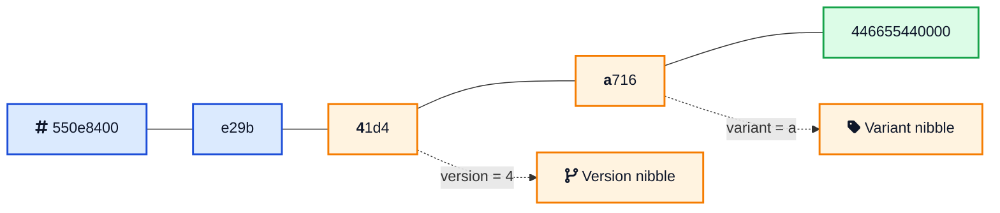
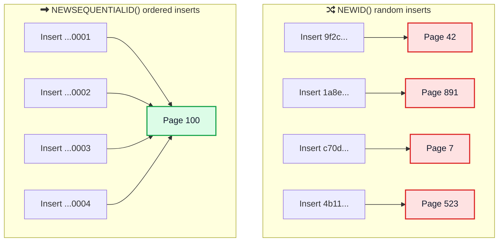

If you have worked with .NET, SQL Server, or the Windows registry, you have seen strings like `550e8400-e29b-41d4-a716-446655440000` everywhere. They show up as primary keys, COM class IDs, project identifiers, and config values. That is a GUID, and most developers copy and paste them for years without knowing what the pieces actually mean.

The good news is that a GUID is simpler than it looks, and there is one fact that clears up most of the confusion right away: a GUID is the same thing as a UUID. Microsoft just calls it by a different name.

This guide explains what a GUID is, how the 32 hex digits are laid out, how it differs from a UUID in name only, and how to generate a new GUID correctly in C#, SQL Server, and PowerShell.



## <i class="fas fa-question-circle"></i> What Is a GUID?

GUID stands for **Globally Unique Identifier**. It is a 128-bit value that you can generate on any machine, at any time, with almost no chance of ever producing the same value twice. That lets many systems create IDs independently without asking a central database for the next number.

Microsoft [describes a GUID](https://learn.microsoft.com/en-us/dotnet/api/system.guid){:target="_blank"} as "a 128-bit integer (16 bytes) that can be used across all computers and networks wherever a unique identifier is required." Here is a GUID example:

```
550e8400-e29b-41d4-a716-446655440000
```

That is 32 hexadecimal digits split into five groups by hyphens. Behind the scenes it is just 16 bytes.

The single most useful thing to know: **a GUID is a UUID**. GUID is the term Microsoft uses in .NET, SQL Server, COM, and Windows. UUID (Universally Unique Identifier) is the term used in the standard, [RFC 9562](https://datatracker.ietf.org/doc/html/rfc9562){:target="_blank"}, and in languages like Java, Python, and Go. Same 128 bits, same layout, different name. Once you know that, every UUID article on the internet applies to GUIDs too.

## <i class="fas fa-project-diagram"></i> The GUID Format and Structure

The `8-4-4-4-12` pattern is not random. Those five groups map onto the 16 bytes like this:

<div style="display: flex; margin: 25px 0; border-radius: 8px; overflow: hidden; font-family: -apple-system, BlinkMacSystemFont, 'Segoe UI', Roboto, sans-serif; font-size: 13px; box-shadow: 0 2px 8px rgba(0,0,0,0.1); text-align: center;">
  <div style="flex: 8; background: #3b82f6; color: white; padding: 14px 6px; font-weight: 600;">
    <div>8</div>
    <div style="font-size: 11px; opacity: 0.9; margin-top: 4px;">4 bytes</div>
  </div>
  <div style="flex: 4; background: #2563eb; color: white; padding: 14px 6px; font-weight: 600;">
    <div>4</div>
    <div style="font-size: 11px; opacity: 0.9; margin-top: 4px;">2 bytes</div>
  </div>
  <div style="flex: 4; background: #f59e0b; color: white; padding: 14px 6px; font-weight: 600;">
    <div>4</div>
    <div style="font-size: 11px; opacity: 0.9; margin-top: 4px;">version</div>
  </div>
  <div style="flex: 4; background: #d97706; color: white; padding: 14px 6px; font-weight: 600;">
    <div>4</div>
    <div style="font-size: 11px; opacity: 0.9; margin-top: 4px;">variant</div>
  </div>
  <div style="flex: 12; background: #10b981; color: white; padding: 14px 6px; font-weight: 600;">
    <div>12</div>
    <div style="font-size: 11px; opacity: 0.9; margin-top: 4px;">6 bytes</div>
  </div>
</div>

Two of those hex digits carry meaning instead of just data:

- **The version digit** is the first character of the third group. In `550e8400-e29b-41d4-a716-446655440000` it is the `4`, so this is a version 4 GUID.
- **The variant digit** is the first character of the fourth group. Here it is `a`. For RFC 9562 GUIDs this digit is always `8`, `9`, `a`, or `b`.



Everything else is the actual identifier data: random bits, a timestamp, or both, depending on the version.

## <i class="fas fa-balance-scale"></i> GUID vs UUID: Same Thing, Different Name

Because people search for both terms, it helps to be blunt about the relationship.

| | GUID | UUID |
|---|------|------|
| Full name | Globally Unique Identifier | Universally Unique Identifier |
| Bits | 128 | 128 |
| Format | `8-4-4-4-12` hex | `8-4-4-4-12` hex |
| Standard | RFC 9562 | RFC 9562 |
| Used in | .NET, SQL Server, COM, Windows | Java, Python, Go, JavaScript, Postgres |
| Technical difference | None | None |

The only real differences are the name and the ecosystem you usually hear it in. A `Guid` in C# and a `uuid` column in PostgreSQL hold the exact same kind of value. If you want a deeper comparison of the modern alternatives, the [ULID guide](/ulid-guide/){:target="_blank"} and the [Snowflake ID guide](/snowflake-id-guide/){:target="_blank"} cover two popular ID schemes that compete with GUIDs.



## <i class="fas fa-code-branch"></i> GUID Versions You Will Actually See

RFC 9562 defines several versions. In practice you only meet a few.

| Version | How it is built | Sortable | Where you see it |
|---------|-----------------|----------|------------------|
| v1 | Timestamp plus MAC address | Roughly | Older COM and Windows IDs |
| v4 | 122 random bits | No | The default everywhere, `Guid.NewGuid()` |
| v7 | 48-bit timestamp plus random | Yes | New database keys, `Guid.CreateVersion7()` |

**Version 4** is what `Guid.NewGuid()` returns. Microsoft confirms it [creates a version 4 GUID](https://learn.microsoft.com/en-us/dotnet/api/system.guid.newguid){:target="_blank"} with 122 bits of strong entropy. It is random, so it is great for uniqueness but useless for sorting.

**Version 7** is the interesting newcomer. It puts a millisecond timestamp in the high bits so the values sort by creation time, which makes them far better as database keys. .NET 9 added a built-in [`Guid.CreateVersion7()`](https://learn.microsoft.com/en-us/dotnet/api/system.guid.createversion7){:target="_blank"} method for exactly this reason.

**Version 1** still turns up in old Windows and COM identifiers. It mixes a timestamp with the machine's network card address, which is why it can leak where and when it was made.

## <i class="fas fa-laptop-code"></i> How to Generate a GUID

You never build a GUID by hand. Every platform has a one-liner to generate a new GUID.

### Generate a GUID in C#

C# and .NET are where most developers meet GUIDs. Call `Guid.NewGuid()` to create a new random GUID:

```csharp
// Random version 4 GUID, the everyday default
Guid id = Guid.NewGuid();          // 550e8400-e29b-41d4-a716-446655440000

// The all-zero value, often used as "no value yet"
Guid empty = Guid.Empty;           // 00000000-0000-0000-0000-000000000000

// Time-sortable version 7 GUID (.NET 9 and later)
Guid sortable = Guid.CreateVersion7();

// Parse a string back into a Guid
Guid parsed = Guid.Parse("550e8400-e29b-41d4-a716-446655440000");
```

C# can print a GUID in five [standard formats](https://learn.microsoft.com/en-us/dotnet/api/system.guid.tostring){:target="_blank"}. This trips people up, so it is worth memorizing:

| Specifier | Output |
|-----------|--------|
| `N` | `550e8400e29b41d4a716446655440000` |
| `D` (default) | `550e8400-e29b-41d4-a716-446655440000` |
| `B` | `{550e8400-e29b-41d4-a716-446655440000}` |
| `P` | `(550e8400-e29b-41d4-a716-446655440000)` |
| `X` | `{0x550e8400,0xe29b,0x41d4,{0xa7,0x16,...}}` |

The brace form `B` is the one you see in the Windows registry and many config files.

### Generate a GUID in SQL Server

SQL Server stores GUIDs in the `uniqueidentifier` data type and gives you two functions to create a new GUID. `NEWID()` returns a random value, and `NEWSEQUENTIALID()` returns a sequential one:

```sql
-- Random GUID, like Guid.NewGuid()
SELECT NEWID();

-- Sequential GUID, only valid as a column default
CREATE TABLE Orders (
    Id UNIQUEIDENTIFIER DEFAULT NEWSEQUENTIALID() PRIMARY KEY,
    CreatedAt DATETIME2 DEFAULT SYSUTCDATETIME()
);
```

### Generate a GUID in PowerShell

PowerShell has a built-in `New-Guid` cmdlet:

```powershell
New-Guid                 # 550e8400-e29b-41d4-a716-446655440000
[guid]::NewGuid()        # same thing, calling the .NET method directly
```

### Generate a GUID in JavaScript

JavaScript has a native generator, and since a GUID and a UUID are the same value, this gives you a GUID too:

```javascript
crypto.randomUUID();     // "550e8400-e29b-41d4-a716-446655440000"
```

### Generate a GUID online

If you just need a few values without writing any code, you can [generate a GUID online](/tools/uuid-generator/){:target="_blank"}, choose version 4 or version 7, bulk generate, and copy them straight into your config or test data.



## <i class="fas fa-database"></i> GUIDs as a SQL Server Primary Key

This is where most GUID performance trouble starts, so it deserves its own section.

A `UNIQUEIDENTIFIER` column makes a perfectly valid primary key, and GUIDs are tempting because every app server can mint one without a round trip to the database. The problem is the **clustered index**. In SQL Server, the clustered index sets the physical order of the rows, and by default the primary key is the clustered index.

When you fill that key with random `NEWID()` values, every insert lands at a random spot in the index.



Random inserts force SQL Server to split full pages to make room in the middle, which causes heavy fragmentation, larger indexes, and slower writes over time. The fix is to make the values increase over time:

- **`NEWSEQUENTIALID()`** generates GUIDs that are [greater than any previous value](https://learn.microsoft.com/en-us/sql/t-sql/functions/newsequentialid-transact-sql){:target="_blank"} on that machine, so new rows append near the end of the index. The catch is that it only works as a column `DEFAULT`, and the sequence can reset after a Windows restart.
- **A version 7 GUID** from `Guid.CreateVersion7()` gives you the same ordered-insert benefit, but generated in your app code instead of the database.

This is the same B-tree behavior that affects every random key. The mechanics are explained in detail in [Database Indexing Explained](/database-indexing-explained/){:target="_blank"} and the [B-tree data structure guide](/data-structures/b-tree/){:target="_blank"}.

**Store it the compact way.** A GUID is 16 bytes. The native `uniqueidentifier` type stores exactly that. Storing the text form as `CHAR(36)` more than doubles the size and slows every comparison, so avoid it unless you have a strong reason. For how pages and rows are actually written to disk, see [how databases store data internally](/how-databases-store-data-internally/){:target="_blank"}.



## <i class="fas fa-exclamation-triangle"></i> Common GUID Gotchas

These are the details that bite teams in production.

### The empty GUID is not a real ID

`00000000-0000-0000-0000-000000000000`, exposed as `Guid.Empty`, is a valid value that means "nothing here." It is easy to save an empty GUID by accident when a variable was never assigned. Treat it as a missing value, never as a real key, and consider rejecting it at your validation layer.

### GUIDs are not secrets

A GUID is built to be unique, not unguessable. Sequential GUIDs from `NEWSEQUENTIALID()` are predictable on purpose, and Microsoft warns that you can [guess the next value](https://learn.microsoft.com/en-us/sql/t-sql/functions/newsequentialid-transact-sql){:target="_blank"} and reach data tied to it. Even `Guid.NewGuid()` is documented as not suitable for cryptographic use. For password resets, session IDs, and API keys, use a dedicated random token.

### Case and braces cause comparison bugs

GUIDs are case-insensitive, but string comparisons are not. If one system stores `550E8400...` uppercase and another stores it lowercase, a naive string match fails. The same goes for the brace `{...}` and parenthesis `(...)` forms. Compare them as real GUID types, or normalize the string before you compare.

### Version 1 can leak machine and time data

Old version 1 GUIDs embed a timestamp and the network card address of the machine that made them. If you generate IDs with a v1 library and expose them publicly, you may be leaking more than you intend. Prefer v4 for random IDs or v7 for sortable ones.

## <i class="fas fa-check-circle"></i> When to Use a GUID (and When Not To)

**A GUID is a good fit when:**

- You need to create IDs on many machines or clients without coordination.
- You want to merge data from different systems without key collisions.
- You are working in the Microsoft stack where `Guid` and `uniqueidentifier` are the natural types.
- You need an ID before the row is saved, for example to set up relationships in code.

**Reach for something else when:**

- The ID must be unguessable. Use a cryptographically secure random token.
- You need the smallest possible key and a single database can hand out integers. A `BIGINT` identity is smaller and faster.
- You want short, readable, URL-friendly IDs. A [ULID](/ulid-guide/){:target="_blank"} is 26 characters instead of 36.
- You are at very high write throughput on known nodes, where a [Snowflake ID](/snowflake-id-guide/){:target="_blank"} packs more into 64 bits.

## <i class="fas fa-tasks"></i> Key Takeaways

**1. A GUID is a UUID.** Same 128 bits, same `8-4-4-4-12` format, same RFC 9562. GUID is just the Microsoft name.

**2. Two digits carry meaning.** The first digit of the third group is the version, and the first digit of the fourth group is the variant.

**3. `Guid.NewGuid()` is random version 4.** Use `Guid.CreateVersion7()` on .NET 9 and later when you want a time-sortable key.

**4. Mind the SQL Server clustered index.** Random `NEWID()` fragments it. `NEWSEQUENTIALID()` or a version 7 GUID keeps inserts ordered, and the `uniqueidentifier` type stores all 16 bytes compactly.

**5. GUIDs are identifiers, not credentials.** Do not use them where the value needs to be secret.

GUIDs are one of the most common building blocks in software, and once you can read the format and pick the right version, they stop being a mysterious blob and become a tool you control. Generate a few and decode them to see the structure for yourself.



---

*Related reading: [ULID Explained](/ulid-guide/){:target="_blank"} for a shorter, sortable alternative, [How Snowflake IDs Work](/snowflake-id-guide/){:target="_blank"} for 64-bit distributed IDs, [Database Indexing Explained](/database-indexing-explained/){:target="_blank"} for why key order matters, and [How Databases Store Data Internally](/how-databases-store-data-internally/){:target="_blank"} for the page mechanics. Try the [UUID and GUID Generator](/tools/uuid-generator/){:target="_blank"} and [Snowflake ID Decoder](/tools/snowflake-decoder/){:target="_blank"} tools.*

*References: [Guid Struct (Microsoft Learn)](https://learn.microsoft.com/en-us/dotnet/api/system.guid){:target="_blank"}, [Guid.NewGuid](https://learn.microsoft.com/en-us/dotnet/api/system.guid.newguid){:target="_blank"}, [Guid.CreateVersion7](https://learn.microsoft.com/en-us/dotnet/api/system.guid.createversion7){:target="_blank"}, [NEWSEQUENTIALID (T-SQL)](https://learn.microsoft.com/en-us/sql/t-sql/functions/newsequentialid-transact-sql){:target="_blank"}, [RFC 9562](https://datatracker.ietf.org/doc/html/rfc9562){:target="_blank"}, and [Taming the UUID Beast (pacyfist.dev)](https://www.pacyfist.dev/posts/taming-the-uuid-beast-how-to-avoid-clustered-index-fragmentation-in-sql-server/){:target="_blank"}.*
