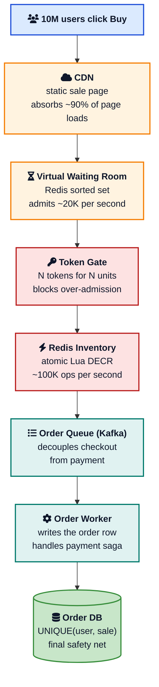
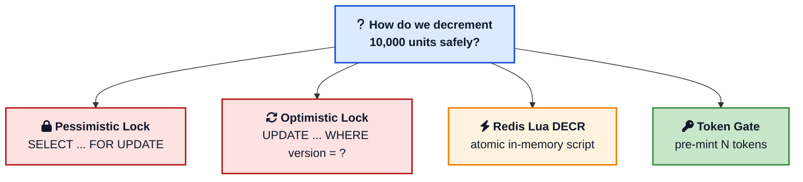
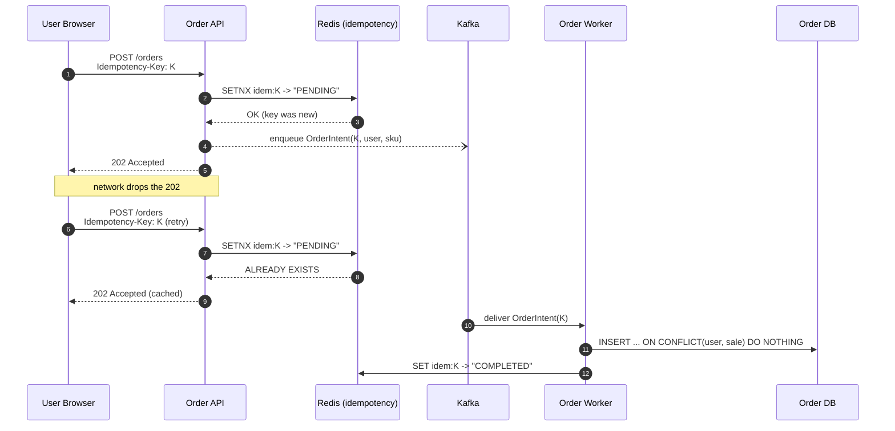
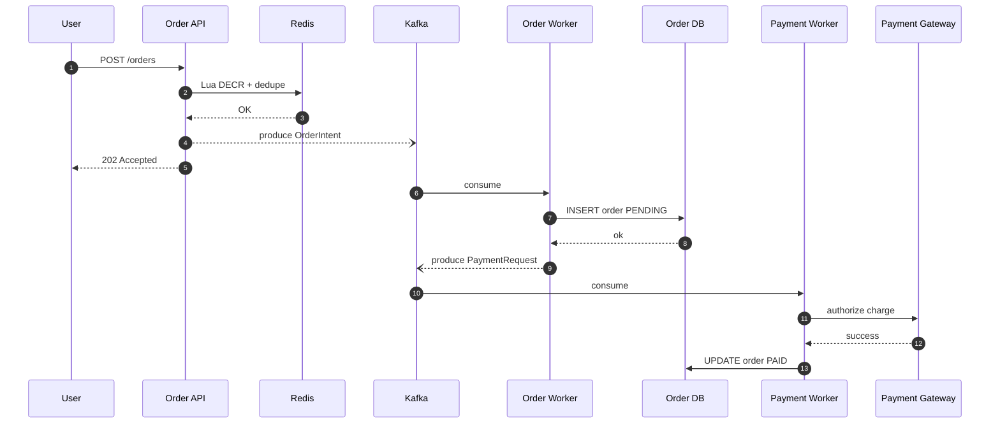
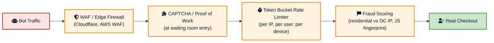
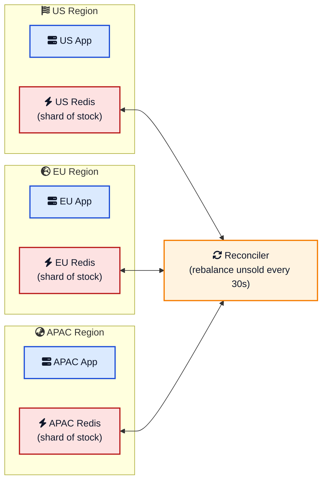

Twelve PM. Phone screen says **launch in 5 seconds**. Ten million people stare at a button. Ten thousand units of a new phone are on the other side of it. Two minutes later the sale is **sold out** and the product page is a screenshot in a thousand reaction tweets. Some people got the phone. Most people got an apology email. A few people got two phones and a charge on their card for both.

That is a **flash sale** working. Now imagine the version that does not work: the database collapses under the spike, the page returns 502s, the same item is sold to three different people, and the operations team is on a war room call before the first item ships. That is what [Flipkart looked like during Big Billion Days in 2014](https://stories.flipkart.com/tbbd-throwback-the-big-billion-day-2015/){:target="_blank" rel="noopener"}, what [Ticketmaster looked like during the Taylor Swift Eras Tour](/ticket-booking-system-design/){:target="_blank" rel="noopener"} sale in 2022, and what most engineering teams discover the hard way the first time they run a real flash sale.

This post is a working answer to **how to design a flash sale system** that you can defend in an interview, in a brown-bag, or in a production planning doc. It is not theoretical. We will walk through requirements, capacity, the waiting room, the token gate, the Redis Lua script that does the actual stock decrement, idempotency for duplicate orders, the async order pipeline, caching, rate limiting, multi region, and the failure modes that show up at minute one of every sale.

If you want a refresher on the building blocks first, the [System design cheat sheet](/system-design-cheat-sheet/){:target="_blank" rel="noopener"}, [Caching strategies](/caching-strategies-explained/){:target="_blank" rel="noopener"}, [Database locks explained](/database-locks-explained/){:target="_blank" rel="noopener"}, and [Role of queues in system design](/role-of-queues-in-system-design/){:target="_blank" rel="noopener"} cover most of what we will reach for.

## What a Flash Sale System Actually Has To Do

A flash sale has three promises. Everything else is a feature on top.

1. **Never sell more than the available stock.** Selling fewer is fine. Selling unit 10,001 of a 10,000 unit batch is not.
2. **Charge each winning buyer exactly once.** No duplicate orders, no duplicate payments.
3. **Stay up during the spike.** The site cannot 502 the moment the timer hits zero.

That sounds modest. The hard part is **the shape of the traffic**. A typical e-commerce checkout sees a smooth load with a few peaks. A flash sale sees a **vertical wall**: traffic at noon minus one second is normal, traffic at noon is fifty times normal, and traffic at noon plus thirty seconds is back to normal because the sale is over.





Each box on that diagram drops the next box's traffic by an order of magnitude. The CDN turns a 10 million spike into a 1 million origin spike. The waiting room turns it into 100k per second. The token gate clamps it at the inventory size. The Redis DECR cuts it again. By the time orders reach the database, the database sees a steady 1k writes per second instead of 10 million per second. That is the whole trick.

## Functional and Non Functional Requirements

In an interview, the first five minutes are about agreeing on what you are building.

**Functional requirements**

- Show a sale countdown page that is fast to load.
- At sale start, allow eligible users to attempt to buy.
- Reserve and confirm exactly the available stock.
- Charge each winning buyer once.
- Notify winners and losers within minutes.
- Enforce a per-user purchase limit (usually one unit per account).

**Non functional requirements**

- **Availability.** The page and the checkout must not 5xx during the spike.
- **Latency.** P99 from click to "you are in line" under 300 ms, click to "order accepted" under 2 seconds.
- **Correctness.** Never sell more than the stock count. Never accept two orders from the same user for the same sale.
- **Fairness.** Within the limits of the system, users who arrive at the same time should have roughly equal chances. This rules out FIFO-by-IP because bots optimize for that.
- **Auditability.** Every order, accepted or rejected, must be traceable in logs and analytics.

These constraints drive almost every decision below.

## Capacity Estimation

Numbers turn opinions into engineering. A common interview prompt is "10,000 phones, 10 million expected buyers, sale opens at 12:00:00 sharp."

| Quantity | Value | How it is computed |
|---|---|---|
| Concurrent users at sale start | 10,000,000 | given |
| Stock | 10,000 | given |
| Read to write ratio | 1,000 : 1 | 10M view : 10K orders |
| Sale window | ~60 seconds | typical for high-demand drops |
| Peak page views per second | ~500,000 | 10M views over 20 sec ramp |
| Peak buy attempts per second | ~200,000 | half of viewers click Buy |
| Peak order writes per second | ~1,000 | clamp at inventory size / sale window |
| Order row size | ~500 bytes | id + user + sku + payment ref + ts |
| Order storage for the sale | ~5 MB | trivially small |
| Notification fan out | 10M emails | over 5 minutes async |

Three takeaways from these numbers:

1. The **read path** dominates. 500k page views per second is what kills you if the product page is not cached at the edge.
2. The **write path** is small in absolute terms (1k inserts per second) but **lethal** if all those inserts target the same inventory row.
3. The **fan-out** is bigger than the sale: 10 million "sorry" emails is its own batch job. Sizing the notification pipeline is its own design problem, covered in [Notification system design](/notification-system-design/){:target="_blank" rel="noopener"}.

These are also the numbers you cite when an interviewer asks "why did you pick that?" later. If you cannot quote a number, you cannot defend a choice.

## API Surface

The user-facing API is small. Three endpoints carry the sale.

```sh
GET /sales/:sale_id
Cache-Control: public, max-age=10

200 OK
{
  "sale_id": "iphone-drop-2026-05",
  "starts_at": "2026-05-16T12:00:00Z",
  "ends_at":   "2026-05-16T12:30:00Z",
  "sku_id":    "iphone-17-pro-256gb",
  "stock_available_hint": 10000,
  "per_user_limit": 1
}
```

<br>

```sh
POST /sales/:sale_id/enter
Authorization: Bearer <token>

202 Accepted
{
  "queue_token": "qt_eyJhbGciOiJI...",
  "estimated_wait_ms": 4200
}
```

<br>

```sh
POST /sales/:sale_id/orders
Authorization: Bearer <token>
Idempotency-Key: 8e1f2a90-...-9cc1
X-Queue-Token: qt_eyJhbGciOiJI...

202 Accepted
{
  "order_id": "ord_01HX...",
  "status": "PENDING_PAYMENT"
}
```

Notice three things in the order create response.

- The status code is `202 Accepted`, not `201 Created`. The order is **not** in the database yet. It is on a queue.
- The `Idempotency-Key` header is required. Without it, the server rejects with `400`. We borrow the pattern straight from [how Stripe prevents double payments](/how-stripe-prevents-double-payment/){:target="_blank" rel="noopener"}.
- The `X-Queue-Token` is the proof that the user passed the waiting room. The order service rejects any request without a valid, unexpired, single-use queue token.

## The Hardest Problem: Preventing Oversell

This is the part where engineers get tripped up. Overselling is when two requests see one unit in stock and both succeed, creating two orders for the same item. There are four production patterns to prevent it. Each makes different trade-offs.



### Pattern 1: Pessimistic Lock on the Row

The textbook answer.

```sql
BEGIN;
SELECT stock FROM inventory
  WHERE sku_id = 'iphone-17-pro-256gb'
  FOR UPDATE;

-- application reads stock, decides
UPDATE inventory SET stock = stock - 1
  WHERE sku_id = 'iphone-17-pro-256gb';
COMMIT;
```

`FOR UPDATE` holds a row lock until the transaction commits. Every other order request blocks. It is correct. It is also a **catastrophic bottleneck** at 1,000 writes per second because every order serializes on one row. Lock wait queues grow, connection pools fill, and the database tips over before the inventory does. We covered the mechanics in detail in [Database locks explained](/database-locks-explained/){:target="_blank" rel="noopener"}.

Use pessimistic locks for **low-contention** inventory updates (warehouse adjustments, manual writes). Do not use them on the sale hot path.

### Pattern 2: Optimistic Lock With a Version Column

Less blocking. Still imperfect.

```sql
UPDATE inventory
  SET stock = stock - 1, version = version + 1
  WHERE sku_id = 'iphone-17-pro-256gb'
    AND version = :read_version
    AND stock > 0;
```

If the `WHERE` clause matches, you got the unit. If `UPDATE` returns zero rows, someone else won the race and the application retries by re-reading the version. Under low contention this is fast because nothing blocks. Under flash sale contention every retry is more load, and the system degrades into a retry storm where 1,000 successful writes generate 100,000 failed attempts. That is its own thundering herd, which we covered in [Thundering herd problem explained](/thundering-herd-problem/){:target="_blank" rel="noopener"}.

A small but important variant uses a single statement and skips the read:

```sql
UPDATE inventory
  SET stock = stock - 1
  WHERE sku_id = 'iphone-17-pro-256gb'
    AND stock > 0;
-- check rows affected; 0 means out of stock
```

This is the **safest pure-SQL** form of the pattern. The `WHERE stock > 0` predicate is evaluated atomically by the database, so two requests cannot both win the last unit. It is still bound by the maximum write rate the row's index page can sustain, which on a hot row in PostgreSQL or MySQL is around 5,000 to 10,000 updates per second before lock waits and WAL pressure start to bite.

### Pattern 3: Redis Atomic DECR With a Lua Script

This is what most production flash sale systems do.

A single Redis node executes each command (and each Lua script) atomically. There is no interleaving inside a script. That gives us a race-free decrement that runs at 100,000 ops per second on commodity hardware.

```lua
-- KEYS[1]  = stock counter, e.g. "stock:iphone-17-pro-256gb"
-- KEYS[2]  = per-user dedupe set, e.g. "bought:iphone-17-pro-256gb"
-- ARGV[1]  = user id
-- ARGV[2]  = per-user limit
local stock = tonumber(redis.call('GET', KEYS[1]))
if not stock or stock <= 0 then
  return -1                       -- sold out
end
local already = redis.call('SISMEMBER', KEYS[2], ARGV[1])
if already == 1 then
  return -2                       -- per-user limit hit
end
redis.call('DECR', KEYS[1])
redis.call('SADD', KEYS[2], ARGV[1])
return 1                          -- you are in
```

In Python with `redis-py`:

```python
script = redis.register_script(LUA_SOURCE)
result = script(keys=[f"stock:{sku}", f"bought:{sku}"],
                args=[user_id, 1])
if result == 1:
    enqueue_order(sale_id, user_id, sku, idempotency_key)
    return 202
elif result == -2:
    return 409, "already purchased"
else:
    return 409, "sold out"
```

What we get for free with this pattern:

- **Atomicity.** Stock check, dedupe check, decrement, and dedupe insert are one operation.
- **Per-user limit** baked in. The Redis set is the source of truth for "this user bought one in this sale".
- **Sub-millisecond** latency. The slow part is now the network, not the database.
- **Bounded blast radius.** If the database is slow or down, the inventory decision is unaffected.

The catch is that **Redis lives in memory**. If the Redis server crashes before saving to disk or copying to a backup, the decrement is lost and the count can go wrong. Three things keep that from hurting:

- **Save to disk often.** Turn on AOF with `appendfsync everysec` so Redis writes a log entry every second. Worst-case loss is one second of decrements.
- **Keep a hot copy.** Run Redis Sentinel or Cluster with a follower that gets every write. If the primary dies, the follower takes over and the count survives.
- **Check the math.** A background job every few minutes compares the Redis counter with the orders in the database. If they disagree, you get an alert and a chance to fix it before customers notice.

### Pattern 4: Token Gate With Pre-Minted Tokens

The strongest form. Overselling becomes mathematically impossible.

Before the sale opens, mint exactly **N tokens for N units** and put them in a Redis list:

```bash
RPUSH tokens:iphone-17-pro-256gb tok_001 tok_002 ... tok_10000
```

At sale time, each buy attempt does an atomic `LPOP`. Only token holders are allowed to call `POST /orders`.

```python
token = redis.lpop(f"tokens:{sku}")
if token is None:
    return 409, "sold out"
return 200, {"order_token": token}
```



Properties:

- The number of winners is **bounded by the size of the list**. You literally cannot oversell because there are no extra tokens to hand out.
- Tokens are opaque. A bot that wins a token still has to use it within a TTL (we sign tokens with HMAC and a 30-second expiry), so warehousing tokens for resale is hard.
- The token list can be sharded across many Redis keys (`tokens:iphone:shard:0` through `:shard:31`) to spread the hot key across the cluster. Each shard holds `total / 32` tokens.

This design converts overselling prevention into a token issuance problem, and it is the design large e-commerce platforms have converged on over time. The trade-off is operational: the token list has to be pre-populated correctly before each sale, and a Redis failover that drops the list means handing out duplicates.

### Side By Side

| Pattern | Throughput | Correctness | Failure mode | When to use |
|---|---|---|---|---|
| Pessimistic lock | 100s/sec | Strict | Lock waits, DB tip-over | Low contention, audits |
| Optimistic SQL with `WHERE stock > 0` | 5k to 10k/sec | Strict | Retry storms | Small to mid sales |
| Redis Lua DECR | 100k/sec | Strict (single node) | Redis primary loss without sync replica | Most real flash sales |
| Pre-minted token gate | 100k/sec, shardable | Mathematically strict | Token list corruption | Largest, most adversarial sales |

For a system design interview, the right answer is: "Redis Lua DECR for the common case, sharded token gate for sales above 100k orders per second or with serious bot pressure, and the database `UNIQUE` constraint as the safety net for both."

## Preventing Duplicate Orders With Idempotency

Overselling is the inventory bug. **Duplicate orders** are the user bug. They happen for the same reason that [duplicate Stripe charges happen](/how-stripe-prevents-double-payment/){:target="_blank" rel="noopener"}: networks are unreliable, clients retry, queues deliver at least once, and humans double-click.



The pattern uses three layers of defense, top to bottom.

1. **Client-side single-flight.** The browser disables the Buy button after the first click and shows a spinner. Necessary but not sufficient because the network can still drop the response.
2. **Server-side idempotency key.** Every order request includes an `Idempotency-Key` header. The server stores `(key, user_id, sale_id) -> request fingerprint` in Redis with a TTL longer than the sale window (typically one hour). If a request arrives with a key the server has already seen, the server returns the cached response.
3. **Database unique constraint.** A composite unique index on `(user_id, sale_id)` (or `(idempotency_key)`) makes the duplicate insert physically impossible. If you ever see a `UNIQUE` violation in production, treat it as a bug somewhere upstream, not as a normal error.

The schema looks like this:

```sql
CREATE TABLE orders (
    id              BIGSERIAL PRIMARY KEY,
    idempotency_key TEXT NOT NULL,
    user_id         BIGINT NOT NULL,
    sale_id         TEXT NOT NULL,
    sku_id          TEXT NOT NULL,
    status          TEXT NOT NULL,
    amount_cents    BIGINT NOT NULL,
    created_at      TIMESTAMPTZ NOT NULL DEFAULT NOW(),
    UNIQUE (idempotency_key),
    UNIQUE (user_id, sale_id)
);
```

`INSERT ... ON CONFLICT DO NOTHING` is the friend of every flash sale developer. It turns "I am not sure if this is a duplicate" into "the database will tell me".

## The Virtual Waiting Room

The single highest-leverage component in the system. Without it, 10 million people show up at noon and the application tier dies. With it, the application tier sees a steady stream of admitted users.

```mermaid
flowchart LR
    Users["fa:fa-users Arriving Users"]
    WRApp["fa:fa-hourglass-start Waiting Room Service"]
    ZSet["fa:fa-list-ol Redis ZSET<br/>(score = random)"]
    Admit["fa:fa-door-open Admission Worker<br/>(every 1 sec)"]
    Token["fa:fa-ticket Signed Admission Token<br/>(JWT, 60 sec TTL)"]
    App["fa:fa-shopping-cart Real Checkout"]

    Users --> WRApp --> ZSet
    ZSet --> Admit --> Token --> App

    classDef u fill:#dbeafe,stroke:#1d4ed8,stroke-width:2px,color:#0f172a
    classDef wr fill:#fff3e0,stroke:#f57c00,stroke-width:2px,color:#0f172a
    classDef data fill:#fde2e2,stroke:#b91c1c,stroke-width:2px,color:#0f172a
    classDef ok fill:#c8e6c9,stroke:#388e3c,stroke-width:2px,color:#0f172a
    class Users u
    class WRApp,Admit wr
    class ZSet data
    class Token,App ok
```



The mechanics:

1. **Add to queue.** Every arriving user is added to a Redis sorted set with `ZADD waiting:<sale> <random_score> <user_id>`. The random score is critical: a timestamp score lets bots win by arriving microseconds earlier, while a random score gives every user the same chance.
2. **Estimate position.** `ZRANK` gives the user's position. The client polls every few seconds for an updated position and an estimated wait.
3. **Admit in batches.** A worker pops the bottom N users every second with `ZPOPMIN`. The chosen N is the rate the downstream checkout can sustain (say, 20k per second).
4. **Issue a signed token.** Each admitted user receives a JWT or HMAC-signed token with a 60-second expiry. The order API verifies the signature and rejects any request without a valid, unexpired token. This is what stops a user from sharing or replaying their admission.
5. **Cap the room.** If the sorted set grows past a soft limit (say, 20 million entries), the waiting room returns a friendly "we are at capacity, try again in a minute" instead of accepting more users. This is the difference between a slow site and a dead site.

The pattern is the standard one across [Ticketmaster, Nike SNKRS, Supreme, and Shopify Plus](https://shopify.engineering/surviving-flashes-of-high-write-traffic-using-scriptable-load-balancers-part-i){:target="_blank" rel="noopener"} for shop drops. Shopify in particular published a long write-up on how they built **request buffering and a checkout throttle** at the load balancer with Lua scripts in their edge tier, which is the same idea applied one layer up.

## The Async Order Pipeline

The cardinal sin in a flash sale is doing real work synchronously inside the user request. The user request should do:

1. One Redis Lua call (decrement, dedupe).
2. One Kafka produce (the order intent).
3. Return 202.

Everything else is asynchronous.



Why this shape works at flash sale scale:

- **Bounded request latency.** The user sees a response in single-digit milliseconds because the request only touches Redis and Kafka.
- **Backpressure for free.** If the order workers fall behind, the queue grows. The user-facing API is unaffected.
- **Independent scaling.** Order workers and payment workers scale on queue depth, not on user request rate.
- **Crash recovery.** A consumer that dies mid-process leaves the message un-acknowledged. Kafka redelivers, the worker hits the `UNIQUE` constraint, recognizes "already processed", and acknowledges. No duplicate orders, no lost orders.

The choice of message broker matters. We compared the options in [Kafka vs RabbitMQ vs SQS](/kafka-vs-rabbitmq-vs-sqs/){:target="_blank" rel="noopener"}: Kafka for the highest throughput with replay, RabbitMQ for low-volume control flows, SQS for "we just want a managed queue and do not want to operate it". For a flash sale, Kafka is the default because the spike is high throughput and you want a durable log of every order intent for forensics.

If you do not want a separate queue at all, the [transactional outbox pattern](/transactional-outbox-pattern/){:target="_blank" rel="noopener"} lets the order API write the intent to a small `outbox` table in the same transaction as the Redis confirmation, and a [Debezium-style](/debezium-outbox-postgres-database-impact/){:target="_blank" rel="noopener"} change data capture process streams the outbox to Kafka. Slightly more moving parts, but it guarantees the order intent is never lost between Redis and Kafka.

## Caching: Where Most of the Traffic Disappears

A flash sale page has a brutally simple cache profile.

| Asset | TTL | Why |
|---|---|---|
| Static HTML, CSS, images, JS bundle | 1 hour on CDN | Identical for every viewer |
| Sale metadata JSON (`/sales/:id`) | 5 to 10 seconds on CDN | Slightly stale stock hint is fine |
| Stock counter JSON (`/sales/:id/stock`) | 1 second, edge SWR | Users want a quick "in stock / out" signal |
| User-specific state | not cached | Per-user, per-request |

The single biggest win is **caching the countdown page on the CDN**. Before the sale opens, 10 million people refresh the page hoping the button activates. If the page is on Cloudflare, Fastly, or CloudFront with a 10 second TTL, your origin sees a few thousand requests, not millions. The same pattern shows up in [how Cloudflare handles redirect-heavy and event-driven workloads](https://blog.cloudflare.com/){:target="_blank" rel="noopener"}.

A small but important detail: the **stock indicator** on the page (the "1,247 left" string) is a different problem from the actual stock decrement. It is a hint, not a contract. A short-TTL CDN cache on `/sales/:id/stock` is fine, and the official answer to "is it in stock" is the response of `POST /orders`. Mixing the two creates a worse user experience because users see the page say "in stock" and the order say "sold out" milliseconds later. Set expectations on the page: "Stock updates may lag by a few seconds. Final availability is confirmed at checkout."

Hot key problems on Redis are the other side of caching. When 200k requests per second hit a single key, even Redis sweats. Three defenses:

1. **Shard the counter.** Split a single SKU's stock into 16 or 32 sub-counters across keys (`stock:sku:0` through `stock:sku:31`). Each request picks a random shard, decrements there, and the application sums the shards for the "stock left" hint. Sold-out is per-shard, which is acceptable for the hint.
2. **Local read cache on the application server.** For the page-render call, an in-process 1-second cache on the stock value is enough. The order path still hits Redis, but the read-only path does not.
3. **Negative cache.** Once a shard returns zero, cache the "sold out" answer locally for 5 seconds so requests for that shard short-circuit. We discussed this defense in [Bloom filter](/data-structures/bloom-filter/){:target="_blank" rel="noopener"} and [Caching strategies explained](/caching-strategies-explained/){:target="_blank" rel="noopener"}.



## Rate Limiting and Bot Defense

Most "load" on a flash sale is bots, not customers. Sneaker drops are an arms race. Phone launches are scraped by resellers within seconds. The defenses are layered.



Defenses in order of impact:

- **Edge WAF.** Cloudflare, Fastly, or AWS WAF blocks the obviously bad requests at the network edge before they reach your origin. Rules to enable: rate per IP, rate per ASN (datacenter ranges are sus), bot score thresholds, header sanity checks.
- **CAPTCHA or proof of work at the waiting room.** A 200 ms client-side hash puzzle costs a human nothing and costs a bot operator a real fraction of a CPU. The math favors the defender.
- **Per-user, per-IP, per-device-fingerprint token bucket.** The algorithms are covered in [Dynamic rate limiter system design](/dynamic-rate-limiter-system-design/){:target="_blank" rel="noopener"}. The defaults: 1 enter per 5 seconds per IP, 1 order per sale per user, 60 enters per minute per device fingerprint.
- **Account-age gating.** A common attack is to mass-create accounts hours before the sale. Require account age greater than 14 days for participation in the highest-demand sales. Sneaker resale platforms have done this for years.
- **Reputation and fraud signals.** Score every request with the usual suspects: residential vs datacenter IP, browser fingerprint anomalies, missing TLS extensions, mismatched header order. Suspicious requests go to a "harder" waiting room with longer waits and a tougher CAPTCHA. Outright bad ones are 403'd.

None of these defenses is absolute. A motivated bot operator with a residential proxy network and aged accounts will get past most layers. The goal is not to eliminate bots, it is to **make the cost of buying a unit greater than the resale margin**. Once that ratio tips, the bots leave.

## Payments Without Holding the Sale Hostage

Payment is a separate failure domain. A slow payment gateway should not block the inventory counter, the order queue, or the next user's order.

The pattern is **reserve, charge, settle** as a [saga](/saga-pattern-distributed-transactions/){:target="_blank" rel="noopener"}.

1. **Reserve.** The order worker writes the order with status `PENDING_PAYMENT` and the stock is already decremented in Redis.
2. **Charge.** The payment worker calls the gateway (Stripe, Adyen, Razorpay) with an idempotency key derived from the order id. If the charge succeeds, the order moves to `PAID`. If the charge fails, the order moves to `PAYMENT_FAILED` and a **compensating transaction** increments the Redis stock counter back.
3. **Settle.** A reconciliation job runs every minute that compares Redis counters, order rows, and payment gateway events to detect any drift.

The compensating transaction is the part most teams skip and regret. When payment fails, the unit must go back into the pool, or every payment failure costs you one unit of unsold stock. We covered the pattern in [Saga pattern: distributed transactions](/saga-pattern-distributed-transactions/){:target="_blank" rel="noopener"}.

A practical refinement: **give the user a soft hold** rather than a permanent reservation. The order has a `reservation_expires_at` 10 minutes in the future. If payment is not complete by then, the order is auto-cancelled and the stock is returned. This is what every checkout flow you have ever used does, and it is the right answer here too.

## Multi Region Architecture

A global flash sale has two flavors of demand.

**Demand follows the timezone.** The sale opens at 12:00 local in each country, and the spike rolls around the globe. Pure sharding works: each region gets its own inventory pool sized to local demand, runs its own Redis and Kafka and database, and reconciles unsold stock at the end of the sale. This is what Shopify does for global retailers, and what Alibaba does for the [Singles' Day sale](https://www.alibabacloud.com/blog/594160){:target="_blank" rel="noopener"} at peaks of [hundreds of thousands of orders per second](https://resource.alibabacloud.com/article/1485.htm){:target="_blank" rel="noopener"}.

**Demand is simultaneous.** A globally limited drop (say, 5,000 units of a sneaker, total, world wide). Here you have a choice.



Two designs are reasonable:

1. **Sharded with periodic rebalancing.** Give 60 percent of stock to the busiest region, 30 to the second busiest, 10 to the third. Each region decrements locally with no cross-region calls. Every 30 seconds, a reconciler checks how much stock is left per region and moves units from cold regions to hot regions. Some users in cold regions will see "sold out" briefly while units are being rebalanced. This is usually fine.
2. **Single authoritative counter.** One region (typically the busiest) owns the Redis counter. The other regions proxy `DECR` calls to it. Strict global consistency at the cost of a cross-region round trip (50 to 200 ms) for every order. Usable only when the per-second order rate is low (limited edition art, NFT drops) and global fairness matters more than latency.

For a system design interview, name the trade-off explicitly: **sharded with rebalancing is the standard answer; single-authoritative is the right answer when the item is globally rare and per-region inventory partitioning is unacceptable.**

## Failure Modes and Their Fixes

The same patterns show up in every flash sale postmortem.

| Failure | Symptom | Fix |
|---|---|---|
| Redis primary loses memory mid-sale | Stock counter resets, oversell | AOF `appendfsync everysec`, Sentinel with sync replication to one follower, periodic reconcile against DB |
| Database connection pool exhausted | Order writes time out, queue piles up | Bound queue throughput to DB capacity; do not let workers pull faster than DB can write |
| Kafka broker unavailable | Order intents lost | Producer with `acks=all` and a retry buffer; fall back to writing intent to an outbox table |
| Hot key on inventory counter | Latency spike on the single Redis key | Shard the counter into 16 or 32 sub-keys |
| Thundering herd on cache miss | All app servers hit Redis for the same key at the same time | Single-flight per app server; short negative cache TTL |
| Bot wave drains stock in 50 ms | 99 percent of orders are bots | Tighter rate limit, account-age gating, harder CAPTCHA, fraud scoring |
| Payment gateway slow | Orders pile up in `PENDING_PAYMENT` | Reservation TTL of 10 min plus compensating transaction to return stock |
| User clicks Buy twice | Two order rows for one user | Idempotency key + `UNIQUE(user_id, sale_id)` |
| Multi-region replica lag | User sees "in stock" in one region, "sold out" in another | Tolerate the inconsistency; show "trying to reserve..." instead of "in stock"; reconcile every 30 sec |
| Sale opens 1 sec early due to clock skew | Some users get a head start | NTP, monotonic clocks on the admission worker; consider [hybrid logical clocks](/hybrid-logical-clock-distributed-systems/){:target="_blank" rel="noopener"} for global ordering |

A useful pattern for the worst-case fix is the [circuit breaker](/circuit-breaker-pattern-explained/){:target="_blank" rel="noopener"}: if the order DB throws errors at greater than 5 percent rate for 10 seconds, the circuit opens, the order API switches to "we are working on it, please retry in a moment", and the queue accumulates intent without losing it. Better than 502s.

## Comparison With Real Services

The architectures of large e-commerce flash sale systems are remarkably similar in shape and very different in scale.

| Platform | Peak transactions per second | Notable patterns |
|---|---|---|
| **Alibaba Singles' Day (Double 11)** | 580,000+ TPS in 2020 | Active-active multi-region, RocketMQ for async, pre-warmed local inventory caches, custom cell architecture |
| **Flipkart Big Billion Days** | 100,000+ orders per minute | Mirana scale-testing framework, separation of user-path and order-path systems, queue-based order processing |
| **Amazon Prime Day** | Multi-million sales per minute | Cell-based architecture, DynamoDB, internal "GameDay" chaos exercises before each event |
| **Xiaomi Mi.com flash sales** | 10s of thousands of units per minute | Pre-mint token gate per SKU, queue-based, deliberately small inventories to drive demand |
| **Ticketmaster Verified Fan** | 100s of thousands of users per show | Pre-sale verification reduces bot share; failure modes well documented during the [Eras Tour incident](/ticket-booking-system-design/){:target="_blank" rel="noopener"} |
| **Shopify Plus shop drops** | Tens of thousands of orders per second per shop | Edge-tier checkout throttle in Lua, request buffering, line-up app for waiting rooms |

The Flipkart engineering blog has an excellent postmortem of how a deadlock in a payment service [cascaded through their order pipeline](https://blog.flipkart.tech/when-good-locks-go-bad-diagnosing-a-system-meltdown-under-load-0b168c363143){:target="_blank" rel="noopener"} during a sale: the same patterns show up everywhere, the question is just which one bites first.

## A Minimal Working Reference

If you want to see the shape end to end, the read and write paths fit on a screen each.

```python
import time, uuid, json
from fastapi import FastAPI, HTTPException, Header
from redis import Redis
from kafka import KafkaProducer

app = FastAPI()
r   = Redis(host="redis-flash", decode_responses=True)
kfk = KafkaProducer(
    bootstrap_servers="kafka:9092",
    value_serializer=lambda v: json.dumps(v).encode(),
    acks="all",
)

LUA = r.register_script("""
local stock = tonumber(redis.call('GET', KEYS[1]))
if not stock or stock <= 0 then return -1 end
if redis.call('SISMEMBER', KEYS[2], ARGV[1]) == 1 then return -2 end
redis.call('DECR', KEYS[1])
redis.call('SADD', KEYS[2], ARGV[1])
return 1
""")

@app.post("/sales/{sale_id}/orders")
def create_order(
    sale_id: str,
    user_id: str = Header(alias="X-User-Id"),
    idem:    str = Header(alias="Idempotency-Key"),
    qtoken:  str = Header(alias="X-Queue-Token"),
):
    if not r.set(f"idem:{idem}", "PENDING", nx=True, ex=3600):
        cached = r.get(f"idem:{idem}:response")
        if cached:
            return json.loads(cached)
        return {"order_id": None, "status": "PENDING_DUPLICATE"}

    verify_queue_token(qtoken, sale_id, user_id)

    res = LUA(
        keys=[f"stock:{sale_id}", f"bought:{sale_id}"],
        args=[user_id, 1],
    )
    if res == -1:
        raise HTTPException(409, "sold out")
    if res == -2:
        raise HTTPException(409, "already purchased in this sale")

    order_id = f"ord_{uuid.uuid4().hex[:16]}"
    kfk.send("order.intents", {
        "order_id":        order_id,
        "idempotency_key": idem,
        "sale_id":         sale_id,
        "user_id":         user_id,
        "ts":              int(time.time() * 1000),
    })
    response = {"order_id": order_id, "status": "PENDING_PAYMENT"}
    r.set(f"idem:{idem}:response", json.dumps(response), ex=3600)
    return response
```

That is the heart of a flash sale system. To turn it into something you would actually run, you wire up the waiting room as a separate service, the payment worker as a Kafka consumer with its own retry and saga logic, the DB schema with the `UNIQUE(user_id, sale_id)` index, the metrics on Redis hit rate and Kafka lag, and the runbook for "what if Redis fails over". The shape does not change.

You can experiment with the building blocks using the [Base64 encoder](/tools/base64-encoder/){:target="_blank" rel="noopener"} or [Snowflake decoder](/tools/snowflake-decoder/){:target="_blank" rel="noopener"} on this blog.

## What Senior Interviewers Look For

System design interviews on flash sales are graded on reasoning, not vocabulary.

1. **Numbers first.** "10M users, 10K stock, 1000:1 read-to-write ratio, 1K writes per second on the order path" is a stronger opening than any architecture diagram.
2. **One-line trade-offs.** "Redis Lua DECR because we need 100k atomic decrements per second and the DB cannot do that on one row" beats "we use Redis".
3. **Failure modes by name.** Redis primary loss, payment gateway slowness, hot key on the SKU, bot waves, replica lag. Knowing they exist is half the answer.
4. **Layered defenses, not silver bullets.** CDN, waiting room, token gate, Lua DECR, Kafka, DB constraint. Each does something the others cannot.
5. **Pick one inventory pattern and own it.** Lua DECR, optimistic SQL, token gate, pessimistic lock. All are defensible if you know what they cost.

If you want a bigger toolbox, the [System design cheat sheet](/system-design-cheat-sheet/){:target="_blank" rel="noopener"} covers most of these patterns in one page.

## Practical Lessons for Developers

A few patterns become obvious once you have shipped a flash sale.

### Move the Counter Out of the Database

The database is the source of truth for orders, not for stock during the sale. Once you accept that, the architecture writes itself: Redis decides, DB records, reconciler reconciles.

### Idempotency Is Not Optional

Every order create, payment, refund, and notification must be safe to retry. The client retries on network drops. The queue redelivers on consumer crashes. The database fires under retry storms. If any of these can create duplicates, you will see duplicates the first sale you run at scale. The general technique behind the idempotency keys used here is the [Idempotent Receiver pattern](/distributed-systems/idempotent-receiver/){:target="_blank" rel="noopener"}.

### Async Everything That Is Not the Decision

The decision ("did this user win a unit?") has to be synchronous so the user gets immediate feedback. Everything else (writing the order row, charging the card, sending the email, updating the warehouse) is async. Mixing them is how the sale takes down the website.

### Load Test the Real Product

Every flash sale postmortem says the same thing: "we load tested but not the actual flow". Synthetic happy-path requests are not a flash sale. Test with the real payment provider in sandbox, the real waiting room logic, the real bot share, and shadow traffic at 5x peak. Flipkart's [Mirana mock environment](https://blog.flipkart.tech/when-good-locks-go-bad-diagnosing-a-system-meltdown-under-load-0b168c363143){:target="_blank" rel="noopener"} is a good template for what "test the real product" looks like.

### Plan for the Sold-Out Path

Most of the traffic is the **losing path**, not the winning path. 10 million users, 10 thousand winners. The "sorry, sold out" page has to be cheap, friendly, and fast, because 99.9 percent of users will see it. Make it static, cache it on the CDN, and pre-render the "thank you, here is a discount on the next launch" message.

### Pick Eventual Consistency for Counts

Cross-region stock counts cannot be both strictly consistent and fast. Pick eventual, design the UI to acknowledge it ("approximate stock", not "exact stock"), and write the reconciler that runs every 30 seconds.

### Build the Boring Defenses Before You Go Public

Rate limiter. Idempotency keys. Unique constraints. Circuit breakers. Compensating transactions. Reservation TTLs. None of them are exciting. All of them are what stop the post-mortem.

## Further Reading

If you want to go deeper, these are the best sources.

- [Sujeet Jaiswal's "Design a Flash Sale System"](https://sujeet.pro/articles/design-flash-sale-system){:target="_blank" rel="noopener"} for a full walk-through of the token gate pattern.
- The [Alibaba Cloud "10 Years of Double 11" retrospective](https://www.alibabacloud.com/blog/594160){:target="_blank" rel="noopener"} for how a real platform scaled from monolith to cloud-native multi-region.
- [Flipkart Tech Blog: When Good Locks Go Bad](https://blog.flipkart.tech/when-good-locks-go-bad-diagnosing-a-system-meltdown-under-load-0b168c363143){:target="_blank" rel="noopener"} for an honest, technical postmortem of a load-induced meltdown.
- [Shopify Engineering: Surviving flashes of high-write traffic](https://shopify.engineering/surviving-flashes-of-high-write-traffic-using-scriptable-load-balancers-part-i){:target="_blank" rel="noopener"} for the edge-tier checkout throttle pattern.
- [Designing Data-Intensive Applications](https://dataintensive.net/){:target="_blank" rel="noopener"} by Martin Kleppmann for the deeper theory on consistency, replication, and write-heavy systems.
- [System Design Primer](https://github.com/donnemartin/system-design-primer){:target="_blank" rel="noopener"} on GitHub for a free curriculum that pairs well with these case studies.
- The [Redis documentation on Lua scripting](https://redis.io/docs/latest/develop/programmability/eval-intro/){:target="_blank" rel="noopener"} for the atomicity guarantees we relied on for the DECR script.

## Wrapping Up

A flash sale looks like a marketing page from the outside and is a tour of every interesting problem in [system design](/system-design/){:target="_blank" rel="noopener"} from the inside. Write-heavy contention. Atomic counters in cache. Idempotent APIs. Async order pipelines. Virtual queues. Token gates. Saga-style compensations. Bot defenses. Multi-region inventory rebalancing. None of these are unique to flash sales, which is exactly why the question shows up in interview after interview.

If you can walk an interviewer (or a junior teammate) through the capacity numbers, the choice between pessimistic, optimistic, Lua DECR, and token gate, the waiting room mechanics, the idempotency story, the async pipeline, and the failure modes that always show up, you have a working mental model that transfers to almost any contention-heavy system: ticket booking, seat selection, ride hailing surge pricing, ad auctions, on-chain mints. The same patterns. Different vocabulary.

The next time someone says "design a flash sale", you will not start with a box-and-arrow diagram. You will start with the capacity table, name the read-to-write ratio, pick an inventory pattern, defend it with a one-line trade-off, and only then draw the boxes.

---

*For more practical reading on this blog, see [Ticket booking system design](/ticket-booking-system-design/){:target="_blank" rel="noopener"}, [How Stripe prevents double payments](/how-stripe-prevents-double-payment/){:target="_blank" rel="noopener"}, [Notification system design](/notification-system-design/){:target="_blank" rel="noopener"}, [System design cheat sheet](/system-design-cheat-sheet/){:target="_blank" rel="noopener"}, [Database locks explained](/database-locks-explained/){:target="_blank" rel="noopener"}, [Caching strategies explained](/caching-strategies-explained/){:target="_blank" rel="noopener"}, [Thundering herd problem](/thundering-herd-problem/){:target="_blank" rel="noopener"}, [Role of queues in system design](/role-of-queues-in-system-design/){:target="_blank" rel="noopener"}, [Kafka vs RabbitMQ vs SQS](/kafka-vs-rabbitmq-vs-sqs/){:target="_blank" rel="noopener"}, [Dynamic rate limiter](/dynamic-rate-limiter-system-design/){:target="_blank" rel="noopener"}, [Transactional outbox pattern](/transactional-outbox-pattern/){:target="_blank" rel="noopener"}, [Saga pattern for distributed transactions](/saga-pattern-distributed-transactions/){:target="_blank" rel="noopener"}, [Circuit breaker pattern](/circuit-breaker-pattern/){:target="_blank" rel="noopener"}, [TinyURL system design](/tinyurl-system-design/){:target="_blank" rel="noopener"}, the [full archive](/archive/){:target="_blank" rel="noopener"}, and the broader [System design hub](/system-design/){:target="_blank" rel="noopener"} and [Distributed systems hub](/distributed-systems/){:target="_blank" rel="noopener"}.*

*Further reading: [Sujeet Jaiswal on Flash Sale design](https://sujeet.pro/articles/design-flash-sale-system){:target="_blank" rel="noopener"}, the [Alibaba Cloud Double 11 retrospective](https://www.alibabacloud.com/blog/594160){:target="_blank" rel="noopener"}, [Shopify Engineering on high-write traffic](https://shopify.engineering/surviving-flashes-of-high-write-traffic-using-scriptable-load-balancers-part-i){:target="_blank" rel="noopener"}, and the [Flipkart Tech Blog on locks under load](https://blog.flipkart.tech/when-good-locks-go-bad-diagnosing-a-system-meltdown-under-load-0b168c363143){:target="_blank" rel="noopener"}.*
