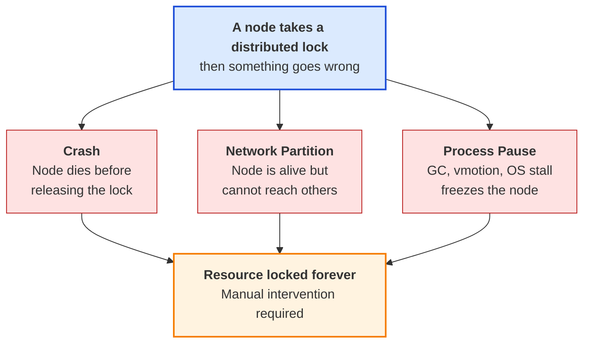
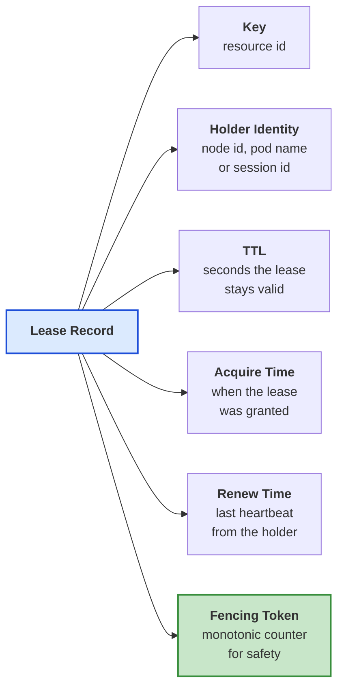
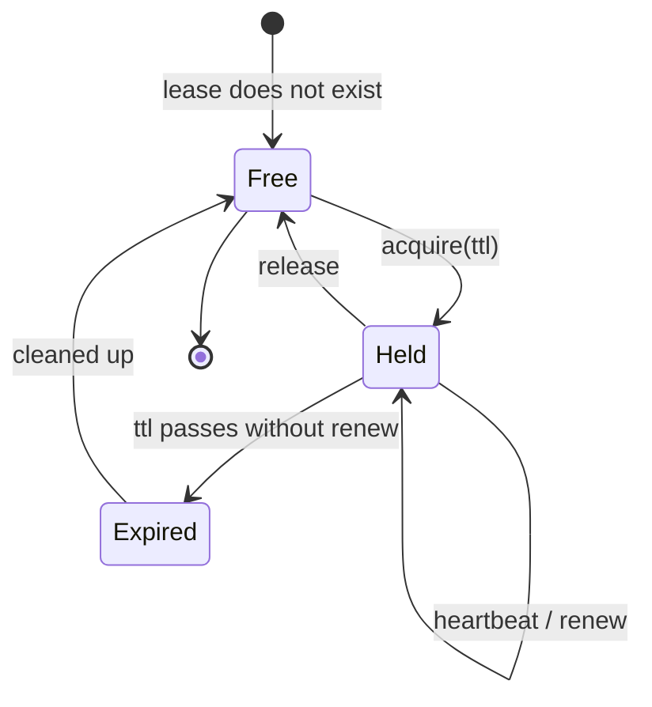
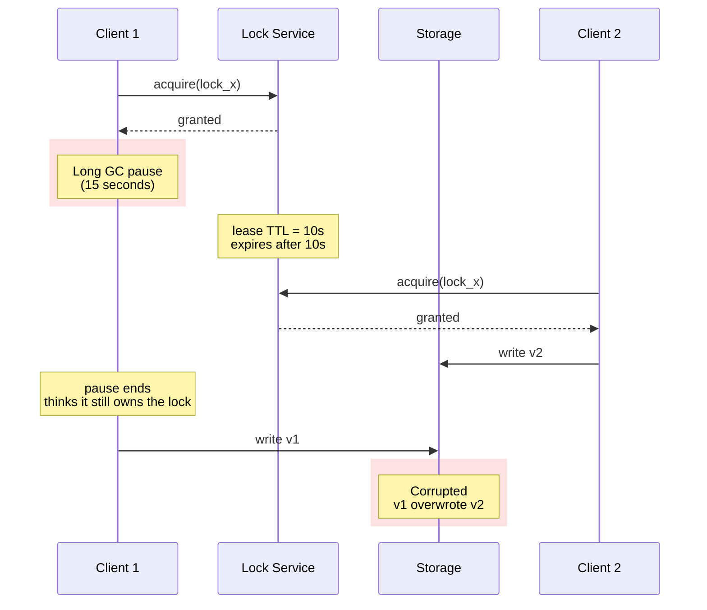
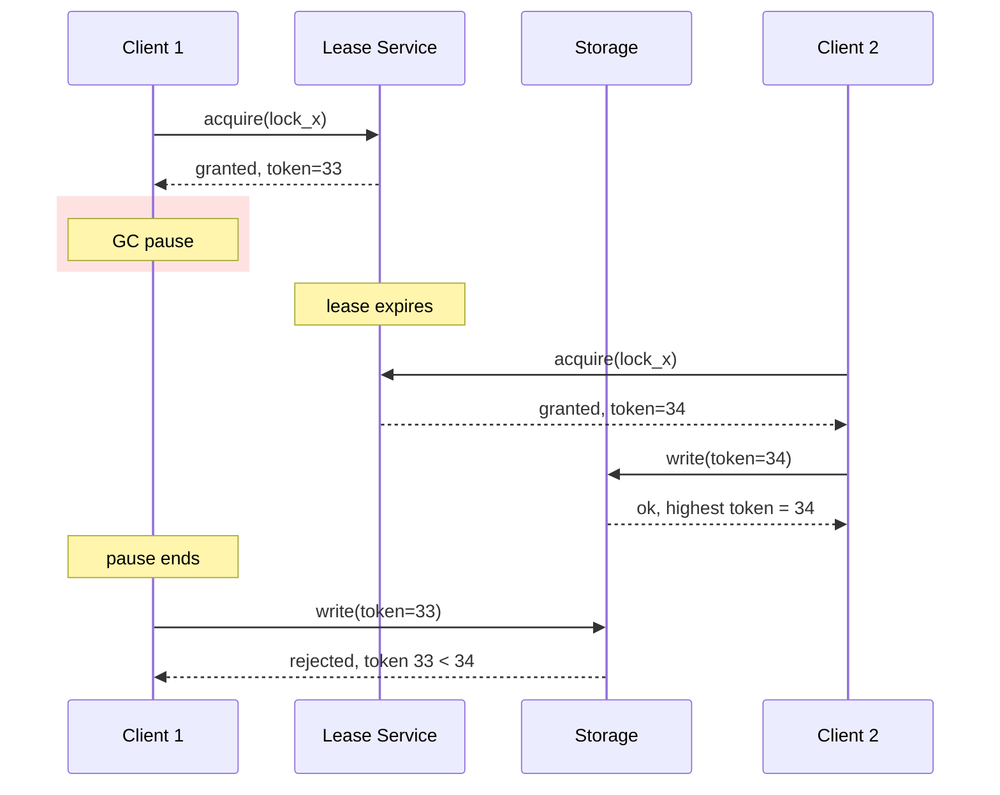
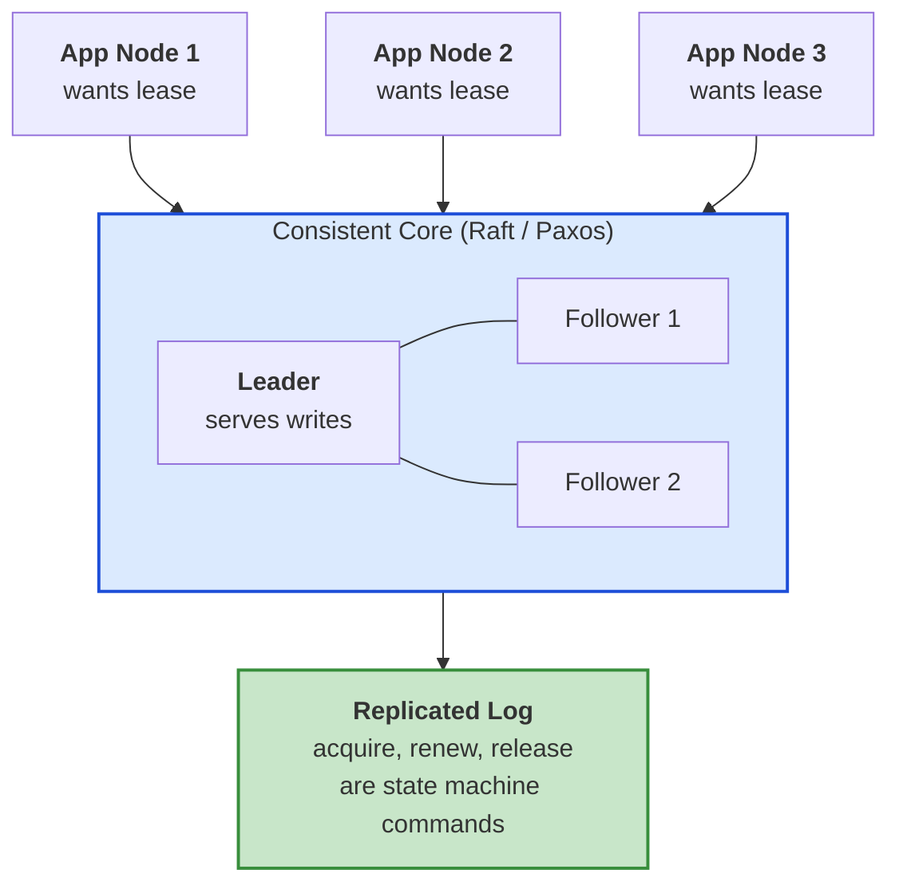
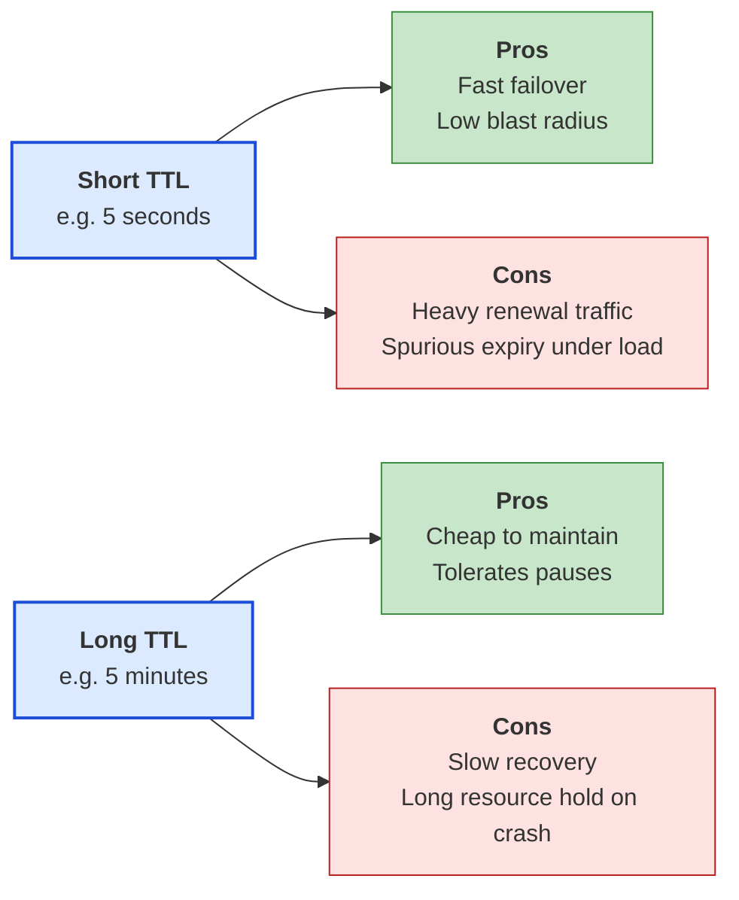
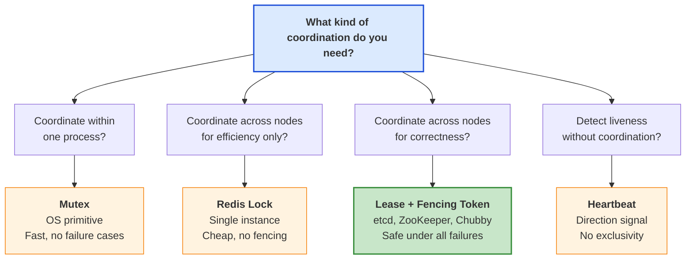

Distributed systems break in funny ways. A node boots up, sends heartbeats, takes a lock, and then disappears for twelve seconds because the JVM ran a stop the world garbage collection. From its point of view nothing happened. From the rest of the cluster's point of view, the node died, a new leader took over, and life moved on. When the original node wakes up, it still thinks it owns the lock and happily writes to the database the new leader is already updating.

That single failure mode has killed more weekends than every other distributed systems bug combined. The fix is older than most of us in this industry. It is called a **lease**, and it is one of the most useful patterns in the [distributed systems toolbox](/distributed-systems/){:target="_blank" rel="noopener"}.

A lease is a lock with a time limit. The holder gets exclusive access to something, a file, a leader role, a shard, a critical section, for a fixed number of seconds. If the holder keeps sending heartbeats, the clock resets. If the heartbeats stop, the lease expires on its own and the resource is free again. No human intervention. No "is the node actually dead" debate. The clock answers for you.

This post walks through what a lease is, why plain locks are dangerous in a distributed setting, how fencing tokens fix the last sharp edge, how to implement leases on top of a [consensus protocol](/distributed-systems/paxos/){:target="_blank" rel="noopener"}, and how real systems like [Google Chubby](https://research.google/pubs/the-chubby-lock-service-for-loosely-coupled-distributed-systems/){:target="_blank" rel="noopener"}, [ZooKeeper](https://zookeeper.apache.org/doc/current/zookeeperOver.html){:target="_blank" rel="noopener"}, [etcd](https://etcd.io/docs/v3.5/learning/api/){:target="_blank" rel="noopener"}, [Kubernetes](https://kubernetes.io/docs/concepts/architecture/leases/){:target="_blank" rel="noopener"}, and [HDFS](https://hadoop.apache.org/docs/stable/hadoop-project-dist/hadoop-hdfs/HdfsDesign.html){:target="_blank" rel="noopener"} use leases under the hood.



## The Problem: Locks Without an Expiry Are Dangerous

In a single process, a mutex is easy. The thread that holds it eventually releases it, the kernel cleans up if the thread dies, the OS keeps everything sane.

The moment you move locking across machines, that simplicity is gone. Now there is no kernel watching the holder. If the holder crashes, panics, hits a kernel oops, or has its power cable yanked, no one knows. The lock entry in your locking service still exists. The resource is still marked as taken. Other nodes wait forever.

Three failure modes show up over and over again.



The classic [How to do distributed locking](https://martin.kleppmann.com/2016/02/08/how-to-do-distributed-locking.html){:target="_blank" rel="noopener"} post by Martin Kleppmann describes a real bug from a Redis based locking library where exactly this happened. A worker took the lock, paused for a few seconds because of a long garbage collection, and the lock expired in the background. A second worker took over. Both then wrote to the same database row, and the data got corrupted.

You cannot fix this by sending more heartbeats. The holder can always pause between the heartbeat and the actual write. You cannot fix it with longer timeouts, because then a real crash leaves the resource locked for hours. You need a different shape of the lock entirely.

You need a lease.

## What Is a Lease?

The cleanest definition comes from Unmesh Joshi's [Patterns of Distributed Systems lease chapter](https://martinfowler.com/articles/patterns-of-distributed-systems/time-bound-lease.html){:target="_blank" rel="noopener"} on Martin Fowler's site:

> Use time-bound leases for cluster nodes to coordinate their activities. A cluster node can ask for a lease for a limited period of time, after which it expires. The node can renew the lease before it expires if it wants to extend the access.

Three ideas, all carrying weight.

1. **Time-bound.** Every lease has a deadline. If you do nothing, it dies.
2. **Renewable.** The holder can extend it with a fresh heartbeat before the deadline.
3. **Exclusive.** Only one node can hold a given lease at a time.

This combination buys you something a plain lock cannot. If the holder is healthy, it keeps the lease through renewals. If the holder vanishes, the lease quietly expires and the resource becomes free, without anyone having to declare the node officially dead.

## Anatomy of a Lease

A lease is just a small record in some strongly consistent store. The exact field names change from system to system, but the shape is always the same.



You can read the [Kubernetes Lease API spec](https://kubernetes.io/docs/reference/kubernetes-api/cluster-resources/lease-v1/){:target="_blank" rel="noopener"} for a real production schema. Its `LeaseSpec` has `holderIdentity`, `acquireTime`, `renewTime`, `leaseDurationSeconds`, and `leaseTransitions`. That is the entire pattern in a YAML object.

The only field that needs explaining is the **fencing token**. Hold on to it. We will come back to it after looking at the lease lifecycle.

## The Lease Lifecycle

There are four moments in the life of a lease. Acquire, renew, release, expire.







### Acquire

A node calls something like `acquire(resource_id, ttl)`. The lease service writes a record saying "node N holds resource R until time T", where T is now plus TTL. If another node already holds the lease, the call fails. If the lease has expired or was released, the call succeeds. In etcd this is a `Grant` followed by a `Put` with the lease id attached. In ZooKeeper it is the creation of an [ephemeral node](https://zookeeper.apache.org/doc/r3.9.0/zookeeperProgrammers.html#Ephemeral+Nodes){:target="_blank" rel="noopener"} on a session. In Kubernetes it is a `Create` on a `Lease` object.

### Renew

While the node is doing work, it keeps the lease alive. Most systems do this by piggybacking on a [heartbeat](/distributed-systems/heartbeat/){:target="_blank" rel="noopener"} that the node was already sending for liveness. The lease service receives the heartbeat, pushes the deadline forward by one TTL, and acknowledges. If the renew arrives after the deadline, the lease is gone and the call fails.

### Release

When the work is done, the holder releases the lease explicitly. This is the polite path. It frees the resource immediately rather than waiting for the TTL to drain.

### Expire

The interesting one. If the holder stops renewing, the lease service notices that the deadline has passed and the record becomes free. No one tells the holder. The holder might still be alive and just slow. That is the whole point. The system stops waiting on it.

## Why Plain Locks Are Not Enough: The Process Pause Story

Here is the canonical failure that turns into a lease.



Both clients believe they hold the lock at the same time. The lock service is correct. The clients are correct from their local point of view. But the database now has the wrong value.

The TTL alone is not enough. You also need the storage to refuse the late write from Client 1. That is what fencing tokens are for.

## Fencing Tokens: The Missing Half

A fencing token is a monotonically increasing integer that the lease service hands out every time a lease is granted. The storage layer keeps track of the highest token it has seen on any write to a given resource. If a write arrives with a smaller token, it is rejected.



This is the construction Martin Kleppmann recommends in [How to do distributed locking](https://martin.kleppmann.com/2016/02/08/how-to-do-distributed-locking.html){:target="_blank" rel="noopener"}. The storage layer becomes the final arbiter of correctness. The lease service hands out tokens. The storage refuses anything stale. The race condition disappears.

A few practical notes.

- The token must come from the same place that grants the lease. If you make it up on the client, you lose the monotonicity guarantee.
- The storage must persist the highest seen token per resource, not globally. Different resources use independent counters.
- Reads usually do not need a token. Stale reads are tolerable. Stale writes are not.
- Some systems use the [Raft term](/distributed-systems/replicated-log/){:target="_blank" rel="noopener"} or the [Lamport timestamp](/distributed-systems/lamport-clock/){:target="_blank" rel="noopener"} of the granting operation as the token. They have the same properties.

If your storage layer cannot check fencing tokens, you do not have a safe distributed lock. You have an efficiency lock at best. That distinction matters more than almost any other in this whole space.

## How Leases Are Implemented: The Consistent Core

A lease is only useful if everyone agrees on who holds it. That agreement is the job of a [Consistent Core](https://martinfowler.com/articles/patterns-of-distributed-systems/consistent-core.html){:target="_blank" rel="noopener"}. A small, strongly consistent cluster, usually three or five nodes, runs a consensus protocol like [Raft](/distributed-systems/replicated-log/){:target="_blank" rel="noopener"} or [Paxos](/distributed-systems/paxos/){:target="_blank" rel="noopener"} and serves lease operations as state machine commands.



Every `acquire`, `renew`, and `release` becomes a log entry that is replicated to a majority before being applied. Because the consensus protocol gives you a total order, every replica sees the same sequence of operations and ends up with the same view of who holds which lease. The fencing token can be the log index or the leader epoch, both of which are monotonic by construction.

This is exactly how etcd, ZooKeeper, and Chubby build their lease APIs. The consensus protocol is the hard part. The lease is a small state machine that sits on top.

## A Reference Implementation

Here is a minimal lease service in pseudocode. It hides the consensus layer behind a `replicated_kv` interface so the lease logic is easy to read.

```python
import time
import threading

class LeaseService:
    def __init__(self, replicated_kv, monotonic_clock):
        self.kv = replicated_kv
        self.clock = monotonic_clock
        self._next_token = 1
        self._lock = threading.Lock()

    def acquire(self, resource_id, holder_id, ttl_seconds):
        with self._lock:
            now = self.clock.now()
            current = self.kv.get(resource_id)

            if current is not None and current["expires_at"] > now:
                return None

            token = self._next_token
            self._next_token += 1

            lease = {
                "holder": holder_id,
                "acquired_at": now,
                "expires_at": now + ttl_seconds,
                "token": token,
            }
            self.kv.put(resource_id, lease)
            return lease

    def renew(self, resource_id, holder_id, ttl_seconds):
        with self._lock:
            now = self.clock.now()
            current = self.kv.get(resource_id)
            if current is None or current["holder"] != holder_id:
                return None
            if current["expires_at"] <= now:
                return None
            current["expires_at"] = now + ttl_seconds
            self.kv.put(resource_id, current)
            return current

    def release(self, resource_id, holder_id):
        with self._lock:
            current = self.kv.get(resource_id)
            if current is not None and current["holder"] == holder_id:
                self.kv.delete(resource_id)
```

Three things to notice.

1. **Monotonic clock.** Never use the wall clock for TTL math. `time.time()` can jump backward when NTP corrects it. `time.monotonic()` cannot. Every production lease implementation uses a monotonic clock for the deadline check.
2. **The token only changes on `acquire`.** Renews keep the same token. The token is a property of the holder, not of the deadline.
3. **The check is `expires_at > now`, not just `holder is not None`.** Without that, an expired lease still blocks new acquirers and the whole pattern falls apart.

A real implementation would also include a background sweeper that removes records whose `expires_at` is well in the past, just for tidiness. The lease check itself does not need it.

## How Long Should the TTL Be?

This is the question everyone asks and the answer is always "it depends". Here is the trade-off.



A few rules of thumb that hold up in production.

- Pick a TTL that is at least 3x your typical heartbeat interval. If you heartbeat every 5 seconds, set TTL to 15 or 20. That way a single missed heartbeat does not lose the lease.
- Pick a TTL that is at least 2x your worst observed full GC pause or kernel stall. If your JVM occasionally pauses for 8 seconds, do not run with a 10 second TTL. You are one bad collection away from losing the lease.
- Keep the TTL bounded. A TTL of 24 hours defeats the point of the pattern. If a node crashes at midnight, you do not want the resource locked until midnight tomorrow.
- For leader election, most production systems use TTLs between 5 and 30 seconds. Kubernetes uses 15 seconds by default for `kube-controller-manager` leader election, with a 10 second renew deadline and a 2 second retry period.

## Real World Implementations

The lease pattern is everywhere once you start looking. Here are the big ones.





### Google Chubby

[Chubby](https://research.google/pubs/the-chubby-lock-service-for-loosely-coupled-distributed-systems/){:target="_blank" rel="noopener"}, the lock service Google built in 2006, is the spiritual ancestor of ZooKeeper and etcd. It is a Paxos backed key value store whose primary product is the lease. Clients open a session, and the session has a lease. As long as the client keeps the session alive with heartbeats, the lease holds. Locks in Chubby are just files in the Chubby namespace with a holder identity attached to the session lease. When the session dies, the locks die with it. This is the same shape every lease implementation since has followed.

Chubby also introduced the **lease grace period**, which is the small window after a lease expires during which the old holder is allowed to re-establish if it reaches the server. This protects against transient network glitches without giving up on safety. The grace period is one of those small details that takes years to fully understand.

### Apache ZooKeeper

ZooKeeper expresses leases through **sessions** and **ephemeral nodes**. A client connects, gets a session with a TTL, and creates an ephemeral znode under a path. As long as the session is alive (heartbeats every `tickTime` succeed) the ephemeral node exists. When the session expires, ZooKeeper deletes every ephemeral node owned by it.

This is how virtually every Apache project that uses ZooKeeper, Kafka before KRaft, HBase, Solr, Druid, builds leader election. Each candidate creates an ephemeral sequential node. The one with the lowest sequence number is the leader. When the leader crashes or is partitioned, its session expires, its node disappears, and the next candidate takes over. The sequence number doubles as a fencing token in many designs.

For a deeper look at ZooKeeper's replicated log, see our post on [Replicated Log in Distributed Systems](/distributed-systems/replicated-log/){:target="_blank" rel="noopener"}.

### etcd

[etcd](https://etcd.io/docs/v3.5/learning/api/){:target="_blank" rel="noopener"} ships a first class **Lease** API. A client calls `Grant(ttl)` and gets back a `lease_id`. Any key it writes can be attached to that lease id. To keep the lease alive, the client opens a bidirectional `KeepAlive` stream. If the stream breaks or the client stops sending, the lease expires and every key tied to it is automatically deleted.

The etcd lock API and election API are both built on top of leases. Each lock is a key with a lease, plus a queue of waiters watching for the key to disappear. The leader is whoever holds the smallest revision number in the queue.

The [Jepsen analysis of etcd 3.4.3](https://jepsen.io/analyses/etcd-3.4.3){:target="_blank" rel="noopener"} is worth a careful read. It points out that the etcd lock API does not check lease validity after acquisition, which means clients still need to verify the lease is healthy before each protected operation, or pair the lock with a fencing token at the storage layer. The lease itself is correct. The lock recipe on top of it is the part you have to use carefully.

### Kubernetes

Kubernetes added a dedicated [Lease object](https://kubernetes.io/docs/concepts/architecture/leases/){:target="_blank" rel="noopener"} to the `coordination.k8s.io/v1` API for exactly this pattern. There are two big users.

- **Node heartbeats.** Every kubelet writes a `Lease` in the `kube-node-lease` namespace every 10 seconds. The control plane considers a node ready as long as the lease is fresh. This is much cheaper than updating the full `Node` object every time, which is why the design switched to leases in 1.13.
- **Leader election.** `kube-controller-manager`, `kube-scheduler`, and most third party operators built on `controller-runtime` use a `Lease` in the `kube-system` namespace to elect a single active leader among multiple replicas. The implementation is in the [controller-runtime leader election package](https://github.com/kubernetes-sigs/controller-runtime/blob/main/pkg/leaderelection/leader_election.go){:target="_blank" rel="noopener"}.

Optimistic concurrency on the `resourceVersion` field of the `Lease` object is what makes the takeover safe. Two candidates can both try to update an expired lease at the same time, but only one update succeeds because the other carries a stale `resourceVersion`. This is a beautiful example of how Kubernetes layers a small primitive (compare and set) into a large one (leader election).

### HDFS

The [HDFS NameNode](https://hadoop.apache.org/docs/stable/hadoop-project-dist/hadoop-hdfs/HdfsDesign.html){:target="_blank" rel="noopener"} uses leases to coordinate file writes. When a client opens a file for append, the NameNode grants it a lease on the file. Only the lease holder can write. The lease has a **soft limit** (default 60 seconds) and a **hard limit** (default one hour). Within the soft limit, no one can touch the file. Between the soft and hard limit, another client can request a lease recovery, which forces the original holder out. After the hard limit, the lease is reclaimed automatically.

This dual deadline design shows up in other systems too. The soft limit is the fast path. The hard limit is the safety net. A lot of large scale systems converge on the same trick.

### Cassandra and DynamoDB

[Cassandra](https://cassandra.apache.org/){:target="_blank" rel="noopener"} uses leases inside its lightweight transactions ([LWT](https://www.datastax.com/blog/lightweight-transactions-cassandra-20){:target="_blank" rel="noopener"}) to coordinate writes through Paxos. The Paxos ballot number doubles as a fencing token, which is why old proposals get rejected after a new leader picks up.

DynamoDB's [DAX](https://aws.amazon.com/dynamodb/dax/){:target="_blank" rel="noopener"} and its cross region replication use leases for cluster membership. The [Amazon Dynamo paper](https://www.allthingsdistributed.com/files/amazon-dynamo-sosp2007.pdf){:target="_blank" rel="noopener"} describes similar lease based ownership for ring partitions.

### DHCP

The original lease. [DHCP](https://datatracker.ietf.org/doc/html/rfc2131){:target="_blank" rel="noopener"} hands out IP addresses with a lease time. The client renews at half the lease time, called T1, and again at seven eighths, called T2. If renewal fails, the address goes back into the pool. The same pattern you see in distributed systems was already in your home router decades ago.

### Other Notable Implementations

| System | Lease usage | Notes |
|--------|-------------|-------|
| [Google Chubby](https://research.google/pubs/the-chubby-lock-service-for-loosely-coupled-distributed-systems/){:target="_blank" rel="noopener"} | Session leases, lock leases | Introduced grace period, Paxos backed |
| [ZooKeeper](https://zookeeper.apache.org/doc/current/zookeeperOver.html){:target="_blank" rel="noopener"} | Session timeouts, ephemeral nodes | Sequential znode acts as fencing token |
| [etcd](https://etcd.io/docs/v3.5/learning/api/){:target="_blank" rel="noopener"} | First class Lease API, lock and election helpers | Raft backed, KeepAlive stream |
| [Kubernetes](https://kubernetes.io/docs/concepts/architecture/leases/){:target="_blank" rel="noopener"} | Node heartbeats, leader election | `coordination.k8s.io/v1` Lease object |
| [HDFS](https://hadoop.apache.org/docs/stable/hadoop-project-dist/hadoop-hdfs/HdfsDesign.html){:target="_blank" rel="noopener"} | File write lease with soft and hard limits | NameNode is the authority |
| [Consul](https://developer.hashicorp.com/consul/docs/dynamic-app-config/sessions){:target="_blank" rel="noopener"} | Sessions with TTL for locks | Raft backed, fencing via lock-delay |
| [Redis Redlock](https://redis.io/docs/latest/develop/clients/patterns/distributed-locks/){:target="_blank" rel="noopener"} | TTL based locks across N nodes | Efficiency only, not safe for correctness |
| [DHCP](https://datatracker.ietf.org/doc/html/rfc2131){:target="_blank" rel="noopener"} | IP address leases | The original lease, T1 and T2 renewal |

## Lease vs Lock vs Other Coordination Patterns

Different problems call for different tools. Pick the lightest one that solves your case.







A side by side comparison.

| Property | OS Mutex | Plain Distributed Lock | Lease | Lease + Fencing Token |
|----------|----------|------------------------|-------|------------------------|
| Survives holder crash | Yes (kernel) | No | Yes (TTL) | Yes |
| Survives holder pause | Yes | No (silent corruption) | TTL bounds it | Yes (storage rejects) |
| Survives network partition | N/A | No | Yes | Yes |
| Requires consensus store | No | Sometimes | Yes | Yes |
| Safe for correctness | Yes | No | No (alone) | Yes |
| Used by | Local code | Early Redis recipes | DHCP, basic Chubby | etcd, ZooKeeper, Kubernetes |

Notice the cell that matters most: only a lease combined with a fencing token is safe for correctness. Everything else has a window where two nodes can both think they hold the lock.

## Failure Modes to Watch For

### Process Pauses Eating the Whole TTL

Stop the world GC pauses on the JVM, vmotion stalls on virtualised hardware, kernel page cache thrashing, swap activity, even noisy neighbours on a cloud VM can freeze your process for seconds. If that pause is longer than your TTL, you lose the lease and the system silently moves on. Always pick a TTL that comfortably exceeds the worst observed pause for your runtime, and always pair the lease with fencing tokens so a late wake up cannot corrupt anything.

### Clock Drift on the Server

The lease service decides when a lease expires based on its own clock. If the clock jumps backward because of an NTP correction, leases that were already expired suddenly look valid again. Use a monotonic clock on the server side. The [Spanner paper](https://research.google/pubs/spanner-googles-globally-distributed-database-2/){:target="_blank" rel="noopener"} and the [CockroachDB blog](https://www.cockroachlabs.com/blog/living-without-atomic-clocks/){:target="_blank" rel="noopener"} both have good war stories about clock bugs and how to defend against them.

### Renewal Storms

If every node renews its lease at the same second, the lease service gets hammered every TTL/3 seconds. Jitter the renewal interval. Most production systems set the next renewal at a random point between half and three quarters of the remaining TTL.

### Lease Stealing After a Soft Limit

Some systems (HDFS, S3, custom code) allow another client to take over a lease before the hard limit expires, if the original holder appears unhealthy. This is convenient but dangerous. The "appears unhealthy" check has to be tighter than the lease grace period, otherwise you reintroduce the very dual writer bug that leases were supposed to fix.

### Not Using the Lease ID

In etcd, every `Put` can be tagged with a `lease_id`. If you forget to tag your writes, the keys outlive the session and stale data leaks into the cluster. This is one of the most common bugs in homegrown lease code. Either tag every write or have a watcher that explicitly deletes keys when the lease ends.

### Confusing Liveness with Ownership

A [heartbeat](/distributed-systems/heartbeat/){:target="_blank" rel="noopener"} tells you a node is alive. A lease tells you a node owns a resource. They are not the same thing. A node can be alive and not hold a lease. A lease can be valid even when the holder is unreachable from your point of view. Keep the two in separate layers in your code and your debugging life gets much easier.

## How Leases Connect to Other Distributed Systems Patterns

Lease shows up at the intersection of several patterns. Once you have it, a lot of other building blocks fall into place.

- [Heartbeat](/distributed-systems/heartbeat/){:target="_blank" rel="noopener"} is what renews a lease. Without heartbeats, the lease cannot stay alive.
- [Lamport Clock](/distributed-systems/lamport-clock/){:target="_blank" rel="noopener"} timestamps and Raft terms are the natural source for fencing tokens.
- [Paxos](/distributed-systems/paxos/){:target="_blank" rel="noopener"} and [Replicated Log](/distributed-systems/replicated-log/){:target="_blank" rel="noopener"} provide the strongly consistent store the lease service needs.
- [Majority Quorum](/distributed-systems/majority-quorum/){:target="_blank" rel="noopener"} is how the lease service stays available when nodes fail.
- [High Watermark](/distributed-systems/high-watermark/){:target="_blank" rel="noopener"} and [Low Watermark](/distributed-systems/low-watermark/){:target="_blank" rel="noopener"} use monotonic indices in the same spirit as fencing tokens.
- [Two-Phase Commit](/distributed-systems/two-phase-commit/){:target="_blank" rel="noopener"} and the [Saga pattern](/saga-pattern-distributed-transactions/){:target="_blank" rel="noopener"} often coordinate participants through a lease held by the coordinator.
- The [Circuit Breaker pattern](/circuit-breaker-pattern/){:target="_blank" rel="noopener"} watches a similar deadline based state machine, just for a different purpose.

Most production systems combine these in layers. Heartbeats keep leases alive. Leases drive leader election. Leaders coordinate replicated logs. Replicated logs feed state machines. The whole stack rests on a small TTL and a single integer counter.

## Worked Example: Leader Election with etcd Leases

Here is a real, idiomatic pattern using etcd's `clientv3/concurrency` package in Go. This is exactly what `kube-controller-manager` and most operators do under the hood.

```go
import (
    "context"
    clientv3 "go.etcd.io/etcd/client/v3"
    "go.etcd.io/etcd/client/v3/concurrency"
)

func runAsLeader(ctx context.Context, cli *clientv3.Client, id string) error {
    session, err := concurrency.NewSession(cli, concurrency.WithTTL(15))
    if err != nil {
        return err
    }
    defer session.Close()

    election := concurrency.NewElection(session, "/leader/my-controller")

    if err := election.Campaign(ctx, id); err != nil {
        return err
    }

    return doLeaderWork(ctx, session)
}

func doLeaderWork(ctx context.Context, session *concurrency.Session) error {
    for {
        select {
        case <-session.Done():
            return fmt.Errorf("lost lease, no longer leader")
        case <-ctx.Done():
            return ctx.Err()
        default:
            performTasks()
            time.Sleep(time.Second)
        }
    }
}
```

The critical line is `case <-session.Done()`. If the lease behind the session expires for any reason, the channel fires and your code knows it is no longer the leader. Every write you do should also include a fencing check against the lease revision so that a paused leader cannot wake up and write stale data. The etcd docs cover the [lock tutorial and concurrency primitives](https://etcd.io/docs/v3.5/tutorials/how-to-create-locks/){:target="_blank" rel="noopener"} in more detail.

## Key Takeaways for Developers





1. **Default to leases, not locks.** Any distributed system that survives real failures uses time-bound leases. Plain locks are an attractive nuisance.

2. **Always include a fencing token.** A lease without a fencing token is unsafe under process pauses. The storage layer is the last line of defence.

3. **Use a monotonic clock.** Never compute lease deadlines from wall clock arithmetic. NTP corrections can jump backward and ruin your day.

4. **Pick a TTL that survives your worst pause.** Look at your GC logs, your vmotion patterns, and your worst observed kernel stall. Set the TTL well above that and double it for safety.

5. **Heartbeat in the background.** A foreground thread that renews the lease can starve under load. Renewal should run on its own scheduler with bounded retries.

6. **Pair lease with [heartbeat](/distributed-systems/heartbeat/){:target="_blank" rel="noopener"} and [replicated log](/distributed-systems/replicated-log/){:target="_blank" rel="noopener"}.** The three patterns together give you liveness, ordering, and exclusivity. That is most of distributed systems in one bundle.

7. **Trust the libraries.** Unless you have a very good reason, build on etcd, ZooKeeper, or Consul. Hand rolled leases are a famous source of correctness bugs. The [Chubby paper](https://research.google/pubs/the-chubby-lock-service-for-loosely-coupled-distributed-systems/){:target="_blank" rel="noopener"} is a fun read partly because it lists all the bugs Google found in services that tried to roll their own.

8. **Test the pause case.** A unit test that suspends the holder for longer than the TTL, then resumes it and tries to write, will save you from production drama. Tools like [Jepsen](https://jepsen.io/){:target="_blank" rel="noopener"} are built for exactly this kind of failure injection.

## Wrapping Up

A lease is the smallest amount of machinery you can introduce that turns a fragile shared resource into a safe one. The pattern is older than this industry. It is what your DHCP server hands you when your laptop joins the network. It is what Chubby gave Google in 2006. It is what runs leader election in every Kubernetes cluster in the world today.

The math is small. A deadline, a heartbeat, and a fencing token. The properties are huge. Process pauses, network partitions, crashed leaders, all turn from data corruption bugs into ordinary recovery events.

If you remember nothing else from this post, remember three lines.

- A lock without a TTL is a footgun.
- A lease without a fencing token is still a footgun.
- A lease plus a fencing token plus a monotonic clock is what real distributed systems run on.

Next time you build a leader election, a write coordinator, a session manager, or any shared resource, reach for a lease first. Your future self, paged at 3 AM, will thank you.

---

*For more distributed systems patterns, check out [Leader and Followers](/distributed-systems/leader-follower/){:target="_blank" rel="noopener"}, [Heartbeat](/distributed-systems/heartbeat/){:target="_blank" rel="noopener"}, [Lamport Clock](/distributed-systems/lamport-clock/){:target="_blank" rel="noopener"}, [Hybrid Logical Clock](/distributed-systems/hybrid-clock/){:target="_blank" rel="noopener"}, [High Watermark](/distributed-systems/high-watermark/){:target="_blank" rel="noopener"}, [Low Watermark](/distributed-systems/low-watermark/){:target="_blank" rel="noopener"}, [Write-Ahead Log](/distributed-systems/write-ahead-log/){:target="_blank" rel="noopener"}, [Replicated Log](/distributed-systems/replicated-log/){:target="_blank" rel="noopener"}, [Majority Quorum](/distributed-systems/majority-quorum/){:target="_blank" rel="noopener"}, [Paxos](/distributed-systems/paxos/){:target="_blank" rel="noopener"}, [Gossip Dissemination](/distributed-systems/gossip-dissemination/){:target="_blank" rel="noopener"}, [Two-Phase Commit](/distributed-systems/two-phase-commit/){:target="_blank" rel="noopener"}, [Saga Pattern](/saga-pattern-distributed-transactions/){:target="_blank" rel="noopener"}, and [How Kafka Works](/distributed-systems/how-kafka-works/){:target="_blank" rel="noopener"}.*

*Further reading: Unmesh Joshi's [Lease chapter](https://martinfowler.com/articles/patterns-of-distributed-systems/time-bound-lease.html){:target="_blank" rel="noopener"} in Patterns of Distributed Systems on Martin Fowler's site; Martin Kleppmann's [How to do distributed locking](https://martin.kleppmann.com/2016/02/08/how-to-do-distributed-locking.html){:target="_blank" rel="noopener"}; the [Chubby paper](https://research.google/pubs/the-chubby-lock-service-for-loosely-coupled-distributed-systems/){:target="_blank" rel="noopener"}; the [Jepsen analysis of etcd](https://jepsen.io/analyses/etcd-3.4.3){:target="_blank" rel="noopener"}; the [Kubernetes Lease docs](https://kubernetes.io/docs/concepts/architecture/leases/){:target="_blank" rel="noopener"}; and the Wikipedia entry on [Lease in computer science](https://en.wikipedia.org/wiki/Lease_(computer_science)){:target="_blank" rel="noopener"}.*
