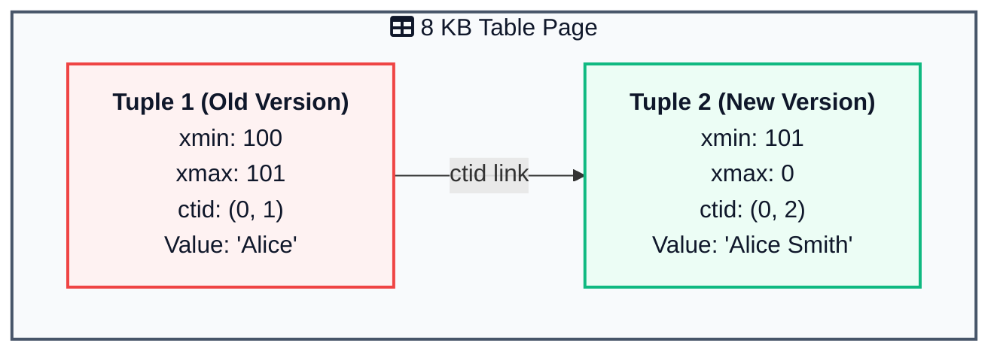
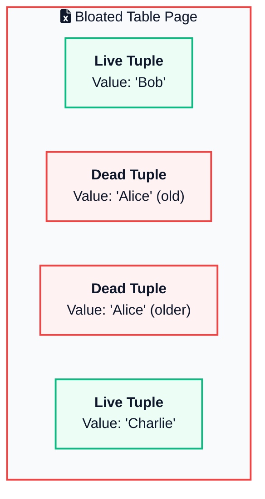
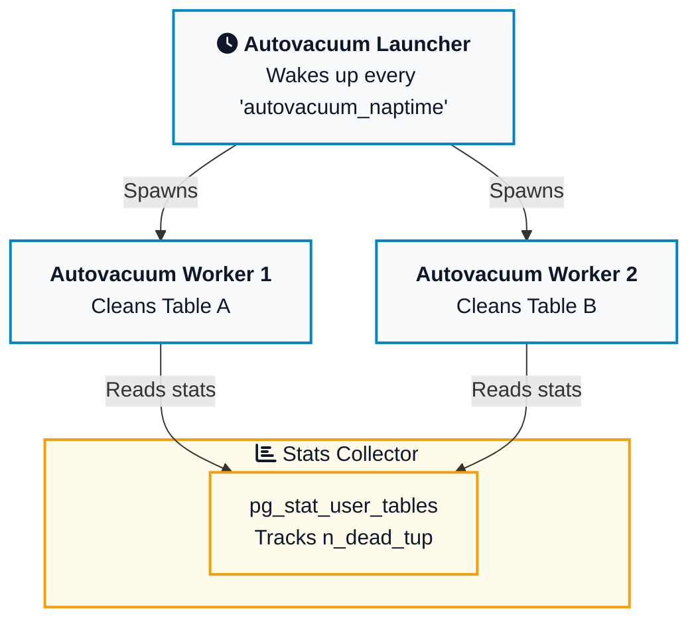
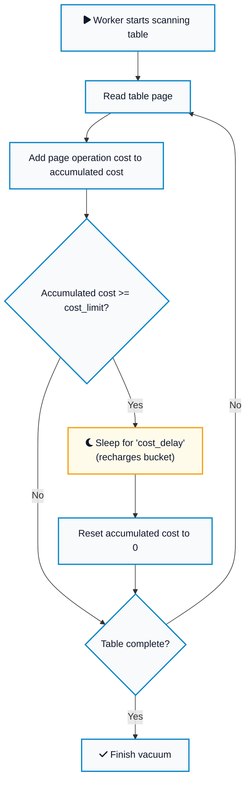
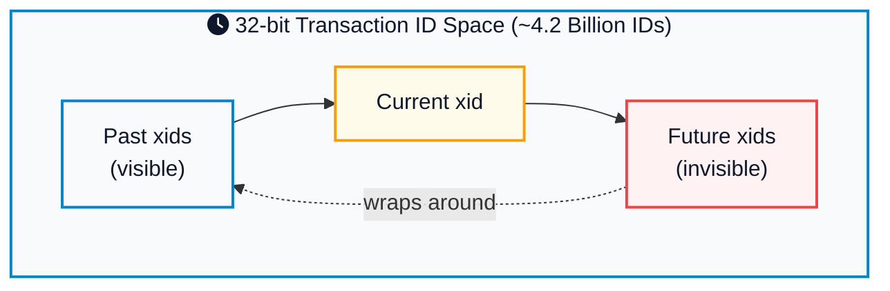

You are running a production PostgreSQL database. You have an active user sessions table that logically holds about 50,000 active sessions at any given time. However, when you check the database size on disk, you notice that this tiny table takes up 15 gigabytes of space. 

Even worse, basic queries that scan this table have slowed down to a crawl. You added an index on the session identifier, but sequential scans on the table still take hundreds of milliseconds. 

This is a classic database symptom. It is caused by table bloat, a direct consequence of how PostgreSQL handles concurrency using Multi-Version Concurrency Control (MVCC) and what happens when the background autovacuum daemon is not configured to keep up.

To keep a database running fast, developers need to understand exactly how Postgres stores rows under the hood, how dead tuples accumulate, and how to calibrate autovacuum. If you want a quick command reference while you read, keep the [PostgreSQL cheat sheet](/postgresql-cheat-sheet/){:target="_blank" rel="noopener"} open in another tab.

---



## Multi-Version Concurrency Control (MVCC) Explained

In a database, multiple users want to read and write data at the same time. If a reader is reading a row while a writer is updating it, the reader might see a half-written row. 

Traditional databases solved this by locking. When a transaction writes a row, it locks it, preventing readers from accessing it until the write is complete. This is slow and limits scalability.

PostgreSQL solves this with Multi-Version Concurrency Control (MVCC). The core philosophy of MVCC is simple: **readers never block writers, and writers never block readers.**

To achieve this, Postgres never updates data in-place. If you change a row, Postgres does not modify the existing physical bytes on disk. Instead, it writes a completely new version of the row, called a **tuple**. These tuples live inside 8 KB pages on disk. If you want a refresher on how those pages are laid out, see post on [How Databases Store Data Internally](/how-databases-store-data-internally/){:target="_blank" rel="noopener"}.



When you update a row:
1. Postgres marks the old tuple as superseded.
2. Postgres writes a new tuple with the updated values.
3. Concurrent transactions reading the database will continue to read the old version of the tuple until they complete. Once all older transactions finish, the old tuple is no longer needed.



### Under the Hood: xmin, xmax, and Tuple Visibility

Every row stored in a Postgres table contains hidden system columns that manage visibility. The most important of these are:

- **`xmin`**: The transaction identifier (txid) of the transaction that inserted the tuple.
- **`xmax`**: The transaction identifier of the transaction that deleted or updated the tuple. If the tuple has not been deleted or updated, `xmax` is set to `0`.
- **`t_ctid`**: The physical location of the tuple (page number and offset within that page). If the tuple has been updated, its `t_ctid` points directly to the newer version of the row, creating a chain of updates.

Let us trace how these columns change during a simple update workflow.

Imagine transaction 100 inserts a row into a table:

```sql
INSERT INTO users (id, name) VALUES (1, 'Alice');
```

The physical tuple in the page file looks like this:

| Physical Location (ctid) | id | name | xmin | xmax | t_ctid |
| :--- | :--- | :--- | :--- | :--- | :--- |
| `(0, 1)` | `1` | `'Alice'` | `100` | `0` | `(0, 1)` |

Next, transaction 101 runs an update on this row:

```sql
UPDATE users SET name = 'Alice Smith' WHERE id = 1;
```

Postgres does not modify physical location `(0, 1)`. Instead, it writes a new physical tuple at location `(0, 2)` and updates the system columns:

| Physical Location (ctid) | id | name | xmin | xmax | t_ctid | Status |
| :--- | :--- | :--- | :--- | :--- | :--- | :--- |
| `(0, 1)` | `1` | `'Alice'` | `100` | `101` | `(0, 2)` | Superseded (Old Version) |
| `(0, 2)` | `1` | `'Alice Smith'` | `101` | `0` | `(0, 2)` | Active (New Version) |

At this point, if transaction 102 starts and reads the table, its snapshot knows that transaction 101 is committed. It sees that `(0, 1)` has an `xmax` of `101`, meaning it was deleted by transaction 101. It looks at `(0, 2)`, sees it has an `xmin` of `101` and `xmax` of `0`, and returns `'Alice Smith'`.

If an older transaction 99 was already running before transaction 101 committed, its snapshot cannot see changes from transaction 101. When it reads, it checks `(0, 1)`. Since `xmax` is `101` (which is invisible to transaction 99), it ignores the deletion and safely returns `'Alice'`.

This is how multi-version concurrency control achieves separation between readers and writers.

---

## The Garbage Left Behind: Dead Tuples and Table Bloat

Once transaction 99 completes, there are no longer any active transactions in the database that started before transaction 101. This means the old tuple at physical location `(0, 1)` is no longer visible to anyone. 

This outdated, invisible row version is now a **dead tuple**.

Because Postgres does not clean up dead tuples immediately, they remain inside the 8 KB page files. If a table experiences thousands of updates or deletes per minute, these dead tuples begin to pile up. This accumulation of dead space is known as **table bloat**.



Table bloat causes severe performance degradation for three reasons:

1. **Slow Sequential Scans**: When Postgres performs a sequential scan (for example, reading a table without an index), it must read every single page file from disk or shared buffers into memory. If a table is 90% bloat, Postgres spends 90% of its reading time scanning garbage rows that it must immediately discard.
2. **Wasted Buffer Cache**: Postgres caches page files in a memory region called `shared_buffers`. If pages are bloated with dead tuples, a significant portion of your database RAM cache is wasted storing dead data, pushing active, useful data out to disk. For a wider look at how caches are built and invalidated, our post on [Caching Strategies Explained](/caching-strategies-explained/){:target="_blank" rel="noopener"} covers cache-aside, write-through, and other common patterns.
3. **Index Bloat**: When table rows are updated, the index entries must also be updated. The indexes themselves can bloat, increasing [B-tree](/data-structures/b-tree/){:target="_blank" rel="noopener"} depth and making index lookups slow. If you want a deeper look at how Postgres indexes are structured, see our post on [Database Indexing Explained](/database-indexing-explained/){:target="_blank" rel="noopener"}.

---

## Reclaiming Space: VACUUM vs VACUUM FULL

To clean up dead tuples, Postgres relies on the `VACUUM` command. There are two variations of this command, and understanding the difference is vital for anyone managing a database.

### 1. Standard VACUUM
Standard `VACUUM` scans the table pages, identifies dead tuples, and makes their space available for future inserts or updates on that same table.

- **Locks**: Standard `VACUUM` does **not** block concurrent reads or writes. It takes a lightweight lock (`ShareUpdateExclusiveLock`), allowing your application to continue using the table normally.
- **Disk Space**: It does **not** return the reclaimed space back to the operating system. If a table's physical file is 10 gigabytes, running standard `VACUUM` will keep the file at 10 gigabytes. However, future inserts will reuse the empty spaces inside the file instead of growing the file further.
- **Truncation**: In rare cases, if all dead tuples are located at the very end of the table file, Postgres can truncate the file and return that small slice of space to the operating system.

### 2. VACUUM FULL
`VACUUM FULL` physically packs the live tuples together and writes a brand new database table file on disk, discarding all dead tuples and returning the unused disk space to the operating system.

- **Locks**: `VACUUM FULL` takes an **exclusive lock** (`AccessExclusiveLock`) on the table. This completely blocks all reads and writes. Your application cannot query the table at all while this is running.
- **Disk Space**: It requires extra disk space to run, because Postgres temporarily keeps both the old bloated file and the new compact file until the operation completes. If you are running out of disk space, `VACUUM FULL` can fail by consuming the remaining disk.



Because `VACUUM FULL` blocks all application traffic and is slow on large datasets, running it in a production environment is a major risk. To learn more about how Postgres structures writes and reads internally, you can refer to our post on [PostgreSQL Internals: How Queries Actually Execute](/postgresql-internals-how-queries-execute/){:target="_blank" rel="noopener"}.

### When to Use Which

<div style="display: flex; gap: 20px; margin: 20px 0; flex-wrap: wrap;">
<div style="flex: 1; min-width: 280px; background: #f0fdf4; border: 2px solid #16a34a; border-radius: 8px; padding: 20px;">
<h4 style="color: #166534; margin-top: 0;"><i class="fas fa-check"></i> Use Standard VACUUM</h4>
<ul style="margin-bottom: 0;">
<li>Regular cleanup on a live production table</li>
<li>When the application cannot tolerate any downtime</li>
<li>When you expect the freed space to be reused by future writes</li>
<li>For routine maintenance (let autovacuum handle it)</li>
</ul>
</div>

<div style="flex: 1; min-width: 280px; background: #fef2f2; border: 2px solid #dc2626; border-radius: 8px; padding: 20px;">
<h4 style="color: #991b1b; margin-top: 0;"><i class="fas fa-exclamation-triangle"></i> Avoid VACUUM FULL</h4>
<ul style="margin-bottom: 0;">
<li>On large tables in production (blocks all queries)</li>
<li>When you are running low on disk space (needs 2x table size)</li>
<li>When you can use online tools like <code>pg_repack</code> instead</li>
<li>As a routine maintenance task</li>
</ul>
</div>
</div>

---

## Autovacuum to the Rescue

Because running manual `VACUUM` commands is operationally difficult to manage, PostgreSQL includes a built-in background daemon called **autovacuum**.

The autovacuum system consists of an **autovacuum launcher** process and multiple **autovacuum worker** processes. The launcher wakes up periodically (controlled by `autovacuum_naptime`, default 1 minute), scans the databases, and spawns worker processes to run `VACUUM` and `ANALYZE` on tables that have accumulated too much dead data.





### The Math: When Does Autovacuum Trigger?

The autovacuum worker decides whether a table needs a vacuum based on a simple mathematical formula. A table is vacuumed when the estimated number of dead tuples exceeds the calculated threshold:

```text
Vacuum Threshold = autovacuum_vacuum_threshold + (autovacuum_vacuum_scale_factor * reltuples)
```

Where:

- **`reltuples`**: The total number of live rows in the table (estimated by table statistics).
- **`autovacuum_vacuum_threshold`**: A flat number of dead tuples (default: `50`).
- **`autovacuum_vacuum_scale_factor`**: A percentage of the table's total rows (default: `0.2` or 20%).

Similarly, autovacuum decides to update the query planner statistics by running `ANALYZE` when the number of inserts, updates, or deletes exceeds the analyze threshold:

```text
Analyze Threshold = autovacuum_analyze_threshold + (autovacuum_analyze_scale_factor * reltuples)
```

Where:

- **`autovacuum_analyze_threshold`**: A flat number of rows changed (default: `50`).
- **`autovacuum_analyze_scale_factor`**: A percentage of total rows changed (default: `0.1` or 10%).

### Why Global Defaults Fail at Scale

The default configuration settings work fine for small development databases, but they are a disaster for large, production-sized tables.

Let us calculate the trigger threshold for two different tables using default settings:

#### Case A: A Small Table (1,000 rows)
```text
Threshold = 50 + (0.2 * 1,000) = 250 dead tuples
```
If you perform 250 updates, autovacuum triggers. This works perfectly.

#### Case B: A Large Table (10,000,000 rows)
```text
Threshold = 50 + (0.2 * 10,000,000) = 2,000,050 dead tuples
```
Autovacuum will not trigger until **2 million rows** are updated or deleted! 

Storing 2 million dead tuples means the table file will accumulate substantial bloat before any cleanup occurs. When autovacuum finally triggers, it has to scan a massive amount of data, causing CPU and disk IO spikes that degrade application performance.

For large tables, relying on the 20% scale factor is the main reason tables bloat out of control.

---

## Cost-Based Throttling: The Governor of Vacuum

Why does autovacuum sometimes seem to run forever without making progress? It is usually due to **cost-based vacuum throttling**.

Because vacuuming reads and writes pages, it can consume a massive amount of disk IO. To prevent autovacuum from starving your production queries of system resources, Postgres throttles the speed of the vacuum workers using a token-bucket cost model.

Each page operation performed by a vacuum worker is assigned a cost:

- **`vacuum_cost_page_hit`**: The cost of reading a page that is already cached in `shared_buffers` (default: `1`).
- **`vacuum_cost_page_miss`**: The cost of reading a page that must be fetched from disk (default: `10`).
- **`vacuum_cost_page_dirty`**: The cost of writing a modified page back to disk after dead tuples are removed (default: `20`).

The worker process accumulates these costs as it works. It keeps running until the sum of its costs hits the configured cost limit, defined by **`autovacuum_vacuum_cost_limit`** (default: `200`).

Once the cost limit is reached, the worker suspends itself and sleeps for a duration defined by **`autovacuum_vacuum_cost_delay`** (default: `2` milliseconds in modern Postgres versions, but historically `20` milliseconds).



Let us look at the math of how fast a worker can write under default conditions (`cost_limit = 200`, `cost_delay = 2ms`):

If a worker is dirtying pages (cost 20), it can process only 10 pages before hitting the cost limit:

```text
200 cost limit / 20 cost per dirty page = 10 pages
```

After processing 10 pages, it must sleep for 2ms. In a single second, the maximum number of sleep cycles is:

```text
1000ms / 2ms = 500 cycles per second
```

This means the worker can write a maximum of `500 * 10 = 5,000` pages per second. Since each Postgres page is 8 KB, the write throughput is throttled to a maximum of:

```text
5,000 * 8 KB = 40,000 KB/s = ~40 MB/s
```

If you have a database server on a modern NVMe SSD capable of writing 2,000 MB/s, default autovacuum limits are holding back the cleanup process to a tiny fraction of your drive's capabilities. If your application writes dead tuples faster than 40 MB/s, autovacuum will fall behind, and your tables will bloat.

*Note: The global cost limit is shared among all active autovacuum workers. If you have 3 workers running simultaneously, each worker is limited to a third of the total cost limit, making them run even slower.*

---

## The Blockers: Why Autovacuum Stops Working

Sometimes you tune autovacuum properly, and you verify that it is running, yet `n_dead_tup` (the count of dead tuples) continues to rise. The dead space is not being reclaimed.

This happens because of a core rule in PostgreSQL MVCC: **vacuum cannot remove a dead tuple if there is any active transaction in the database that might still need to see it.**

To determine if a tuple can be deleted, Postgres looks at the **oldest transaction ID horizon** (known as the `xmin` horizon). If a tuple's deletion transaction ID (`xmax`) is greater than or equal to the oldest active transaction's `xmin`, vacuum must keep the tuple.

There are four primary blockers that hold back this horizon and prevent autovacuum from doing its job:

### 1. Long-Running Active Transactions
If a developer opens a manual transaction in a SQL client to inspect data and forgets to commit or roll it back, that transaction remains open. Any rows updated or deleted anywhere in the database after that transaction started cannot be cleaned up. 

Even if the long-running transaction is completely idle (`idle in transaction`), it blocks vacuum for the entire database.

### 2. Abandoned or Lagging Replication Slots
Replication slots ensure that the primary server does not discard [Write-Ahead Log](/distributed-systems/write-ahead-log/){:target="_blank" rel="noopener"} data or vacuum tuples that a standby replica still needs to process. If a standby replica goes offline or is decommissioned, but its replication slot is not deleted from the primary, the primary database will hold back the `xmin` horizon indefinitely. This is also a common pitfall when using change data capture tools like Debezium. See our post on the [Debezium Outbox Pattern and Postgres Database Impact](/debezium-outbox-postgres-database-impact/){:target="_blank" rel="noopener"} for a breakdown of how this affects production workloads.

### 3. Leftover Prepared Transactions
PostgreSQL supports two-phase commits (`PREPARE TRANSACTION`). If a transaction is prepared but the coordinator never issues the final `COMMIT PREPARED` or `ROLLBACK PREPARED` command, that transaction remains in a pending state, permanently blocking vacuum.

### 4. Standby Lag with hot_standby_feedback
If you use read replicas and have `hot_standby_feedback = on` enabled, the replica tells the primary about the queries it is currently running. If someone runs a heavy, multi-hour analytical query on a read replica, it forces the primary database to pause its vacuuming of dead tuples.

---

## Transaction ID Wraparound: The Hidden Doomsday Clock

Of all the reasons to take autovacuum seriously, **transaction ID wraparound** is the most important. It is the one issue that can force Postgres to refuse all writes and shut your application down completely.

Every transaction in PostgreSQL gets a 32-bit transaction ID (`xid`). That gives you about 4 billion possible IDs. The MVCC system uses these IDs to decide which row versions are visible to which transactions.

Because the ID space is finite, Postgres treats it as a circular range. At any moment, half of the IDs (about 2 billion) are considered "in the past" and half "in the future". As transactions keep getting issued, the wheel rotates.





If the current transaction ID ever caught up to the oldest live row's `xmin`, Postgres would suddenly consider all your data as being "from the future" and invisible. To prevent this catastrophic data loss, Postgres has a built-in safety mechanism: **freezing**.

### What is Freezing?

A `VACUUM` operation does more than just remove dead tuples. It also performs **freezing**. When a tuple is older than the `vacuum_freeze_min_age` threshold (default: 50 million transactions), vacuum replaces its `xmin` field with a special value called `FrozenTransactionId`. A frozen tuple is considered visible to every transaction forever, no matter where the current `xid` is.

This effectively removes the tuple from the wraparound race.

### The Three Warning Levels

Postgres tracks how close the database is getting to wraparound and reacts with escalating severity:

1. **`autovacuum_freeze_max_age` (default: 200 million)**: When any table's oldest unfrozen transaction is older than this, Postgres triggers an **anti-wraparound autovacuum** for that table. This autovacuum is special: it cannot be stopped by `autovacuum = off` and runs even on tables that are otherwise quiet.

2. **`vacuum_failsafe_age` (default: 1.6 billion)**: Vacuum throttling is disabled completely. The vacuum worker stops respecting cost limits and runs at full IO speed because the situation is dire.

3. **Wraparound stop (around 2 billion)**: Postgres refuses all new write transactions. You will see an error like `database is not accepting commands to avoid wraparound data loss in database "X"`. Your only option is to drop into single-user mode and run a manual `VACUUM`. This is a full production outage.

### How to Monitor for Wraparound

Wraparound issues build up slowly over weeks or months, but they crash suddenly. Add this query to your monitoring dashboard to detect them early:

```sql
SELECT 
    datname AS database,
    age(datfrozenxid) AS xid_age,
    ROUND(100 * age(datfrozenxid)::numeric / 2000000000, 2) AS percent_to_wraparound
FROM 
    pg_database
ORDER BY 
    age(datfrozenxid) DESC;
```

If `percent_to_wraparound` is over 50% for any database, it is time to dig in and figure out why autovacuum is not freezing tuples fast enough. The most common cause is one of the four blockers from the previous section.

This is also where companies have historically had their worst Postgres incidents. Sentry [wrote publicly](https://blog.sentry.io/transaction-id-wraparound-in-postgres/){:target="_blank" rel="noopener"} about their own multi-hour outage caused by transaction ID wraparound, and the lesson they took away is the same one every developer should take: **never disable autovacuum on a production database**.

---

## Tuning Autovacuum for High-Traffic Tables

To prevent table bloat without starving database IO, you should follow a simple rule: **do not change autovacuum settings globally. Instead, tune autovacuum on a per-table basis.**

Postgres allows you to override global defaults for individual tables. This is done using the `ALTER TABLE ... SET` command.

Let us look at a practical SQL script to configure a highly active, write-heavy table (for example, our `user_sessions` table):

```sql
-- Lower the vacuum trigger threshold to 2% (from 20%)
-- Lower the analyze trigger threshold to 1% (from 10%)
-- Increase the cost limit to 1000 (from 200) to allow faster processing
-- Reduce the cost delay to 1ms (from 2ms) to reduce sleep pauses
ALTER TABLE user_sessions SET (
    autovacuum_vacuum_scale_factor = 0.02,
    autovacuum_analyze_scale_factor = 0.01,
    autovacuum_vacuum_cost_limit = 1000,
    autovacuum_vacuum_cost_delay = 1
);
```

### Recommended Calibration Strategies

For production databases, use the following guidelines:

1. **Large Tables (> 1 Million Rows)**: Reduce `autovacuum_vacuum_scale_factor` to `0.05` (5%) or `0.02` (2%). This prevents millions of dead tuples from accumulating before a cleanup triggers.
2. **Write-Heavy Tables**: If a table has constant updates, increase its `autovacuum_vacuum_cost_limit` to `1000` or `2000` so that it can clear pages faster.
3. **Dedicated Workers**: If you have many databases or hundreds of active tables, you can increase `autovacuum_max_workers` (default: `3`) in your `postgresql.conf`. If you do this, make sure to also increase `autovacuum_vacuum_cost_limit` globally, as the cost limit is divided among active workers.
4. **Use pg_repack for Emergency Bloat**: If a table has already bloated to 50 GB when it only needs 2 GB of space, do not use `VACUUM FULL`. Use [pg_repack](https://github.com/reorg/pg_repack){:target="_blank" rel="noopener"}, an extension that rebuilds the table online without acquiring exclusive locks.

For teams running high-traffic applications, proper autovacuum tuning is a core part of scaling. If you want to see how other teams structure their database systems for millions of active users, check out our deep dive on [How OpenAI Scales PostgreSQL to 800 Million Users](/how-openai-scales-postgresql/){:target="_blank" rel="noopener"}.

---

## Production Monitoring Queries

To inspect the health of your database, here are three essential SQL queries that every developer should have bookmarked.

### 1. Identify Tables with the Most Dead Tuples
This query shows which tables have the highest number of dead tuples, how recently autovacuum ran, and how many times it has been executed.

```sql
SELECT 
    schemaname AS schema,
    relname AS table_name,
    n_live_tup AS live_rows,
    n_dead_tup AS dead_rows,
    ROUND((n_dead_tup::numeric / NULLIF(n_live_tup + n_dead_tup, 0)) * 100, 2) AS bloat_percentage,
    last_vacuum,
    last_autovacuum,
    vacuum_count,
    autovacuum_count
FROM 
    pg_stat_user_tables
WHERE 
    (n_live_tup + n_dead_tup) > 1000
ORDER BY 
    n_dead_tup DESC
LIMIT 10;
```

### 2. Find Long-Running Active Transactions (xmin Blockers)
This query identifies transactions that have been active for more than 5 minutes, which are likely holding back the `xmin` horizon and blocking autovacuum.

```sql
SELECT 
    pid,
    age(backend_xmin) AS xmin_age,
    query_start,
    state,
    usename AS username,
    query
FROM 
    pg_stat_activity
WHERE 
    backend_xmin IS NOT NULL
    AND state != 'idle'
    AND query_start < NOW() - INTERVAL '5 minutes'
ORDER BY 
    age(backend_xmin) DESC;
```

### 3. Check for Inactive Replication Slots
This query identifies physical or logical replication slots that are currently inactive and holding back database vacuuming.

```sql
SELECT 
    slot_name,
    plugin,
    slot_type,
    active,
    active_pid,
    xmin,
    catalog_xmin,
    age(xmin) AS xmin_age
FROM 
    pg_replication_slots
WHERE 
    active = false;
```

By running these queries regularly, you can detect database degradation early and prevent table bloat from impacting your application's users. Keep autovacuum active, monitor your dead rows, and scale your settings alongside your workload.





---

## How PostgreSQL MVCC Compares to Other Databases

PostgreSQL is not the only database that uses MVCC. But the design choice to write a new tuple instead of updating in place is fairly unique. Knowing how other databases handle the same problem makes the Postgres approach easier to reason about.

| Database | Concurrency Model | Cleanup Strategy | Bloat Risk |
|----------|------------------|-----------------|-----------|
| PostgreSQL | MVCC, new tuple on update | Vacuum reclaims dead tuples | High if vacuum lags |
| MySQL (InnoDB) | MVCC, in-place update + undo log | Purge thread reclaims undo entries | Low for tables, high for undo log |
| Oracle | MVCC, in-place update + undo segments | Automatic undo retention management | Low (handled by engine) |
| SQL Server | Locking by default, optional MVCC | Version store in tempdb | Affects tempdb only |
| MongoDB (WiredTiger) | MVCC, document-level | Automatic snapshot pruning | Low |

The trade-off is real. PostgreSQL's append-style writes make `UPDATE` operations very fast (no in-place modification or undo log lookup), but they push the cleanup work to vacuum. MySQL's in-place updates avoid bloat but make `UPDATE` slower because they must write to the undo log.

There is no perfect answer. PostgreSQL chose simplicity in the write path and pushed complexity into the cleanup path. As a developer, your job is to make sure that cleanup path is healthy.

For a side-by-side breakdown of how each engine handles writes, locks, and isolation, see our post on [How Database Locks Work](/database-locks-explained/){:target="_blank" rel="noopener"}. If you are choosing between Postgres and a NoSQL store, the [PostgreSQL vs MongoDB vs DynamoDB](/postgresql-vs-mongodb-vs-dynamodb/){:target="_blank" rel="noopener"} comparison covers the broader trade-offs.

---

## Real-World Stories: When Autovacuum Goes Wrong

Theory becomes much easier to absorb when you read about real production outages caused by these issues. Here are three public case studies worth knowing.

### Sentry: A Multi-Hour Outage from Wraparound
In 2015, Sentry hit transaction ID wraparound on their main Postgres database. They had disabled autovacuum on a critical, write-heavy table to "improve performance" and forgotten about it. Once the database hit the wraparound limit, all writes were refused. Recovery required several hours of single-user mode vacuuming. The full incident report is on the [Sentry engineering blog](https://blog.sentry.io/transaction-id-wraparound-in-postgres/){:target="_blank" rel="noopener"}.

### GitLab: 1.3 TB of Index Bloat
The GitLab infrastructure team [publicly documented](https://handbook.gitlab.com/handbook/engineering/data-engineering/database-excellence/database-frameworks/doc/workload-analysis/){:target="_blank" rel="noopener"} how their main Postgres database accumulated more than 1.3 TB of index bloat over a few months in 2020. Index bloat grew from 240 GB to over 600 GB in a single quarter. The fix was a combination of monitoring dead tuples per table with Prometheus, scheduled `pg_repack` runs to rebuild indexes online, and aggressive per-table autovacuum settings. GitLab now publishes detailed [PostgreSQL VACUUM runbooks](https://runbooks.gitlab.com/patroni/postgresql-vacuum/){:target="_blank" rel="noopener"} as part of their operations playbook.

### PlanetScale: Why Postgres Queues Get Bloated
PlanetScale published a [detailed breakdown](https://planetscale.com/blog/keeping-a-postgres-queue-healthy){:target="_blank" rel="noopener"} of why Postgres-backed job queues are uniquely prone to bloat. A queue table sees rows inserted, locked, processed, and deleted in seconds. Even when the table never grows logically, dead tuples accumulate faster than autovacuum can keep up, and overlapping worker transactions pin the MVCC horizon. The lesson is that workload pattern matters more than table size. Set `statement_timeout` and `idle_in_transaction_session_timeout` aggressively, use `SKIP LOCKED` for worker queues, and tune per-table autovacuum settings for queue-style tables. If you are building a queue in Postgres, our post on the [Transactional Outbox Pattern](/transactional-outbox-pattern/){:target="_blank" rel="noopener"} covers the architectural patterns that avoid this trap.

These are not edge cases. They happen to teams who follow tutorials but never read the documentation on autovacuum. If your application stores data in PostgreSQL, MVCC and autovacuum are not optional details. They are part of the core operational story.

For more context on how teams handle Postgres at scale, see our deep dive on [How OpenAI Scales PostgreSQL to 800 Million Users](/how-openai-scales-postgresql/){:target="_blank" rel="noopener"}.



---

## Common Mistakes Developers Make

Here are the most common mistakes I see developers make when working with PostgreSQL MVCC and autovacuum:

1. **Disabling autovacuum to "improve performance"**: This is a recipe for disaster. Autovacuum is what protects you from wraparound and bloat. Tune it instead of disabling it.
2. **Running VACUUM FULL on a live production table**: It acquires an `AccessExclusiveLock` that blocks all reads and writes. Use [pg_repack](https://github.com/reorg/pg_repack){:target="_blank" rel="noopener"} or [pg_squeeze](https://github.com/cybertec-postgresql/pg_squeeze){:target="_blank" rel="noopener"} instead.
3. **Leaving idle transactions open**: A `BEGIN` without a matching `COMMIT` or `ROLLBACK` is the single most common cause of autovacuum being unable to clean dead tuples. Always set `idle_in_transaction_session_timeout`.
4. **Ignoring the default scale factor on large tables**: The default `0.2` (20%) scale factor means autovacuum waits until 20% of your table is dead. For a billion-row table, that is 200 million dead tuples. Lower it per-table.
5. **Not monitoring `n_dead_tup`**: If you do not have a dashboard showing dead tuple counts per table, you will not notice bloat until queries are already slow.
6. **Adding too many indexes**: Every index entry must be updated on `UPDATE`, even if the indexed column did not change (unless [HOT updates](https://www.postgresql.org/docs/current/storage-hot.html){:target="_blank" rel="noopener"} kick in). More indexes mean more vacuum work and more bloat.
7. **Forgetting about replication slots**: An inactive replication slot will block vacuum across the entire database. Always drop slots for retired replicas.

---

## Wrapping Up

PostgreSQL MVCC is a beautiful design. It lets thousands of transactions run concurrently without locking the database into a stuttering mess. But the elegance comes with a cost: every update creates garbage, and somebody has to clean it up.

That somebody is autovacuum. If you treat it as a black box, sooner or later it will fall behind, and your application will pay the price in slow queries, wasted memory, and in the worst case, a wraparound outage.

The good news is that none of this is complicated. Five things make up a healthy Postgres database:

1. Autovacuum is enabled and running.
2. Long-running transactions are killed automatically.
3. Replication slots are managed.
4. Hot tables have per-table autovacuum settings.
5. Someone is watching the dashboards.

Once these are in place, MVCC stops being a source of mystery and becomes what it was designed to be: a way to give every developer high concurrency, consistent reads, and fast writes without thinking about it. Spend an afternoon reading `pg_stat_user_tables` on your real production database. By the end of it, you will have a clearer picture of your data than most people who have run Postgres for years.

---

## Key Takeaways

1. **MVCC means every UPDATE is an INSERT plus a DELETE**, leaving behind a dead tuple that has to be cleaned up later.
2. **Dead tuples cause table bloat**, which slows down sequential scans, wastes the shared buffer cache, and makes indexes deeper.
3. **Standard VACUUM is safe in production. VACUUM FULL is not.** Standard vacuum frees space inside the table file. `VACUUM FULL` rewrites the table and blocks all queries.
4. **Autovacuum triggers based on thresholds**, but the defaults are too conservative for large tables. Tune the scale factor per-table with `ALTER TABLE`.
5. **Cost-based throttling caps autovacuum throughput at about 40 MB/s** with default settings. Raise `autovacuum_vacuum_cost_limit` for write-heavy tables on fast disks.
6. **The xmin horizon decides what vacuum can clean.** Long transactions, idle-in-transaction sessions, replication slots, and prepared transactions all hold it back.
7. **Transaction ID wraparound is a real outage risk.** Monitor `age(datfrozenxid)` and never disable autovacuum on a production database.
8. **Monitoring is non-negotiable.** Use `pg_stat_user_tables`, `pg_stat_activity`, and `pg_replication_slots` to detect bloat and blockers before they hurt.

---

## Further Reading

The PostgreSQL community has written excellent documentation and case studies on MVCC and autovacuum. Here are the resources I recommend reading next.

- The official [Routine Vacuuming](https://www.postgresql.org/docs/current/routine-vacuuming.html){:target="_blank" rel="noopener"} chapter is the source of truth for every vacuum parameter.
- The [Concurrency Control](https://www.postgresql.org/docs/current/mvcc.html){:target="_blank" rel="noopener"} documentation explains MVCC, isolation levels, and snapshots from first principles.
- Bruce Momjian's classic [MVCC Unmasked](https://momjian.us/main/writings/pgsql/mvcc.pdf){:target="_blank" rel="noopener"} slide deck is the best single resource on the topic.
- [Vacuum and Autovacuum Tuning](https://docs.crunchybridge.com/guides/tuning-autovacuum){:target="_blank" rel="noopener"} from Crunchy Bridge is a practical, hands-on tuning reference.
- [Postgres Autovacuum is Not the Enemy](https://www.citusdata.com/blog/2016/11/04/autovacuum-not-the-enemy/){:target="_blank" rel="noopener"} from Citus Data explains why autovacuum is misunderstood and how to configure it.
- Hironobu Suzuki's [The Internals of PostgreSQL](https://www.interdb.jp/pg/){:target="_blank" rel="noopener"} free book covers the storage and vacuum subsystems in great depth.
- For the canonical tool to replace `VACUUM FULL` in production, see [pg_repack](https://github.com/reorg/pg_repack){:target="_blank" rel="noopener"}.

---

*For more practical PostgreSQL reading on this blog, see [PostgreSQL Internals: How Queries Actually Execute](/postgresql-internals-how-queries-execute/){:target="_blank" rel="noopener"}, [PostgreSQL 18 Features Guide](/postgres-18-features/){:target="_blank" rel="noopener"}, [PostgreSQL Cheat Sheet](/postgresql-cheat-sheet/){:target="_blank" rel="noopener"}, [How OpenAI Scales PostgreSQL to 800 Million Users](/how-openai-scales-postgresql/){:target="_blank" rel="noopener"}, [Django PostgreSQL Setup from Zero to Production](/django-postgresql-setup-from-zero-to-production/){:target="_blank" rel="noopener"}, [Debezium Outbox and Postgres Database Impact](/debezium-outbox-postgres-database-impact/){:target="_blank" rel="noopener"}, [How Database Locks Work](/database-locks-explained/){:target="_blank" rel="noopener"}, [How Databases Store Data Internally](/how-databases-store-data-internally/){:target="_blank" rel="noopener"}, [Database Indexing Explained](/database-indexing-explained/){:target="_blank" rel="noopener"}, [PostgreSQL vs MongoDB vs DynamoDB](/postgresql-vs-mongodb-vs-dynamodb/){:target="_blank" rel="noopener"}, and the [Write-Ahead Log in Distributed Systems](/distributed-systems/write-ahead-log/){:target="_blank" rel="noopener"}.*

*References: [Routine Vacuuming](https://www.postgresql.org/docs/current/routine-vacuuming.html){:target="_blank" rel="noopener"}, [Concurrency Control in PostgreSQL](https://www.postgresql.org/docs/current/mvcc.html){:target="_blank" rel="noopener"}, [Autovacuum Configuration](https://www.postgresql.org/docs/current/runtime-config-autovacuum.html){:target="_blank" rel="noopener"}, [Transaction ID Wraparound at Sentry](https://blog.sentry.io/transaction-id-wraparound-in-postgres/){:target="_blank" rel="noopener"}, [Crunchy Bridge: Tuning Autovacuum](https://docs.crunchybridge.com/guides/tuning-autovacuum){:target="_blank" rel="noopener"}.*
