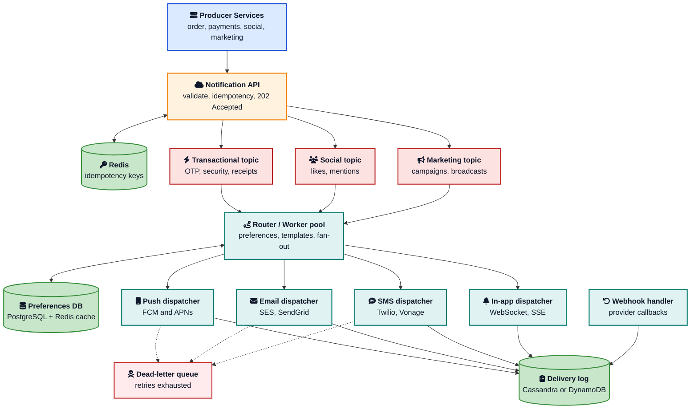
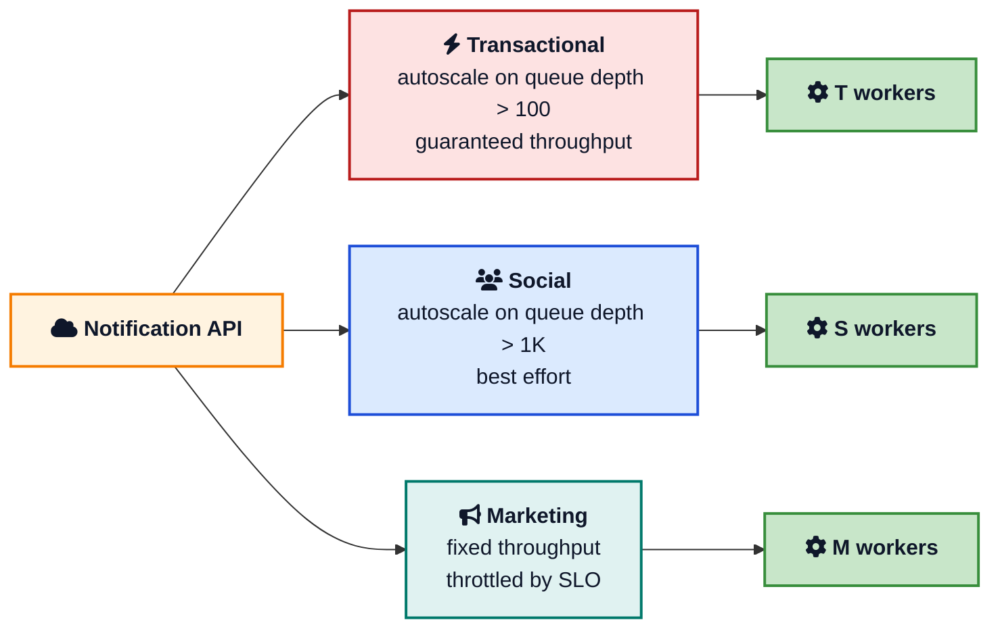
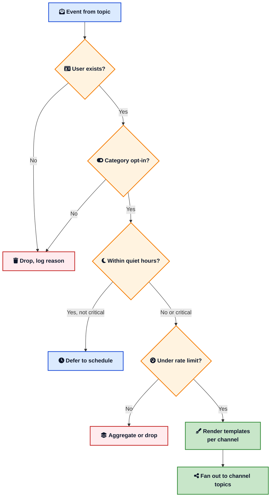
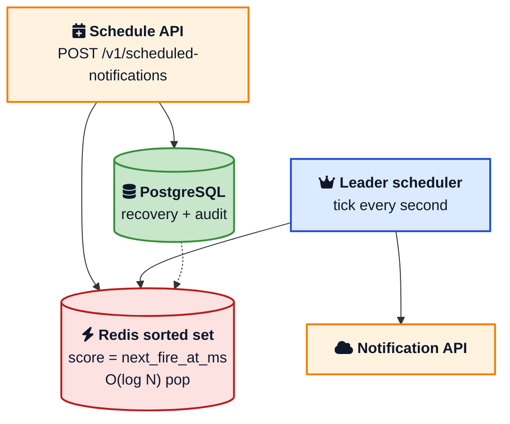

It is 7:42 AM. You open the ride app, tap **Book**, and the screen flips to the driver photo. Three seconds later your phone buzzes with a push notification: *"Rahul is on the way, ETA 4 min."* Twenty seconds after that, an email lands confirming the booking with the pickup address and fare estimate. A minute later, the SMS to the emergency contact you set up last month arrives: *"Ajit booked a ride to Indiranagar, ETA 9:15."* Three different channels, three different providers, one event. From the outside, it looks like the app just sent you a message. From the inside, that one tap fired an event into a system that fanned out to [Firebase Cloud Messaging](https://firebase.google.com/docs/cloud-messaging/scale-fcm){:target="_blank" rel="noopener"}, [Amazon SES](https://docs.aws.amazon.com/ses/latest/dg/Welcome.html){:target="_blank" rel="noopener"}, and [Twilio](https://www.twilio.com/docs/sms){:target="_blank" rel="noopener"}, deduplicated against a Redis key, respected your "no marketing pings" preference, and recorded the outcome in a delivery ledger. The trip receipt email, by the way, only goes out after the driver ends the trip; that is a separate event, a separate fan-out, and a separate row in the same ledger.

This post is the working answer to **how to design a notification system** that you can defend in an interview, a brown-bag, or a real production review. It is opinionated, grounded in patterns from [Slack](https://slack.engineering/tracing-notifications/){:target="_blank" rel="noopener"}, [Uber](https://www.uber.com/blog/real-time-push-platform/){:target="_blank" rel="noopener"}, and Doordash, and includes the boring parts that hurt teams in production: idempotency, retries, provider 429s, scheduled jobs, webhook reconciliation, and the difference between "we sent it" and "it actually arrived."

If you want to brush up on the building blocks first, the [System design cheat sheet](/system-design-cheat-sheet/){:target="_blank" rel="noopener"}, [Role of queues in system design](/role-of-queues-in-system-design/){:target="_blank" rel="noopener"}, [Kafka vs RabbitMQ vs SQS](/kafka-vs-rabbitmq-vs-sqs/){:target="_blank" rel="noopener"}, and [Caching strategies explained](/caching-strategies-explained/){:target="_blank" rel="noopener"} cover most of the primitives we will lean on.

## What a Notification System Has To Do

A notification system has four promises. Everything else is a feature on top.

1. **Deliver the message, eventually.** Networks fail, providers throttle, devices go offline. At-least-once is the floor.
2. **Do not send the same alert twice.** A duplicate "you have a new message" at 2 AM uninstalls the app.
3. **Honor user preferences.** Opt-outs, quiet hours, channel choice, frequency caps.
4. **Stay up when one provider is down.** Twilio outages should not block push notifications.



That sounds modest, until you add the shape of real traffic. A normal Tuesday afternoon sees a steady stream of transactional events: payment confirmations, order updates, message pings. Then marketing schedules a 10 million row "spring sale" blast at noon. Then a regulatory alert fires for half a million users. Then a third-party webhook tells you 200,000 emails bounced. All in the same minute.

The whole system has to absorb that without head-of-line blocking, without losing a single one-time password, and without spending three months of a senior engineer's time every quarter chasing "where did my email go."

### Functional and Non Functional Requirements

In a system design interview, the first five minutes are about pinning these down.

**Functional requirements**

- Send notifications through push, email, SMS, and in-app channels.
- Support transactional, social, and marketing categories.
- Honor per-user channel, category, and frequency preferences.
- Support scheduled and recurring notifications.
- Support broadcast notifications to large audiences.
- Track delivery status: queued, sent, delivered, failed, clicked.
- Expose a single API for all internal producers.

**Non functional requirements**

- **Availability.** The API must accept events even when one or more downstream providers is down.
- **Latency.** Transactional push under 1 second P99 from event to device. Email and SMS within seconds. Marketing within minutes.
- **Reliability.** At-least-once delivery for every accepted event.
- **Scalability.** Handle 100 million daily notifications today, 10x in three years, without a rewrite.
- **Auditability.** Every send, retry, and final outcome is traceable in a delivery log.
- **Cost control.** Marketing blasts cannot blow the SMS budget. Per-channel rate limits are enforceable.

These constraints drive every decision below.

## Capacity Estimation

Numbers turn opinions into engineering. Take a mid-size platform: 100 million users, 50 percent daily active, three notifications per active user per day on average, with a 10x peak for events like holiday sales.

| Quantity | Value | How it is computed |
|---|---|---|
| Daily active users | 50,000,000 | 50% of 100M |
| Notifications per active user per day | 3 | observed average |
| Daily notifications | 150,000,000 | 50M x 3 |
| Average per second | ~1,740 | 150M / 86,400 sec |
| Peak per second | ~17,000 | 10x avg, 60-second peaks |
| Push share | 60% | most events go to mobile |
| Email share | 30% | confirmations, receipts |
| SMS share | 8% | OTP, high-trust alerts |
| In-app share | 2% | feed-style, low priority |
| Average event size | 1 KB | id + user + payload + meta |
| Kafka throughput at peak | ~17 MB/s | 17K events x 1 KB |
| Delivery log writes per day | ~600 million | 4 status rows per notification on average |

Three takeaways from those numbers:

1. The **steady state is small**. 1,700 messages per second is what a single Kafka partition can serve.
2. The **peaks are not small**. 17,000 per second across providers is where the design earns its keep.
3. The **delivery log is the largest data structure**. 600 million rows per day grows faster than the audit team would like. Plan archival from day one.

These are the numbers you cite later when an interviewer asks "why did you pick that?" If you cannot quote a number, you cannot defend a choice.

## High Level Architecture

Each box on this diagram drops the next box's traffic by a clear factor. The API returns to the caller in milliseconds. The queues absorb bursts. The routers and workers fan out. The dispatchers respect provider quotas. The webhook handler closes the loop on actual delivery.





The whole pipeline has a few jobs. The API takes the producer off the hook and gets out of the way. The queues isolate priorities. The router knows the user. The dispatchers know the provider. The webhook handler knows the truth.

## The Notification API

The first design choice that matters: the API does almost nothing.

A producer (the order service, the payments service, the social feed) calls a single endpoint. The API validates the payload, generates or accepts an idempotency key, writes the event to a Kafka topic, and returns `202 Accepted`. Total time on the producer side: a few milliseconds.

```sh
POST /v1/notifications
Authorization: Bearer <service-token>
Idempotency-Key: 8e1f2a90-4c2f-4b9b-9a3d-1f4cb1cc9cc1
Content-Type: application/json

{
  "event_id": "order.shipped.42abc",
  "user_id": "u_19384721",
  "category": "transactional",
  "priority": "high",
  "channels": ["push", "email"],
  "template_id": "order_shipped_v3",
  "data": {
    "order_id": "ord_91827",
    "carrier": "BlueDart",
    "tracking_url": "https://track.example.com/ord_91827"
  }
}

202 Accepted
{
  "notification_id": "nt_01HX7Y...",
  "status": "QUEUED"
}
```

A few things are not obvious at first read.

- The status is `202`, not `200`. We have not sent anything yet. We have promised to send.
- The `Idempotency-Key` is required. The pattern is the same one we used in [how Stripe prevents double payments](/how-stripe-prevents-double-payment/){:target="_blank" rel="noopener"}.
- The producer specifies `channels`, but the router can drop a channel if the user has opted out. The producer suggests. The router decides.
- The `template_id` is versioned. Changing copy never deploys new code. The router renders against the current version at send time.

The API itself is stateless. Behind a load balancer, every pod is identical. A failed pod loses no data because nothing is persisted there. The only durable write is the Kafka publish, which we wait on (acks=all) before returning `202`.

## Priority Queues: Keep OTPs Out of the Marketing Line

This is the highest-leverage design decision in the whole system.

A typical traffic mix has three categories with wildly different latency budgets:

| Category | Examples | Latency budget | Volume |
|---|---|---|---|
| Transactional | OTP, payment receipt, security alert | under 1 second | low, steady |
| Social | new message, like, mention | a few seconds | medium, spiky |
| Marketing | campaign, promo, newsletter | minutes | very high, bursty |

If you push all three through one topic, a 10 million row marketing blast will sit ahead of every OTP from the moment it starts. Login flows break. Support tickets pile up. And there is no clean fix without splitting the lanes first.

The pattern is one Kafka topic per category, with separate consumer groups, separate worker pools, and separate autoscaling rules. Transactional workers run hot with low queue depth. Marketing workers run with whatever capacity is left after transactional is satisfied.



Slack's job queue uses this pattern at billion-jobs-per-day scale. Their [JQRelay layer](https://slack.engineering/scaling-slacks-job-queue/){:target="_blank" rel="noopener"} reads from Kafka and feeds Redis with configurable rate limits per job type, which is the same idea expressed in different infrastructure.

A few practical notes on priority queues that catch teams late:

- **Partition by user id, not random**. That way, all of one user's notifications hit the same worker, which makes rate limiting and aggregation per user feasible.
- **Pre-size for the peak marketing campaign**. The transactional topic can run with 8 partitions. The marketing topic might need 64. Repartitioning Kafka is painful, so pick the number for next year, not this week.
- **Cap the marketing throughput in code**. The worker pool reads from the topic at most N events per second, even if it is idle. Otherwise it will eat your provider's daily quota in the first 10 minutes.

## Routing: Where User Preferences Live

The router is the brain of the system. It pulls an event off a topic and answers four questions before any provider call:

1. **Does the user exist and accept this category?** Hard opt-out kills the event right here.
2. **Which channels are eligible?** Push token? Verified phone? Verified email? Drop the ones that do not apply.
3. **Is this within quiet hours?** Defer transactional past quiet hours only for the lowest-priority categories. Honor critical alerts always.
4. **Is the per-user rate limit consumed?** If yes, drop or aggregate.



Preferences live in a relational store. PostgreSQL with a row per (user, channel, category) is enough. Cache the whole preference object in Redis with a write-through pattern. Worker lookup is sub-millisecond. Updates from the user settings page flush the cache.

A real preference schema has more nuance than the textbook diagram suggests. A useful starting shape:

```sql
CREATE TABLE notification_preferences (
  user_id        BIGINT NOT NULL,
  channel        TEXT NOT NULL,     -- push | email | sms | inapp
  category       TEXT NOT NULL,     -- transactional | social | marketing
  enabled        BOOLEAN NOT NULL DEFAULT TRUE,
  quiet_start    TIME,
  quiet_end      TIME,
  timezone       TEXT NOT NULL DEFAULT 'UTC',
  frequency_cap  INTEGER,           -- per day, NULL = unlimited
  updated_at     TIMESTAMPTZ NOT NULL DEFAULT now(),
  PRIMARY KEY (user_id, channel, category)
);
```

Two patterns worth borrowing here:

- **Critical category bypasses everything.** Security alerts and OTPs ignore quiet hours, frequency caps, and (with proper consent disclosure) most opt-outs. The schema records this with a `category = 'critical'` that the router treats specially.
- **Per-locale templates.** The `template_id` from the API call is the abstract identifier. The router picks `order_shipped_v3.en-US.push` from the [template registry](https://www.twilio.com/docs/sendgrid/ui/sending-email/how-to-send-an-email-with-dynamic-transactional-templates){:target="_blank" rel="noopener"} based on the user's locale and the channel. No more hardcoded strings.

The router is also the right place to do **fan-out on write**. One event becomes one row per channel on the channel-specific topics. Push goes to a push topic. Email goes to an email topic. SMS goes to an SMS topic. From here, each dispatcher only ever sees its own kind of work.

## Channel Dispatchers

A dispatcher is a small, stateless worker that knows exactly one channel. Its job is to talk to the third-party provider, handle the provider's quirks, retry on transient failures, and write the outcome to the delivery log.

### Push: FCM and APNs

The push dispatcher maintains long-lived HTTP/2 connections to [Firebase Cloud Messaging](https://firebase.google.com/docs/cloud-messaging/scale-fcm){:target="_blank" rel="noopener"} for Android and the [Apple Push Notification service](https://developer.apple.com/documentation/usernotifications/sending-notification-requests-to-apns){:target="_blank" rel="noopener"} for iOS. Both providers have specific rules that show up in postmortems.

For FCM:

- Default project quota is **600,000 messages per minute**. Exceeding it returns `429 RESOURCE_EXHAUSTED` with a `retry-after` header.
- Errors with codes `400`, `401`, `403`, `404` mean the token is bad. Do not retry. Mark the device token for cleanup.
- Errors with code `429` need a backoff of at least the `retry-after` value, defaulting to 60 seconds.
- Errors with code `500` retry with exponential backoff and at least 10 seconds between attempts.
- Per-device throttling kicks in around 240 messages per minute per device on Android.

For APNs:

- Long-lived HTTP/2 connections are mandatory. Opening a new TLS handshake per push is a battery drain on the server.
- `429 Too Many Requests` per device token signals a back-off on that user, not on the whole connection.
- A `GOAWAY` frame signals you to migrate to a new connection cleanly.
- Invalid tokens come back with `BadDeviceToken` and should be removed from the database.

```python
def push_dispatch(notification):
    token = device_tokens(notification.user_id)
    payload = render_push(notification)
    try:
        resp = fcm.send(token=token, message=payload, timeout=10)
    except FcmError as e:
        if e.code in (400, 401, 403, 404):
            invalidate_token(token)
            log_terminal(notification, e.code)
            return
        if e.code == 429:
            schedule_retry(notification, after=e.retry_after or 60)
            return
        schedule_retry(notification, after=backoff(notification.attempt))
        return
    log_delivered(notification, provider_id=resp.message_id)
```

The `backoff(attempt)` is exponential with jitter, capped at a few minutes, with a global retry budget of around six attempts before the message goes to the dead-letter queue.

### Email: SES and SendGrid

The email dispatcher is a thin wrapper over [Amazon SES](https://docs.aws.amazon.com/ses/latest/dg/Welcome.html){:target="_blank" rel="noopener"} or [SendGrid](https://www.twilio.com/docs/sendgrid){:target="_blank" rel="noopener"}. The provider returns a message id on accept, which the dispatcher writes to the delivery log. The real outcome (delivered, bounced, complaint, opened) arrives later via webhook.

A few gotchas worth naming:

- **Sender reputation is shared across your domain.** A bug that sends 100,000 cold emails to invalid addresses gets your IP throttled, which slows down every transactional message you send for a week.
- **SES production access is a separate quota.** Sandbox accounts can only send to verified addresses. The first production launch fails for this reason approximately every time.
- **DKIM and SPF are not optional.** Without proper auth, Gmail will silently spam-fold your transactional emails and you will hear about it from support, not from monitoring.

The dispatcher also enforces a per-domain rate limit (around 14 emails per second for the default SES throughput, more after warmup) and a per-recipient frequency cap before the API call.

### SMS: Twilio and Vonage

SMS is the most expensive channel and the most regulated. Each message costs real money, the cost varies by destination country, and senders need active campaign and number registration in many regions.

Common patterns:

- **Use SMS for the highest-trust events only**: OTP, fraud alerts, account-recovery codes, real-time delivery updates.
- **Apply a tight per-user rate limit**. Three SMS per hour per user is a reasonable starting point.
- **Fall back to a secondary provider**. [Twilio](https://www.twilio.com/docs/sms){:target="_blank" rel="noopener"} is the default for many teams, with Vonage or carrier-specific aggregators as the backup.
- **Track delivery via the provider webhook**. SMS "sent" is not "delivered."

### In-app: WebSocket and Server-Sent Events

In-app notifications use the same long-lived connection that powers the chat or feed. The dispatcher publishes to a [Redis pub/sub channel](https://redis.io/docs/latest/develop/interact/pubsub/){:target="_blank" rel="noopener"} keyed by user id, and a fleet of WebSocket gateways subscribed to that channel forward the message to the right connection.

This is where [Server-Sent Events](/server-sent-events-explained/){:target="_blank" rel="noopener"} and [long polling](/long-polling-explained/){:target="_blank" rel="noopener"} earn their keep on the front end. They are simpler than WebSockets, work behind every proxy, and are perfect for a single-direction notification feed. If you do not need bidirectional traffic, prefer SSE.

The hardest part of in-app delivery is finding which of N connection pods holds a given user's connection. Two patterns work in production:

- **Per-user consistent hashing** to a connection server, so any worker can locate the connection by hashing the user id. We covered this idea in [consistent hashing explained](/consistent-hashing-explained/){:target="_blank" rel="noopener"}.
- **Routing via Redis or DynamoDB** with a `user_id -> {pod_id, last_seen_at}` row that any worker can look up.

For users not currently connected, the dispatcher writes the notification to an inbox table. The next time the user opens the app, the client fetches recent unread notifications.

## Idempotency: The Single Most Important Detail

If you remember one thing from this post, remember this: **set the idempotency key in Redis before you call the provider, not after.** This is the [Idempotent Receiver pattern](/distributed-systems/idempotent-receiver/){:target="_blank" rel="noopener"} applied to a notification dispatcher.

The reason is subtle. When the dispatcher calls Twilio or FCM, the request can succeed on the provider side but the response can time out before it reaches the dispatcher. A naive retry will send the same SMS twice. The user gets two OTPs. They get suspicious. They contact support.

The fix is to record "in-flight" before the call:

```python
def safe_dispatch(notification):
    key = f"idem:{notification.notification_id}"
    if not redis.set(key, "PENDING", nx=True, ex=86400):
        prev = redis.get(key)
        if prev in ("PENDING", "DONE"):
            return  # someone else owns this attempt
        # rare: previous attempt crashed mid-call
    try:
        resp = provider.send(...)
        redis.set(key, "DONE", ex=86400)
        log_delivered(notification, provider_id=resp.id)
    except TransientError:
        redis.delete(key)  # allow retry
        raise
```

The same key flows through the system end to end. The producer can set it. The API will generate one if missing. The router preserves it. The dispatcher uses it. The webhook handler looks it up to correlate provider callbacks with the original send.

A simple rule of thumb that has not failed me yet: **every external call needs an idempotency key, every retry must check it, and every key has a TTL longer than the longest plausible retry window.**

For deeper coverage of the pattern, [how Stripe prevents double payments](/how-stripe-prevents-double-payment/){:target="_blank" rel="noopener"} walks through the same idea for payment APIs, where the cost of a double-send is even worse than annoying.

## Retries, Backoff, and the Dead-Letter Queue

Every external call fails sometimes. The dispatcher classifies failures into three buckets:

| Bucket | Examples | Action |
|---|---|---|
| Terminal | invalid token, bad address, unsubscribed | Stop, mark notification FAILED, optionally clean up the bad token |
| Transient | 429, 500, timeout, connection reset | Retry with exponential backoff and jitter |
| Provider-down | sustained 5xx, no response for 60s | Trip circuit breaker, drain queue to fallback or DLQ |

Exponential backoff with jitter prevents the [thundering herd](/thundering-herd-problem/){:target="_blank" rel="noopener"} you would otherwise get when 10,000 dispatchers all retry at the same second after a brief provider outage.

```python
def backoff(attempt):
    base = min(60, 2 ** attempt)            # cap at 60 sec
    return base * (0.5 + random.random())   # 50% to 150% jitter
```

After the retry budget is exhausted (a common value is 6 attempts over ~20 minutes), the message moves to a per-channel dead-letter queue. A periodic reconciler scans the DLQ and either:

1. Replays messages whose root cause has been fixed.
2. Marks them permanently failed with a reason code.
3. Surfaces patterns to operators via a dashboard.

The DLQ is the second-most-important reliability primitive in the whole system. Without it, one bad message can block a partition forever. With it, failures are visible, recoverable, and bounded. The pattern is covered in detail in [role of queues in system design](/role-of-queues-in-system-design/){:target="_blank" rel="noopener"}.

The third primitive is the [circuit breaker](/circuit-breaker-pattern/){:target="_blank" rel="noopener"}. If a provider returns errors above some rate (say, 30 percent for 30 seconds), the breaker opens, the dispatcher stops calling the provider, and the queue is held or routed to a fallback. The breaker half-closes after a cooldown to test recovery. The pattern keeps a slow provider from dragging down the rest of the system.

## Scheduled and Recurring Notifications

A surprising amount of production traffic is "send this at 9 AM in the user's timezone next Tuesday." The naive solution is `cron` on one host, and it survives until the host crashes the night before a big launch.

The reliable pattern is a leader-elected scheduler service with state in a durable store.





The scheduler does three things every tick:

1. Pop entries from the Redis sorted set where `score <= now()`.
2. Publish each to the Notification API as a normal event.
3. For recurring schedules, compute the next fire time and insert it back.

A few patterns that keep this from becoming a 3 AM page:

- **Leader election is real.** Use [Kubernetes leader election](https://kubernetes.io/docs/concepts/architecture/leases/){:target="_blank" rel="noopener"}, Zookeeper, etcd, or a [Redis lease](/distributed-systems/lease/){:target="_blank" rel="noopener"}. Without it, a network partition causes two schedulers to fire the same notification twice. The [lease pattern](/distributed-systems/lease/){:target="_blank" rel="noopener"} keeps the firing single-writer at all times.
- **PostgreSQL is the source of truth.** Redis is the index. If Redis loses memory, rebuild the sorted set from PostgreSQL at startup.
- **Timezones live in the user record.** Storing "9 AM" without a timezone is the single most common bug in scheduled notifications.
- **The scheduler does not deliver.** It only queues. The normal pipeline takes over from there. That keeps the scheduler small and focused.

For broadcast notifications to large audiences, do not store one row per recipient. Store the broadcast definition (audience query, template, schedule) and resolve recipients at fire time using a streaming join into the user table. This is the **staged fan-out** pattern: the scheduler emits a single broadcast event, an audience expander reads it and produces millions of per-user events on a high-throughput topic, and the rest of the pipeline handles each as a normal notification.

## Webhook Handlers: Closing the Loop

The dispatcher knows what it tried to send. Only the provider knows what actually happened.

Every channel exposes webhooks for terminal events:

| Channel | Events to capture |
|---|---|
| Push (FCM/APNs) | delivered, dropped, expired, token unregistered |
| Email (SES/SendGrid) | delivered, bounced, complained, opened, clicked |
| SMS (Twilio) | queued, sent, delivered, undelivered, failed |
| In-app (own) | received, read, dismissed |

The webhook handler is a small public endpoint that authenticates the callback (HMAC signature or signed JWT), parses the payload, and updates the delivery log row keyed by the provider's message id. Slack's [notification tracing post](https://slack.engineering/tracing-notifications/){:target="_blank" rel="noopener"} is the best deep-dive into how a real-world system stitches "we sent it" and "the user actually opened it" into one trace.

Three details that catch teams late:

- **Webhooks arrive out of order.** "Opened" can land before "delivered" if the provider buffers events. The delivery log is a state machine that only advances; it never rewinds.
- **Webhooks duplicate.** Idempotency at the webhook handler is just as important as in the dispatcher. Use the provider's event id as a unique key.
- **Webhook authentication is per-provider.** SES uses SNS signing. Twilio signs with HMAC-SHA1. SendGrid uses ECDSA. Get them all right or you will read garbage signed payloads from someone else.

## Storage: What Goes Where

The notification system writes three classes of data, and each one belongs in a different store.

| Data | Volume | Pattern | Suggested store |
|---|---|---|---|
| User preferences | small, read-heavy | random key access | PostgreSQL + Redis cache |
| Notification log (per-send rows) | huge, write-heavy | time-series by user_id | Cassandra, ScyllaDB, or DynamoDB |
| Idempotency keys | small, TTL-bound | get/set with expiry | Redis |
| Templates | small, versioned | random read | PostgreSQL + S3 for body |
| Delivery analytics | huge, append-only | bulk scan | warehouse (BigQuery, Snowflake) |

The notification log is the row you query when a customer asks "where is my SMS." It needs:

- A primary key like `(user_id, notification_id)` so per-user lookups are fast.
- A status column that advances `QUEUED -> SENT -> DELIVERED -> OPENED` (or `FAILED`).
- A provider message id for correlation with webhooks.
- A retention policy that archives older than a month to cold storage.

DynamoDB and Cassandra are popular because the access pattern is naturally per-partition. PostgreSQL is fine until you cross a few hundred million rows, at which point partitioning by month plus a regular archival job keeps queries fast.

## Real Production Patterns

The architectures of large notification platforms are remarkably similar in shape and very different in scale.

| Platform | What is interesting |
|---|---|
| **Slack** | Single Kafka pipeline feeds the notification consumer, which is one of several. Internal `JQRelay` layer buffers jobs in Kafka before Redis. Span-based [tracing keyed by notification_id](https://slack.engineering/tracing-notifications/){:target="_blank" rel="noopener"}. |
| **Uber** | Real-time push platform with WebSocket and FCM/APNs. Per-region scheduler and dispatcher with cross-region fallback. Documented in their [real-time push platform post](https://www.uber.com/blog/real-time-push-platform/){:target="_blank" rel="noopener"}. |
| **Doordash** | Notification service decoupled from order service. Heavy use of feature flags to gradually roll out template changes. |
| **LinkedIn** | The [Air Traffic Controller](https://www.linkedin.com/blog/engineering/messaging-notifications/air-traffic-controller-member-first-notifications-at-linkedin){:target="_blank" rel="noopener"} system limits how often any single user is contacted across all channels. The ATC post is one of the better reads on user-level frequency capping at scale. |
| **Netflix** | Push notifications for new content go through a fan-out service that resolves audience from a Cassandra-backed segmentation store. |

These are different teams, different scale points, and different histories. The patterns overlap so much because the problem shape forces them. There are only so many ways to send 100 million notifications a day without making 100 million customers angry.



## Failure Modes and Their Fixes

Every notification platform postmortem rhymes. The same failures show up in different costumes.

| Failure | Symptom | Fix |
|---|---|---|
| Bad template deployed | Every email contains a literal `{{user_name}}` | Versioned templates, staged rollout, template renderer unit tests |
| Producer floods the API | OTPs sit behind a marketing blast | Priority queues, per-producer rate limit, isolate marketing topic |
| Provider returns 429 | Half the messages fail with rate-limit errors | Honor `retry-after`, slow the dispatcher, ramp gradually per FCM guidance |
| Provider down for an hour | Channel goes dark | [Circuit breaker](/circuit-breaker-pattern/){:target="_blank" rel="noopener"} opens, dispatcher routes to fallback provider, DLQ holds messages |
| Webhook handler crashes | Delivery log never updates beyond `SENT` | Idempotent handler, durable inbound queue, replay endpoint |
| Idempotency key TTL too short | Duplicate sends after retry | Set TTL to longer than the entire retry budget |
| Per-device token expired | Push silently drops | Capture 404 from FCM/APNs, invalidate token, prompt re-registration in app |
| Quiet hours timezone bug | Notifications fire at 3 AM local | Store timezone with the user, compute quiet hours in user local time |
| One topic partition hot | Worker lag spikes on a single partition | Partition by user id, repartition if a single user dominates |
| Delivery log table runaway | Queries get slow, autovacuum can't keep up | Partition by month, archive older than 30 days, see [PostgreSQL MVCC and autovacuum](/postgresql-mvcc-autovacuum/){:target="_blank" rel="noopener"} |
| DLQ unbounded | Storage fills with poisoned messages | Reconciler with explicit retry policy and a "give up" terminal state |
| In-app delivery to wrong session | User sees another user's notification | Verify user id at the gateway against the session token, never trust the broadcast |

A useful drill is to walk this table top to bottom every time you ship a major change and ask, for each row, "would the system survive this today?" If the answer is "we would page someone," you know what to invest in next.

## A Minimal Working Reference

A toy implementation is small enough to fit on a screen. Here is the ingestion path in Python.

```python
import json, time, uuid
from fastapi import FastAPI, Header, HTTPException
from redis import Redis
from kafka import KafkaProducer

app = FastAPI()
redis_client = Redis(host="redis", decode_responses=True)
kfk = KafkaProducer(
    bootstrap_servers="kafka:9092",
    value_serializer=lambda v: json.dumps(v).encode(),
    acks="all",
)

CATEGORY_TO_TOPIC = {
    "transactional": "notif.transactional",
    "social":        "notif.social",
    "marketing":     "notif.marketing",
}

@app.post("/v1/notifications", status_code=202)
def create_notification(
    payload: dict,
    idem: str = Header(alias="Idempotency-Key"),
    service: str = Header(alias="X-Service-Name"),
):
    if not idem:
        raise HTTPException(400, "Idempotency-Key required")

    if not redis_client.set(f"idem:{idem}", "PENDING", nx=True, ex=86400):
        cached = redis_client.get(f"idem:{idem}:notification_id")
        if cached:
            return {"notification_id": cached, "status": "DUPLICATE"}
        return {"notification_id": None, "status": "PENDING_DUPLICATE"}

    notification_id = f"nt_{uuid.uuid4().hex[:16]}"
    category = payload.get("category", "social")
    topic = CATEGORY_TO_TOPIC.get(category, "notif.social")

    event = {
        "notification_id": notification_id,
        "idempotency_key": idem,
        "category":        category,
        "user_id":         payload["user_id"],
        "channels":        payload.get("channels", ["push"]),
        "template_id":     payload["template_id"],
        "data":            payload.get("data", {}),
        "ts":              int(time.time() * 1000),
        "source":          service,
    }
    kfk.send(topic, event).get(timeout=5)
    redis_client.set(f"idem:{idem}:notification_id", notification_id, ex=86400)
    return {"notification_id": notification_id, "status": "QUEUED"}
```

The corresponding push dispatcher worker is just as small. It reads from `notif.transactional`, resolves preferences and templates, calls the provider, retries on failure, and writes to the delivery log. The dispatcher for email and SMS is the same code with a different client and a different rate limit.

That is the shape end to end. To turn it into something you would actually run, you add the preference cache, the webhook handler, the scheduler, the DLQ reconciler, the metrics, and the dashboards. The shape does not change.

You can experiment with the building blocks using the [Base64 encoder](/tools/base64-encoder/){:target="_blank" rel="noopener"} or [JWT decoder](/tools/jwt-decoder/){:target="_blank" rel="noopener"} on this blog.

## What Senior Interviewers Look For

System design interviews on notifications are graded on judgment, not vocabulary.

1. **Numbers up front.** "100 million daily, 17K peak per second, 60% push 30% email 8% SMS 2% in-app" is a stronger opening than any diagram.
2. **Priority lanes named explicitly.** Saying "we split transactional, social, and marketing into separate topics" tells the interviewer you have read a postmortem.
3. **Idempotency before retries.** Strong candidates set the key in Redis before calling the provider and explain why.
4. **A provider strategy.** FCM, APNs, SES, SendGrid, Twilio, and a fallback for each, with circuit breakers.
5. **A delivery model.** At-least-once with idempotent consumers. Not exactly-once. Not best effort.
6. **A failure story.** What happens when SendGrid is down for 30 minutes? Where do the messages go? When do they get replayed?
7. **A non-technical cost.** Marketing blast vs SMS budget. The candidate who mentions "we cap marketing at X SMS per day so we do not blow the per-message budget" is the senior one.

If you want a bigger toolbox, the [system design cheat sheet](/system-design-cheat-sheet/){:target="_blank" rel="noopener"} covers most of these patterns in one page.

## Practical Lessons for Developers

A few things become obvious only after running a notification platform in production.

### The Producer Should Never Block

Even a 200 ms call to the notification API will eventually take down the order service when the notification cluster has a bad afternoon. Make the producer call fire-and-forget at the edge: enqueue locally, return to the user, and let an outbox worker push to the notification API. The [transactional outbox pattern](/transactional-outbox-pattern/){:target="_blank" rel="noopener"} is exactly this idea, applied at the producer.

### Templates Are Code

Treat the template registry like code: version control it, code-review changes, run them through a CI step that renders against a fixture set, and roll out gradually. The number of outages caused by a missing closing curly brace in a JSON template is more than zero.

### Notification Fatigue Is a Failure Mode

Sending more notifications is not always better. LinkedIn's Air Traffic Controller measures unsubscribes per notification sent and stops campaigns that perform poorly. Build the same loop. Two users tapping "turn off notifications" is more expensive than the campaign you tried to run.

### Webhook Reconciliation Is Not Optional

Without webhooks, your delivery log says "we sent it" and the customer says "I never got it" and nobody can prove anything. Wire up the provider webhooks on day one. The reconciler that flags "marked SENT but provider says BOUNCED" is the single most useful operational tool you will build.

### Test the Worst Day

Most teams test the happy path. The interesting tests are the worst day: marketing scheduled 10 million messages at noon, Twilio returns 429 for 30 minutes, FCM is degraded, and the database autovacuum kicks in. Chaos test with all of those at once at least quarterly. Your future on-call self will thank you.

### Reasoning About Eventual Consistency

Notifications are eventually consistent. A user might see "your order shipped" before the order page shows the shipped status, because the notification path is faster than the read path. Design the copy and the UI around this fact. "Your order is on its way; refresh in a moment" is better than "Your order has shipped" if the page might still say PENDING.

### Cost Per Message Matters

SMS costs an order of magnitude more than email, which costs an order of magnitude more than push. Push is essentially free. Build the cost reporting into the platform so a campaign manager can see the bill before they hit send.

### Reserve a Capacity Headroom

The system should run with 30 to 50 percent headroom on every queue, every topic, and every worker pool. The day you need to send 5x normal traffic because of a real emergency (security breach, recall, outage notice) is not the day to find out you were sized at 1.2x.

## Further Reading

If you want to go deeper, these are the sources I have found most useful.

- The [Slack engineering blog post on tracing notifications](https://slack.engineering/tracing-notifications/){:target="_blank" rel="noopener"} for how a real platform stitched per-notification observability across many services.
- [Scaling Slack's job queue](https://slack.engineering/scaling-slacks-job-queue/){:target="_blank" rel="noopener"} for the JQRelay pattern that protects Redis from memory blowouts.
- The [Uber real-time push platform post](https://www.uber.com/blog/real-time-push-platform/){:target="_blank" rel="noopener"} for how a global ride-share runs push at millions of users per region.
- [LinkedIn's Air Traffic Controller](https://www.linkedin.com/blog/engineering/messaging-notifications/air-traffic-controller-member-first-notifications-at-linkedin){:target="_blank" rel="noopener"} for cross-channel frequency capping at scale.
- [FCM best practices for sending at scale](https://firebase.google.com/docs/cloud-messaging/scale-fcm){:target="_blank" rel="noopener"} for the canonical reference on rate limits, retries, and quota.
- [Sujeet Jaiswal's notification system design](https://sujeet.pro/articles/design-notification-system){:target="_blank" rel="noopener"} for a full top-down design walk-through.
- [CrackingWalnuts: Notification platform, 100M notifications per second](https://crackingwalnuts.com/post/notification-system-design){:target="_blank" rel="noopener"} for an opinionated, scale-first take.
- [Designing Data-Intensive Applications](https://dataintensive.net/){:target="_blank" rel="noopener"} by Martin Kleppmann for the deeper theory on at-least-once delivery, idempotent consumers, and distributed system reliability.
- [System Design Primer](https://github.com/donnemartin/system-design-primer){:target="_blank" rel="noopener"} on GitHub for a free curriculum that pairs well with these case studies.

## Wrapping Up

A notification system looks like a small box on an architecture diagram and is, on closer inspection, a tour of every interesting problem in [system design](/system-design/){:target="_blank" rel="noopener"}. Fan-out. Priority queues. Idempotency. Retries with backoff. Circuit breakers. Provider rate limits. Webhook reconciliation. Scheduling and leader election. Per-user rate limits. Cross-channel preferences. None of these are unique to notifications, which is precisely why the question shows up in interview after interview.

If you can walk an interviewer (or a junior teammate) through the capacity numbers, the priority lane split, the routing and preference check, the dispatcher per channel, the idempotency story, the retry and DLQ flow, the scheduler, the webhook handler, and the failure modes that always show up, you have a working mental model that transfers to almost any fan-out system: feed delivery, order updates, analytics events, even AI agent task results.

The next time someone says "design a notification system," do not start with the box-and-arrow diagram. Start with the four promises, name the priority lanes, anchor the idempotency story, pick a delivery guarantee, and only then draw the boxes.

---

*For more practical reading on this blog, see [Flash sale system design](/flash-sale-system-design/){:target="_blank" rel="noopener"}, [Ticket booking system design](/ticket-booking-system-design/){:target="_blank" rel="noopener"}, [How Stripe prevents double payments](/how-stripe-prevents-double-payment/){:target="_blank" rel="noopener"}, [System design cheat sheet](/system-design-cheat-sheet/){:target="_blank" rel="noopener"}, [Role of queues in system design](/role-of-queues-in-system-design/){:target="_blank" rel="noopener"}, [Kafka vs RabbitMQ vs SQS](/kafka-vs-rabbitmq-vs-sqs/){:target="_blank" rel="noopener"}, [Caching strategies explained](/caching-strategies-explained/){:target="_blank" rel="noopener"}, [Circuit breaker pattern](/circuit-breaker-pattern/){:target="_blank" rel="noopener"}, [Thundering herd problem](/thundering-herd-problem/){:target="_blank" rel="noopener"}, [Dynamic rate limiter system design](/dynamic-rate-limiter-system-design/){:target="_blank" rel="noopener"}, [Transactional outbox pattern](/transactional-outbox-pattern/){:target="_blank" rel="noopener"}, [Saga pattern for distributed transactions](/saga-pattern-distributed-transactions/){:target="_blank" rel="noopener"}, [Long polling explained](/long-polling-explained/){:target="_blank" rel="noopener"}, [Server-sent events explained](/server-sent-events-explained/){:target="_blank" rel="noopener"}, the [full archive](/archive/){:target="_blank" rel="noopener"}, and the broader [System design hub](/system-design/){:target="_blank" rel="noopener"} and [Distributed systems hub](/distributed-systems/){:target="_blank" rel="noopener"}.*

*Further reading: [Slack on tracing notifications](https://slack.engineering/tracing-notifications/){:target="_blank" rel="noopener"}, [Scaling Slack's job queue](https://slack.engineering/scaling-slacks-job-queue/){:target="_blank" rel="noopener"}, [Uber on the real-time push platform](https://www.uber.com/blog/real-time-push-platform/){:target="_blank" rel="noopener"}, [LinkedIn's Air Traffic Controller](https://www.linkedin.com/blog/engineering/messaging-notifications/air-traffic-controller-member-first-notifications-at-linkedin){:target="_blank" rel="noopener"}, and [FCM best practices at scale](https://firebase.google.com/docs/cloud-messaging/scale-fcm){:target="_blank" rel="noopener"}.*
