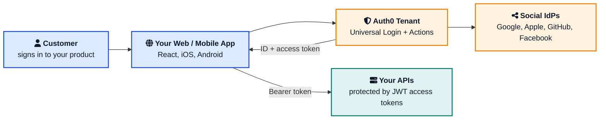
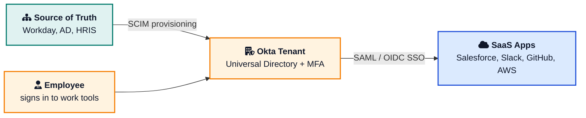
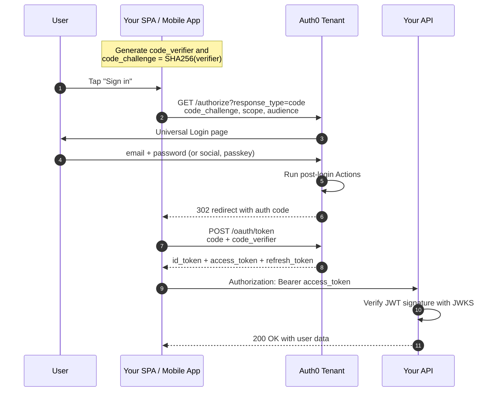
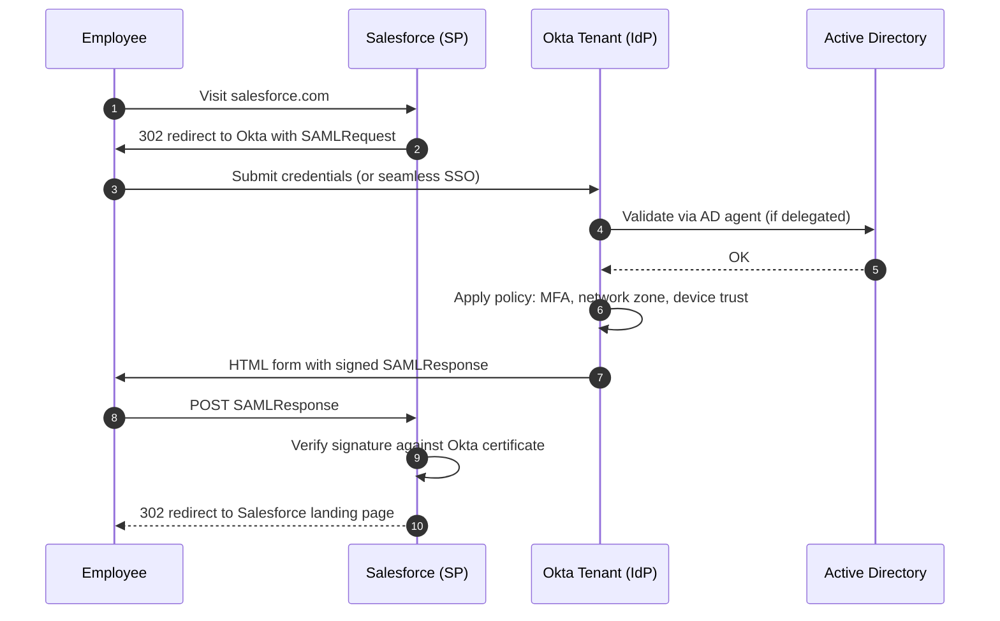
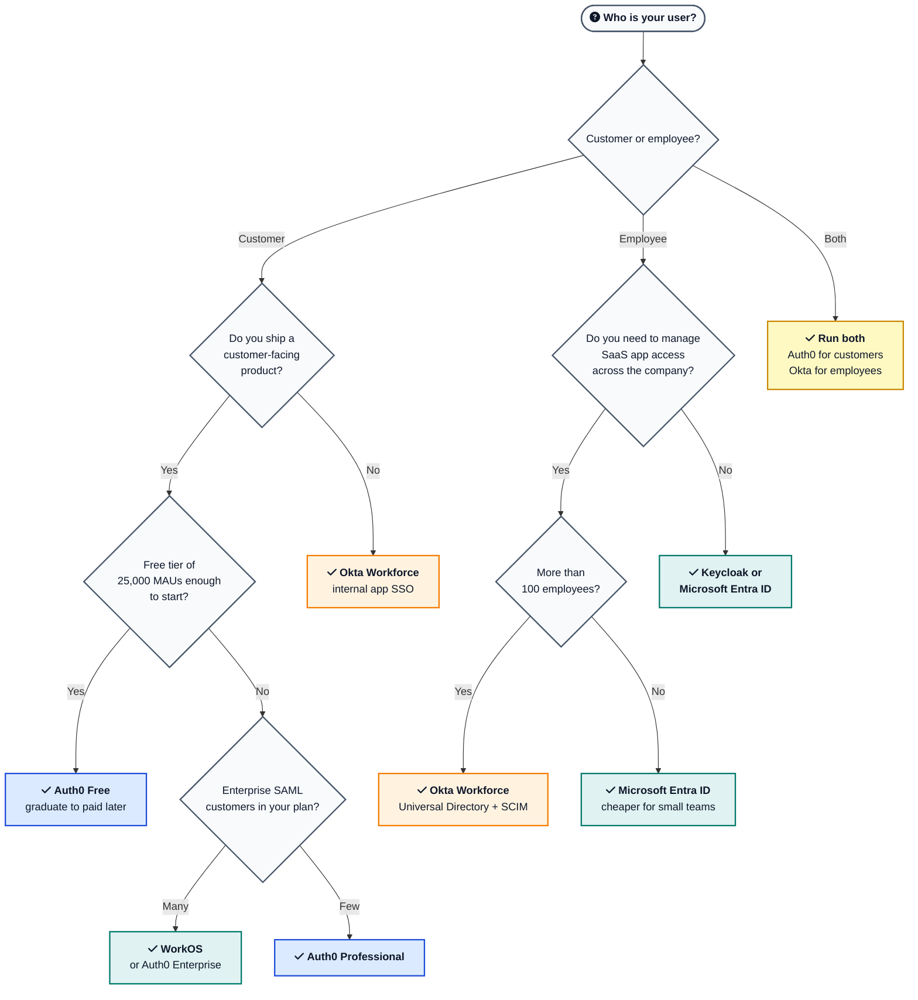
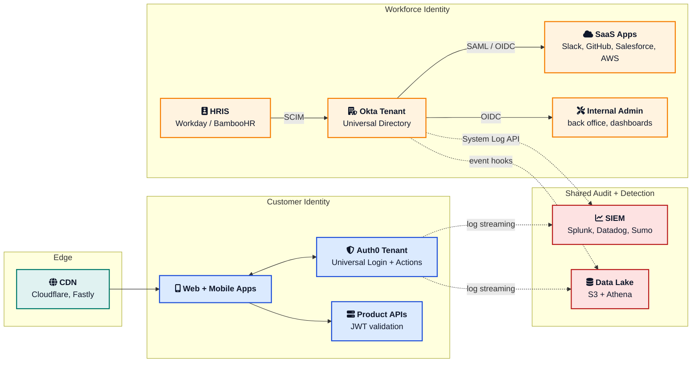

Pick the wrong identity platform on day one and you will feel it on day 800. The cheap monthly invoice from year one quietly turns into a six-figure renewal, the "we will just migrate later" assumption ages badly, and the SSO connection your biggest enterprise customer asks for arrives as a contract line item, not a checkbox.

Auth0 and Okta sit at the center of this decision for most software teams. Both belong to the same parent company. Both speak the same standards. Both have ".com" landing pages packed with the same words like CIAM, SSO, and Zero Trust. And yet they are different products with different jobs, different pricing models, and very different developer experiences.

This guide is the working answer to **Auth0 vs Okta** that a software engineer can defend in a design review. It draws on the official [Auth0 documentation](https://auth0.com/docs){:target="_blank" rel="noopener"}, the [Okta Workforce Identity Cloud docs](https://help.okta.com/oie/en-us/content/index.htm){:target="_blank" rel="noopener"}, and patterns reported by teams who actually run both in production. If you want a refresher on the protocols underneath, the post on [How OAuth 2.0 Works](/oauth-2-explained/){:target="_blank" rel="noopener"} and [Why JWT Replaced Sessions](/how-jwt-works/){:target="_blank" rel="noopener"} cover most of what you need.

---

## Table of Contents

- [The One-Minute Verdict](#the-one-minute-verdict)
- [One Company, Two Products](#one-company-two-products)
- [How Each Platform Sits in Your Architecture](#how-each-platform-sits-in-your-architecture)
- [CIAM vs Workforce Identity](#ciam-vs-workforce-identity)
- [Feature Comparison](#feature-comparison)
- [Pricing in 2026](#pricing-in-2026)
- [Developer Experience](#developer-experience)
- [Auth0 Actions and the Rules End of Life](#auth0-actions-and-the-rules-end-of-life)
- [Okta Workflows, SCIM, and the Integration Network](#okta-workflows-scim-and-the-integration-network)
- [Security, Compliance, and MFA](#security-compliance-and-mfa)
- [Sample Auth0 Login Flow](#sample-auth0-login-flow)
- [Sample Okta SAML SSO Flow](#sample-okta-saml-sso-flow)
- [When to Pick Auth0](#when-to-pick-auth0)
- [When to Pick Okta](#when-to-pick-okta)
- [When to Pick Neither](#when-to-pick-neither)
- [Common Mistakes Developers Make](#common-mistakes-developers-make)
- [Decision Tree](#decision-tree)
- [Key Takeaways](#key-takeaways)
- [Frequently Asked Questions](#frequently-asked-questions)

---

## The One-Minute Verdict

| | <i class="fas fa-user"></i> Auth0 (Okta CIC) | <i class="fas fa-building"></i> Okta Workforce (WIC) |
|---|---|---|
| **Primary job** | Login for your customers | Login for your employees |
| **Category** | Customer Identity (CIAM) | Workforce Identity (IAM) |
| **Pricing model** | Per Monthly Active User (MAU) | Per seat per month |
| **Free tier** | Up to 25,000 MAUs | 30-day free trial / Integrator Free Plan |
| **Starting paid price** | from $35 / month ([B2C Essentials](https://auth0.com/pricing){:target="_blank" rel="noopener"}) | from $6 / user / month ([Starter Suite](https://www.okta.com/pricing/){:target="_blank" rel="noopener"}) |
| **Pre-built integrations** | Smaller curated marketplace | 8,000+ via [Okta Integration Network](https://www.okta.com/integrations/){:target="_blank" rel="noopener"} |
| **Extensibility model** | Actions (Node.js, npm) | Workflows (visual no-code) |
| **Deployment** | Cloud only (multi-region) | Cloud only (multi-region) |
| **Sweet spot** | B2C and B2B SaaS sign-in | Employee SSO across SaaS tools |
| **Brand recognized by auditors** | Yes | Yes |

> **TL;DR:** If your users **pay you**, you want Auth0. If your users **work for you**, you want Okta. If both, you want both.

---

## One Company, Two Products

Okta completed the [acquisition of Auth0 in May 2021](https://www.okta.com/blog/company-and-culture/its-official-okta-joins-forces-with-auth0/){:target="_blank" rel="noopener"} in an all-stock deal worth around 6.5 billion dollars. By 2022 the marketing team had folded Auth0 into Okta as **Okta Customer Identity Cloud (CIC)**, while the original Okta platform was renamed **Okta Workforce Identity Cloud (WIC)**.

The two products kept their separate dashboards, separate APIs, separate SDKs, and separate billing. Most developers still call the customer side "Auth0" because the brand, the docs, the tenant URLs (`yourtenant.auth0.com`), and the SDK names (`auth0-react`, `node-auth0`, `Auth0.swift`) never changed.

A few facts that matter for any planning meeting:

- Auth0 was founded in 2013. Okta was founded in 2009.
- Both run as managed SaaS. There is **no self-hosted edition** of either, official or unofficial.
- They share an executive team and a trust portal, but engineering, product, pricing, and support are run as **two independent organizations** inside Okta.
- A large enterprise customer often has contracts with both, billed separately.

This matters because the question "should we use Auth0 or Okta?" is almost always the wrong question. The right question is "**which of our user populations** are we solving for?" Once that is clear, the product picks itself.



---

## How Each Platform Sits in Your Architecture

The clearest way to see the difference is to look at where each product sits relative to the user, your app, and the rest of your stack. The two diagrams below show the same idea from two angles: first Auth0 in a customer-facing product, then Okta in an internal workforce setup.

**Auth0 (Okta CIC) in a customer-facing product**



On the Auth0 side, the platform is part of **the product you ship**. Customers never see "Auth0" in the URL unless you want them to. Auth0 hands back tokens, your app uses them, and your APIs validate them. The entire experience belongs to your brand.

**Okta WIC in a workforce identity setup**



On the Okta side, the platform is part of **the back office**. Employees see the Okta sign-in page (or an SSO-only redirect) and then land in Salesforce, Slack, or your internal admin console. Okta is the source of truth for "who works here, what can they touch, and when did they last log in."

That difference shapes everything else in this post.

---

## CIAM vs Workforce Identity

The acronyms matter because they map to almost every other decision.

**CIAM (Customer Identity and Access Management)** is for users you do not employ. The scale is hundreds of thousands to hundreds of millions of accounts. Signup conversion is a business metric. Branding is non-negotiable. Privacy laws (GDPR, CCPA, LGPD) are first-class concerns. Auth0 was built for this from day one.

**Workforce IAM** is for users you do employ. The scale is dozens to tens of thousands of accounts. Lifecycle management (onboarding, role changes, offboarding) is a metric. The HR system is the source of truth. SOC 2 and SOX audits are first-class concerns. Okta Workforce was built for this from day one.

| Dimension | CIAM (Auth0) | Workforce IAM (Okta) |
|---|---|---|
| User population | Customers, prospects, partners | Employees, contractors, interns |
| Scale | 10K to 100M+ users | 50 to 100K users |
| Provisioning | Self-service signup | HRIS-driven (Workday, BambooHR) |
| De-provisioning | User-initiated delete | Termination event from HR |
| Branding | Pixel-perfect Universal Login | Okta widget, light customization |
| Common protocols | OIDC, OAuth 2.0, social login | SAML 2.0, OIDC, SCIM |
| Top concern | Conversion, fraud, privacy law | Lifecycle, audit, least privilege |
| Top metric | Time to first login | Time to deprovision a leaver |

The same standards run underneath both. The interface and the operational model are completely different.

---

## Feature Comparison

This is the table you will end up sending around in Slack when someone asks "but what does X actually do?"

| Feature | Auth0 (Okta CIC) | Okta Workforce (WIC) |
|---|---|---|
| <i class="fas fa-key"></i> **OAuth 2.0 / OIDC** | Full IdP and SP | Full IdP and SP |
| <i class="fas fa-key"></i> **SAML 2.0** | Full IdP and SP | Full IdP and SP, 1,300+ pre-built |
| <i class="fas fa-shield-halved"></i> **MFA** | TOTP, push, SMS, email, WebAuthn, Duo | Okta Verify push, FIDO2, YubiKey, Smart Card, Duo |
| <i class="fas fa-mobile-screen"></i> **Passwordless / Passkeys** | Email and SMS magic link, WebAuthn, Passkeys | Okta FastPass, FIDO2, email magic link |
| <i class="fas fa-share-nodes"></i> **Social login** | 30+ providers, one-click setup | 15+ providers |
| <i class="fas fa-id-card"></i> **Enterprise connections** | LDAP, AD, ADFS, Google Workspace, SAML, OIDC | Universal Directory, AD/LDAP agent, ADFS, GSuite |
| <i class="fas fa-users-gear"></i> **B2B organizations** | Native Organizations feature | Org2Org or hub-spoke pattern |
| <i class="fas fa-robot"></i> **Machine-to-machine** | Client credentials grant, per-token billing | OAuth for Okta, API Access Management |
| <i class="fas fa-arrows-rotate"></i> **SCIM provisioning** | Basic | Excellent, the category default |
| <i class="fas fa-network-wired"></i> **Pre-built app catalog** | Curated marketplace | 8,000+ ([OIN](https://www.okta.com/integrations/){:target="_blank" rel="noopener"}) |
| <i class="fas fa-code"></i> **Extensibility model** | Actions (Node.js + npm) | Workflows (visual) and Hooks |
| <i class="fas fa-chart-line"></i> **Adaptive risk** | Bot detection, attack protection, risk score | ThreatInsight, behavior-based policies |
| <i class="fas fa-server"></i> **Self-hosted option** | None | None |
| <i class="fas fa-flag-checkered"></i> **Regions** | US, EU, AU, JP, CA | US, EU, AU, JP, CA, plus FedRAMP |

Two highlights worth pulling out:

1. The Okta side wins on **lifecycle management and SCIM**. If your problem is "an employee left and I want every SaaS app to know within 60 seconds," Okta is built for that.
2. The Auth0 side wins on **developer extensibility**. If your problem is "I need to call a fraud-detection API in the middle of the login flow and reject high-risk signups," Auth0 Actions is built for that.



---

## Pricing in 2026

This is the section that decides most procurement meetings. The two products price on **completely different units**, which is why naive side-by-side cost comparisons usually mislead.

### Auth0 (per Monthly Active User)

Auth0 counts a user as "active" if they log in at least once in a calendar month. You pay for that user, not for every account in the database. All numbers below are from the [official Auth0 pricing page](https://auth0.com/pricing){:target="_blank" rel="noopener"} as of May 2026.

| Auth0 plan | MAUs at starting price | Monthly list price | Best for |
|---|---|---|---|
| **Free** | Up to 25,000 | $0 | Side projects, MVPs, internal tools |
| **B2C Essentials** | 500 | from $35 / month | Small consumer apps |
| **B2C Professional** | 500 | from $240 / month | Mid-size consumer apps with custom DB |
| **B2B Essentials** | 500 | from $150 / month | Small B2B SaaS, 3 SSO connections included |
| **B2B Professional** | 500 | from $800 / month | Mid-size B2B SaaS, 5 SSO connections included |
| **Enterprise** | Custom | Contact sales | Large B2C / B2B with 99.99% SLA |

Pricing scales by MAU tier inside each plan. For example, on B2C Essentials, 500 MAUs is $35/month, 10,000 MAUs is $700/month, and 50,000 MAUs is $3,500/month (see the [full B2C tier table](https://auth0.com/pricing){:target="_blank" rel="noopener"}). Yearly billing is 11x the monthly price.

Three things to model before committing:

- **Step functions hurt at scale milestones.** The jump from the free 25,000 MAUs to a paid Essentials tier that covers 30,000 MAUs is around $2,100/month. The jump from Essentials to Professional, or from Professional to Enterprise, can be larger still.
- **Enterprise SSO connections are billed per extra connection.** On B2B Essentials you get 3 connections included; on Professional you get 5. Extra connections list at **$100/month** ($1,100/year) per connection, up to 30 total, per the [Auth0 B2B add-on pricing](https://auth0.com/pricing){:target="_blank" rel="noopener"}. Negotiated enterprise contracts can be very different, but list price is the floor your finance team should know.
- **Machine-to-machine tokens are metered on Professional.** 5,000 M2M tokens per month are included; extra tokens are billed per the [M2M add-on table](https://auth0.com/pricing){:target="_blank" rel="noopener"} ($30/month for 7,500, scaling up). If your microservices issue thousands of M2M tokens per minute, plan for this line item.

### Okta Workforce (per seat per month)

Okta counts a user as "a seat" whether they log in or not. You pay per employee that you provision. Okta restructured its packaging in 2025 around suites instead of standalone products. The numbers below are from the [official Okta pricing page](https://www.okta.com/pricing/){:target="_blank" rel="noopener"} as of May 2026.

| Okta Workforce suite | Price | Includes |
|---|---|---|
| **Starter** | $6 / user / month | SSO, MFA, Universal Directory, 5 Workflows |
| **Core Essentials** | $14 / user / month | Starter plus Lifecycle Management, Identity Governance, more workflows |
| **Essentials** | $17 / user / month | Core Essentials plus Adaptive MFA, Privileged Access, Access Governance, 50 Workflows |
| **Professional** | Contact sales | Essentials plus Device Access, Identity Threat Protection, Identity Security Posture Mgmt |
| **Enterprise** | Contact sales | Professional plus API Access Management, Access Gateway, M2M Tokens |

All suites are billed annually and Okta enforces a [$1,500 annual contract minimum](https://www.okta.com/pricing/){:target="_blank" rel="noopener"} for Workforce Identity. Add-ons (extra Workflows, Privileged Access seats, ISPM, etc.) sit on top of any base suite.

A typical mid-market company ends up paying somewhere between **$14 and $25 per user per month** once a couple of add-ons are stacked on top of Core Essentials or Essentials.

### Okta Customer Identity (the Okta-branded packaging of Auth0)

If you go through `okta.com/pricing` instead of `auth0.com/pricing`, you land on a different price card aimed at enterprise buyers. The [Okta Customer Identity Enterprise base platform](https://www.okta.com/pricing/){:target="_blank" rel="noopener"} starts at **$3,000 / month** billed annually, with B2C Suite and B2B Suite tiers priced via sales. Most developers building a new app will start on the cheaper, self-serve `auth0.com/pricing` tiers above instead.

### Side-by-side example

For a B2B SaaS with 100,000 monthly active end customers and 200 internal employees, using **list prices only**:

| Item | Monthly estimate | Source |
|---|---|---|
| Auth0 B2B Professional, 100,000 MAUs | "Contact us" (100K is past the published B2B tiers) | [auth0.com/pricing](https://auth0.com/pricing){:target="_blank" rel="noopener"} |
| Realistic published B2B Essentials at 20,000 MAUs (with overflow contract) | from $3,800 / month | [auth0.com/pricing](https://auth0.com/pricing){:target="_blank" rel="noopener"} |
| Plus 10 extra enterprise SAML connections (above the 3 included) | 7 x $100 = $700 / month | [auth0.com/pricing](https://auth0.com/pricing){:target="_blank" rel="noopener"} |
| **Auth0 published list subtotal** | from **~$4,500 / month** (plus negotiated overage for 100K MAUs) | |
| Okta Workforce Essentials, 200 seats | 200 x $17 = $3,400 / month | [okta.com/pricing](https://www.okta.com/pricing/){:target="_blank" rel="noopener"} |
| **Combined published-list annual run rate** | **roughly $95K plus enterprise overage** | |

Two honesty notes about this table:

1. Past 20,000 MAUs on B2B Essentials and 20,000 MAUs on B2B Professional, Auth0 prices are "Contact us." A real B2B SaaS at 100,000 MAUs will negotiate an Enterprise contract, and reported six-figure annual totals are common.
2. Annual contracts and procurement discounting commonly knock 20 to 40 percent off published numbers. The pattern that matters more than the per-unit price is how the bill **scales** with MAUs, SSO connections, and add-on modules.

---

## Developer Experience

This is where Auth0 historically pulled ahead and still leads. Okta has narrowed the gap on the workforce side, but for "I am a developer adding login to my app," Auth0 is the more developer-friendly path.

### Auth0 SDK and dashboard

- **First-class SDKs** for React, Next.js, Vue, Angular, iOS, Android, Flutter, Node.js, Python, Go, Java, .NET, PHP, and Ruby. Most ship with a quickstart that gets login working in under 10 minutes.
- **Universal Login** is a hosted login page that you brand to look like your product. It handles password reset, email verification, MFA enrollment, and bot detection automatically.
- **Real-time logs** in the dashboard let you see failed signups, MFA enrollments, and Action errors as they happen. This is the feature most teams underestimate until they need it at 2 AM.
- **The Management API** is REST-first with great error messages. The CLI and Terraform provider make CI/CD straightforward.

### Okta SDK and dashboard

- **Sign-In Widget** is the Okta equivalent of Universal Login. It is customizable but more opinionated than Auth0's, and the heritage is workforce, so it shows.
- **SDKs cover the popular frameworks** (React, Angular, Vue, iOS, Android, Node.js, Java, Spring Boot, .NET), but the documentation often assumes you are integrating Okta into a SaaS app you bought, not building one of your own.
- **The Okta admin console** is dense. It is also the most powerful console in the category for managing thousands of users, groups, and apps.
- **Terraform support is excellent** for both products and is the recommended way to manage tenants past a small scale.

The honest summary: Auth0 is built like a developer tool. Okta is built like an IT admin tool with an SDK bolted on. Both work. They feel different.



---

## Auth0 Actions and the Rules End of Life

If you are adopting Auth0 in 2026, you write **Actions**. Rules and Hooks are legacy, and the [official deprecation page](https://auth0.com/docs/troubleshoot/product-lifecycle/deprecations-and-migrations){:target="_blank" rel="noopener"} sets a hard end-of-life date.

Three dates to put on the team calendar:

- **May 16, 2023.** Rules and Hooks deprecated for new tenants.
- **November 18, 2024.** Existing Rules and Hooks moved to read-only mode. You can toggle them on or off but you cannot edit the source.
- **November 18, 2026.** Rules and Hooks stop executing entirely.

If your tenant is still on Rules, plan the migration to Actions now. Auth0 ships a [Rule Migration tool](https://auth0.com/docs/customize/actions/migrate/migrate-a-rule-to-an-action){:target="_blank" rel="noopener"} in the dashboard that handles common patterns, but anything that touches external HTTP calls, custom user metadata mutation, or careful ordering will need a real review.

A minimal Action that runs after a successful login looks like this:

```javascript
exports.onExecutePostLogin = async (event, api) => {
  // Block logins from sanctioned countries
  const blockedCountries = ['XX', 'YY'];
  if (blockedCountries.includes(event.request.geoip.countryCode)) {
    api.access.deny('Access not permitted from your region.');
    return;
  }

  // Enrich the ID token with a custom role claim
  const namespace = 'https://api.yourapp.com';
  if (event.user.app_metadata.role) {
    api.idToken.setCustomClaim(`${namespace}/role`, event.user.app_metadata.role);
    api.accessToken.setCustomClaim(`${namespace}/role`, event.user.app_metadata.role);
  }

  // Trigger MFA for high-value accounts
  if (event.user.app_metadata.tier === 'enterprise') {
    api.multifactor.enable('any', { allowRememberBrowser: false });
  }
};
```

Compared with the old Rules API, Actions give you `event` and `api` objects with typed methods, real async/await, npm package support, and a visual flow editor that shows the order in which Actions fire across the login, pre-user-registration, post-change-password, and machine-to-machine pipelines.

If you want a deeper look at the token claims those Actions produce, the post on [How JWT Works](/how-jwt-works/){:target="_blank" rel="noopener"} walks through what each claim means and how to verify it on the receiving end.

---

## Okta Workflows, SCIM, and the Integration Network

The Okta side does extensibility differently. Instead of "write JavaScript in the login pipeline," Okta gives you **Workflows**, a visual no-code automation tool that fires on identity events and stitches together calls to other SaaS APIs.

A common Workflow looks like this:

1. Trigger: "User added to Engineering group in Okta."
2. Action: "Create GitHub user in the Engineering team."
3. Action: "Send Slack message in #welcome with the new hire's name."
4. Action: "Create a Jira ticket for IT to ship the laptop."
5. Action: "Wait 7 days, then poll the Jira ticket for status."

The interesting part is what you do **not** write. There is no Node.js function. There is no webhook receiver. Okta hosts the runtime, the secrets, the retries, and the audit log.

For the SCIM side, Okta's [Universal Directory](https://www.okta.com/products/universal-directory/){:target="_blank" rel="noopener"} is the source of truth that pushes user changes into downstream SaaS apps. When HR fires an employee in Workday, Okta deactivates their Salesforce, Slack, and GitHub accounts inside the same minute. This is the single most valuable feature on the Okta side and is the reason large companies pay the bill.

The [Okta Integration Network](https://www.okta.com/integrations/){:target="_blank" rel="noopener"} currently lists more than 8,000 pre-built integrations, of which more than 1,300 support SAML 2.0 or OIDC for SSO and a smaller subset support SCIM provisioning. For a company that uses 50 to 100 SaaS tools, this catalog is the difference between "we set up SSO in a week" and "we set up SSO over the next two quarters."

---

## Security, Compliance, and MFA

Both platforms are SOC 2 Type II, ISO 27001, HIPAA BAA-ready, and GDPR-aligned. Both publish current trust portals. For most regulated industries (finance, healthcare, ed-tech), either platform passes the security review without a special exception.

A few specific notes that matter in 2026:

- **Passkeys are first-class on both.** Auth0 supports passkeys for Universal Login and Okta supports them through FastPass. The [explainer on passkeys](/explainer/passkeys-explained/){:target="_blank" rel="noopener"} covers how the underlying WebAuthn flow works.
- **Phishing-resistant MFA is the default ask** in any new enterprise procurement form. Both platforms support FIDO2 security keys (YubiKey, Titan) and platform authenticators (Touch ID, Windows Hello).
- **Okta supports Smart Card and PIV/CAC** out of the box, which is mandatory for US federal and defense deployments. Auth0 does not.
- **Auth0 has Attack Protection** (bot detection, breached password detection, suspicious IP throttling) included in higher-tier plans. The breached password check uses the [Have I Been Pwned](https://haveibeenpwned.com/){:target="_blank" rel="noopener"} dataset.
- **Both publish security advisories** at [auth0.com/security](https://auth0.com/security){:target="_blank" rel="noopener"} and [trust.okta.com](https://trust.okta.com/){:target="_blank" rel="noopener"}. Subscribe to both if you run either in production.

For the token-level mechanics of OAuth 2.0 and OIDC that sit underneath all of this, the post on [How OAuth 2.0 Works](/oauth-2-explained/){:target="_blank" rel="noopener"} is the long version.

---

## Sample Auth0 Login Flow

Here is what an OIDC Authorization Code + PKCE flow looks like end to end on Auth0. This is the most common flow for a single-page app or a mobile app.



The Action inserted at step 5 is where you customize the flow. That is also where teams add fraud checks, IP allowlists, enrichment from a CRM, or routing logic between B2B organizations.

If the API in step 9 belongs to you, you verify the token using the public keys advertised at the tenant's JWKS endpoint, usually `https://yourtenant.auth0.com/.well-known/jwks.json`. The post on [How JWT Works](/how-jwt-works/){:target="_blank" rel="noopener"} walks through that verification step by step.



---

## Sample Okta SAML SSO Flow

Now the same diagram on the Okta side, this time for an employee signing into a third-party SaaS app like Salesforce.



There are no JWTs in this flow. SAML is XML-based, the assertion is signed by Okta's private key, and Salesforce trusts Okta by having its public certificate registered. This is the flow that powers most enterprise SSO deployments today, even in 2026, and it is the flow that the Okta Integration Network's 1,300+ SAML apps standardize on.

The same flow works in reverse on Auth0 if you are the SaaS app and your enterprise customer wants to bring their own SAML IdP. Auth0 calls this an "enterprise connection" and bills it per connection, as covered above.

---

## When to Pick Auth0

Pick Auth0 (Okta Customer Identity Cloud) when most of these are true:

- <i class="fas fa-check-circle" style="color: #16a34a;"></i> The users you are building for are **your customers**, not your employees.
- <i class="fas fa-check-circle" style="color: #16a34a;"></i> You are a **B2C product**, a **B2B SaaS**, or an **API platform** that needs token-based auth.
- <i class="fas fa-check-circle" style="color: #16a34a;"></i> You want **first-class SDKs** for the framework you already use.
- <i class="fas fa-check-circle" style="color: #16a34a;"></i> You need **social login, passwordless, or passkeys** without writing them yourself.
- <i class="fas fa-check-circle" style="color: #16a34a;"></i> You expect to **customize the login flow** with code (fraud checks, enrichment, B2B routing).
- <i class="fas fa-check-circle" style="color: #16a34a;"></i> Your auditor needs a vendor with a recognizable name and SOC 2.

Real teams that fit this profile: any B2C app with social login, any B2B SaaS with a free signup tunnel, any developer platform issuing API keys and OAuth-style scopes, any e-commerce platform that needs branded sign-in.

---

## When to Pick Okta

Pick Okta Workforce Identity Cloud when most of these are true:

- <i class="fas fa-check-circle" style="color: #16a34a;"></i> The users you are managing are **employees, contractors, and partners**.
- <i class="fas fa-check-circle" style="color: #16a34a;"></i> Your company uses **a lot of SaaS tools** and you want single sign-on across all of them.
- <i class="fas fa-check-circle" style="color: #16a34a;"></i> You need **SCIM provisioning** to auto-create and auto-deprovision accounts.
- <i class="fas fa-check-circle" style="color: #16a34a;"></i> Your **HR system (Workday, BambooHR, ADP) is the source of truth** and identity must flow downstream from there.
- <i class="fas fa-check-circle" style="color: #16a34a;"></i> You have to satisfy **SOX, SOC 2, ISO 27001, or FedRAMP** audits with detailed access reviews.
- <i class="fas fa-check-circle" style="color: #16a34a;"></i> You expect to integrate with **Active Directory, ADFS, or Google Workspace** as a primary directory.

Real teams that fit this profile: any company past 50 employees, any regulated enterprise (banking, healthcare, defense), any company about to go through SOX prep, any IT team that owns the SaaS app inventory.

---

## When to Pick Neither

Auth0 and Okta are not the only options on the table in 2026. Both can become expensive, both are cloud-only, and both have specific tradeoffs that send some teams elsewhere.

| Alternative | When to choose it |
|---|---|
| <i class="fas fa-server"></i> **[Keycloak](https://www.keycloak.org/){:target="_blank" rel="noopener"}** | You need self-hosted, open-source, full control over data residency. Higher operational burden. |
| <i class="fas fa-aws"></i> **[AWS Cognito](https://aws.amazon.com/cognito/){:target="_blank" rel="noopener"}** | You are already deep on AWS and want a pay-per-MAU CIAM that integrates with API Gateway and Lambda. UX is rougher. |
| <i class="fab fa-google"></i> **[Firebase Authentication](https://firebase.google.com/products/auth){:target="_blank" rel="noopener"}** | You are building a consumer mobile or web app on Firebase. Generous free tier, weaker B2B story. |
| <i class="fas fa-bolt"></i> **[Clerk](https://clerk.com/){:target="_blank" rel="noopener"}** | You want a developer-first sign-in component for Next.js or React with great UI defaults out of the box. |
| <i class="fas fa-link"></i> **[WorkOS](https://workos.com/){:target="_blank" rel="noopener"}** | You are a B2B SaaS and your problem is "enterprise SSO + SCIM" specifically, not full CIAM. Per-connection pricing is friendlier than Auth0's. |
| <i class="fab fa-microsoft"></i> **[Microsoft Entra ID](https://www.microsoft.com/en-us/security/business/identity-access/microsoft-entra-id){:target="_blank" rel="noopener"}** | Your workforce already lives in Microsoft 365. Often the cheapest Okta alternative if you are already paying Microsoft. |
| <i class="fas fa-key"></i> **[Stytch](https://stytch.com/){:target="_blank" rel="noopener"}** | You want a passwordless-first developer API with strong B2B SaaS features. |

The honest take: most teams that **think** they need to leave Auth0 because of price actually need to renegotiate. Most teams that **think** they need to leave Okta usually need to deflate their license count first. Switching IdPs is expensive. Use it as the final move, not the first.

---

## Common Mistakes Developers Make

These are the mistakes I see most often in identity reviews. None of them are about the platform itself.

### <i class="fas fa-exclamation-triangle"></i> Mistake 1: Storing the access token in localStorage

Token theft via XSS is the most common attack on a CIAM stack. The fix is the same regardless of provider: use a backend-for-frontend (BFF) pattern that keeps tokens in an `httpOnly` cookie on a same-site domain, or use the Auth0 SDK's in-memory token storage. Never write `localStorage.setItem('access_token', token)`. The [JWT post](/how-jwt-works/){:target="_blank" rel="noopener"} covers the full storage tradeoff.

### <i class="fas fa-exclamation-triangle"></i> Mistake 2: Skipping the audience claim on access tokens

If your API does not validate the `aud` claim, a token issued for a totally different API can be replayed against yours. Always configure an audience for your API resource in Auth0 (or your authorization server in Okta) and verify it on every request.

### <i class="fas fa-exclamation-triangle"></i> Mistake 3: Putting business logic in Rules instead of Actions

If you adopt Auth0 in 2026, write Actions from day one. Anything you write in a Rule will need to be re-written on November 18, 2026 because Rules stop executing. The [Auth0 deprecation page](https://auth0.com/docs/troubleshoot/product-lifecycle/deprecations-and-migrations){:target="_blank" rel="noopener"} is the source of truth here.

### <i class="fas fa-exclamation-triangle"></i> Mistake 4: Treating SAML enterprise connections as free

Auth0 includes 3 enterprise connections on B2B Essentials and 5 on B2B Professional. Additional connections list at [$100/month each](https://auth0.com/pricing){:target="_blank" rel="noopener"}, capped at 30 total. That is the published list. Negotiated enterprise contracts can be far higher and bundled differently, so confirm with sales before promising an enterprise customer a quick SAML turn-on. If per-connection pricing is your main concern, look at [WorkOS](https://workos.com/pricing){:target="_blank" rel="noopener"} where connections are bundled at flatter rates.

### <i class="fas fa-exclamation-triangle"></i> Mistake 5: Letting Okta admin permissions sprawl

Every "Super Admin" in Okta can read every user, every group, and every secret. Most companies should have two to four Super Admins, the rest scoped down to "Read Only Admin" or "Application Admin." Audit this quarterly.

### <i class="fas fa-exclamation-triangle"></i> Mistake 6: Forgetting about machine-to-machine

If your microservices call each other, they need to authenticate too. Auth0 bills M2M tokens per token issued, which surprises teams. Cache and reuse the access token for its full lifetime, do not issue a new one per request. The post on [the role of queues in system design](/role-of-queues-in-system-design/){:target="_blank" rel="noopener"} covers the patterns where this comes up most.



---

## Decision Tree

When in doubt, walk this tree.



If you can answer "who is the user" in one sentence, the answer is usually obvious. If you cannot, that is the first thing to fix.

---

## Real-World Architecture Pattern

The largest deployments end up looking like this. Customer identity on Auth0, workforce identity on Okta, both feeding into a unified audit pipeline.



Two things to notice about this shape:

1. **Auth0 and Okta do not talk directly.** They both push logs to a shared SIEM and data lake, which is where the security team correlates customer-facing and employee-facing identity events.
2. **The Internal Admin app is behind Okta**, not Auth0. Many teams get this wrong on day one, put it behind Auth0 because "we already have Auth0," and then have to migrate it when the security team asks for SCIM-driven offboarding. Build the admin app behind Okta from the start.

For more on how to think about cross-cutting concerns like this, the [System Design Cheat Sheet](/system-design-cheat-sheet/){:target="_blank" rel="noopener"} covers the patterns you will use over and over.

---

## Key Takeaways

1. **Auth0 is for your customers. Okta Workforce is for your employees.** Same parent company, separate products, separate dashboards, separate bills.
2. **Pricing models are different.** Auth0 charges per MAU. Okta charges per seat. Compare on total cost of ownership over three years, not per-unit price.
3. **Both speak OAuth 2.0, OIDC, and SAML 2.0.** Protocol parity is not the differentiator. Operational fit is.
4. **Auth0 wins on developer experience.** SDKs, Universal Login, Actions, and Terraform support are best in class for CIAM.
5. **Okta wins on enterprise breadth.** The Okta Integration Network has 8,000+ pre-built apps. SCIM provisioning is the category default.
6. **Migrate off Auth0 Rules before November 18, 2026.** Actions replaced them. Anything left on Rules stops executing on that date.
7. **Plan for SAML per-connection costs in B2B.** A handful of enterprise customers can change the bill more than the next 25,000 MAUs.
8. **Pick the right user population first.** Once that is locked in, the product picks itself.

---

## Related Reading

- [Why JWT Replaced Sessions](/how-jwt-works/){:target="_blank" rel="noopener"} - the token format Auth0 and Okta both hand back
- [How OAuth 2.0 Works](/oauth-2-explained/){:target="_blank" rel="noopener"} - the protocol underneath every modern identity flow
- [Passkeys Explained](/explainer/passkeys-explained/){:target="_blank" rel="noopener"} - the passwordless standard both platforms now support
- [System Design Cheat Sheet](/system-design-cheat-sheet/){:target="_blank" rel="noopener"} - where identity fits in the larger picture
- [How Stripe Prevents Double Payments](/how-stripe-prevents-double-payment/){:target="_blank" rel="noopener"} - the idempotency patterns you will need around authentication events
- [Circuit Breaker Pattern Explained](/circuit-breaker-pattern/){:target="_blank" rel="noopener"} - how to keep your app up when the IdP is having a bad day

External references used in this post:

- [Auth0 Pricing (official)](https://auth0.com/pricing){:target="_blank" rel="noopener"} - source for every Auth0 dollar figure above
- [Okta Pricing (official)](https://www.okta.com/pricing/){:target="_blank" rel="noopener"} - source for every Okta dollar figure above
- [Auth0 Documentation](https://auth0.com/docs){:target="_blank" rel="noopener"}
- [Okta Workforce Identity Cloud Documentation](https://help.okta.com/oie/en-us/content/index.htm){:target="_blank" rel="noopener"}
- [Auth0 Deprecations and Migrations](https://auth0.com/docs/troubleshoot/product-lifecycle/deprecations-and-migrations){:target="_blank" rel="noopener"}
- [Okta Integration Network](https://www.okta.com/integrations/){:target="_blank" rel="noopener"}
- [Okta Joins Forces With Auth0 (acquisition announcement)](https://www.okta.com/blog/company-and-culture/its-official-okta-joins-forces-with-auth0/){:target="_blank" rel="noopener"}

---



*Picking the right identity platform is one of the choices that compounds for years. Get the user population right, plan the pricing model honestly, and lean on the standards (OIDC, SAML, SCIM) so you can move later if you need to. For more on the security primitives that sit alongside this decision, see the posts on [How OAuth 2.0 Works](/oauth-2-explained/){:target="_blank" rel="noopener"} and [Why JWT Replaced Sessions](/how-jwt-works/){:target="_blank" rel="noopener"}.*
