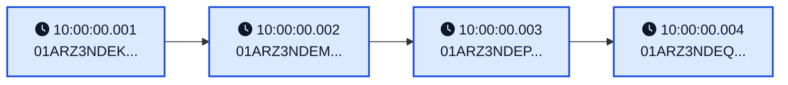
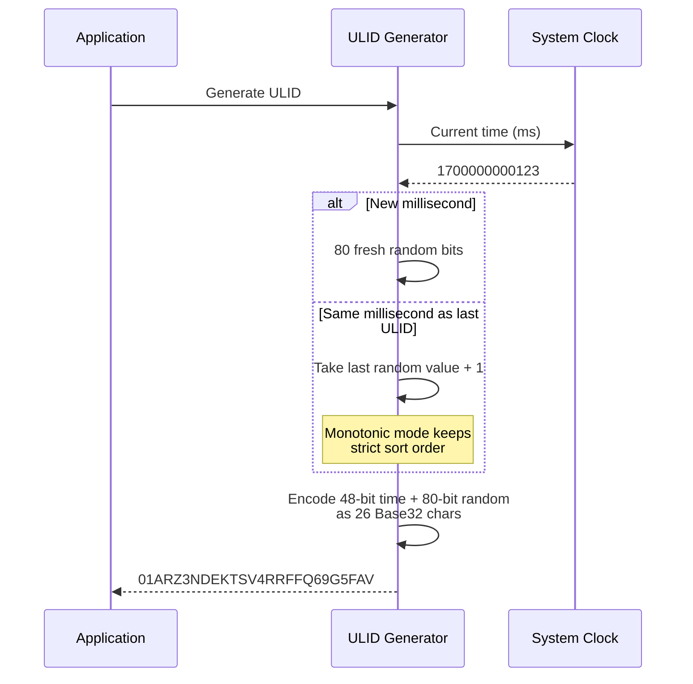
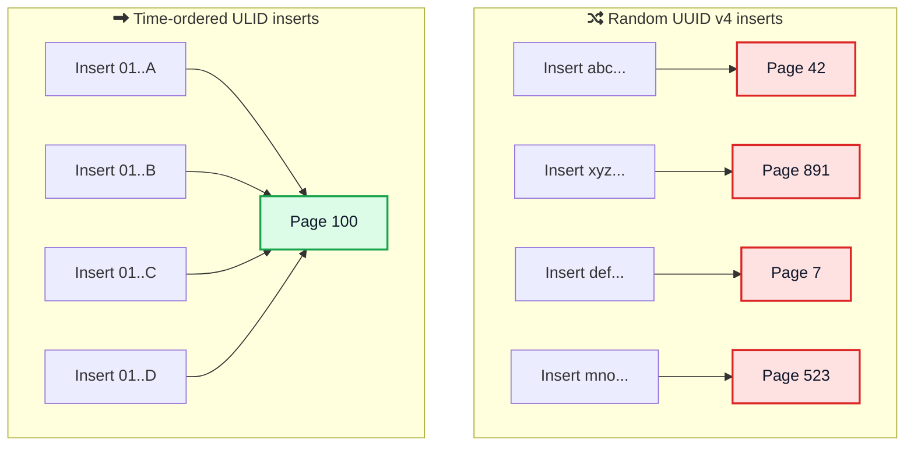

Every row you insert, every event you log, every order a customer places needs an ID. For years the default answer was a UUID. Generate a random 128-bit value, never think about it again. It works, but if you have ever watched a `users` table slow down as it grew past a few million rows, you have felt the hidden cost of random IDs.

ULIDs fix the most annoying part of UUID v4 while keeping the part everyone likes. They are globally unique with no central coordinator, but they also sort by time. That one property makes them much friendlier to your database and a lot easier to debug.

This guide walks through what a ULID actually is, how the format works bit by bit, how it compares to UUID v4, UUID v7, and Snowflake IDs, and how to generate and decode one in the languages you use every day.



## <i class="fas fa-question-circle"></i> What Is a ULID?

ULID stands for **Universally Unique Lexicographically Sortable Identifier**. It was created by Alizain Feerasta and published as an open [spec on GitHub](https://github.com/ulid/spec){:target="_blank"}. The goal was simple: keep the 128-bit uniqueness of a UUID but make the IDs sort by creation time.

A ULID looks like this:

```
01ARZ3NDEKTSV4RRFFQ69G5FAV
```

That is 26 characters. Compare it to a UUID, which is 36 characters with four hyphens:

```
f47ac10b-58cc-4372-a567-0e02b2c3d479
```

Both hold 128 bits of information. The ULID is shorter because it uses [Crockford's Base32](https://www.crockford.com/base32.html){:target="_blank"} instead of hexadecimal, packing 5 bits into every character instead of 4.

Here is the headline list of what a ULID gives you, straight from the spec:

- 128-bit compatibility with UUID
- 1.21 x 10^24 unique ULIDs per millisecond
- Lexicographically sortable
- 26 characters instead of 36
- Crockford Base32 for readability
- Case insensitive
- No special characters, so it is URL-safe
- Monotonic sort order within the same millisecond

## <i class="fas fa-project-diagram"></i> The ULID Structure

A ULID is two parts glued together: a timestamp and some randomness.

<div style="display: flex; margin: 25px 0; border-radius: 8px; overflow: hidden; font-family: -apple-system, BlinkMacSystemFont, 'Segoe UI', Roboto, sans-serif; font-size: 14px; box-shadow: 0 2px 8px rgba(0,0,0,0.1);">
  <div style="flex: 48; background: #3b82f6; color: white; padding: 15px 10px; text-align: center; font-weight: 600;">
    <div>Timestamp</div>
    <div style="font-size: 12px; opacity: 0.9; margin-top: 4px;">48 bits / 10 chars</div>
  </div>
  <div style="flex: 80; background: #10b981; color: white; padding: 15px 10px; text-align: center; font-weight: 600;">
    <div>Randomness</div>
    <div style="font-size: 12px; opacity: 0.9; margin-top: 4px;">80 bits / 16 chars</div>
  </div>
</div>

Mapping that onto the example ULID:

```
 01ARZ3NDEK   TSV4RRFFQ69G5FAV
|----------| |----------------|
 Timestamp       Randomness
  48 bits          80 bits
```

Here is what each part does:

| Component | Bits | Characters | Purpose |
|-----------|------|------------|---------|
| Timestamp | 48 | 10 | Unix time in milliseconds, most significant bits first |
| Randomness | 80 | 16 | Cryptographically random data for uniqueness |

**Why 48 bits for the timestamp?** Forty-eight bits of milliseconds is enough to count time until the year 10889 AD. You will not run out. It also fits neatly into 6 bytes, leaving 10 bytes for randomness in the 16-byte binary form.

**Why 80 bits of randomness?** That is `2^80`, or about 1.21 septillion values, generated fresh every millisecond. Two ULIDs colliding in the same millisecond is something you will never see in a real system.

## <i class="fas fa-sort-numeric-down"></i> Why "Lexicographically Sortable" Matters

This is the whole point of a ULID, so it is worth slowing down.

"Lexicographically sortable" just means that if you sort the strings the way a dictionary or a database index sorts text, they come out in time order. Because the timestamp sits in the leftmost characters, an older ULID is always "smaller" than a newer one.



Sort those four strings alphabetically and you also sort them by time. A random UUID v4 gives you no such guarantee. Sort a list of UUID v4 values and you get random nonsense order.

This single property buys you a lot:

- **Sort by creation time with no extra column.** The ID itself is the timestamp.
- **Cheap range queries on recent data.** "Give me everything created today" becomes a range scan.
- **Healthy database indexes.** New rows append to the end of the B-tree instead of poking holes in the middle. More on that below.

## <i class="fas fa-font"></i> Crockford Base32: Why ULIDs Look the Way They Do

ULIDs are encoded with Crockford's Base32 alphabet:

```
0123456789ABCDEFGHJKMNPQRSTVWXYZ
```

That is the 10 digits plus 22 letters. Four letters are missing on purpose:

- **No `I`** because it looks like `1`
- **No `L`** because it also looks like `1`
- **No `O`** because it looks like `0`
- **No `U`** to avoid accidental rude words

The result is an ID you can read over the phone, type without squinting, and paste into a URL without escaping anything. ULIDs are also case-insensitive, so `01ARZ3NDEK` and `01arz3ndek` are the same ID.

One quirk worth knowing: 26 Base32 characters can technically hold 130 bits, but a ULID only uses 128. The spec handles this by limiting the first character to the range `0` through `7`. The largest valid ULID is `7ZZZZZZZZZZZZZZZZZZZZZZZZZ`. Any string starting with `8` or higher is not a valid ULID, which is a handy thing for validators to check.



## <i class="fas fa-cogs"></i> How a ULID Is Generated

Generating a ULID is two steps: read the clock, add randomness. The interesting part is what happens when you generate more than one in the same millisecond.



In the simplest mode, every ULID gets brand new random bits. That is fine for uniqueness, but the spec notes that within a single millisecond, sort order is then "not guaranteed." Two ULIDs made in the same millisecond with independent random parts could sort in either order.

That brings us to monotonic generation.

## <i class="fas fa-sort"></i> Monotonic ULIDs

Monotonic generation fixes same-millisecond ordering. When the generator sees that the new ULID is in the same millisecond as the last one, instead of rolling fresh randomness it takes the previous random value and **increments it by one**.

From the [official JavaScript implementation](https://github.com/ulid/javascript?tab=readme-ov-file#monotonic-ulids){:target="_blank"}:

```javascript
import { monotonicFactory } from "ulid";

const ulid = monotonicFactory();

// All generated in the same millisecond, strictly increasing
ulid(150000); // 000XAL6S41ACTAV9WEVGEMMVR8
ulid(150000); // 000XAL6S41ACTAV9WEVGEMMVR9
ulid(150000); // 000XAL6S41ACTAV9WEVGEMMVRA
ulid(150000); // 000XAL6S41ACTAV9WEVGEMMVRB
```

Notice how only the last character changes, stepping forward by one each time. That guarantees strict order even when you generate thousands of IDs per millisecond.

There are two things to keep in mind:

1. **It can overflow.** The random part is initialized randomly. If that first value lands close to all-ones, you can overflow the 80-bit space after only a few increments in the same millisecond. The spec says the generator must throw an error when this happens. Good libraries surface that as an exception you should be ready to retry.

2. **It only works on one node.** Monotonicity is tracked in memory on a single generator. Two processes, or two servers, have no shared counter. Across nodes you only get ordering as good as your clock synchronization. Do not rely on strict monotonicity across a cluster.

## <i class="fas fa-balance-scale"></i> ULID vs UUID vs UUID v7

This is the comparison most people come here for. UUID v4 is the random one everybody knows. UUID v7, standardized in [RFC 9562](https://datatracker.ietf.org/doc/html/rfc9562){:target="_blank"}, is the newer time-ordered UUID that competes directly with ULID.

| Feature | ULID | UUID v4 | UUID v7 |
|---------|------|---------|---------|
| Size in bits | 128 | 128 | 128 |
| String length | 26 chars | 36 chars | 36 chars |
| Encoding | Crockford Base32 | Hex with hyphens | Hex with hyphens |
| Time-sortable | Yes | No | Yes |
| Carries a timestamp | Yes | No | Yes |
| Random bits | 80 | 122 | ~74 |
| URL-safe as-is | Yes | Needs nothing special | Has hyphens |
| Formal standard | Community spec | RFC 9562 | RFC 9562 |
| Native DB column | Store as text or 16 bytes | `uuid` | `uuid` |

A few takeaways from the table and from independent benchmarks:

- **ULID and UUID v7 are functionally twins.** Both put a 48-bit millisecond timestamp in the high bits, so both turn inserts into sequential appends. Their database performance is comparable. The real difference is format and ecosystem.
- **UUID v7 wins on standardization.** It is an IETF standard with native `uuid` columns and built-in generators. PostgreSQL 18 ships a `uuidv7()` function, so there is no extension to install.
- **ULID wins on size and readability.** Twenty-six URL-safe characters beat thirty-six hex characters with hyphens when the ID shows up in URLs, logs, or anywhere a human reads it.
- **UUID v4 is still the right call for secrets.** Its 122 random bits and complete lack of structure make it the better choice when the ID must be unguessable.

If you want a quick mental model: use UUID v7 when you want a standard sortable ID inside the UUID ecosystem, use ULID when you want a short readable sortable string, and keep UUID v4 for tokens that must stay secret.



## <i class="fas fa-snowflake"></i> ULID vs Snowflake IDs

ULIDs and [Snowflake IDs](/snowflake-id-guide/){:target="_blank"} both encode time and both sort chronologically, but they aim at different problems.

| Feature | ULID | Snowflake ID |
|---------|------|--------------|
| Size | 128 bits | 64 bits |
| Coordination | None | Needs a unique machine ID per node |
| Uniqueness source | 80 random bits | Machine ID plus per-ms sequence |
| Format | 26-char Base32 string | 64-bit integer |
| Best fit | Decentralized IDs, app-level keys | High-throughput central ID services |

Snowflake IDs are smaller and pack more IDs per millisecond per node, but they require you to assign and manage a unique machine ID for every generator. ULIDs need zero coordination because their uniqueness comes from randomness, which makes them simpler to drop into any service or even client code. If you are weighing all the options for distributed identifiers, the [Snowflake ID guide](/snowflake-id-guide/){:target="_blank"} covers the 64-bit approach in depth.

## <i class="fas fa-laptop-code"></i> Generating ULIDs in Code

You almost never write the encoder yourself. Every major language has a well-tested library. Here are the common ones.

**JavaScript / TypeScript** using the [ulid](https://github.com/ulid/javascript){:target="_blank"} package:

```javascript
import { ulid } from "ulid";

ulid(); // "01ARZ3NDEKTSV4RRFFQ69G5FAV"

// Seed a specific time, useful for tests and migrations
ulid(1469918176385); // "01ARYZ6S41TSV4RRFFQ69G5FAV"
```

**Python** using the [python-ulid](https://github.com/mdomke/python-ulid){:target="_blank"} package:

```python
from ulid import ULID

u = ULID()
print(u)                 # 01E75HZVW36EAZKMF1W7XNMSB4
print(u.timestamp)       # 1587053026.123 (Unix seconds)
print(u.datetime)        # 2020-04-16 17:23:46.123000+00:00
```

**Java** using the [ulid-creator](https://github.com/f4b6a3/ulid-creator){:target="_blank"} library:

```java
import com.github.f4b6a3.ulid.Ulid;
import com.github.f4b6a3.ulid.UlidCreator;

Ulid ulid = UlidCreator.getUlid();
System.out.println(ulid);                 // 01ARZ3NDEKTSV4RRFFQ69G5FAV
System.out.println(ulid.getInstant());    // creation time as Instant

// Monotonic variant for strict same-ms ordering
Ulid monotonic = UlidCreator.getMonotonicUlid();
```

**Go** using the [oklog/ulid](https://github.com/oklog/ulid){:target="_blank"} package:

```go
import (
    "math/rand"
    "time"

    "github.com/oklog/ulid/v2"
)

// Simple, uses a default entropy source
id := ulid.Make()
println(id.String()) // 01ARZ3NDEKTSV4RRFFQ69G5FAV
```

A couple of practical notes that bite people:

- **Use a cryptographically secure random source.** Browser libraries use `crypto.getRandomValues()` and Node uses `crypto.randomBytes()`. Avoid `Math.random()` for anything real.
- **Monotonic readers are usually not thread-safe by default.** If you generate ULIDs from multiple threads, wrap the generator in a lock or use the library's thread-safe entry point. Otherwise you can corrupt the in-memory counter.

If you just want a few sample IDs without wiring up a library, you can [generate a ULID online](/tools/ulid-generator/){:target="_blank"} and watch the timestamp and randomness split apart in real time.

## <i class="fas fa-database"></i> ULIDs as Database Primary Keys

This is where ULIDs earn their keep. To see why, look at how random IDs behave inside a B-tree index versus time-ordered ones.



Random UUID v4 values land in random spots across the whole index. Each insert may touch a different page, which means more disk reads, more cache misses, frequent page splits, and a bloated index. Independent PostgreSQL benchmarks regularly show random UUID v4 producing indexes two to three times larger than time-ordered keys, with insert throughput three to five times slower on large tables.

ULIDs, like UUID v7, insert in roughly increasing order. New rows append to the rightmost leaf page. Pages stay full, the working set stays small and cache-friendly, and page splits become rare. The behavior is close to a plain auto-increment integer while keeping global uniqueness. The deeper mechanics live in the [database indexing guide](/database-indexing-explained/){:target="_blank"} and the [B-tree data structure explainer](/data-structures/b-tree/){:target="_blank"}.

**Store them efficiently.** A ULID is 128 bits. Storing it as a 26-character string works but wastes space and slows comparisons. Where you can, store the 16-byte binary form:

- **PostgreSQL:** store as `uuid` (a ULID is a valid 128-bit value) or as `bytea`. The [pgx_ulid extension](https://github.com/pksunkara/pgx_ulid){:target="_blank"} adds a native `ulid` type and a `gen_ulid()` default if you want one.
- **MySQL:** use `BINARY(16)` rather than `CHAR(26)`. The binary form is smaller and compares faster.

If you are choosing a database engine alongside your ID strategy, the [PostgreSQL vs MongoDB vs DynamoDB comparison](/postgresql-vs-mongodb-vs-dynamodb/){:target="_blank"} is a useful companion read, and [how databases store data internally](/how-databases-store-data-internally/){:target="_blank"} explains the page mechanics behind all of this.



## <i class="fas fa-exclamation-triangle"></i> The Gotchas Nobody Mentions

ULIDs are great, but they are not free of sharp edges. These are the ones that trip up real teams.

### They are guessable, so they are not secrets

This is the big one. With monotonic generation, two ULIDs created in the same millisecond differ by a tiny increment. If an attacker can trigger ID creation next to yours, they can often predict the neighboring IDs.

The classic example is a password reset token. An attacker requests a reset for their own account and for the victim's account at the same time, reads their own ULID token, increments it, and gets the victim's token. The [ULID spec discussion](https://github.com/ulid/spec/issues/11){:target="_blank"} covers this in detail.

**Rule of thumb:** ULIDs are identifiers, not credentials. Use a random UUID v4 or a purpose-built random token for anything that must be unguessable.

### The timestamp leaks information

Anyone who sees a ULID can decode exactly when the record was created, down to the millisecond. That is wonderful for debugging and terrible for privacy if the ID is public. A competitor can watch your order IDs and estimate your daily volume. Decide whether exposing creation time is acceptable before you put ULIDs in public URLs.

### Monotonic overflow is a real error

As covered earlier, generating many ULIDs in one millisecond can overflow the 80-bit random space and throw. It is rare, but at high throughput it will eventually happen. Make sure your generation path either retries on the next millisecond or handles the exception, rather than crashing the request.

### Sort order across machines is only as good as your clocks

A ULID generated on a server whose clock is 200 ms fast will sort ahead of IDs that were actually created later on a correct clock. Within one process the order is exact. Across a fleet, you are trusting NTP. For most apps this is fine, but do not treat cross-node ULID order as a strict event log. If you need that, look at logical clocks instead.

## <i class="fas fa-check-circle"></i> When to Use ULIDs (and When Not To)

**Reach for a ULID when:**

- You want sortable primary keys without running a central ID service.
- IDs show up in URLs or logs and you want them short and readable.
- You need to generate IDs in many services, or even on the client, with no coordination.
- You like being able to read the creation time straight off the ID.

**Pick something else when:**

- The ID must be secret or unguessable. Use UUID v4 or a random token.
- You are deep in the UUID ecosystem and want native database types. Use UUID v7.
- You need the smallest possible IDs at very high throughput on known nodes. Consider Snowflake IDs.
- Exposing creation time would leak business or user information.

## <i class="fas fa-tasks"></i> Key Takeaways

**1. A ULID is a 128-bit ID in a friendlier wrapper.** 48-bit millisecond timestamp, 80 random bits, encoded as 26 Crockford Base32 characters.

**2. The timestamp comes first, so string sort equals time sort.** That is the entire reason ULIDs exist, and it is what makes them good database keys.

**3. ULID and UUID v7 are close cousins.** Same sortability and write performance. UUID v7 is the standard with native DB types, ULID is shorter and URL-safe.

**4. Store the 16-byte binary form** as `uuid`, `bytea`, or `BINARY(16)`, not a 26-character string, to save space and speed up comparisons.

**5. ULIDs are not secrets.** Monotonic IDs are guessable and the timestamp is readable. Keep them out of password resets, sessions, and anything that must be unguessable.

ULIDs are not a silver bullet, but for the common case of "I need unique, sortable keys without a central server," they are one of the cleanest options available. Try generating and decoding a few to see the structure for yourself.



---

*Related reading: [GUID Explained](/guid-explained/){:target="_blank"} for the same idea in the .NET and SQL Server world, [How Snowflake IDs Work](/snowflake-id-guide/){:target="_blank"} for the 64-bit distributed ID approach, [Database Indexing Explained](/database-indexing-explained/){:target="_blank"} for why sortable keys matter, [How Databases Store Data Internally](/how-databases-store-data-internally/){:target="_blank"} for the page mechanics, and [Design TinyURL](/tinyurl-system-design/){:target="_blank"} for a system that leans on compact IDs. Try the [ULID Generator and Decoder](/tools/ulid-generator/){:target="_blank"}, [UUID Generator](/tools/uuid-generator/){:target="_blank"}, and [Snowflake ID Decoder](/tools/snowflake-decoder/){:target="_blank"} tools.*

*References: [ulid/spec](https://github.com/ulid/spec){:target="_blank"}, [ulid/javascript](https://github.com/ulid/javascript){:target="_blank"}, [RFC 9562 (UUID)](https://datatracker.ietf.org/doc/html/rfc9562){:target="_blank"}, [Crockford Base32](https://www.crockford.com/base32.html){:target="_blank"}, [ULID primary keys (Dave Allie)](https://blog.daveallie.com/ulid-primary-keys/){:target="_blank"}, and [UUIDs and ULIDs (Honeybadger)](https://www.honeybadger.io/blog/uuids-and-ulids/){:target="_blank"}.*
