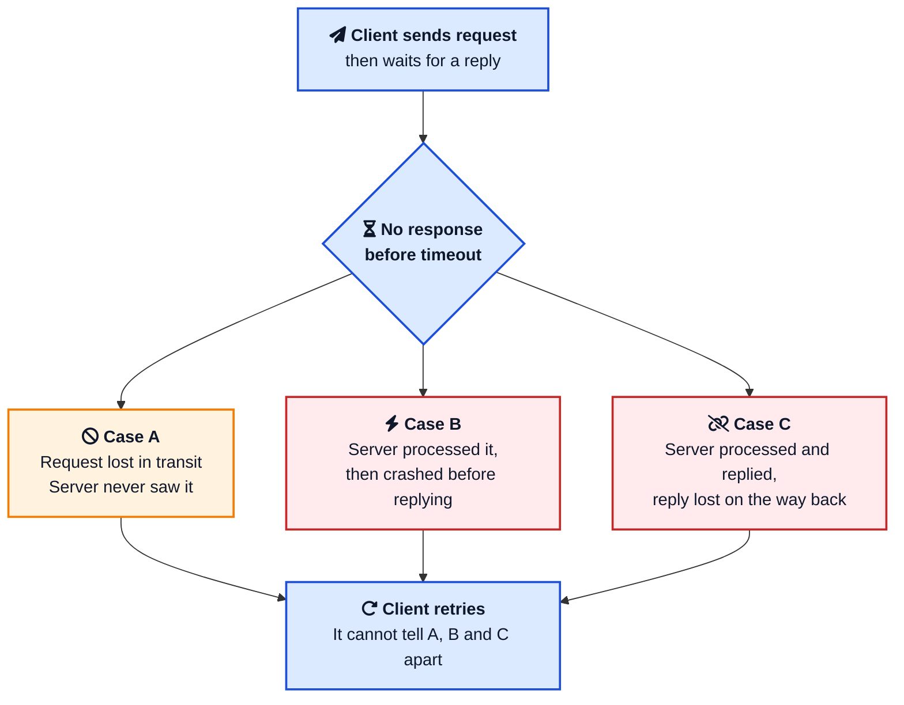
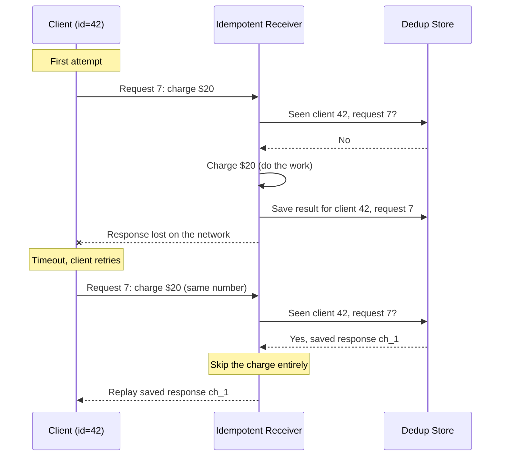
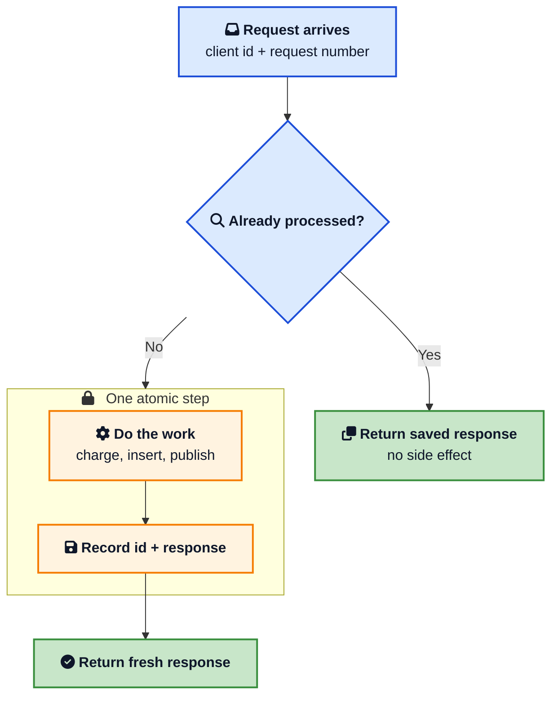
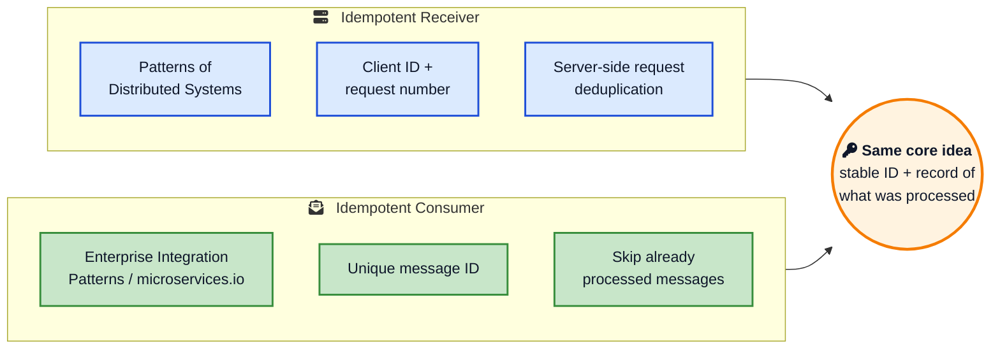
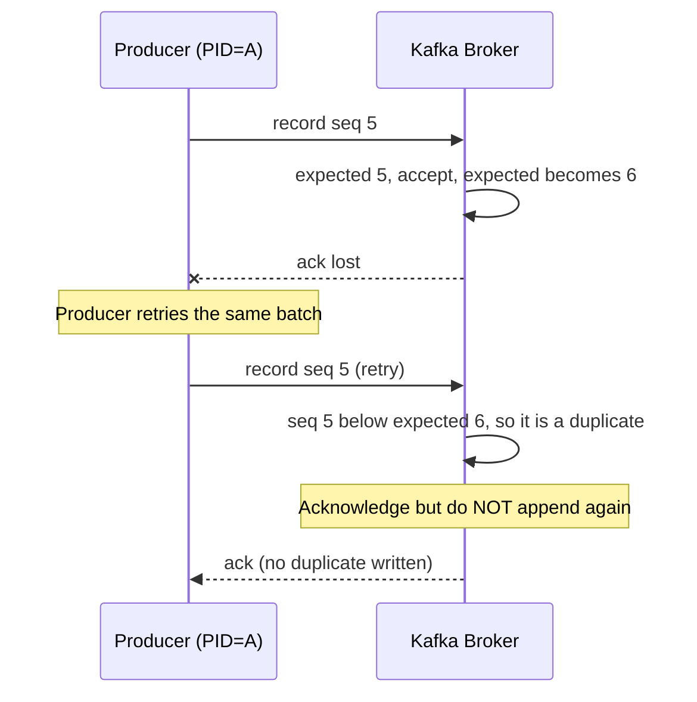
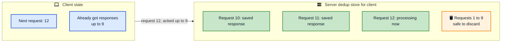

A customer taps **Pay** once. Your payment service charges the card, then the response gets lost on the way back. The customer's app waits, times out, and quietly retries. The same request lands on your server a second time. If your code is not careful, the customer is charged twice and your support queue grows by one.

That second request is not a bug in the client. It is the correct, expected behaviour of any reliable client on an unreliable network. The client could not tell whether the first request was lost, whether the server crashed before doing the work, or whether only the reply went missing. Retrying is the only safe move it has.

So the real question is on the server side: **how do you process the same request twice without doing the work twice?** That is exactly what the Idempotent Receiver pattern answers, and it is one of the most useful patterns a backend developer can internalise. This post walks through why duplicates are unavoidable, how the pattern works, how Stripe, Kafka, and Raft implement it, and the production traps that catch people.



## Why You Will Always Get Duplicate Requests

In a single process, a method call happens once. You call `chargeCard()`, it returns, done. In a distributed system, every call crosses a network that can drop packets, delay them, or reorder them, and processes that can crash mid-request.

The core trouble is captured by a classic thought experiment, the [Two Generals Problem](https://en.wikipedia.org/wiki/Two_Generals%27_Problem){:target="_blank" rel="noopener"}: two parties communicating only over a lossy channel can never be completely certain the other received a message. Translated to a client and server, when a client sends a request and hears nothing back, three very different things could have happened, and they all look identical from the outside.



In case A, the retry is necessary and harmless. In cases B and C, the work was already done, so the retry is a **duplicate** that you must not process again.



This is not an edge case you can ignore. It is baked into how systems talk to each other:

- **Client retries**: every HTTP client, mobile app, and SDK retries on timeout. So do load balancers and API gateways.
- **At-least-once message brokers**: [Kafka](/distributed-systems/how-kafka-works/){:target="_blank" rel="noopener"}, RabbitMQ, and SQS redeliver a message if the consumer does not acknowledge it in time. A consumer that crashes after doing the work but before committing the offset will see that message again on restart.
- **Retrying frameworks**: gRPC retries, Temporal activity retries, and saga step retries all assume the downstream can take a repeat.

If you want the full picture of why these channels choose duplicates over loss, the [role of queues in system design](/role-of-queues-in-system-design/){:target="_blank" rel="noopener"} post covers the delivery guarantees in detail. The short version: **dropping a message is unforgivable, delivering it twice is recoverable**, so almost every reliable system picks at-least-once and pushes the duplicate problem onto the receiver.

## What Idempotency Actually Means

The word comes from maths. A function is idempotent if applying it twice gives the same result as applying it once:

```
f(f(x)) = f(x)
```

`abs()` is idempotent: `abs(abs(-5))` is `5`, same as `abs(-5)`. Multiplying by two is not: `double(double(3))` is `12`, not `6`.

In messaging, the same idea applies to **effects**, not return values. An operation is idempotent if performing it many times has the same effect on the system as performing it once. Receiving the message twice is fine, as long as the card is charged once, the row is inserted once, the email is sent once.

This is the key reframing. You are not trying to stop duplicates from arriving, you have already seen that is impossible. You are making sure duplicates **do not matter**.

Some operations are idempotent for free, others are not:

| Operation | Idempotent? | Why |
|---|---|---|
| `SET balance = 100` | Yes | Running it again leaves balance at 100 |
| `balance = balance + 100` | No | Each run adds another 100 |
| HTTP `PUT /users/42` with full body | Yes | Last write wins, repeats converge |
| HTTP `POST /charges` | No | Each call creates a new charge |
| `DELETE /sessions/abc` | Yes | Already gone stays gone |
| "Send confirmation email" | No | Each call sends another email |

The first lesson is design-level: **prefer naturally idempotent operations** when you can. Model state as something you set, not something you nudge. Use `PUT` with a known resource ID instead of `POST` that mints a new one. The [how databases store data internally](/how-databases-store-data-internally/){:target="_blank" rel="noopener"} post and a unique constraint will do a surprising amount of this work for you.

But you cannot always restructure the operation. Charging a card, sending an email, and publishing an event are not naturally idempotent. For those, you need the receiver itself to recognise and absorb duplicates. That is the pattern.

## The Idempotent Receiver Pattern

The Idempotent Receiver is documented by Unmesh Joshi in [Patterns of Distributed Systems](https://martinfowler.com/articles/patterns-of-distributed-systems/idempotent-receiver.html){:target="_blank" rel="noopener"}. Its one-line definition is:

> Identify requests from clients uniquely so you can ignore duplicate requests when the client retries.

The mechanism has three moving parts:

1. **A unique client ID.** Each client registers with the server and gets an identifier, so the server can tell clients apart.
2. **A request number per client.** Every request the client sends carries a monotonically increasing number, so the server can tell a brand new request from a retry of an old one.
3. **A saved response.** The server stores the result of each request it processes. When a request arrives whose number it has already handled, it returns the saved response instead of running the logic again.

Put together, the server keeps something like a small table per client: the highest request number it has processed, and the response it produced. A duplicate is just a request whose number is less than or equal to what is already recorded.



Notice what the server did on the retry: **nothing new**. It did not charge the card a second time. It looked up the request number, found a stored result, and replayed it. From the client's point of view the call finally succeeded. From the system's point of view the money moved exactly once.

A naive version of this is dangerously easy to get wrong. The trap is recording that you have seen a request *before* you finish the work, or charging *before* you record it. The two must be tied together so that either both happen or neither does.



If the "do the work" and "record the result" steps are not atomic, a crash in between leaves you in the worst spot: the card is charged but no record exists, so the next retry charges again. In a single database you wrap both in one transaction. Across a service boundary you use the [transactional outbox pattern](/transactional-outbox-pattern/){:target="_blank" rel="noopener"} so the state change and the record of it commit together.



## A Minimal Implementation

Here is the pattern in plain Java-style pseudocode, kept deliberately small so the shape is clear.

```java
class IdempotentReceiver {
    // Per client: the last request number processed and its saved response.
    Map<ClientId, ProcessedRequest> processed = new ConcurrentHashMap<>();

    Response handle(Request req) {
        ProcessedRequest last = processed.get(req.clientId);

        // Duplicate or stale retry: replay the stored answer, do no work.
        if (last != null && req.requestNumber <= last.requestNumber) {
            return last.savedResponse;
        }

        // New request: do the work and record it as one atomic step.
        Response response = doWork(req);                 // charge, insert, publish
        processed.put(req.clientId,
                      new ProcessedRequest(req.requestNumber, response));
        return response;
    }
}
```

The same idea at the database layer, which is where most real services put it, leans on a **unique constraint** to make the check atomic:

```sql
-- The dedup table. The unique key is the idempotency key.
CREATE TABLE processed_requests (
    idempotency_key  TEXT PRIMARY KEY,
    response_body    JSONB NOT NULL,
    created_at       TIMESTAMPTZ NOT NULL DEFAULT now()
);

-- In one transaction:
-- 1. Try to claim the key. If it already exists, this row insert is skipped.
INSERT INTO processed_requests (idempotency_key, response_body)
VALUES ($1, $2)
ON CONFLICT (idempotency_key) DO NOTHING;
```

If the `INSERT` inserts a row, you are the first to see this request, so you do the work in the same transaction. If `ON CONFLICT` skips it, a previous attempt already handled this key, so you read and return the stored `response_body`. The database's unique index does the hard concurrency work for you, even when two duplicate requests race in at the same millisecond.

This database-backed version is what microservices.io calls the [Idempotent Consumer](https://microservices.io/patterns/communication-style/idempotent-consumer.html){:target="_blank" rel="noopener"}: a consumer that records the IDs of messages it has processed in a database table and uses them to detect and discard duplicates.

## Idempotent Receiver vs Idempotent Consumer

These two names confuse a lot of people, so it is worth pinning down. They are the same pattern seen from two angles.



- **Idempotent Receiver** is the general, request and response framing from distributed systems theory. It cares about a client retrying an RPC and getting the original answer back.
- **Idempotent Consumer** is the messaging framing from [Enterprise Integration Patterns](https://www.enterpriseintegrationpatterns.com/patterns/messaging/IdempotentReceiver.html){:target="_blank" rel="noopener"} and [microservices.io](https://microservices.io/patterns/communication-style/idempotent-consumer.html){:target="_blank" rel="noopener"}. It cares about a broker redelivering a message and the consumer skipping the repeat.



Both need a stable identifier per unit of work and a durable record of what has been processed. If you understand one, you understand the other.

## How Real Systems Do It

The pattern shows up at every layer of the stack. The names differ, the mechanism does not: a stable ID, a sequence or key, and a stored result.

### Stripe idempotency keys

Stripe made this pattern famous for payment APIs. You attach an [`Idempotency-Key`](https://docs.stripe.com/api/idempotent_requests){:target="_blank" rel="noopener"} header, usually a UUID, to any `POST` request:

```bash
curl https://api.stripe.com/v1/charges \
  -u "sk_test_...:" \
  -H "Idempotency-Key: 9f8b2c1e-7a3d-4c2e-bb10-6f0a2d4e7c91" \
  -d amount=2000 \
  -d currency=usd \
  -d source=tok_visa
```

If the network drops the response and your client retries with the **same** key, Stripe recognises it, skips the second charge, and returns the result of the first one. Stripe keeps these keys for 24 hours, which is the same "you cannot store responses forever" decision we get to below. The [Amazon Builders' Library article on idempotent APIs](https://aws.amazon.com/builders-library/making-retries-safe-with-idempotent-APIs/){:target="_blank" rel="noopener"} describes the same approach for AWS control plane APIs.

This is the practical, API-level form of the pattern. The idempotency key is the client ID and request number rolled into one value. If you have read [how Stripe prevents double payment](/how-stripe-prevents-double-payment/){:target="_blank" rel="noopener"}, you have already seen this in action at scale.

### Kafka idempotent producers

Kafka builds the receiver half into the broker. Turn it on with one setting:

```properties
enable.idempotence=true
acks=all
max.in.flight.requests.per.connection=5
```

When enabled (the default since Kafka 3.0), each producer is assigned a **Producer ID (PID)** on startup, and every record carries a **per-partition sequence number**. The broker remembers the last sequence number it accepted for each PID and partition:



A retried record with a sequence number the broker has already seen is acknowledged but not written a second time. That stops producer retries from creating duplicate records in the log. The matching consumer-side guarantees are covered well by [Confluent's exactly-once write-up](https://www.confluent.io/blog/exactly-once-semantics-are-possible-heres-how-apache-kafka-does-it/){:target="_blank" rel="noopener"}, and the broader trade-offs in [Kafka vs RabbitMQ vs SQS](/kafka-vs-rabbitmq-vs-sqs/){:target="_blank" rel="noopener"}.

One caveat worth knowing: idempotence here is per producer session. If the producer restarts and gets a new PID, the broker sees fresh sequences and the guarantee resets. For deduplication that survives restarts you need transactions with a stable `transactional.id`, or an idempotent consumer downstream.

### Raft and consensus systems

Consensus systems care about this deeply because a command applied twice to a replicated state machine corrupts state on every replica. [Raft](https://raft.github.io/raft.pdf){:target="_blank" rel="noopener"} solves it with **client sessions**: each client registers, gets a session, and tags every command with a serial number. The leader records the latest serial number and its result per session, so a command retried after a leader change is recognised and the cached response is returned instead of being applied again.

This is the idempotent receiver living inside the [replicated log](/distributed-systems/replicated-log/){:target="_blank" rel="noopener"}. Without it, a client that retries a "transfer $100" command during a leader election could move the money twice. The same protection appears in [Paxos](/distributed-systems/paxos/){:target="_blank" rel="noopener"}-based systems and in any service built on a [consensus](/distributed-systems/majority-quorum/){:target="_blank" rel="noopener"} core.

## The Hard Part: You Cannot Store Responses Forever

The simple version of the pattern has a memory leak hiding in it. If you keep every client's every request number and response forever, the dedup store grows without bound. A busy system will drown in it.

So the real question becomes: **when is it safe to forget a saved response?** A response only needs to exist while the client might still retry it. Once the client has definitely received the response, the server can drop it.

The trick, used by Raft and others, is to let the client tell the server how far it has gotten. Each request carries not only its own request number, but also the **highest request number for which the client has already received a response**. That second value is a low-water mark: the server can safely discard any saved response at or below it, because the client will never retry those.



That keeps the per-client window small. The second half is dealing with clients that vanish and never come back. You cannot keep a session for a client that crashed and will never return, so sessions get a **lease**: if a client does not renew within a timeout, the server expires its session and reclaims everything. This is exactly the [lease pattern](/distributed-systems/lease/){:target="_blank" rel="noopener"}, and it ties failure detection back to the [heartbeat](/distributed-systems/heartbeat/){:target="_blank" rel="noopener"} mechanism the client uses to keep its session alive.

In API-land, the same problem gets a blunter answer: a time-to-live. Stripe keeps idempotency keys for 24 hours. A typical homegrown dedup table runs a nightly job that deletes rows older than the maximum retry window. The principle is the same as a [TTL](/distributed-systems/lease/){:target="_blank" rel="noopener"} on a cache: store the dedup record only as long as a retry is plausible, then let it go.

## Gotchas That Bite People in Production

The pattern is simple. Getting it correct under concurrency and failure is where teams lose days. Here are the traps worth knowing before you ship.

### The idempotency key must cover the right scope

A key shared across different operations is a disaster: a retry of "charge $20" must not collide with "charge $50". The key must identify *one specific intended action*. Scope it per client and per logical request, and reject a reused key whose request body does not match the stored one. Stripe returns an error if you reuse a key with different parameters, which is a good behaviour to copy.

### Record the result and do the work atomically

This is the single most common bug. If you do the work first and crash before saving the dedup record, the retry repeats the work. If you save the record first and crash before doing the work, the retry thinks it is done and skips it. Both halves must commit together, in one database transaction or via the [transactional outbox](/transactional-outbox-pattern/){:target="_blank" rel="noopener"}.

### Handle the in-flight duplicate

Two copies of the same request can arrive at nearly the same time, before the first finishes. A plain "check then act" has a race here. Lean on a database unique constraint so the second insert fails cleanly, and decide what to return: either wait for the first to finish and replay its response, or return a "request in progress" status the client can poll.

### Store the response, not just a "seen" flag

If you only record that a request was processed but not its result, a retry cannot get the original answer. The client wanted the response, not just silence. Save enough of the response to replay it faithfully, including the status code and body.

### Make compensations idempotent too

In a [saga](/saga-pattern-distributed-transactions/){:target="_blank" rel="noopener"}, the compensating actions (refund, release stock, cancel booking) get retried just like forward steps. A refund applied twice is as bad as a charge applied twice. Every step and every compensation needs the same dedup treatment.

### Watch out for non-idempotent side effects you forgot about

The obvious work is easy to protect. The sneaky side effects are logging an event to an analytics pipeline, incrementing a metric, sending a webhook, or firing a downstream message. Each of those is its own non-idempotent action and may need its own key. The [distributed counter](/distributed-counter-architecture-guide/){:target="_blank" rel="noopener"} post shows how easily a duplicate increment skews numbers.



## An Implementation Checklist

When you add an idempotent receiver to a service, walk this list:

1. <i class="fas fa-fingerprint"></i> **Identity.** Every request carries a stable client or idempotency key plus a request number or unique ID. Generate it on the client, not the server.
2. <i class="fas fa-database"></i> **Dedup store.** A table or key-value store mapping key to saved response, with a unique constraint on the key.
3. <i class="fas fa-lock"></i> **Atomicity.** The side effect and the dedup record commit together. One transaction, or an outbox.
4. <i class="fas fa-clone"></i> **Replay.** On a duplicate, return the stored response, including status and body. Do no work.
5. <i class="fas fa-people-arrows"></i> **Concurrency.** A unique constraint or lock handles two duplicates racing in at once.
6. <i class="fas fa-clock"></i> **Expiry.** A low-water mark, session lease, or TTL keeps the store bounded.
7. <i class="fas fa-vial"></i> **Tests.** Send every request twice in your test suite. Inject crashes between "do work" and "save record". The bugs only show up under failure.

## Wrapping Up

The Idempotent Receiver pattern rests on accepting one uncomfortable fact: in a distributed system, you will receive the same request more than once, and you cannot prevent it. Clients must retry, brokers must redeliver, and the network will lose your acknowledgements at the worst possible moment.

Once you accept that, the solution is clean. Give every request a stable identity, store the result of the work you do, and when a duplicate arrives, replay the stored result instead of redoing the work. Whether it shows up as a Stripe idempotency key, a Kafka producer sequence number, or a Raft client session, it is the same three pieces: a stable ID, a sequence, and a saved response.

The combination of an at-least-once channel and an idempotent receiver is the honest version of "exactly once." The message may arrive many times, but its effect lands exactly once. That is the guarantee your users actually care about, and it is the one that lets you sleep through the 2 AM retries.

---

**Related posts:**

- [How Stripe Prevents Double Payment](/how-stripe-prevents-double-payment/){:target="_blank" rel="noopener"} - Idempotency keys running in production at scale
- [Transactional Outbox Pattern](/transactional-outbox-pattern/){:target="_blank" rel="noopener"} - Commit the side effect and the dedup record together
- [Saga Pattern Explained](/saga-pattern-distributed-transactions/){:target="_blank" rel="noopener"} - Why every saga step and compensation must be idempotent
- [Two-Phase Commit](/distributed-systems/two-phase-commit/){:target="_blank" rel="noopener"} - The strongly consistent alternative and why brokers avoid it
- [Replicated Log](/distributed-systems/replicated-log/){:target="_blank" rel="noopener"} - Where client request dedup lives inside consensus systems
- [Lease in Distributed Systems](/distributed-systems/lease/){:target="_blank" rel="noopener"} - How dedup sessions expire without leaking memory
- [How Kafka Works](/distributed-systems/how-kafka-works/){:target="_blank" rel="noopener"} - The broker behind idempotent producers
- [Kafka vs RabbitMQ vs SQS](/kafka-vs-rabbitmq-vs-sqs/){:target="_blank" rel="noopener"} - Delivery guarantees that make duplicates inevitable
- [Role of Queues in System Design](/role-of-queues-in-system-design/){:target="_blank" rel="noopener"} - Why at-least-once beats at-most-once

*Further reading: the canonical [Idempotent Receiver](https://martinfowler.com/articles/patterns-of-distributed-systems/idempotent-receiver.html){:target="_blank" rel="noopener"} pattern by Unmesh Joshi in [Patterns of Distributed Systems](https://martinfowler.com/books/patterns-distributed.html){:target="_blank" rel="noopener"}, the [Idempotent Receiver](https://www.enterpriseintegrationpatterns.com/patterns/messaging/IdempotentReceiver.html){:target="_blank" rel="noopener"} chapter in Enterprise Integration Patterns, Chris Richardson's [Idempotent Consumer](https://microservices.io/patterns/communication-style/idempotent-consumer.html){:target="_blank" rel="noopener"}, [Stripe's idempotent requests](https://docs.stripe.com/api/idempotent_requests){:target="_blank" rel="noopener"} documentation, and the [Amazon Builders' Library on idempotent APIs](https://aws.amazon.com/builders-library/making-retries-safe-with-idempotent-APIs/){:target="_blank" rel="noopener"}.*
