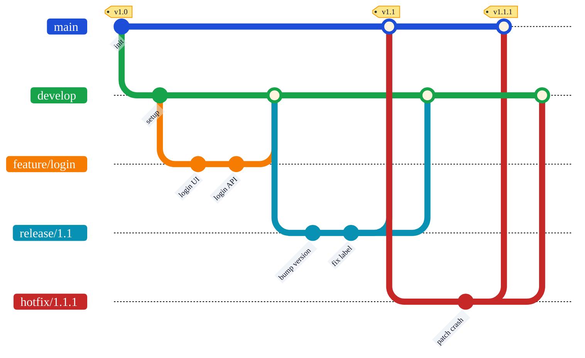
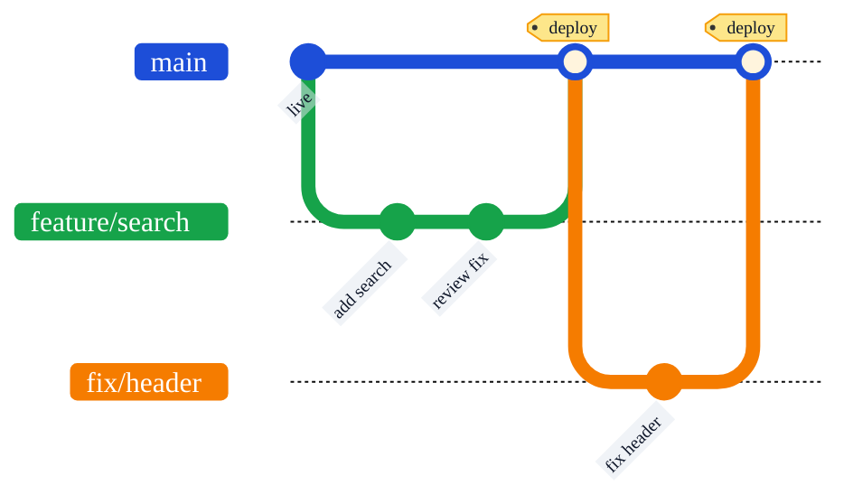
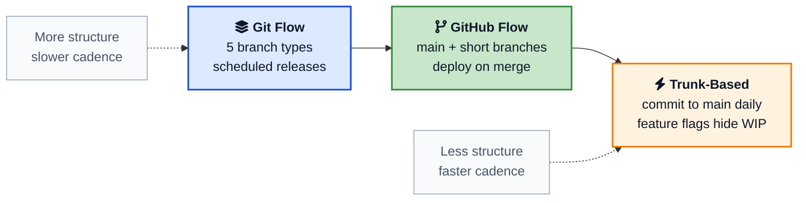
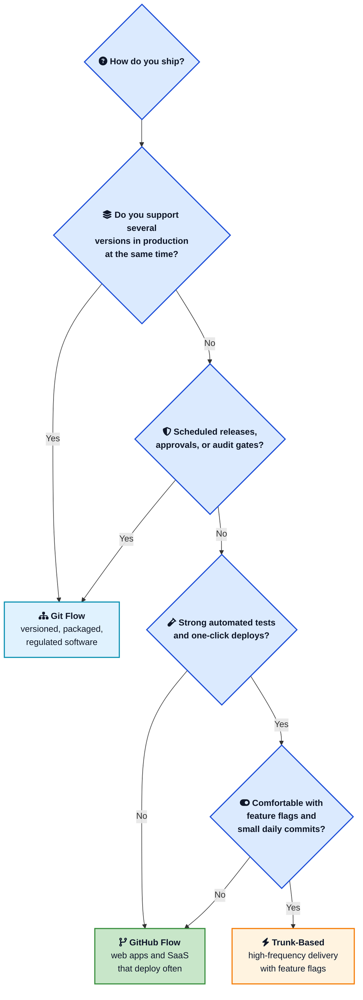

Two teams, same Git, completely different lives. One ships to production forty times a day and barely thinks about branches. The other cuts a release once a month, supports three versions in the wild, and lives by a strict branch map taped to the wall. Same tool, two very different ways of working.

Most of that difference comes down to a single choice: the branching strategy. **Git Flow** and **GitHub Flow** are the two names you hear most, and people often pick one because a tutorial told them to, not because it fits how they actually ship. That mismatch is where the pain starts: endless merge conflicts, scary releases, or bugs sliding straight into production.

This post breaks down **Git Flow vs GitHub Flow** in plain language. You will see how each one handles features, releases, and hotfixes, where trunk-based development fits in, the real trade-offs, and a simple way to choose. If you want a refresher on the commands behind all this first, the [Git Cheat Sheet](/git-cheat-sheet/){:target="_blank" rel="noopener"} and [Git Command Line Basics](/git-command-line-basics/){:target="_blank" rel="noopener"} have you covered.

## <i class="fas fa-question-circle"></i> What a Branching Strategy Actually Is

A branching strategy is just an agreement. It answers four questions for your team:

- Where do I start new work?
- Where does finished work go?
- How does code reach production?
- How do we fix something that is already live?

Git does not care how you answer these. You can make a hundred branches or zero. A branching strategy is the shared set of rules that stops a team of ten people from stepping on each other. Get it right and releases feel boring in the best way. Get it wrong and every Friday deploy feels like defusing a bomb.

Git Flow and GitHub Flow are two popular answers, built for two different kinds of software. Let us look at each one on its own before comparing them.

## <i class="fas fa-sitemap"></i> Git Flow Explained

Git Flow was published by [Vincent Driessen in 2010](https://nvie.com/posts/a-successful-git-branching-model/){:target="_blank" rel="noopener"} in a post titled "A successful Git branching model." It became the default answer for a whole generation of teams. It is built around the idea that software ships in distinct, numbered versions, and that you sometimes need to support more than one of those versions at a time.

Git Flow uses **two long-lived branches** that never get deleted:

- `main` (sometimes still called `master`) holds the official release history. Every commit here is a real, tagged version that went to production.
- `develop` is the integration branch. It collects all the finished work that is heading toward the next release.

On top of those, it uses **three kinds of short-lived branches**:

- `feature/*` branches for new work. They start from `develop` and merge back into `develop`.
- `release/*` branches to prepare a version for shipping. They start from `develop` and merge into both `main` and `develop`.
- `hotfix/*` branches for urgent production fixes. They start from `main` and merge into both `main` and `develop`.

Here is the whole model in one diagram. Follow the colors: blue is `main`, green is `develop`, and the short-lived branches peel off and merge back.



### How a change flows through Git Flow

Walk through the life of one feature:

1. You branch `feature/payment-retry` off `develop`.
2. You build the feature, committing as you go, and keep it updated with `develop`.
3. When it is done and reviewed, you merge it back into `develop` and delete the feature branch.
4. Time passes. More features land in `develop`.
5. When `develop` has enough for a release, someone cuts `release/1.2` off it. No new features go here, only version bumps, docs, and bug fixes found during testing.
6. QA tests the release branch. Fixes go straight into it.
7. When it is ready, `release/1.2` merges into `main`, gets tagged `v1.2`, and ships. It also merges back into `develop` so those last fixes are not lost.
8. If a serious bug shows up in production, you branch `hotfix/1.2.1` off `main`, fix it, merge it into both `main` and `develop`, and tag a patch release.

The basic commands look like this, without the [git-flow extension](https://github.com/nvie/gitflow){:target="_blank" rel="noopener"}:

```bash
# Start a feature
git switch -c feature/payment-retry develop

# Finish it
git switch develop
git merge --no-ff feature/payment-retry
git branch -d feature/payment-retry

# Prepare a release
git switch -c release/1.2 develop
# ... bump version, fix bugs ...
git switch main
git merge --no-ff release/1.2
git tag -a v1.2 -m "Release 1.2"
git switch develop
git merge --no-ff release/1.2

# Patch production
git switch -c hotfix/1.2.1 main
# ... fix the bug ...
git switch main
git merge --no-ff hotfix/1.2.1
git tag -a v1.2.1 -m "Hotfix 1.2.1"
git switch develop
git merge --no-ff hotfix/1.2.1
```

There is also the [git-flow command-line extension](https://github.com/nvie/gitflow){:target="_blank" rel="noopener"} that wraps all of this into commands like `git flow feature start` and `git flow release finish`, so you do not have to remember every merge by hand.



### What Git Flow is good at

- **Versioned releases.** If you ship `v2.3.0` and need to patch it while `v2.4.0` is being built, Git Flow handles that cleanly.
- **A real staging area.** The release branch is a safe place to stabilize a version while normal work keeps flowing on `develop`.
- **Clear separation.** Production code (`main`) is never the same thing as work in progress (`develop`).
- **Emergency patches.** Hotfix branches let you fix production in hours without dragging along everything sitting in `develop`.

### Where Git Flow hurts

- **It is heavy.** Five branch types and a fixed set of merge rules is a lot to teach and a lot to get wrong.
- **Long-lived branches drift.** The longer `develop` and a feature branch live apart, the worse the eventual merge. This is the classic merge-conflict tax.
- **It fights continuous deployment.** All those gates between a commit and production are the opposite of "ship many times a day."
- **It can hide integration problems.** Because work piles up in `develop` and only meets `main` at release time, you find big surprises late.

In 2020, Driessen himself added a note to the top of his original post. He said the model was designed for software with explicit versioned releases, and that if your team delivers continuously, you should probably pick something simpler. That honesty is worth keeping in mind: Git Flow is not wrong, it is just built for a specific shape of project.

## <i class="fab fa-github"></i> GitHub Flow Explained

GitHub Flow came a year later, [first written up by Scott Chacon in 2011](https://scottchacon.com/2011/08/31/github-flow/){:target="_blank" rel="noopener"} and now documented in the [official GitHub docs](https://docs.github.com/en/get-started/using-github/github-flow){:target="_blank" rel="noopener"}. It was a deliberate reaction to how complex Git Flow felt for teams that deploy to the web all day long.

GitHub Flow has one rule that drives everything else:

> Anything in the `main` branch is always deployable.

That single rule lets you throw away most of the structure. There is no `develop`, no `release` branch, no `hotfix` branch. There is just:

- `main`, which is always production-ready.
- Short-lived `feature` branches that start from `main` and merge back into `main` through a pull request.



### How a change flows through GitHub Flow

The whole lifecycle fits in six steps:

1. Branch off `main` with a clear name like `feature/search` or `fix/login-redirect`.
2. Commit your work and push the branch.
3. Open a [pull request](/how-github-stores-and-serves-git-repositories/){:target="_blank" rel="noopener"} so teammates can review it and CI can run the tests.
4. Address review comments and keep pushing until the checks are green.
5. Merge into `main`.
6. Deploy. Because `main` is always deployable, this often happens automatically the moment you merge.

```bash
# Start work
git switch -c feature/search main

# ... commit, push, open a PR, get review ...
git push -u origin feature/search

# After approval, merge to main (often via the PR UI)
git switch main
git merge feature/search
git branch -d feature/search
# CI/CD deploys main to production
```

Notice what is missing. There is no special path for an urgent fix. A hotfix in GitHub Flow is just a normal short-lived branch off `main`. You branch, fix, open a PR, merge, deploy. Same path as everything else, which is exactly the point.

### What GitHub Flow is good at

- **Simplicity.** Two kinds of branches and one rule. New teammates learn it in minutes.
- **Fast feedback.** Small branches merge quickly, so integration problems show up while they are still small.
- **Natural fit for CI/CD.** Every merge to `main` is a deployable unit, which lines up perfectly with automated pipelines like [GitHub Actions](/github-actions-basics-cicd-automation/){:target="_blank" rel="noopener"}.
- **Code review built in.** The pull request is the heart of the flow, so review is not an afterthought.

### Where GitHub Flow hurts

- **It demands real automation.** If your tests are weak or your deploys are manual and scary, "every merge can ship" becomes "every merge can break production."
- **One version only.** GitHub Flow assumes a single version is live. If you have to support `v1` and `v2` at the same time, it has no answer for that.
- **Big features get awkward.** A large change that takes weeks does not fit neatly into a short-lived branch. You end up needing [feature flags](/feature-flags-guide/){:target="_blank" rel="noopener"} to merge unfinished work safely.
- **Less of a buffer.** There is no release branch to stabilize on. The safety net is your test suite, full stop.



## <i class="fas fa-balance-scale"></i> Git Flow vs GitHub Flow: Side by Side

Here is the comparison most people come for, in one table.

| Aspect | Git Flow | GitHub Flow |
|---|---|---|
| Long-lived branches | Two: `main` and `develop` | One: `main` |
| Branch types | 5 (main, develop, feature, release, hotfix) | 2 (main, feature) |
| Where features start | `develop` | `main` |
| Release process | Dedicated `release` branch, tagged on `main` | Merge to `main`, deploy right away |
| Hotfixes | Special `hotfix` branch off `main` | Ordinary branch off `main` |
| Deploy cadence | Scheduled, every few weeks | Continuous, many times a day |
| Versions in production | Several at once | Usually one |
| Complexity | High | Low |
| Best for | Versioned, packaged, or regulated software | Web apps and SaaS |
| Needs strong CI/CD | Helpful | Essential |
| Year introduced | 2010 | 2011 |

The single biggest difference is the `develop` branch. Git Flow keeps a permanent staging layer between your work and production. GitHub Flow removes it and trusts `main` plus your tests instead. Almost every other difference flows from that one decision.

The second biggest difference is how releases work. In Git Flow, a release is a deliberate event with its own branch and version tag. In GitHub Flow, every merge is effectively its own tiny release. If you ship constantly, the GitHub Flow model removes a lot of ceremony. If you ship on a calendar, the Git Flow release branch gives you somewhere to stand.

## <i class="fas fa-code-branch"></i> Where Trunk-Based Development Fits

You cannot talk about this in 2026 without mentioning the third option, because it is where many strong teams have landed: **trunk-based development**.

Trunk-based development takes GitHub Flow's "one main branch" idea and pushes it further. Instead of branches that live for a day or two, developers commit to the trunk (`main`) almost continuously, often through branches that exist for only a few hours. Unfinished work is hidden behind [feature flags](/feature-flags-guide/){:target="_blank" rel="noopener"} so it can ship to production turned off, then be switched on later.



The research backs this up. The [DORA](https://dora.dev/){:target="_blank" rel="noopener"} program, which studies what makes software teams effective, consistently ties trunk-based development and small batch sizes to better delivery performance. The catch is that it asks a lot of you: excellent automated tests, fast pipelines, and real discipline around feature flags. Without those, committing straight to the trunk is reckless rather than fast.

A useful way to see the three is as points on one line. Git Flow sits at the structured, slower end. [Trunk Based Development](https://trunkbaseddevelopment.com/){:target="_blank" rel="noopener"} sits at the lean, fast end. GitHub Flow sits comfortably in the middle and is the natural first step for most teams moving away from Git Flow.

## <i class="fas fa-tasks"></i> How to Choose Your Git Workflow

Forget what is trendy. The right workflow falls out of a few honest questions about your project. Walk this decision tree.



In short:

- **Choose Git Flow** if you ship versioned software, support more than one release at a time, or work under approval and audit requirements. Think mobile apps waiting on store review, desktop and on-premise tools, SDKs and libraries, or banking and healthcare systems.
- **Choose GitHub Flow** if you run a web app or SaaS, keep one version live, and want a simple model that fits pull requests and CI/CD. This is the right default for most startups and product teams.
- **Choose trunk-based development** if you already have strong tests, fast deploys, and the discipline to use feature flags. This is where you go when GitHub Flow starts feeling slow.

## <i class="fas fa-exclamation-triangle"></i> Mistakes Teams Make With Both

The workflow is only half the story. Here are the traps that bite real teams, whichever model they pick.

### Using Git Flow for a web app

This is the most common mismatch. A small team building a single web product adopts Git Flow because a tutorial said it was "professional." Now they have a `develop` branch that adds a step to every deploy, release branches nobody really needs, and a hotfix dance for a product that could just ship the fix to `main`. If you deploy continuously, the extra branches are pure overhead.

### Letting branches live too long

Long-lived branches are where merge pain is born. A feature branch that sits for three weeks drifts far from the base branch, and the merge becomes an afternoon of conflicts. Keep branches small and short. Merge or rebase from the base branch often. If a feature is genuinely large, split it and use [feature flags](/feature-flags-guide/){:target="_blank" rel="noopener"} instead of one giant branch.

### Adopting GitHub Flow without the safety net

GitHub Flow only works if `main` really is always deployable. That promise rests on automated tests and reliable deploys. If your test suite is thin or your deploy is a manual checklist, every merge is a gamble. Build the [CI/CD pipeline](/github-actions-basics-cicd-automation/){:target="_blank" rel="noopener"} first, then lean on the workflow.

### Forgetting to merge hotfixes back

In Git Flow, a hotfix must merge into both `main` and `develop`. Teams routinely fix production, ship it, and forget the second merge. The next release then quietly reintroduces the very bug you just fixed. Automate this merge-back, or at least make it a hard item on your release checklist. If you ever need to undo a change that slipped in, the [git revert guide](/git-revert-multiple-commits/){:target="_blank" rel="noopener"} walks through doing it cleanly.

### Treating the workflow as sacred

No model survives contact with reality unchanged. Plenty of teams run a "GitHub Flow plus a staging branch" hybrid, or a trimmed Git Flow without release branches. That is fine. The branching strategy serves the team, not the other way around. Start simple, and add structure only when a real problem demands it.



## <i class="fas fa-tools"></i> A Few Practical Tips Whatever You Choose

These habits pay off under every workflow:

1. <i class="fas fa-tag"></i> **Name branches clearly.** A prefix like `feature/`, `fix/`, or `hotfix/` plus a ticket number tells everyone what a branch is at a glance.
2. <i class="fas fa-lock"></i> **Protect `main`.** Require pull requests, passing checks, and at least one review before anything merges. This matters most in GitHub Flow, where `main` ships.
3. <i class="fas fa-broom"></i> **Delete merged branches.** Stale branches pile up and hide the ones that matter. Turn on auto-delete after merge.
4. <i class="fas fa-vial"></i> **Run CI on every branch.** Catch failures on the feature branch, not after it lands.
5. <i class="fas fa-cogs"></i> **Set sensible defaults once.** A good [git config](/git-config-guide/){:target="_blank" rel="noopener"} with `pull.rebase`, `fetch.prune`, and `push.autoSetupRemote` removes a lot of daily friction.
6. <i class="fas fa-toggle-on"></i> **Decouple deploy from release.** [Feature flags](/feature-flags-guide/){:target="_blank" rel="noopener"} let you ship code that is turned off, which makes short branches and continuous deployment far safer.

## <i class="fas fa-flag-checkered"></i> Wrapping Up

Git Flow and GitHub Flow are not rivals fighting for one crown. They are tools built for different jobs. Git Flow brings structure for software that ships in versions and needs to maintain several of them at once. GitHub Flow strips that structure away for teams that deploy continuously and keep a single version live. Trunk-based development takes the GitHub Flow idea to its limit for teams with the testing and feature-flag muscle to back it up.

The honest answer to "which one should I use" is "it depends on how you ship." Count your live versions, look at your release cadence, and be truthful about your test coverage. Pick the lightest workflow that still keeps production safe, and change it the moment it stops serving you. The best branching strategy is the one your team barely has to think about.

---

**Related posts:**

- [Git Cheat Sheet](/git-cheat-sheet/){:target="_blank" rel="noopener"} - Every branch, merge, and rebase command you will use in these workflows
- [Git Command Line Basics](/git-command-line-basics/){:target="_blank" rel="noopener"} - Start here if branches and merges are still new
- [Git Config Guide](/git-config-guide/){:target="_blank" rel="noopener"} - Sensible defaults that make any workflow smoother
- [Feature Flags Guide](/feature-flags-guide/){:target="_blank" rel="noopener"} - Decouple deploy from release so short branches stay safe
- [GitHub Actions: CI/CD Basics](/github-actions-basics-cicd-automation/){:target="_blank" rel="noopener"} - The automation that makes GitHub Flow and trunk-based development work
- [How Git Stores Data Internally](/how-git-stores-data-internally/){:target="_blank" rel="noopener"} - What a branch really is under the hood
- [How GitHub Stores and Serves Git Repositories](/how-github-stores-and-serves-git-repositories/){:target="_blank" rel="noopener"} - What happens after you open that pull request
- [Git Revert Multiple Commits](/git-revert-multiple-commits/){:target="_blank" rel="noopener"} - Undo a bad merge without rewriting history

*Further reading: [A successful Git branching model](https://nvie.com/posts/a-successful-git-branching-model/){:target="_blank" rel="noopener"} by Vincent Driessen, the [GitHub flow documentation](https://docs.github.com/en/get-started/using-github/github-flow){:target="_blank" rel="noopener"}, Scott Chacon's original [GitHub Flow write-up](https://scottchacon.com/2011/08/31/github-flow/){:target="_blank" rel="noopener"}, the [Atlassian Gitflow tutorial](https://www.atlassian.com/git/tutorials/comparing-workflows/gitflow-workflow){:target="_blank" rel="noopener"}, and the [Trunk Based Development](https://trunkbaseddevelopment.com/){:target="_blank" rel="noopener"} site.*
