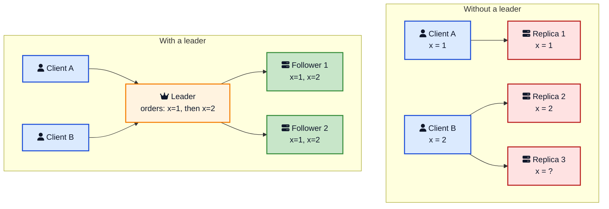
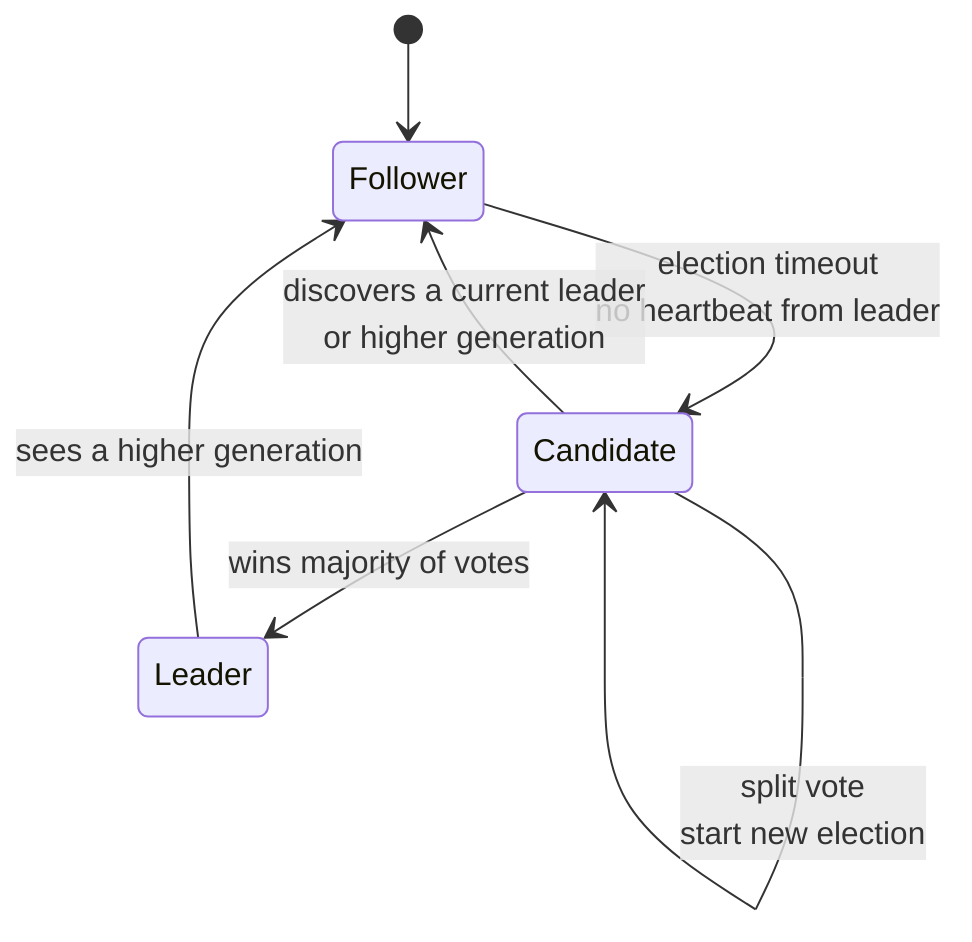
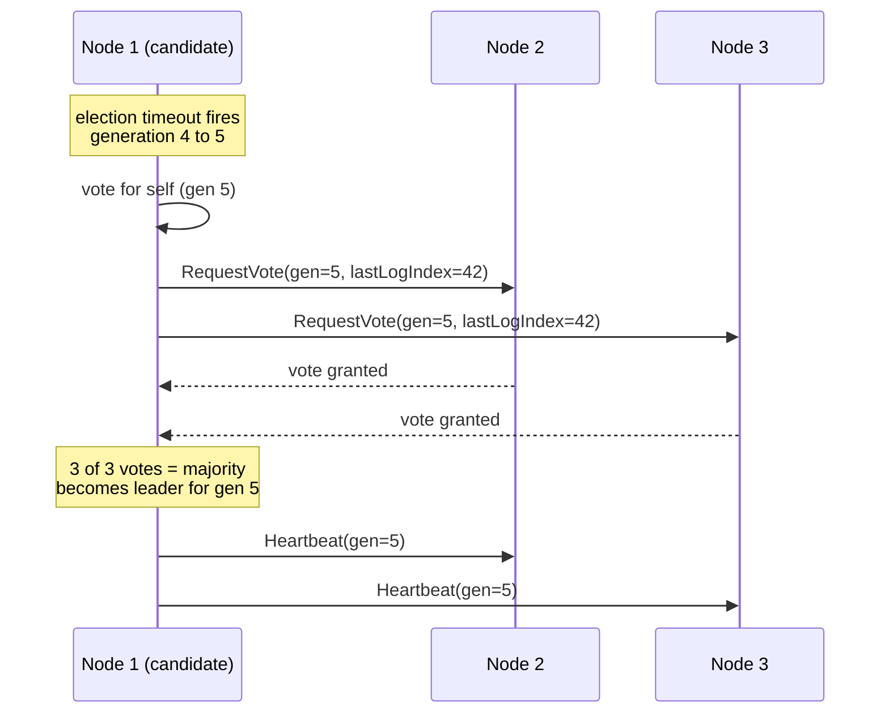
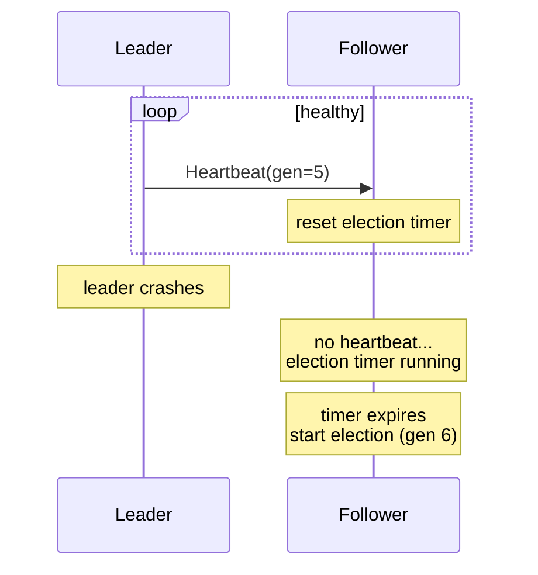
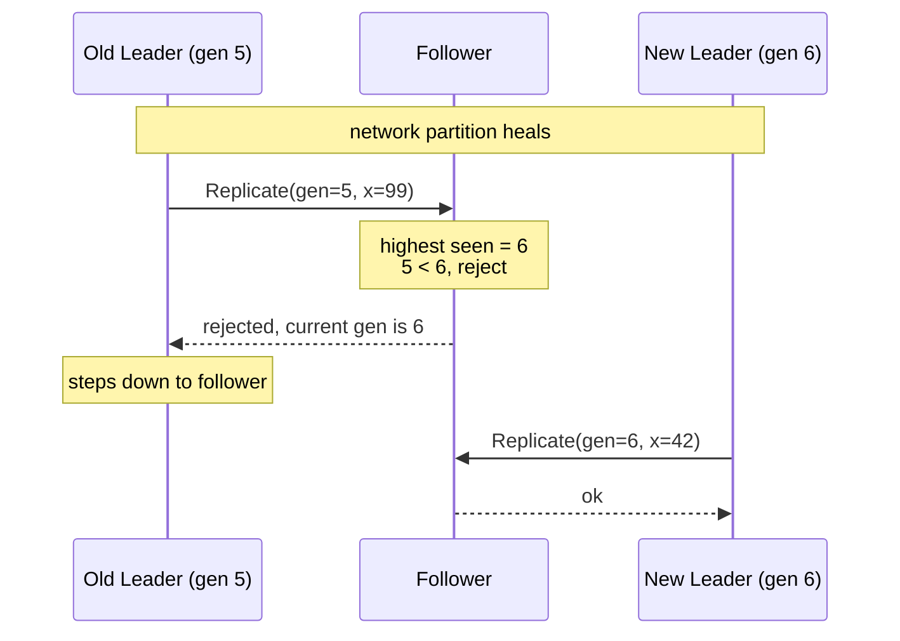
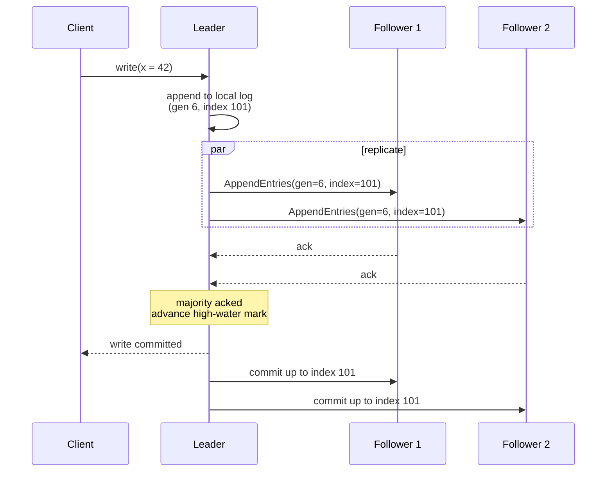
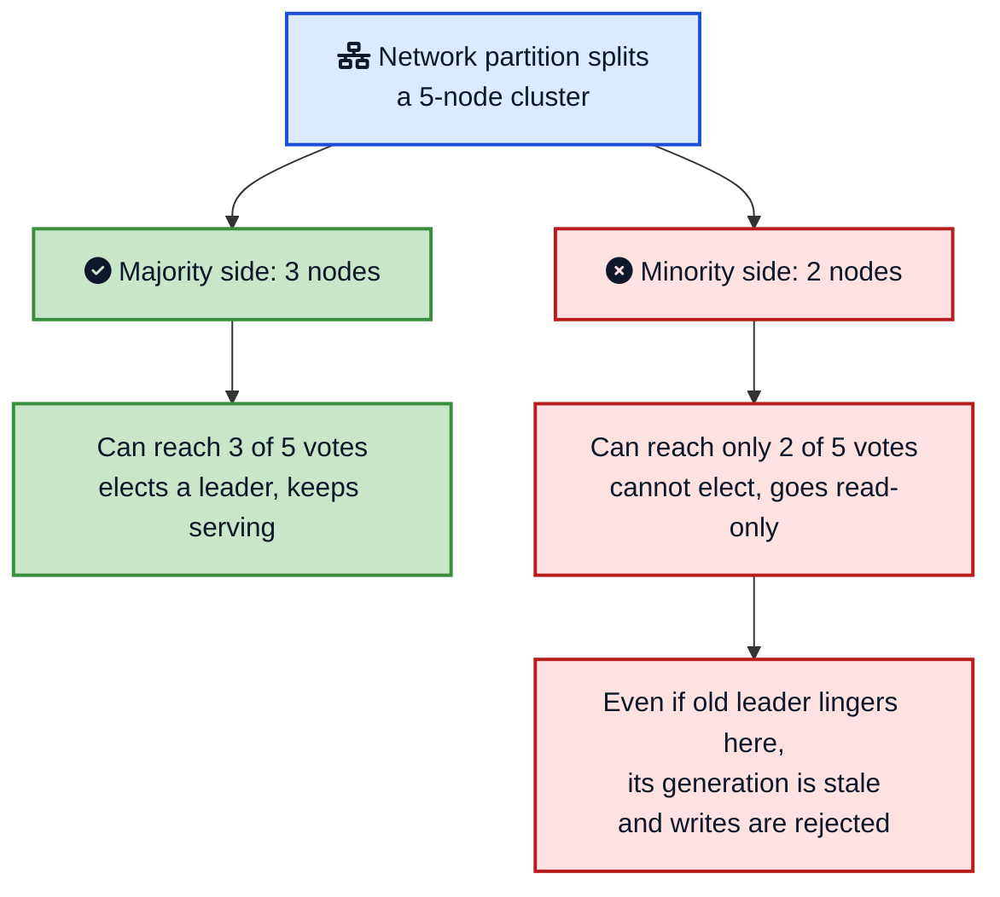
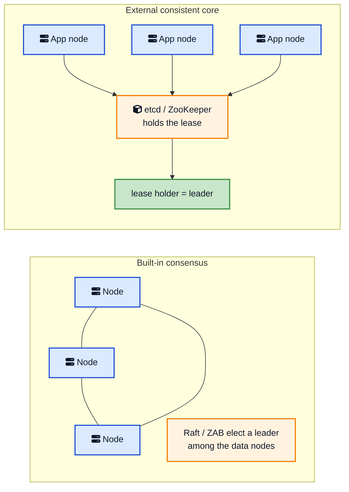
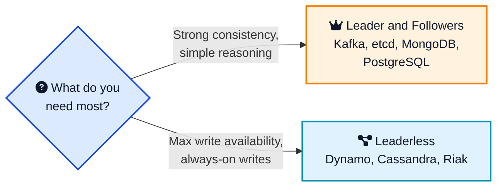

A cluster of five database servers sounds reassuring until you ask one simple question: when two clients send conflicting writes at the same instant, which one wins? If all five servers can answer "me", you do not have a cluster, you have five databases that happen to share a logo. Somebody has to be in charge.

That is the whole idea behind the **Leader and Followers** pattern. You pick one node to be the boss, call it the leader, and make every other node a follower that copies whatever the leader decides. Writes go to one place, get ordered once, and flow out to everyone else. It sounds almost too simple, and yet it is the quiet engine underneath [Kafka](/distributed-systems/how-kafka-works/){:target="_blank" rel="noopener"}, ZooKeeper, etcd, MongoDB, Redis, and nearly every SQL database that replicates.

This post walks through what the pattern is, why a single leader makes consistency tractable, how a new leader gets elected, how heartbeats and a generation clock keep the cluster honest, and how real systems put it all together. If you have already read about the [replicated log](/distributed-systems/replicated-log/){:target="_blank" rel="noopener"} or [majority quorum](/distributed-systems/majority-quorum/){:target="_blank" rel="noopener"}, this is the pattern that ties them together.



## <i class="fas fa-question-circle"></i> The Problem: Replication Needs a Referee

To survive a server dying, you copy your data onto several machines. The moment you do that, you inherit a new problem: keeping those copies in agreement.

Imagine three replicas and two clients. Client A sets `x = 1`. Client B sets `x = 2`. The messages reach the three replicas in different orders because networks do not promise ordering. Now replica one thinks `x = 1`, replica two thinks `x = 2`, and replica three has not heard from anyone yet. Read from a different replica each time and you get a different answer. That is not a database, it is a coin flip.

[Majority quorum](/distributed-systems/majority-quorum/){:target="_blank" rel="noopener"} reads and writes help, but they are not enough on their own. A quorum tells you a value was stored on enough nodes, but each node still has no idea what the others are doing between rounds.

You need a referee. One node that decides the order of every change so the rest can apply it the same way.



The leader does not make the cluster faster. It makes the cluster *agree*, and agreement is the thing that was missing.

## <i class="fas fa-crown"></i> What the Leader and Followers Pattern Is

The pattern is one sentence long. From [Patterns of Distributed Systems](https://martinfowler.com/articles/patterns-of-distributed-systems/leader-follower.html){:target="_blank" rel="noopener"}:

> Select one server in the cluster as a leader. The leader is responsible for taking decisions on behalf of the entire cluster and propagating the decisions to all the other servers.

Break that into the three jobs a leader actually does:

1. **Accept writes.** Clients send all changes to the leader. Followers refuse writes or forward them to the leader.
2. **Order them.** The leader assigns each change a position in a [replicated log](/distributed-systems/replicated-log/){:target="_blank" rel="noopener"}. That single ordering is the source of truth for what happened and when.
3. **Replicate them.** The leader streams its log to the followers, who apply the entries in the exact same order and end up in the exact same state.

Followers are not idle. They acknowledge replication, often serve read traffic to take load off the leader, and most importantly they are warm standbys. If the leader dies, one of them becomes the next leader without a human waking up.

You will see this pattern wearing many names. PostgreSQL calls it primary and standby. MongoDB calls it primary and secondary. Older docs call it master and slave. They are all the same shape: one writer, many copiers.

## <i class="fas fa-balance-scale"></i> Why One Leader Instead of Many Writers

The natural objection is that one leader is a bottleneck and a single point of failure. Both are true. So why is this still the default for systems that care about correctness?

Because it turns an impossibly hard problem into a merely hard one. "Get every node to agree on the order of every write" is the full distributed consensus problem, and it is expensive to run on the hot path of every request. "Get every node to agree on who the leader is" is the same consensus problem, but you only pay for it rarely, when a leader changes. Once a leader exists, ordering writes is a local decision it makes by itself.

That is the deal the pattern offers:

- **Strong consistency is easy to reason about.** There is exactly one history of events, the leader's log.
- **Consensus runs only at election time.** Steady state is cheap. Expensive agreement happens once per leadership change, not once per write.
- **Failover is automatic.** The same election machinery that bootstrapped the first leader replaces a failed one.

The price is real and worth naming. Write throughput is capped by what one leader can handle. There is a brief unavailability window during failover while a new leader is chosen. And the leader is a hotspot you have to protect. For most systems that need correctness, that trade is a bargain. When it is not, you reach for leaderless replication, which we cover at the end.



## <i class="fas fa-vote-yea"></i> How a Leader Gets Elected

A leader has to come from somewhere. At startup, and again every time the current leader dies, the surviving nodes hold an election. The mechanics vary between [Raft](https://raft.github.io/raft.pdf){:target="_blank" rel="noopener"}, ZooKeeper's ZAB, and [Paxos](/distributed-systems/paxos/){:target="_blank" rel="noopener"} variants, but the shape is the same.

Every node sits in one of three roles: follower, candidate, or leader. The flow between them is driven by timeouts and votes.



Here is the election itself, step by step:

1. A follower stops hearing [heartbeats](/distributed-systems/heartbeat/){:target="_blank" rel="noopener"} from the leader. After a randomized **election timeout**, it suspects the leader is dead.
2. It becomes a **candidate**, increments the **generation clock** (Raft calls it a term, Kafka and ZooKeeper call it an epoch), votes for itself, and sends a vote request to every other node.
3. Each node votes for **at most one candidate per generation**, and only if the candidate's log is at least as up to date as its own. That last rule is critical: it stops a node that is behind on data from becoming leader and erasing committed writes.
4. A candidate that collects votes from a **majority** of the cluster becomes the leader and immediately starts sending heartbeats to assert its authority.
5. If two candidates split the vote and nobody wins, the randomized timeouts mean one of them will time out first next round, try again in a higher generation, and usually win.



The randomized election timeout is a small detail with a big payoff. If every node timed out at the same instant, they would all become candidates at once, split the vote forever, and never elect anyone. Spreading the timeouts out means one node almost always gets a head start.

## <i class="fas fa-heartbeat"></i> Heartbeats: How Followers Notice a Dead Leader

A leader proves it is alive by sending [heartbeats](/distributed-systems/heartbeat/){:target="_blank" rel="noopener"} at a fixed interval, often piggybacked on the replication stream. Followers reset a countdown every time one arrives. If the countdown hits zero, the follower assumes the leader is gone and starts an election.

Two timers run the whole thing, and the gap between them matters:

- **Heartbeat interval.** How often the leader sends a heartbeat. Short, often well under a second.
- **Election timeout.** How long a follower waits before giving up on the leader. Usually several times the heartbeat interval, and randomized per node.

The election timeout has to be comfortably larger than the heartbeat interval, or a single slow network blip will trigger needless elections. But it cannot be so large that a real crash leaves the cluster leaderless for ages. This is the same tension you see when tuning a [lease](/distributed-systems/lease/){:target="_blank" rel="noopener"} TTL: too short and you get false alarms, too long and recovery drags.



A leader is never assumed alive. It is only ever *recently seen alive*. The instant that recency lapses, the cluster moves to replace it. That single discipline is what turns a crashed primary from a 3 AM page into a non-event.

## <i class="fas fa-stopwatch"></i> The Generation Clock: Fencing Out Zombie Leaders

Here is the failure that keeps distributed systems engineers up at night. A leader gets partitioned away from the rest of the cluster. The others cannot reach it, assume it is dead, and elect a new leader. The network heals. Now the old leader wakes up still convinced it is in charge and starts replicating writes. Two leaders, one cluster, guaranteed corruption.

The fix is the **generation clock**. It is a monotonically increasing integer, in effect a [Lamport-style logical clock](/distributed-systems/lamport-clock/){:target="_blank" rel="noopener"} scoped to leadership changes, that goes up by one every election. The leader stamps every message and every log entry with its current generation. Every node remembers the highest generation it has ever seen and **rejects anything stamped with a lower one**.



This is the same idea as a [fencing token](/distributed-systems/lease/){:target="_blank" rel="noopener"} in the lease pattern. The number is the proof of authority. When the old leader's writes arrive carrying generation five and the followers have already moved on to generation six, those writes bounce. The old leader sees a higher generation in the rejection, realizes it has been replaced, and quietly steps down to follower. No corruption, no human intervention.

If you remember one thing about this pattern, make it this: **a leader without a generation clock is a future outage**. The crown is not the title, it is the number.

## <i class="fas fa-exchange-alt"></i> How Writes Flow Through the Cluster

With a leader elected and its authority fenced by a generation, the day to day work is replication. A write travels a well worn path.



The key moment is "majority acked". The leader does not confirm the write to the client the instant it touches its own disk. It waits until a [majority quorum](/distributed-systems/majority-quorum/){:target="_blank" rel="noopener"} of followers have stored it. Only then is the entry considered **committed**, and the leader advances its [high-water mark](/distributed-systems/high-watermark/){:target="_blank" rel="noopener"}, the index up to which entries are safe to apply and expose to readers.

Why wait for a majority? Because a majority is the smallest group that is guaranteed to overlap with the majority that elects the next leader. That overlap means the next leader is certain to have every committed entry, so no acknowledged write can ever be lost in a failover. This is the quiet handshake between the [replicated log](/distributed-systems/replicated-log/){:target="_blank" rel="noopener"} and the election rule that "a candidate's log must be at least as up to date" from earlier. They are two halves of the same safety guarantee.



## <i class="fas fa-book-reader"></i> Reads: The Consistency Knob

Writes have one path. Reads have choices, and each choice is a different point on the consistency versus performance curve.

| Read strategy | What you get | What it costs |
|---|---|---|
| Read from leader only | Always the latest committed value (strong consistency) | Leader does all the work, no read scaling |
| Read from any follower | Cheap, scales horizontally | Followers lag, so you may read stale data |
| Read from follower, leader confirms | Fresh data with read scaling | Extra round trip to the leader |
| Read your own writes | A client sees its own updates | Needs session tracking or version pinning |

Most systems let you pick per query. MongoDB exposes this directly as read preferences and read concerns. Kafka consumers historically read only from the partition leader, then added the option to [fetch from the closest follower](https://kafka.apache.org/documentation/#design_replicaplacement){:target="_blank" rel="noopener"} to cut cross datacenter traffic. The right answer depends on whether your application can tolerate reading a value that is a few milliseconds out of date. A dashboard can. A bank balance check before a withdrawal probably cannot.

## <i class="fas fa-users-slash"></i> Split Brain and How the Pattern Survives It

Split brain is the nightmare scenario: a network partition cuts the cluster into two groups, and each group elects its own leader. Now you have two leaders accepting conflicting writes, and when the network heals, there is no clean way to merge them.

The Leader and Followers pattern defends against this with two overlapping guarantees.



1. **Majority quorum for elections.** A new leader needs votes from more than half the cluster. In a partition, at most one side can contain a majority. The other side, by simple arithmetic, cannot elect anyone and must stop accepting writes. This is also why production clusters run an **odd number of nodes**: five nodes tolerate two failures, but adding a sixth does not raise that, it just makes ties more likely.
2. **Generation clock for stragglers.** Even if a stale leader on the minority side keeps trying to serve, its messages carry an old generation and every up to date node rejects them, exactly as we saw with zombie leaders.

Together these mean that at most one leader can ever *commit* writes, no matter how the network misbehaves. A minority partition degrades to read-only, which is annoying but safe. The alternative, two writable leaders, is data loss waiting to happen. For the deeper background on why a partition forces this choice between availability and consistency, see the [CAP theorem](/distributed-systems/majority-quorum/){:target="_blank" rel="noopener"} discussion in the quorum post.

## <i class="fas fa-sitemap"></i> Two Ways to Get a Leader

In practice there are two architectural styles for electing and tracking the leader, and it helps to know which one you are looking at.

**Built-in consensus.** The cluster elects its own leader using a consensus protocol baked right in. Raft (etcd, Consul, CockroachDB, TiKV), ZAB (ZooKeeper), and Multi-Paxos systems work this way. The election and the data replication run on the same set of nodes. This is self-contained but means every such system reimplements the hard parts.

**External consistent core.** The cluster offloads leader election to a small, separate, strongly consistent coordination service, a [consistent core](https://martinfowler.com/articles/patterns-of-distributed-systems/consistent-core.html){:target="_blank" rel="noopener"}. The candidates race to grab a [lease](/distributed-systems/lease/){:target="_blank" rel="noopener"} or create an ephemeral node in ZooKeeper or etcd, and whoever wins is the leader. Kafka historically used ZooKeeper this way, Kubernetes components use a lease in etcd, and countless applications use ZooKeeper or etcd purely for leader election.



The trend is interesting. Kafka spent a decade depending on an external ZooKeeper core and then moved leader election in-house with [KRaft](https://kafka.apache.org/documentation/#kraft){:target="_blank" rel="noopener"}, its own Raft implementation, to drop the extra system. Fewer moving parts usually wins in the long run.

## <i class="fas fa-code"></i> A Minimal Reference Implementation

Here is the heart of the pattern in pseudocode: a node that runs the follower, candidate, and leader loops. The consensus details are simplified so the structure is visible.

```python
import random
import time

class Node:
    def __init__(self, node_id, peers):
        self.id = node_id
        self.peers = peers              # other nodes
        self.role = "follower"
        self.generation = 0            # term / epoch
        self.voted_in = -1             # last generation we voted in
        self.last_log_index = 0
        self.leader_deadline = self._new_deadline()

    def _new_deadline(self):
        # randomized election timeout avoids vote splits
        return time.monotonic() + random.uniform(1.5, 3.0)

    def on_heartbeat(self, gen):
        if gen >= self.generation:
            self.generation = gen
            self.role = "follower"
            self.leader_deadline = self._new_deadline()   # leader is alive

    def tick(self):
        if self.role != "leader" and time.monotonic() > self.leader_deadline:
            self.start_election()

    def start_election(self):
        self.role = "candidate"
        self.generation += 1                 # bump the generation clock
        self.voted_in = self.generation
        votes = 1                            # vote for self
        for peer in self.peers:
            if peer.request_vote(self.generation, self.id, self.last_log_index):
                votes += 1
        if votes > (len(self.peers) + 1) // 2:   # majority
            self.become_leader()
        else:
            self.leader_deadline = self._new_deadline()   # retry later

    def request_vote(self, gen, candidate_id, candidate_log_index):
        # grant at most one vote per generation, and only to an
        # up-to-date candidate
        if gen < self.generation or self.voted_in >= gen:
            return False
        if candidate_log_index < self.last_log_index:
            return False
        self.generation = gen
        self.voted_in = gen
        self.leader_deadline = self._new_deadline()
        return True

    def become_leader(self):
        self.role = "leader"
        for peer in self.peers:
            peer.on_heartbeat(self.generation)   # assert authority now
```

Three lines carry the safety of the whole thing:

1. `self.generation += 1` on every election. The generation clock is what fences out a zombie leader.
2. `self.voted_in >= gen` in `request_vote`. One vote per generation is what stops two leaders from being elected at once.
3. `candidate_log_index < self.last_log_index`. Refusing to vote for a candidate that is behind is what stops a failover from losing committed writes.

A production implementation adds log replication, persistence of the generation and vote across restarts, snapshotting, and a lot of careful edge-case handling. But the skeleton above is genuinely the shape of [Raft](https://raft.github.io/raft.pdf){:target="_blank" rel="noopener"}.



## <i class="fas fa-server"></i> The Pattern in Real Systems

Once you know the shape, you spot it everywhere. Here is how the big names apply it.

### Apache Kafka

Kafka uses leader and followers at two levels. A single **controller** is the leader for cluster metadata, and within every topic partition one replica is the **leader** that handles all reads and writes while the others are followers in the [in-sync replica set](https://kafka.apache.org/documentation/#replication){:target="_blank" rel="noopener"}. Producers and consumers talk only to the partition leader. The generation is the partition **leader epoch**, which fences out stale leaders after a failover. For years Kafka used ZooKeeper for election; modern Kafka uses its own Raft-based [KRaft](https://kafka.apache.org/documentation/#kraft){:target="_blank" rel="noopener"}. Our [how Kafka works](/distributed-systems/how-kafka-works/){:target="_blank" rel="noopener"} post goes deeper.

### Apache ZooKeeper

ZooKeeper runs the **ZAB** (ZooKeeper Atomic Broadcast) protocol. One node is the leader, the rest are followers, and the leader sequences every write through a [replicated log](/distributed-systems/replicated-log/){:target="_blank" rel="noopener"} before broadcasting it. The generation here is the **epoch**. ZooKeeper is so good at this that countless other systems outsource their own leader election to it.

### Raft systems: etcd, Consul, CockroachDB

[Raft](https://raft.github.io/raft.pdf){:target="_blank" rel="noopener"} was designed to make this pattern understandable, and it is now the most popular choice for new systems. etcd (the brain of Kubernetes), Consul, CockroachDB, and TiKV all run Raft. The generation is the **term**. If you want to learn the pattern from one source, read the Raft paper, then watch the [Raft visualization](https://raft.github.io/){:target="_blank" rel="noopener"}.

### MongoDB

A MongoDB **replica set** elects a **primary** that takes all writes, with **secondaries** replicating its [oplog](https://www.mongodb.com/docs/manual/core/replica-set-oplog/){:target="_blank" rel="noopener"}. Elections use a Raft-like protocol, and the generation is the **election term**. If the primary becomes unreachable, the secondaries elect a new one in seconds, and drivers transparently retry the write.

### Redis

Redis runs a **primary** with **replicas**. On its own Redis does asynchronous replication and needs help for failover, which is where [Redis Sentinel](https://redis.io/docs/latest/operate/oss_and_stack/management/sentinel/){:target="_blank" rel="noopener"} or Redis Cluster comes in to detect a dead primary and promote a replica. The config epoch plays the generation role to keep failovers consistent.

### PostgreSQL and MySQL

Classic SQL databases use **primary-standby** streaming replication. One primary accepts writes and ships its [write-ahead log](/distributed-systems/write-ahead-log/){:target="_blank" rel="noopener"} to standbys. Vanilla PostgreSQL leaves automatic failover to external tools like Patroni (which, fittingly, stores leadership in etcd or ZooKeeper), so the leader election is bolted on through a [consistent core](https://martinfowler.com/articles/patterns-of-distributed-systems/consistent-core.html){:target="_blank" rel="noopener"} rather than built in.

### Kubernetes

Kubernetes control plane components like the controller manager and scheduler run multiple replicas for availability but only one should act at a time. They use [leader election through a lease](/distributed-systems/lease/){:target="_blank" rel="noopener"} object stored in etcd. Whoever holds the lease is the leader, and the lease TTL plus renewal is the heartbeat.

| System | Leader name | Generation name | Election mechanism |
|---|---|---|---|
| [Kafka](/distributed-systems/how-kafka-works/){:target="_blank" rel="noopener"} | Partition leader / controller | Leader epoch | KRaft (Raft), formerly ZooKeeper |
| ZooKeeper | Leader | Epoch | ZAB |
| etcd / Consul | Leader | Term | Raft |
| MongoDB | Primary | Election term | Raft-like |
| Redis | Primary | Config epoch | Sentinel / Cluster |
| PostgreSQL | Primary | Timeline ID | External (Patroni + etcd) |
| Kubernetes | Lease holder | Lease renew | Lease in etcd |

## <i class="fas fa-times-circle"></i> When Not to Use a Leader

The pattern is not free, and it is not always the right call. A single leader caps your write throughput at one node and forces a brief pause during failover. When you need writes to keep flowing even when nodes and whole datacenters are down, the leaderless approach is the alternative.

[Amazon Dynamo](https://www.allthingsdistributed.com/files/amazon-dynamo-sosp2007.pdf){:target="_blank" rel="noopener"}, [Apache Cassandra](https://cassandra.apache.org/){:target="_blank" rel="noopener"}, and Riak let **any** replica accept a write. There is no leader to elect and no failover window, so write availability is excellent. The cost lands on consistency: concurrent writes to different replicas can conflict, and the system reconciles them with quorum reads, version vectors, and read repair, often surfacing the messiness to the application as [eventual consistency](/distributed-systems/gossip-dissemination/){:target="_blank" rel="noopener"}.



The rule of thumb: reach for leader and followers when correctness and a clear order of events matter most, which is the common case for databases, queues, and coordination services. Reach for leaderless when you would rather take a write now and sort out conflicts later, which fits shopping carts, sensor data, and other high-volume, conflict-tolerant workloads.

## <i class="fas fa-exclamation-triangle"></i> Mistakes Teams Make

The pattern is well understood, but the same traps catch teams over and over.

### Running an even number of nodes

A four-node cluster tolerates the same single failure as a three-node one, but is more likely to split two against two and deadlock an election. Always run an **odd** number: three, five, or seven. Five is the sweet spot for most clusters because it tolerates two failures without paying for seven nodes worth of replication.

### Forgetting the generation clock

A homegrown leader election that elects a leader but never fences old ones is a [split-brain](/distributed-systems/majority-quorum/){:target="_blank" rel="noopener"} bug with a delay timer. Every message and every write from the leader must carry the generation, and every receiver must reject stale ones. This is the single most common correctness bug in hand-rolled implementations.

### Election timeout too close to the heartbeat interval

If the election timeout is barely longer than the heartbeat interval, normal network jitter triggers constant elections and the cluster spends its time re-electing instead of working. Give the election timeout generous headroom, typically several times the heartbeat interval, and randomize it.

### Acknowledging writes before a majority replicates

If the leader confirms a write to the client after only writing locally, a failover can lose that write because the new leader never saw it. Wait for a [majority quorum](/distributed-systems/majority-quorum/){:target="_blank" rel="noopener"} to acknowledge before advancing the [high-water mark](/distributed-systems/high-watermark/){:target="_blank" rel="noopener"} and replying to the client. Asynchronous replication is a valid choice, but only if you have consciously accepted the data-loss window.

### Pointing clients at a fixed leader address

Leaders move. Clients that hardcode the current leader's address break on every failover. Clients should discover the leader dynamically, through the cluster's metadata or a [consistent core](https://martinfowler.com/articles/patterns-of-distributed-systems/consistent-core.html){:target="_blank" rel="noopener"}, and retry on the "I am not the leader" response.

### Rolling your own when you do not have to

Leader election is famous for subtle, data-losing bugs that only appear under rare timing. Unless you have a strong reason, build on etcd, ZooKeeper, or Consul, or embed a battle-tested Raft library. The [Chubby paper](https://research.google/pubs/the-chubby-lock-service-for-loosely-coupled-distributed-systems/){:target="_blank" rel="noopener"} is partly a list of bugs Google found in services that tried to do this themselves.

## <i class="fas fa-tasks"></i> Key Takeaways for Developers

1. **One leader makes consistency tractable.** It converts "agree on every write" into "agree once on who leads", and the second problem is far cheaper to solve.
2. **Elections need a majority.** A majority quorum guarantees that two halves of a partition can never both elect a leader. Run an odd number of nodes.
3. **The generation clock is non-negotiable.** A term or epoch on every message, with stale ones rejected, is what fences out a revived old leader. No generation clock, no safety.
4. **Heartbeats are the liveness signal.** Followers replace a leader only after missing heartbeats for a randomized election timeout. Tune the timeouts with real headroom.
5. **Commit on a majority, not on the leader alone.** Only acknowledge a write once a majority has stored it, so no committed write can be lost in a failover.
6. **Reads are a knob, not a constant.** Read from the leader for freshness, from followers for scale, and choose per query based on how much staleness you can tolerate.
7. **Know the leaderless alternative.** When write availability beats strong consistency, Dynamo-style leaderless replication is the tool. Otherwise, leader and followers is the safe default.
8. **Stand on the shoulders of etcd, ZooKeeper, and Raft.** Hand-rolled leader election is a classic source of rare, expensive data-loss bugs.

## <i class="fas fa-flag-checkered"></i> Wrapping Up

The Leader and Followers pattern is one of those ideas that feels obvious once you see it and impossible to live without afterward. Pick one node to make decisions, have the rest copy it, and protect the whole arrangement with a majority quorum, heartbeats, and a generation clock. That small bundle of rules is what lets a pile of unreliable machines behave like a single, consistent, fault-tolerant system.

It is not magic and it is not free. You give up some write throughput and accept a short failover pause in exchange for a system you can actually reason about. For databases, message queues, and coordination services, that trade is almost always worth it, which is exactly why the same pattern shows up in Kafka, ZooKeeper, etcd, MongoDB, Redis, and PostgreSQL under a dozen different names.

Learn it once and you will recognize it for the rest of your career. The next time a primary fails over at 3 AM and your service keeps running without you, you will know precisely which crown just changed heads, and which number made it safe.

---

**Related posts:**

- [Replicated Log in Distributed Systems](/distributed-systems/replicated-log/){:target="_blank" rel="noopener"} - The ordered log the leader replicates to its followers
- [Majority Quorum in Distributed Systems](/distributed-systems/majority-quorum/){:target="_blank" rel="noopener"} - Why elections and commits need more than half the nodes
- [Heartbeat in Distributed Systems](/distributed-systems/heartbeat/){:target="_blank" rel="noopener"} - The signal followers use to notice a dead leader
- [High-Water Mark](/distributed-systems/high-watermark/){:target="_blank" rel="noopener"} - The committed index the leader advances after a majority acks
- [Lease in Distributed Systems](/distributed-systems/lease/){:target="_blank" rel="noopener"} - How leader election is often built on a time-bound lease
- [Paxos Explained](/distributed-systems/paxos/){:target="_blank" rel="noopener"} - The consensus algorithm behind many leader elections
- [How Kafka Works](/distributed-systems/how-kafka-works/){:target="_blank" rel="noopener"} - Leader and followers applied to every partition
- [Write-Ahead Log](/distributed-systems/write-ahead-log/){:target="_blank" rel="noopener"} - What the leader ships to standbys in SQL replication

*Further reading: Unmesh Joshi's [Leader and Followers chapter](https://martinfowler.com/articles/patterns-of-distributed-systems/leader-follower.html){:target="_blank" rel="noopener"} in Patterns of Distributed Systems; the [Raft paper](https://raft.github.io/raft.pdf){:target="_blank" rel="noopener"} by Diego Ongaro and John Ousterhout; the [ZooKeeper paper](https://www.usenix.org/legacy/event/atc10/tech/full_papers/Hunt.pdf){:target="_blank" rel="noopener"}; the [Kafka replication docs](https://kafka.apache.org/documentation/#replication){:target="_blank" rel="noopener"}; and Chapter 5 of Martin Kleppmann's [Designing Data-Intensive Applications](https://dataintensive.net/){:target="_blank" rel="noopener"}.*
