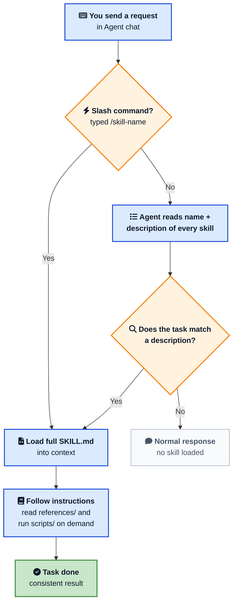
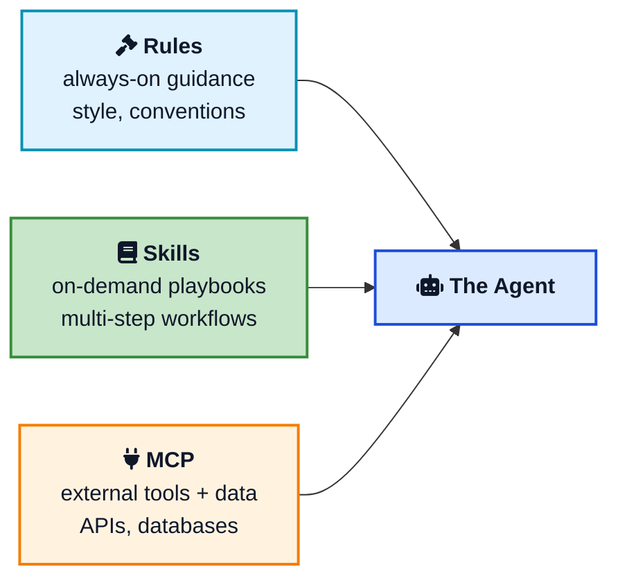

You have explained the same workflow to your AI agent five times this week. How to format a commit message. Which checklist to run before a release. The exact way your team reviews a pull request. Every new chat starts from zero, and you paste the same paragraph again.

**Cursor Skills** fix that. A skill is a small folder with a `SKILL.md` file that teaches the agent how to do one specific job, once, and reuse it forever. Write it down, and Cursor pulls it in automatically when the task matches, or you call it by name with a slash command. No more re-explaining.

This post is a hands-on guide to creating and using Cursor Skills, Cursor's take on the open Agent Skills standard. You will build your first `SKILL.md`, learn every frontmatter field that matters, see where skills live, scope them to specific files, add scripts, and understand how skills differ from Rules and [MCP](/model-context-protocol-mcp-explained/){:target="_blank" rel="noopener"}. By the end you will have a repeatable way to package your own workflows.

## <i class="fas fa-question-circle"></i> What a Cursor Skill Actually Is

A Cursor Skill is a portable, version-controlled package that teaches an agent how to perform a domain-specific task. That is the official framing for Agent Skills in the [Cursor docs](https://cursor.com/docs/skills){:target="_blank" rel="noopener"}, and it is worth unpacking because each word earns its place.

- **Portable.** Skills follow an open standard, [agentskills.io](https://agentskills.io/){:target="_blank" rel="noopener"}, so the same `SKILL.md` works across any agent that supports it, not just Cursor.
- **Version-controlled.** A skill is just files. Commit it to your repo and the whole team gets it on the next pull.
- **Actionable.** A skill can carry scripts, templates, and reference docs that the agent runs with its own tools.
- **Progressive.** Cursor loads a skill's details only when they are needed, so your context window stays lean.

The mental model that helps most: a skill is a playbook you hand to a very capable new teammate. You do not re-teach them how to write code. You tell them the parts that are specific to your team, your repo, and the task at hand.

Anthropic introduced the idea in its [Agent Skills announcement](https://www.anthropic.com/news/skills){:target="_blank" rel="noopener"}, and Cursor adopted the same open format. So learning the format here pays off well beyond a single editor.

## <i class="fas fa-folder-open"></i> Where Skills Live

Cursor discovers skills on startup by scanning a set of directories. The folder you pick decides who gets the skill.

| Location | Scope |
|---|---|
| `.cursor/skills/` | Project, shared through Git |
| `.agents/skills/` | Project, shared and cross-tool |
| `~/.cursor/skills/` | Personal, all your projects |
| `~/.agents/skills/` | Personal, cross-tool |

For compatibility, Cursor also reads from `.claude/skills/` and `.codex/skills/` at both project and user level, so skills written for those tools work too.

The rule of thumb is simple. If a skill encodes how *this project* works, put it in `.cursor/skills/` and commit it. If it encodes how *you* like to work everywhere, put it in `~/.cursor/skills/`.

Each skill is a folder, and the folder name is the skill's identity. The minimum layout is one file:

```text
.cursor/
└── skills/
    └── my-skill/
        └── SKILL.md
```

When a skill grows, it can add optional directories:

```text
.cursor/
└── skills/
    └── deploy-app/
        ├── SKILL.md
        ├── scripts/
        │   ├── deploy.sh
        │   └── validate.py
        ├── references/
        │   └── REFERENCE.md
        └── assets/
            └── config-template.json
```

You can also group skills into category subfolders like `.cursor/skills/shipping/land-it/SKILL.md`. The category folder is purely organizational. The skill's identity still comes from the folder that directly contains `SKILL.md`, here `land-it`, not the parent.

## <i class="fas fa-file-code"></i> Your First SKILL.md

Here is the smallest skill that does something useful. Create the folder `.cursor/skills/commit-helper/` and add a `SKILL.md`:

````markdown
---
name: commit-helper
description: Generate clear, conventional commit messages from staged changes. Use when the user asks for a commit message or mentions committing staged changes.
---

# Commit Helper

## When to use

Use this when the user wants a commit message for staged changes.

## Instructions

1. Read the staged diff with `git diff --cached`.
2. Write a Conventional Commits message: `type(scope): summary`.
3. Use types: feat, fix, docs, refactor, test, chore.
4. Keep the summary under 72 characters, in the imperative mood.
5. Add a short body only if the change needs explaining.

## Example

```
feat(auth): add JWT refresh token rotation

Rotate refresh tokens on every use and revoke the old one
to limit the blast radius of a leaked token.
```
````

That is a complete, working skill. The structure is always the same: YAML frontmatter between `---` markers, then a Markdown body with your instructions. Let us break down the parts that matter.



## <i class="fas fa-tasks"></i> The Frontmatter Fields That Matter

The frontmatter is where Cursor reads the metadata it needs to route and scope your skill. Two fields are required, the rest are optional but powerful.

| Field | Required | What it does |
|---|---|---|
| `name` | Yes | Skill identifier. Lowercase letters, numbers, hyphens only. Must match the folder name. |
| `description` | Yes | What the skill does and when to use it. The agent matches tasks against this. |
| `paths` | No | Glob patterns that scope the skill to matching files. |
| `disable-model-invocation` | No | When `true`, the skill only loads when you type `/skill-name`. |
| `metadata` | No | Arbitrary key-value pairs for your own bookkeeping. |

Two things trip people up. First, `name` must exactly match the folder name. If the folder is `commit-helper`, the name is `commit-helper`. Second, the older `globs` field still works as a fallback, but new skills should use `paths`.

## <i class="fas fa-bullseye"></i> The Description Is the Whole Game

If you take one thing from this post, take this: the `description` is not a summary, it is a routing key.

When Cursor starts, it does not load the full body of every skill. That would flood the context window. Instead it loads only the `name` and `description` of each skill, roughly a hundred tokens each. The agent then matches your request against those descriptions and pulls in the full `SKILL.md` only for the skill it decides is relevant. This is the **progressive disclosure** model, and it is why a vague description means a skill that never fires.

So write descriptions in the third person, state both *what* the skill does and *when* to use it, and include the words a user would actually type.

```yaml
# Weak: never triggers
description: Helps with deployments.

# Strong: clear what and when
description: Deploy the app to staging or production. Use when the user
  mentions deploying, shipping, going live, or releases.
```

A good description answers two questions at once. What can this do? And what phrasing should make it activate? Think of the trigger words your teammates use, "ship it", "cut a release", "PDF", "audit", and put them in.

## <i class="fas fa-project-diagram"></i> How a Skill Gets Loaded

It helps to picture the whole path from your message to the agent following a skill. Here is the flow Cursor runs every time.



The key insight is the two-stage load. Lightweight metadata up front for routing, heavy content only when chosen. That is what lets you keep dozens of skills installed without paying for all of them on every message.

## <i class="fas fa-bolt"></i> Using a Skill: Automatic vs Manual

Once a skill exists, there are two ways it runs.

**Automatic.** You just talk to the agent normally. If your request matches a skill's description, the agent loads it on its own. Ask "write me a commit message for these changes" and the `commit-helper` skill kicks in without you naming it.

**Manual.** Type a forward slash in Agent chat, search for the skill, and pick it, for example `/commit-helper`. This forces the skill to load no matter what the description says. Manual invocation is handy when you want to be certain, or when the skill has `disable-model-invocation: true` and a slash command is the *only* way to run it.

To confirm a skill was discovered, open Cursor Settings (Cmd+Shift+J on Mac, Ctrl+Shift+J on Windows and Linux), go to **Rules**, and look under the **Agent Decides** section. Your skill should be listed there.



## <i class="fas fa-filter"></i> Scoping Skills With paths

Some guidance only makes sense for certain files. You do not want your React component conventions loaded while the agent edits a SQL migration. The `paths` field solves this.

```markdown
---
name: react-component-patterns
description: Conventions for writing React components in this codebase.
paths:
  - "**/*.tsx"
  - "packages/ui/**/*.ts"
---

# React component patterns

- One component per file, named in PascalCase.
- Co-locate styles and tests next to the component.
- Prefer function components and hooks over classes.
```

Now the skill is surfaced only when the agent reads or edits a matching file. You can also pass a single comma-separated string instead of a list: `paths: "**/*.py, scripts/**/*.py"`.

There is a shortcut worth knowing. If you place a skill inside a nested `.cursor/skills/` folder deep in your repo, Cursor automatically scopes it to that directory. In a monorepo, a skill under `apps/web/.cursor/skills/` is only offered when the agent works inside `apps/web/`, with no `paths` field needed. Repo-wide skills go in the top-level `.cursor/skills/` and are available everywhere.

## <i class="fas fa-lock"></i> Manual-Only Skills With disable-model-invocation

By default the agent can choose to run a skill on its own. Sometimes you do not want that. A skill that deploys to production, drops a database, or sends a message should not fire because a description happened to match.

Set `disable-model-invocation: true` and the skill behaves like a traditional slash command. It loads only when you explicitly type `/skill-name`.

```markdown
---
name: prod-deploy
description: Deploy the current build to production. Manual only.
disable-model-invocation: true
---

# Production deploy

1. Confirm the branch is main and CI is green.
2. Run `scripts/deploy.sh production`.
3. Probe the /health endpoint and confirm HTTP 200.
4. On failure, run `scripts/rollback.sh` immediately.
```

This is the safety valve for anything destructive. The agent will never reach for it without you asking by name.



## <i class="fas fa-terminal"></i> Adding Scripts to a Skill

For fragile or repetitive operations, hand the agent a script instead of asking it to write the same code every time. Scripts are more reliable, save tokens, and produce consistent results.

Drop executables into a `scripts/` directory and reference them with relative paths from the skill root:

```markdown
---
name: deploy-app
description: Deploy the app to staging or production. Use when the user
  mentions deploying, releases, or going live.
---

# Deploy App

## Pre-deploy check

Run the validation script first: `python scripts/validate.py`

## Deploy

Run: `scripts/deploy.sh <environment>` where environment is
`staging` or `production`.
```

The agent runs the script with its tools, and typically only the script's *output* enters the conversation, not the source code. Scripts can be Bash, Python, JavaScript, or anything executable. Make them self-contained, with clear error messages and graceful handling of edge cases, since the agent will rely on the output to decide what to do next.

## <i class="fas fa-layer-group"></i> Keep It Lean: Progressive Disclosure

The most common mistake in a first skill is stuffing everything into `SKILL.md`. Keep the main file focused, ideally under about 500 lines, and push long material into separate files.

| Directory | Purpose |
|---|---|
| `scripts/` | Executable code the agent runs |
| `references/` | Long documentation loaded on demand |
| `assets/` | Templates, images, config, and other static files |

The pattern looks like this:

```markdown
# PDF Processing

## Quick start

[Just the essential steps here]

## More detail

- For the full API, see [references/api.md](references/api.md)
- For worked examples, see [references/examples.md](references/examples.md)
```

The agent reads `references/api.md` only if the task needs it. Keep references one level deep, linked directly from `SKILL.md`, because deeply nested links can be partially read. This is the same discipline that makes the whole skills system token-efficient: load the minimum, fetch the rest on demand.

## <i class="fas fa-balance-scale"></i> Skills vs Rules vs MCP

These three Cursor features overlap enough to confuse people, but they answer different questions.



- **Rules** are standing guidance. They apply always, or by file pattern, and shape every relevant response. Good for code style, naming, and conventions you never want forgotten.
- **Skills** are on-demand playbooks. They load only when a task matches, so they keep context clean while still encoding rich, multi-step workflows.
- **[MCP](/model-context-protocol-mcp-explained/){:target="_blank" rel="noopener"}** connects the agent to external tools and data, like a database, an issue tracker, or an internal API. It is about *capabilities*, not instructions.

A neat combination: an MCP server gives the agent access to your monitoring system, and a skill tells it exactly how to investigate an incident using that access. The tool and the playbook work together.

If you already have a pile of dynamic rules or slash commands, Cursor 2.4 ships a built-in `/migrate-to-skills` command that converts eligible ones into skills automatically. Dynamic rules become standard skills, and slash commands become skills with `disable-model-invocation: true` so they keep their manual behavior.

## <i class="fas fa-check-circle"></i> Writing Skills That Actually Get Used

A skill that never triggers, or triggers and gives muddled results, is worse than no skill. These habits keep yours sharp.

1. <i class="fas fa-bullseye"></i> **One job per skill.** Do not build a "code, deploy, and write the changelog" mega-skill. Split it. Narrow skills route better and are easier to maintain.
2. <i class="fas fa-key"></i> **Front-load the description.** Spend real effort here. State what it does, when to fire, and the words users say. This is the line that decides everything.
3. <i class="fas fa-feather"></i> **Be concise.** The agent is already smart. Only add what it would not already know: your repo's quirks, your team's format, the gotchas. Skip generic explanations.
4. <i class="fas fa-route"></i> **Structure as gather, act, verify.** Tell the agent what to read, what to do, and how to confirm success. A skill that ends with a verification step is far more reliable.
5. <i class="fas fa-equals"></i> **Use consistent terms.** Pick one word for each concept, "environment" not a mix of "env", "stage", and "target", and stick to it.
6. <i class="fas fa-slash"></i> **Use forward slashes in paths** and keep references one level deep so nothing gets half-read.
7. <i class="fas fa-history"></i> **Avoid time-sensitive notes.** "Before August, use the old API" rots fast. Keep a "current" section and tuck legacy details into a collapsible block.

If you write a lot of skills, lean on the built-in `/create-skill` command. It walks you through the structure and helps you produce a clean `SKILL.md`, which is a nice example of Cursor using a skill to help you write skills.

## <i class="fas fa-vial"></i> A Complete, Real Example

Putting it together, here is a project skill for running a code review against team standards, using a reference file for the detailed checklist.

```text
.cursor/skills/code-review/
├── SKILL.md
└── references/
    └── checklist.md
```

```markdown
---
name: code-review
description: Review code for quality, security, and maintainability against
  team standards. Use when reviewing a pull request, examining a diff, or when
  the user asks for a code review.
---

# Code Review

## When to use

Use when the user asks to review code, a PR, or a diff.

## Steps

1. Read the diff to understand the change and its intent.
2. Walk the checklist in [references/checklist.md](references/checklist.md).
3. Group feedback by severity and explain the why, not just the what.

## Output format

- Critical: must fix before merge
- Suggestion: worth improving
- Nice to have: optional polish
```

Commit that folder, and every teammate who pulls the repo now reviews code the same way, whether they remember the standards or not. That is the real payoff of skills: a workflow you write once becomes a shared default.

## <i class="fas fa-flag-checkered"></i> Wrapping Up

Skills turn the things you keep re-explaining into something the agent just knows. A folder, a `SKILL.md`, two required fields, and a clear description is all it takes to get started. From there you scope with `paths`, gate dangerous work behind `disable-model-invocation`, add `scripts/` for reliable steps, and keep the main file lean with progressive disclosure.

Start small. Pick the one workflow you explained most this week, write it down as a skill, and watch the agent pick it up on the next matching request. Add the next one when you feel the friction. Because skills are just files in an open format, the playbooks you build are portable, shareable through Git, and yours to keep, no matter which agent you reach for next.

---

**Related posts:**

- [Model Context Protocol (MCP) Explained](/model-context-protocol-mcp-explained/){:target="_blank" rel="noopener"} - How agents connect to external tools, the perfect companion to skills
- [Building AI Agents](/building-ai-agents/){:target="_blank" rel="noopener"} - The patterns behind the agents that run your skills
- [Prompt Engineering Basics](/prompt-engineering-basics/){:target="_blank" rel="noopener"} - Write the clear instructions that make skills work
- [Prompt Injection Explained](/prompt-injection-explained/){:target="_blank" rel="noopener"} - Why manual-only skills matter for risky actions
- [Multi-Agent AI Swarms System Design](/multi-agent-ai-swarms-system-design/){:target="_blank" rel="noopener"} - Where reusable skills fit in larger agent systems
- [Moltworker: Self-Hosted AI Agent Guide](/moltworker-self-hosted-ai-agent/){:target="_blank" rel="noopener"} - Run your own agent stack end to end

*Further reading: the [Cursor Agent Skills docs](https://cursor.com/docs/skills){:target="_blank" rel="noopener"}, the [Agent Skills open standard](https://agentskills.io/){:target="_blank" rel="noopener"} at agentskills.io, Anthropic's [Agent Skills announcement](https://www.anthropic.com/news/skills){:target="_blank" rel="noopener"}, and the [Cursor community forum thread](https://forum.cursor.com/t/how-to-use-agent-skills-in-cursor-ide/149860){:target="_blank" rel="noopener"} on using skills.*
