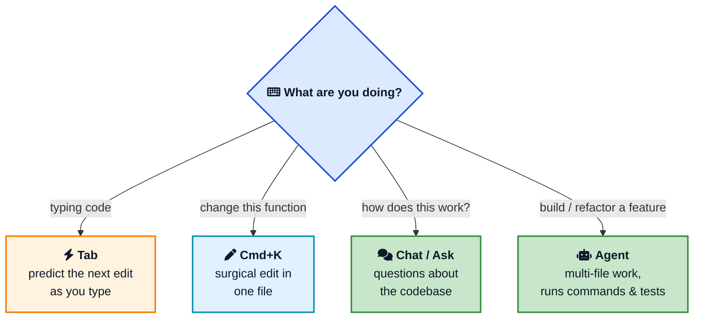
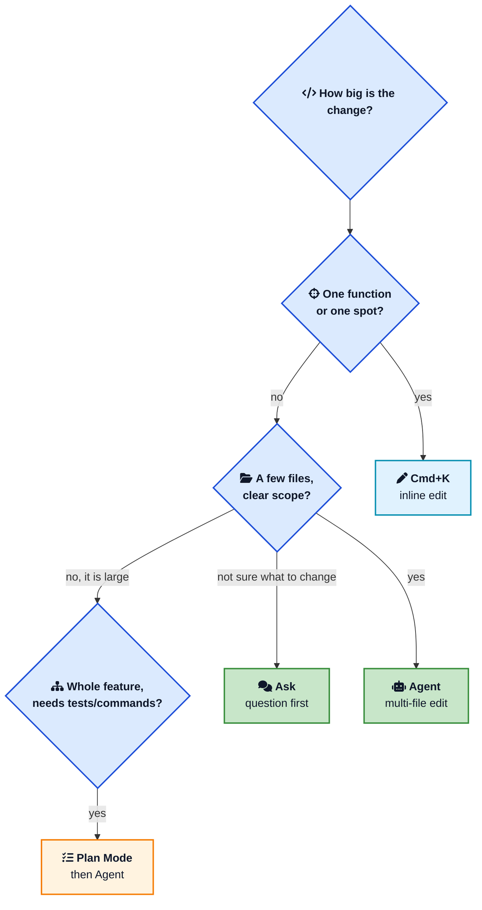
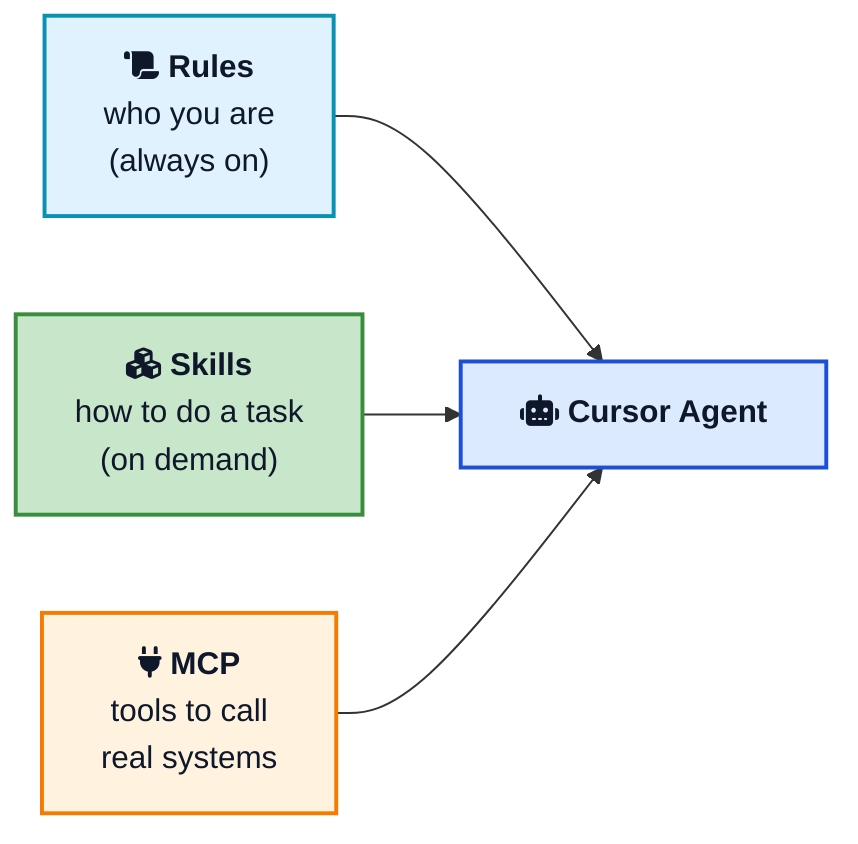

Most people open Cursor, use it like VS Code with a chat box bolted on, and quietly wonder what the fuss is about. They press Tab now and then, paste a question into the chat, copy the answer back, and move on. That works, but it is maybe a tenth of what the editor can do.

The gap between a casual Cursor user and a fast one is not talent. It is knowing which of Cursor's tools to reach for, and when. **Cursor** gives you several different ways to work with AI, each built for a different size of task, and the whole game is matching the tool to the job.

This guide on **how to use Cursor** walks through every feature in the order you will actually use them, then layers on the tips that separate power users from everyone else: Tab, inline edit, Chat, the Agent, Plan Mode, context with `@`, Rules, Skills, MCP, model selection, and the safety habits that keep the AI from wrecking your repo. If you are brand new to AI editors in general, the [Getting the Most Out of AI Coding Assistants](/ai-coding-assistants-guide/){:target="_blank" rel="noopener"} guide makes a good warm-up.

## <i class="fas fa-rocket"></i> First, Get Set Up in Five Minutes

Cursor is an AI-native fork of [VS Code](https://code.visualstudio.com/){:target="_blank" rel="noopener"}, so if you have used VS Code, you already know ninety percent of the interface. Download it from [cursor.com](https://cursor.com/){:target="_blank" rel="noopener"} and install it like any desktop app. The [installation docs](https://cursor.com/docs/get-started/installation){:target="_blank" rel="noopener"} cover every platform.

On first launch, Cursor offers to import your VS Code extensions, themes, and keybindings. Say yes. Your entire setup carries over, so the only new thing to learn is the AI layer. Sign in to create an account, open a project folder, and let Cursor index the codebase in the background. The free Hobby plan is plenty to learn on, and you can check the [pricing page](https://cursor.com/pricing){:target="_blank" rel="noopener"} when you are ready for heavier use.

That is the whole setup. Now the part that matters: how to actually use it.

## <i class="fas fa-layer-group"></i> The Mental Model: Four Surfaces, One Editor

Cursor exposes a handful of AI surfaces, and almost every productivity tip comes down to picking the right one. Here is the map.



Keep this picture in your head. The rest of this post is really just twelve ways to use these four surfaces well.

## <i class="fas fa-bolt"></i> Tip 1: Let Tab Predict Your Next Move

[Tab](https://cursor.com/docs/tab){:target="_blank" rel="noopener"} is the feature you will use thousands of times a day, so it pays to use it well. It is not old-school autocomplete that finishes a single word. Cursor predicts your next edit, often several lines, sometimes across a small jump in the file, based on what you just changed.

The workflow is simple: keep typing, and when the gray suggestion matches what you wanted, press `Tab` to accept. Press `Esc` to dismiss it. On many setups you can accept just one word with `Cmd+Right` when the full suggestion is close but not perfect.

The real skill with Tab is rhythm. Train your fingers to glance at the suggestion, accept the good ones instantly, and ignore the rest without breaking flow. For repetitive code like mappers, type definitions, or test cases, Tab is faster than asking the chat. What Tab cannot do is work across files, create new files, or run commands. The moment a task needs that, you reach for a different surface.

## <i class="fas fa-pen"></i> Tip 2: Use Cmd+K for Surgical Edits

When you want to change a specific piece of code, do not open a chat. Select the code and press `Cmd+K` (`Ctrl+K` on Windows and Linux). A small box appears right above your selection. Type the change in plain language:

- "convert this to async/await"
- "add error handling for null inputs"
- "extract this into a custom hook"

Cursor shows the result as an [inline diff](https://cursor.com/docs/inline-edit){:target="_blank" rel="noopener"} you accept with `Cmd+Enter` or reject with `Esc`. Because the change stays in one file and one spot, it is fast and easy to review. `Cmd+K` also works on an empty line to scaffold a new function from a description, and inside the integrated terminal to turn a description into a shell command.

The rule of thumb: if the change touches one function, `Cmd+K` is almost always the right tool. Reaching for the Agent to rename a variable is like driving to the mailbox.

## <i class="fas fa-comments"></i> Tip 3: Ask Before You Build

Cursor's Chat panel (`Cmd+L`) is for understanding, not editing. Open it and ask questions about your codebase: "where is authentication handled?", "what calls this function?", "explain how this reducer works." In **Ask mode**, the agent reads your code and answers without changing anything, which makes it safe to explore.

This is the most underused habit in Cursor. A thirty-second question in Ask mode often replaces a confused, multi-step Agent run that edits the wrong files. Understand the lay of the land first, then act. When you do want the answer grounded in the right place, pin context with `@` (more on that in Tip 6) instead of hoping the agent guesses where to look.



## <i class="fas fa-robot"></i> Tip 4: Reach for the Agent on Multi-File Work

The [Agent](https://cursor.com/docs/agent/overview){:target="_blank" rel="noopener"} is where Cursor stops feeling like autocomplete and starts feeling like a teammate. Open the agent panel (`Cmd+I`), describe a goal, and the Agent can:

- Read any file in the repo without you mentioning it
- Create, rename, and delete files
- Run terminal commands and read their output
- Run tests, see the failures, and [iterate](https://cursor.com/docs/agent/terminal){:target="_blank" rel="noopener"} until they pass
- Search the web for current documentation

Give it a clear, outcome-shaped task rather than step-by-step micromanagement: "add a rate limiter to the login endpoint and a test that proves it works." The Agent shines when the task has a definition of done it can check itself against, like green tests or a clean build.

Here is the decision that saves the most time, which surface for which size of change.



## <i class="fas fa-tasks"></i> Tip 5: Start Big Tasks in Plan Mode

This is the single biggest 2026 upgrade to how people use Cursor. Before you let the Agent loose on anything larger than one file, switch to [Plan Mode](https://cursor.com/docs/agent/planning){:target="_blank" rel="noopener"} by pressing `Shift+Tab` in the agent panel.

In Plan Mode, the agent researches your repo, asks clarifying questions, and writes a structured plan in Markdown, listing the files it will touch and the steps it will take. You read it, fix any wrong assumptions, and only then say go. This flips the usual failure mode on its head. Instead of arguing with an agent that already wrote the wrong thing across ten files, you catch the misunderstanding while it is still a paragraph of text. Edit the plan, approve it, and the build phase goes far smoother.

The modes themselves are worth knowing, since you can [switch between them](https://cursor.com/docs/agent/modes){:target="_blank" rel="noopener"} with `Shift+Tab`:

| Mode | Use it for |
|---|---|
| **Ask** | Questions and exploration, no edits |
| **Agent** | Multi-file edits, running commands and tests |
| **Plan** | Researching and drafting a plan before any code |
| **Debug** | Systematic troubleshooting when a run goes sideways |

## <i class="fas fa-at"></i> Tip 6: Stop Pasting Context, Use @-Mentions

The quality of Cursor's output depends almost entirely on the context it sees. Do not make it guess. Use `@`-mentions in any chat or agent input to inject exactly what matters:

- `@file` pins a specific file
- `@folder` pulls in a whole directory
- `@code` references a symbol or snippet
- `@docs` references official library documentation
- `@web` searches the web for current information
- `@git` brings in commits or diffs

Precise context beats a long, vague prompt every time. If you are fixing a bug, mention the file with the bug and the test that catches it, not the whole repo. This is really an applied form of [context engineering](/context-engineering/){:target="_blank" rel="noopener"}: feed the model the smallest set of high-signal information that lets it do the job, and nothing else.



## <i class="fas fa-scroll"></i> Tip 7: Encode Your Conventions Once with Rules

If you find yourself repeating "use our API client", "never commit secrets", or "this is a Next.js app router project" in every chat, stop. Put it in a [Rule](https://cursor.com/docs/context/rules){:target="_blank" rel="noopener"} instead.

Rules are persistent instructions Cursor applies automatically. The modern format lives in `.cursor/rules/` as Markdown files, and the older single `.cursorrules` file at the repo root still works. Because rules live in the repository, every teammate and every agent run starts from the same baseline.

Good rules are specific and verifiable:

```text
- Use TypeScript strict mode with explicit return types.
- Follow the repository pattern for data access. Never call the
  database directly from API routes.
- Use Tailwind for styling. Do not write custom CSS files.
- Never bypass the auth middleware.
```

Keep them tight. Every word in your rules consumes part of the context window, so a focused page of real constraints beats a sprawling essay of "write clean code." Vague rules do nothing; precise guardrails change the output.

## <i class="fas fa-cubes"></i> Tip 8: Package Repeatable Workflows as Skills

Rules tell the agent *who you are*. **Skills** tell it *how to do a specific job*. A Skill is a folder with a `SKILL.md` file that teaches the agent a multi-step workflow once, so you never re-explain it: how to cut a release, how your team reviews a pull request, how to generate a migration.

The agent pulls a skill in only when the task matches its description, which keeps your context window clean, or you can trigger it by name with a slash command. This is the natural next step after rules, and it is worth a post of its own, which is exactly what the [Cursor Skills guide](/how-to-create-and-use-skills-in-cursor/){:target="_blank" rel="noopener"} covers: the `SKILL.md` format, where skills live, scoping with paths, bundling scripts, and how skills differ from rules and MCP.

The short version: use a **Rule** for standing conventions, and a **Skill** for a workflow with steps.

## <i class="fas fa-plug"></i> Tip 9: Connect Real Tools with MCP

By default the agent only knows your code. The [Model Context Protocol](https://cursor.com/docs/context/mcp){:target="_blank" rel="noopener"} (MCP) changes that by letting Cursor talk to external systems: databases, issue trackers like Jira or Linear, browsers, internal APIs, and documentation. You configure servers under Cursor Settings, and from then on the agent can query live data instead of relying on stale assumptions baked into the code.

This is the difference between "guess what the schema probably looks like" and "read the actual schema from the database." Most Cursor users do not know MCP exists, which is exactly why learning it is high leverage. For a full explanation of how the protocol works under the hood, see [Model Context Protocol (MCP) Explained](/model-context-protocol-mcp-explained/){:target="_blank" rel="noopener"}.



## <i class="fas fa-microchip"></i> Tip 10: Switch Models by Task, Not by Habit

Cursor lets you pick which model powers each interaction, and you can change it mid-chat. The mistake is picking one model and using it for everything.

A practical strategy:

- **Routine edits, Tab, most Agent work:** a fast, capable model such as a current Claude Sonnet or GPT model. Fast and cheap, good enough for the large majority of tasks.
- **Deep architecture, hard debugging, big refactors:** a stronger reasoning model. Slower and pricier, so save it for the ten percent of work where reasoning depth actually matters.
- **Huge codebase exploration:** a long-context model when you genuinely need to feed in a lot at once.

A good heuristic: start with the fast model, and only escalate if it fails twice on the same task. If you find yourself reaching for the heavy model many times a day, the problem is usually your prompt or your context, not your model. The same instincts from [prompt engineering basics](/prompt-engineering-basics/){:target="_blank" rel="noopener"} apply here directly.

## <i class="fas fa-broom"></i> Tip 11: Keep a Clean Index and a Budgeted Context

Cursor builds a searchable [index](https://cursor.com/docs/context/codebase-indexing){:target="_blank" rel="noopener"} of your project so it can retrieve relevant code on its own. That index is only as good as what you let into it. Add a `.cursorignore` file for `node_modules`, build outputs, large data files, and generated artifacts. A clean index means more accurate retrieval and less noise.

Think of the context window as a budget. Everything competes for space: your rules, the files you `@`-mention, the conversation history, and the code the agent retrieves. When a chat gets long and starts drifting, start a fresh one rather than dragging a bloated history along. Short, focused sessions consistently beat one giant rambling thread.

## <i class="fas fa-shield-alt"></i> Tip 12: Commit a Checkpoint and Always Read the Diff

The Agent is powerful, which means it can also confidently make a mess. Two habits keep you safe.

First, **commit before any big Agent run**. A quick `git commit -am "checkpoint before agent"` costs four seconds and gives you `git reset --hard HEAD` as an eject button if the run goes wrong. Cursor also has its own checkpoint and restore feature, but a real git commit is the one you can fully trust.

Second, **read the diff yourself**. The agent's summary of what it did is not the same as what it actually did. Accept or reject changes in the diff view file by file, especially for anything touching auth, money, migrations, or deletes. The whole point of an AI pair programmer is that you are still the senior partner. If you want to go deeper on reviewing AI output well, [Getting the Most Out of AI Coding Assistants](/ai-coding-assistants-guide/){:target="_blank" rel="noopener"} covers the review discipline in detail.

## <i class="fas fa-keyboard"></i> The Shortcuts Worth Memorizing

You do not need all of these on day one, but committing the top few to muscle memory is where the speed comes from.

| Shortcut (Mac) | Windows / Linux | Action |
|---|---|---|
| `Tab` | `Tab` | Accept the AI completion |
| `Esc` | `Esc` | Dismiss a suggestion |
| `Cmd+K` | `Ctrl+K` | Inline edit (or terminal command) |
| `Cmd+L` | `Ctrl+L` | Open Chat / Ask |
| `Cmd+I` | `Ctrl+I` | Open the Agent panel |
| `Shift+Tab` | `Shift+Tab` | Cycle modes (Ask, Agent, Plan) |
| `Cmd+Shift+L` | `Ctrl+Shift+L` | Add current file to context |
| `Cmd+Shift+P` | `Ctrl+Shift+P` | Command palette |



## <i class="fas fa-exclamation-triangle"></i> Common Mistakes That Slow People Down

Even people who know the features fall into these traps.

- **Using the Agent for everything.** Renaming a variable or fixing one line does not need an autonomous, multi-file run. `Cmd+K` is faster and safer for small edits.
- **Skipping Plan Mode on big tasks.** Letting the Agent write first and think later is how you get a confident, wrong, ten-file diff. Plan first.
- **Vague prompts with no context.** "Fix the bug" with nothing pinned forces the agent to guess. Mention the file, the error, and the expected behavior.
- **Never writing rules.** Most "Cursor produces bad code" complaints disappear once the user adds a focused rules file that states the stack and conventions.
- **Accepting diffs blindly.** The summary looks fine, so you click accept. Read the actual change, particularly for sensitive code.
- **One long mega-chat.** Context rot is real. Start a fresh chat for a new task instead of letting an old thread balloon.

## <i class="fas fa-flag-checkered"></i> Wrapping Up

Learning how to use Cursor is not about memorizing every feature. It is about building a tight loop: pick the right surface for the size of the task, give it the right context, let it work, and review what comes back. Tab for typing, `Cmd+K` for surgical edits, Ask to understand, the Agent for real features, and Plan Mode before anything big. Encode your conventions in Rules, package your workflows as Skills, connect your tools with MCP, and switch models on purpose rather than by habit.

Start with two or three of these tips this week, not all twelve. Get Tab and `Cmd+K` into your fingers, then add Plan Mode and Rules, then the rest. The developers who feel ten times faster in Cursor are not using secret features. They are just using the obvious ones deliberately.

---

**Related posts:**

- [Cursor Skills: How to Create and Use Agent Skills](/how-to-create-and-use-skills-in-cursor/){:target="_blank" rel="noopener"} - Package your repeatable workflows so the agent runs them on demand
- [Model Context Protocol (MCP) Explained](/model-context-protocol-mcp-explained/){:target="_blank" rel="noopener"} - How Cursor connects to databases, APIs, and external tools
- [Getting the Most Out of AI Coding Assistants](/ai-coding-assistants-guide/){:target="_blank" rel="noopener"} - The review and prompting habits that apply to any AI editor
- [Context Engineering](/context-engineering/){:target="_blank" rel="noopener"} - Why feeding the model the right context matters more than the model
- [Prompt Engineering Basics](/prompt-engineering-basics/){:target="_blank" rel="noopener"} - Write prompts that get the output you want the first time
- [Claude Cowork Guide](/claude-cowork-guide/){:target="_blank" rel="noopener"} - Another agentic coding workflow worth knowing
- [Building AI Agents](/building-ai-agents/){:target="_blank" rel="noopener"} - What is actually happening inside an autonomous agent like Cursor's

*Further reading: the official [Cursor documentation](https://cursor.com/docs){:target="_blank" rel="noopener"}, the [Agent modes](https://cursor.com/docs/agent/modes){:target="_blank" rel="noopener"} and [Tab](https://cursor.com/docs/tab){:target="_blank" rel="noopener"} pages, the [Rules](https://cursor.com/docs/context/rules){:target="_blank" rel="noopener"} guide, and the [MCP documentation](https://cursor.com/docs/context/mcp){:target="_blank" rel="noopener"}.*
