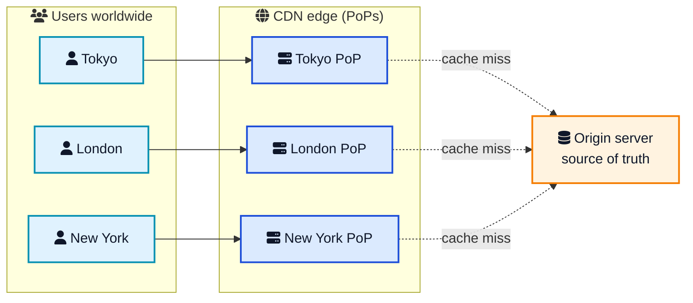
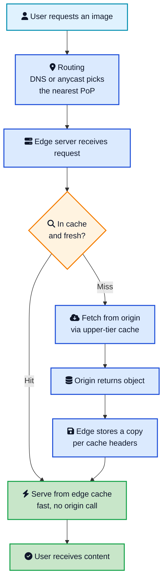
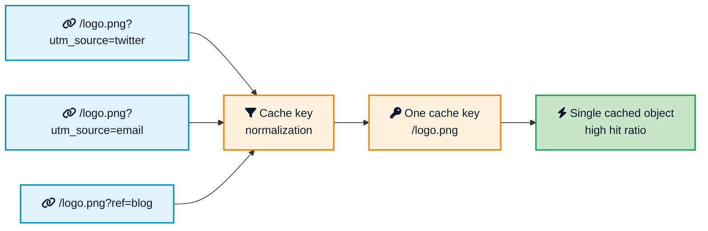
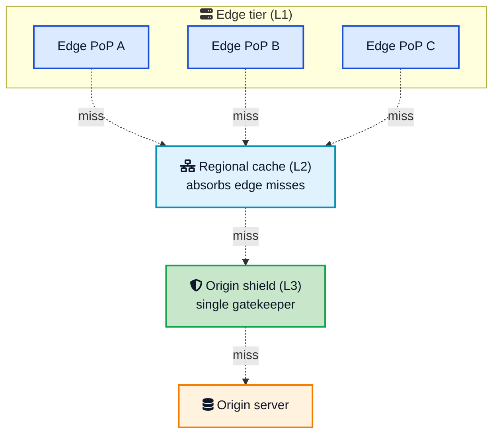
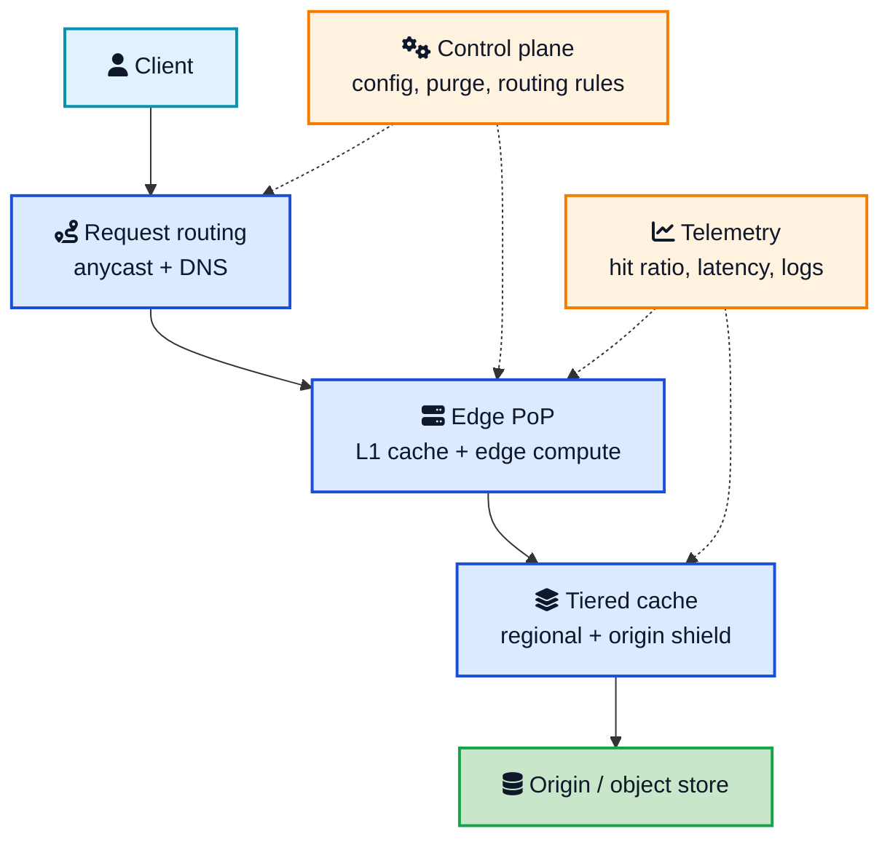

Open a website hosted in Virginia from a phone in Singapore and you feel the distance. Each round trip crawls across oceans and undersea cables, and even at the speed of light, 15,000 kilometers there and back adds up. Stack a dozen of those round trips for HTML, CSS, JavaScript, images, and fonts, and the page feels slow no matter how fast your server is.

A **content delivery network**, or CDN, fixes this by changing one thing: the distance. Instead of every user reaching across the planet to your origin server, the CDN keeps copies of your content on **edge servers** all over the world and serves each person from the one nearest them. The file that used to travel 15,000 kilometers now travels 30.

This post walks through **CDN system design** from the ground up. You will see what a CDN actually is, how a request flows through it, how caching and routing really work, how to keep your origin protected, and how to design one if it comes up in a [system design interview](/system-design-cheat-sheet/){:target="_blank" rel="noopener"}.

## <i class="fas fa-question-circle"></i> What a CDN Actually Is

A CDN is a geographically distributed group of servers that cache content close to users so it loads faster. That is the whole idea in one sentence. Everything else is detail about how it does that well.

It helps to be precise about the two kinds of servers involved:

- **Origin server.** The single source of truth where your real content lives. This is your own web server, your application backend, or an object store like [Amazon S3](/how-amazon-s3-works/){:target="_blank" rel="noopener"}. There is one logical origin (it may itself be a cluster), and it always has the authoritative copy.
- **Edge servers.** The CDN's cache nodes, spread across hundreds of data centers worldwide. They hold temporary copies of your content and answer users from nearby. A cluster of edge servers in one location is called a **Point of Presence**, or **PoP**.

A CDN does not host your site and does not replace web hosting. It sits in front of your origin as a global cache and shield. If the origin has no copy of a file, the CDN has nothing to serve. Keep that mental model and the rest falls into place.

Most users are served straight from the nearest edge. The dotted lines to the origin only fire on a cache miss, which is the exception, not the rule.



## <i class="fas fa-stopwatch"></i> Why Latency Is the Whole Game

To understand CDN design you have to respect the speed of light. In fiber, signals travel roughly 200,000 km per second. A round trip from Singapore to Virginia and back is around 30,000 km, which is about 150 ms of pure travel time before your server does any work at all. Add TLS handshakes, [DNS lookups](/how-dns-works-complete-guide/){:target="_blank" rel="noopener"}, and multiple assets, and you can lose a full second to distance alone.

A well-configured CDN cuts **Time to First Byte (TTFB)** by 200 to 600 ms compared with serving from a single origin, and that improvement cascades straight into faster page loads and better Core Web Vitals. The reasons it works are simple but they compound:

- **Shorter distance.** Fewer kilometers means fewer milliseconds per round trip.
- **Warm connections.** Edge servers keep optimized, often pre-established connections to users and to the origin, so the expensive handshakes happen less often.
- **Modern transport at the edge.** Major CDNs terminate HTTP/3 over QUIC at the edge even when your origin still speaks HTTP/1.1, so users get the faster protocol for free.
- **Offloaded origin.** With most traffic absorbed at the edge, your origin stays responsive under load instead of buckling during a spike.

This is also why a CDN is a core building block in almost every large-scale architecture, from a [URL shortener](/tinyurl-system-design/){:target="_blank" rel="noopener"} serving redirects to a [video pipeline](/netflix-video-processing-pipeline/){:target="_blank" rel="noopener"} streaming to millions.

## <i class="fas fa-route"></i> How a Request Flows Through a CDN

The first job of a CDN is **request routing**: getting each user to the right edge server. There are two common ways to do this, and big CDNs use both.

### DNS-based routing

The classic method works through [DNS](/how-dns-works-complete-guide/){:target="_blank" rel="noopener"}. When a user looks up `cdn.example.com`, the CDN's DNS resolver looks at where the request came from and returns the IP address of a nearby PoP. Different users get different answers for the same hostname, each one pointing at their closest edge. It is simple and widely supported, but DNS caching can make it slightly stale, and it routes based on the user's resolver location rather than the user exactly.

### Anycast routing

The modern method is **anycast**. Many edge servers around the world advertise the *same* IP address, and the internet's routing protocol, [BGP](/what-happens-when-you-type-url-in-browser/){:target="_blank" rel="noopener"}, naturally delivers each user's packets to the topologically nearest one. One IP, hundreds of physical locations. Anycast is what lets a CDN publish a single address yet serve it globally, and it is a big reason CDNs shrug off DDoS attacks: hostile traffic gets spread across every PoP instead of hammering one box.

Here is the full path of a single request, from the user's click to the byte coming back.

The decision in the middle, **cache hit or cache miss**, is the heart of the whole system. Everything a CDN does well comes down to making that diamond say "hit" as often as possible.



## <i class="fas fa-layer-group"></i> Caching: The Core of CDN Design

Caching is the process of storing copies of files in fast, nearby locations so they can be served without going back to the source every time. In a CDN, files are cached on edge servers, and a few key concepts govern how well it works.

### Cache hit, cache miss, and hit ratio

- A **cache hit** means the edge already has a fresh copy and serves it directly. Fast and cheap.
- A **cache miss** means the edge has to fetch from the origin (or an upper tier) first. Slower and more expensive.
- The **cache hit ratio** is the percentage of requests that are hits. This is the single most important number in CDN design. A hit ratio of 95 percent or more is what makes a CDN both fast and cheap, because only 5 percent of traffic ever reaches your origin.

### TTL and freshness

Each cached object has a **TTL (time to live)**, set through HTTP headers like `Cache-Control: max-age=3600`. While inside the TTL, the edge serves the object without asking the origin. After it expires, the edge revalidates, often with a cheap conditional request (`If-None-Match` with an `ETag`), and the origin can answer `304 Not Modified` to say "still good, keep it." The rules here come straight from the [HTTP caching spec](https://developer.mozilla.org/en-US/docs/Web/HTTP/Caching){:target="_blank" rel="noopener"}, not from CDN magic.

### Cache keys

A **cache key** decides which requests share the same cached object. By default it is built from the host and URL path, but it can include query strings, headers, or cookies. This is where teams quietly destroy their hit ratio: if the key includes a tracking parameter like `utm_source`, then `/logo.png?utm_source=twitter` and `/logo.png?utm_source=email` become two separate cache entries for the same image. Good CDN config **normalizes** the key by stripping irrelevant parameters so identical content maps to one entry.

## <i class="fas fa-sitemap"></i> Tiered Caching and the Origin Shield

A flat CDN, where every one of hundreds of edge PoPs talks straight to your origin on a miss, has a problem. A brand new file, or one that just expired everywhere, can trigger hundreds of simultaneous origin fetches for the exact same object. That is a **[thundering herd](/thundering-herd-problem/)**, and it can knock over an origin that the CDN was supposed to protect.

The fix is **tiered caching**. Instead of a flat layout, caches form a hierarchy:

1. **Edge cache (L1).** The PoP closest to the user. Most requests stop here.
2. **Regional or mid-tier cache (L2).** A larger cache that absorbs misses from many edge PoPs in a region. An edge miss checks the regional tier before going further.
3. **Origin shield (L3).** A single designated cache that sits directly in front of the origin. Every miss from every region funnels through this one node, so the origin sees the smallest possible number of requests.



Two more techniques work alongside tiers to keep the origin calm:

- **Request collapsing (coalescing).** If many users ask for the same uncached object at once, the edge fetches it from upstream a single time and serves the one response to everyone who was waiting. This is the direct cure for the thundering herd.
- **Cache reserve.** A large, disk-backed cache that holds objects longer than the hot edge caches, giving a second chance for a hit before the origin is touched.

Done right, the origin ends up serving a tiny fraction of a percent of total requests. This kind of layered defense is the same instinct behind a good [rate limiter](/dynamic-rate-limiter-system-design/){:target="_blank" rel="noopener"} or a well-placed [queue](/role-of-queues-in-system-design/){:target="_blank" rel="noopener"}: shield the precious, expensive resource at the back.

## <i class="fas fa-exchange-alt"></i> Push CDN vs Pull CDN

There are two models for how content gets into the cache, and the choice affects how you operate the system.

### Pull CDN

A **pull CDN** is lazy. You point it at your origin, and the first time anyone requests a file, the edge pulls it from the origin, caches it, and serves it. Every later request is a hit until the TTL expires. You do almost nothing: configure the origin once and let demand fill the cache.

- **Good for:** most websites and apps, where content is large in variety and you cannot predict what will be popular.
- **Trade-off:** the first user for any object pays the cache-miss penalty, and a fresh deploy starts cold.

### Push CDN

A **push CDN** is eager. You upload (push) content to the CDN ahead of time, so it is already in place before the first request. Nothing is fetched on demand because you put it there yourself.

- **Good for:** large files that change rarely, such as software installers, game assets, OS updates, and video libraries, where you want explicit control over what is stored and when.
- **Trade-off:** you own the work of uploading and expiring content, and you can waste storage on files nobody requests.

| Aspect | Pull CDN | Push CDN |
|---|---|---|
| Who loads the cache | CDN, on first request | You, ahead of time |
| First request | Cache miss (slower) | Already cached (fast) |
| Setup effort | Low, point at origin | Higher, manage uploads |
| Storage use | Only what is requested | Whatever you push |
| Best for | General websites, dynamic catalogs | Large, static, rarely changed files |

Most teams start with a pull CDN because it is nearly zero-config, and reach for push only when they have big, predictable assets to distribute.

## <i class="fas fa-eraser"></i> Cache Invalidation: The Hard Part

Phil Karlton's old joke that the two hardest problems in computer science are cache invalidation and naming things lands hard in CDN design. Once a file is cached at hundreds of PoPs, how do you update it everywhere the moment it changes?

There are three common strategies, usually combined:

1. **TTL expiry.** Set a `max-age` and let objects expire naturally. Simple, but you cannot push an urgent change faster than the TTL allows.
2. **Explicit purge (invalidation).** Call the CDN's API to remove an object right now, by URL, by **cache tag** (purge everything tagged `product-42`), or for the whole zone. Fastly is known for purges that complete in around 150 ms globally; others take seconds to minutes.
3. **Versioned URLs (cache busting).** The pattern most production sites rely on. Give each asset a content hash in its name, like `app.4f9a2c.js`, and set a very long TTL. When the content changes, the file name changes, so users fetch the new URL while the old one quietly ages out. No purge needed, and no risk of serving a stale mix.

A solid default is: long TTLs plus versioned file names for static assets, cache tags for content you must update on demand, and short or zero TTL for truly dynamic responses.

## <i class="fas fa-bolt"></i> Beyond Caching: What Modern CDNs Do

A CDN in 2026 is far more than a dumb cache. Because the edge already sits between every user and your origin, it is the perfect place to do more work.

- **TLS termination.** The edge handles the HTTPS handshake close to the user, which is faster, and keeps a warm connection back to the origin.
- **Edge compute.** Run small bits of code at the edge to personalize responses, do auth checks, rewrite requests, or assemble pages without an origin round trip. Cloudflare Workers (V8 isolates with sub-millisecond cold starts), AWS Lambda@Edge, Fastly Compute@Edge (WebAssembly), and Akamai EdgeWorkers all do this.
- **Image and media optimization.** Resize images on the fly and convert to modern formats like WebP or AVIF, so a phone gets a small image and a desktop gets a sharp one, all from the edge.
- **Security at the edge.** A **web application firewall (WAF)** filters malicious requests, **DDoS protection** absorbs volumetric attacks across the anycast network, and bot management blocks scrapers before they ever reach your origin.

The flip side of concentrating so much at the edge is concentration risk: when a big provider has a bad day, a large slice of the web feels it. The [Cloudflare outage of November 2025](/cloudflare-outage-november-2025/){:target="_blank" rel="noopener"} and the way [Cloudflare serves 55 million requests a second](/how-cloudflare-supports-55-million-requests-per-second/){:target="_blank" rel="noopener"} are two sides of the same coin: enormous reach, and enormous blast radius.

## <i class="fas fa-drafting-compass"></i> Designing a CDN in a System Design Interview

If you are asked to design a CDN, structure the answer around the same building blocks, and call out the trade-offs. Here is a clean way to frame it.

**Functional requirements**

- Serve static (and some dynamic) content with low latency worldwide.
- Cache content near users and keep it reasonably fresh.
- Reduce load on the origin and survive traffic spikes.
- Allow content updates and purges.

**Non-functional requirements**

- Low latency and high cache hit ratio.
- High availability and global scale.
- Resilience to failures and DDoS attacks.

**Core components**

- **Request routing layer.** Anycast plus geo-aware DNS to send users to the nearest healthy PoP.
- **Edge PoPs.** Cache storage (memory plus disk), an eviction policy (LRU or similar), and optional edge compute.
- **Tiered caching and origin shield.** To minimize origin load and prevent thundering herds, with request collapsing.
- **Origin and object store.** The source of truth, often [object storage like S3](/how-amazon-s3-works/){:target="_blank" rel="noopener"}.
- **Control plane.** Distributes config, cache rules, and purge commands to every PoP, and uses [consistent hashing](/consistent-hashing-explained/){:target="_blank" rel="noopener"} to map content to cache nodes so that adding or removing nodes does not blow away the whole cache.
- **Telemetry.** Track cache hit ratio, latency percentiles, and error rates per PoP. You cannot tune what you cannot see, so lean on solid [distributed tracing](/distributed-tracing-jaeger-vs-tempo-vs-zipkin/){:target="_blank" rel="noopener"} and metrics.

The interview gold is in the trade-offs: anycast vs DNS routing, TTL vs purge for freshness, push vs pull for loading, and how cache key design drives hit ratio. The [system design cheat sheet](/system-design-cheat-sheet/){:target="_blank" rel="noopener"} covers the surrounding fundamentals if you want a refresher.

## <i class="fas fa-server"></i> CDN Providers Compared

You rarely build your own CDN; you rent one. The major content delivery network services differ in price, edge compute, and how much control they hand you. Here is a practical 2026 snapshot.

| Provider | Best for | Edge compute | Pricing shape |
|---|---|---|---|
| **Cloudflare** | Default for most teams, strong free tier | Workers (V8 isolates, sub-ms cold start) | Free tier, then flat plans plus usage |
| **AWS CloudFront** | AWS-native stacks with S3 and Lambda | Lambda@Edge, CloudFront Functions | Pay as you go, free egress from AWS origins |
| **Fastly** | Instant purge, programmable edge | Compute@Edge (WebAssembly) | Usage-based, ~$50/mo minimum |
| **Akamai** | Largest enterprise, media and finance | EdgeWorkers | Custom enterprise contracts |
| **Bunny.net** | Cost-sensitive, static and video | Edge Scripting | Flat, around $0.01 per GB |
| **Google Cloud CDN** | GCP-native stacks | Backed by Cloud Functions | Usage-based, tiered |

A few honest rules of thumb:

- **Cloudflare** is the easy default: free tier, built-in WAF and DDoS protection, and the most generous edge compute. Great for startups and side projects.
- **AWS CloudFront** wins when you already live on AWS, because free data transfer between S3 and CloudFront often offsets its per-GB cost.
- **Fastly** is the developer's CDN: ~150 ms global purges and real programmable control, at a premium price.
- **Akamai** remains the enterprise standard with the largest network and carrier-grade SLAs, but expects budget and contract negotiation.
- **Bunny.net** is the budget champion for static-heavy and video workloads with simple flat pricing.

When you compare cost, ignore list prices and think total cost: egress fees, request volume, support tier, and the operational time to run the thing. Cache hit ratio matters here too, because a higher hit ratio means less origin bandwidth and a smaller bill.

## <i class="fas fa-exclamation-triangle"></i> Common CDN Mistakes

These are the traps that turn a CDN from an asset into a liability.

- **Caching with bad cache keys.** Leaving tracking query parameters in the key fragments your cache and tanks the hit ratio. Normalize keys.
- **Caching personalized or private content.** Serving one user's logged-in page to another is a real and dangerous bug. Mark private responses `Cache-Control: private, no-store` and be deliberate about what is cacheable.
- **Disabling request collapsing or origin shield.** Without them, a popular object expiring can stampede your origin. Keep the protective tiers on.
- **Relying only on purge for freshness.** Purges can lag and can be rate-limited. Prefer versioned URLs for static assets so correctness does not depend on a fast purge.
- **Forgetting the origin still matters.** A CDN reduces origin load, it does not eliminate it. Misses, dynamic content, and purges all hit the origin, so it still needs to be reliable.
- **Ignoring observability.** If you are not watching cache hit ratio and per-PoP latency, you are flying blind. Measure first, then tune.

## <i class="fas fa-flag-checkered"></i> Wrapping Up

A CDN is one of the highest-leverage pieces of infrastructure you can add to a system, and the idea behind it is refreshingly simple: keep content close to users so distance stops being the bottleneck. Everything in CDN system design serves that goal. Anycast and DNS routing pick the nearest edge. Caching, good cache keys, and sensible TTLs make sure that edge can answer without bothering the origin. Tiered caching, origin shield, and request collapsing protect the origin when a miss does happen. And edge compute, TLS, and a WAF turn the same network into a performance and security layer, not just a cache.

If you remember one number, make it cache hit ratio. Push it high and your CDN is fast, cheap, and resilient. Let it slip and you are paying for a global network that still funnels traffic to a single overworked origin. Design for the hit, protect the origin, measure everything, and the planet stops feeling so large.

---

**Related posts:**

- [System Design Cheat Sheet](/system-design-cheat-sheet/){:target="_blank" rel="noopener"} - The core building blocks every CDN design sits on top of
- [How DNS Works](/how-dns-works-complete-guide/){:target="_blank" rel="noopener"} - The lookup that routes users to the nearest edge
- [What Happens When You Type a URL](/what-happens-when-you-type-url-in-browser/){:target="_blank" rel="noopener"} - The full journey a request takes, CDN included
- [Consistent Hashing Explained](/consistent-hashing-explained/){:target="_blank" rel="noopener"} - How CDNs map content to cache nodes without cold-cache chaos
- [How Amazon S3 Works](/how-amazon-s3-works/){:target="_blank" rel="noopener"} - A common origin and object store behind a CDN
- [How Cloudflare Supports 55 Million Requests per Second](/how-cloudflare-supports-55-million-requests-per-second/){:target="_blank" rel="noopener"} - A real edge network operating at scale
- [Cloudflare Outage November 2025](/cloudflare-outage-november-2025/){:target="_blank" rel="noopener"} - The concentration risk of relying on one big edge provider
- [Dynamic Rate Limiter System Design](/dynamic-rate-limiter-system-design/){:target="_blank" rel="noopener"} - Another way to shield an expensive backend from traffic

*Further reading: Cloudflare's [What is a CDN?](https://www.cloudflare.com/learning/cdn/what-is-a-cdn/){:target="_blank" rel="noopener"} and [CDN Reference Architecture](https://developers.cloudflare.com/reference-architecture/architectures/cdn/){:target="_blank" rel="noopener"}, the [Amazon CloudFront developer guide](https://docs.aws.amazon.com/AmazonCloudFront/latest/DeveloperGuide/Introduction.html){:target="_blank" rel="noopener"}, GeeksforGeeks on [CDNs in system design](https://www.geeksforgeeks.org/system-design/what-is-content-delivery-networkcdn-in-system-design/){:target="_blank" rel="noopener"}, and the [MDN HTTP caching guide](https://developer.mozilla.org/en-US/docs/Web/HTTP/Caching){:target="_blank" rel="noopener"}.*
