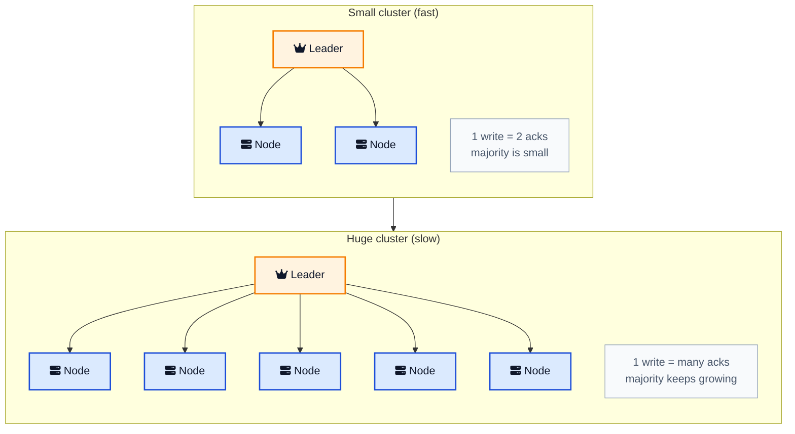
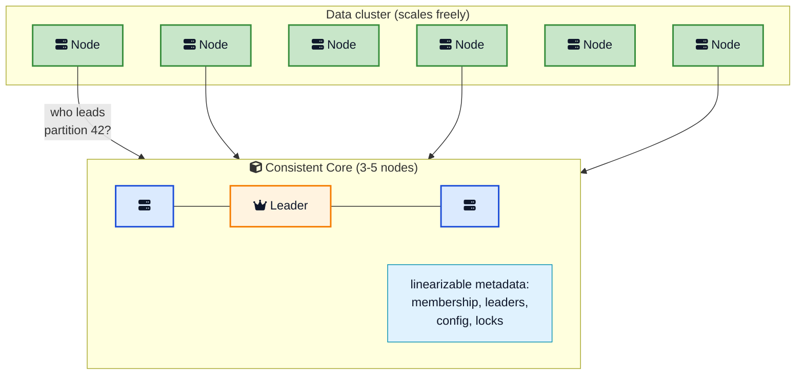
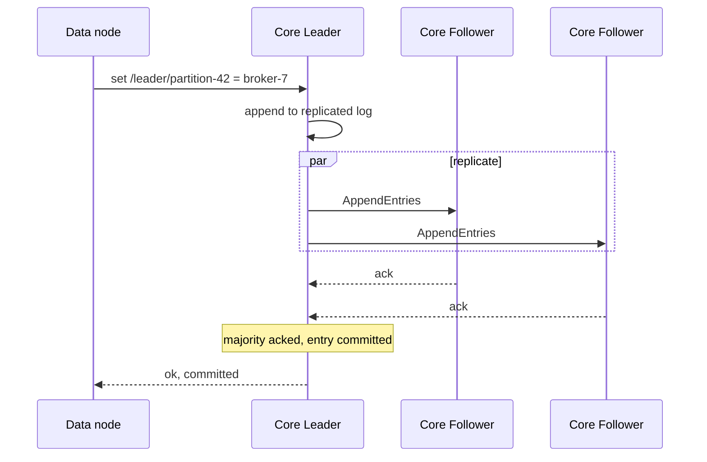
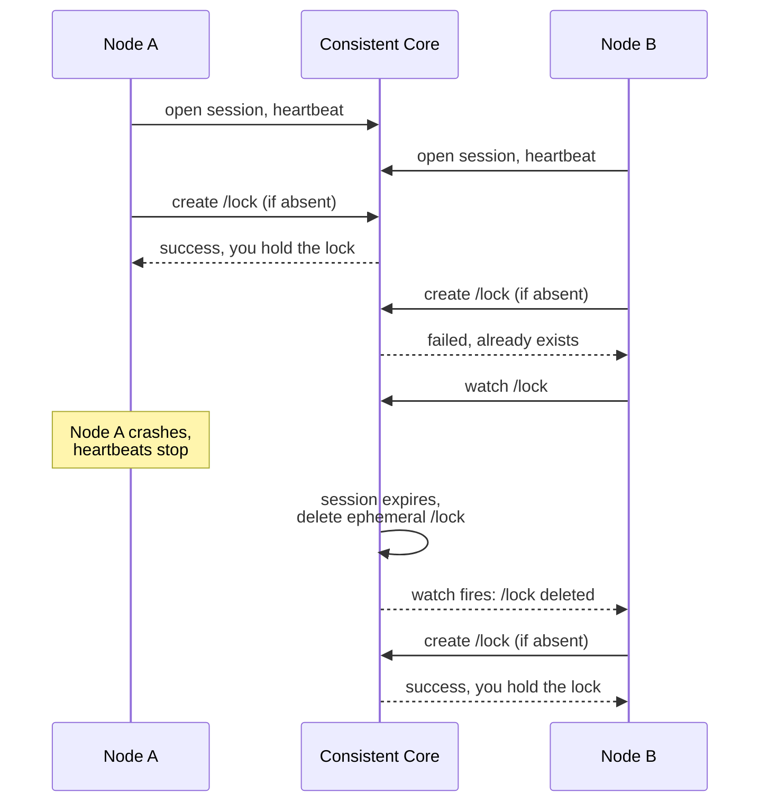

Picture a Kafka deployment with three hundred brokers moving terabytes an hour. Somebody has to answer boring but critical questions. Which broker is the leader for partition 42? Is broker 197 still alive or did it just die? What is the current replication factor? These answers must be exactly right, because two brokers both thinking they lead the same partition is how you lose data.

Now here is the trap. The obvious fix is to run a [consensus algorithm](/distributed-systems/paxos/){:target="_blank" rel="noopener"} so all three hundred brokers agree on those answers. But consensus over three hundred nodes is painfully slow, because every decision needs a majority to vote. You would spend more time agreeing than working.

The **Consistent Core** pattern is the way out. Instead of making the whole cluster agree, you stand up a tiny cluster off to the side, just 3 to 5 nodes, that is strongly consistent and fault tolerant. The big data cluster asks that little cluster the hard questions. Kafka did exactly this with ZooKeeper for a decade. Kubernetes does it with etcd today. This post explains what the pattern is, why it exists, how the core works inside, and how the systems you use every day are built on it.



## <i class="fas fa-question-circle"></i> The Problem: Consensus Does Not Scale With Cluster Size

When a system needs to store more data, you add more servers. That part scales fine. The trouble is the handful of decisions that every clustered system needs to make and get *exactly* right:

- Pick one server to be the leader for a task or a data partition.
- Track group membership, which nodes are up and which have died.
- Map data partitions to the servers that own them.
- Hold configuration that everyone must agree on.
- Grant cluster-wide [locks and leases](/distributed-systems/lease/){:target="_blank" rel="noopener"}.

Every one of these needs **linearizability**: the guarantee that once a value is written, every later read sees that value or something newer, and everyone sees the same order of events. There is no room for "one node thinks broker 5 is the leader, another thinks it is broker 9." That way lies corruption.

The textbook way to get linearizability with fault tolerance is a [majority quorum](/distributed-systems/majority-quorum/){:target="_blank" rel="noopener"} consensus algorithm like [Raft](https://raft.github.io/raft.pdf){:target="_blank" rel="noopener"} or Paxos. A leader proposes each change, and it commits only once a majority of nodes have stored it. That is rock solid on a small cluster. The problem is what happens as the cluster grows.





Every write has to reach a majority. Add more nodes and the majority gets bigger, the leader fans out to more followers, and each decision takes longer. Consensus throughput does not improve as you add nodes; it gets *worse*. So you are stuck between two things you both need: a big cluster for capacity, and strong agreement for correctness. You cannot have both from the same set of nodes.

## <i class="fas fa-cube"></i> The Solution: A Small Strongly Consistent Cluster

The Consistent Core pattern breaks the deadlock by separating the two concerns. From [Unmesh Joshi's Patterns of Distributed Systems](https://martinfowler.com/articles/patterns-of-distributed-systems/consistent-core.html){:target="_blank" rel="noopener"}:

> Maintain a smaller cluster providing stronger consistency to allow the large data cluster to coordinate server activities without implementing quorum-based algorithms.

So you run **two** clusters with two jobs:

1. **The consistent core.** A small group of 3 to 5 nodes running a consensus algorithm. It is linearizable, fault tolerant, and holds only a tiny amount of critical metadata. It is rarely written and never grows.
2. **The data cluster.** As many servers as you need. It does the heavy lifting: storing data, serving reads and writes, running jobs. It leans on the core whenever it needs a decision that must be exactly right.



The insight is that the state that *needs* linearizability is tiny. You do not need consensus over your terabytes of data; you need it over a few kilobytes of "who is in charge of what." So put those few kilobytes on a small, fast, strongly consistent cluster and let everything else scale without that tax.

If you have read about the [Leader and Followers pattern](/distributed-systems/leader-follower/){:target="_blank" rel="noopener"}, this is the other half of the story. That post mentioned two ways to elect a leader: build consensus into the data nodes, or offload it to an "external consistent core." This is that external core, explained in full.

## <i class="fas fa-database"></i> Metadata, Not Data: What Lives in the Core

The single most important rule of this pattern is that the core stores **metadata, not data**. It is a coordination store, not a database for your users. If you put bulk data in it, you drag it back into the exact throughput problem you were escaping.

Here is what belongs in the core and what does not.

| Belongs in the consistent core | Belongs in the data cluster |
|---|---|
| Which node is the leader for a task or partition | The actual rows, documents, messages, files |
| Group membership (who is alive) | High-volume reads and writes |
| Partition-to-server assignments | Large blobs and payloads |
| Cluster configuration and feature flags | Anything written thousands of times a second |
| Distributed locks and [leases](/distributed-systems/lease/){:target="_blank" rel="noopener"} | Per-request application state |

A good gut check: if losing this value even for a second could cause two servers to disagree about who is in charge, it belongs in the core. If it is just more data, keep it out.

This split is the same idea as **control plane versus data plane**. The control plane makes decisions and holds the small, precious state. The data plane moves the bytes. Kubernetes is the cleanest example: etcd is the control plane store, the worker nodes are the data plane, and they scale on completely different curves.

## <i class="fas fa-sitemap"></i> How the Core Works Inside

A consistent core is itself a [Leader and Followers](/distributed-systems/leader-follower/){:target="_blank" rel="noopener"} cluster, built on the patterns you may already know. Peeking inside, you find familiar machinery:

- **A small, odd number of nodes.** Three or five, almost never more. Three nodes tolerate one failure; five tolerate two. You keep it small on purpose, because every extra node slows consensus down, and the core does not need to scale for capacity.
- **State machine replication.** The core keeps a [replicated log](/distributed-systems/replicated-log/){:target="_blank" rel="noopener"} of every change. Each node applies the same log entries in the same order and ends up in the same state. This is how all the nodes agree on the metadata.
- **A single leader.** One node accepts all writes, orders them, and replicates them. A write commits only after a [majority quorum](/distributed-systems/majority-quorum/){:target="_blank" rel="noopener"} has durably stored it, which is what makes the write safe across failures.
- **Automatic failover.** If the core's leader dies, the remaining nodes hold an election, fenced by a [generation clock](/distributed-systems/lamport-clock/){:target="_blank" rel="noopener"} so a revived old leader cannot corrupt anything.

Most cores also persist their log with a [write-ahead log](/distributed-systems/write-ahead-log/){:target="_blank" rel="noopener"} so they survive restarts, and take periodic snapshots so the log does not grow forever. In other words, the core is a small, carefully built application of half a dozen distributed systems patterns, packaged so the rest of your system does not have to reinvent them.





## <i class="fas fa-key"></i> How Clients Talk to the Core

The core would not be very useful if clients had to poll it constantly or manually clean up after crashes. So coordination services expose a small set of primitives that make building on them pleasant. These are the parts you actually use as a developer.

### Sessions and heartbeats

A client opens a **session** with the core and keeps it alive with periodic [heartbeats](/distributed-systems/heartbeat/){:target="_blank" rel="noopener"}. As long as the heartbeats keep coming, the session is valid. If the client crashes or gets partitioned away and the heartbeats stop for longer than a timeout, the core declares the session dead. This is the core's way of knowing who is actually alive, and it is the foundation for everything below.

### Ephemeral keys tied to a session

You can create state that is bound to your session. ZooKeeper calls these **ephemeral znodes**; etcd ties keys to a **lease**. The magic is that when your session expires, the core automatically deletes that state. No cleanup code, no stale entries.

This one primitive gives you group membership almost for free: every node creates an ephemeral key when it joins, and if it dies, its key disappears on its own. Read the list of keys and you have the live membership, always current.

### Watches instead of polling

Rather than hammering the core with "has anything changed yet?", a client registers a **watch** on a key. When the value changes, the core pushes a notification. This keeps coordination cheap and reactions fast. When a leader dies and its ephemeral key vanishes, everyone watching gets told at once and can react in milliseconds.

### Compare-and-swap for locks

The core supports atomic **compare-and-swap** (create-if-absent) operations. That is all you need to build a distributed lock: whoever manages to create the lock key first holds the lock, and everyone else watches it and waits. Combined with sessions, the lock is released automatically if the holder crashes.



That sequence, four short interactions, is a complete, crash-safe leader election. That is the whole appeal of the pattern: the hard parts are solved once, in the core, and everyone else gets to use them as simple calls.

## <i class="fas fa-random"></i> The Subtle Part: Linearizable Reads

Writes to the core are straightforward. They go through the leader and commit on a majority, so they are safe. Reads are where people get surprised.

Say a data node asks a core node, "who is the leader for partition 42?" If that core node is a **follower**, it might be slightly behind the leader and hand back a stale answer. Worse, the node it asks might be a leader that got partitioned away and does not yet know it has been replaced, a *zombie leader*. Either way you get an answer that is wrong in a way that can cause two nodes to both think they are in charge.

Linearizable reads solve this, and there are two common techniques:

- **Leader lease.** The leader holds a time-bound [lease](/distributed-systems/lease/){:target="_blank" rel="noopener"}. As long as the lease is valid, it knows no other leader can exist, so it can answer reads directly from memory. This is fast but relies on bounded clock drift.
- **ReadIndex / quorum check.** Before answering a read, the leader confirms with a majority that it is still the leader. This adds a round trip but does not depend on clocks. Raft's ReadIndex works this way.

Many cores let you choose per read. etcd, for example, serves **linearizable** reads by default (routed through the leader with a quorum check) but also offers cheaper **serializable** reads straight from any member when you can tolerate slight staleness. The tradeoff is the usual one: strictly correct and a touch slower, or fast and occasionally stale. For metadata that decides who is in charge, pay for linearizable. For a rough dashboard, serializable is fine.



## <i class="fas fa-code"></i> A Minimal Consistent-Core Client

You rarely build the core, but you write clients against it all the time. Here is leader election for a data cluster, expressed against a generic core client. The shape is the same whether the core is ZooKeeper, etcd, or Consul.

```python
class DataNode:
    def __init__(self, node_id, core):
        self.id = node_id
        self.core = core          # client to the consistent core
        self.session = core.open_session(ttl=10)  # heartbeated in background
        self.is_leader = False

    def campaign(self):
        # Try to become leader by creating an ephemeral, session-bound key.
        # Compare-and-swap: only succeeds if the key does not exist.
        won = self.core.create(
            key="/service/leader",
            value=self.id,
            ephemeral=True,          # vanishes if our session dies
            session=self.session,
        )
        if won:
            self.is_leader = True
            self.fence_token = self.core.version_of("/service/leader")
            return

        # Someone else leads. Watch the key and wait for our turn.
        self.core.watch("/service/leader", on_change=self.campaign)

    def do_leader_work(self, request):
        if not self.is_leader:
            raise NotLeader()
        # Pass the fence token so a stale leader's writes get rejected.
        storage.write(request, fence=self.fence_token)
```

Three details carry the safety of the whole thing:

1. **`ephemeral=True`** ties leadership to a live session. If this node crashes, the core deletes the key and someone else can win. No manual cleanup, no stuck leadership.
2. **The watch** means every other node reacts the instant the leader changes, rather than polling.
3. **`fence_token`** is the [lease fencing token](/distributed-systems/lease/){:target="_blank" rel="noopener"}. The core hands out a number that increases every time leadership changes. Downstream storage rejects writes carrying an old token, so a paused-then-revived old leader cannot corrupt state. Without fencing, a consistent core still leaves you exposed to zombie writers. This is the most commonly missed step.

## <i class="fas fa-server"></i> The Pattern in Real Systems

Once you see the shape, you find it everywhere. Most consistent cores fall into two groups: the ones that *are* a consistent core you can run, and the systems that *use* one.

### The cores you run: ZooKeeper, etcd, Consul

[Apache ZooKeeper](https://zookeeper.apache.org/){:target="_blank" rel="noopener"} is the original. A small ensemble runs the ZAB protocol to provide a linearizable, hierarchical key-value store with sessions, ephemeral znodes, and watches. It grew out of Google's [Chubby lock service](https://research.google/pubs/the-chubby-lock-service-for-loosely-coupled-distributed-systems/){:target="_blank" rel="noopener"}, which pioneered this exact idea.

[etcd](https://etcd.io/docs/){:target="_blank" rel="noopener"} is the modern favorite. It runs [Raft](https://raft.github.io/raft.pdf){:target="_blank" rel="noopener"}, exposes a flat key-value API with leases and watches, and is the store behind Kubernetes. [HashiCorp Consul](https://developer.hashicorp.com/consul/docs/architecture){:target="_blank" rel="noopener"} also uses Raft and adds service discovery and health checking on top.



### The systems that use a core

- **Apache Kafka.** For over a decade Kafka used ZooKeeper as its consistent core for broker membership, controller election, and partition leadership. Modern Kafka replaced the external core with [KRaft](https://kafka.apache.org/documentation/#kraft){:target="_blank" rel="noopener"}, its own built-in Raft-based metadata quorum, but the pattern is unchanged: a small consensus group manages metadata while brokers scale independently. Our [how Kafka works](/distributed-systems/how-kafka-works/){:target="_blank" rel="noopener"} post digs into this.
- **Kubernetes.** The control plane stores all cluster state in [etcd](https://etcd.io/docs/){:target="_blank" rel="noopener"}. Worker nodes, pods, and services are the data plane and scale to thousands, while etcd stays a small 3 or 5 node core. See our [Kubernetes architecture](/devops/kubernetes-architecture/){:target="_blank" rel="noopener"} guide.
- **HBase and HDFS.** HBase uses ZooKeeper to track the active master and region servers. HDFS uses ZooKeeper (via ZKFC) to elect the active NameNode in a high-availability setup.
- **CockroachDB and TiKV.** These separate metadata from data. TiKV's **Placement Driver** is a Raft-based consistent core that tracks where every data range lives, while the data ranges themselves scale out. It is the pattern named almost literally.
- **Google Spanner.** Uses Paxos groups and a placement layer to keep metadata and schema strongly consistent while data reads and writes scale, as covered in [how Google Ads scales with Spanner](/how-google-ads-scales-with-spanner/){:target="_blank" rel="noopener"}.

| System | Consistent core | Consensus | What the core decides |
|---|---|---|---|
| Kafka (modern) | KRaft metadata quorum | Raft | Broker membership, partition leaders |
| Kafka (legacy) | ZooKeeper | ZAB | Controller election, config |
| Kubernetes | etcd | Raft | All cluster state, leader leases |
| HBase / HDFS | ZooKeeper | ZAB | Active master / NameNode election |
| TiKV | Placement Driver | Raft | Range-to-server mapping |
| Consul users | Consul servers | Raft | Service discovery, locks |

The trend worth noticing: Kafka moved from an *external* core (ZooKeeper) to a *built-in* one (KRaft). Both are the same pattern. The choice is whether you run a separate coordination service or embed the consensus group in your own product. Fewer moving parts usually wins over time, but only after the built-in version is truly battle tested.

## <i class="fas fa-balance-scale"></i> Trade-offs and When to Skip It

The pattern is powerful but not free.

**What you gain:** the data cluster scales without a consensus tax on every request, coordination logic lives in one well-tested place, and the small core is cheap to keep highly available.

**What it costs:**

- **Another system to operate.** ZooKeeper or etcd is one more thing to deploy, monitor, back up, and upgrade. It needs its own [observability](/opentelemetry-production-guide/){:target="_blank" rel="noopener"} and care.
- **A coordination dependency.** If the core is unavailable, the data cluster cannot make *new* decisions. Well-designed systems keep serving existing traffic by caching metadata locally and using watches, so a brief core hiccup does not take everything down, but new leader elections and membership changes stall.
- **An extra network hop.** Coordination now involves a round trip to the core. That is why you cache aggressively and never put the core on the hot path of every request.

Skip the pattern when:

- Your cluster is a single node or a small fixed set that never changes. Plain configuration is simpler.
- You are tempted to store bulk data in the core. Do not; it is for metadata only.
- Your framework already gives you one. If you are on Kubernetes, you already have etcd. Do not stand up a second ZooKeeper for the same job.

## <i class="fas fa-exclamation-triangle"></i> Mistakes Teams Make

### Treating the core as a general database

The most common abuse. Someone notices the core is "strongly consistent and always up" and starts storing application data in it. Writes go through consensus and the whole dataset must fit in memory across a tiny cluster, so this collapses fast. Keep the core small. Kilobytes of metadata, not gigabytes of data.

### Reading from a follower and trusting it

Serving metadata reads from any core node is fast, but a follower can lag. If that metadata decides who is the leader, a stale read can produce two active leaders. Use linearizable reads for anything correctness-critical, and save the cheaper serializable reads for data you can afford to see slightly late.

### Forgetting the fencing token

A consistent core tells you who *should* be the leader, but it cannot stop a process that paused (a long GC, a slow disk) from waking up and acting on old authority. You still need a [fencing token](/distributed-systems/lease/){:target="_blank" rel="noopener"} that downstream systems check, so a revived old leader's writes are rejected. A core without fencing at the edges is a split-brain bug with a delay timer.

### Running an even number of core nodes

A four node core tolerates the same single failure as a three node one but is more likely to deadlock in an election. Always run an **odd** number, and spread them across failure domains (availability zones) so one rack or one zone going down cannot take a majority with it.

### Making the data plane hard-depend on the core

If every data request first calls the core, the core becomes your bottleneck and your single point of failure. Cache the metadata locally, refresh it with watches, and design the data plane to keep serving reads and in-flight work even when the core is briefly unreachable.

## <i class="fas fa-tasks"></i> Key Takeaways for Developers

1. **Consensus does not scale with node count.** Every write needs a majority, so a big cluster spends its time agreeing. Keep consensus on a small fixed group.
2. **Split consistency from capacity.** A tiny consistent core holds the state that must be linearizable; a large data cluster does the bulk work and scales freely.
3. **The core stores metadata, not data.** Leaders, membership, config, locks. If it is just more data, keep it out.
4. **Sessions, ephemeral keys, and watches do the heavy lifting.** They give you crash-safe membership and leader election with almost no code.
5. **Linearizable reads need care.** Route correctness-critical reads through the leader with a lease or quorum check; use cheap reads only where staleness is acceptable.
6. **Always fence.** The core says who leads; a fencing token stops a zombie leader from acting. You need both.
7. **Do not build your own.** Run etcd, ZooKeeper, or Consul, or embed a proven Raft library. Hand-rolled coordination is where rare, expensive data-loss bugs live.

## <i class="fas fa-flag-checkered"></i> Wrapping Up

The Consistent Core pattern is a lesson in doing less, more carefully. You cannot make a three hundred node cluster agree on every decision quickly, so you stop trying. Instead you carve out the small slice of state that truly must be consistent, put it on a tight cluster of three or five nodes that runs real consensus, and let everything else scale without that weight.

That single move, separating the control plane from the data plane, is behind a huge amount of the infrastructure you rely on. ZooKeeper and etcd exist to be that core. Kafka, Kubernetes, HBase, and CockroachDB are built on the idea. Once you can name the pattern, you will spot it in almost every large system you open up, and you will understand why that small, unglamorous cluster of coordination nodes is the thing quietly keeping the whole show honest.

---

**Related posts:**

- [Leader and Followers Pattern](/distributed-systems/leader-follower/){:target="_blank" rel="noopener"} - The pattern a consistent core runs internally, and the thing it most often elects
- [Lease in Distributed Systems](/distributed-systems/lease/){:target="_blank" rel="noopener"} - Time-bound ownership and fencing tokens, the primitive the core hands out
- [Majority Quorum](/distributed-systems/majority-quorum/){:target="_blank" rel="noopener"} - Why the core needs an odd number of nodes and a majority to commit
- [Replicated Log](/distributed-systems/replicated-log/){:target="_blank" rel="noopener"} - The ordered log that keeps every core node in the same state
- [Paxos Explained](/distributed-systems/paxos/){:target="_blank" rel="noopener"} - The consensus algorithm family that powers many cores
- [Heartbeat in Distributed Systems](/distributed-systems/heartbeat/){:target="_blank" rel="noopener"} - How sessions detect a dead client
- [How Kafka Works](/distributed-systems/how-kafka-works/){:target="_blank" rel="noopener"} - A consistent core (ZooKeeper, then KRaft) in production
- [Kubernetes Architecture](/devops/kubernetes-architecture/){:target="_blank" rel="noopener"} - etcd as the control plane's consistent core

*Further reading: Unmesh Joshi's [Consistent Core chapter](https://martinfowler.com/articles/patterns-of-distributed-systems/consistent-core.html){:target="_blank" rel="noopener"} in Patterns of Distributed Systems; the [ZooKeeper paper](https://www.usenix.org/legacy/event/atc10/tech/full_papers/Hunt.pdf){:target="_blank" rel="noopener"}; Google's [Chubby lock service paper](https://research.google/pubs/the-chubby-lock-service-for-loosely-coupled-distributed-systems/){:target="_blank" rel="noopener"}; the [Raft paper](https://raft.github.io/raft.pdf){:target="_blank" rel="noopener"}; and the [etcd documentation](https://etcd.io/docs/){:target="_blank" rel="noopener"}.*
