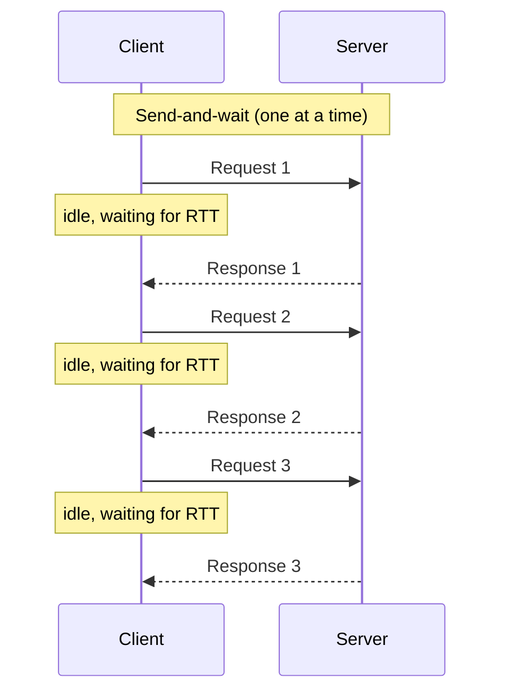
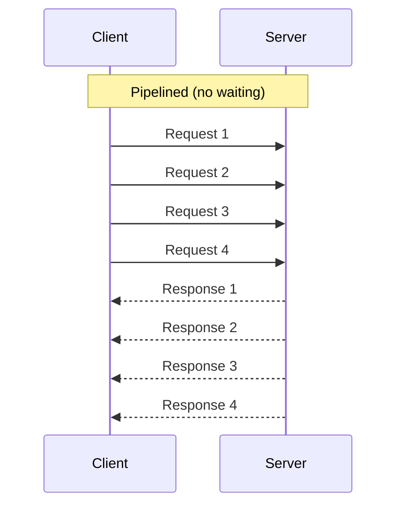
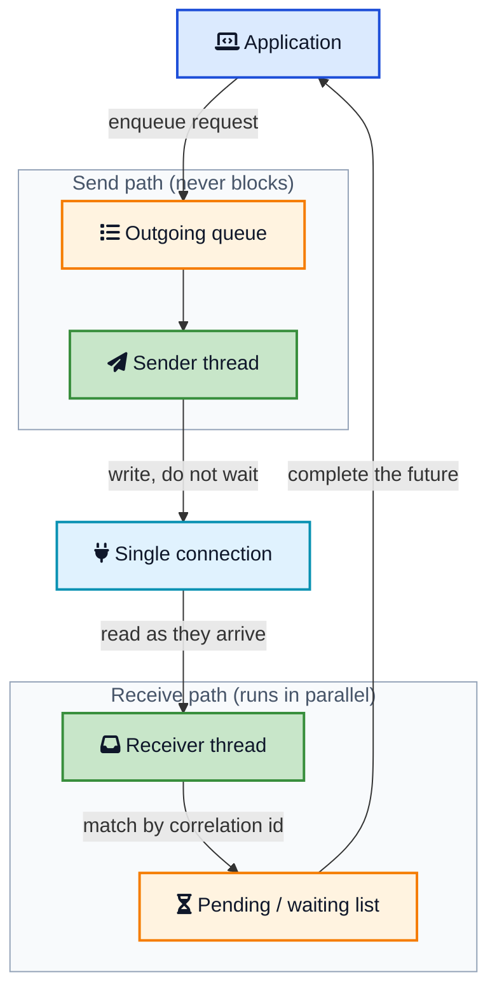
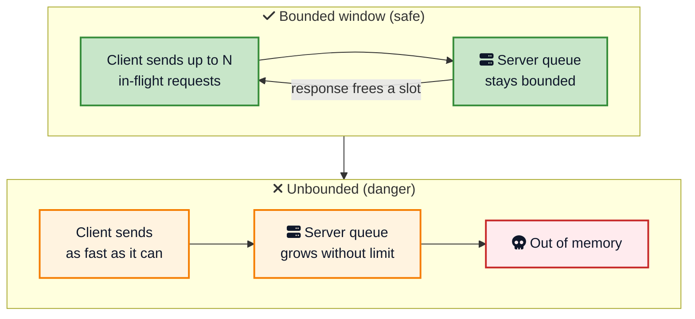
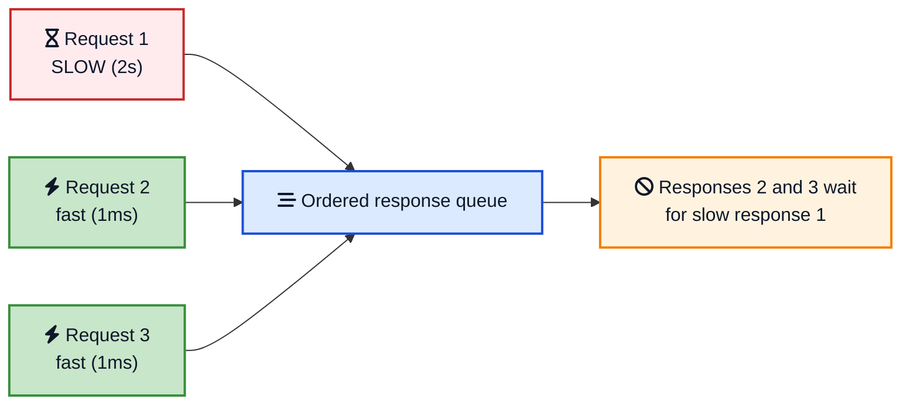

Here is a small experiment that surprises a lot of engineers. Write a loop that sends 10,000 tiny requests to a Redis server one after another, waiting for each reply before sending the next. Time it. Now send the same 10,000 requests without waiting, reading the replies at the end. On a normal network the second version is not a little faster, it is often ten to a hundred times faster. Nothing about the work changed. The only difference is the waiting.

That waiting is the hidden tax on almost every networked system. When a client sends a request and blocks until the response comes back, the slow part is rarely the server doing its job. It is the round trip across the network. Do that once per request and the [round-trip time](https://en.wikipedia.org/wiki/Round-trip_delay){:target="_blank" rel="noopener"} (RTT) becomes the ceiling on how fast you can go, no matter how quick the server is.

The **Request Pipeline** pattern is the fix, and it is one of the highest-leverage ideas in distributed systems. Instead of send, wait, receive, repeat, you keep sending requests while earlier ones are still in flight. This post covers what the pattern is, why it works, how to build it correctly with two threads and flow control, the head-of-line blocking trap that bites everyone, and how HTTP/2, Redis, Kafka, and PostgreSQL all lean on it.



## <i class="fas fa-hourglass-half"></i> The Problem: Waiting Wastes the Wire

Imagine two servers in a cluster talking over a single connection, using something like the Single Socket Channel pattern to keep one ordered link between them. The simplest way to use that connection is the request-response loop everyone writes first:

1. Send request 1.
2. Wait for response 1.
3. Send request 2.
4. Wait for response 2, and so on.

It is easy to reason about and it is correct. It is also slow in a way that has nothing to do with your code. Every request pays a full round trip before the next one can even start. If the RTT between the two nodes is 1 millisecond, and you have 1,000 requests to send, you spend **about a full second just waiting**, even if the server handles each request in a few microseconds.





Look at what sits idle in that diagram. While the client waits, it is doing nothing. The network link is empty in both directions between messages. And the server, which could be chewing through a queue of work, has an empty queue because only one request is ever outstanding. Everyone is blocked on one thing: the speed of light and the switches in between.

This matters most in exactly the places you care about performance. A [replicated log](/distributed-systems/replicated-log/){:target="_blank" rel="noopener"} leader shipping entries to followers, a database client running thousands of small writes, a cache client reading many keys. In all of them the per-request work is tiny and the round trip dominates. If the server can accept more work while it is still processing, as it can when a [Singular Update Queue](/role-of-queues-in-system-design/){:target="_blank" rel="noopener"} sits behind it, then sending one request at a time leaves most of the server's capacity on the floor.

## <i class="fas fa-stream"></i> The Solution: Send Without Waiting

The Request Pipeline pattern states the fix plainly:

> Improve latency by sending multiple requests on the connection without waiting for the response of the previous requests.

Instead of blocking after each request, the client keeps firing requests down the connection. Responses come back whenever the server finishes them, and a separate part of the client picks them up. The connection stays busy, the server's queue stays full, and the total time collapses from N round trips toward roughly one.



The gap between the two diagrams is the whole point. Same requests, same server, but the requests now travel as a continuous stream. The client pays the round trip once, at the start, rather than once per request. Everything after that overlaps.

There is a neat mental model here: a network connection is a pipe with both **bandwidth** (how wide the pipe is) and **latency** (how long the pipe is). Send-and-wait only ever puts one item in a long pipe at a time, so the pipe is almost always empty. Pipelining fills the pipe. The amount of data you can have in flight before you must wait is the classic [bandwidth-delay product](https://en.wikipedia.org/wiki/Bandwidth-delay_product){:target="_blank" rel="noopener"}, and pipelining is how you actually use it.

## <i class="fas fa-code-branch"></i> How to Build It: Two Threads and a Waiting List

You cannot pipeline with a single thread that does `send()` then `receive()`, because the `receive()` blocks and you are back to waiting. The clean design, and the one the pattern describes, splits the work across **two threads that never block each other**:

- A **sender thread** takes requests off an outgoing queue and writes them to the socket. It never waits for a response.
- A **receiver thread** reads responses off the socket as they arrive and completes the matching pending request.





Because the sender and receiver run independently, requests keep flowing out while responses flow in. The piece that ties them together is a **correlation ID**: every request carries a unique number, and the client keeps a map of "requests I have sent but not yet heard back about." When a response arrives, the receiver reads its correlation ID, looks up the pending request, and hands back the result (completes the future, fires the callback, unblocks the caller).

Here is the shape of it in Python-flavoured pseudocode, kept small so the structure is clear.

```python
class PipelinedConnection:
    def __init__(self, socket):
        self.socket = socket
        self.next_id = itertools.count()
        self.pending = {}                 # correlation_id -> Future
        self.inflight = threading.Semaphore(MAX_INFLIGHT)  # flow control
        threading.Thread(target=self._read_loop, daemon=True).start()

    def send(self, request):
        self.inflight.acquire()           # block if too many are in flight
        cid = next(self.next_id)
        future = Future()
        self.pending[cid] = future
        # sender does not wait for a response, it just writes and returns
        self.socket.write(encode(cid, request))
        return future                     # caller can await this later

    def _read_loop(self):
        while True:
            cid, response = decode(self.socket.read())
            future = self.pending.pop(cid)
            self.inflight.release()        # a slot frees up
            future.set_result(response)    # wake up whoever was waiting
```

Notice that `send()` returns a `future` immediately instead of a response. The caller can send many requests in a row, collecting futures, and only wait at the end. That is what turns N round trips into one. The receiver thread, running separately, is the only thing that ever reads the socket.

## <i class="fas fa-tachometer-alt"></i> The Non-Negotiable Part: Flow Control

If you take one thing from this post, take this: **a pipeline without flow control is a denial-of-service attack on your own server**. If the client can send as fast as it likes, and the server is slower than the client, then unacknowledged requests pile up. They pile up in the network buffers, in the server's receive queue, and in the server's memory. Eventually the server runs out of memory and falls over, and you have turned a performance optimization into an outage.

The fix is **back pressure**: cap the number of requests that can be in flight at once. That is the `MAX_INFLIGHT` semaphore in the code above. The client is allowed to have, say, 100 unacknowledged requests outstanding. When it hits the limit, `send()` blocks until a response comes back and frees a slot. This lets a fast sender automatically match the pace of a slower receiver.



This is not a niche concern; it is built into the protocols you already use. TCP has a **receive window** that tells the sender how much unacknowledged data the receiver can buffer, which is flow control at the byte level. [HTTP/2](https://www.rfc-editor.org/rfc/rfc9113.html){:target="_blank" rel="noopener"} adds its own flow-control windows per stream and per connection on top. Kafka's `max.in.flight.requests.per.connection` is the same idea with a different name. Whenever you see a "max in flight" or "window size" knob, you are looking at flow control for a pipeline.

The right window size is a balance. Too small and you are back toward send-and-wait, leaving throughput on the table. Too large and you buffer huge amounts of data, hurt tail latency, and risk overload. A good starting point is the bandwidth-delay product: enough in-flight requests to keep the pipe full, and no more.

## <i class="fas fa-sort"></i> The Ordering Trap: Responses Come Back Out of Order

Send-and-wait has one quiet luxury: responses arrive in the exact order you sent requests, because there is only ever one outstanding. Pipelining gives that up. Once several requests are in flight, the server may finish them in a different order, or return errors for some and successes for others. Your client has to cope.

There are two ways systems handle this, and the difference matters:

- **Ordered responses (in-order pipeline).** The protocol guarantees responses come back in request order. Redis works this way: it processes commands on a connection in order, so the client can simply read replies in the same sequence it sent commands. Simple, but it invites head-of-line blocking, which is the next section.
- **Correlated responses (out-of-order pipeline).** Each request carries a correlation ID and each response echoes it. The client matches replies to pending requests regardless of arrival order. This is what HTTP/2 streams and most RPC frameworks do, and it is what the two-thread design above assumes.

The out-of-order approach is more flexible but adds a real hazard when you mix in **retries**. Suppose you allow five requests in flight, request 1 fails and gets retried, but requests 2 through 5 already succeeded. Now request 1's retry lands *after* them, and if these were writes, you have silently reordered operations. This is not hypothetical. It is precisely the Kafka producer gotcha we will see below, and the reason ordering plus retries is where careful teams slow down and think.

## <i class="fas fa-traffic-light"></i> Head-of-Line Blocking: The Famous HTTP Pipelining Failure

Here is the trap that sank the most famous attempt at pipelining. If a connection guarantees responses in order, then **one slow request stalls every response behind it**, even requests that already finished. The fast responses are stuck in line behind the slow one. This is called [**head-of-line (HOL) blocking**](/glossary/head-of-line-blocking/){:target="_blank" rel="noopener"}, and it is the single biggest reason naive pipelining disappoints.





[HTTP/1.1 pipelining](https://en.wikipedia.org/wiki/HTTP_pipelining){:target="_blank" rel="noopener"} was supposed to speed up the web this exact way: send several requests on one connection without waiting. It failed in practice. Responses had to come back in order, so one slow response (a big image, a slow backend) blocked everything queued behind it. Buggy proxies made it worse. Browsers ended up shipping it disabled, and instead opened many parallel connections to work around the limit.

The real fix arrived with **HTTP/2**, and it is a beautiful application of the correlated-response idea. HTTP/2 **multiplexes** many independent **streams** over a single TCP connection. Each stream has its own ID (a correlation ID by another name), so responses can interleave and arrive in any order without blocking each other at the application layer. One slow response no longer holds up the fast ones.

But there was still a subtler layer of HOL blocking underneath. Because HTTP/2 runs over TCP, which is a single ordered byte stream, a lost packet forces TCP to wait for the retransmission before delivering *any* later bytes, stalling all streams at once. [HTTP/3](https://www.rfc-editor.org/rfc/rfc9114.html){:target="_blank" rel="noopener"} solves this by running over [QUIC](/glossary/quic/){:target="_blank" rel="noopener"}, which gives each stream its own independent delivery, so a lost packet only stalls its own stream. The progression from HTTP/1.1 to HTTP/2 to HTTP/3 is really the story of chasing head-of-line blocking out of pipelining, one layer at a time.

## <i class="fas fa-server"></i> The Pattern in Real Systems

Once you can name it, you see request pipelining everywhere performance matters over a network.

### Redis pipelining

[Redis pipelining](https://redis.io/docs/latest/develop/use/pipelining/){:target="_blank" rel="noopener"} is the textbook example. Normally a client sends a command, waits for the reply, then sends the next. With pipelining, the client writes many commands at once and reads the replies together:

```python
# Slow: one round trip per command
for i in range(1000):
    r.set(f"key:{i}", i)          # send, wait, repeat -> 1000 round trips

# Fast: one pipeline, roughly one round trip
pipe = r.pipeline(transaction=False)
for i in range(1000):
    pipe.set(f"key:{i}", i)       # queued locally, nothing sent yet
results = pipe.execute()          # all commands flushed, all replies read
```

Redis processes the commands in order on the connection, so replies come back in order and matching is trivial. The [Redis docs](https://redis.io/docs/latest/develop/use/pipelining/){:target="_blank" rel="noopener"} show this can improve throughput by an order of magnitude, because you have removed the per-command round trip. Note this is not the same as a `MULTI`/`EXEC` transaction: pipelining is only about not waiting for each reply, not about atomicity.

### Kafka producer in-flight requests

The Kafka producer pipelines produce requests to each broker. The knob is [`max.in.flight.requests.per.connection`](https://kafka.apache.org/documentation/#producerconfigs_max.in.flight.requests.per.connection){:target="_blank" rel="noopener"}, which defaults to 5. It is literally the size of the in-flight window from the flow-control section: how many unacknowledged produce requests the producer will send before it must wait.

```properties
# Pipeline up to 5 produce requests per broker connection
max.in.flight.requests.per.connection=5
enable.idempotence=true
acks=all
```

This is where the ordering trap becomes concrete. With more than one request in flight and retries enabled, a failed-then-retried batch can land after a later batch that already succeeded, reordering your records. Older advice was to set the window to 1 if you needed strict order. Modern Kafka solves it better: turning on [idempotence](/distributed-systems/idempotent-receiver/){:target="_blank" rel="noopener"} (the default now) lets the broker keep records in order and drop duplicates even with up to 5 in-flight requests, so you get pipelining *and* ordering. If you want the deeper mechanics, see [how Kafka works](/distributed-systems/how-kafka-works/){:target="_blank" rel="noopener"} and the [idempotent receiver](/distributed-systems/idempotent-receiver/){:target="_blank" rel="noopener"} pattern.

### PostgreSQL pipeline mode

Databases suffer badly from round-trip latency because applications fire many small statements. [PostgreSQL's pipeline mode](https://www.postgresql.org/docs/current/libpq-pipeline-mode.html){:target="_blank" rel="noopener"} (added in libpq 14) lets a client send a batch of queries without waiting for each result, then read the results afterward. For a client that is far from the database, or that runs many small `INSERT`s, this can be a large win because the RTT was the bottleneck, not the database. The same idea appears as pipelining in the MySQL X Protocol and in many ORMs that batch statements under the hood.

### RPC frameworks and consensus

Any serious RPC layer pipelines. [gRPC](/rest-vs-graphql-vs-grpc/){:target="_blank" rel="noopener"} rides on HTTP/2 streams, so it inherits multiplexed, out-of-order pipelining for free. Consensus systems care too: a [Raft](/distributed-systems/paxos/){:target="_blank" rel="noopener"} or [replicated log](/distributed-systems/replicated-log/){:target="_blank" rel="noopener"} leader that shipped one `AppendEntries` at a time and waited for each follower's reply would be crippled by RTT. Instead the leader pipelines entries to followers, keeping many in flight and using the log index as the correlation and ordering key. The [leader and followers](/distributed-systems/leader-follower/){:target="_blank" rel="noopener"} pattern quietly depends on this to hit real throughput.

| System | What is pipelined | In-flight control | Response ordering |
|---|---|---|---|
| Redis pipelining | Client commands | Client-side batch size | In order (single connection) |
| HTTP/2 | Requests as streams | Per-stream + per-connection windows | Out of order, by stream ID |
| Kafka producer | Produce requests | `max.in.flight.requests.per.connection` | In order via idempotence |
| PostgreSQL pipeline mode | SQL statements | Application-managed batch | In order |
| Raft / replicated log | AppendEntries | Leader's in-flight window | By log index |

## <i class="fas fa-balance-scale"></i> Trade-offs and When to Skip It

Pipelining is close to free performance, but it is not literally free.

**What you gain:** latency drops from N round trips toward one, throughput rises because the server's queue stays full, and you use the network's bandwidth-delay product instead of leaving the pipe empty. For chatty, small-request workloads over any real network, the gain is often enormous.

**What it costs:**

- **Complexity.** Two threads, a correlation map, and a pending/waiting list are more moving parts than a blocking call. Getting the completion and error paths right takes care.
- **Flow control is mandatory.** Skip it and a fast client can OOM a slow server. This is not optional.
- **Ordering under retries is subtle.** If order matters and you retry, you need idempotence or sequence tracking, or you will silently reorder writes.
- **Head-of-line blocking.** In-order pipelines let one slow request stall the rest. You need stream multiplexing to avoid it.
- **Error handling spreads out.** A connection drop can lose *many* in-flight requests at once, so your retry logic has to resend everything that was outstanding, not just one request.

Skip or limit pipelining when:

- The workload is naturally request-then-think, where the client cannot produce the next request until it sees the previous response. There is nothing to overlap.
- Requests are large and few. The round trip is not your bottleneck; bandwidth is, and pipelining buys little.
- Strict global ordering is required and you cannot make operations idempotent. Sometimes a small in-flight window (even 1) is the honest choice.

## <i class="fas fa-exclamation-triangle"></i> Mistakes Teams Make

### Pipelining with no in-flight limit

The classic. Someone removes the wait, sees a huge speedup in a benchmark, and ships it. Then a slow consumer or a network hiccup lets millions of requests queue up and the receiver runs out of memory. Always bound the in-flight window.

### Assuming responses arrive in request order

If you built an out-of-order pipeline (correlation IDs) but then wrote client code that reads replies positionally, you will hand response 3 to the caller waiting on response 1. Match strictly by correlation ID, never by arrival position, unless the protocol truly guarantees order.

### Retrying one request and reordering the rest

With multiple writes in flight, retrying a failed one moves it behind requests that already landed. For anything order-sensitive, pair pipelining with an [idempotent receiver](/distributed-systems/idempotent-receiver/){:target="_blank" rel="noopener"} and sequence numbers, exactly as Kafka does, or drop the in-flight count to 1 for that stream.

### Forgetting the whole window is lost on a disconnect

When the connection dies, every in-flight request dies with it, not just the current one. Your recovery code must track all pending requests and resend them on reconnect. Teams that only handle "the one request I was waiting on" lose data on failover.

### Confusing pipelining with batching

They are cousins, not twins. Batching merges many operations into one message; pipelining sends many messages without waiting. Batching needs all items up front and gives one combined result. Reach for batching when you can group work and want to cut per-message overhead, and pipelining when requests trickle in but you still want to avoid per-request round trips. The strongest systems use both: pipeline a series of batches.

## <i class="fas fa-tasks"></i> Key Takeaways for Developers

1. **The round trip is the enemy.** Send-and-wait pays one RTT per request, so latency is dominated by the network, not the server. Pipelining removes that per-request wait.
2. **Send without blocking.** Keep firing requests while earlier ones are in flight, and total time drops from N round trips toward one.
3. **Use two threads and a correlation ID.** A sender that never waits, a receiver that matches responses to pending requests by ID. That is the whole engine.
4. **Flow control is not optional.** Cap in-flight requests so a fast client cannot overwhelm a slow server. Every real protocol does this.
5. **Mind the ordering.** Out-of-order responses plus retries can reorder writes. Use idempotence and sequence numbers, or shrink the window.
6. **Watch for head-of-line blocking.** In-order pipelines stall on one slow request. Stream multiplexing (HTTP/2) and per-stream delivery (HTTP/3) are the escape.
7. **You already use it.** Redis, HTTP/2, Kafka, PostgreSQL, and every consensus leader pipeline requests. Learn the pattern once and you understand all of them.

## <i class="fas fa-flag-checkered"></i> Wrapping Up

The Request Pipeline pattern is a reminder that in distributed systems, doing nothing is expensive. A client that waits for each response before sending the next spends most of its life idle, held hostage by the round trip. The fix is not a faster network or a faster server; it is simply refusing to wait. Keep the connection full, keep the server's queue busy, and let responses catch up on their own schedule.

The mechanics are small: a sender thread, a receiver thread, a correlation ID to match them, and a bounded window so you do not overwhelm the other side. The wisdom is in the details, the flow control that protects the server, the correlation that untangles out-of-order replies, and the care around ordering and retries that keeps your data correct. Get those right and you unlock the difference between a system that crawls and one that flies, which is exactly why Redis, HTTP/2, Kafka, and every consensus engine reach for this pattern by default.

---

**Related posts:**

- [Idempotent Receiver Pattern](/distributed-systems/idempotent-receiver/){:target="_blank" rel="noopener"} - How to keep pipelined retries from duplicating or reordering writes
- [Replicated Log](/distributed-systems/replicated-log/){:target="_blank" rel="noopener"} - A consensus leader pipelines entries to followers to hit throughput
- [Leader and Followers Pattern](/distributed-systems/leader-follower/){:target="_blank" rel="noopener"} - The replication flow that depends on pipelined requests
- [How Kafka Works](/distributed-systems/how-kafka-works/){:target="_blank" rel="noopener"} - Where max.in.flight.requests.per.connection lives in production
- [Role of Queues in System Design](/role-of-queues-in-system-design/){:target="_blank" rel="noopener"} - The server-side queue a pipeline keeps full
- [REST vs GraphQL vs gRPC](/rest-vs-graphql-vs-grpc/){:target="_blank" rel="noopener"} - gRPC inherits HTTP/2 multiplexed pipelining
- [How WebTransport Works](/how-webtransport-works/){:target="_blank" rel="noopener"} - QUIC and HTTP/3, which kill transport-layer head-of-line blocking

*Further reading: Unmesh Joshi's [Request Pipeline chapter](https://martinfowler.com/articles/patterns-of-distributed-systems/request-pipeline.html){:target="_blank" rel="noopener"} in Patterns of Distributed Systems; the [Redis pipelining guide](https://redis.io/docs/latest/develop/use/pipelining/){:target="_blank" rel="noopener"}; the [HTTP/2 specification (RFC 9113)](https://www.rfc-editor.org/rfc/rfc9113.html){:target="_blank" rel="noopener"}; the [Kafka producer configuration docs](https://kafka.apache.org/documentation/#producerconfigs_max.in.flight.requests.per.connection){:target="_blank" rel="noopener"}; and [PostgreSQL's pipeline mode documentation](https://www.postgresql.org/docs/current/libpq-pipeline-mode.html){:target="_blank" rel="noopener"}.*
