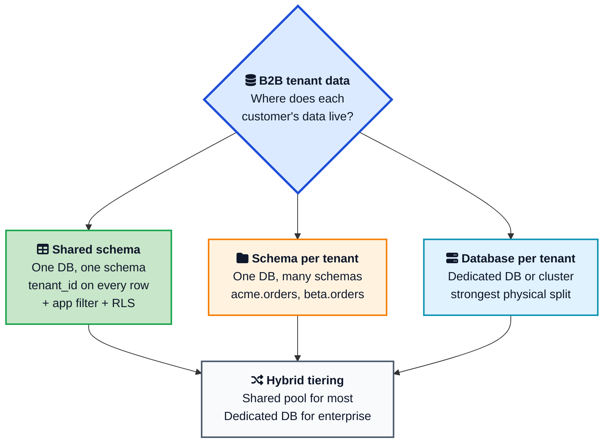
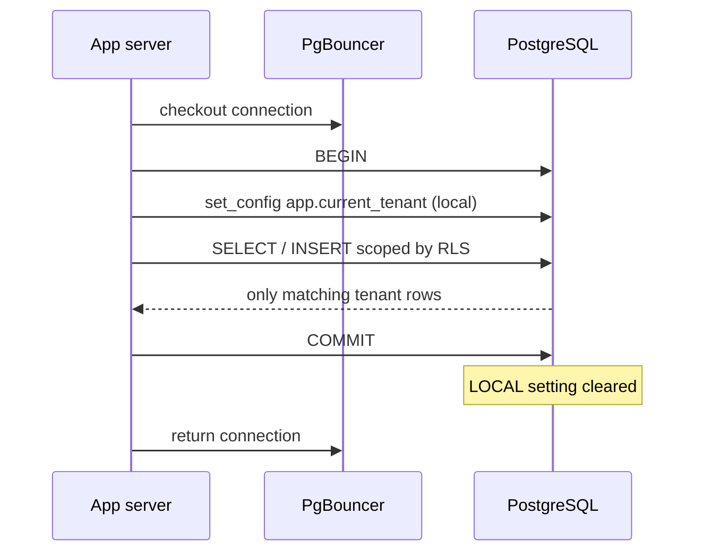
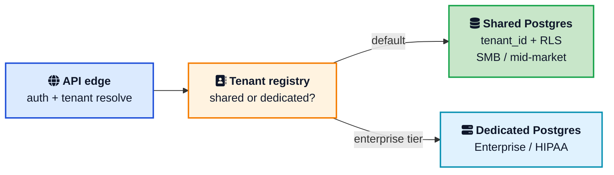

Your first enterprise prospect asks a simple question on the security call: "Can another customer ever see our data?" If your answer is "our queries always filter by tenant," you are one forgotten `WHERE` clause away from a career-defining incident.

**Database isolation** for **B2B multi-tenant SaaS** is not a checkbox. It is how you store, query, back up, restore, and delete customer data when hundreds or thousands of companies share the same product. Get it right early and you ship features. Get it wrong and you spend a year migrating the data layer while sales waits on enterprise deals.

This post walks through the three classic isolation models, when each one fits, how **PostgreSQL [Row Level Security (RLS)](/glossary/row-level-security/)**{:target="_blank" rel="noopener"} fits into a shared schema design, and the operational details that actually stop leaks: tenant context, indexes, connection pools, noisy neighbors, and a hybrid graduation path. If you need a Postgres command reference while you read, keep the [PostgreSQL cheat sheet](/postgresql-cheat-sheet/){:target="_blank" rel="noopener"} open.



## <i class="fas fa-building"></i> What B2B Multi-Tenancy Really Means

In B2C products, a "tenant" is often one user. In B2B SaaS, a tenant is usually a company: many users, roles, billing, and a pile of business data that must stay inside that company boundary.

Multi-tenancy means one product serves many of those companies on shared infrastructure. Isolation means Tenant A's invoice rows, files, and admin APIs never become Tenant B's problem. That boundary has four parts:

1. **Data isolation:** no cross-tenant reads or writes.
2. **Operational isolation:** one busy tenant should not melt the shared database for everyone else.
3. **Compliance isolation:** delete, export, and restore work per tenant when GDPR, SOC 2, or HIPAA ask for it.
4. **Analytical isolation:** heavy reporting should not hammer the OLTP primary that serves product traffic.

Teams often treat isolation as "add `tenant_id` and hope." The rest of this post is about building the hope into something you can defend in a diligence call.



## <i class="fas fa-id-card"></i> How to Identify the Tenant on Every Request

Before you can isolate data, you have to know which tenant a request belongs to. This step comes before the database model and applies to all three of them. Get it wrong and every layer below inherits the mistake. There are three common ways to carry the tenant, and most B2B products use more than one.

| Strategy | How it works | Good for | Watch out for |
| --- | --- | --- | --- |
| Subdomain | `acme.app.com` maps to tenant `acme` | Clear tenant per URL, easy SSO per customer | Wildcard TLS, DNS, and cookie scoping |
| Token claim | `tenant_id` inside the JWT / session | APIs, single sign-on, mobile clients | Token must be signed and validated server side |
| Header or path | `X-Tenant-ID` header or `/t/{id}/...` path | Internal services, admin tooling | Never trust a raw header from the public internet |

The rule that keeps you safe: **resolve the tenant from something the user cannot forge (a signed token or an authenticated session), never from a value the client can freely set.** A request that lands without a resolvable, authorized tenant should be rejected, not defaulted.

Here is the shape of tenant middleware in an Express-style app. The same idea works in Django, Rails, Spring, or Go.

```javascript
// Resolve tenant from the verified JWT, then bind it for the whole request.
async function tenantContext(req, res, next) {
  const claims = req.auth; // already verified by auth middleware
  const tenantId = claims?.tenant_id;

  if (!tenantId) {
    return res.status(401).json({ error: "no tenant in token" });
  }
  // Optional: confirm the user is a member of this tenant.
  if (!(await userBelongsToTenant(claims.sub, tenantId))) {
    return res.status(403).json({ error: "forbidden" });
  }

  // Bind tenant to async context so every query in this request sees it.
  tenantStore.run({ tenantId }, () => next());
}
```

With the tenant in a per-request store (`AsyncLocalStorage` in Node, a context var in Python, request-scoped bean in Spring), your data layer can read it automatically and set the database session variable without every call site remembering to pass it.

## <i class="fas fa-layer-group"></i> The Three Isolation Models

Almost every B2B SaaS database design lands on one of three patterns, or a hybrid of them. Microsoft's multitenant storage guidance and AWS SaaS database posts use the same split: pool, bridge, and silo.



### Shared schema (pool model)

One database. One set of tables. Every tenant-owned row carries a `tenant_id` (or `organization_id`). Queries always filter on it. This is the default for most B2B SaaS in 2026 because:

- One migration runs for everyone.
- Analytics and admin tooling are simple.
- Cost per tenant stays low on a managed PostgreSQL service like Amazon RDS or Aurora.
- Onboarding a new tenant is an insert into a tenants table, not new infrastructure.

The risk is obvious: isolation depends on discipline. One raw SQL report, one background job, one ORM bug, and you leak data. That is why shared schema needs defense in depth: application scoping plus database RLS.

### Schema per tenant (bridge model)

Each tenant gets a Postgres schema: `tenant_acme.orders`, `tenant_beta.orders`. Tables look the same. Data is separated by namespace.

This feels safer than rows in one table. Per-tenant dumps are easier. Noisy neighbors are softer at the storage layout level. Then reality shows up:

- Schema migrations must run N times.
- Connection pools need `search_path` or fully qualified names per tenant.
- Cross-tenant reporting becomes `UNION` hell.
- Catalog bloat and ops toil climb as tenant count grows.

Schema-per-tenant can work for dozens of large customers. It rarely ages well past a few hundred without serious automation.

### Database per tenant (silo model)

Each customer gets a dedicated database, or even a dedicated cluster. Backups, restores, encryption keys, and performance limits become per tenant. Enterprise security teams love this. Your on-call and your cloud database bill notice it first.

Use this when:

- Contracts demand physical isolation.
- Regulated workloads (healthcare, finance) need clear boundaries and audit trails.
- One tenant is large enough to deserve its own primary.
- White-label or regional residency needs separate stacks.

Do not choose it on day one for a thousand SMB tenants unless provisioning, migrations, monitoring, and teardown are fully automated.



## <i class="fas fa-balance-scale"></i> How to Choose for a B2B Product

Use the business shape, not fashion.

| Factor | Shared schema | Schema per tenant | Database per tenant |
| --- | --- | --- | --- |
| Typical tenant count | Hundreds to tens of thousands | Dozens to low hundreds | Dozens of enterprise accounts |
| Cost efficiency | Highest | Medium | Lowest |
| Migration effort | One change for all | Multiply by tenant count | Multiply by database count |
| Cross-tenant leak risk | Medium without RLS, low with RLS + tests | Lower logical risk | Lowest |
| Per-tenant restore | Custom extract | Easier dumps | Native restore |
| Noisy neighbor | Real problem | Reduced | Mostly gone |
| Best fit | SMB and mid-market SaaS | Mid-market with stronger logical split | Regulated / enterprise / huge tenants |

A practical rule:

1. Start with **shared schema + tenant_id + RLS** if you sell to many similar companies.
2. Keep a **tenant registry** that can point a tenant at another connection string later.
3. Offer **database-per-tenant** as an enterprise tier when sales and compliance need it.
4. Treat schema-per-tenant as optional, not the default middle ground. Many teams skip it and go shared to dedicated database when needed.

This hybrid path is how you avoid a rewrite at $2M ARR when the first bank or hospital signs.

## <i class="fas fa-shield-alt"></i> Shared Schema Done Right

Shared schema only works if isolation is boring and automatic. Here is the checklist that matters in production.

### Put tenant_id on every tenant-owned table

Not only on `orders`. Also on child tables, audit logs, outbox rows, and file metadata. Prefer composite foreign keys that include `tenant_id` so a row in tenant A cannot point at a parent in tenant B.

```sql
CREATE TABLE tenants (
  id         uuid PRIMARY KEY,
  name       text NOT NULL,
  created_at timestamptz NOT NULL DEFAULT now()
);

CREATE TABLE projects (
  id         uuid PRIMARY KEY,
  tenant_id  uuid NOT NULL REFERENCES tenants(id),
  name       text NOT NULL,
  created_at timestamptz NOT NULL DEFAULT now()
);

CREATE TABLE tasks (
  id         uuid PRIMARY KEY,
  tenant_id  uuid NOT NULL,
  project_id uuid NOT NULL,
  title      text NOT NULL,
  FOREIGN KEY (tenant_id, project_id)
    REFERENCES projects (tenant_id, id)
);

CREATE UNIQUE INDEX projects_tenant_id_id_uidx
  ON projects (tenant_id, id);

CREATE INDEX tasks_tenant_id_project_id_idx
  ON tasks (tenant_id, project_id);
```

Lead indexes with `tenant_id`. Almost every hot query is "for this tenant, find X." If `tenant_id` is not first, the planner may scan far more than you expect. For more on how indexes change query cost, see [Database Indexing Explained](/database-indexing-explained/){:target="_blank" rel="noopener"}.

### Resolve tenant once, propagate everywhere

You already resolved the tenant at the edge (see the identification section above). Now make sure it reaches every layer that touches data:

- HTTP middleware / request context
- Database session variables
- Cache keys (`tenant:{id}:...`)
- Queue messages and background jobs
- Search indexes and object storage prefixes

The hardest gap is **background jobs**. A web request has the tenant in its context, but an async worker starts fresh. Always stamp `tenant_id` onto the job payload when you enqueue it, then re-establish the same context when the worker picks it up:

```javascript
// Enqueue: capture the tenant from the current request context.
await queue.add("send-invoice", {
  tenantId: tenantStore.get().tenantId,
  invoiceId,
});

// Worker: re-bind the tenant before doing any data access.
worker.process("send-invoice", async (job) => {
  const { tenantId } = job.data;
  await tenantStore.run({ tenantId }, () => sendInvoice(job.data.invoiceId));
});
```

A request handler or worker that "sometimes" has tenant context is exactly how leaks happen. Make the unscoped path impossible, not just discouraged.

### Filter in the application, always

RLS is backup. Your repositories and ORM scopes should still require tenant id. Prefer APIs that cannot run an unscoped query without an explicit admin role.

### Add PostgreSQL RLS as the safety net

[PostgreSQL row security policies](https://www.postgresql.org/docs/current/ddl-rowsecurity.html){:target="_blank" rel="noopener"} restrict which rows a role can see or change. For a short definition and the key gotchas, see the [Row Level Security](/glossary/row-level-security/){:target="_blank" rel="noopener"}. The AWS Database Blog has a solid walkthrough of [multi-tenant data isolation with RLS](https://aws.amazon.com/blogs/database/multi-tenant-data-isolation-with-postgresql-row-level-security/){:target="_blank" rel="noopener"}. The pattern looks like this:

```sql
-- App connects as a non-owner, non-superuser role
CREATE ROLE app_user LOGIN PASSWORD '...';
GRANT SELECT, INSERT, UPDATE, DELETE ON ALL TABLES IN SCHEMA public TO app_user;

ALTER TABLE projects ENABLE ROW LEVEL SECURITY;
ALTER TABLE projects FORCE ROW LEVEL SECURITY;

CREATE POLICY tenant_isolation ON projects
  FOR ALL
  TO app_user
  USING (tenant_id = current_setting('app.current_tenant')::uuid)
  WITH CHECK (tenant_id = current_setting('app.current_tenant')::uuid);
```

`FORCE ROW LEVEL SECURITY` matters because table owners bypass RLS by default. Your migration role can keep `BYPASSRLS`. Your request-serving role should not.

### SET LOCAL, never sticky SET, with pools

With PgBouncer or any pooler, connections are reused. Tenant context must not stick.

```sql
BEGIN;
SELECT set_config('app.current_tenant', '11111111-1111-1111-1111-111111111111', true);
-- true = local to this transaction (SET LOCAL behavior)
SELECT * FROM projects WHERE name ILIKE '%roadmap%';
COMMIT;
```

If the GUC is missing, design policies to fail closed (no rows), not open. Idle pooled connections should not silently see everything.





## <i class="fas fa-cogs"></i> Operational Details That Break Isolation

### Connection pooling and tenant routing

For shared schema, one pool is fine if every transaction sets tenant context. For database-per-tenant, you need a registry:

```text
tenant_id -> { isolation: shared|dedicated, dsn: ..., pool: ... }
```

Enterprise tenants get their own pool and DSN. Everyone else shares the pool. Keep query code identical so graduation is config, not a fork of the codebase.

Watch for **connection explosion** in the database-per-tenant model. If every app instance keeps a warm pool to every tenant database, connections multiply as `app_instances x tenants x pool_size` and you exhaust Postgres `max_connections` fast. Fix it with a transaction-mode pooler like PgBouncer in front of each database, small per-tenant pools, or lazily opened connections that close when a tenant goes idle. For the deeper story on pooling at scale, see [How OpenAI Scales PostgreSQL](/how-openai-scales-postgresql/){:target="_blank" rel="noopener"}.

### Scaling shared schema with sharding

A single Postgres primary eventually hits a write or storage ceiling. Because tenants are a natural shard key, you can distribute them across nodes. [Citus](https://www.citusdata.com/){:target="_blank" rel="noopener"} turns Postgres into a distributed database by sharding tables on `tenant_id`, keeping each tenant's rows co-located on one node so joins and transactions stay local. This lets shared-schema multi-tenancy scale horizontally without changing the pool-model mental model, and it plays nicely with RLS. Reach for it when one node can no longer hold your busiest tenants, not before.

### Noisy neighbors

Shared schema shares buffers, locks, CPU, and I/O. One tenant running a huge export can slow everyone. Mitigations:

- Per-tenant API rate limits and export quotas
- `statement_timeout` and `idle_in_transaction_session_timeout`
- Separate read replicas or warehouses for analytics
- Plan-based pool sizes
- Metrics labeled by `tenant_id` for slow queries and lock waits

If you are fighting lock contention, [Database Locks Explained](/database-locks-explained/){:target="_blank" rel="noopener"} helps you read what the database is waiting on. If vacuum falls behind on a hot shared table, [PostgreSQL MVCC and Autovacuum](/postgresql-mvcc-autovacuum/){:target="_blank" rel="noopener"} is the companion post.

### Backups, deletes, and GDPR

Shared schema backups are whole-database. Per-tenant restore means extract-and-replay tooling, not "restore the snapshot." Design for:

- Tenant export (all rows for one `tenant_id`)
- Tenant hard delete with cascading rules
- Proof that delete completed (for GDPR erasure requests)
- Optional dedicated databases when customers need restore SLAs measured in minutes for their data only

### Encryption and key management

Encryption at rest (managed by RDS, Aurora, or your cloud) and TLS in transit are table stakes for SOC 2 and HIPAA. The harder ask from enterprise buyers is **per-tenant keys** or **bring your own key (BYOK)**, where a customer controls the encryption key and can revoke it to render their data unreadable. True per-tenant key isolation is far easier in the database-per-tenant model, where each database can use a distinct KMS key. In a shared schema you are usually limited to one key for the whole instance plus application-level column encryption for the most sensitive fields. If a sales deal hinges on BYOK, that requirement alone can push a tenant into the dedicated tier.

### Data residency

Regulations like GDPR, or plain customer preference, sometimes require a tenant's data to stay in a specific region (EU, US, India). The tenant registry is the natural place to record a tenant's home region and route its traffic and storage there. Region residency is another reason mature products keep the routing layer flexible instead of hardcoding one database.

### Migrations

Shared schema wins here: one migration pipeline. Dedicated databases need a fleet migrator that tracks version per tenant and can pause a bad migrate without stranding half the fleet. Automate this before you sell the silo tier.

### Testing isolation

Add automated tests that:

1. Insert data for Tenant A and Tenant B.
2. Set context to A and assert B's rows are invisible.
3. Attempt cross-tenant updates and expect zero rows changed.
4. Run the same checks through the HTTP API and through a raw SQL path used by jobs.
5. Confirm a missing tenant GUC returns no rows for the app role.

Security reviews love this evidence. So will you at 2 a.m.

## <i class="fas fa-random"></i> Hybrid Tiering: The Grown-Up Shape

Most durable B2B architectures look like this:



1. **Day 0:** shared schema, RLS, tenant registry.
2. **Growth:** quotas, better indexes, read replicas, warehouse for analytics.
3. **Enterprise:** graduate specific tenants to dedicated databases without changing product code.
4. **Rarely:** schema-per-tenant only if you have a clear reason and automation to match.

Microsoft's guide on [storage and data in multitenant solutions](https://learn.microsoft.com/en-us/azure/architecture/guide/multitenant/approaches/storage-data){:target="_blank" rel="noopener"} frames the same trade-off: share for efficiency, isolate when tenancy requirements demand it. ClickHouse's write-up on [multi-tenant SaaS on Postgres](https://clickhouse.com/resources/engineering/multi-tenant-saas-postgres-architecture){:target="_blank" rel="noopener"} makes the same call for shared schema as the 2026 default, with dedicated databases for regulated and white-label cases.

If your product still lives as one deployable unit, this model pairs cleanly with a [modular monolith](/modular-monolith-architecture/){:target="_blank" rel="noopener"}: clear module boundaries, one deploy, tenant-aware data access in one place.



## <i class="fas fa-exclamation-triangle"></i> Common Mistakes

1. **App-only filtering with a superuser DB role.** One missing filter and RLS cannot save you because the role bypasses it.
2. **Sticky session variables with connection pooling.** Tenant B inherits Tenant A's `SET`.
3. **Indexes that ignore `tenant_id`.** RLS still filters, but every query pays for a wider scan.
4. **Schema-per-tenant without a migration fleet.** You will dread every `ALTER TABLE`.
5. **No path to graduate a tenant.** The first enterprise RFP forces a panic rewrite.
6. **Caches and queues without tenant keys.** The database is isolated; Redis is not.
7. **Admin tools that search across tenants by design without audit logs.** Break-glass access needs logging and short-lived roles.
8. **Assuming database-per-tenant alone equals security.** You still need authz, encryption, and least privilege. Isolation is necessary, not sufficient.
9. **Trusting a client-supplied tenant id.** Reading the tenant from a raw header or query param the user controls lets anyone switch tenants. Resolve it from a signed token or authenticated session only.
10. **Leaking existence through error messages.** Returning "not found" for one tenant and "forbidden" for another tells attackers which records exist. Keep responses identical across tenant boundaries.

## <i class="fas fa-check-double"></i> A Practical Starter Blueprint

If you are designing a new B2B SaaS data layer this quarter, start here:

1. Pick PostgreSQL on a managed service (RDS, Aurora, or equivalent database as a service).
2. Resolve the tenant from a signed token or session at the edge, and bind it to a per-request context.
3. Model `tenants` and put `tenant_id` on every tenant-owned table.
4. Use composite foreign keys scoped by tenant.
5. Enforce filters in application data access, and stamp `tenant_id` onto every background job.
6. Enable RLS + `FORCE` for the app role; use `SET LOCAL` / `set_config(..., true)` per transaction.
7. Index `(tenant_id, ...)` for every hot path.
8. Store tenant routing (and region) in a registry even while everyone shares one DSN.
9. Write cross-tenant isolation tests in CI.
10. Document how you will export, delete, and later move one tenant to a dedicated database.
11. Add quotas and timeouts before the first noisy neighbor pages you.

That is enough to ship, sell mid-market, and stay honest on security questionnaires without painting yourself into a corner.

## Wrapping Up

**Designing database isolation for B2B multi-tenant SaaS** is a product decision as much as a schema decision. Shared schema with `tenant_id` and PostgreSQL RLS is the right default for most teams: low cost, one migration path, and a real safety net when application code slips. Schema-per-tenant is optional and often skipped. Database-per-tenant is the enterprise and compliance escape hatch, not the day-one default for thousands of small customers.

The teams that sleep well treat isolation as end to end: edge auth, request context, queries, indexes, pools, caches, jobs, backups, and tests. The teams that do not usually discover the gap on a customer call they cannot win.

---

**Related posts:**

- [Database Indexing Explained](/database-indexing-explained/){:target="_blank" rel="noopener"} - Why `tenant_id`-leading composite indexes keep shared-schema queries fast
- [PostgreSQL MVCC and Autovacuum](/postgresql-mvcc-autovacuum/){:target="_blank" rel="noopener"} - How shared hot tables bloat and how to keep vacuum ahead of write-heavy tenants
- [Database Locks Explained](/database-locks-explained/){:target="_blank" rel="noopener"} - What to look at when one tenant's workload blocks others
- [How OpenAI Scales PostgreSQL](/how-openai-scales-postgresql/){:target="_blank" rel="noopener"} - Pooling, replicas, and sharding patterns that also apply when tenants grow huge
- [Modular Monolith Architecture](/modular-monolith-architecture/){:target="_blank" rel="noopener"} - A clean app shape for enforcing tenant-aware data access in one deployable system

*Further reading: [PostgreSQL row security policies](https://www.postgresql.org/docs/current/ddl-rowsecurity.html){:target="_blank" rel="noopener"}, [AWS on multi-tenant RLS](https://aws.amazon.com/blogs/database/multi-tenant-data-isolation-with-postgresql-row-level-security/){:target="_blank" rel="noopener"}, [AWS managed PostgreSQL for multi-tenant SaaS](https://docs.aws.amazon.com/prescriptive-guidance/latest/saas-multitenant-managed-postgresql/introduction.html){:target="_blank" rel="noopener"}, [Azure multitenant storage approaches](https://learn.microsoft.com/en-us/azure/architecture/guide/multitenant/approaches/storage-data){:target="_blank" rel="noopener"}, and [Multi-tenant SaaS on Postgres](https://clickhouse.com/resources/engineering/multi-tenant-saas-postgres-architecture){:target="_blank" rel="noopener"}.*
