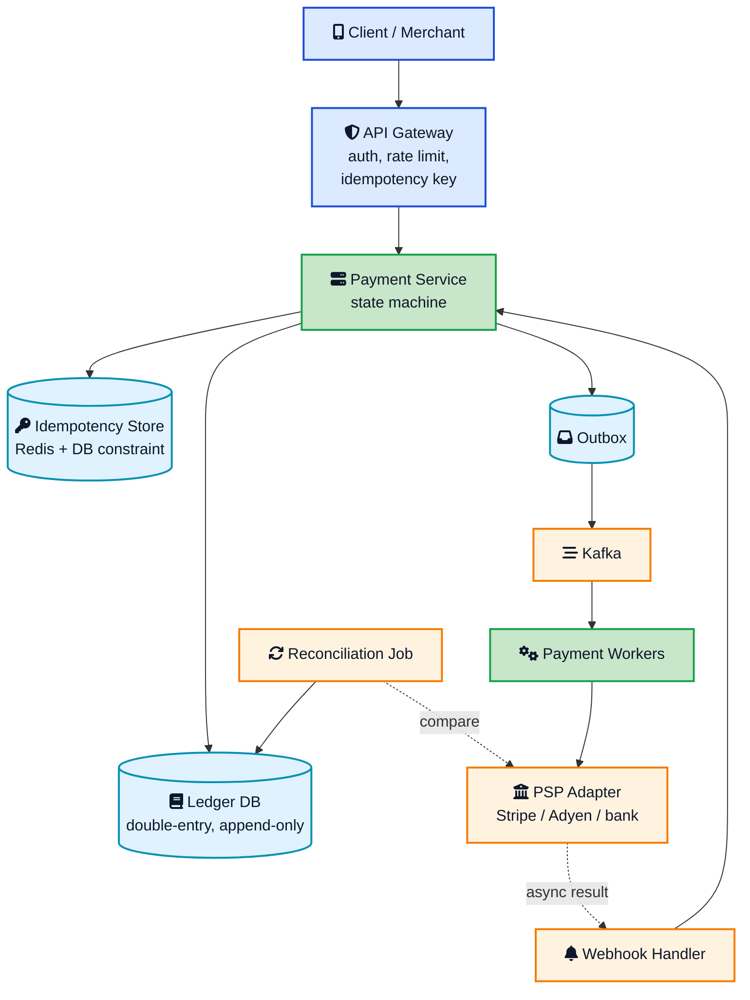
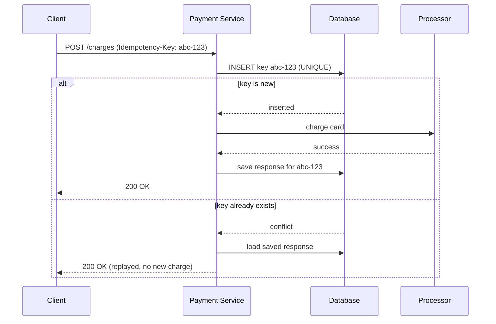
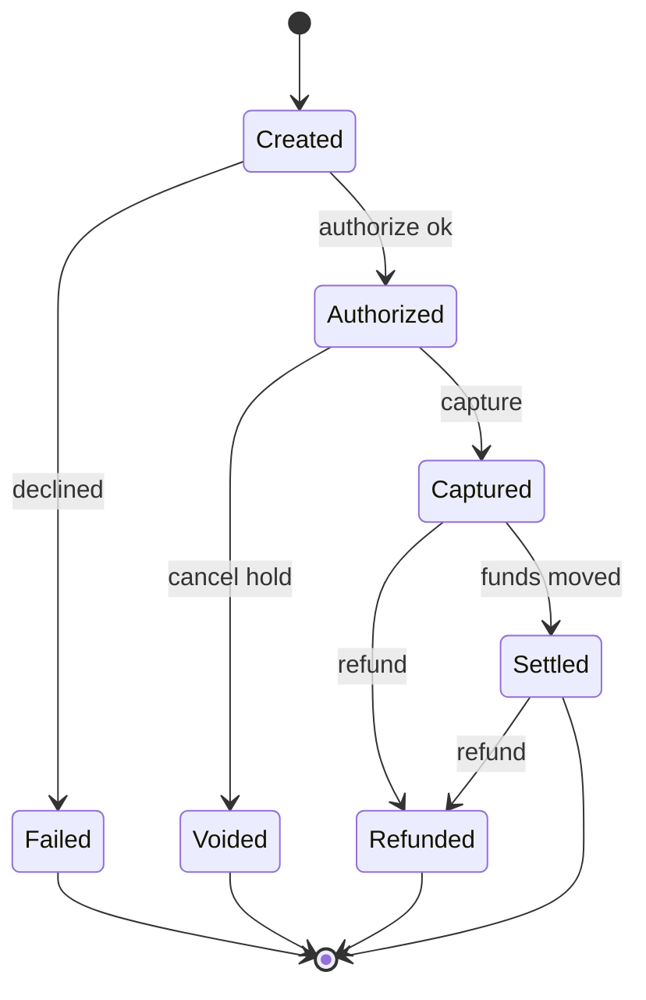
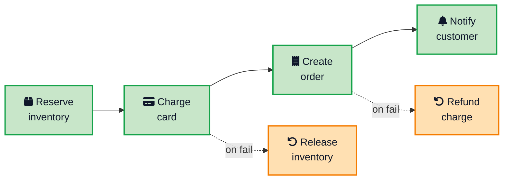
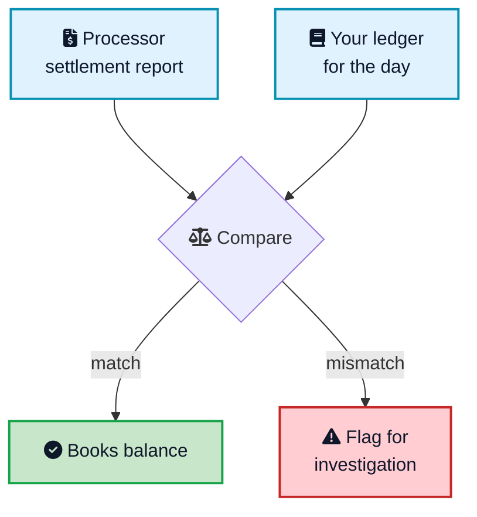

A customer taps Pay. The request leaves their phone, crosses a flaky mobile network, and times out. The app shows a spinner, then an error. The customer taps Pay again. Somewhere in your system, the first request actually went through. Now the card is charged twice, and you have an angry customer and a chargeback on the way.

That single story is the reason payment systems are built the way they are. Everywhere else in software you optimize for speed and scale. In payments you optimize for one thing first: never move money you did not mean to move, and never move it twice. Scale matters, but a fast system that double charges people is worse than a slow one that never does.

This post walks through **payment system design** the way it comes up in a real architecture review and in the [system design interview](/system-design-cheat-sheet/){:target="_blank" rel="noopener"}. You will see the full picture: idempotency keys, the payment state machine, a double-entry ledger, talking to a payment processor, coordinating across services with a saga, webhooks, and reconciliation. If you have read how [Stripe prevents double payments](/how-stripe-prevents-double-payment/){:target="_blank" rel="noopener"}, this is the whole system that pattern lives inside.



## <i class="fas fa-bullseye"></i> What a Payment System Actually Has to Do

Before drawing boxes, get the requirements straight. A payment system has a short list of jobs, and every design decision serves them.

- **Move money correctly.** A charge either happens once or not at all. No double charges, no lost charges.
- **Keep an auditable record.** Every cent must be traceable. When finance or a regulator asks what happened to a payment, the answer is in the data, not in the logs.
- **Survive failure.** Networks drop, processors time out, services crash mid-flow. The system must end in a consistent state anyway.
- **Talk to the outside world.** Card networks, banks, and payment processors are slow, occasionally down, and speak their own protocols.
- **Reconcile.** At the end of the day your numbers must match the processor's numbers to the cent.

Notice what is not at the top of that list: raw requests per second. Payment volumes are large but not web-scale-large. Even a big processor handles thousands of payments per second, not millions. The hard part is correctness under failure, not throughput. That reframing is the single most important idea in the whole topic.

### Rough numbers

It still helps to size the system. Say you are building for a mid-sized platform:

- 10 million payments per day, which averages to about 115 payments per second, with peaks maybe 10 times that during a sale.
- Each payment writes a handful of ledger rows and a few state transitions.
- Data must be kept for years for audit and compliance, so storage grows steadily and is never really deleted.

Those numbers say a well-tuned relational database can hold the core, and the interesting work is in how you keep it correct. Let us build it up piece by piece.

## <i class="fas fa-sitemap"></i> The High-Level Architecture

Here is the shape most real payment systems converge on. Requests come in through an API layer, the payment service owns the state machine and the ledger, and the slow work with the processor happens through a queue and background workers.

Read it as three lanes. The **edge** authenticates the caller and enforces the idempotency key. The **core** owns the truth: the payment state machine and the double-entry ledger, written in a single [ACID](/glossary/acid/){:target="_blank" rel="noopener"} transaction. The **async** lane does everything slow or unreliable: calling the processor, handling its webhooks, and reconciling. The rest of the post is really just a closer look at each of these.



## <i class="fas fa-key"></i> Idempotency: The Foundation

Everything starts here, because retries are not an edge case in payments. They are guaranteed. The moment a client retries on a timeout, your server will see the same logical request twice. If your design does not handle that, nothing else matters.

The pattern is the [idempotent receiver](/distributed-systems/idempotent-receiver/){:target="_blank" rel="noopener"}. The client generates a unique key, usually a UUID, before it sends the request, and puts it in an `Idempotency-Key` header. The server records that key before it does any work, and ties it to the eventual response.

Two details make or break this:

1. **Write the key before the work, not after.** If you charge the card first and store the key second, a crash in between loses the record and the retry charges again. The insert of the key and the record of the result must be part of the same story.
2. **The database unique constraint is the real guarantee.** Teams reach for Redis first because it is fast, and that is fine as a quick check. But a cache can be evicted or bypassed, so the durable `UNIQUE(idempotency_key)` constraint in the database is what actually stops the double charge. Treat Redis as an optimization, not the source of truth.

There is also a subtle rule Stripe enforces and you should copy: if a request arrives with a key you have seen but with **different parameters**, reject it. That catches the bug where code accidentally reuses a key for a different payment. The key is a promise that the request is the same request, so verify it.

Keys do not need to live forever. A [TTL](/glossary/ttl/){:target="_blank" rel="noopener"} of 24 hours is the common choice: long enough to cover retries during an outage, short enough to keep the store bounded. For the full walkthrough with code, see the [Stripe double-payment guide](/how-stripe-prevents-double-payment/){:target="_blank" rel="noopener"}.

## <i class="fas fa-project-diagram"></i> The Payment State Machine

A payment is not a single event. It is a small lifecycle, and the safest way to model that is an explicit state machine where only certain transitions are allowed. This is what stops a payment from being captured twice or refunded before it was ever charged.

The states map to what actually happens with a card:

- **Created**: the payment record exists, nothing has moved.
- **Authorized**: the processor confirmed the card is valid and placed a hold on the funds. No money has moved yet.
- **Captured**: you told the processor to take the held funds. This is usually done when the order ships or the service is delivered.
- **Settled**: the card networks and banks have run their batch process and the money has actually landed. This lands a day or two later.
- **Refunded / Voided / Failed**: the terminal outcomes.

Splitting **authorize** and **capture** is not academic. It is why hotels can hold money at check-in and charge the real amount at checkout, and why a store only charges you when it ships. Because these are distinct states, an operation like capture is only legal from the `Authorized` state. If a duplicate capture request arrives, the state machine sees the payment is already `Captured` and rejects the transition instead of moving money again. The state machine and the idempotency key are two layers of the same defense.



## <i class="fas fa-book"></i> The Double-Entry Ledger

Here is the part that separates a toy payment system from a real one. Beginners store a `balance` column on an account and update it. That is wrong for money, because updates race, updates lose history, and a partial failure leaves a number that no longer matches reality.

Real payment systems use a [double-entry ledger](/glossary/double-entry-ledger/){:target="_blank" rel="noopener"}. Every money movement is recorded as two matching entries: a **debit** on one account and an equal **credit** on another. The books are correct only when total debits equal total credits. That equality is an invariant you can check on every single transaction, and it is the cheapest fraud and bug detector you will ever build.

Consider a $100 charge on a platform that takes a $2 fee. It is not one row, it is a balanced set:

| Account | Debit | Credit |
|---|---|---|
| Customer A | 100.00 | |
| Merchant B | | 98.00 |
| Platform revenue | | 2.00 |
| **Total** | **100.00** | **100.00** |

Two rules make the ledger trustworthy:

1. **It is append-only.** You never update or delete a row. A mistake is fixed by appending a reversing pair of entries, so the history is permanent. This is the same durability idea behind a [write-ahead log](/distributed-systems/write-ahead-log/){:target="_blank" rel="noopener"}: the record of what happened is never rewritten.
2. **Balances are derived, not stored.** An account balance is the sum of its entries. You can cache that sum in a rollup table for speed, but the truth is always the entries. There is no balance column to race on.

All the entries for one movement are written inside a single [ACID](/glossary/acid/){:target="_blank" rel="noopener"} transaction, so the ledger can never be left half-written and unbalanced. This is exactly why payment systems reach for a relational database like PostgreSQL for the core: the transactional guarantees are the product. Purpose-built ledger databases like [TigerBeetle](https://docs.tigerbeetle.com/){:target="_blank" rel="noopener"} take the same idea and make it very fast, but the model is identical.

## <i class="fas fa-university"></i> Talking to the Payment Processor

Your system does not touch card networks directly. Almost no one does, because storing raw card numbers drags you into the full weight of PCI DSS compliance. Instead you integrate a payment service provider, a PSP, like Stripe, Adyen, or Braintree, and you keep card data on their side by using a token. Your database stores a token like `pm_1a2b3c`, never the actual card number.

The PSP is a network call to someone else's system, which means it is slow and sometimes fails in the worst possible way: you send a charge, and the connection drops before the response comes back. Did it work? You do not know. This is the exact situation idempotency was built for, and it is why the PSP adapter needs three things:

- **Timeouts.** Never wait forever. A hung processor call must not hold a database transaction open.
- **Retries with the same idempotency key.** Retry a timed-out charge with the identical key you sent the first time. The PSP dedupes it, so you either complete the original charge or get its result, but you never double charge.
- **A [circuit breaker](/circuit-breaker-pattern/){:target="_blank" rel="noopener"}.** If the processor starts failing, stop hammering it. A circuit breaker trips after a threshold of failures and fails fast, which protects both systems and gives the processor room to recover.

This is also where you make a deliberate choice about **fail-open versus fail-closed**. A [rate limiter](/dynamic-rate-limiter-system-design/){:target="_blank" rel="noopener"} usually fails open, letting traffic through, because a rate limiter that goes down should not take the site with it. Money is different. When you cannot confirm a charge, failing closed and declining the payment is almost always safer than failing open and risking a charge you cannot track. A declined payment is a retry. A phantom charge is a chargeback and a support ticket.

## <i class="fas fa-route"></i> Coordinating the Flow With a Saga

A single payment rarely lives in one service. A typical checkout touches an order service, an inventory service, the payment service, and a notification service. You cannot wrap all of them in one database transaction, because they have separate databases. Reaching for [two-phase commit](/distributed-systems/two-phase-commit/){:target="_blank" rel="noopener"} across them is slow and fragile.

The standard answer is the [saga pattern](/saga-pattern-distributed-transactions/){:target="_blank" rel="noopener"}. Break the flow into a sequence of local transactions, each with a **compensating action** that undoes it if a later step fails.

If the card charge fails, the saga releases the reserved inventory. If order creation fails after a successful charge, the saga issues a refund. You trade the strict atomicity of a single transaction for [eventual consistency](/glossary/eventual-consistency/){:target="_blank" rel="noopener"} and a guarantee that the system rolls forward or rolls back cleanly. For the deeper mechanics, see the [saga pattern guide](/saga-pattern-distributed-transactions/){:target="_blank" rel="noopener"}.

The saga only works if its events are reliable, which brings back the dual-write problem: how do you update your database and publish an event without one succeeding while the other fails? The transactional outbox solves it. You write the event into an outbox table inside the same transaction as the business change, and a relay publishes it to [Kafka](/kafka-vs-rabbitmq-vs-sqs/){:target="_blank" rel="noopener"} afterward. The event is published if and only if the transaction committed. See the [transactional outbox guide](/transactional-outbox-pattern/){:target="_blank" rel="noopener"} for the full pattern.

And because delivery through a broker is at-least-once, every saga step and every consumer must be idempotent. Duplicates will arrive. The [role of queues](/role-of-queues-in-system-design/){:target="_blank" rel="noopener"} in decoupling these steps is worth understanding on its own.

## <i class="fas fa-bell"></i> Webhooks: Learning the Real Outcome

The synchronous API response is only the first word, not the last. A card authorization can come back instantly, but the settlement, a dispute, or a delayed bank decline can arrive hours or days later. The processor tells you about these through **webhooks**, which are HTTP callbacks into your system.

A webhook handler that touches money has to be careful about three things:

- **Verify the signature.** Every serious processor signs its webhooks. Check the signature before you trust the payload, or an attacker can forge a "payment succeeded" event and get free goods.
- **Process idempotently.** Processors retry webhooks and can send the same event more than once. Key the handler on the event id, record processed ids, and drop duplicates. This is the [idempotent receiver](/distributed-systems/idempotent-receiver/){:target="_blank" rel="noopener"} again, applied to incoming events.
- **Return fast, work later.** Acknowledge the webhook quickly with a `200`, then do the real work asynchronously. Processors treat a slow response as a failure and retry, which only makes your load worse.



The webhook drives the payment state machine forward. A `charge.settled` event moves the payment from `Captured` to `Settled` and writes the matching ledger entries. Without webhooks, you would never know the true, final state of a payment.

## <i class="fas fa-sync"></i> Reconciliation: Proving the Money Matches

Even with all of the above, small discrepancies happen. A webhook is missed. A refund is recorded on the processor but not in your ledger because of a bug. Fees differ by a rounding cent. In most systems you would never notice. In a payment system, an unnoticed discrepancy is money that has silently gone missing.

Reconciliation is the safety net. It is a scheduled job, usually nightly, that pulls the processor's settlement report and compares it line by line against your ledger.

Because the ledger is double-entry and append-only, reconciliation is straightforward: sum the entries, compare against the report, and flag anything that does not line up for a human to investigate. This is where the discipline of the ledger design pays off. A system built on mutable balance columns has no clean way to answer "what did we think happened on Tuesday," but an append-only ledger answers it exactly.

## <i class="fas fa-shield-alt"></i> Fraud and Risk, Briefly

A full fraud system is its own topic, but a payment design should leave room for it. The practical hooks are:

- **Velocity checks.** Flag a card or account that tries many payments in a short window, a classic sign of card testing.
- **A risk score.** Signals like a mismatched billing country, a brand-new account, or a datacenter IP feed a score that can hold or decline a payment.
- **An asynchronous review path.** High-risk payments can be authorized but held in a review state rather than captured, so a human or a model decides before money truly moves.

The key design point is that fraud scoring sits on the async lane, not the hot path. You do not want a slow model call blocking every checkout, so it consumes payment events and can move a payment to a held state after the fact.

## <i class="fas fa-expand-arrows-alt"></i> Scaling the System

Only after correctness is nailed down do you scale. The good news is the numbers are friendly, so the moves are standard.

- **Shard on a stable key.** Partition the ledger and payment tables by merchant id or account id so each shard owns a slice of traffic. Cross-shard transactions are rare in payments because a single payment usually involves one merchant and one customer. [Sharding](/glossary/sharding/){:target="_blank" rel="noopener"} on the right key keeps transactions inside one shard.
- **Keep the hot path tiny.** Synchronously do only the idempotency check, the ledger write, and the enqueue. Everything else, the processor call, the receipt, the fraud score, runs on background workers reading from the queue.
- **Split reads from writes.** Money writes need strong consistency. Reporting, dashboards, and analytics can run off read replicas or a separate store with eventual consistency. This is the [CQRS](/cqrs-pattern-guide/){:target="_blank" rel="noopener"} idea: the write model and the read model do not have to be the same.
- **Cache the stable stuff.** Merchant configuration, fee rules, and currency data are read constantly and change rarely, so cache them.

The database that holds the ledger is almost always the bottleneck long before the stateless services are, which is why the ledger design and the sharding key deserve most of your attention. If you want a refresher on how the storage layer itself behaves under this load, see [how databases store data internally](/how-databases-store-data-internally/){:target="_blank" rel="noopener"}.

## <i class="fas fa-clipboard-check"></i> How to Answer This in an Interview

If this comes up in a [system design interview](/system-design-cheat-sheet/){:target="_blank" rel="noopener"}, resist the urge to draw boxes first. Walk it in this order and you will hit every signal the interviewer is listening for:

1. **Lead with correctness requirements.** Say out loud that this is a correctness-first system and that no double charge is the top constraint. That framing alone sets you apart.
2. **Establish idempotency.** Explain the idempotency key plus unique constraint before anything else.
3. **Model the state machine.** Name the states and stress that only valid transitions are allowed.
4. **Introduce the double-entry ledger.** This is the highest-signal moment. Explain debits, credits, append-only, and derived balances.
5. **Handle the processor.** Timeouts, retries with the same key, circuit breaker, and the fail-closed choice.
6. **Coordinate with a saga and outbox.** Show you know not to use a distributed transaction across services.
7. **Close the loop with webhooks and reconciliation.** This proves you understand production, not just the happy path.

Notice how much of this reuses patterns you already know from other designs. The same idempotency and queue ideas power a [notification system](/notification-system-design/){:target="_blank" rel="noopener"}, and the same contention thinking shows up in a [flash sale system](/flash-sale-system-design/){:target="_blank" rel="noopener"}. Payments just raise the stakes because the shared resource is money.

## <i class="fas fa-flag-checkered"></i> Wrapping Up

A payment system is a lesson in taking correctness seriously. The whole design falls out of one refusal: we will not move money we did not mean to, and we will not move it twice. Idempotency keys make retries safe. The state machine makes illegal operations impossible. The double-entry ledger makes the books provable and auditable. The saga and outbox coordinate across services without a fragile distributed transaction. Webhooks and reconciliation make sure your view of reality matches the processor's.

Build those layers in that order and you have a system that stays honest under the messiest failures a network can throw at it. Skip the ledger or the idempotency and you have a system that works in the demo and loses money in production. Start with correctness, prove it with the ledger, and only then reach for scale.

---

**Related posts:**

- [How Stripe Prevents Double Payments](/how-stripe-prevents-double-payment/){:target="_blank" rel="noopener"} - The idempotency key pattern at the heart of this design, with code
- [Saga Pattern for Distributed Transactions](/saga-pattern-distributed-transactions/){:target="_blank" rel="noopener"} - How to coordinate the multi-step payment flow across services
- [Transactional Outbox Pattern](/transactional-outbox-pattern/){:target="_blank" rel="noopener"} - Publishing payment events reliably without the dual-write problem
- [Circuit Breaker Pattern](/circuit-breaker-pattern/){:target="_blank" rel="noopener"} - Protecting your system when the payment processor starts failing
- [Idempotent Receiver Pattern](/distributed-systems/idempotent-receiver/){:target="_blank" rel="noopener"} - The general form of safe retries and deduplication
- [Flash Sale System Design](/flash-sale-system-design/){:target="_blank" rel="noopener"} - The same idempotency and contention ideas under a different kind of load
- [Notification System Design](/notification-system-design/){:target="_blank" rel="noopener"} - Reusing queues and idempotency to fan out receipts at scale

*Further reading: Stripe's write-up on [designing robust and predictable APIs with idempotency](https://stripe.com/blog/idempotency){:target="_blank" rel="noopener"}, the [AWS guide to the transactional outbox pattern](https://docs.aws.amazon.com/prescriptive-guidance/latest/cloud-design-patterns/transactional-outbox.html){:target="_blank" rel="noopener"}, Chris Richardson's [saga pattern reference](https://microservices.io/patterns/data/saga.html){:target="_blank" rel="noopener"}, the [TigerBeetle documentation](https://docs.tigerbeetle.com/){:target="_blank" rel="noopener"} on ledger design, and Martin Kleppmann's [Designing Data-Intensive Applications](https://dataintensive.net/){:target="_blank" rel="noopener"}.*
