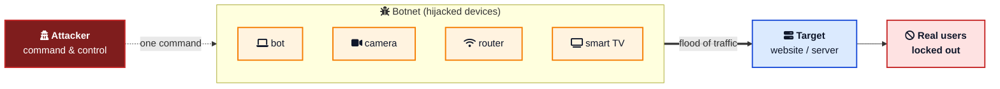
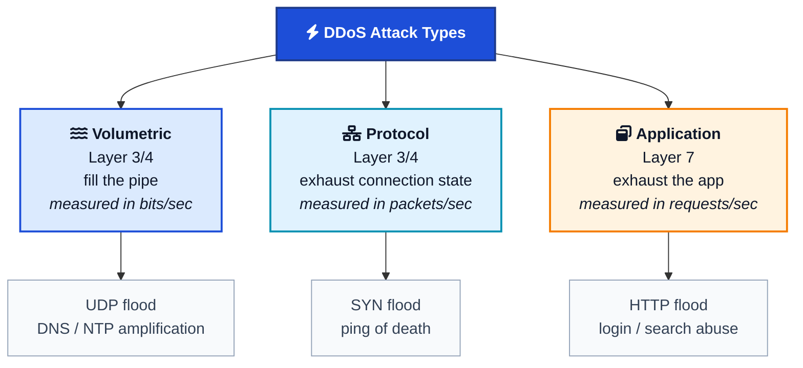
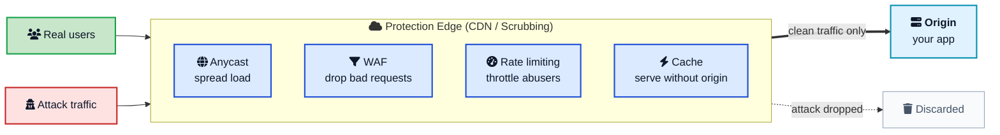

Your site is fine at 9:58 a.m. By 10:00 it is down, and your dashboards show traffic 500 times higher than normal, all of it garbage. None of it is buying anything. None of it is a real user. It is coming from tens of thousands of home routers, cameras, and set-top boxes scattered across the planet, all pointed at you at the same instant. Welcome to a **DDoS attack**.

Distributed denial-of-service attacks are one of the oldest tricks on the internet, and they are getting worse, not better. In late 2025, [Cloudflare mitigated a record 31.4 terabits per second attack](https://blog.cloudflare.com/ddos-threat-report-2025-q4/){:target="_blank" rel="noopener"} that lasted just 35 seconds, and reported that attack sizes had grown more than 700% in a single year. For a working developer, the important thing is not the scary numbers. It is understanding what these attacks actually do, why a normal firewall will not save you, and which defenses genuinely hold up.

This post walks through **DDoS attacks and protection** in plain language: what a DDoS is, how it differs from a plain DoS, the three layers attackers hit, and a practical, layered defense you can reason about. If you want background on the plumbing first, [how DNS works](/how-dns-works-complete-guide/){:target="_blank" rel="noopener"} and [what happens when you type a URL in a browser](/what-happens-when-you-type-url-in-browser/){:target="_blank" rel="noopener"} are useful companions.



## <i class="fas fa-question-circle"></i> What a DDoS Attack Actually Is

A **denial-of-service (DoS)** attack has one goal: make a service unavailable to the people who are supposed to use it. Not steal data, not break in, just knock it offline. The simplest version is one machine sending more requests than a server can handle.

A **distributed denial-of-service (DDoS)** attack is the same idea, scaled out. Instead of one machine, the attacker uses many, often thousands or millions, all hitting the target at once. That one word, "distributed," changes everything about how you defend against it.

Think of it like a shop with one door. A DoS attack is one troublemaker blocking the entrance; you can point him out and have security remove him. A DDoS attack is ten thousand people crowding the door at the same moment, so no real customer can get in, and you have no idea which faces are the problem. You cannot throw out ten thousand people one at a time.

That is the core difficulty. With a single attacker, you block one IP address and you are done. With a DDoS, there is no single address to ban. The traffic comes from everywhere, and a lot of it looks disturbingly like normal users.

### DoS vs DDoS at a glance

| Aspect | DoS | DDoS |
|---|---|---|
| Sources | One machine | Many machines (a botnet) |
| Blocking by IP | Often works | Useless on its own |
| Firepower | Limited to one connection | Sum of thousands of connections |
| Detection | Easier, single origin | Harder, traffic looks distributed and normal |
| Typical scale | Megabits | Gigabits to terabits |

## <i class="fas fa-bug"></i> Where the Traffic Comes From: Botnets

The engine behind almost every large DDoS is a [botnet](/glossary/botnet/){:target="_blank" rel="noopener"}: a collection of internet-connected devices infected with malware and quietly controlled by an attacker. Each infected device is a "bot" or "zombie." It sits there doing its normal job, streaming video or serving a webcam feed, until a command-and-control server tells it to start firing traffic at a target.

Why is this so easy to build? Because the internet is full of cheap, always-on devices with weak or default passwords: home routers, IP cameras, DVRs, smart TVs. The infamous [Mirai botnet](https://www.usenix.org/conference/usenixsecurity17/technical-sessions/presentation/antonakakis){:target="_blank" rel="noopener"} in 2016 did nothing clever. It just scanned the internet for devices still using factory-default logins like `admin/admin`, took them over, and pointed them at targets. That botnet took down DNS provider Dyn and, with it, Twitter, Reddit, Netflix, and Spotify for much of a day.

The 2025 record holder, the Aisuru-Kimwolf botnet, is an estimated one to four million infected devices, many of them Android TVs. One attacker, millions of sources, coordinated with a single command. That asymmetry is why DDoS is so hard: the attacker rents this firepower cheaply through DDoS-for-hire services, while you have to defend real infrastructure that costs real money.



## <i class="fas fa-layer-group"></i> The Three Types of DDoS Attacks

Not all floods are the same. DDoS attacks are usually grouped by which part of your stack they try to exhaust. This maps loosely onto the [OSI network model](/what-happens-when-you-type-url-in-browser/){:target="_blank" rel="noopener"}, and knowing the category tells you which defense applies.

### 1. Volumetric attacks: fill the pipe

Volumetric attacks are the brute-force option. The goal is simple: send so much data that your internet connection is completely saturated, like pouring a swimming pool through a garden hose. Legitimate packets cannot squeeze through because the pipe is already full of junk. These are measured in **bits per second (bps)**, and the biggest ones now reach tens of terabits per second.

The nastiest trick here is **amplification**. The attacker sends a small request to a misconfigured public server (a DNS resolver, an NTP time server, a memcached instance) but forges the source address so the much larger reply gets sent to the victim. A tiny request becomes a huge response aimed at you. The [2018 GitHub attack](https://www.wired.com/story/github-ddos-memcached/){:target="_blank" rel="noopener"} used memcached amplification to reach 1.35 Tbps, at the time the largest ever recorded, from a relatively modest amount of attacker bandwidth.

### 2. Protocol attacks: exhaust the state

Protocol attacks are sneakier. Instead of filling your bandwidth, they abuse how network protocols keep track of connections. The classic is the **SYN flood**.

A normal TCP connection starts with a three-way handshake: the client sends `SYN`, the server replies `SYN-ACK` and reserves memory for the half-open connection, and the client finishes with `ACK`. In a SYN flood, the attacker sends thousands of `SYN` packets but never sends the final `ACK`. The server keeps reserving memory for connections that never complete, until its connection table is full and it can accept no new connections, including from real users.

These attacks are measured in **packets per second (pps)** because it is the sheer number of packets, not their size, that overwhelms firewalls, load balancers, and the server's connection tracking.

### 3. Application-layer attacks: exhaust the app

This is the category that keeps engineers up at night. **Layer 7 (application-layer)** attacks do not try to fill your pipe. They send requests that look completely legitimate, but target the most expensive things your app does.

Imagine a flood of requests to your search endpoint with random queries that miss every cache and hit the database, or repeated login attempts that each trigger a slow password hash, or requests that generate a large PDF report. A few thousand of these per second can bring down an application that would happily shrug off a gigabit of raw traffic, because each request is cheap for the attacker to send but expensive for you to answer.

The problem is detection. A Layer 7 flood looks like a busy Tuesday. The requests are well-formed HTTP, they come from many IPs, and they hit real endpoints. Telling "sudden viral traffic" apart from "attack" is genuinely hard, which is why application-layer defense leans on behavioral analysis and [rate limiting](/dynamic-rate-limiter-system-design/){:target="_blank" rel="noopener"} rather than simple packet filtering.

| Type | Layer | Measured in | Example | Main defense |
|---|---|---|---|---|
| Volumetric | 3 / 4 | Bits per second | UDP flood, DNS amplification | Large network, scrubbing, anycast |
| Protocol | 3 / 4 | Packets per second | SYN flood | SYN cookies, stateful filtering |
| Application | 7 | Requests per second | HTTP flood, login abuse | WAF, rate limiting, CAPTCHA |



## <i class="fas fa-shield-alt"></i> Why You Cannot Just Block It Yourself

The instinct is to reach for a firewall or an `iptables` rule. For a small attack, that works. For a real DDoS, it fails for a simple physical reason: **you cannot filter traffic that has already overwhelmed your connection.**

If an attacker sends you 100 Gbps and your server has a 10 Gbps link, the link is saturated before your firewall gets to make a single decision. The firewall can be perfectly configured and it does not matter; the congestion is upstream, out on your provider's network, in a place you do not control. Your box is drowning before it can start bailing.

This is the single most important idea in DDoS protection:

> To absorb a flood, you need a network bigger than the flood. Almost nobody can build that alone, so you rent it.

That is the entire business model of DDoS protection providers. Companies like Cloudflare, Akamai, AWS, and Google operate networks with hundreds of terabits of capacity spread across the globe. They can soak up an attack that would instantly kill your single data center, filter out the junk, and forward only clean traffic to your origin.

## <i class="fas fa-tools"></i> How DDoS Protection Actually Works

Real protection is not one product. It is layers, each handling a different type of attack. Here is the mental model: sit a big, smart network in front of your origin, and give it several tools.

### Absorb with a CDN and anycast

The first layer is capacity. A [content delivery network (CDN)](/cdn-system-design/){:target="_blank" rel="noopener"} puts hundreds of edge locations between users and your origin. It uses **anycast** routing, where the same IP address is announced from many data centers at once, so attack traffic is automatically spread across the whole network instead of piling onto one place. A flood that would crush one server gets diluted across dozens of cities. This is exactly how [Cloudflare handles 55 million requests per second](/how-cloudflare-supports-55-million-requests-per-second/){:target="_blank" rel="noopener"} without falling over.

### Scrub the bad packets

For network and protocol attacks, providers route traffic through **scrubbing centers**: infrastructure whose only job is to inspect packets, drop the malicious ones (spoofed sources, malformed packets, known attack signatures, SYN floods handled with SYN cookies), and forward the clean remainder. When an attack is small or targeted, a provider can "black-hole" traffic to a specific IP, dropping everything to that address to protect the rest of the network, though that also takes the victim offline, so it is a blunt last resort.

### Filter with a web application firewall

For Layer 7 attacks, you need to inspect the actual HTTP request, not just the packet. A **web application firewall (WAF)** sits at the edge and applies rules: block known bad user agents, challenge suspicious clients with a JavaScript or CAPTCHA test, and match request patterns against attack signatures. A WAF is also your defense against non-DDoS threats like SQL injection and cross-site scripting, which is why it is a staple of any serious cloud security setup.

### Throttle with rate limiting

[Rate limiting](/dynamic-rate-limiter-system-design/){:target="_blank" rel="noopener"} caps how many requests a single client can make in a window of time. When a client crosses the limit, you return `HTTP 429 Too Many Requests` with a `Retry-After` header so well-behaved clients back off. Against an application-layer flood, per-IP and per-token rate limits are one of your most effective tools: they let real users through while starving the abusers. The common algorithms are the token bucket, which allows short bursts, and the leaky bucket, which enforces a steady rate.

### Keep the origin cheap

Finally, make sure that even the traffic that does reach you is cheap to serve. Aggressive [caching](/caching-strategies-explained/){:target="_blank" rel="noopener"} means most requests never touch your database or application logic; they are answered from the edge or an in-memory cache. Pair that with autoscaling so you add capacity under load, and a [circuit breaker](/circuit-breaker-pattern/){:target="_blank" rel="noopener"} so a struggling dependency fails fast instead of dragging the whole system down. The goal is that an attack, even when partly successful, degrades gracefully instead of collapsing.



## <i class="fas fa-clipboard-check"></i> A Practical DDoS Defense Checklist

You do not need to build all of this yourself. Most of it comes bundled with a good provider. Here is a realistic priority order for a typical web app or API.

1. <i class="fas fa-cloud"></i> **Put a CDN or DDoS provider in front of everything.** Cloudflare, AWS (CloudFront plus [AWS Shield](https://docs.aws.amazon.com/waf/latest/developerguide/ddos-overview.html){:target="_blank" rel="noopener"}), Akamai, or Fastly. This one step handles the majority of volumetric and protocol attacks for you.
2. <i class="fas fa-user-secret"></i> **Hide your origin IP.** If attackers can find the real address of your server, they can bypass the CDN and hit it directly. Lock your origin firewall so it only accepts traffic from your provider's IP ranges.
3. <i class="fas fa-filter"></i> **Turn on a WAF with managed rule sets.** Start with the provider's default rules, then tune. This covers Layer 7 attacks and common web exploits at the same time.
4. <i class="fas fa-tachometer-alt"></i> **Add rate limiting on expensive and sensitive endpoints.** Login, search, sign-up, password reset, and anything that hits the database hard. Return `429` with `Retry-After`.
5. <i class="fas fa-bolt"></i> **Cache aggressively.** The less work each request forces your origin to do, the more traffic you can absorb before anything breaks.
6. <i class="fas fa-expand-arrows-alt"></i> **Autoscale and set sane timeouts.** Let capacity grow under load, and make sure slow requests time out instead of piling up and exhausting your threads.
7. <i class="fas fa-book"></i> **Write a runbook before you need it.** Who gets paged, how to enable "under attack" mode, who to call at your provider. During an attack is the worst time to figure this out.

A note on cost: free tiers cover a lot, but if downtime costs you money, a managed DDoS protection service or a plan like AWS Shield Advanced is worth it. Beyond raw capacity, these plans add always-on monitoring and cost protection, so a huge attack does not leave you with a huge bandwidth bill on top of the outage. In cloud security, the price of good protection is almost always less than the price of being down.

## <i class="fas fa-exclamation-triangle"></i> Common Mistakes and Misconceptions

Even teams that know about DDoS make the same handful of errors.

### "Our firewall will handle it"

A firewall on your own server or network edge cannot stop an attack larger than your internet connection, because the congestion happens upstream. Firewalls are necessary, not sufficient. The heavy lifting for large attacks has to happen in a network far bigger than yours.

### Leaving the origin exposed

You can pay for the best CDN in the world, but if your server's real IP address is discoverable (through old DNS records, email headers, or a misconfigured subdomain), attackers will hit it directly and skip your protection entirely. Restrict your origin to only accept connections from your provider.

### Ignoring Layer 7

Volumetric attacks make headlines, but application-layer attacks are often what actually take down real apps, because they are cheaper to launch and harder to spot. If your defense is only about bandwidth, a modest HTTP flood aimed at your slowest endpoint can still ruin your day. This is closely related to the [thundering herd problem](/thundering-herd-problem/){:target="_blank" rel="noopener"}, where many clients hit the same expensive path at once.

### Confusing a traffic spike with an attack

Not every surge is malicious. A post going viral, a marketing email, or a [flash sale](/flash-sale-system-design/){:target="_blank" rel="noopener"} can look a lot like a DDoS. The defenses overlap heavily, caching, autoscaling, rate limiting, which is a nice bonus: building for one prepares you for the other. But reacting to real users as if they were attackers is its own kind of outage.

### Treating it as one-and-done

DDoS protection is not a checkbox you tick once. Attack techniques evolve, your app grows new expensive endpoints, and your provider ships new features. Review your rules, test your runbook, and watch your traffic patterns. The teams that stay up are the ones who treat resilience as ongoing work.

## <i class="fas fa-flag-checkered"></i> Wrapping Up

A DDoS attack is a simple idea with brutal consequences: overwhelm a service with traffic from many machines at once so real users cannot get in. What makes it hard is the "distributed" part. There is no single enemy to block, the traffic often looks legitimate, and the biggest attacks are far larger than anything a single server can survive.

The good news is that the defense is well understood, even if you cannot build it all yourself. Absorb volume with a CDN and anycast, scrub bad packets upstream, filter requests with a WAF, throttle abusers with rate limiting, and keep your origin cheap with caching and autoscaling. No single layer is enough, but stacked together they turn a service-killing flood into a manageable spike. Set it up before the attack comes, because when your traffic jumps 500 times at 10 a.m., it is far too late to start reading the docs.

---

**Related posts:**

- [How Cloudflare Supports 55 Million Requests per Second](/how-cloudflare-supports-55-million-requests-per-second/){:target="_blank" rel="noopener"} - The anycast and edge architecture that absorbs attacks at scale
- [Dynamic Rate Limiter System Design](/dynamic-rate-limiter-system-design/){:target="_blank" rel="noopener"} - The main tool against application-layer floods, in depth
- [CDN System Design](/cdn-system-design/){:target="_blank" rel="noopener"} - Why a global edge network is the first line of DDoS defense
- [Caching Strategies Explained](/caching-strategies-explained/){:target="_blank" rel="noopener"} - Keep the origin cheap so it survives a spike
- [Circuit Breaker Pattern](/circuit-breaker-pattern/){:target="_blank" rel="noopener"} - Fail fast so one overloaded dependency does not sink everything
- [The Thundering Herd Problem](/thundering-herd-problem/){:target="_blank" rel="noopener"} - When many clients hit the same expensive path at once
- [How DNS Works](/how-dns-works-complete-guide/){:target="_blank" rel="noopener"} - The system behind DNS amplification and the Dyn outage
- [What Happens When You Type a URL in a Browser](/what-happens-when-you-type-url-in-browser/){:target="_blank" rel="noopener"} - The request path attackers exploit at each layer

*Further reading: the [Cloudflare 2025 Q4 DDoS Threat Report](https://blog.cloudflare.com/ddos-threat-report-2025-q4/){:target="_blank" rel="noopener"}, Cloudflare's [What is a DDoS attack?](https://www.cloudflare.com/learning/ddos/what-is-a-ddos-attack/){:target="_blank" rel="noopener"} learning guide, the [AWS Best Practices for DDoS Resiliency](https://docs.aws.amazon.com/whitepapers/latest/aws-best-practices-ddos-resiliency/aws-best-practices-ddos-resiliency.html){:target="_blank" rel="noopener"} whitepaper, Wired's account of the [GitHub memcached attack](https://www.wired.com/story/github-ddos-memcached/){:target="_blank" rel="noopener"}, and the USENIX paper [Understanding the Mirai Botnet](https://www.usenix.org/conference/usenixsecurity17/technical-sessions/presentation/antonakakis){:target="_blank" rel="noopener"}.*
