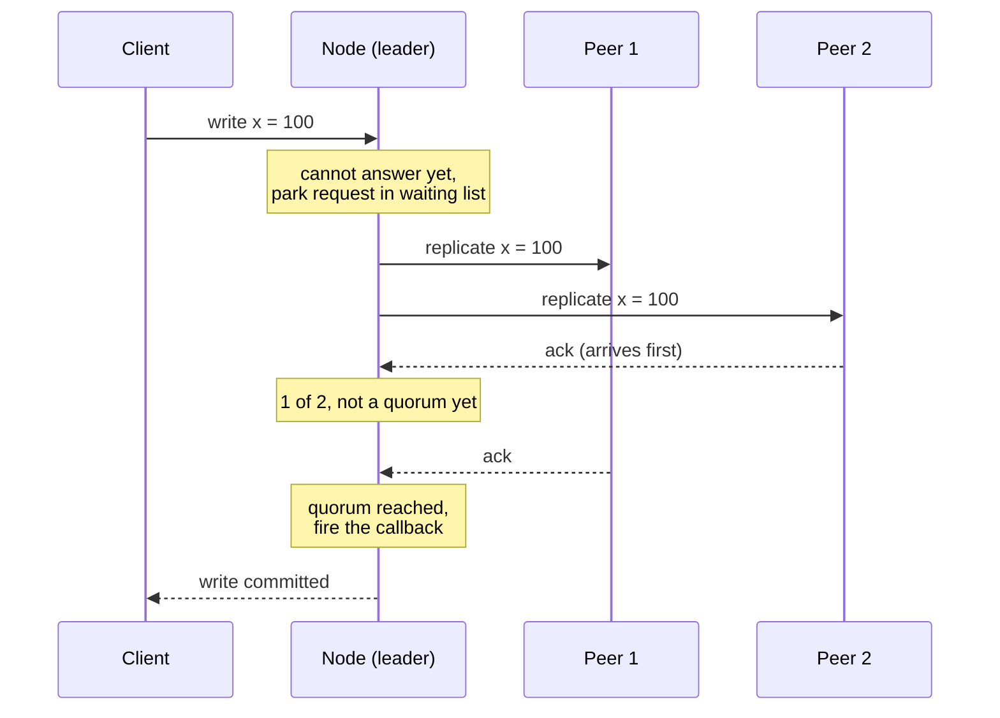
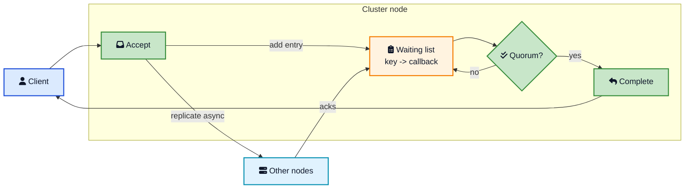
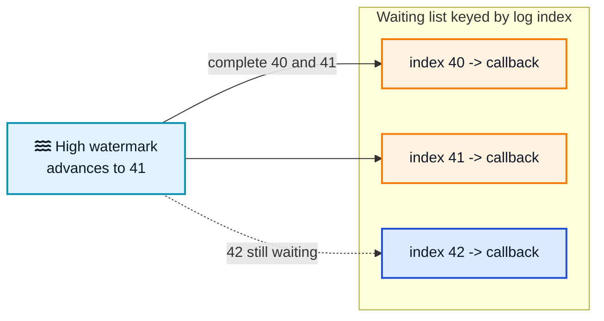
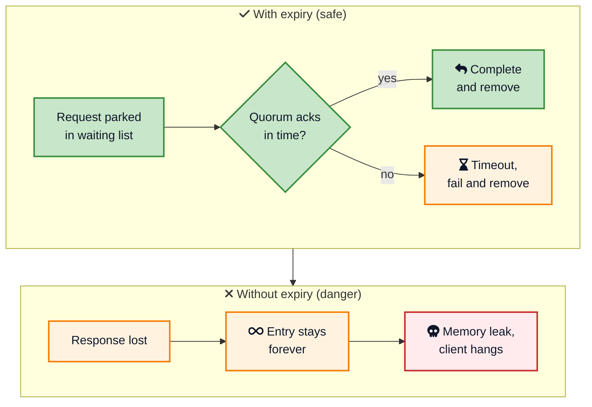
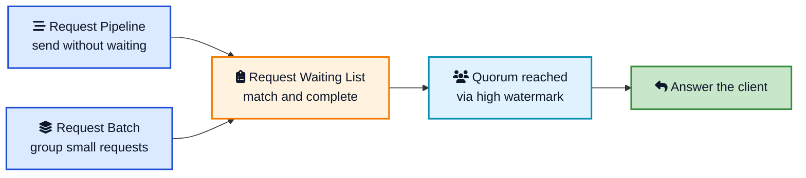

Picture a bank ledger service running on a small cluster. A client sends "transfer 100 rupees" and expects one answer: did it work or not. The node that receives the request cannot honestly answer that on its own. If it says yes and then crashes a second later, before any other node has a copy of the transfer, the money quietly vanishes. So before it replies, the node has to make sure enough of its peers have the change safely stored. That takes a few network round trips, and during those round trips the client is still sitting there, waiting for a single yes or no.

This is the awkward gap at the heart of almost every replicated system. A node accepts a request in a millisecond, but it cannot *answer* it until other nodes chime in. Meanwhile more requests keep pouring in, and the responses from peers arrive later, out of order, jumbled together. The node needs a way to remember "this reply belongs to that pending request, and that request is done only when a majority agrees."

The **Request Waiting List** pattern is the clean answer to this bookkeeping problem. It is one of the quieter patterns of distributed systems but you will find it inside almost every database, queue, and consensus engine you use. This post covers what the pattern is, why asynchronous replication forces it on you, how to build it with a key and a callback, how to pick the right key, why timeouts are non-negotiable, and how Raft, Kafka, and Cassandra all lean on it.



## <i class="fas fa-hourglass-half"></i> The Problem: One Request, Many Late Responses

Start with what the node is actually trying to do. A client sends a write. To keep that write safe, the node replicates it to other nodes and needs a [majority quorum](/distributed-systems/majority-quorum/){:target="_blank" rel="noopener"} of them to acknowledge before it confirms anything to the client. That single design choice, replicate first and wait for a quorum, is what buys durability and consistency. It is also what creates the waiting.

Here is the sequence in the simplest terms:

1. Client sends a request to the node.
2. The node sends the work to several other nodes.
3. The node waits for enough of them to say "stored."
4. Only then does the node answer the client.

The trouble is step 3. Communication between nodes is **asynchronous**. The node does not send to one peer, block for its reply, then send to the next. That would be painfully slow, one round trip per peer. Instead it fires the requests off and lets replies come back whenever they come back. This is exactly the [Request Pipeline](/distributed-systems/request-pipeline/){:target="_blank" rel="noopener"} pattern at work, and it is what keeps the cluster fast.

But asynchronous replies bring a mess with them:

- **Responses arrive out of order.** The third peer you contacted might answer first.
- **Many requests are in flight at once.** Reply number seven might belong to the write from three requests ago.
- **You need to count.** A single acknowledgement is not enough. You are waiting for a *quorum*, so you must tally responses per request until the threshold is crossed.



Look at what the node has to keep straight. Between accepting the client write and answering it, an unknown number of other requests may come and go, and the two acknowledgements it is waiting for are buried among many others. It needs a place to hold that half-finished client request and a way to recognise the responses that complete it. That place is the waiting list.

## <i class="fas fa-clipboard-list"></i> The Solution: A Key and a Callback

The pattern states the fix directly:

> The cluster node maintains a waiting list which maps a key and a callback function.

That is the whole idea. When a request cannot be answered immediately, the node does not block. It creates an entry in a map:

- The **key** is chosen so that incoming responses can be matched to the right pending request.
- The **callback** is the code that decides whether the request is now complete, and if so, answers the client.

When a response comes back from a peer, the node reads the response, works out which key it belongs to, finds the entry, and invokes the callback. The callback counts, checks its condition (usually "have I reached a quorum?"), and either waits for more or completes the client request and removes the entry.



The elegance is that the node never blocks a thread waiting for a peer. It accepts the request, records what needs to happen when responses arrive, and moves on to the next piece of work. The responses drive everything from that point forward. This is the same deferred-work idea behind a [future or promise](https://en.wikipedia.org/wiki/Futures_and_promises){:target="_blank" rel="noopener"}: the waiting list holds work that will finish later, when the world is ready.



## <i class="fas fa-key"></i> Choosing the Key

The one real design decision in this pattern is what to use as the key. Joshi puts it plainly: the key is chosen depending on the specific criteria that will invoke the callback. Two choices cover almost every case.

### Correlation ID, for direct messages

When the node sends a distinct message to each peer and expects a distinct reply, the natural key is a [correlation ID](/glossary/correlation-id/){:target="_blank" rel="noopener"}: a unique number stamped on the request and echoed back on the response. The node keeps a map from correlation ID to the pending request. When a reply lands, its correlation ID points straight at the entry to update. This is the same correlation ID that makes pipelining work, reused here to drive completion instead of just matching a single reply.

### High watermark, for a replicated log

When the node is running a [replicated log](/distributed-systems/replicated-log/){:target="_blank" rel="noopener"}, there is an even more natural key: the **log index** of the entry the request created. The client write becomes log entry number 42. The request is complete when entry 42 is committed, which happens when the [high watermark](/distributed-systems/high-watermark/){:target="_blank" rel="noopener"} (the commit index) advances to 42 or beyond. So the waiting list is keyed by log index, and the "response" that fires callbacks is not a single peer's ack but the movement of the high watermark itself.

This is a lovely detail. In a log-based system you do not track individual acks per client request at all. You track one thing, the high watermark, and every waiting request whose index is now committed gets completed in one sweep.



The rule of thumb: pick the key that the arriving signal is naturally grouped by. Point-to-point replies group by correlation ID. Log commits group by index. Get the key right and the rest of the pattern falls into place.

## <i class="fas fa-code"></i> How to Build It

The core is a map and two operations: **add an entry** when a request cannot be answered yet, and **handle a response** that may complete one or more entries. Here it is in small, Python-flavoured pseudocode, using a correlation-ID key and a quorum condition.

```python
class RequestWaitingList:
    def __init__(self, quorum, clock, timeout_ms):
        self.pending = {}          # key -> WaitingEntry
        self.quorum = quorum       # e.g. 2 for a 3-node cluster
        self.clock = clock
        self.timeout_ms = timeout_ms

    def add(self, key, callback):
        self.pending[key] = WaitingEntry(
            callback=callback,
            acks=0,
            created_at=self.clock.now(),
        )

    def handle_response(self, key, response):
        entry = self.pending.get(key)
        if entry is None:
            return                 # late or duplicate response, ignore
        entry.acks += 1
        if entry.acks >= self.quorum:
            del self.pending[key]  # remove before completing
            entry.callback.on_success(response)

    def handle_error(self, key, error):
        entry = self.pending.pop(key, None)
        if entry is not None:
            entry.callback.on_error(error)
```

Three things are worth calling out.

First, `add` never blocks. The node registers the entry and immediately goes back to serving other work. All the completion logic lives in `handle_response`, which runs when a peer replies.

Second, a response for an unknown key is simply ignored. Late replies after a request already completed, or duplicates from a retrying peer, must not crash anything or double-complete a request. Treating "key not found" as a no-op makes the receiver naturally tolerant, in the same spirit as an [idempotent receiver](/distributed-systems/idempotent-receiver/){:target="_blank" rel="noopener"}.

Third, the entry is removed from the map *before* the callback runs. That ordering matters: it prevents a second response from finding the entry still present and completing the request twice.



## <i class="fas fa-clock"></i> The Non-Negotiable Part: Expiry

A waiting list with no timeout is a slow memory leak wearing a nice pattern name. Networks drop packets. Peers crash mid-reply. A node you were counting on for the quorum goes away. If even one expected response never arrives, its entry sits in the map forever, holding memory, and the client that sent the request waits forever too.

So every real implementation runs a background sweep that expires stale entries.

```python
    def expire_old_entries(self):
        now = self.clock.now()
        expired = [
            key for key, entry in self.pending.items()
            if now - entry.created_at > self.timeout_ms
        ]
        for key in expired:
            entry = self.pending.pop(key)
            entry.callback.on_error(TimeoutError())
```

A scheduled task calls `expire_old_entries` every so often. Any request that has been waiting past the timeout is failed cleanly and removed, and the client gets a timeout error instead of hanging. In a [quorum](/distributed-systems/majority-quorum/){:target="_blank" rel="noopener"} system this is not as harsh as it sounds: the request only times out if fewer than a majority of peers responded in time. If enough did, it already completed. The timeout is the safety valve for the cases where the cluster genuinely could not agree.



The timeout also plays nicely with retries. Because the receiver ignores responses for unknown keys, a client or peer that retries after a timeout will not corrupt anything. Pairing the waiting list with an [idempotent receiver](/distributed-systems/idempotent-receiver/){:target="_blank" rel="noopener"} on the other side means those retries stay safe end to end.

## <i class="fas fa-server"></i> The Pattern in Real Systems

Once you know the shape, you spot it everywhere a node answers a client only after talking to peers.

### Raft and etcd

A [Raft](/distributed-systems/replicated-log/){:target="_blank" rel="noopener"} leader is the textbook case. When a client sends a command, the leader appends it to its log at some index and replicates it to followers. It cannot reply to the client until that entry is **committed**, meaning a majority [quorum](/distributed-systems/majority-quorum/){:target="_blank" rel="noopener"} has stored it. So the leader parks the client request keyed by the log index. As followers acknowledge, the leader advances its commit index, the [high watermark](/distributed-systems/high-watermark/){:target="_blank" rel="noopener"}. When the commit index reaches the entry's index, the leader applies the command and completes the waiting request. [etcd](https://etcd.io/docs/latest/learning/design-learner/){:target="_blank" rel="noopener"}, which powers Kubernetes, does exactly this on top of its Raft log.

### Kafka producer acks

When a Kafka producer sends a record with [`acks=all`](https://kafka.apache.org/documentation/#producerconfigs_acks){:target="_blank" rel="noopener"}, the partition leader cannot acknowledge the produce request until all in-sync replicas have the record. The leader holds the produce request pending, tracking which replicas have caught up, and answers the producer only once the in-sync set has stored the batch. That is a request waiting list keyed by log offset, with the in-sync replica set as the quorum. Combine it with pipelining, via [`max.in.flight.requests.per.connection`](/distributed-systems/request-pipeline/){:target="_blank" rel="noopener"}, and you have both patterns running together, exactly as intended.

### Cassandra and Dynamo-style coordinators

In [Cassandra](https://cassandra.apache.org/doc/latest/cassandra/architecture/dynamo.html){:target="_blank" rel="noopener"}, the node a client talks to acts as a coordinator. For a write at consistency level `QUORUM`, the coordinator forwards the write to the replicas and must wait for a quorum of them to respond before telling the client it succeeded. It keeps the client request pending and tallies replica responses against the required count. Reads work the same way: wait for a read quorum, then reconcile and reply. The coordinator's pending-request tracking is a request waiting list.

### Two-phase commit and other coordinators

Any coordinator that must gather votes before deciding uses this shape. A [two-phase commit](/distributed-systems/two-phase-commit/){:target="_blank" rel="noopener"} coordinator sends prepare messages to all participants and waits for every vote before sending commit or abort. Between prepare and the final tally, the transaction sits in a waiting list keyed by transaction ID, its callback firing when the last vote arrives or a timeout forces an abort.

| System | What is parked | Key | Completion condition |
|---|---|---|---|
| Raft / etcd | Client command | Log index | Commit index reaches the entry |
| Kafka (`acks=all`) | Produce request | Log offset | All in-sync replicas store it |
| Cassandra | Client read/write | Request ID | Read/write quorum of replicas respond |
| Two-phase commit | Transaction | Transaction ID | All participants vote |

## <i class="fas fa-project-diagram"></i> How It Fits With Its Sibling Patterns

The Request Waiting List rarely works alone. It sits in a small family of patterns that together make asynchronous cluster communication fast and correct.

- **[Request Pipeline](/distributed-systems/request-pipeline/){:target="_blank" rel="noopener"}** keeps the connection full by sending many requests without waiting for each reply. It creates the out-of-order responses that the waiting list then has to untangle. Pipeline sends; waiting list tracks.
- **Request Batch** groups many small requests into one message to cut per-message overhead. The batched response still has to be matched back to the individual client requests waiting on it, which the waiting list handles.
- **[Replicated Log](/distributed-systems/replicated-log/){:target="_blank" rel="noopener"}** and the **[high watermark](/distributed-systems/high-watermark/){:target="_blank" rel="noopener"}** provide the most common key and completion signal: a request is done when its log index is committed.



Think of pipelining and batching as the "how do we send efficiently" half, and the waiting list as the "how do we make sense of what comes back" half. You need both to build a cluster node that is fast *and* correct.



## <i class="fas fa-exclamation-triangle"></i> Mistakes Teams Make

### Forgetting the timeout

The single most common bug. Everything works in testing, where every peer always replies, so the waiting list never has to expire anything. Then in production a node dies mid-request, an entry never completes, and the client hangs. Enough of those and the map grows until the process runs out of memory. Always sweep for stale entries, always fail them cleanly.

### Completing a request twice

If you leave the entry in the map while running its callback, a second response, a duplicate, a slow retry, can find it still present and complete the client request again. Remove the entry from the map *before* invoking the callback, and treat a lookup miss as a harmless no-op.

### Counting acks instead of tracking who acked

Naively incrementing a counter breaks when the same peer answers twice, which happens with retries. If peer 2 sends its ack twice, a counter reads that as two votes and can falsely cross the quorum with only one real replica. Track the *set* of peers that responded, not just a number, so duplicates from one peer count once.

### Blocking a thread instead of parking the request

The whole point of the pattern is to not tie up a thread per in-flight request. If your handler calls something like `future.get()` and waits, you have thrown the benefit away and you will run out of threads under load. Register the callback and return; let the response drive completion.

### Using the wrong key

Keying a log-based system by correlation ID when you could key by log index means re-implementing quorum tracking per request instead of letting the high watermark do it for you. Pick the key that the arriving signal is already grouped by, and a lot of complexity disappears.

## <i class="fas fa-tasks"></i> Key Takeaways for Developers

1. **A node can accept a request faster than it can answer it.** Replication and quorum take round trips, and the request has to wait somewhere in the meantime.
2. **The waiting list is a map from a key to a callback.** The key matches the responses that will arrive; the callback decides when the request is complete.
3. **Choose the key to fit the signal.** Correlation ID for point-to-point replies, log index and the high watermark for a replicated log.
4. **Never block a thread.** Register the entry, move on, and let incoming responses drive completion. That is what keeps the node scalable.
5. **Timeouts are mandatory.** Sweep and expire stale entries, or a lost response leaks memory and hangs a client forever.
6. **Guard against double completion and duplicate acks.** Remove before completing, ignore unknown keys, and track which peers responded rather than a raw count.
7. **It is half of a pair.** Pipeline and batch to send efficiently; use the waiting list to make sense of the replies. Together they power Raft, Kafka, and Cassandra.

## <i class="fas fa-flag-checkered"></i> Wrapping Up

The Request Waiting List is a small pattern that solves a problem every replicated system runs into: a node accepts a client request in an instant but can only answer it after a conversation with its peers. Rather than freeze a thread through that conversation, the node writes down what it is waiting for, keyed so it can recognise the answers when they arrive, and gets back to work. When enough responses land, a callback fires and the client finally hears yes or no.

None of the pieces are complicated on their own: a map, a key, a callback, a quorum count, and a timeout. The craft is in the details, choosing a key that matches the signal, removing entries before completing them, tracking peers instead of raw counts, and always expiring the stragglers. Get those right and you have the quiet machinery that lets a leader wait for a quorum, a Kafka partition wait for its replicas, and a coordinator wait for its votes, all without ever blocking on any single slow peer. It is the bookkeeping that makes asynchronous replication both fast and honest.

---

**Related posts:**

- [Request Pipeline Pattern](/distributed-systems/request-pipeline/){:target="_blank" rel="noopener"} - The sending half that fills the connection and creates the out-of-order replies this pattern untangles
- [Majority Quorum in Distributed Systems](/distributed-systems/majority-quorum/){:target="_blank" rel="noopener"} - The completion condition most waiting-list callbacks check for
- [Replicated Log](/distributed-systems/replicated-log/){:target="_blank" rel="noopener"} - Where the log index becomes the natural waiting-list key
- [High Watermark](/distributed-systems/high-watermark/){:target="_blank" rel="noopener"} - The commit line whose movement completes waiting requests in a log
- [Idempotent Receiver Pattern](/distributed-systems/idempotent-receiver/){:target="_blank" rel="noopener"} - Keeps retries after a timeout from doing damage
- [Leader and Followers Pattern](/distributed-systems/leader-follower/){:target="_blank" rel="noopener"} - The replication flow that produces the acks a leader waits on
- [Two-Phase Commit](/distributed-systems/two-phase-commit/){:target="_blank" rel="noopener"} - A coordinator that parks a transaction until every participant votes

*Further reading: [Request Waiting List chapter](https://martinfowler.com/articles/patterns-of-distributed-systems/request-waiting-list.html){:target="_blank" rel="noopener"} in Patterns of Distributed Systems; the [Raft paper](https://raft.github.io/raft.pdf){:target="_blank" rel="noopener"} by Ongaro and Ousterhout; the [Kafka producer acks documentation](https://kafka.apache.org/documentation/#producerconfigs_acks){:target="_blank" rel="noopener"}; and the [Cassandra data consistency guide](https://cassandra.apache.org/doc/latest/cassandra/architecture/dynamo.html){:target="_blank" rel="noopener"}.*
