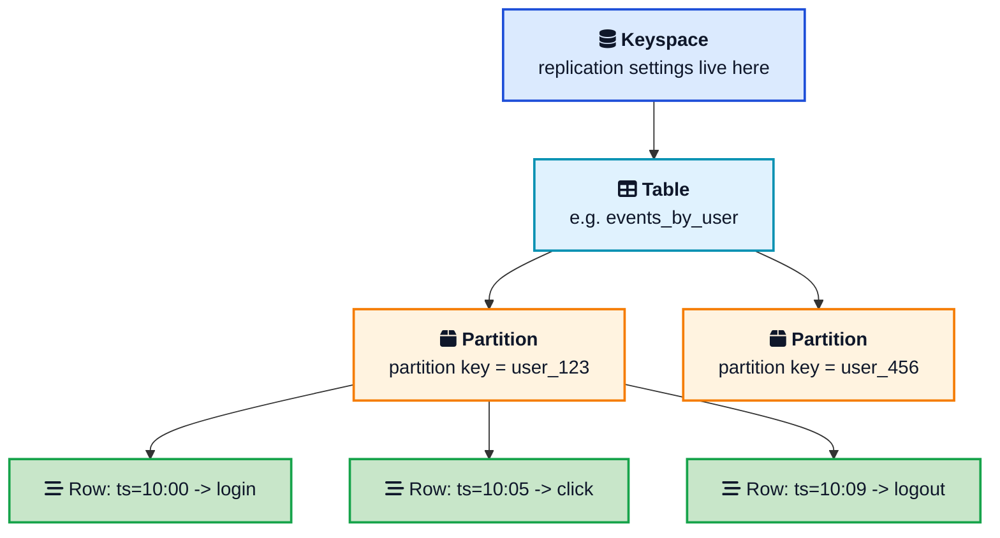
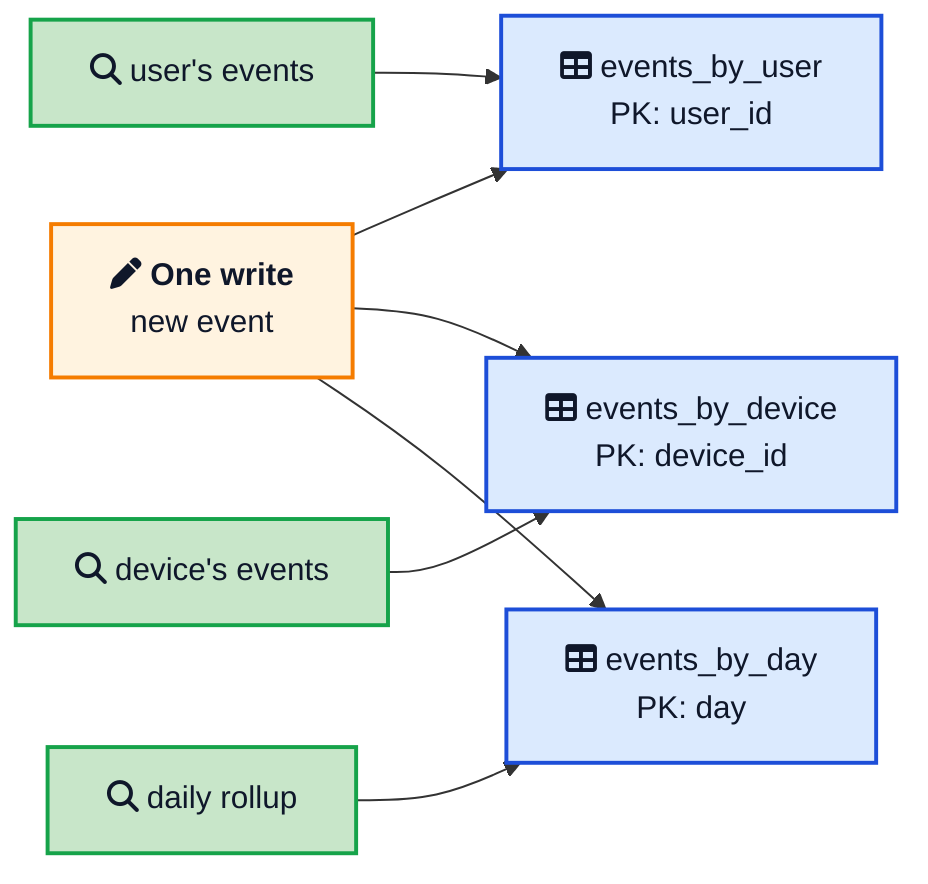
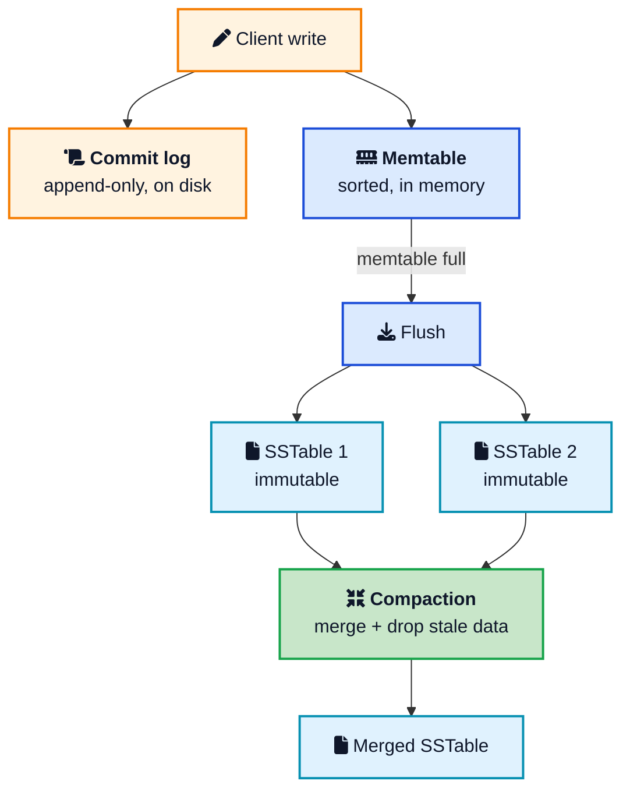
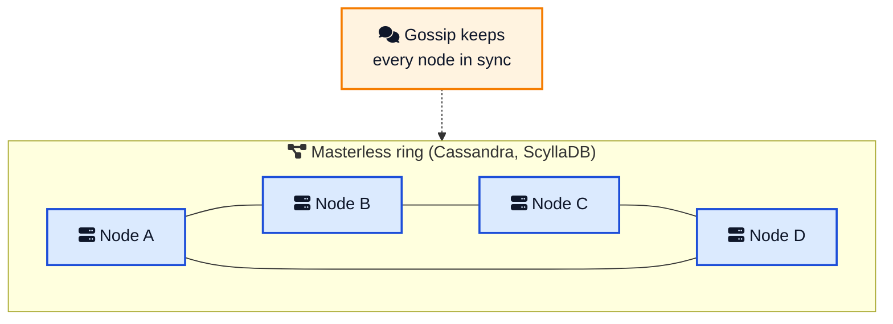

Pick almost any product that ingests a firehose of data and you will find a wide column store underneath it. Netflix tracks your viewing history in Cassandra. Discord keeps trillions of messages in ScyllaDB. Google Search indexing, Analytics, and Maps all lean on Bigtable. When the workload is "millions of writes per second, forever, across the globe," this is the family of database that keeps showing up.

And yet wide column stores are one of the most misunderstood corners of the database world. The name confuses people (it has nothing to do with columnar analytics databases like ClickHouse). The data model feels backwards if you come from SQL. And the golden rule, design your tables around your queries instead of your data, breaks almost every habit a relational developer has.

This post clears all of that up. You will learn what a **wide column store** actually is, how the partition key and clustering key control everything, why writes are so cheap, how reads and the cluster work under the hood, and exactly when to reach for one instead of [PostgreSQL, MongoDB, or DynamoDB](/postgresql-vs-mongodb-vs-dynamodb/){:target="_blank" rel="noopener"}. If you want a refresher on how any database physically stores bytes first, [How Databases Store Data Internally](/how-databases-store-data-internally/){:target="_blank" rel="noopener"} is a good primer.



## <i class="fas fa-question-circle"></i> What a Wide Column Store Actually Is

Start with what the name means, because it trips everyone up.

A **wide column store** (also called a column-family store) is a NoSQL database where data lives in tables, but the tables are far more flexible than relational ones. Each row is identified by a key, and under that key you can store a large and varying set of columns. Row A might have three columns. Row B under the same table might have three thousand. Nothing forces every row to share the same shape. That is where "wide" comes from: a single logical row can be very wide, and different rows can be wide in different ways.

The crucial thing to get straight up front: **a wide column store is not a columnar database.** They sound identical and mean opposite things.

- A **wide column store** (Cassandra, Bigtable, HBase, ScyllaDB) is row-oriented under the hood. It groups rows into partitions and is built for high-volume writes and key-based reads. This is an OLTP-style tool.
- A **columnar** or **column-oriented database** (ClickHouse, BigQuery, Amazon Redshift) physically stores all values of a single column next to each other on disk so it can scan and aggregate one column across billions of rows quickly. This is an OLAP analytics tool.

The [row store versus column store](/how-databases-store-data-internally/){:target="_blank" rel="noopener"} distinction is about physical layout for analytics. The "wide column" label is about a flexible, sparse data model for scale. Keep them separate in your head and half the confusion disappears.

Wide column stores sit in the NoSQL family alongside key-value, document, and graph databases. You can think of them as a key-value store where the value is itself a sorted, structured map of columns. That extra structure is what lets you fetch "user X's last 50 events" in a single cheap read.

## <i class="fas fa-sitemap"></i> The Data Model: Partition Key and Clustering Key

Everything about a wide column store flows from two ideas: the **partition key** and the **clustering key**. Master these and you understand the whole system.

The hierarchy looks like this: a **keyspace** (like a database) holds **tables**, a table is split into **partitions**, and each partition holds **rows** sorted on disk.



### The partition key decides where data lives

The **partition key** is the unit of distribution. When you write a row, the database hashes its partition key and uses that hash to pick which node in the cluster owns the data. Every row that shares a partition key lands on the same node (and its replicas). This is [consistent hashing](/consistent-hashing-explained/){:target="_blank" rel="noopener"} at work, the same technique that powers DynamoDB and distributed caches. It is a form of [sharding](/glossary/sharding/){:target="_blank" rel="noopener"} where the shard key is baked into the primary key.

The consequence is huge: reads and writes for a single partition key are a direct hop to one node. No coordinator has to fan out across the cluster. That is why a well-modeled query in Cassandra is fast and predictable no matter how big the cluster grows.

### The clustering key decides the order

Inside a partition, rows are sorted on disk by the **clustering key**. Rows with the same partition key but different clustering keys sit next to each other, in the order the clustering key defines. This is the unit of locality: one read can pull a contiguous slice of rows very cheaply, which is exactly what you want for "give me the last 50 events for this user, newest first."

Here is the model in a concrete CQL (Cassandra Query Language) table:

```sql
CREATE TABLE events_by_user (
    user_id     uuid,
    event_time  timestamp,
    event_type  text,
    payload     text,
    PRIMARY KEY ((user_id), event_time)
) WITH CLUSTERING ORDER BY (event_time DESC);
```

Read that primary key carefully. The double parentheses around `user_id` make it the **partition key**, so all of one user's events live on one node. `event_time` is the **clustering key**, so those events are stored sorted by time, newest first. Now this query is a single-partition, pre-sorted read:

```sql
SELECT event_type, payload
FROM events_by_user
WHERE user_id = 8a7f... 
LIMIT 50;
```

No sorting at query time, no scatter-gather across nodes. The data was already laid out exactly the way you asked for it. That is the payoff of getting the two keys right, and the reason the next section on data modeling matters so much.



## <i class="fas fa-pencil-ruler"></i> Query-First Data Modeling

In a relational database you model your data first (normalize into clean tables) and write whatever queries you need later. In a wide column store you flip that completely. **You model your tables around the queries you need to run.**

There are no joins. None. If you need to look up events by user and also by device, you do not join two tables, you keep two tables: `events_by_user` and `events_by_device`. The same event is written to both. This is deliberate denormalization, and it feels wrong until you internalize the trade: storage is cheap, and cross-node coordination at read time is expensive. You pay a little extra on write to make every read a single fast partition hit.



The rules of thumb that fall out of this:

- **One table per query pattern.** If you have five ways to read the data, expect roughly five tables.
- **Choose a partition key that spreads load evenly and matches your reads.** A key with few distinct values (say, a `country` column) creates hot partitions that overwhelm one node.
- **Keep partitions bounded.** A partition that grows without limit (all events ever, under one key) becomes a performance bomb. More on that in the mistakes section.
- **Never filter on a non-key column at scale.** Cassandra will make you add `ALLOW FILTERING`, which quietly turns your query into a full scan.

If you have read about the [transactional outbox](/transactional-outbox-pattern/){:target="_blank" rel="noopener"} or event-sourced systems, this write-to-many-tables pattern will feel familiar. The database is optimized for append-heavy, read-predictable workloads, and the schema is a reflection of that.

## <i class="fas fa-bolt"></i> How Writes Work: The LSM Tree

Wide column stores are famous for absorbing enormous write volumes without breaking a sweat. The reason is the storage engine: a [log-structured merge tree](/glossary/lsm-tree/){:target="_blank" rel="noopener"}, or **LSM tree**. It is the opposite design choice from the B-tree that a relational database uses, and it is worth understanding because it explains almost every performance characteristic of these systems.

A B-tree updates rows in place, which means random disk seeks. An LSM tree never does that. Instead:

1. A write is appended to a **commit log** on disk for durability. Appending is sequential and fast. This is the same idea as a [write-ahead log](/distributed-systems/write-ahead-log/){:target="_blank" rel="noopener"}.
2. The write is also added to an in-memory sorted structure called the **memtable**, and then the write is acknowledged. The client does not wait for disk beyond the commit log append.
3. When the memtable fills up, it is flushed to disk as an **SSTable** (Sorted String Table), an immutable sorted file. It is never edited after that.
4. In the background, **compaction** merges SSTables together, drops overwritten values and expired data, and keeps read cost under control.



Because every write becomes a sequential append, the disk is used in the way it is fastest at, and throughput stays high even under a heavy concurrent load. The trade-off is that reads have more work to do, which is the next piece.

## <i class="fas fa-search"></i> How Reads Work: SSTables, Bloom Filters, and Tombstones

A read is harder than a write, because the data for one key might be spread across the memtable and several SSTables that have not been compacted together yet. To answer a query, the database has to check all of the places the value could be and merge the results, keeping the newest version of each column.

To avoid touching every SSTable on every read, wide column stores lean on a [bloom filter](/data-structures/bloom-filter/){:target="_blank" rel="noopener"} for each SSTable. A bloom filter is a tiny probabilistic structure that answers "is this key definitely not here?" instantly. If the filter says no, the database skips that file entirely. Only the SSTables that might contain the key get opened. Partition indexes and summaries then pinpoint the exact byte offset without scanning the file.

Deletes add a twist. Since SSTables are immutable, you cannot erase a value in place. A delete writes a **tombstone**, a marker that says "this is gone." The real bytes are removed later during compaction. Until then, reads have to scan past tombstones, which is why heavy delete or overwrite workloads can slow reads to a crawl if you are not careful.

Finally, because data is replicated, a read might find different values on different replicas. **Read repair** fixes this: when the coordinator notices a replica is out of date, it pushes the newer value back so the replicas converge. This is one of the mechanisms behind [eventual consistency](/glossary/eventual-consistency/){:target="_blank" rel="noopener"}.



## <i class="fas fa-network-wired"></i> How the Cluster Scales

The data model explains a single node. The magic of wide column stores is how nodes work together, and here the two lineages diverge.

**Cassandra and ScyllaDB use a masterless ring.** Every node is equal. There is no leader, no single coordinator, no special node whose failure takes down the cluster. Nodes discover each other and share state using a [gossip protocol](/distributed-systems/gossip-dissemination/){:target="_blank" rel="noopener"}, the same style of chatter that biological and distributed systems use to spread information. The partition key hash maps onto the ring, and the node responsible for that range owns the data, with copies on the next few nodes clockwise.

**Bigtable and HBase use a leader-based design.** A master assigns key ranges (called tablets or regions) to worker servers and rebalances them as load shifts. Data itself sits on a shared distributed file system. This centralizes coordination, which simplifies some consistency questions at the cost of a more involved architecture. Bigtable is offered as a fully managed Google Cloud service, so you never see any of it.



### Replication and tunable consistency

Each partition is copied to several nodes, set by the **replication factor**. If the replication factor is 3, three nodes hold every row. That gives you fault tolerance: lose a node and the data is still on two others.

The clever part is **tunable consistency**. On every single query, you choose how many replicas must respond before it counts as a success:

- **Consistency `ONE`**: one replica answers. Fastest, most available, weakest guarantee.
- **Consistency `QUORUM`**: a majority of replicas must agree. This is the [quorum](/distributed-systems/majority-quorum/){:target="_blank" rel="noopener"} idea. Read and write quorums that overlap give you strong consistency.
- **Consistency `ALL`**: every replica must answer. Strongest, but one slow or dead node stalls the request.

This is the [CAP theorem](/glossary/cap-theorem/){:target="_blank" rel="noopener"} made practical. You are choosing, per request, where to sit on the line between consistency and availability. Critical writes can demand `QUORUM`; a firehose of analytics events can settle for `ONE`. No other database family hands you that dial so directly.

## <i class="fas fa-balance-scale"></i> Wide Column vs Other Databases

Where does a wide column store fit next to the databases you already know? This table lines up the trade-offs.

| Aspect | Wide column (Cassandra) | Relational (PostgreSQL) | Document (MongoDB) | Columnar (ClickHouse) |
|---|---|---|---|---|
| Data model | Partitions of flexible-column rows | Tables with fixed schema | JSON-like documents | Columns stored separately |
| Best workload | Write-heavy OLTP at scale | General purpose OLTP | Flexible-shape OLTP | Analytical OLAP |
| Scaling | Linear, horizontal, built in | Vertical, then sharding | Built-in sharding | Horizontal for analytics |
| Joins | None (denormalize) | Full SQL joins | Limited | Analytical joins |
| Consistency | Tunable per query | Strong (ACID) | Tunable | Eventual, batch |
| Query flexibility | Low (query-first design) | High (ad hoc SQL) | Medium | High for aggregations |
| Sweet spot | Time-series, logs, IoT, feeds | Transactions, reporting | Catalogs, profiles | Dashboards, analytics |

The short version: a wide column store trades query flexibility for write throughput and effortless horizontal scale. If your access patterns are known and your write volume is enormous, that is a great trade. If you need to slice the data a hundred different ways next quarter, a relational database like [PostgreSQL](/postgresql-vs-mongodb-vs-dynamodb/){:target="_blank" rel="noopener"} will serve you far better.



## <i class="fas fa-server"></i> The Main Wide Column Stores

Four systems dominate the space. They share the data model but differ in lineage and operations.

| System | Origin | Model | Managed option |
|---|---|---|---|
| **Apache Cassandra** | Facebook, 2008; Dynamo + Bigtable ideas | Masterless ring, CQL | DataStax Astra, AWS Keyspaces, Azure Managed Instance |
| **ScyllaDB** | 2015, C++ rewrite of Cassandra | Masterless ring, CQL-compatible | ScyllaDB Cloud |
| **Apache HBase** | 2008, Bigtable clone on Hadoop | Leader-based, on HDFS | Various Hadoop vendors |
| **Google Cloud Bigtable** | Google, 2006 paper | Leader-based, tablets | Fully managed on Google Cloud |

A few notes that matter in practice:

- **Cassandra** is the default open-source choice. Masterless design makes multi-region deployments and high availability straightforward. It powers Netflix, Instagram, and Apple at massive scale.
- **ScyllaDB** is drop-in compatible with Cassandra drivers but rewritten in C++ with a shard-per-core design, so it squeezes far more throughput out of each node. Discord famously migrated trillions of messages to it.
- **HBase** shows up in Hadoop-heavy shops and integrates tightly with the big-data ecosystem.
- **Bigtable** is the original, still running inside Google. If you are on Google Cloud and want a wide column store with zero operational burden, it is the answer. [Azure Cosmos DB](https://azure.microsoft.com/en-us/products/cosmos-db){:target="_blank" rel="noopener"} also offers a Cassandra-compatible API.

## <i class="fas fa-exclamation-triangle"></i> Common Mistakes That Wreck a Cluster

Wide column stores are unforgiving of bad data modeling. These three mistakes cause the majority of production pain.

### Unbounded partitions

The classic error is a partition key that lets one partition grow forever, like storing every message in a chat room under a single `room_id`. Partitions past roughly 100 MB cause heap pressure, slow compaction, and latency spikes. The fix is to add a time bucket to the partition key, for example `(room_id, day)`, so each partition stays a manageable size. Bounding partition growth is the single most important habit.

### Tombstone pileups

Delete-heavy or overwrite-heavy workloads generate tombstones faster than compaction clears them. Reads then spend their time scanning past deleted markers. Use a [TTL](/glossary/ttl/){:target="_blank" rel="noopener"} so data expires cleanly, avoid queues-in-a-table patterns that delete constantly, and model data so you append rather than churn.

### Leaning on ALLOW FILTERING and secondary indexes

When you filter on a column that is not part of the primary key, Cassandra forces you to add `ALLOW FILTERING`. It works in development with ten rows and falls over in production with ten million, because it scans across partitions. Secondary indexes have similar traps on high-cardinality columns. The right answer is almost always another table modeled for that query, not a filter or an index bolted onto an existing one.

If you are debugging contention and locking behavior in any database, the same disciplined thinking applies. Our guide on [how database locks work](/database-locks-explained/){:target="_blank" rel="noopener"} covers the relational side of that story.

## <i class="fas fa-tasks"></i> When to Use a Wide Column Store

Bring it out when most of these are true:

- Your workload is **write-heavy** and growing, think millions of events per second.
- You need **linear horizontal scaling** across many nodes, often across regions.
- You can **tolerate eventual consistency** for most operations, with the option to tighten it per request.
- You **know your query patterns** at design time and they are key-based, not ad hoc.
- Your shape fits: **time-series, event and audit logs, IoT telemetry, messaging history, activity feeds, personalization data.**

Reach for something else when:

- You need **ad hoc queries**, complex joins, or aggregations spanning partitions. Use a relational database.
- You need **strong multi-row transactions**. This is not the tool.
- Your data volume is **modest**. A single well-tuned PostgreSQL instance with [good indexing](/database-indexing-explained/){:target="_blank" rel="noopener"} will be simpler and cheaper. Many teams reach for distributed NoSQL far too early, as the [TinyURL system design](/tinyurl-system-design/){:target="_blank" rel="noopener"} walkthrough points out.

The honest rule: use a wide column store when a single node genuinely cannot hold your write load, and your reads are predictable enough to design tables around. Below that threshold, the operational cost rarely pays off.

## <i class="fas fa-flag-checkered"></i> Wrapping Up

A wide column store is a specialist, not a generalist. It gives up joins, ad hoc queries, and easy schema changes, and in return it hands you write throughput and horizontal scale that a relational database cannot match without a lot of work. The whole model rests on two decisions, the partition key that places your data and the clustering key that orders it, and on an LSM storage engine that turns every write into a fast sequential append.

Get the data model right, keep your partitions bounded, respect the query-first mindset, and Cassandra or ScyllaDB or Bigtable will happily eat a firehose of writes for years. Get it wrong, and no amount of hardware will save you from hot partitions and tombstones. As with most database choices, the tool is not magic. It is a sharp trade, and it rewards teams that understand exactly what they are trading.

---

**Related posts:**

- [How Databases Store Data Internally](/how-databases-store-data-internally/){:target="_blank" rel="noopener"} - Pages, B-trees, and the row-store versus column-store layout that wide column stores build on
- [PostgreSQL vs MongoDB vs DynamoDB](/postgresql-vs-mongodb-vs-dynamodb/){:target="_blank" rel="noopener"} - Where a relational, document, or key-value store beats a wide column one
- [Consistent Hashing Explained](/consistent-hashing-explained/){:target="_blank" rel="noopener"} - The ring that decides which node owns each partition
- [Database Indexing Explained](/database-indexing-explained/){:target="_blank" rel="noopener"} - Why a single indexed PostgreSQL table often beats reaching for NoSQL too early
- [How Google Ads Scales with Spanner](/how-google-ads-scales-with-spanner/){:target="_blank" rel="noopener"} - The other end of the spectrum: globally distributed SQL
- [Gossip Dissemination in Distributed Systems](/distributed-systems/gossip-dissemination/){:target="_blank" rel="noopener"} - How masterless clusters keep every node in sync
- [Designing Database Isolation for B2B Multi-Tenant SaaS](/multi-tenant-database-isolation/){:target="_blank" rel="noopener"} - Partitioning and isolation on the relational side

*Further reading: the original [Bigtable paper](https://research.google/pubs/bigtable-a-distributed-storage-system-for-structured-data/){:target="_blank" rel="noopener"} and [Dynamo paper](https://www.allthingsdistributed.com/files/amazon-dynamo-sosp2007.pdf){:target="_blank" rel="noopener"} that started it all, the [Apache Cassandra architecture docs](https://cassandra.apache.org/doc/latest/cassandra/architecture/){:target="_blank" rel="noopener"}, the [ScyllaDB wide-column glossary](https://www.scylladb.com/glossary/wide-column-database/){:target="_blank" rel="noopener"}, and Google's [Bigtable for Cassandra users](https://cloud.google.com/bigtable/docs/cloud-bigtable-for-cassandra-users){:target="_blank" rel="noopener"} guide.*
