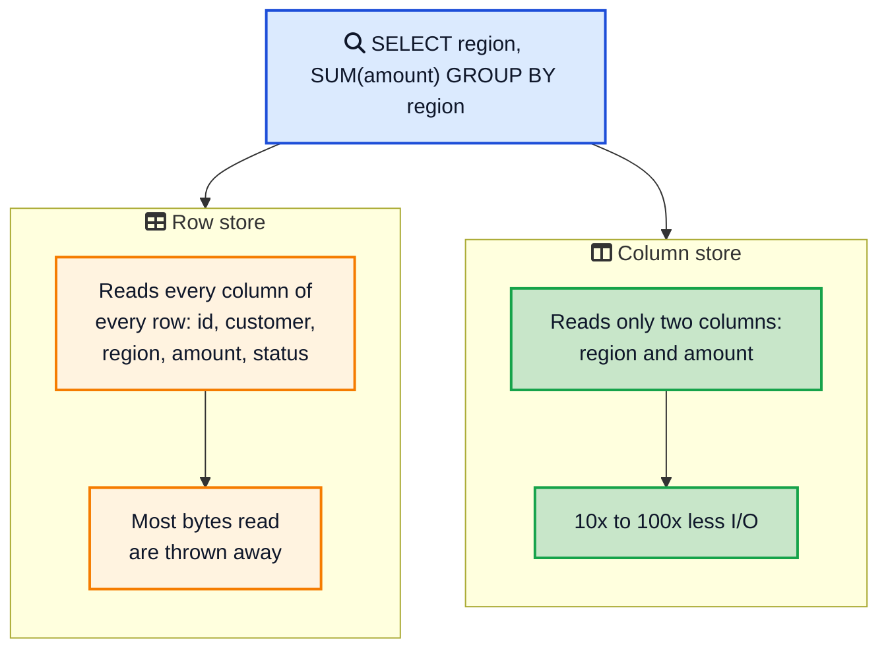
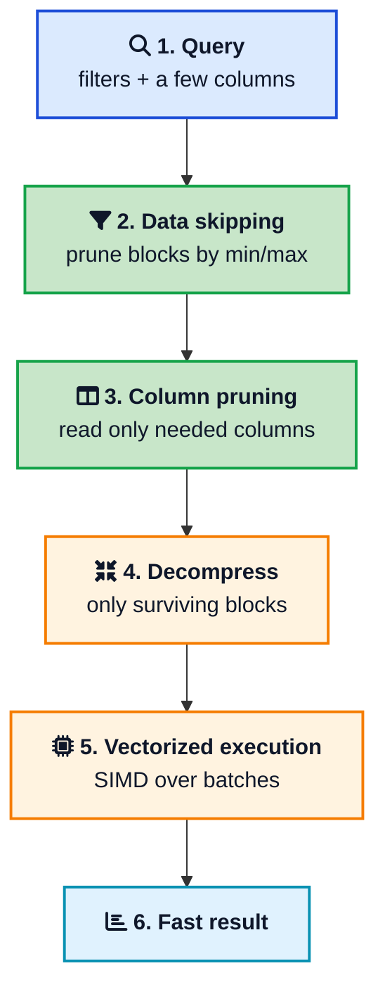
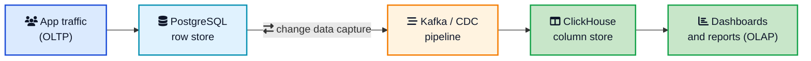

Cloudflare runs a query that scans over a quadrillion events and returns in under two seconds. The same shape of query on a normal PostgreSQL table would still be running by the time you gave up and went for coffee. The difference is not more hardware or a clever index. It is a completely different way of laying bytes on disk, called **columnar storage**, and it is the engine behind every serious analytics tool you have heard of.

If you have ever watched a dashboard spin because someone ran `SELECT SUM(amount) ... GROUP BY month` over a huge table, you have felt the problem a columnar database solves. Row stores are built to fetch and update whole rows quickly. They are the wrong shape for questions that touch a few columns across millions of rows.

This post explains what a **columnar database** actually is, why column-oriented storage makes analytical queries 10 to 100 times faster, how compression and vectorized execution pile on top, and exactly when to reach for [ClickHouse](https://clickhouse.com/){:target="_blank" rel="noopener"}, BigQuery, or Redshift instead of a plain relational database. It is the natural companion to the [wide column stores](/wide-column-stores-explained/){:target="_blank" rel="noopener"} post, and the two are constantly confused, so we will clear that up first.



## <i class="fas fa-question-circle"></i> What a Columnar Database Actually Is

A **columnar database** (also called a column-oriented database) stores all the values of one column next to each other on disk, instead of storing each row together. That single decision changes everything about how the database performs.

Before going further, kill the most common confusion. **Columnar is not the same as a wide column store**, even though the names look identical.

- A **columnar database** (ClickHouse, BigQuery, Redshift, Snowflake) is about *physical layout*. It lays each column out separately so analytical scans and aggregations are cheap. This is an OLAP tool.
- A **wide column store** (Cassandra, Bigtable, HBase) is a *NoSQL data model*. Each row can hold a flexible, sparse set of columns, and it is built for high write throughput and key-based reads. This is an OLTP-style tool. The [wide column stores guide](/wide-column-stores-explained/){:target="_blank" rel="noopener"} covers it in full.

One is about how bytes sit on disk for analytics. The other is about a flexible schema for scale. They share a word and nothing else. Keep them apart and the rest of this is easy.

Columnar databases power the analytical side of the world: dashboards, reporting, business intelligence, observability, and customer-facing analytics. They are the technology inside modern [cloud data warehouses](/how-databases-store-data-internally/){:target="_blank" rel="noopener"} and real-time analytics engines.

## <i class="fas fa-table"></i> Row Store vs Column Store: The Core Idea

Everything starts with layout. Take a simple `orders` table:

| id | customer | region | amount | status |
|---|---|---|---|---|
| 1 | Alice | EU | 42 | paid |
| 2 | Bob | US | 87 | paid |
| 3 | Carol | EU | 13 | refunded |

A **row store** like PostgreSQL keeps each row together on disk:

```
[1, Alice, EU, 42, paid] [2, Bob, US, 87, paid] [3, Carol, EU, 13, refunded]
```

A **column store** keeps each column together instead:

```
id:       [1, 2, 3]
customer: [Alice, Bob, Carol]
region:   [EU, US, EU]
amount:   [42, 87, 13]
status:   [paid, paid, refunded]
```

Now look at what happens with a classic analytical query:

```sql
SELECT region, SUM(amount)
FROM orders
GROUP BY region;
```



On a wide fact table with 50 to 500 columns, a typical analytical query touches only 3 to 6 of them. The row store still has to read every column of every row it scans, because the columns are interleaved on the page. The column store reads only the columns named in the query and ignores the rest. That is **column pruning**, and on wide tables it alone cuts I/O by roughly 10x. The [row versus column layout](/how-databases-store-data-internally/){:target="_blank" rel="noopener"} is covered from the storage-engine angle in the database internals post if you want the page-level detail.



## <i class="fas fa-bolt"></i> Why Columnar Databases Are So Fast

Column pruning is only the start. Three more ideas stack on top, and together they explain the 10x to 1000x speedups you read about.

### Compression that actually works

When a column holds values of a single type, it compresses beautifully, because similar values sit together. A `status` column with three distinct values shrinks to almost nothing with **dictionary encoding**. A monotonically increasing timestamp compresses with **delta encoding**. Sorted or low-cardinality columns get **run-length encoding**. Row stores cannot do this well because they interleave different types on every page, which defeats most compression.

Typical columnar compression ratios land in the 5 to 20x range on warehouse data, sometimes 30x on low-cardinality columns. Less data on disk means less data to read, so compression is not just a storage saving, it is a speed feature.

### Vectorized execution

A row store often processes one row at a time. A columnar engine processes values in **batches** (ClickHouse uses granules of 8,192 rows, others use blocks of 1,024 to 4,096 values). Because a batch is a dense array of one type, the CPU can load 256-bit or 512-bit chunks straight into a register and apply the same operation to many values at once using SIMD instructions. This is **vectorized execution**, and it runs the actual arithmetic far closer to memory-bandwidth speed than row-at-a-time code ever could.

### Data skipping

The fastest work is the work you never do. Columnar databases store small pieces of **metadata per block**: the minimum and maximum value, null counts, sometimes a [bloom filter](/data-structures/bloom-filter/){:target="_blank" rel="noopener"}. Before reading a block, the [query planner](/postgresql-internals-how-queries-execute/){:target="_blank" rel="noopener"} checks that metadata. If a block's `region` range is `[US, US]` and you filtered on `region = 'EU'`, the whole block is skipped without ever being opened. This goes by many names: zone maps in Redshift, micro-partition pruning in Snowflake, skip indexes in ClickHouse. Same idea everywhere.



Each layer reduces the work for the next. Data skipping eliminates whole blocks, column pruning eliminates most of what remains, compression shrinks what is left, and vectorized execution chews through the rest at high speed. That is why a well-built columnar query feels like magic next to the same query on a row store.

## <i class="fas fa-balance-scale"></i> OLTP vs OLAP: Matching Storage to Workload

The choice between a row store and a columnar store comes down to the shape of your workload. This is the single highest-leverage decision in a data architecture.

| Aspect | OLTP (row store) | OLAP (columnar store) |
|---|---|---|
| Example | Place an order, update a profile | Revenue by region this year |
| Query pattern | Many small reads and writes by key | Few large scans and aggregates |
| Rows per query | A handful | Millions to billions |
| Columns per query | Often the whole row | A few of many |
| Writes | Constant single-row inserts and updates | Large batch loads |
| Storage | Row-oriented (PostgreSQL, MySQL) | Column-oriented (ClickHouse, BigQuery) |
| Strength | Point access, transactions, [ACID](/glossary/acid/){:target="_blank" rel="noopener"} | Scans, aggregation, compression |
| Weakness | Slow wide-table aggregates | Slow point lookups and updates |

The honest takeaway: neither layout is better, they are built for opposite jobs. Forcing PostgreSQL to serve heavy analytics, or forcing ClickHouse to serve transactional updates, is how teams end up fighting their database instead of using it.

## <i class="fas fa-pen"></i> Writes and the Trade-Off

Columnar speed is not free. The same layout that makes reads fast makes writes and updates awkward.

Data in a columnar store is written as large, sorted, compressed blocks (ClickHouse calls them parts, Snowflake calls them micro-partitions). These blocks are effectively immutable. That leads to a few rules you cannot escape:

- **Batch your writes.** Inserting one row at a time is painful because each insert wants to create a new part. Columnar systems love big batch loads or micro-batches of thousands to millions of rows. ClickHouse even merges small parts together in the background using its MergeTree engine, an idea related to the [LSM tree](/glossary/lsm-tree/){:target="_blank" rel="noopener"}.
- **Avoid frequent updates and deletes.** Modifying a value means rewriting compressed blocks. Most columnar stores support updates, but they are heavy operations meant to be rare, not part of your hot path.
- **Do not expect point lookups to shine.** Fetching one full row means touching many separate column files. That is the exact opposite of what the layout optimizes for.

If your workload is update-heavy or lookup-heavy, that is a loud signal you want a row store, not a columnar one.



## <i class="fas fa-server"></i> The Main Columnar Databases

The columnar world splits into open-source engines, embedded libraries, and managed cloud warehouses. They share the same core layout but target different niches.

| System | Type | License | Best for |
|---|---|---|---|
| **ClickHouse** | Self-hosted + managed | Apache 2.0 | Real-time OLAP, customer-facing analytics |
| **DuckDB** | Embedded library | MIT | Single-machine analysis of files, notebooks |
| **Google BigQuery** | Managed only | Commercial | Serverless data warehousing at scale |
| **Amazon Redshift** | Managed only | Commercial | AWS data warehousing |
| **Snowflake** | Managed only | Commercial | Cloud data warehouse, separated storage and compute |
| **Apache Druid / Pinot** | Self-hosted + managed | Apache 2.0 | Sub-second customer-facing analytics |

A few practical notes:

- **ClickHouse** is the open-source speed champion. Each column lives in its own compressed file, a sparse primary index plus skip indexes prune data hard, and execution is vectorized. It powers observability and analytics at Cloudflare, Uber, and many others.
- **DuckDB** is "SQLite for analytics." It runs in-process with no server, reads [Parquet](https://parquet.apache.org/docs/){:target="_blank" rel="noopener"} files directly, and has made local data analysis genuinely fast.
- **BigQuery** grew out of Google's [Dremel](https://research.google/pubs/dremel-interactive-analysis-of-web-scale-datasets/){:target="_blank" rel="noopener"} paper and is serverless: you run SQL and Google handles the machines.
- **Redshift** and **Snowflake** are the workhorse cloud warehouses, with Snowflake known for separating storage from compute so you can scale each independently.

## <i class="fas fa-file"></i> Columnar File Formats: Parquet, ORC, and Arrow

Columnar is not only a database idea, it is also a file format idea, and this is where it touches data engineering.

- **Apache Parquet** is the most widely used on-disk columnar format. It stores data column by column in row groups, with per-column statistics in the footer, so any engine can prune columns and skip row groups. It is the default format for data lakes and Spark.
- **Apache ORC** is a similar columnar file format, popular in the Hadoop and Hive world.
- **Apache Arrow** is the in-memory columnar standard. It defines a common layout so tools can share data without repeated serialization, which is why DuckDB, Spark, and pandas can hand data to each other cheaply.

The power of these formats is that many engines read the same files. You can write Parquet once and query it from DuckDB, Spark, BigQuery, or ClickHouse. Columnar storage stops being locked inside one database and becomes a shared substrate for analytics.



## <i class="fas fa-project-diagram"></i> How Columnar Fits Your Architecture

You rarely replace your main database with a columnar one. You add it alongside. The standard production shape is a row store for transactions and a columnar store for analytics, kept in sync.



Transactions land in PostgreSQL. A [change data capture](/debezium-outbox-postgres-database-impact/){:target="_blank" rel="noopener"} stream, often through [Kafka](/distributed-systems/how-kafka-works/){:target="_blank" rel="noopener"}, copies changes into ClickHouse. Dashboards query ClickHouse, so heavy analytics never slows down the transactional database. This read-and-write separation is the same instinct behind the [CQRS pattern](/cqrs-pattern-guide/){:target="_blank" rel="noopener"}: use one model tuned for writes and another tuned for reads.

Some databases try to do both in one system, called HTAP (hybrid transactional and analytical processing). TiDB pairs a row engine (TiKV) with a column engine (TiFlash); SingleStore and AlloyDB blend the two. HTAP is promising, but for most teams the clean split of Postgres plus a columnar store is simpler and cheaper.

## <i class="fas fa-tasks"></i> When to Use a Columnar Database

Reach for a columnar database when:

- Your queries **scan and aggregate** large numbers of rows across a **few columns** of a wide table.
- **Dashboards and reports** on PostgreSQL or MySQL have become slow.
- You need **real-time analytics** on high-volume event data: logs, metrics, clickstreams, IoT.
- You are building **customer-facing analytics** where response time has to stay sub-second.
- You want to query **Parquet files** in a data lake without loading them into a warehouse first.

Stick with a row store when:

- Your workload is **transactional**: many small reads and writes by key. Use [PostgreSQL](/postgresql-vs-mongodb-vs-dynamodb/){:target="_blank" rel="noopener"}.
- You need **frequent updates and deletes** on individual rows.
- Your data is **small**. A well-indexed PostgreSQL table handles a surprising amount before analytics get slow, as the [database indexing guide](/database-indexing-explained/){:target="_blank" rel="noopener"} shows. Do not add a warehouse before you need one.

## <i class="fas fa-exclamation-triangle"></i> Common Mistakes

### Using a columnar store as your primary database

Columnar databases are analytics engines, not application databases. Pointing your web app's transactional traffic at ClickHouse and expecting fast single-row updates ends in pain. Keep OLTP on a row store and mirror data into the columnar store for analytics.

### Inserting one row at a time

Single-row inserts are the classic anti-pattern. Each insert creates a tiny part that the engine then has to merge, and the overhead crushes throughput. Buffer writes and load them in batches of thousands or use the database's async insert feature.

### Ignoring the sort key

Columnar speed depends on data skipping, and data skipping depends on how the data is ordered. If your table is not sorted along the columns you filter on (the sort key or primary key in ClickHouse, the distribution and sort keys in Redshift), the engine cannot prune blocks and ends up scanning everything. Choosing the sort key is the columnar equivalent of choosing a good [index](/database-indexing-explained/){:target="_blank" rel="noopener"}.

### Treating it like a row store with SQL

It speaks SQL, so it is tempting to model data the way you would in PostgreSQL: heavily normalized, many joins. Columnar stores prefer wide, denormalized tables (often a star schema) so queries stay within a few large scans instead of many joins. Model for scans, not for third normal form.

## <i class="fas fa-flag-checkered"></i> Wrapping Up

A columnar database is a specialist built for one job: answering analytical questions over huge tables, fast. It gets there by flipping the storage layout so each column sits together, then stacking compression, vectorized execution, and data skipping on top. The payoff is analytical queries that run 10 to 100 times faster than a row store, which is why every modern data warehouse and real-time analytics engine is columnar under the hood.

The mirror image of that strength is its weakness. Point lookups, single-row updates, and transactions are slow, because the layout is optimized for the opposite access pattern. So the right mental model is not "columnar versus relational." It is "columnar and relational," each doing the job it was built for, usually with a change data capture pipe between them. Get that pairing right and both your transactions and your dashboards stay fast.

---

**Related posts:**

- [Wide Column Stores Explained](/wide-column-stores-explained/){:target="_blank" rel="noopener"} - The NoSQL data model that everyone confuses with columnar storage
- [How Databases Store Data Internally](/how-databases-store-data-internally/){:target="_blank" rel="noopener"} - Pages, B-trees, and the row-store versus column-store layout up close
- [PostgreSQL vs MongoDB vs DynamoDB](/postgresql-vs-mongodb-vs-dynamodb/){:target="_blank" rel="noopener"} - Picking the right database family for your workload
- [Database Indexing Explained](/database-indexing-explained/){:target="_blank" rel="noopener"} - Why a well-indexed row store handles more than you think
- [PostgreSQL Internals: How Queries Execute](/postgresql-internals-how-queries-execute/){:target="_blank" rel="noopener"} - How a query planner turns SQL into a plan
- [CQRS Pattern Guide](/cqrs-pattern-guide/){:target="_blank" rel="noopener"} - Splitting read and write models, the same instinct behind OLTP plus OLAP
- [Vector Database Deep Dive](/vector-database-deep-dive/){:target="_blank" rel="noopener"} - Another specialized store for a specific query shape

*Further reading: ClickHouse on [what a columnar database is](https://clickhouse.com/resources/engineering/what-is-columnar-database){:target="_blank" rel="noopener"} and [why they are fast](https://clickhouse.com/resources/engineering/why-columnar-databases-are-fast){:target="_blank" rel="noopener"}, the classic [C-Store paper](https://web.stanford.edu/class/cs345d-01/rl/cstore.pdf){:target="_blank" rel="noopener"} by Stonebraker et al., Google's [Dremel paper](https://research.google/pubs/dremel-interactive-analysis-of-web-scale-datasets/){:target="_blank" rel="noopener"} behind BigQuery, and the [Apache Parquet docs](https://parquet.apache.org/docs/){:target="_blank" rel="noopener"}.*
