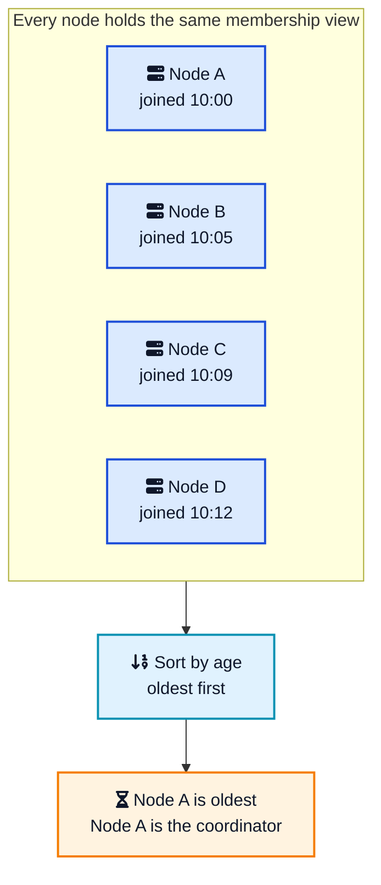
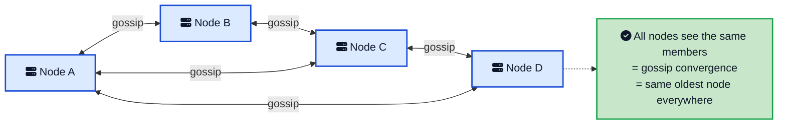
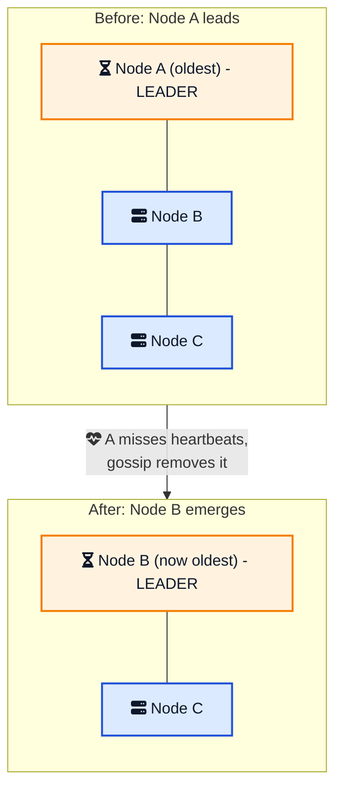

Most distributed systems textbooks open with the same picture: a cluster of equals with one node wearing a crown. Somebody runs an election, votes get counted, and a leader is declared. But there is a whole family of systems that never hold an election at all and still end up with a single coordinator every time. How?

They cheat, in the nicest possible way. Instead of asking "who should lead?", every node asks a question with only one answer: "who has been here the longest?". Sort the cluster members by age, take the oldest, and you have a leader. No ballots, no majority, no term numbers. The leader just *emerges* from a list everyone already agrees on.

This is the **Emergent Leader** pattern and it is how peer-to-peer clusters like Akka, Hazelcast, and JGroups quietly appoint a boss. This post walks through what the pattern is, why ordering by age works without a vote, how gossip and heartbeats keep the choice honest, where it is safe, and where it will bite you.



## <i class="fas fa-question-circle"></i> The Problem: Peers Still Need a Coordinator

A peer-to-peer cluster treats every node as equal. There is no primary, no special machine, no one place that writes go. Systems like Amazon Dynamo, Cassandra, Akka Cluster, and Riak are built this way on purpose, because a design with no single leader has no single point of failure and no single bottleneck.

That equality is great until you hit a job that genuinely needs one node to decide. Somebody has to:

- Assign data partitions to nodes and rebalance them when the cluster grows or shrinks.
- Track which nodes have joined and which have failed, then take corrective action.
- Make cluster-wide calls that would be a mess if ten nodes tried to make them at once.

You could run a full [leader election](/distributed-systems/leader-follower/){:target="_blank" rel="noopener"} like [Raft](https://raft.github.io/raft.pdf){:target="_blank" rel="noopener"} or ZooKeeper's ZAB for this. But that pulls a heavy consensus protocol into a system that was designed to avoid one. It also adds an availability cost: if the election machinery cannot form a [majority quorum](/distributed-systems/majority-quorum/){:target="_blank" rel="noopener"}, nobody coordinates anything. For cluster housekeeping that can tolerate a little slack, that is a steep price.

The Emergent Leader pattern asks a simpler question. What if the coordinator did not have to be *elected* at all? What if it could be *computed*?

## <i class="fas fa-hourglass-half"></i> What the Emergent Leader Pattern Is

The pattern is a single sentence:

> Order cluster nodes based on their age within the cluster to allow nodes to select a leader without running an explicit election.

Every node knows the full list of cluster members, and it knows roughly when each one joined. To find the leader, a node sorts that list by age and picks the oldest member. That is the whole algorithm.

The magic is that this is a deterministic function. Feed the same membership list into the same sort on every node and every node computes the same leader, all on its own, with zero messages exchanged to decide it. The leader is not announced. It is derived.

Notice what the coordinator does *not* do here. It does not sit on the write path taking every client request the way a leader does in the [Leader and Followers pattern](/distributed-systems/leader-follower/){:target="_blank" rel="noopener"}. Its job is lighter: membership decisions and partition assignment. Because the role is lighter and recoverable, you can get away with picking it by ordering instead of by consensus.



## <i class="fas fa-comments"></i> How Every Node Agrees on the List

The pattern rests on one assumption: every node has the same membership list. If two nodes disagree about who is in the cluster, they can compute different leaders. So the real work is not picking the leader, it is agreeing on the members.

Peer-to-peer clusters spread that information with a [gossip protocol](/distributed-systems/gossip-dissemination/){:target="_blank" rel="noopener"}. Each node periodically picks a random peer and swaps membership state with it. A change made in one corner of the cluster ripples outward, node to node, until everyone has heard it. This is the same mechanism Cassandra and Akka use to track cluster state.

When every node has converged on the same view, the cluster has reached **gossip convergence**. Only after convergence does the emergent leader become meaningful, because only then is everyone sorting an identical list.

Akka's own docs describe it exactly this way: "There is no leader election process, the leader can always be recognised deterministically by any node whenever there is gossip convergence." The leader is just the first node in sorted order that is eligible to lead. Any node can play the role, and it can change from one convergence round to the next.

## <i class="fas fa-heartbeat"></i> Detecting Failure and Handing Over

An emergent leader is only useful if the cluster notices when the leader dies. That job belongs to failure detection, usually built on [heartbeats](/distributed-systems/heartbeat/){:target="_blank" rel="noopener"}. Each node watches its peers for regular signs of life. Many peer-to-peer systems use a phi accrual failure detector, which outputs a suspicion level that rises the longer a node stays silent instead of a hard yes/no.

When the oldest node is declared dead, it drops out of the membership list. Gossip spreads that removal, the cluster re-converges on the smaller list, and the sort now returns a different oldest member. Leadership has moved to the next in line, and no election ever ran.

This is why age is such a convenient ordering. Succession is obvious. The second oldest node was always the leader-in-waiting, and every node already knew it. Compare that to an election, where the successor is unknown until votes are counted.

One detail worth pinning down: ages can tie or be fuzzy, because clocks across machines do not agree. Real implementations do not trust wall-clock timestamps for this. They use a stable, monotonically increasing sequence assigned when a node joins, or fall back to a deterministic tiebreak like the node's unique address, so the sort is total and identical everywhere.



## <i class="fas fa-exclamation-triangle"></i> The Catch: It Is Only as Safe as Your Membership View

Here is where you have to be honest about what this pattern buys you. The emergent leader is correct only when every node shares the same membership list. A [network partition](/glossary/split-brain/){:target="_blank" rel="noopener"} breaks that assumption.

Split the cluster into two halves that cannot talk. Each half runs its own gossip, converges on its own smaller membership list, and computes its own oldest member. Now you have two emergent leaders, one per side. This is textbook [split brain](/glossary/split-brain/){:target="_blank" rel="noopener"}, and the pattern does nothing to prevent it on its own.

For some jobs that is fine. If the coordinator is only rebalancing partitions inside its own reachable half, the two halves will reconcile once the network heals. Temporary disagreement costs a little wasted work, not corrupted data.

For a single-writer invariant, it is not fine at all. If two coordinators both believe they own the same partition and both accept writes, you get conflicting data that no one can safely merge. That is why serious systems bolt a safety net onto the pattern:

- **Require a quorum.** A coordinator is only allowed to act if it can see a [majority quorum](/distributed-systems/majority-quorum/){:target="_blank" rel="noopener"} of the cluster. The minority side has an emergent leader, but that leader stays passive. Hazelcast calls this split-brain protection.
- **Delegate to a consistent core.** Hand the truly critical decisions to a small, strongly consistent cluster, a [consistent core](/distributed-systems/consistent-core/){:target="_blank" rel="noopener"} running Raft or Paxos, and let the emergent leader handle only the cheap, reconcilable work.

The rule of thumb: an emergent leader is a great *coordinator* and a poor *arbiter*. Use it to organize work, not to guard an invariant that must never break.

## <i class="fas fa-network-wired"></i> Real Systems That Use It

This is not an academic pattern. It runs in production every day.

- **Akka Cluster** determines its leader deterministically as the first eligible node in sorted order after gossip convergence, with no election. The leader's only job is shifting members through the lifecycle, moving `joining` nodes to `up` and `exiting` nodes to `removed`.
- **Hazelcast** treats the oldest member as the master. That node owns the partition table and drives rebalancing when members come and go. Split-brain protection adds the quorum check.
- **JGroups**, the group communication toolkit behind Infinispan and older JBoss clustering, makes the first member of the group view the coordinator. When it leaves, the next member in the view takes over.
- **Apache Ignite** designates the oldest node in the topology as the coordinator that manages cluster-wide metadata and node join or leave events.

The common thread: all of them are peer-to-peer, all of them already run gossip-style membership and failure detection, and none of them wanted to pay for a consensus vote just to pick a housekeeper.

## <i class="fas fa-balance-scale"></i> Emergent Leader vs Leader Election vs Consistent Core

These three approaches all end up with "one node in charge", but they make very different trade-offs.

| Approach | How the leader is chosen | Guarantee | Cost | Best for |
| --- | --- | --- | --- | --- |
| **Emergent Leader** | Sort members by age, take the oldest | Weak: correct only under one membership view | Almost free, no protocol | Cluster management in peer-to-peer systems |
| **[Leader Election](/distributed-systems/leader-follower/){:target="_blank" rel="noopener"}** (Raft, ZAB) | Candidates request votes, need a majority | Strong: at most one leader per term | Consensus round per election | Ordering writes, single-writer correctness |
| **[Consistent Core](/distributed-systems/consistent-core/){:target="_blank" rel="noopener"}** | Small Raft/Paxos cluster the big cluster trusts | Strong: linearizable decisions | Extra cluster to run and depend on | Critical decisions in a large peer-to-peer cluster |

Read that table as a spectrum of how much you are willing to pay for safety. Emergent leader is the cheapest and weakest. A consensus-backed election or a consistent core is stronger and costlier. The art is matching the strength to the job. Do not run Raft to decide who cleans up membership, and do not trust an age sort to guard your bank balance.

## <i class="fas fa-tasks"></i> When to Reach for This Pattern

Use an emergent leader when all of these hold:

- Your system is genuinely peer-to-peer with no natural primary.
- You need a coordinator for management chores, not for ordering every write.
- The work the coordinator does can tolerate brief disagreement and reconcile afterward.
- You already run gossip and failure detection, so the membership view is basically free.

Reach for a real [leader election](/distributed-systems/leader-follower/){:target="_blank" rel="noopener"} or a [consistent core](/distributed-systems/consistent-core/){:target="_blank" rel="noopener"} instead when a split decision would corrupt data, when the leader must sit on the write path, or when you need a hard guarantee that at most one leader can act at any instant.

A common and pragmatic design is to combine them. Let leadership emerge for the cheap 95 percent of coordination, and gate the dangerous 5 percent behind a quorum check or a consistent core. You keep the availability and simplicity of the emergent approach for everyday work, and you borrow strong consistency only where it actually matters.

## <i class="fas fa-exclamation-circle"></i> Common Pitfalls

A few ways teams get burned by this pattern:

1. **Trusting it as an arbiter.** The most frequent mistake is using an emergent leader to enforce a single-writer rule without a quorum. A partition then hands you two active leaders and conflicting data. Add split-brain protection.
2. **Ignoring convergence lag.** Right after a node joins or fails, the cluster has not converged yet, so different nodes briefly disagree on the leader. Code that assumes an instant, cluster-wide answer will misbehave during that window.
3. **Sorting on wall-clock time.** Machine clocks drift, so timestamps are a bad ordering key. Use a monotonic join sequence or a stable node identifier for the tiebreak so every node produces an identical total order.
4. **Forgetting the leader is transient.** In systems like Akka the leader role can move every convergence round. Do not pin long-lived state to "the current leader" as if it were permanent. Store durable state where it survives a leadership change.

## <i class="fas fa-flag-checkered"></i> Wrapping Up

The Emergent Leader pattern is a lovely piece of engineering minimalism. Instead of building an election, you notice that the cluster already agrees on its membership, and you turn that agreement into a leader with a single deterministic sort. Order by age, take the oldest, and every node reaches the same answer with no messages spent on the decision itself.

That frugality is also its limit. The choice is only as trustworthy as the membership view behind it, and a network partition can split that view in two. So the pattern shines for cluster management that can tolerate a hiccup, and steps aside for a consensus-backed election or a consistent core whenever correctness cannot bend. Know which job you have, pick the matching tool, and you get the best of both: cheap coordination where you can afford it, strong guarantees where you cannot.

---

**Related posts:**

- [Leader and Followers Pattern in Distributed Systems](/distributed-systems/leader-follower/){:target="_blank" rel="noopener"} - the election-based cousin, where the leader sits on the write path.
- [Consistent Core in Distributed Systems](/distributed-systems/consistent-core/){:target="_blank" rel="noopener"} - the strongly consistent helper an emergent-leader cluster leans on for critical calls.
- [Gossip Dissemination in Distributed Systems](/distributed-systems/gossip-dissemination/){:target="_blank" rel="noopener"} - how membership and age spread so every node sorts the same list.
- [Heartbeat in Distributed Systems](/distributed-systems/heartbeat/){:target="_blank" rel="noopener"} - the failure detection that triggers succession when the oldest node dies.
- [Majority Quorum in Distributed Systems](/distributed-systems/majority-quorum/){:target="_blank" rel="noopener"} - the split-brain protection you add when leadership must be safe.

*Further reading:*

- [Emergent Leader (Patterns of Distributed Systems)](https://martinfowler.com/articles/patterns-of-distributed-systems/emergent-leader.html){:target="_blank" rel="noopener"} by Unmesh Joshi
- [Akka Cluster Specification](https://doc.akka.io/libraries/akka/current/typed/cluster-concepts.html){:target="_blank" rel="noopener"} by Lightbend
- [Designing Data-Intensive Applications](https://dataintensive.net/){:target="_blank" rel="noopener"} by Martin Kleppmann
